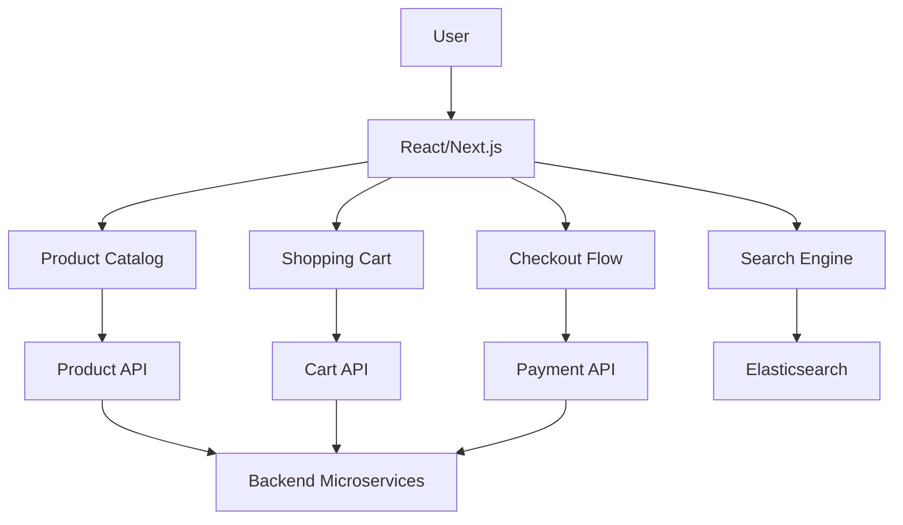

# 🛒 Amazon E-commerce Frontend Design

## R - Requirements (15%)

### Functional Requirements
- Product catalog browsing
- Search and filtering
- Shopping cart management
- Checkout process
- User reviews and ratings
- Order tracking

### Non-Functional Requirements
- Handle Black Friday traffic spikes
- &lt;2s page load times
- 99.99% availability
- Mobile-first design

## A - Architecture (20%)



### Key Components
- Product Listing & Details
- Search & Filter Interface
- Shopping Cart
- Checkout Flow
- User Account Management

## D - Data Model (10%)

```typescript
interface Product {
  id: string;
  name: string;
  price: number;
  images: string[];
  description: string;
  specifications: Record<string, any>;
  reviews: Review[];
  inventory: number;
}

interface CartItem {
  productId: string;
  quantity: number;
  selectedVariant?: string;
}
```

## I - Interface (15%)

```typescript
interface ProductListProps {
  products: Product[];
  filters: ProductFilters;
  onFilterChange: (filters: ProductFilters) => void;
  onAddToCart: (productId: string) => void;
}

interface SearchAPI {
  searchProducts(query: string, filters: ProductFilters): Promise<Product[]>;
  getSuggestions(query: string): Promise<string[]>;
}
```

## O - Optimizations (40%)

### Performance
- Server-side rendering for SEO
- Image optimization and lazy loading
- Code splitting by routes
- Aggressive caching strategies

### Conversion Optimization
- A/B testing framework
- Personalized recommendations
- One-click purchasing
- Progressive web app features