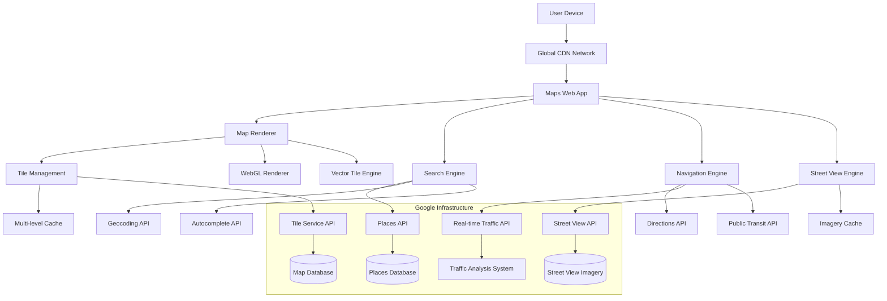

# 🗺️ Google Maps Frontend Design

## R - Requirements (15%)

### Functional Requirements
- **Interactive Map Rendering**: Smooth zoom (1-22 levels), pan, rotate, tilt
- **Location Search**: Autocomplete with 200M+ places, business listings
- **Navigation**: Turn-by-turn directions, real-time traffic, alternate routes
- **Street View**: 360° panoramic imagery with smooth transitions
- **Offline Support**: Download maps for areas up to 120,000 km²
- **Multi-modal Transport**: Walking, driving, cycling, public transit

### Non-Functional Requirements
- **Scale**: 1B+ users, 25+ petabytes of data
- **Performance**: `<2s` initial load, 60fps interactions, `<100ms` search
- **Availability**: 99.9% uptime globally
- **Accuracy**: `<3m `GPS accuracy, real-time traffic updates
- **Accessibility**: WCAG 2.1 AA compliance, screen reader support

## A - Architecture (20%)



### Google's Real Architecture Insights

**Rendering Engine (Custom WebGL)**
- Custom WebGL shaders for map rendering
- Vector tile rendering for scalable graphics
- Level-of-detail (LOD) system for performance
- GPU-accelerated transformations

**Tile System Architecture**
- Mercator projection with 256x256 pixel tiles
- 22 zoom levels (0-21)
- Quadtree spatial indexing
- Multi-resolution tile pyramid

**Caching Strategy**
```typescript
// Google's Multi-level Caching
interface CacheStrategy {
  L1: 'Browser Memory Cache (50MB)'
  L2: 'IndexedDB Cache (500MB)'
  L3: 'Service Worker Cache (1GB)'
  L4: 'CDN Edge Cache (Global)'
  L5: 'Origin Server Cache'
}
```

## D - Data Model (10%)

```typescript
// Google's Tile System
interface MapTile {
  x: number;           // Tile X coordinate
  y: number;           // Tile Y coordinate
  z: number;           // Zoom level (0-21)
  format: 'png' | 'webp' | 'vector';
  style: 'roadmap' | 'satellite' | 'hybrid' | 'terrain';
  language: string;
  region: string;
  scale: 1 | 2;        // Retina support
  cached: boolean;
  expiryTime: number;
}

// Places Data Structure
interface Place {
  placeId: string;     // Unique Google Place ID
  name: string;
  geometry: {
    location: LatLng;
    viewport: LatLngBounds;
  };
  types: PlaceType[];  // restaurant, gas_station, etc.
  rating?: number;
  priceLevel?: 1 | 2 | 3 | 4;
  photos?: PlacePhoto[];
  reviews?: PlaceReview[];
  openingHours?: OpeningHours;
}

// Navigation Route
interface Route {
  legs: RouteLeg[];
  overview_polyline: string;  // Encoded polyline
  bounds: LatLngBounds;
  copyrights: string;
  warnings: string[];
  waypoint_order: number[];
  fare?: TransitFare;
}

// Real-time Traffic Data
interface TrafficData {
  segmentId: string;
  speed: number;       // km/h
  congestionLevel: 'light' | 'moderate' | 'heavy' | 'severe';
  incidents: TrafficIncident[];
  lastUpdated: number;
}
```

## I - Interface (15%)

```typescript
// Google Maps JavaScript API
interface GoogleMapsAPI {
  // Map Instance
  new google.maps.Map(element: HTMLElement, options: MapOptions): Map;

  // Services
  PlacesService: {
    findPlaceFromQuery(request: FindPlaceRequest): Promise<PlaceResult[]>;
    nearbySearch(request: PlaceSearchRequest): Promise<PlaceResult[]>;
    textSearch(request: TextSearchRequest): Promise<PlaceResult[]>;
  };

  DirectionsService: {
    route(request: DirectionsRequest): Promise<DirectionsResult>;
  };

  GeocoderService: {
    geocode(request: GeocoderRequest): Promise<GeocoderResult[]>;
  };
}

// Internal Component APIs
interface MapRenderer {
  setCenter(latLng: LatLng): void;
  setZoom(zoom: number): void;
  panTo(latLng: LatLng): void;
  fitBounds(bounds: LatLngBounds): void;
  addOverlay(overlay: MapOverlay): void;
  removeOverlay(overlay: MapOverlay): void;
}

// Tile Loading Interface
interface TileLoader {
  loadTile(coord: TileCoord, zoom: number): Promise<HTMLImageElement>;
  preloadTiles(bounds: LatLngBounds, zoom: number): void;
  clearCache(): void;
  getCacheSize(): number;
}
```

## O - Optimizations (40%)

### Performance Architecture

**1. Rendering Optimizations**
```typescript
// WebGL Rendering Pipeline
class MapRenderer {
  private gl: WebGLRenderingContext;
  private shaderProgram: WebGLProgram;
  private tileTextures: Map<string, WebGLTexture>;

  // Batch rendering for performance
  renderTiles(tiles: MapTile[]): void {
    // Batch draw calls to reduce GPU state changes
    const batches = this.groupTilesByTexture(tiles);
    batches.forEach(batch => this.renderBatch(batch));
  }

  // Level-of-detail optimization
  selectTileLevel(zoom: number, pixelRatio: number): number {
    return Math.min(21, Math.floor(zoom + Math.log2(pixelRatio)));
  }
}
```

**2. Tile Management System**
```typescript
class TileManager {
  private cache = new LRUCache<string, MapTile>(1000);
  private loadingQueue = new PriorityQueue<TileRequest>();

  // Predictive tile loading
  preloadTiles(viewport: Viewport, direction: Vector2): void {
    const predictedViewport = this.predictMovement(viewport, direction);
    const tilesToLoad = this.getTilesInBounds(predictedViewport);

    tilesToLoad.forEach(tile => {
      if (!this.cache.has(tile.key)) {
        this.loadingQueue.enqueue(tile, this.calculatePriority(tile));
      }
    });
  }

  // Adaptive quality based on network
  selectTileQuality(networkSpeed: number): TileQuality {
    if (networkSpeed < 1) return 'low';      // <1 Mbps
    if (networkSpeed < 5) return 'medium';   // 1-5 Mbps
    return 'high';                           // >5 Mbps
  }
}
```

**3. Network Optimization**
```typescript
// Connection-aware loading
class NetworkOptimizer {
  private connection = (navigator as any).connection;

  getOptimalTileFormat(): 'webp' | 'png' {
    const supportsWebP = this.supportsWebP();
    const isSlowConnection = this.connection?.effectiveType === '2g';

    return supportsWebP && !isSlowConnection ? 'webp' : 'png';
  }

  // Adaptive tile loading based on connection
  getTileLoadingStrategy(): LoadingStrategy {
    const effectiveType = this.connection?.effectiveType;

    switch (effectiveType) {
      case '2g': return { concurrent: 2, quality: 'low' };
      case '3g': return { concurrent: 4, quality: 'medium' };
      case '4g': return { concurrent: 8, quality: 'high' };
      default: return { concurrent: 6, quality: 'medium' };
    }
  }
}
```

**4. Mobile-Specific Optimizations**
```typescript
// Touch gesture optimization
class GestureHandler {
  private touchStartTime: number;
  private lastPinchDistance: number;

  // Optimized pan handling
  handlePan(deltaX: number, deltaY: number): void {
    // Use requestAnimationFrame for smooth panning
    requestAnimationFrame(() => {
      this.map.panBy(deltaX, deltaY);
    });
  }

  // Momentum scrolling
  handlePanEnd(velocity: Vector2): void {
    if (velocity.magnitude() > 100) {
      this.startMomentumPan(velocity);
    }
  }

  // Pinch-to-zoom optimization
  handlePinch(scale: number, center: Point): void {
    const newZoom = this.map.getZoom() + Math.log2(scale);
    this.map.setZoom(newZoom, center);
  }
}
```

**5. Memory Management**
```typescript
class MemoryManager {
  private readonly MAX_CACHE_SIZE = 100 * 1024 * 1024; // 100MB
  private tileCache = new Map<string, CachedTile>();

  // Intelligent cache eviction
  evictTiles(): void {
    const tiles = Array.from(this.tileCache.values())
      .sort((a, b) => {
        // Prioritize by: recency, zoom level, viewport distance
        const scoreA = this.calculateEvictionScore(a);
        const scoreB = this.calculateEvictionScore(b);
        return scoreB - scoreA;
      });

    // Remove least important tiles
    while (this.getCacheSize() > this.MAX_CACHE_SIZE && tiles.length > 0) {
      const tile = tiles.pop()!;
      this.tileCache.delete(tile.key);
      tile.texture?.dispose();
    }
  }
}
```

### Real-world Performance Metrics
- **Tile Loading**: `<200ms` for 90th percentile
- **Search Latency**: `<100ms` for autocomplete
- **Memory Usage**: `<150MB` on mobile devices
- **Battery Impact**: `<2%` per hour of active use
- **Data Usage**: 1-5MB per minute of navigation

### Google's Infrastructure Scale
- **25+ Petabytes** of map data
- **220+ Countries** covered
- **99.9% Uptime** globally
- **1000+ CDN** edge locations
- **Real-time updates** from 1B+ Android devices

### Advanced Mobile Optimizations

**Battery & Performance**
- GPS duty cycling to preserve battery
- Adaptive frame rate (30fps on low-end devices)
- Background tile prefetching during charging
- Thermal throttling awareness

**Network Efficiency**
- Delta updates for traffic data
- Compressed vector tiles (50% smaller)
- HTTP/2 multiplexing for tile requests
- Offline-first architecture with sync
