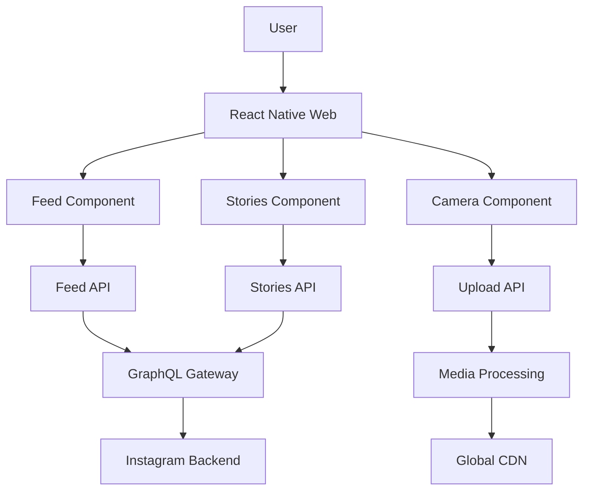

# 📱 Instagram Feed Frontend Design

## R - Requirements (15%)

### Functional Requirements
- Infinite scrolling feed
- Image/video posts with interactions
- Stories feature
- Direct messaging
- User profiles
- Content creation tools

### Non-Functional Requirements
- Support 1B+ users
- Real-time interactions
- Mobile-first experience
- Global content delivery

## A - Architecture (20%)



### Key Components
- Infinite Feed Scroller
- Stories Viewer
- Camera & Upload Interface
- Direct Message System
- User Profile Pages

## D - Data Model (10%)

```typescript
interface Post {
  id: string;
  userId: string;
  mediaUrl: string;
  caption: string;
  likes: number;
  comments: Comment[];
  timestamp: number;
  location?: Location;
}

interface Story {
  id: string;
  userId: string;
  mediaUrl: string;
  expiresAt: number;
  viewers: string[];
}
```

## I - Interface (15%)

```typescript
interface FeedProps {
  posts: Post[];
  onLike: (postId: string) => void;
  onComment: (postId: string, comment: string) => void;
  onLoadMore: () => void;
}

interface GraphQLQueries {
  getFeed(userId: string, cursor?: string): Promise<Post[]>;
  getStories(userId: string): Promise<Story[]>;
}
```

## O - Optimizations (40%)

### Mobile Performance
- Image compression and WebP format
- Lazy loading with intersection observer
- Virtual scrolling for large feeds
- Offline-first architecture

### User Engagement
- Predictive content loading
- Real-time like animations
- Progressive image loading
- Touch gesture optimization