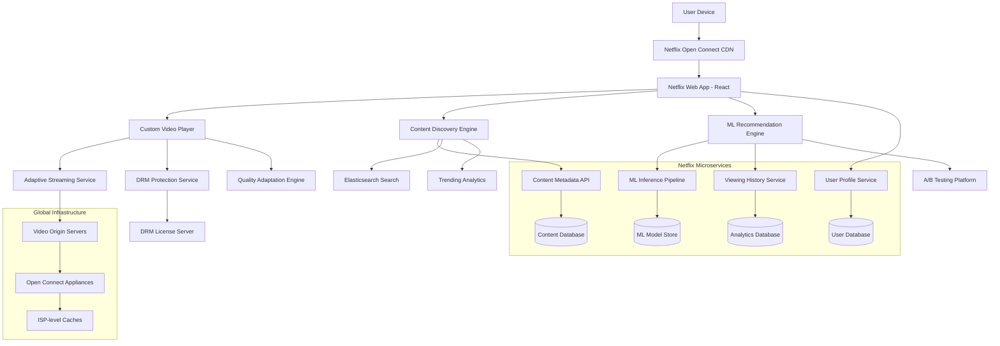

# 🎬 Netflix Frontend Design

## R - Requirements (15%)

### Functional Requirements
- **Content Browsing**: 15,000+ titles, personalized rows, infinite scroll
- **Video Streaming**: Adaptive bitrate (240p-4K), HDR support, 5.1 audio
- **User Profiles**: Up to 5 profiles per account, parental controls, viewing history
- **Search & Discovery**: Real-time search, genre filtering, trending content
- **Recommendations**: ML-powered personalization, 80% of viewing from recommendations
- **Offline Downloads**: Mobile/tablet support, up to 100 downloads per device
- **Multi-device Sync**: Continue watching across devices, simultaneous streams

### Non-Functional Requirements
- **Scale**: 230M+ subscribers, 1B+ hours watched daily
- **Performance**: &lt;3s page load, &lt;10s video start time, 99.9% uptime
- **Quality**: Adaptive streaming, &lt;1% rebuffering rate
- **Global**: 190+ countries, 30+ languages, regional content
- **Accessibility**: Audio descriptions, subtitles in 20+ languages

## A - Architecture (20%)



### Netflix's Real Architecture

**Open Connect CDN**
- 17,000+ servers in 1,000+ locations
- 95% of traffic served from ISP networks
- Custom appliances at ISP locations
- Predictive caching based on viewing patterns

**Microservices Architecture**
- 700+ microservices
- Service mesh with Zuul gateway
- Hystrix for circuit breaking
- Eureka for service discovery

**Video Delivery Pipeline**
```typescript
// Netflix's Streaming Architecture
interface StreamingPipeline {
  encoding: 'Multiple bitrates (240p-4K), VP9/H.264/AV1';
  packaging: 'DASH/HLS adaptive streaming';
  encryption: 'Widevine/PlayReady/FairPlay DRM';
  delivery: 'Open Connect CDN';
  adaptation: 'Client-side ABR algorithm';
}
```

## D - Data Model (10%)

```typescript
// Netflix Content Structure
interface NetflixContent {
  id: string;                    // Unique content ID
  type: 'movie' | 'series' | 'documentary' | 'standup';
  title: string;
  description: string;
  releaseYear: number;
  duration?: number;             // For movies (minutes)
  seasons?: Season[];            // For series
  genres: Genre[];
  maturityRating: string;        // G, PG, PG-13, R, etc.
  languages: Language[];
  subtitles: Language[];
  audioTracks: AudioTrack[];
  
  // Metadata for recommendations
  cast: Person[];
  directors: Person[];
  producers: Person[];
  tags: string[];               // Internal tagging for ML
  
  // Streaming data
  videoFiles: VideoFile[];      // Different quality versions
  thumbnails: Thumbnail[];      // Various sizes and timestamps
  trailers: VideoFile[];
  
  // Regional availability
  regions: string[];            // Country codes where available
  licensingInfo: LicensingInfo;
}

// Video File Structure
interface VideoFile {
  quality: '240p' | '360p' | '480p' | '720p' | '1080p' | '4K';
  bitrate: number;              // kbps
  codec: 'H.264' | 'H.265' | 'VP9' | 'AV1';
  url: string;                  // CDN URL
  fileSize: number;             // bytes
  checksum: string;             // For integrity verification
  drmProtected: boolean;
}

// User Profile & Viewing Data
interface UserProfile {
  id: string;
  name: string;
  avatar: string;
  isKids: boolean;
  language: string;
  maturityLevel: string;
  
  // Viewing behavior
  watchHistory: ViewingRecord[];
  myList: string[];             // Saved content IDs
  ratings: Rating[];            // User ratings
  preferences: UserPreferences;
  
  // Recommendation data
  genrePreferences: GenreWeight[];
  actorPreferences: PersonWeight[];
  viewingPatterns: ViewingPattern[];
}

// Viewing Analytics
interface ViewingRecord {
  contentId: string;
  profileId: string;
  startTime: number;
  endTime: number;
  watchedDuration: number;      // seconds
  totalDuration: number;        // seconds
  completionRate: number;       // 0-1
  device: DeviceInfo;
  quality: string;
  bandwidth: number;            // kbps
  rebufferEvents: RebufferEvent[];
  pauseEvents: PauseEvent[];
}

// Recommendation Engine Data
interface RecommendationContext {
  userId: string;
  profileId: string;
  timeOfDay: number;
  dayOfWeek: number;
  device: string;
  location: string;
  recentViewing: string[];      // Last 10 watched content IDs
  currentMood?: 'comedy' | 'drama' | 'action' | 'documentary';
}
```

## I - Interface (15%)

```typescript
// Netflix Player API
interface NetflixPlayer {
  // Playback control
  play(): Promise<void>;
  pause(): void;
  seek(time: number): void;
  setPlaybackRate(rate: number): void;
  
  // Quality control
  setQuality(quality: VideoQuality): void;
  enableAutoQuality(): void;
  getCurrentQuality(): VideoQuality;
  getAvailableQualities(): VideoQuality[];
  
  // Audio/Subtitle control
  setAudioTrack(trackId: string): void;
  setSubtitleTrack(trackId: string): void;
  toggleSubtitles(): void;
  
  // Events
  onProgress(callback: (progress: PlaybackProgress) => void): void;
  onQualityChange(callback: (quality: VideoQuality) => void): void;
  onError(callback: (error: PlayerError) => void): void;
  onBuffering(callback: (isBuffering: boolean) => void): void;
}

// Content Discovery API
interface ContentAPI {
  // Browse content
  getHomepage(profileId: string): Promise<ContentRow[]>;
  getGenre(genreId: string, page: number): Promise<ContentPage>;
  getTrending(region: string): Promise<Content[]>;
  getNewReleases(): Promise<Content[]>;
  
  // Search
  search(query: string, filters?: SearchFilters): Promise<SearchResult[]>;
  getSearchSuggestions(query: string): Promise<string[]>;
  
  // Recommendations
  getRecommendations(profileId: string, context: RecommendationContext): Promise<Content[]>;
  getSimilarContent(contentId: string): Promise<Content[]>;
  
  // User data
  getMyList(profileId: string): Promise<Content[]>;
  addToMyList(profileId: string, contentId: string): Promise<void>;
  rateContent(profileId: string, contentId: string, rating: number): Promise<void>;
}

// Streaming Service Interface
interface StreamingService {
  getManifest(contentId: string, profileId: string): Promise<StreamingManifest>;
  getLicense(contentId: string, challenge: Uint8Array): Promise<Uint8Array>;
  reportPlaybackStats(stats: PlaybackStats): void;
  
  // Adaptive bitrate
  selectInitialQuality(bandwidth: number, device: DeviceInfo): VideoQuality;
  adaptQuality(currentStats: NetworkStats): VideoQuality;
}

// Component Interfaces
interface VideoPlayerProps {
  contentId: string;
  startTime?: number;
  autoplay?: boolean;
  onProgress: (progress: PlaybackProgress) => void;
  onComplete: () => void;
  onError: (error: PlayerError) => void;
}

interface ContentRowProps {
  title: string;
  contents: Content[];
  rowType: 'trending' | 'recommendations' | 'genre' | 'continue-watching';
  onContentClick: (contentId: string) => void;
  onSeeAll?: () => void;
}
```

## O - Optimizations (40%)

### Streaming Performance Architecture

**1. Adaptive Bitrate Algorithm**
```typescript
class NetflixABRAlgorithm {
  private bandwidthHistory: number[] = [];
  private bufferHealth: number = 0;
  private currentQuality: VideoQuality;
  
  // Netflix's custom ABR logic
  selectQuality(networkStats: NetworkStats, deviceCapabilities: DeviceInfo): VideoQuality {
    const bandwidth = this.estimateBandwidth(networkStats);
    const bufferLevel = this.getBufferLevel();
    
    // Conservative approach to avoid rebuffering
    const safetyFactor = this.calculateSafetyFactor(bufferLevel);
    const targetBitrate = bandwidth * safetyFactor;
    
    // Consider device capabilities
    const maxSupportedQuality = this.getMaxQuality(deviceCapabilities);
    
    return this.selectOptimalQuality(targetBitrate, maxSupportedQuality);
  }
  
  // Bandwidth estimation with multiple algorithms
  private estimateBandwidth(stats: NetworkStats): number {
    // Combine throughput-based and latency-based estimates
    const throughputEstimate = this.calculateThroughput(stats);
    const latencyAdjustment = this.adjustForLatency(stats.latency);
    
    return Math.min(throughputEstimate * latencyAdjustment, stats.maxBandwidth);
  }
  
  // Buffer-aware quality selection
  private calculateSafetyFactor(bufferLevel: number): number {
    if (bufferLevel < 10) return 0.7;      // Conservative when buffer low
    if (bufferLevel < 30) return 0.85;     // Moderate safety margin
    return 0.95;                           // Aggressive when buffer healthy
  }
}
```

**2. Predictive Caching System**
```typescript
class PredictiveCaching {
  private viewingPatterns: Map<string, ViewingPattern>;
  private popularContent: Set<string>;
  
  // Predict what user might watch next
  async predictNextContent(profileId: string): Promise<string[]> {
    const userHistory = await this.getUserHistory(profileId);
    const timeContext = this.getTimeContext();
    const deviceContext = this.getDeviceContext();
    
    // ML model inference for next content prediction
    const predictions = await this.mlModel.predict({
      userHistory,
      timeContext,
      deviceContext,
      popularContent: Array.from(this.popularContent)
    });
    
    return predictions.slice(0, 10); // Top 10 predictions
  }
  
  // Preload content based on predictions
  async preloadContent(contentIds: string[]): Promise<void> {
    const preloadPromises = contentIds.map(async (contentId) => {
      // Preload first few seconds of video
      const manifest = await this.getStreamingManifest(contentId);
      const initialSegments = manifest.segments.slice(0, 3); // First 30 seconds
      
      return this.preloadSegments(initialSegments);
    });
    
    await Promise.allSettled(preloadPromises);
  }
}
```

**3. Content Delivery Optimization**
```typescript
class ContentDeliveryOptimizer {
  private cdnNodes: CDNNode[];
  private userLocation: GeolocationData;
  
  // Select optimal CDN node
  selectOptimalCDN(contentId: string): CDNNode {
    const availableNodes = this.cdnNodes.filter(node => 
      node.hasContent(contentId) && node.isHealthy()
    );
    
    return availableNodes.reduce((best, current) => {
      const bestScore = this.calculateNodeScore(best);
      const currentScore = this.calculateNodeScore(current);
      return currentScore > bestScore ? current : best;
    });
  }
  
  // CDN node scoring algorithm
  private calculateNodeScore(node: CDNNode): number {
    const latencyScore = 1 / (node.latency + 1);           // Lower latency = higher score
    const bandwidthScore = node.availableBandwidth / 1000;  // Higher bandwidth = higher score
    const loadScore = 1 / (node.currentLoad + 0.1);        // Lower load = higher score
    const proximityScore = 1 / (node.distance + 1);        // Closer = higher score
    
    return latencyScore * 0.3 + bandwidthScore * 0.3 + loadScore * 0.2 + proximityScore * 0.2;
  }
  
  // Failover mechanism
  async handleCDNFailure(failedNode: CDNNode, contentId: string): Promise<void> {
    // Remove failed node from rotation
    this.markNodeAsUnhealthy(failedNode);
    
    // Select backup node
    const backupNode = this.selectOptimalCDN(contentId);
    
    // Seamlessly switch streaming source
    await this.switchStreamingSource(backupNode);
    
    // Schedule health check for failed node
    this.scheduleHealthCheck(failedNode);
  }
}
```

**4. UI Performance Optimization**
```typescript
class NetflixUIOptimizer {
  private intersectionObserver: IntersectionObserver;
  private imageCache = new Map<string, HTMLImageElement>();
  
  // Lazy loading for content thumbnails
  setupLazyLoading(): void {
    this.intersectionObserver = new IntersectionObserver((entries) => {
      entries.forEach(entry => {
        if (entry.isIntersecting) {
          this.loadContentThumbnail(entry.target as HTMLElement);
        }
      });
    }, { rootMargin: '100px' }); // Load 100px before entering viewport
  }
  
  // Progressive image loading
  async loadContentThumbnail(element: HTMLElement): Promise<void> {
    const contentId = element.dataset.contentId!;
    const thumbnailUrl = element.dataset.thumbnailUrl!;
    
    // Show low-quality placeholder first
    const placeholder = await this.loadLowQualityImage(contentId);
    element.style.backgroundImage = `url(${placeholder})`;
    
    // Load high-quality image in background
    const highQualityImage = await this.loadHighQualityImage(thumbnailUrl);
    element.style.backgroundImage = `url(${highQualityImage.src})`;
  }
  
  // Virtual scrolling for large content lists
  implementVirtualScrolling(container: HTMLElement, items: Content[]): void {
    const itemHeight = 200; // Height of each content item
    const containerHeight = container.clientHeight;
    const visibleItems = Math.ceil(containerHeight / itemHeight) + 2; // Buffer
    
    let scrollTop = 0;
    
    container.addEventListener('scroll', () => {
      scrollTop = container.scrollTop;
      const startIndex = Math.floor(scrollTop / itemHeight);
      const endIndex = Math.min(startIndex + visibleItems, items.length);
      
      this.renderVisibleItems(items.slice(startIndex, endIndex), startIndex);
    });
  }
}
```

**5. Recommendation Engine Optimization**
```typescript
class RecommendationOptimizer {
  private modelCache = new Map<string, MLModel>();
  private featureStore: FeatureStore;
  
  // Real-time recommendation generation
  async generateRecommendations(profileId: string, context: RecommendationContext): Promise<Content[]> {
    // Get user features from feature store
    const userFeatures = await this.featureStore.getUserFeatures(profileId);
    const contextFeatures = this.extractContextFeatures(context);
    
    // Use cached model for inference
    const model = await this.getOrLoadModel('recommendation-v2');
    
    // Generate recommendations
    const scores = await model.predict({
      userFeatures,
      contextFeatures,
      candidateContent: await this.getCandidateContent(profileId)
    });
    
    // Apply business rules and diversity
    return this.applyBusinessRules(scores, context);
  }
  
  // A/B testing for recommendations
  async getRecommendationVariant(profileId: string): Promise<RecommendationVariant> {
    const userId = await this.getUserId(profileId);
    const experimentConfig = await this.getExperimentConfig('rec-algorithm-test');
    
    // Consistent assignment based on user ID
    const variant = this.assignVariant(userId, experimentConfig);
    
    return variant;
  }
}
```

### Netflix's Real-world Performance

**Streaming Metrics**
- **Video Start Time**: &lt;10s (95th percentile)
- **Rebuffering Rate**: &lt;1% globally
- **Quality Adaptation**: &lt;2s switching time
- **CDN Hit Rate**: >95% from Open Connect
- **Concurrent Streams**: 15M+ peak

**Infrastructure Scale**
- **230M+ subscribers** globally
- **15,000+ titles** in catalog
- **1B+ hours** watched daily
- **17,000+ CDN servers** worldwide
- **700+ microservices** in production

**Mobile Optimizations**
- **Offline downloads** with encryption
- **Adaptive UI** for different screen sizes
- **Background playback** continuation
- **Data saver mode** for limited plans
- **Smart downloads** based on WiFi availability

**Accessibility Features**
- **Audio descriptions** for visually impaired
- **Closed captions** in 20+ languages
- **High contrast mode** support
- **Keyboard navigation** optimization
- **Screen reader** compatibility