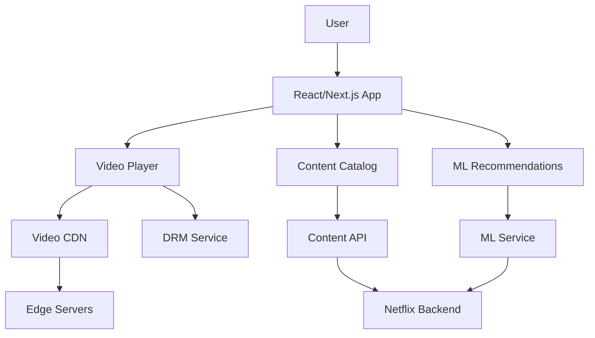
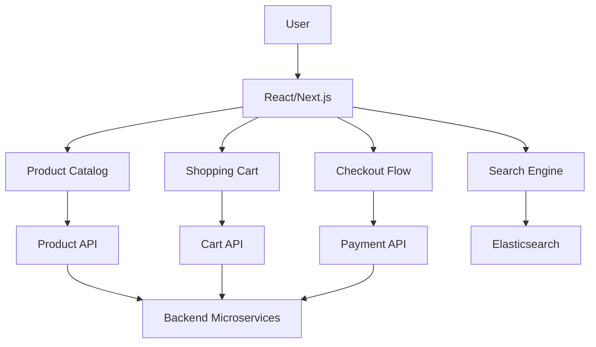
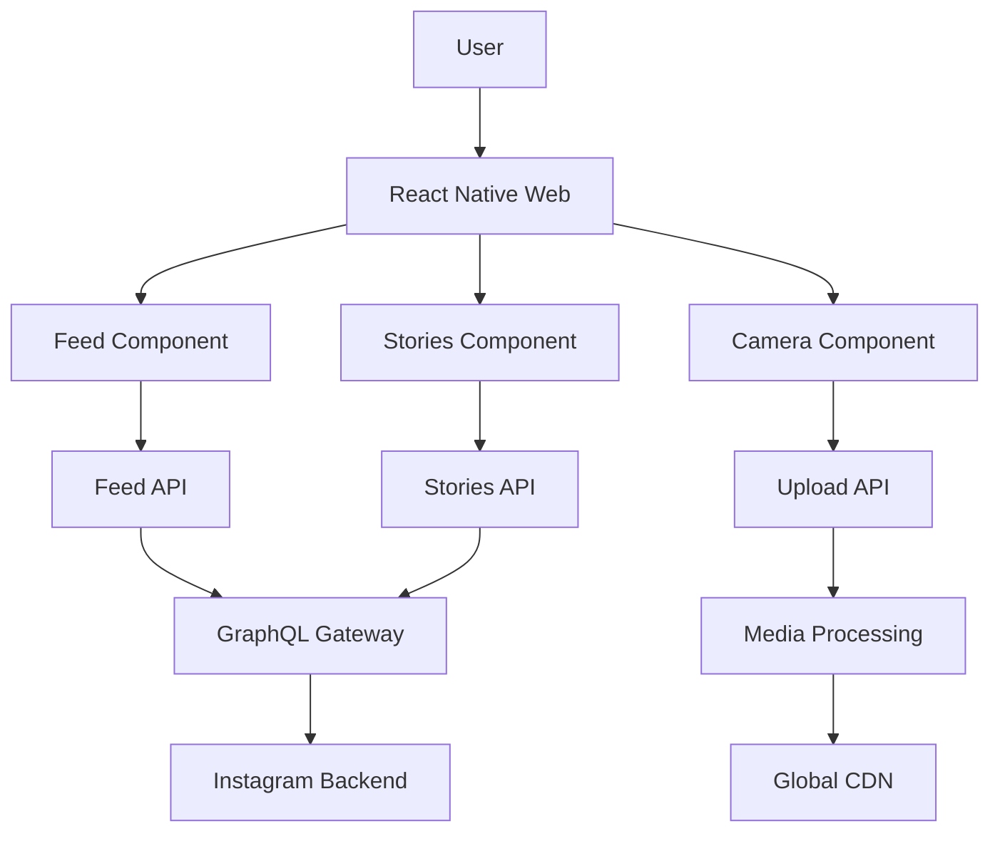
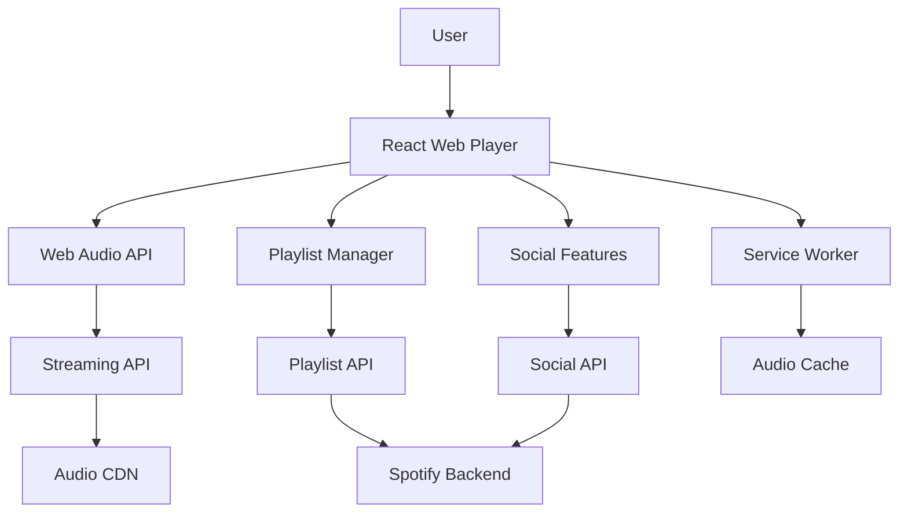

## Overview

RADIO is a structured approach to frontend system design interviews:

- **R**equirements exploration (15% of time)
- **A**rchitecture design (20% of time)
- **D**ata model definition (10% of time)
- **I**nterface specification (15% of time)
- **O**ptimizations and deep dive (40% of time)

## R - Requirements Exploration (15%)

### Key Questions to Ask

1. **Core Use Cases**
   - Which specific features should we focus on?
   - What are the primary user flows?

2. **Requirements Classification**
   - Functional requirements (must-haves)
   - Non-functional requirements (nice-to-haves)

3. **Technical Constraints**
   - Supported devices/platforms
   - Offline support needs
   - Performance requirements
   - Target users

4. **Design & Styling Requirements**
   - Theme support (light/dark mode)
   - Brand guidelines
   - Design system requirements
   - Responsive design needs

### Device Support Matrix

```
Breakpoints to Consider:
- Mobile: < 768px
- Tablet: 768px - 1024px
- Desktop: > 1024px
- Large Desktop: > 1440px
```

💡 **Pro Tip**: Write down agreed requirements for reference throughout the interview

## A - Architecture Design (20%)

### Key Components to Consider

1. **Server** (treat as black box)
2. **View** (user interface)
3. **Controller** (user interaction handling)
4. **Model/Client Store** (data management)

### Rendering Strategies

1. **Client-Side Rendering (CSR)**
   - Full JavaScript bundle
   - Good for dynamic content
   - SEO challenges

2. **Server-Side Rendering (SSR)**
   - Better initial load
   - Good for SEO
   - Higher server load

3. **Static Site Generation (SSG)**
   - Best performance
   - Limited dynamic content
   - Good for content-heavy sites

4. **Incremental Static Regeneration (ISR)**
   - Hybrid approach
   - Balance of dynamic and static

### Theming Architecture

1. **Theme Implementation**
   - CSS Variables
   - Styled-components
   - CSS-in-JS
   - CSS Modules

2. **Theme Structure**
   - Colors
   - Typography
   - Spacing
   - Breakpoints
   - Component-specific themes

### Design Principles

- Separation of concerns
- Component modularity
- Computation placement (client vs server)
- Responsive design patterns

💡 **Pro Tip**: Draw diagrams using tools like diagrams.net or Excalidraw

## D - Data Model Definition (10%)

### Data Types

1. **Server-originated Data**
   - Database-sourced
   - Shared across users/devices

2. **Client-only Data**
   - Persisted state (form inputs)
   - Ephemeral state (UI state)
   - Theme preferences
   - Device/viewport information

### Data Model Template

```
Entity:
- Fields
- Data source
- Owner component
- Relationships
- Responsive variations
```

## I - Interface Definition (15%)

### Server-Client APIs

- HTTP method
- Endpoint path
- Parameters
- Response format

### Client-Client APIs

- Function signatures
- Event listeners
- Props (for components)
- Return values

### Responsive Component Props

```TypeScript
interface ResponsiveProps {
  mobile?: React.ReactNode;
  tablet?: React.ReactNode;
  desktop?: React.ReactNode;
  breakpoints?: {
    mobile: number;
    tablet: number;
    desktop: number;
  };
}
```

## O - Optimizations & Deep Dive (40%)

### Key Areas

1. **Performance**
   - Loading optimization
   - Rendering optimization
   - Caching strategies
   - Code splitting strategies
   - Asset optimization

2. **Responsive Design Optimizations**
   - Responsive images
   - Container queries
   - CSS optimization
   - Mobile-first approach
   - Touch interactions

3. **Theme Implementation**
   - Runtime theme switching
   - Prefers-color-scheme
   - CSS Variables vs CSS-in-JS
   - Performance considerations
   - Storage strategy

4. **User Experience**
   - Error handling
   - Loading states
   - Animations/transitions
   - Responsive behaviors
   - Touch gestures

5. **Technical Considerations**
   - Network handling
   - Accessibility (a11y)
   - Internationalization (i18n)
   - Security
   - Multi-device support
   - Progressive enhancement

### Rendering Optimization Techniques

1. **Component Level**
   - Lazy loading
   - Virtualization
   - Memoization
   - Code splitting

2. **Style Level**
   - Critical CSS
   - Atomic CSS
   - CSS containment
   - Container queries

3. **Asset Level**
   - Image optimization
   - Font loading
   - Icon systems
   - Responsive images

### Deep Dive Strategy

- Focus on product-critical areas
- Highlight your technical strengths
- Address unique challenges
- Consider device-specific optimizations

## Interview Tips

1. Stay organized and structured
2. Manage time according to RADIO percentages
3. Draw clear diagrams
4. Write down requirements
5. Focus on frontend aspects
6. Be ready to adapt based on interviewer feedback
7. Consider responsive design from the start
8. Address theme implementation early

Remember: This framework is flexible - adapt it based on the specific question and interviewer's interests. string) => void;
}
```

### O - Optimizations (40%)

**Real-time Performance:**
- WebSocket connection pooling
- Message batching
- Optimistic UI updates
- Virtual scrolling for chat history

**Mobile Web:**
- PWA capabilities
- Push notifications
- Offline message queue
- Touch-optimized UI

---

## 🎬 Netflix Frontend Design

### R - Requirements (15%)

**Functional Requirements:**
- Browse content catalog
- Video streaming with adaptive quality
- User profiles and recommendations
- Search and filtering
- Watchlist management
- Offline downloads (mobile)

**Non-Functional Requirements:**
- Support 200M+ subscribers
- 99.9% uptime
- &lt;3s content discovery
- Adaptive streaming quality

### A - Architecture (20%)



### D - Data Model (10%)

```typescript
interface Content {
  id: string;
  title: string;
  description: string;
  thumbnails: string[];
  videoUrl: string;
  duration: number;
  genres: string[];
  rating: string;
}

interface UserProfile {
  id: string;
  name: string;
  avatar: string;
  watchHistory: string[];
  preferences: string[];
}
```

### I - Interface (15%)

```typescript
interface VideoPlayerProps {
  src: string;
  autoplay: boolean;
  onProgress: (time: number) => void;
  onQualityChange: (quality: string) => void;
}

interface ContentAPI {
  getContent(filters: ContentFilters): Promise<Content[]>;
  getRecommendations(userId: string): Promise<Content[]>;
}
```

### O - Optimizations (40%)

**Streaming Performance:**
- Adaptive bitrate streaming
- Video preloading
- CDN optimization
- Progressive enhancement

**User Experience:**
- Infinite scroll with virtualization
- Image lazy loading
- Predictive prefetching
- Smooth transitions

---

## 🛒 Amazon E-commerce Frontend

### R - Requirements (15%)

**Functional Requirements:**
- Product catalog browsing
- Search and filtering
- Shopping cart management
- Checkout process
- User reviews and ratings
- Order tracking

**Non-Functional Requirements:**
- Handle Black Friday traffic spikes
- &lt;2s page load times
- 99.99% availability
- Mobile-first design

### A - Architecture (20%)



### D - Data Model (10%)

```typescript
interface Product {
  id: string;
  name: string;
  price: number;
  images: string[];
  description: string;
  specifications: Record<string, any>;
  reviews: Review[];
  inventory: number;
}

interface CartItem {
  productId: string;
  quantity: number;
  selectedVariant?: string;
}
```

### I - Interface (15%)

```typescript
interface ProductListProps {
  products: Product[];
  filters: ProductFilters;
  onFilterChange: (filters: ProductFilters) => void;
  onAddToCart: (productId: string) => void;
}

interface SearchAPI {
  searchProducts(query: string, filters: ProductFilters): Promise<Product[]>;
  getSuggestions(query: string): Promise<string[]>;
}
```

### O - Optimizations (40%)

**Performance:**
- Server-side rendering for SEO
- Image optimization and lazy loading
- Code splitting by routes
- Aggressive caching strategies

**Conversion Optimization:**
- A/B testing framework
- Personalized recommendations
- One-click purchasing
- Progressive web app features

---

## 📱 Instagram Feed Frontend

### R - Requirements (15%)

**Functional Requirements:**
- Infinite scrolling feed
- Image/video posts with interactions
- Stories feature
- Direct messaging
- User profiles
- Content creation tools

**Non-Functional Requirements:**
- Support 1B+ users
- Real-time interactions
- Mobile-first experience
- Global content delivery

### A - Architecture (20%)



### D - Data Model (10%)

```typescript
interface Post {
  id: string;
  userId: string;
  mediaUrl: string;
  caption: string;
  likes: number;
  comments: Comment[];
  timestamp: number;
  location?: Location;
}

interface Story {
  id: string;
  userId: string;
  mediaUrl: string;
  expiresAt: number;
  viewers: string[];
}
```

### I - Interface (15%)

```typescript
interface FeedProps {
  posts: Post[];
  onLike: (postId: string) => void;
  onComment: (postId: string, comment: string) => void;
  onLoadMore: () => void;
}

interface GraphQLQueries {
  getFeed(userId: string, cursor?: string): Promise<Post[]>;
  getStories(userId: string): Promise<Story[]>;
}
```

### O - Optimizations (40%)

**Mobile Performance:**
- Image compression and WebP format
- Lazy loading with intersection observer
- Virtual scrolling for large feeds
- Offline-first architecture

**User Engagement:**
- Predictive content loading
- Real-time like animations
- Progressive image loading
- Touch gesture optimization

---

## 🎵 Spotify Web Player

### R - Requirements (15%)

**Functional Requirements:**
- Music streaming and playback
- Playlist management
- Search and discovery
- Social features (sharing, following)
- Offline playback
- Cross-device synchronization

**Non-Functional Requirements:**
- High-quality audio streaming
- &lt;1s track start time
- Support for 400M+ users
- Real-time sync across devices

### A - Architecture (20%)



### D - Data Model (10%)

```typescript
interface Track {
  id: string;
  name: string;
  artist: string;
  album: string;
  duration: number;
  audioUrl: string;
  artwork: string;
}

interface Playlist {
  id: string;
  name: string;
  tracks: Track[];
  owner: string;
  isPublic: boolean;
}
```

### I - Interface (15%)

```typescript
interface AudioPlayerProps {
  currentTrack: Track;
  isPlaying: boolean;
  volume: number;
  onPlay: () => void;
  onPause: () => void;
  onSeek: (time: number) => void;
}

interface StreamingAPI {
  getTrackStream(trackId: string, quality: string): Promise<string>;
  getPlaylist(playlistId: string): Promise<Playlist>;
}
```

### O - Optimizations (40%)

**Audio Performance:**
- Adaptive audio quality
- Audio preloading and buffering
- Gapless playback
- Web Audio API optimizations

**User Experience:**
- Keyboard shortcuts
- Media session API integration
- Background playback
- Cross-device sync

---

## 💡 Common Optimization Patterns

### Performance Optimization Checklist

✅ **Loading Performance**
- Code splitting and lazy loading
- Critical CSS extraction
- Resource preloading
- Service worker caching

✅ **Runtime Performance**
- Virtual scrolling for large lists
- Debounced search inputs
- Memoization of expensive calculations
- Optimistic UI updates

✅ **Mobile Optimization**
- Touch gesture handling
- Responsive images
- Progressive web app features
- Offline functionality

✅ **Accessibility**
- Keyboard navigation
- Screen reader support
- Color contrast compliance
- Focus management

### Scalability Patterns

1. **Micro-frontends** for large teams
2. **Component libraries** for consistency
3. **Design systems** for scalable UI
4. **Feature flags** for gradual rollouts
5. **A/B testing** frameworks
6. **Monitoring and analytics** integration

### Security Considerations

- Content Security Policy (CSP)
- XSS prevention
- HTTPS enforcement
- Secure authentication flows
- Input validation and sanitization
