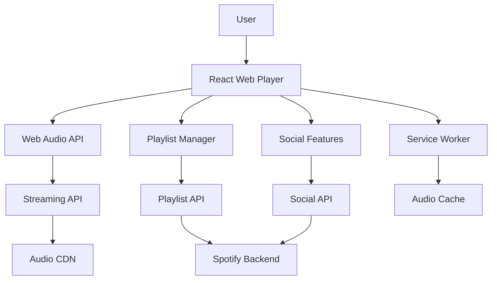

# 🎵 Spotify Web Player Frontend Design

## R - Requirements (15%)

### Functional Requirements
- Music streaming and playback
- Playlist management
- Search and discovery
- Social features (sharing, following)
- Offline playback
- Cross-device synchronization

### Non-Functional Requirements
- High-quality audio streaming
- &lt;1s track start time
- Support for 400M+ users
- Real-time sync across devices

## A - Architecture (20%)



### Key Components
- Audio Player Engine
- Playlist Interface
- Search & Discovery
- Social Features
- Cross-device Sync

## D - Data Model (10%)

```typescript
interface Track {
  id: string;
  name: string;
  artist: string;
  album: string;
  duration: number;
  audioUrl: string;
  artwork: string;
}

interface Playlist {
  id: string;
  name: string;
  tracks: Track[];
  owner: string;
  isPublic: boolean;
}
```

## I - Interface (15%)

```typescript
interface AudioPlayerProps {
  currentTrack: Track;
  isPlaying: boolean;
  volume: number;
  onPlay: () => void;
  onPause: () => void;
  onSeek: (time: number) => void;
}

interface StreamingAPI {
  getTrackStream(trackId: string, quality: string): Promise<string>;
  getPlaylist(playlistId: string): Promise<Playlist>;
}
```

## O - Optimizations (40%)

### Audio Performance
- Adaptive audio quality
- Audio preloading and buffering
- Gapless playback
- Web Audio API optimizations

### User Experience
- Keyboard shortcuts
- Media session API integration
- Background playback
- Cross-device sync