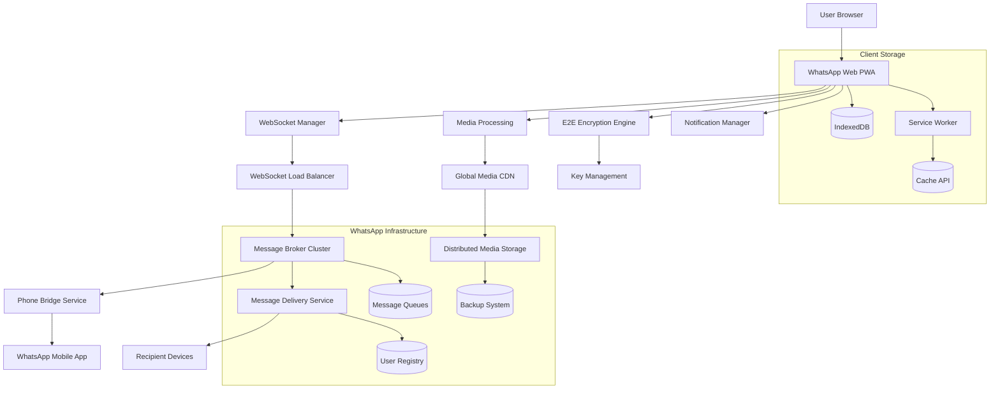

# 💬 WhatsApp Web Frontend Design

## R - Requirements (15%)

### Functional Requirements
- **Real-time Messaging**: &lt;100ms message delivery, typing indicators
- **Media Sharing**: Images, videos, documents, voice messages (up to 100MB)
- **Group Chats**: Up to 1024 participants, admin controls, mentions
- **Message Status**: Sent (✓), Delivered (✓✓), Read (✓✓ blue)
- **End-to-End Encryption**: Signal Protocol implementation
- **Voice/Video Calls**: WebRTC-based, up to 32 participants
- **Multi-device Sync**: Real-time sync across phone and web

### Non-Functional Requirements
- **Scale**: 2B+ users, 100B+ messages daily
- **Performance**: &lt;50ms message send, &lt;200ms media upload
- **Availability**: 99.9% uptime, graceful degradation
- **Security**: E2E encryption, no message storage on servers
- **Bandwidth**: Optimized for 2G networks (64kbps)

## A - Architecture (20%)



### WhatsApp's Real Architecture

**Multi-Device Architecture**
- Primary device (phone) acts as source of truth
- Web client syncs through phone initially
- Direct server connection after initial sync
- End-to-end encryption maintained across devices

**Message Delivery System**
```typescript
// WhatsApp's Message Delivery Pipeline
interface MessagePipeline {
  stage1: 'Client Encryption (Signal Protocol)';
  stage2: 'WebSocket Transmission';
  stage3: 'Server Routing (No Decryption)';
  stage4: 'Recipient Delivery';
  stage5: 'Delivery Confirmation';
  stage6: 'Read Receipt (Optional)';
}
```

**Connection Management**
- Persistent WebSocket connections
- Automatic reconnection with exponential backoff
- Connection pooling across data centers
- Failover to backup servers

## D - Data Model (10%)

```typescript
// WhatsApp's Message Structure
interface WhatsAppMessage {
  id: string;                    // Unique message ID
  chatId: string;               // Chat identifier
  senderId: string;             // Sender's user ID
  timestamp: number;            // Unix timestamp
  type: MessageType;            // text, image, video, audio, document
  content: EncryptedContent;    // E2E encrypted content
  status: MessageStatus;        // sent, delivered, read
  quotedMessage?: string;       // Reply to message ID
  mentions?: string[];          // Mentioned user IDs
  reactions?: MessageReaction[]; // Message reactions
  editHistory?: EditRecord[];   // Message edit history
}

// Chat Data Structure
interface Chat {
  id: string;                   // Chat ID (phone number or group ID)
  type: 'individual' | 'group';
  participants: Participant[];
  lastMessage: WhatsAppMessage;
  unreadCount: number;
  isPinned: boolean;
  isMuted: boolean;
  muteUntil?: number;
  wallpaper?: string;
  disappearingMessages?: number; // Timer in seconds
}

// Group-specific data
interface GroupChat extends Chat {
  name: string;
  description?: string;
  icon?: string;
  admins: string[];            // Admin user IDs
  createdBy: string;
  createdAt: number;
  inviteLink?: string;
  settings: GroupSettings;
}

// Media Message Structure
interface MediaMessage {
  messageId: string;
  mediaType: 'image' | 'video' | 'audio' | 'document';
  fileName: string;
  fileSize: number;
  mimeType: string;
  encryptedUrl: string;        // CDN URL for encrypted media
  mediaKey: Uint8Array;        // Encryption key for media
  thumbnail?: string;          // Base64 thumbnail
  duration?: number;           // For audio/video
  dimensions?: { width: number; height: number; };
}

// Encryption Keys (Signal Protocol)
interface EncryptionKeys {
  identityKey: Uint8Array;
  signedPreKey: Uint8Array;
  oneTimePreKeys: Uint8Array[];
  sessionKeys: Map<string, Uint8Array>; // Per-chat session keys
}
```

## I - Interface (15%)

```typescript
// WhatsApp Web Socket Protocol
interface WhatsAppWebSocket {
  // Connection management
  connect(authToken: string): Promise<void>;
  disconnect(): void;
  
  // Message operations
  sendMessage(message: OutgoingMessage): Promise<MessageResult>;
  markAsRead(chatId: string, messageId: string): void;
  
  // Real-time events
  onMessage(callback: (message: IncomingMessage) => void): void;
  onTyping(callback: (chatId: string, isTyping: boolean) => void): void;
  onPresence(callback: (userId: string, presence: PresenceStatus) => void): void;
  onMessageStatus(callback: (messageId: string, status: MessageStatus) => void): void;
}

// Media Upload API
interface MediaUploadAPI {
  uploadMedia(file: File, type: MediaType): Promise<MediaUploadResult>;
  downloadMedia(mediaId: string, mediaKey: Uint8Array): Promise<Blob>;
  generateThumbnail(file: File): Promise<string>;
}

// Encryption Service Interface
interface EncryptionService {
  encryptMessage(content: string, chatId: string): Promise<EncryptedContent>;
  decryptMessage(encrypted: EncryptedContent, chatId: string): Promise<string>;
  generateKeys(): Promise<KeyPair>;
  establishSession(chatId: string, publicKey: Uint8Array): Promise<void>;
}

// Chat Component Interface
interface ChatWindowProps {
  chatId: string;
  messages: WhatsAppMessage[];
  isTyping: boolean;
  onSendMessage: (content: string, type: MessageType) => void;
  onSendMedia: (file: File) => void;
  onMarkAsRead: (messageId: string) => void;
  onStartTyping: () => void;
  onStopTyping: () => void;
}
```

## O - Optimizations (40%)

### Real-time Performance Architecture

**1. WebSocket Optimization**
```typescript
class WhatsAppWebSocketManager {
  private ws: WebSocket;
  private reconnectAttempts = 0;
  private messageQueue: QueuedMessage[] = [];
  private heartbeatInterval: number;
  
  // Connection with automatic retry
  async connect(token: string): Promise<void> {
    const wsUrl = this.selectOptimalServer();
    this.ws = new WebSocket(wsUrl);
    
    this.ws.onopen = () => {
      this.authenticate(token);
      this.startHeartbeat();
      this.flushMessageQueue();
      this.reconnectAttempts = 0;
    };
    
    this.ws.onclose = () => {
      this.handleDisconnection();
    };
  }
  
  // Intelligent server selection
  private selectOptimalServer(): string {
    const servers = this.getAvailableServers();
    return servers.reduce((best, current) => 
      current.latency < best.latency ? current : best
    ).url;
  }
  
  // Message queuing for offline scenarios
  sendMessage(message: OutgoingMessage): void {
    if (this.ws.readyState === WebSocket.OPEN) {
      this.ws.send(JSON.stringify(message));
    } else {
      this.messageQueue.push(message);
    }
  }
}
```

**2. Message Synchronization**
```typescript
class MessageSyncManager {
  private lastSyncTimestamp: number;
  private syncInProgress = false;
  
  // Efficient message sync with phone
  async syncMessages(): Promise<void> {
    if (this.syncInProgress) return;
    
    this.syncInProgress = true;
    
    try {
      // Request messages since last sync
      const messages = await this.requestMessagesSince(this.lastSyncTimestamp);
      
      // Process messages in batches to avoid blocking UI
      await this.processBatches(messages, 50);
      
      this.lastSyncTimestamp = Date.now();
    } finally {
      this.syncInProgress = false;
    }
  }
  
  // Batch processing to maintain UI responsiveness
  private async processBatches(messages: Message[], batchSize: number): Promise<void> {
    for (let i = 0; i < messages.length; i += batchSize) {
      const batch = messages.slice(i, i + batchSize);
      await this.processMessageBatch(batch);
      
      // Yield to browser for UI updates
      await new Promise(resolve => setTimeout(resolve, 0));
    }
  }
}
```

**3. Media Optimization**
```typescript
class MediaOptimizer {
  // Progressive image loading
  async loadImage(mediaMessage: MediaMessage): Promise<HTMLImageElement> {
    const img = new Image();
    
    // Show thumbnail immediately
    if (mediaMessage.thumbnail) {
      img.src = `data:image/jpeg;base64,${mediaMessage.thumbnail}`;
    }
    
    // Load full resolution in background
    const fullImageUrl = await this.decryptAndCacheMedia(mediaMessage);
    
    return new Promise((resolve) => {
      const fullImg = new Image();
      fullImg.onload = () => {
        img.src = fullImageUrl;
        resolve(img);
      };
      fullImg.src = fullImageUrl;
    });
  }
  
  // Adaptive media quality
  getOptimalMediaQuality(networkSpeed: number): MediaQuality {
    if (networkSpeed < 0.5) return 'low';     // &lt;500 kbps
    if (networkSpeed < 2) return 'medium';    // &lt;2 Mbps
    return 'high';                            // >2 Mbps
  }
  
  // Media compression before upload
  async compressMedia(file: File): Promise<File> {
    if (file.type.startsWith('image/')) {
      return this.compressImage(file, 0.8); // 80% quality
    } else if (file.type.startsWith('video/')) {
      return this.compressVideo(file);
    }
    return file;
  }
}
```

**4. Encryption Performance**
```typescript
class EncryptionOptimizer {
  private keyCache = new Map<string, CryptoKey>();
  private workerPool: Worker[];
  
  constructor() {
    // Use Web Workers for encryption to avoid blocking main thread
    this.workerPool = Array.from({ length: 4 }, () => 
      new Worker('/encryption-worker.js')
    );
  }
  
  // Parallel encryption using worker pool
  async encryptMessage(content: string, chatId: string): Promise<EncryptedContent> {
    const worker = this.getAvailableWorker();
    
    return new Promise((resolve, reject) => {
      worker.postMessage({
        type: 'encrypt',
        content,
        chatId,
        sessionKey: this.getSessionKey(chatId)
      });
      
      worker.onmessage = (event) => {
        if (event.data.type === 'encrypted') {
          resolve(event.data.result);
        }
      };
    });
  }
  
  // Key derivation caching
  private getSessionKey(chatId: string): CryptoKey {
    if (!this.keyCache.has(chatId)) {
      const key = this.deriveSessionKey(chatId);
      this.keyCache.set(chatId, key);
    }
    return this.keyCache.get(chatId)!;
  }
}
```

**5. UI Performance Optimization**
```typescript
class ChatRenderer {
  private virtualizer: VirtualScroller;
  private messageCache = new Map<string, RenderedMessage>();
  
  // Virtual scrolling for large chat history
  renderMessages(messages: WhatsAppMessage[]): void {
    this.virtualizer.setItems(messages);
    this.virtualizer.setItemRenderer(this.renderMessage.bind(this));
  }
  
  // Memoized message rendering
  private renderMessage(message: WhatsAppMessage): HTMLElement {
    const cacheKey = `${message.id}-${message.editHistory?.length || 0}`;
    
    if (this.messageCache.has(cacheKey)) {
      return this.messageCache.get(cacheKey)!.element;
    }
    
    const element = this.createMessageElement(message);
    this.messageCache.set(cacheKey, { element, timestamp: Date.now() });
    
    return element;
  }
  
  // Typing indicator optimization
  showTypingIndicator(chatId: string): void {
    // Debounce typing indicators to reduce server load
    clearTimeout(this.typingTimeouts.get(chatId));
    
    this.typingTimeouts.set(chatId, setTimeout(() => {
      this.hideTypingIndicator(chatId);
    }, 3000));
  }
}
```

### WhatsApp's Real-world Performance

**Message Delivery Metrics**
- **Send Latency**: &lt;50ms (95th percentile)
- **Delivery Confirmation**: &lt;100ms
- **Media Upload**: &lt;2s for 10MB file
- **Connection Establishment**: &lt;500ms
- **Sync Time**: &lt;1s for 1000 messages

**Infrastructure Scale**
- **100B+ messages** daily
- **2B+ users** globally
- **50+ data centers** worldwide
- **99.9% uptime** SLA
- **&lt;1% message loss** rate

**Mobile Web Optimizations**
- **PWA capabilities** with offline support
- **Push notifications** via service worker
- **Background sync** for message queue
- **Adaptive UI** based on screen size
- **Touch gestures** for media navigation
- **Voice message** recording optimization

**Security & Privacy**
- **Signal Protocol** implementation
- **Perfect Forward Secrecy**
- **No server-side message storage**
- **Metadata minimization**
- **Regular security audits**