# How Programs Execute: CPU, RAM & Memory Management

## Overview

When you run a program, an intricate dance occurs between the CPU, RAM, and storage. This document explains exactly how your computer transforms code into actions.

## Computer Architecture Fundamentals

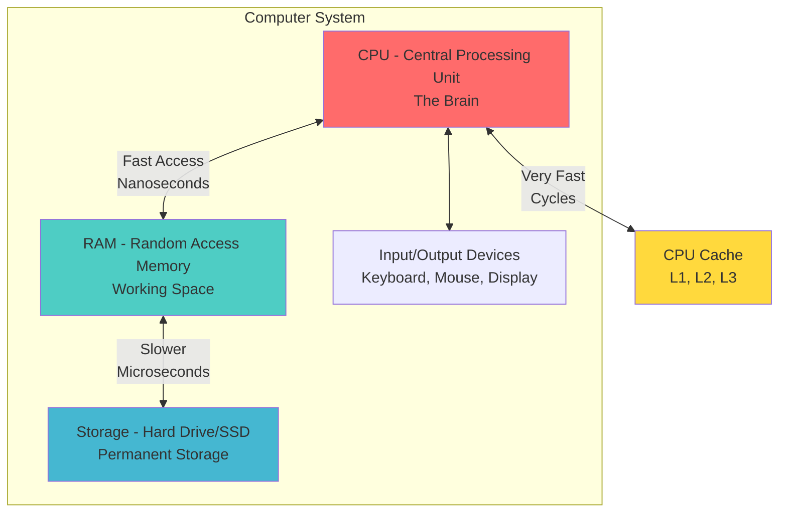
```mermaid
graph TB
    subgraph "Computer System"
        CPU[CPU - Central Processing Unit<br/>The Brain]
        RAM[RAM - Random Access Memory<br/>Working Space]
        STORAGE[Storage - Hard Drive/SSD<br/>Permanent Storage]
        IO[Input/Output Devices<br/>Keyboard, Mouse, Display]
    end

    CPU <--> |Fast Access<br/>Nanoseconds| RAM
    RAM <--> |Slower<br/>Microseconds| STORAGE
    CPU <--> |Very Fast<br/>Cycles| CACHE[CPU Cache<br/>L1, L2, L3]
    CPU <--> IO

    style CPU fill:#ff6b6b
    style RAM fill:#4ecdc4
    style STORAGE fill:#45b7d1
    style CACHE fill:#ffd93d
```

## CPU Architecture

### Inside the CPU

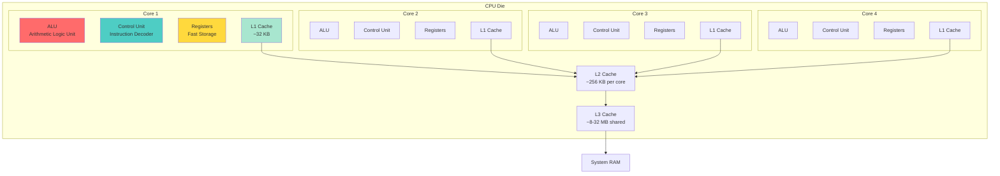
```mermaid
graph TB
    subgraph "CPU Die"
        subgraph "Core 1"
            ALU1[ALU<br/>Arithmetic Logic Unit]
            CU1[Control Unit<br/>Instruction Decoder]
            REG1[Registers<br/>Fast Storage]
            L1_1[L1 Cache<br/>~32 KB]
        end

        subgraph "Core 2"
            ALU2[ALU]
            CU2[Control Unit]
            REG2[Registers]
            L1_2[L1 Cache]
        end

        subgraph "Core 3"
            ALU3[ALU]
            CU3[Control Unit]
            REG3[Registers]
            L1_3[L1 Cache]
        end

        subgraph "Core 4"
            ALU4[ALU]
            CU4[Control Unit]
            REG4[Registers]
            L1_4[L1 Cache]
        end

        L2[L2 Cache<br/>~256 KB per core]
        L3[L3 Cache<br/>~8-32 MB shared]
    end

    L1_1 --> L2
    L1_2 --> L2
    L1_3 --> L2
    L1_4 --> L2
    L2 --> L3
    L3 --> RAM[System RAM]

    style ALU1 fill:#ff6b6b
    style CU1 fill:#4ecdc4
    style REG1 fill:#ffd93d
    style L1_1 fill:#a8e6cf
```

### Key CPU Components

| Component | Purpose | Speed |
|-----------|---------|-------|
| **Registers** | Store immediate data for processing | 1 cycle (~0.3 ns) |
| **L1 Cache** | First-level cache, fastest memory | 3-4 cycles (~1 ns) |
| **L2 Cache** | Second-level cache | 10-20 cycles (~3 ns) |
| **L3 Cache** | Third-level cache, shared | 30-70 cycles (~10 ns) |
| **RAM** | Main system memory | 100-300 cycles (~100 ns) |
| **SSD** | Solid state storage | ~50,000 ns |
| **HDD** | Hard disk drive | ~5,000,000 ns |

## Program Execution Flow

### From Storage to Execution

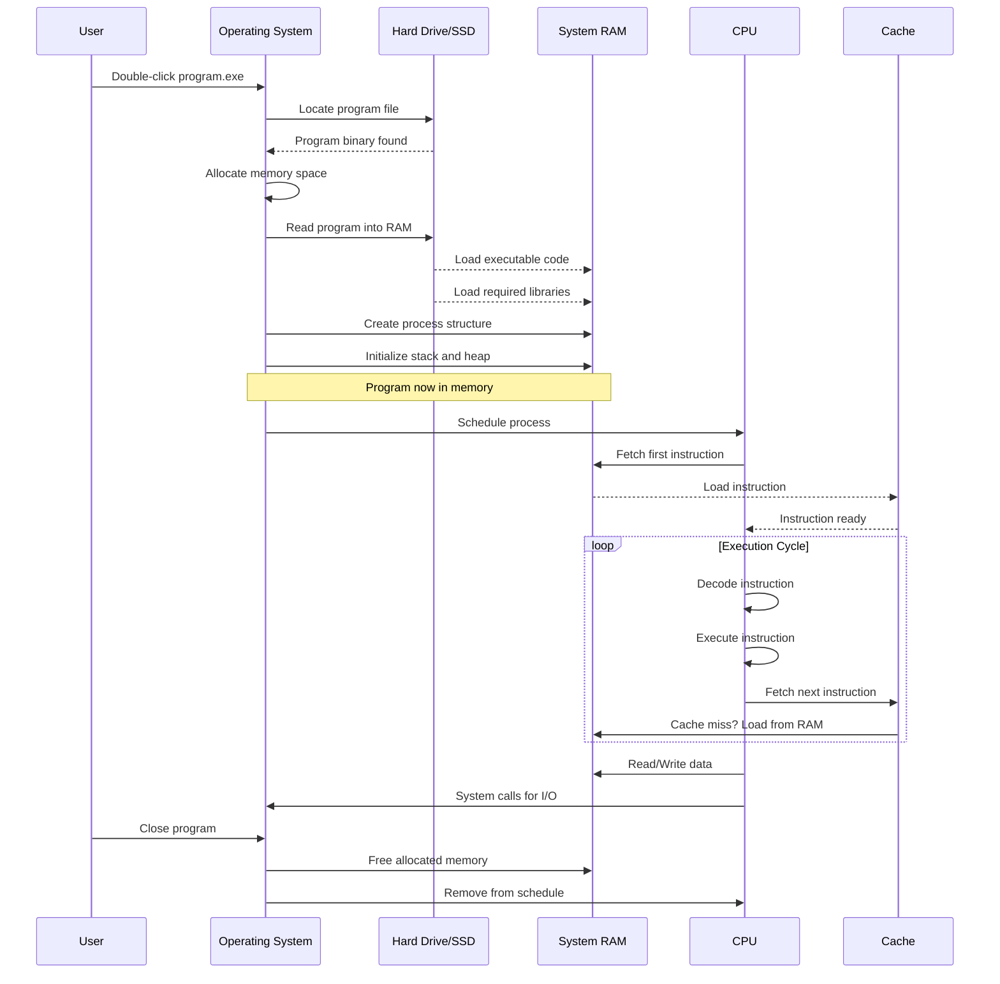
```mermaid
sequenceDiagram
    participant User
    participant OS as Operating System
    participant Disk as Hard Drive/SSD
    participant RAM as System RAM
    participant CPU
    participant Cache

    User->>OS: Double-click program.exe
    OS->>Disk: Locate program file
    Disk-->>OS: Program binary found

    OS->>OS: Allocate memory space
    OS->>Disk: Read program into RAM
    Disk-->>RAM: Load executable code
    Disk-->>RAM: Load required libraries

    OS->>RAM: Create process structure
    OS->>RAM: Initialize stack and heap

    Note over OS,RAM: Program now in memory

    OS->>CPU: Schedule process
    CPU->>RAM: Fetch first instruction
    RAM-->>Cache: Load instruction
    Cache-->>CPU: Instruction ready

    loop Execution Cycle
        CPU->>CPU: Decode instruction
        CPU->>CPU: Execute instruction
        CPU->>Cache: Fetch next instruction
        Cache->>RAM: Cache miss? Load from RAM
    end

    CPU->>RAM: Read/Write data
    CPU->>OS: System calls for I/O

    User->>OS: Close program
    OS->>RAM: Free allocated memory
    OS->>CPU: Remove from schedule
```

## Memory Hierarchy

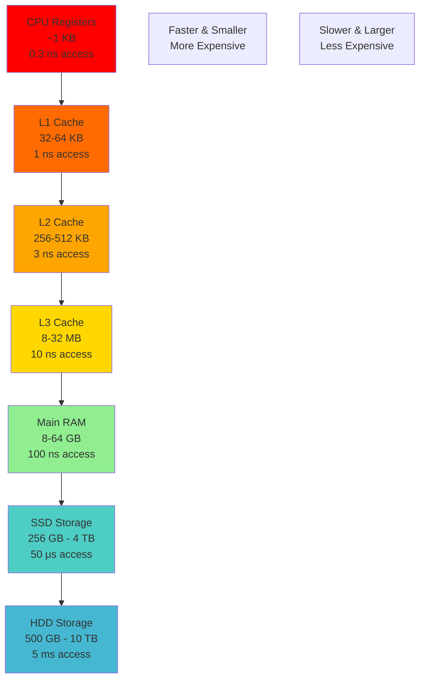
```mermaid
graph TD
    A[CPU Registers<br/>~1 KB<br/>0.3 ns access] --> B[L1 Cache<br/>32-64 KB<br/>1 ns access]
    B --> C[L2 Cache<br/>256-512 KB<br/>3 ns access]
    C --> D[L3 Cache<br/>8-32 MB<br/>10 ns access]
    D --> E[Main RAM<br/>8-64 GB<br/>100 ns access]
    E --> F[SSD Storage<br/>256 GB - 4 TB<br/>50 μs access]
    F --> G[HDD Storage<br/>500 GB - 10 TB<br/>5 ms access]

    style A fill:#ff0000
    style B fill:#ff6b00
    style C fill:#ffa500
    style D fill:#ffd700
    style E fill:#90ee90
    style F fill:#4ecdc4
    style G fill:#45b7d1

    Note1[Faster & Smaller<br/>More Expensive]
    Note2[Slower & Larger<br/>Less Expensive]
```

## CPU Instruction Cycle (Fetch-Decode-Execute)

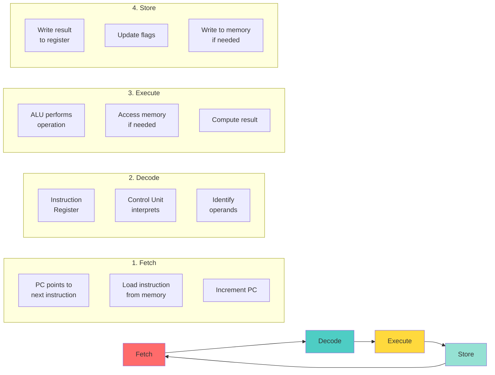
```mermaid
flowchart LR
    A[Fetch] --> B[Decode]
    B --> C[Execute]
    C --> D[Store]
    D --> A

    subgraph "1. Fetch"
        A1[PC points to<br/>next instruction]
        A2[Load instruction<br/>from memory]
        A3[Increment PC]
    end

    subgraph "2. Decode"
        B1[Instruction<br/>Register]
        B2[Control Unit<br/>interprets]
        B3[Identify<br/>operands]
    end

    subgraph "3. Execute"
        C1[ALU performs<br/>operation]
        C2[Access memory<br/>if needed]
        C3[Compute result]
    end

    subgraph "4. Store"
        D1[Write result<br/>to register]
        D2[Update flags]
        D3[Write to memory<br/>if needed]
    end

    style A fill:#ff6b6b
    style B fill:#4ecdc4
    style C fill:#ffd93d
    style D fill:#95e1d3
```

### Example: Adding Two Numbers

```
Instruction: ADD R1, R2, R3  (R1 = R2 + R3)

1. FETCH:
   - PC = 0x1000 (program counter points to instruction)
   - Load instruction from memory address 0x1000
   - PC = 0x1004 (move to next instruction)

2. DECODE:
   - Opcode: ADD
   - Operand 1: R2 (register 2)
   - Operand 2: R3 (register 3)
   - Destination: R1 (register 1)

3. EXECUTE:
   - Read value from R2 (e.g., 10)
   - Read value from R3 (e.g., 20)
   - ALU performs: 10 + 20 = 30

4. STORE:
   - Write result (30) to R1
   - Update flags (zero flag, carry flag, etc.)
```

## RAM Organization for a Program

### Memory Layout of a Process

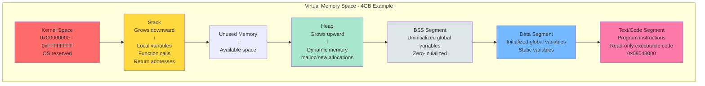
```mermaid
graph TB
    subgraph "Virtual Memory Space - 4GB Example"
        KERNEL[Kernel Space<br/>0xC0000000 - 0xFFFFFFFF<br/>OS reserved]

        STACK[Stack<br/>Grows downward<br/>↓<br/>Local variables<br/>Function calls<br/>Return addresses]

        UNUSED[Unused Memory<br/>↕<br/>Available space]

        HEAP[Heap<br/>Grows upward<br/>↑<br/>Dynamic memory<br/>malloc/new allocations]

        BSS[BSS Segment<br/>Uninitialized global variables<br/>Zero-initialized]

        DATA[Data Segment<br/>Initialized global variables<br/>Static variables]

        TEXT[Text/Code Segment<br/>Program instructions<br/>Read-only executable code<br/>0x08048000]
    end

    KERNEL --> STACK
    STACK --> UNUSED
    UNUSED --> HEAP
    HEAP --> BSS
    BSS --> DATA
    DATA --> TEXT

    style KERNEL fill:#ff6b6b
    style STACK fill:#ffd93d
    style HEAP fill:#a8e6cf
    style BSS fill:#dfe6e9
    style DATA fill:#74b9ff
    style TEXT fill:#fd79a8
```

### Memory Segments Explained

#### 1. **Text/Code Segment**
- Contains compiled machine code (instructions)
- Read-only and executable
- Shared among multiple instances of same program
- Fixed size at load time

#### 2. **Data Segment**
- **Initialized Data**: Global and static variables with initial values
  ```c
  int globalVar = 100;  // Stored in data segment
  static int count = 0; // Stored in data segment
  ```

#### 3. **BSS Segment** (Block Started by Symbol)
- Uninitialized global and static variables
- Automatically initialized to zero
- Doesn't occupy space in executable file
  ```c
  int globalArray[1000]; // Stored in BSS
  static int flag;       // Stored in BSS
  ```

#### 4. **Heap**
- Dynamic memory allocation
- Grows upward toward higher addresses
- Managed by programmer (malloc/free, new/delete)
- Exists until program ends or explicitly freed
  ```c
  int* ptr = malloc(sizeof(int) * 100); // Allocated on heap
  ```

#### 5. **Stack**
- Automatic memory allocation
- Grows downward toward lower addresses
- Stores local variables, function parameters, return addresses
- Automatically cleaned up when function returns
  ```c
  void function() {
      int localVar = 10; // Stored on stack
  }
  ```

## Variable Storage in Memory

### Example Program Analysis

```c
#include <stdio.h>
#include <stdlib.h>

int globalVar = 100;           // Data segment
static int staticVar = 200;    // Data segment
int uninitGlobal;              // BSS segment

void function(int param) {      // param on stack
    int localVar = 10;          // Stack
    static int staticLocal = 5; // Data segment
    int* heapVar = malloc(sizeof(int)); // Pointer on stack, data on heap
    *heapVar = 20;              // Value stored on heap

    printf("Address of param: %p\n", &param);
    printf("Address of localVar: %p\n", &localVar);
    printf("Address of heapVar: %p\n", heapVar);

    free(heapVar);
}

int main() {
    int mainLocal = 5;          // Stack
    function(mainLocal);
    return 0;
}
```

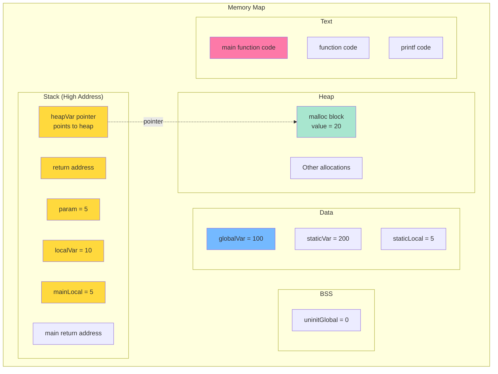
```mermaid
graph TB
    subgraph "Memory Map"
        subgraph "Stack (High Address)"
            S1[return address]
            S2[param = 5]
            S3[localVar = 10]
            S4[heapVar pointer<br/>points to heap]
            S5[mainLocal = 5]
            S6[main return address]
        end

        subgraph "Heap"
            H1[malloc block<br/>value = 20]
            H2[Other allocations]
        end

        subgraph "BSS"
            B1[uninitGlobal = 0]
        end

        subgraph "Data"
            D1[globalVar = 100]
            D2[staticVar = 200]
            D3[staticLocal = 5]
        end

        subgraph "Text"
            T1[main function code]
            T2[function code]
            T3[printf code]
        end
    end

    S4 -.pointer.-> H1

    style S1 fill:#ffd93d
    style S2 fill:#ffd93d
    style S3 fill:#ffd93d
    style S4 fill:#ffd93d
    style S5 fill:#ffd93d
    style H1 fill:#a8e6cf
    style D1 fill:#74b9ff
    style T1 fill:#fd79a8
```

## How CPU Executes Instructions

### Assembly to Machine Code

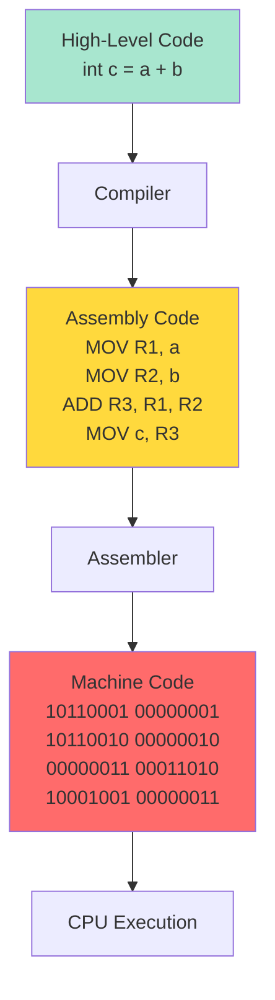
```mermaid
flowchart TD
    A[High-Level Code<br/>int c = a + b] --> B[Compiler]
    B --> C[Assembly Code<br/>MOV R1, a<br/>MOV R2, b<br/>ADD R3, R1, R2<br/>MOV c, R3]
    C --> D[Assembler]
    D --> E[Machine Code<br/>10110001 00000001<br/>10110010 00000010<br/>00000011 00011010<br/>10001001 00000011]
    E --> F[CPU Execution]

    style A fill:#a8e6cf
    style C fill:#ffd93d
    style E fill:#ff6b6b
```

### CPU Registers During Execution

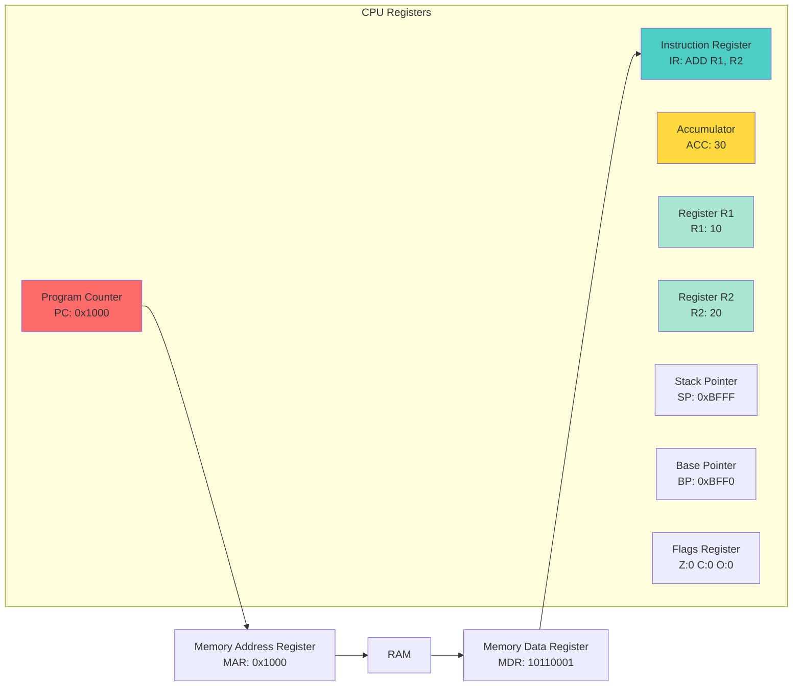
```mermaid
graph LR
    subgraph "CPU Registers"
        PC[Program Counter<br/>PC: 0x1000]
        IR[Instruction Register<br/>IR: ADD R1, R2]
        ACC[Accumulator<br/>ACC: 30]
        R1[Register R1<br/>R1: 10]
        R2[Register R2<br/>R2: 20]
        SP[Stack Pointer<br/>SP: 0xBFFF]
        BP[Base Pointer<br/>BP: 0xBFF0]
        FLAGS[Flags Register<br/>Z:0 C:0 O:0]
    end

    MAR[Memory Address Register<br/>MAR: 0x1000]
    MDR[Memory Data Register<br/>MDR: 10110001]

    PC --> MAR
    MAR --> MEM[RAM]
    MEM --> MDR
    MDR --> IR

    style PC fill:#ff6b6b
    style IR fill:#4ecdc4
    style ACC fill:#ffd93d
    style R1 fill:#a8e6cf
    style R2 fill:#a8e6cf
```

## Complete Program Execution Example

### Simple C Program

```c
int main() {
    int a = 5;
    int b = 10;
    int c = a + b;
    return c;
}
```

### Step-by-Step Execution

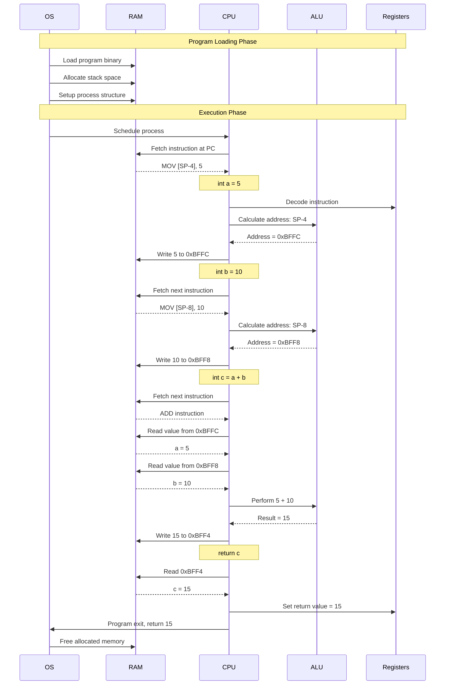
```mermaid
sequenceDiagram
    participant OS
    participant RAM
    participant CPU
    participant ALU
    participant Registers

    Note over OS,Registers: Program Loading Phase
    OS->>RAM: Load program binary
    OS->>RAM: Allocate stack space
    OS->>RAM: Setup process structure

    Note over OS,Registers: Execution Phase
    OS->>CPU: Schedule process
    CPU->>RAM: Fetch instruction at PC
    RAM-->>CPU: MOV [SP-4], 5

    Note over CPU: int a = 5
    CPU->>Registers: Decode instruction
    CPU->>ALU: Calculate address: SP-4
    ALU-->>CPU: Address = 0xBFFC
    CPU->>RAM: Write 5 to 0xBFFC

    Note over CPU: int b = 10
    CPU->>RAM: Fetch next instruction
    RAM-->>CPU: MOV [SP-8], 10
    CPU->>ALU: Calculate address: SP-8
    ALU-->>CPU: Address = 0xBFF8
    CPU->>RAM: Write 10 to 0xBFF8

    Note over CPU: int c = a + b
    CPU->>RAM: Fetch next instruction
    RAM-->>CPU: ADD instruction
    CPU->>RAM: Read value from 0xBFFC
    RAM-->>CPU: a = 5
    CPU->>RAM: Read value from 0xBFF8
    RAM-->>CPU: b = 10
    CPU->>ALU: Perform 5 + 10
    ALU-->>CPU: Result = 15
    CPU->>RAM: Write 15 to 0xBFF4

    Note over CPU: return c
    CPU->>RAM: Read 0xBFF4
    RAM-->>CPU: c = 15
    CPU->>Registers: Set return value = 15
    CPU->>OS: Program exit, return 15
    OS->>RAM: Free allocated memory
```

## Memory Access Pattern

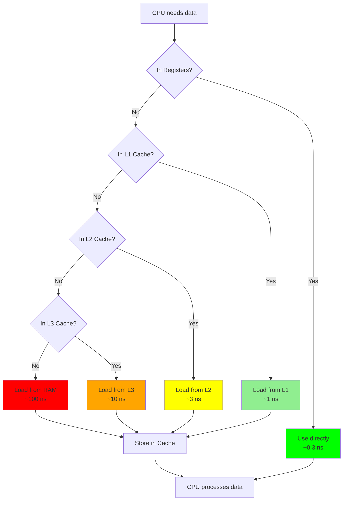
```mermaid
flowchart TD
    A[CPU needs data] --> B{In Registers?}
    B -->|Yes| C[Use directly<br/>~0.3 ns]
    B -->|No| D{In L1 Cache?}
    D -->|Yes| E[Load from L1<br/>~1 ns]
    D -->|No| F{In L2 Cache?}
    F -->|Yes| G[Load from L2<br/>~3 ns]
    F -->|No| H{In L3 Cache?}
    H -->|Yes| I[Load from L3<br/>~10 ns]
    H -->|No| J[Load from RAM<br/>~100 ns]

    J --> K[Store in Cache]
    I --> K
    G --> K
    E --> K
    K --> L[CPU processes data]
    C --> L

    style C fill:#00ff00
    style E fill:#90ee90
    style G fill:#ffff00
    style I fill:#ffa500
    style J fill:#ff0000
```

## Function Call Stack

### How Function Calls Work

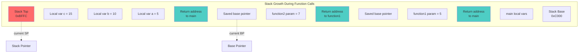
```mermaid
graph TB
    subgraph "Stack Growth During Function Calls"
        direction TB

        S10[Stack Top<br/>0xBFFC]
        S9[Local var c = 15]
        S8[Local var b = 10]
        S7[Local var a = 5]
        S6[Return address<br/>to main]
        S5[Saved base pointer]

        S4[function2 param = 7]
        S3[Return address<br/>to function1]
        S2[Saved base pointer]

        S1[function1 param = 5]
        S0[Return address<br/>to main]

        M1[main local vars]
        M0[Stack Base<br/>0xC000]
    end

    S10 -.current SP.-> SP[Stack Pointer]
    S5 -.current BP.-> BP[Base Pointer]

    style S10 fill:#ff6b6b
    style S6 fill:#4ecdc4
    style S3 fill:#4ecdc4
    style S0 fill:#4ecdc4
```

### Function Call Example

```c
void function2(int x) {
    int local2 = x * 2;
    return;
}

void function1(int y) {
    int local1 = y + 1;
    function2(local1);
    return;
}

int main() {
    int a = 5;
    function1(a);
    return 0;
}
```

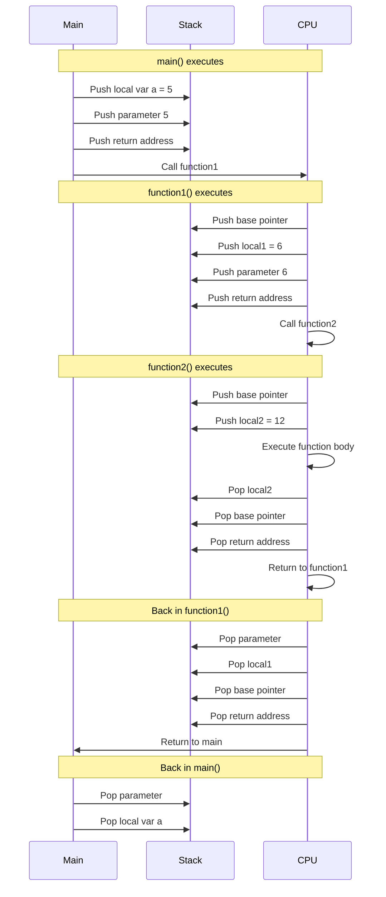
```mermaid
sequenceDiagram
    participant Main
    participant Stack
    participant CPU

    Note over Main,CPU: main() executes
    Main->>Stack: Push local var a = 5
    Main->>Stack: Push parameter 5
    Main->>Stack: Push return address
    Main->>CPU: Call function1

    Note over Main,CPU: function1() executes
    CPU->>Stack: Push base pointer
    CPU->>Stack: Push local1 = 6
    CPU->>Stack: Push parameter 6
    CPU->>Stack: Push return address
    CPU->>CPU: Call function2

    Note over Main,CPU: function2() executes
    CPU->>Stack: Push base pointer
    CPU->>Stack: Push local2 = 12
    CPU->>CPU: Execute function body
    CPU->>Stack: Pop local2
    CPU->>Stack: Pop base pointer
    CPU->>Stack: Pop return address
    CPU->>CPU: Return to function1

    Note over Main,CPU: Back in function1()
    CPU->>Stack: Pop parameter
    CPU->>Stack: Pop local1
    CPU->>Stack: Pop base pointer
    CPU->>Stack: Pop return address
    CPU->>Main: Return to main

    Note over Main,CPU: Back in main()
    Main->>Stack: Pop parameter
    Main->>Stack: Pop local var a
```

## Dynamic Memory Allocation

### Heap Management

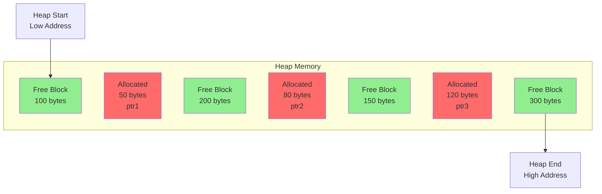
```mermaid
graph TB
    subgraph "Heap Memory"
        direction LR
        FREE1[Free Block<br/>100 bytes]
        ALLOC1[Allocated<br/>50 bytes<br/>ptr1]
        FREE2[Free Block<br/>200 bytes]
        ALLOC2[Allocated<br/>80 bytes<br/>ptr2]
        FREE3[Free Block<br/>150 bytes]
        ALLOC3[Allocated<br/>120 bytes<br/>ptr3]
        FREE4[Free Block<br/>300 bytes]
    end

    HEAP_START[Heap Start<br/>Low Address] --> FREE1
    FREE4 --> HEAP_END[Heap End<br/>High Address]

    style FREE1 fill:#90ee90
    style ALLOC1 fill:#ff6b6b
    style FREE2 fill:#90ee90
    style ALLOC2 fill:#ff6b6b
    style FREE3 fill:#90ee90
    style ALLOC3 fill:#ff6b6b
    style FREE4 fill:#90ee90
```

### malloc/free Process

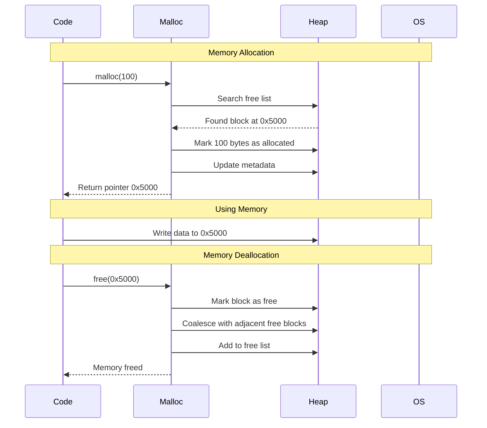
```mermaid
sequenceDiagram
    participant Code
    participant Malloc
    participant Heap
    participant OS

    Note over Code,OS: Memory Allocation
    Code->>Malloc: malloc(100)
    Malloc->>Heap: Search free list
    Heap-->>Malloc: Found block at 0x5000
    Malloc->>Heap: Mark 100 bytes as allocated
    Malloc->>Heap: Update metadata
    Malloc-->>Code: Return pointer 0x5000

    Note over Code,OS: Using Memory
    Code->>Heap: Write data to 0x5000

    Note over Code,OS: Memory Deallocation
    Code->>Malloc: free(0x5000)
    Malloc->>Heap: Mark block as free
    Malloc->>Heap: Coalesce with adjacent free blocks
    Malloc->>Heap: Add to free list
    Malloc-->>Code: Memory freed
```

## CPU Pipeline

### Modern CPUs Execute Multiple Instructions Simultaneously


```mermaid
gantt
    title CPU Pipeline Execution (5-stage)
    dateFormat X
    axisFormat %L

    section Instruction 1
    Fetch       :0, 1
    Decode      :1, 1
    Execute     :2, 1
    Memory      :3, 1
    Writeback   :4, 1

    section Instruction 2
    Fetch       :1, 1
    Decode      :2, 1
    Execute     :3, 1
    Memory      :4, 1
    Writeback   :5, 1

    section Instruction 3
    Fetch       :2, 1
    Decode      :3, 1
    Execute     :4, 1
    Memory      :5, 1
    Writeback   :6, 1

    section Instruction 4
    Fetch       :3, 1
    Decode      :4, 1
    Execute     :5, 1
    Memory      :6, 1
    Writeback   :7, 1

    section Instruction 5
    Fetch       :4, 1
    Decode      :5, 1
    Execute     :6, 1
    Memory      :7, 1
    Writeback   :8, 1
```

### Pipeline Stages

1. **Fetch (IF)**: Get instruction from memory
2. **Decode (ID)**: Interpret instruction and read registers
3. **Execute (EX)**: Perform operation in ALU
4. **Memory (MEM)**: Access memory if needed
5. **Writeback (WB)**: Write result to register

## Cache Memory

### How Cache Works

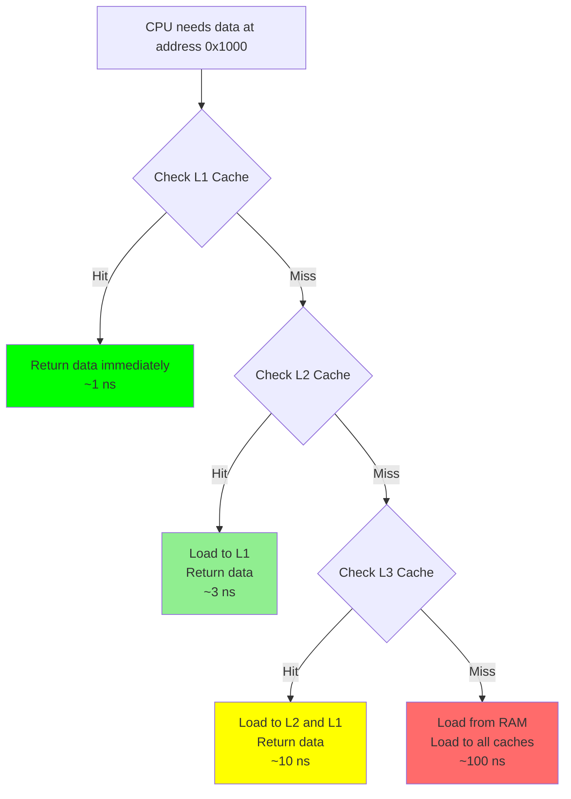
```mermaid
flowchart TD
    A[CPU needs data at address 0x1000] --> B{Check L1 Cache}
    B -->|Hit| C[Return data immediately<br/>~1 ns]
    B -->|Miss| D{Check L2 Cache}
    D -->|Hit| E[Load to L1<br/>Return data<br/>~3 ns]
    D -->|Miss| F{Check L3 Cache}
    F -->|Hit| G[Load to L2 and L1<br/>Return data<br/>~10 ns]
    F -->|Miss| H[Load from RAM<br/>Load to all caches<br/>~100 ns]

    style C fill:#00ff00
    style E fill:#90ee90
    style G fill:#ffff00
    style H fill:#ff6b6b
```

### Cache Line Example

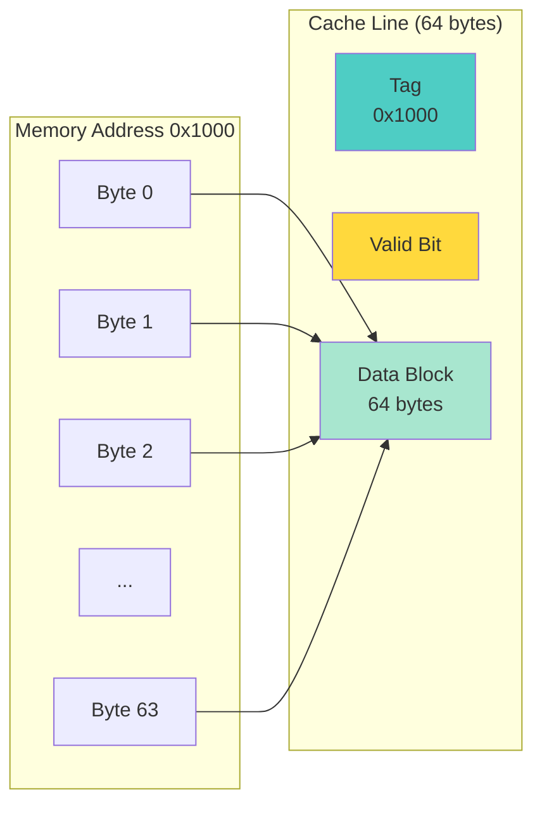
```mermaid
graph LR
    subgraph "Memory Address 0x1000"
        M1[Byte 0]
        M2[Byte 1]
        M3[Byte 2]
        M4[...]
        M5[Byte 63]
    end

    subgraph "Cache Line (64 bytes)"
        C1[Tag<br/>0x1000]
        C2[Valid Bit]
        C3[Data Block<br/>64 bytes]
    end

    M1 --> C3
    M2 --> C3
    M3 --> C3
    M5 --> C3

    style C1 fill:#4ecdc4
    style C2 fill:#ffd93d
    style C3 fill:#a8e6cf
```

## Virtual Memory

### Virtual to Physical Address Translation

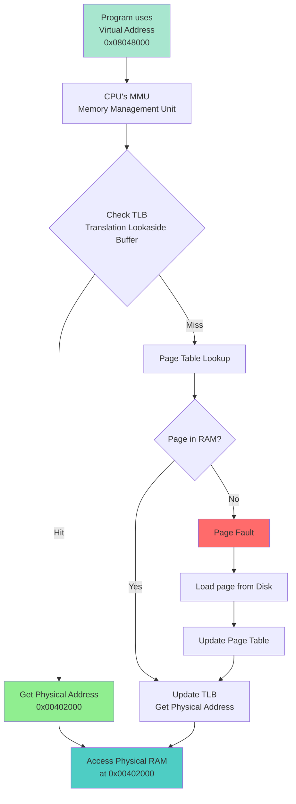
```mermaid
flowchart TD
    A[Program uses<br/>Virtual Address<br/>0x08048000] --> B[CPU's MMU<br/>Memory Management Unit]
    B --> C{Check TLB<br/>Translation Lookaside Buffer}
    C -->|Hit| D[Get Physical Address<br/>0x00402000]
    C -->|Miss| E[Page Table Lookup]
    E --> F{Page in RAM?}
    F -->|Yes| G[Update TLB<br/>Get Physical Address]
    F -->|No| H[Page Fault]
    H --> I[Load page from Disk]
    I --> J[Update Page Table]
    J --> G

    D --> K[Access Physical RAM<br/>at 0x00402000]
    G --> K

    style A fill:#a8e6cf
    style D fill:#90ee90
    style K fill:#4ecdc4
    style H fill:#ff6b6b
```

### Page Table Structure

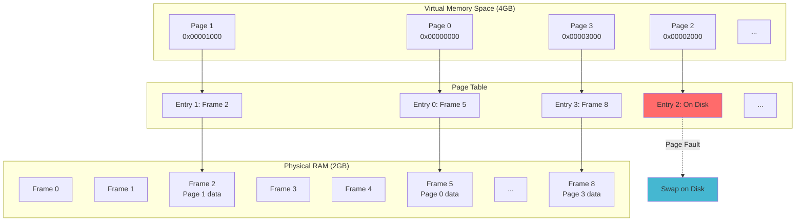
```mermaid
graph TB
    subgraph "Virtual Memory Space (4GB)"
        V1[Page 0<br/>0x00000000]
        V2[Page 1<br/>0x00001000]
        V3[Page 2<br/>0x00002000]
        V4[Page 3<br/>0x00003000]
        V5[...]
    end

    subgraph "Page Table"
        PT1[Entry 0: Frame 5]
        PT2[Entry 1: Frame 2]
        PT3[Entry 2: On Disk]
        PT4[Entry 3: Frame 8]
        PT5[...]
    end

    subgraph "Physical RAM (2GB)"
        P1[Frame 0]
        P2[Frame 1]
        P3[Frame 2<br/>Page 1 data]
        P4[Frame 3]
        P5[Frame 4]
        P6[Frame 5<br/>Page 0 data]
        P7[...]
        P8[Frame 8<br/>Page 3 data]
    end

    V1 --> PT1
    V2 --> PT2
    V3 --> PT3
    V4 --> PT4

    PT1 --> P6
    PT2 --> P3
    PT3 -.Page Fault.-> DISK[Swap on Disk]
    PT4 --> P8

    style PT3 fill:#ff6b6b
    style DISK fill:#45b7d1
```

## Complete System View

```mermaid
graph TB
    subgraph "Application Layer"
        APP[Your Program<br/>program.exe]
    end

    subgraph "Operating System Layer"
        OS[OS Kernel]
        SCHEDULER[Process Scheduler]
        MM[Memory Manager]
        FS[File System]
    end

    subgraph "Hardware Layer"
        subgraph "CPU"
            CORE1[Core 1]
            CORE2[Core 2]
            CACHE[L3 Cache]
        end

        RAM[RAM<br/>8-64 GB]
        STORAGE[Storage<br/>SSD/HDD]
        GPU[GPU]
        IO[I/O Devices]
    end

    APP --> OS
    OS --> SCHEDULER
    OS --> MM
    OS --> FS

    SCHEDULER --> CORE1
    SCHEDULER --> CORE2
    MM --> RAM
    FS --> STORAGE

    CORE1 <--> CACHE
    CORE2 <--> CACHE
    CACHE <--> RAM

    OS --> GPU
    OS --> IO

    style APP fill:#a8e6cf
    style OS fill:#4ecdc4
    style CPU fill:#ff6b6b
    style RAM fill:#ffd93d
    style STORAGE fill:#45b7d1
```

## Performance Comparison

### Access Time Comparison

```mermaid
graph LR
    A[CPU Register<br/>0.3 ns<br/>1x]
    B[L1 Cache<br/>1 ns<br/>3x]
    C[L2 Cache<br/>3 ns<br/>10x]
    D[L3 Cache<br/>10 ns<br/>33x]
    E[RAM<br/>100 ns<br/>333x]
    F[SSD<br/>50 μs<br/>166,666x]
    G[HDD<br/>5 ms<br/>16,666,666x]

    A --> B
    B --> C
    C --> D
    D --> E
    E --> F
    F --> G

    style A fill:#00ff00
    style B fill:#90ee90
    style C fill:#ffff00
    style D fill:#ffa500
    style E fill:#ff6b6b
    style F fill:#ff4757
    style G fill:#8b0000
```

### Human-Scale Time Analogy

If accessing a CPU register took 1 second, here's how long other operations would take:

| Memory Level | Actual Time | If Register = 1 Second |
|--------------|-------------|------------------------|
| CPU Register | 0.3 ns | 1 second |
| L1 Cache | 1 ns | 3 seconds |
| L2 Cache | 3 ns | 10 seconds |
| L3 Cache | 10 ns | 33 seconds |
| RAM | 100 ns | 5.5 minutes |
| SSD | 50 μs | 1.9 days |
| HDD | 5 ms | 6.4 months |

### Key Takeaways

- **Speed vs Size Trade-off**: Faster memory is exponentially more expensive and smaller
- **Locality Matters**: Programs that access nearby memory locations run faster due to caching
- **Cache is Critical**: Modern CPUs spend significant silicon area on cache to bridge the speed gap
- **RAM is Slow**: Despite being "fast" by human standards, RAM is ~100x slower than L1 cache
- **Disk is Extremely Slow**: SSDs are 500,000x slower than registers; HDDs are 16 million times slower
