# Data Storage Systems - System Design Guide

A comprehensive guide to data-related storage and processing systems from a system design interview perspective.

---

## Table of Contents

1. [Core Concepts Overview](#core-concepts)
2. [Storage Systems](#storage-systems)
3. [Processing Engines](#processing-engines)
4. [System Design Considerations](#design-considerations)
5. [Modern Data Architecture Patterns](#architecture-patterns)
6. [Interview Checklist](#interview-checklist)
7. [Common Interview Scenarios](#interview-scenarios)

---

## 1. Core Concepts Overview {#core-concepts}

### ETL (Extract → Transform → Load)

**Definition**: Data pipeline pattern where data is extracted from sources, transformed (cleaned, aggregated, enriched), and then loaded into the target system.

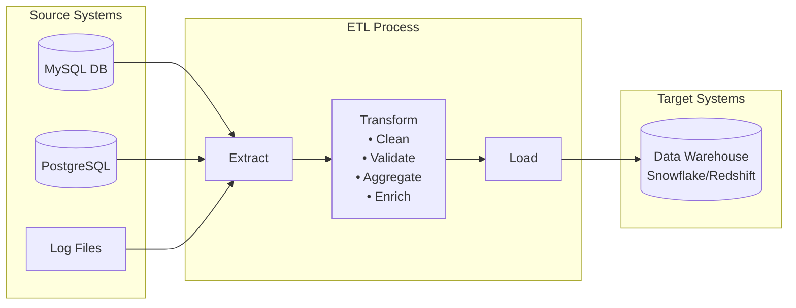

**Purpose**:
- Complex business logic transformations before storage
- Data quality enforcement at ingestion
- Schema validation and normalization
- Data enrichment and integration from multiple sources

**When to Use**:
- Transformations are computationally intensive
- Need to reduce data volume before loading
- Target system has limited compute capacity
- Compliance requires data cleansing before storage
- Legacy systems with limited query capabilities

**Typical Tools**: Talend, Informatica, AWS Glue, Apache Airflow + Spark, Azure Data Factory

**Example Flow**:
```
MySQL DB → Extract → Spark Transformation → Load → Snowflake
Logs (S3) → Extract → Filter/Aggregate → Load → Redshift
```

**Trade-offs**:
- ✅ Reduced storage costs (only transformed data stored)
- ✅ Better performance for downstream queries
- ✅ Data quality guaranteed before loading
- ❌ Longer pipeline latency
- ❌ Less flexibility for reprocessing
- ❌ Schema changes require pipeline updates

---

### ELT (Extract → Load → Transform)

**Definition**: Modern pattern where raw data is loaded first, then transformations run inside the data warehouse/lake.

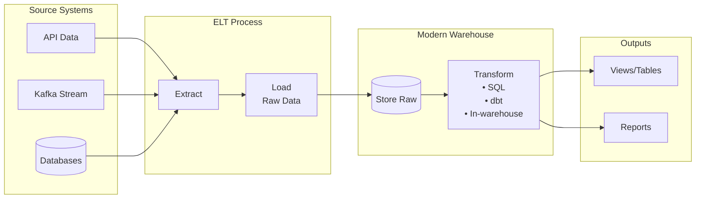

**Purpose**:
- Leverage powerful warehouse compute engines
- Preserve raw data for flexibility
- Enable faster ingestion
- Support schema evolution

**When to Use**:
- Using modern cloud warehouses (Snowflake, BigQuery)
- Need to preserve raw data
- Transformations might change frequently
- Multiple teams need different views of same data
- Real-time or near-real-time requirements

**Advantages**:
- Schema-on-read flexibility
- Raw data always available for reprocessing
- Faster initial ingestion
- Easier debugging (raw data visible)
- Better support for iterative analytics

**Example Flow**:
```
API Data → Load to S3 → Load to Snowflake → Transform with dbt
Kafka Stream → Load to BigQuery → Transform with SQL
```

**Trade-offs**:
- ✅ Raw data preservation
- ✅ Faster time-to-insights
- ✅ More flexible reprocessing
- ❌ Higher storage costs
- ❌ Requires powerful warehouse compute
- ❌ Data quality issues propagate downstream

---

### ETL vs ELT Comparison

| Aspect | ETL | ELT |
|--------|-----|-----|
| **Transform Location** | Before load (external) | After load (in-warehouse) |
| **Compute** | Separate processing cluster | Warehouse compute |
| **Data Volume** | Reduced before storage | Full raw data stored |
| **Schema** | Fixed upfront | Flexible, schema-on-read |
| **Latency** | Higher (transform first) | Lower (load raw quickly) |
| **Cost** | Lower storage, higher compute | Higher storage, leverage warehouse |
| **Use Case** | Legacy systems, complex pre-processing | Modern cloud warehouses |
| **Best For** | Teradata, Oracle | Snowflake, BigQuery, Databricks |

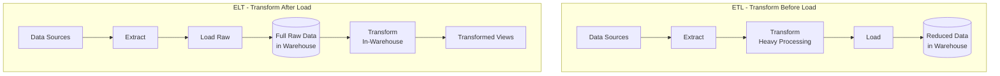

---

## 2. Storage Systems {#storage-systems}

### Data Warehouse

**Definition**: Structured, schema-on-write system optimized for analytics (OLAP) workloads.

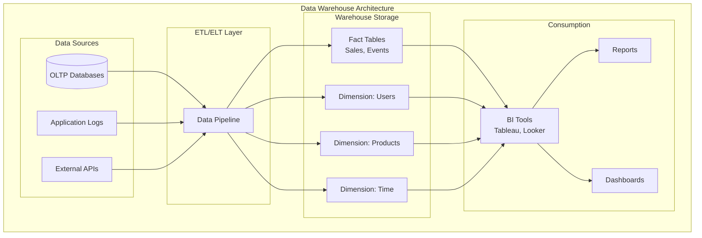

**Purpose**:
- Centralized repository for structured business data
- Optimized for complex analytical queries
- Historical data analysis
- Business intelligence and reporting

**Architecture Characteristics**:
- **Columnar storage**: Optimized for aggregate queries
- **Append-only**: Immutable historical records
- **Optimized joins**: Efficient cross-table analytics
- **Materialized views**: Pre-computed aggregations
- **Query optimization**: Cost-based optimizers

**Data Modeling**:

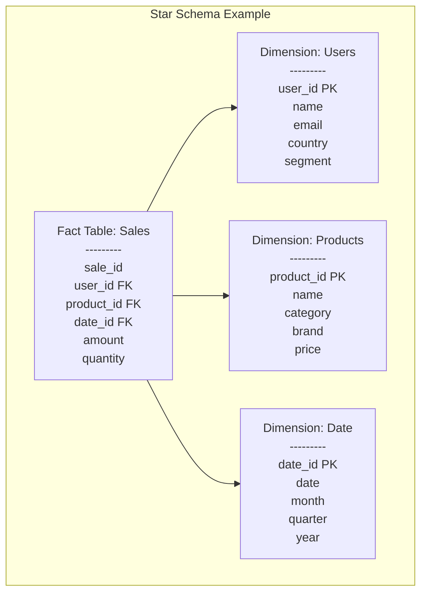

- **Star Schema**: Fact table + dimension tables
- **Snowflake Schema**: Normalized dimension tables
- **Fact Tables**: Metrics, measurements (sales, clicks)
- **Dimension Tables**: Descriptive attributes (users, products, time)

**Examples**:
- Snowflake (cloud-native)
- Amazon Redshift (AWS)
- Google BigQuery (GCP)
- Azure Synapse Analytics
- Teradata (on-premise/legacy)

**When to Use**:
- Structured business analytics
- BI dashboards and reports
- SQL-heavy workloads
- Historical trend analysis
- Regulatory reporting

**Trade-offs**:
- ✅ Excellent query performance for analytics
- ✅ SQL interface familiar to analysts
- ✅ Strong consistency guarantees
- ✅ Optimized for aggregations and joins
- ❌ Schema changes are costly
- ❌ Not ideal for unstructured data
- ❌ Higher cost per GB than data lakes
- ❌ Not designed for real-time updates

---

### Data Lake

**Definition**: Repository that stores raw data in native format - structured, semi-structured, and unstructured.

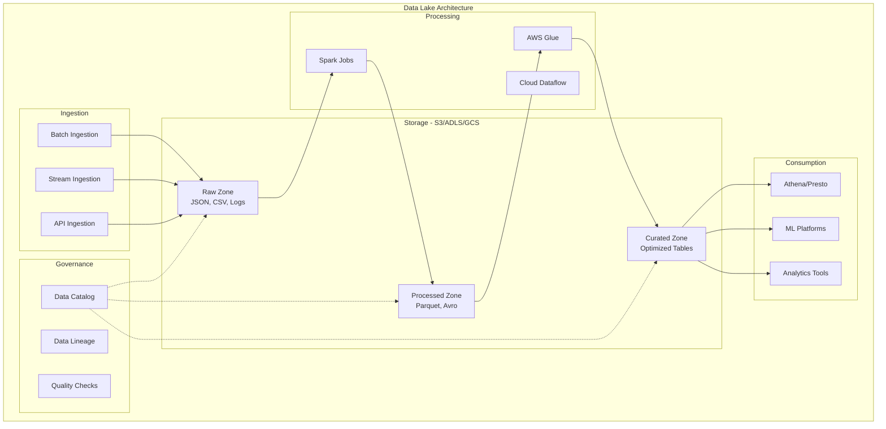

**Purpose**:
- Store massive volumes of raw data cheaply
- Support diverse data types and formats
- Enable exploratory analytics and ML
- Serve as single source of truth

**Schema Approach**:
- **Schema-on-read**: Structure applied at query time
- **Format flexibility**: JSON, CSV, Parquet, Avro, logs, images, videos
- **No upfront modeling**: Store first, structure later

**Examples**:
- AWS S3 + Athena/Glue
- Azure Data Lake Storage (ADLS)
- Google Cloud Storage + BigQuery
- Hadoop HDFS (on-premise)

**Common Formats**:
- **Parquet**: Columnar, compressed, great for analytics
- **Avro**: Row-based, schema evolution support
- **ORC**: Optimized columnar format for Hive
- **JSON**: Flexible but inefficient for large scale

**When to Use**:
- Storing raw logs, events, clickstreams
- IoT sensor data
- Machine learning training data
- Unstructured data (images, videos, documents)
- Data science exploration
- Cost-effective long-term storage

**Challenges**:
- Data governance and cataloging
- Data quality consistency
- Query performance can be poor
- Difficult to maintain ACID properties
- "Data swamp" risk without proper management

**Trade-offs**:
- ✅ Very low storage cost
- ✅ Handles any data type
- ✅ Massive scalability
- ✅ Great for ML and data science
- ❌ No ACID guarantees (traditionally)
- ❌ Poor query performance without optimization
- ❌ Governance challenges
- ❌ Requires data catalog tools

---

### Lakehouse Architecture

**Definition**: Hybrid approach combining data lake flexibility with data warehouse performance and reliability.

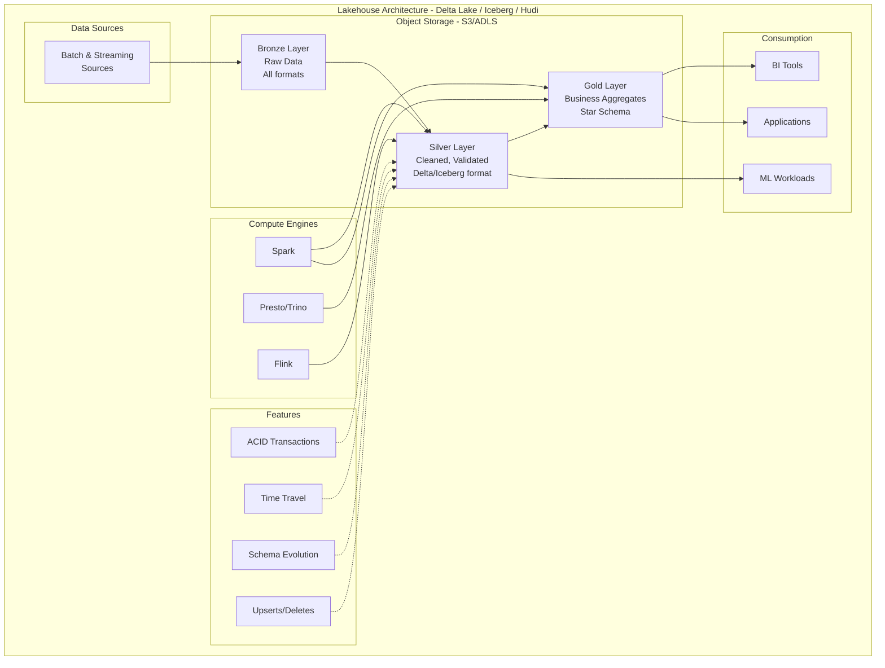

**Purpose**:
- Single platform for all data workloads
- ACID transactions on data lake storage
- Schema enforcement with flexibility
- Support both BI and ML workloads

**Key Technologies**:
- **Delta Lake** (Databricks)
- **Apache Iceberg** (Netflix/Apple)
- **Apache Hudi** (Uber)

**Features**:
- ACID transactions on object storage
- Time travel and versioning
- Schema enforcement and evolution
- Unified batch and streaming
- Z-ordering and data skipping

**Medallion Architecture Layers**:

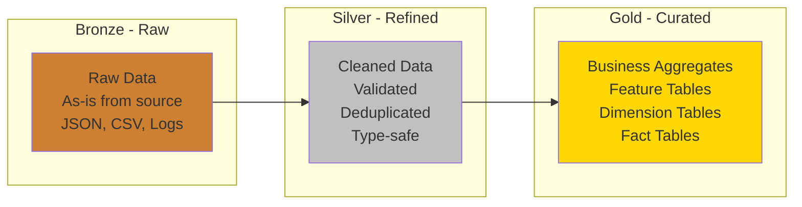

**When to Use**:
- Need both data lake economics and warehouse performance
- Supporting diverse teams (data scientists + analysts)
- Want to eliminate data silos
- Need strong consistency with S3-like costs

**Trade-offs**:
- ✅ Best of both worlds (lake + warehouse)
- ✅ Lower cost than pure warehouse
- ✅ ACID guarantees on cheap storage
- ✅ Eliminates data duplication
- ❌ More complex to set up
- ❌ Newer technology (less mature)
- ❌ Requires learning new concepts

---

## 3. Processing Engines {#processing-engines}

### Apache Spark

**Definition**: Distributed compute engine for large-scale data processing (batch and streaming).

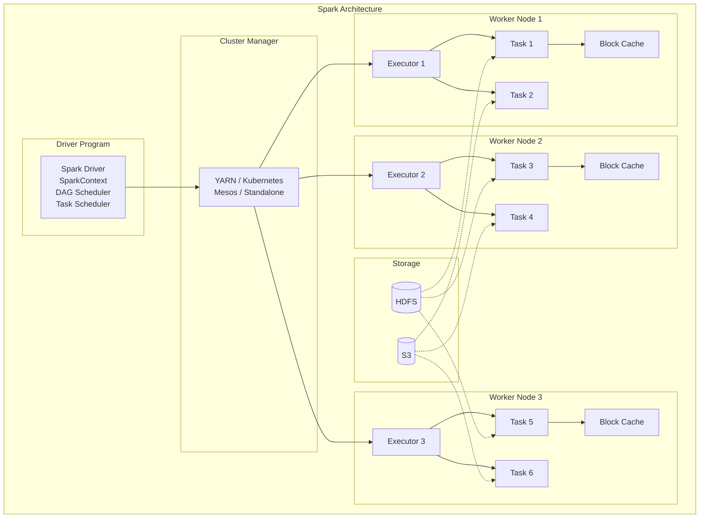

**Purpose**:
- Process massive datasets in parallel
- Complex transformations and aggregations
- Machine learning pipelines
- Unified batch and streaming

**Architecture Components**:
- **Driver**: Coordinates work, builds execution plan
- **Executors**: Perform computations on worker nodes
- **Cluster Manager**: Resource allocation (YARN, Kubernetes, Mesos)

**APIs**:
- **Spark SQL** (DataFrames) - Structured data processing
- **RDD** (Resilient Distributed Datasets) - Low-level API
- **Structured Streaming** - Stream processing
- **MLlib** - Machine learning library
- **GraphX** - Graph processing

**Processing Model**:

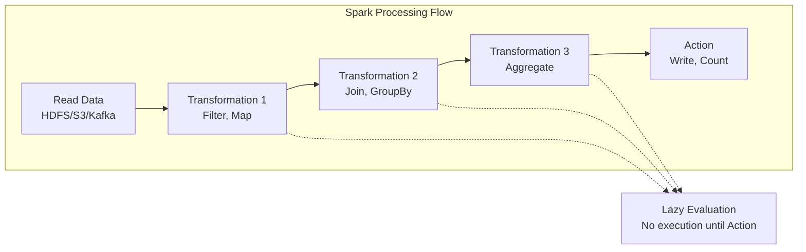

**When to Use**:
- ETL pipelines with complex logic
- Large-scale data transformations (TB/PB scale)
- Machine learning at scale
- Batch processing of historical data
- Stream processing with Structured Streaming (second-level latency acceptable)

**Common Deployment Pattern**:

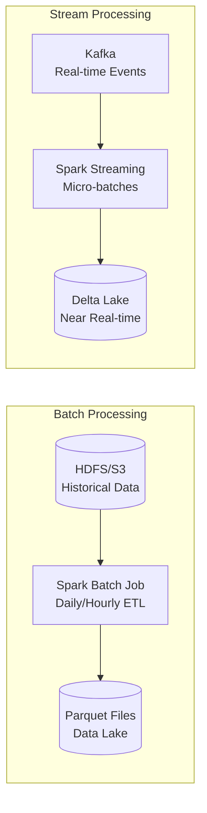

**Trade-offs**:
- ✅ Massive scalability (handles PB-scale data)
- ✅ Rich transformation APIs (SQL, DataFrame, RDD)
- ✅ Supports multiple languages (Scala, Python, Java, R)
- ✅ Unified batch and streaming
- ✅ In-memory processing for speed
- ❌ High operational complexity
- ❌ Expensive for small workloads
- ❌ Requires cluster management expertise
- ❌ Higher latency than true streaming (Flink)

---

### Snowflake

**Definition**: Cloud-native data warehouse with separated compute and storage architecture.

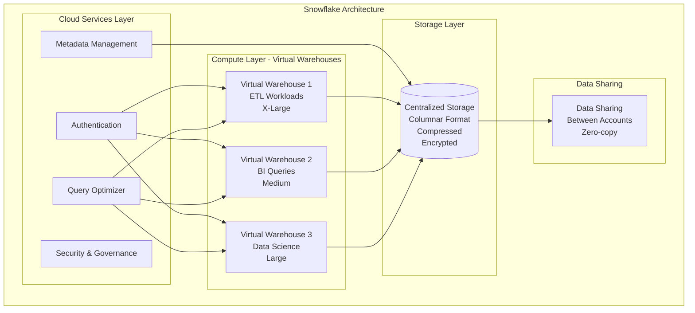

**Architecture Innovation**:
- **Storage Layer**: Centralized, automatic replication, micro-partitions
- **Compute Layer**: Multiple independent virtual warehouses
- **Cloud Services**: Metadata, optimization, security, transaction management

**Key Features**:

1. **Separation of Compute and Storage**
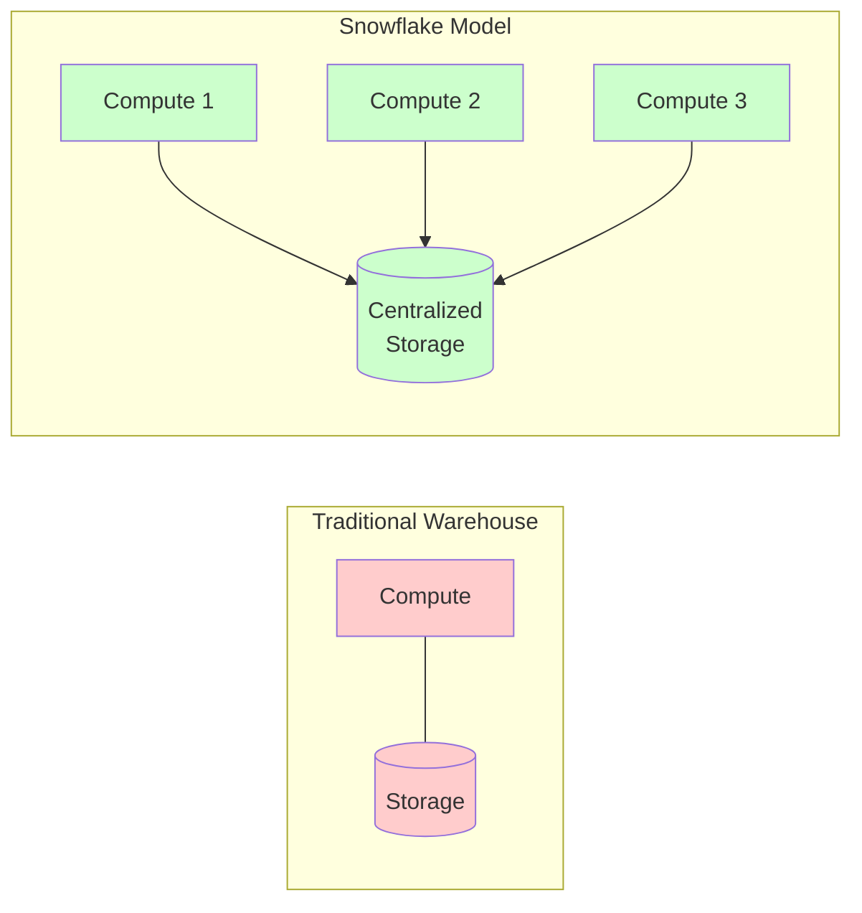

2. **Zero-Copy Cloning**: Instant data copies without storage duplication
3. **Time Travel**: Query historical data (up to 90 days)
4. **Multi-cluster Warehouses**: Auto-scaling for high concurrency
5. **Data Sharing**: Share live data between accounts without copying
6. **Secure Views**: Row/column-level security

**When to Use**:
- Business intelligence and analytics
- Data warehousing with variable workloads
- Need to scale read and write independently
- Multiple teams with different compute needs
- Cross-organization data sharing
- Ad-hoc analytics with varying concurrency

**Design Patterns**:

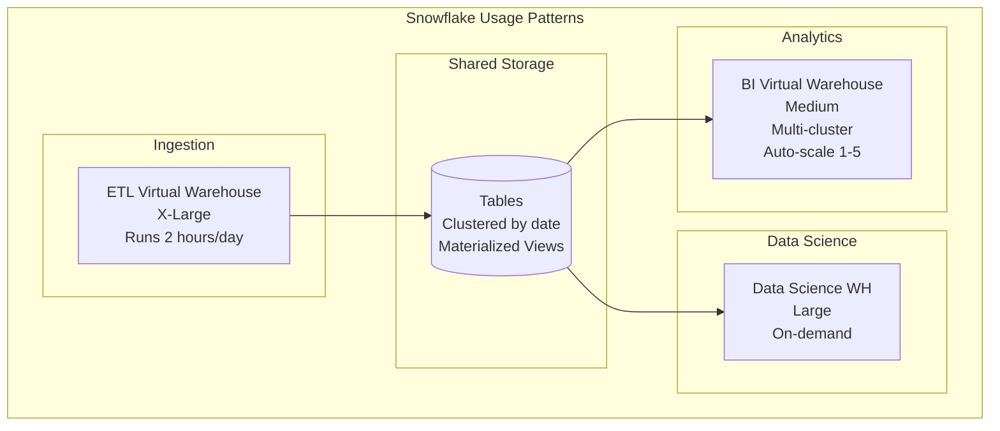

- Create separate warehouses for ETL, BI, Data Science
- Use clustering keys for large tables (>1TB)
- Materialize views for repeated aggregations
- Partition by time for time-series data
- Use multi-cluster warehouses for high concurrency

**Trade-offs**:
- ✅ Scales compute independently from storage
- ✅ No infrastructure management (fully managed)
- ✅ Excellent concurrency handling
- ✅ Pay only for compute used (per-second billing)
- ✅ Automatic optimization and tuning
- ❌ Can be expensive at scale (compute costs add up)
- ❌ Vendor lock-in
- ❌ Not ideal for real-time updates (optimized for batch/micro-batch)
- ❌ Limited support for unstructured data

---

## 4. System Design Considerations {#design-considerations}

### Data Flow Architecture

**Typical Modern Data Stack**:

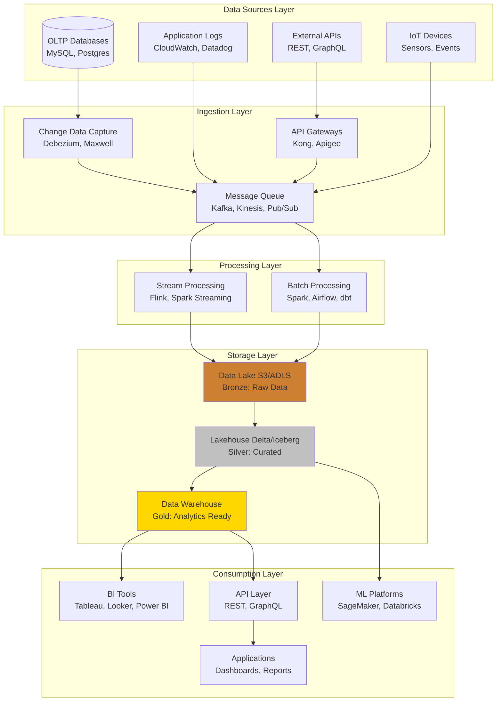

---

### Key Design Questions

When designing a data analytics system, always ask these questions:

#### 1. Data Characteristics
- **Volume**: How much data per day/hour/minute?
- **Velocity**: Real-time, near real-time, micro-batch, or batch?
- **Variety**: Structured, semi-structured, or unstructured?
- **Veracity**: What are data quality and consistency needs?

#### 2. Access Patterns
- Read-heavy or write-heavy?
- Query latency requirements? (milliseconds vs seconds vs minutes)
- Number of concurrent users?
- Ad-hoc vs predefined queries?
- Point queries vs analytical aggregations?

#### 3. Processing Requirements
- Transformation complexity? (simple filters vs complex joins)
- Need for joins across multiple sources?
- Stateful vs stateless processing?
- Reprocessing/backfill requirements?
- Data lineage and audit needs?

#### 4. Scalability Needs
- Expected data growth rate?
- Geographic distribution requirements?
- Peak vs average load patterns?
- Data retention and archival policies?

---

### Storage Selection Matrix

| Scenario | Best Choice | Reason |
|----------|-------------|--------|
| Raw logs & ML data | Data Lake (S3/ADLS) | Schema-on-read, cost-effective, supports any format |
| Business reports & BI | Data Warehouse (Snowflake/BigQuery) | Optimized for OLAP, SQL interface |
| Complex ETL pipelines | Spark / AWS Glue | Distributed compute, handles TB/PB scale |
| Unified raw + analytics | Lakehouse (Delta/Iceberg) | Combines lake economics with warehouse performance |
| Real-time analytics | Kafka + Flink + Warehouse | Low latency streaming pipeline |
| High concurrency BI | Snowflake / BigQuery | Scales compute separately, multi-cluster support |
| Operational analytics | Druid / ClickHouse | Fast aggregations, sub-second queries |
| Time-series data | InfluxDB / TimescaleDB / Druid | Optimized for time-based queries |
| Search & text analytics | Elasticsearch | Full-text search, log analytics |
| Graph relationships | Neo4j / Amazon Neptune | Graph traversal, relationship queries |

---

### Scaling Strategies

#### Ingestion Scaling

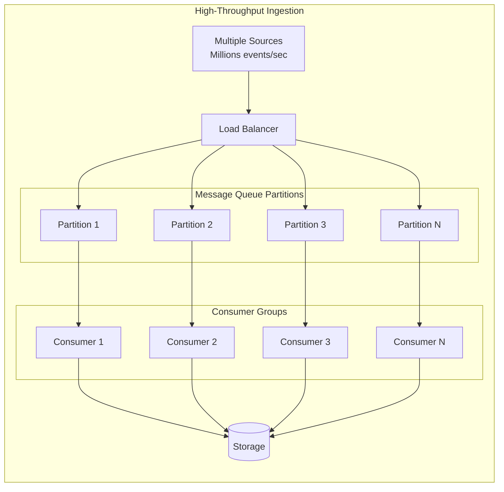

**Strategies**:
- Message queues (Kafka, Kinesis) for buffering
- Partition by key for parallel processing
- Rate limiting at source
- Back-pressure mechanisms
- Dead letter queues for failed messages

#### Storage Scaling

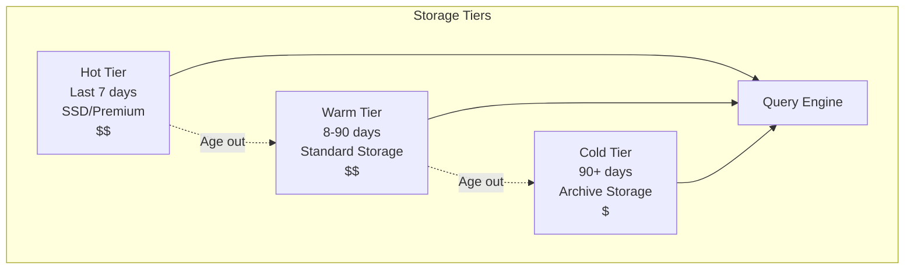

**Strategies**:
- Separate compute from storage (Snowflake model)
- Horizontal partitioning (sharding by key)
- Time-based partitioning (year/month/day)
- Tiered storage (hot/warm/cold based on access patterns)
- Compression and columnar formats

#### Query Performance Optimization

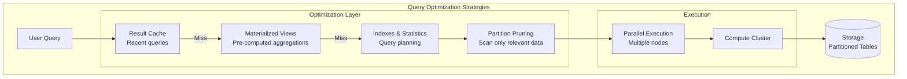

**Techniques**:
- **Materialized views** for repeated aggregations
- **Clustering keys / Sort keys** for common filters
- **Data skipping** with statistics (min/max, bloom filters)
- **Result caching** for identical queries
- **Query federation** across multiple sources
- **Partition pruning** to scan only relevant data

#### Concurrency Handling

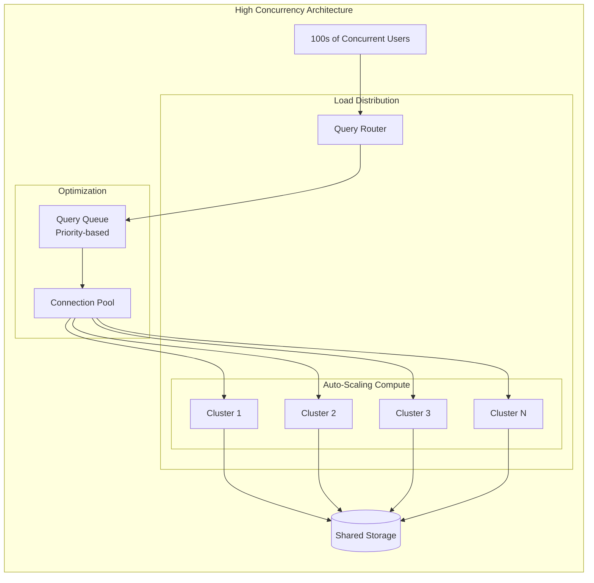

**Strategies**:
- Multi-cluster compute (Snowflake multi-cluster warehouses)
- Read replicas for read-heavy workloads
- Connection pooling to manage connections efficiently
- Query queuing and prioritization
- Workload management (separate ETL from BI queries)

---

## 5. Modern Data Architecture Patterns {#architecture-patterns}

### Lambda Architecture

**Concept**: Separate batch and speed layers for comprehensive data processing.

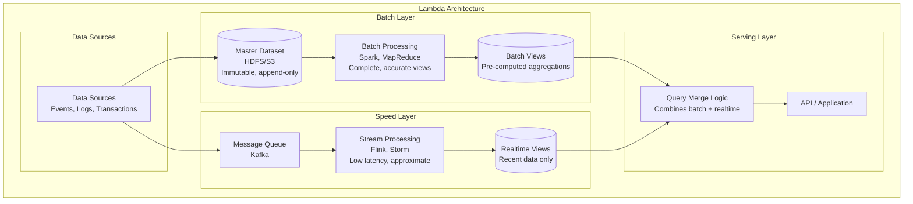

**Layers**:
- **Batch Layer**: Historical data processed with Spark/MapReduce on HDFS/S3
  - Complete and accurate
  - High latency (hours/days)
  - Immutable dataset

- **Speed Layer**: Real-time data processed with Flink/Storm from Kafka
  - Low latency (seconds/minutes)
  - Approximate results
  - Compensates for batch layer lag

- **Serving Layer**: Merged views from both layers (Druid, Cassandra, HBase)
  - Queries combine batch and real-time data
  - Application-facing API

**Purpose**: Handle both batch and real-time processing with different latency/accuracy trade-offs

**Use Cases**:
- Real-time dashboards with historical context
- Fraud detection with learning from history
- Recommendation systems

**Challenges**:
- Complexity of maintaining two separate code paths
- Data consistency between layers
- Operational overhead

---

### Kappa Architecture

**Concept**: Simplified approach treating everything as a stream.

```mermaid
graph TB
    subgraph "Kappa Architecture"
        subgraph "Data Sources"
            Source[Data Sources<br/>All data as events]
        end

        subgraph "Stream Storage"
            Kafka[Kafka / Kinesis<br/>Replayable Event Log<br/>Long retention]
        end

        subgraph "Stream Processing"
            Process1[Stream Processing Layer<br/>Flink / Spark Streaming<br/>Real-time views]
            Process2[Batch Reprocessing<br/>Same code, replay from offset<br/>Historical corrections]
        end

        subgraph "Serving Layer"
            DB[(Serving Database<br/>Cassandra, Elasticsearch<br/>Single source of truth)]
            API[API Layer]
        end
    end

    Source --> Kafka
    Kafka --> Process1
    Kafka -.->|Replay for backfill| Process2

    Process1 --> DB
    Process2 -.->|Corrections| DB

    DB --> API
```

**Simplified Approach**:
- Single stream processing pipeline for all data
- Replayable message queue (Kafka with long retention)
- Same code handles both real-time and batch

**Components**:
- **Stream Storage**: Kafka with days/weeks of retention
- **Processing**: Flink, Spark Streaming, Kafka Streams
- **Serving**: Cassandra, Elasticsearch, Druid

**Advantages**:
- Single codebase (no duplicate logic)
- Easier to maintain and debug
- Flexibility to reprocess by replaying stream

**When to Use**:
- All data can be modeled as events/streams
- Team has strong stream processing expertise
- Want to avoid complexity of Lambda

**Limitations**:
- Requires replayable message queue
- Historical reprocessing can be slow
- May not suit all use cases

---

### Medallion Architecture (Lakehouse)

**Concept**: Progressive data refinement through layers (Bronze → Silver → Gold).

```mermaid
graph TB
    subgraph "Medallion Architecture - Databricks/Delta Lake"
        subgraph "Data Sources"
            Sources[Multiple Sources<br/>APIs, Databases, Logs, IoT]
        end

        subgraph "Bronze Layer - Raw Zone"
            Bronze[(Bronze Tables<br/>Raw, unprocessed data<br/>Exact copy from source<br/>All history preserved<br/>Delta/Parquet format)]
            BronzeNote[Purpose: Data lineage<br/>Audit trail<br/>Reprocessing capability]
        end

        subgraph "Silver Layer - Refined Zone"
            Silver[(Silver Tables<br/>Cleaned, validated<br/>Deduplicated<br/>Type-safe<br/>Conformed dimensions)]
            SilverNote[Purpose: Standardized<br/>Quality assured<br/>Business-ready]
        end

        subgraph "Gold Layer - Curated Zone"
            Gold[(Gold Tables<br/>Business-level aggregates<br/>Star schema / Data marts<br/>Feature tables<br/>ML-ready datasets)]
            GoldNote[Purpose: Optimized for<br/>specific use cases<br/>Low latency queries]
        end

        subgraph "Consumption"
            BI[BI & Analytics<br/>Dashboards, Reports]
            ML[ML & Data Science<br/>Model training]
            Apps[Applications<br/>Production systems]
        end
    end

    Sources --> Bronze
    Bronze --> Silver
    Silver --> Gold

    Gold --> BI
    Silver --> ML
    Gold --> Apps

    BronzeNote -.-> Bronze
    SilverNote -.-> Silver
    GoldNote -.-> Gold

    style Bronze fill:#cd7f32
    style Silver fill:#c0c0c0
    style Gold fill:#ffd700
```

**Layer Characteristics**:

| Layer | Data Quality | Schema | Purpose | Example |
|-------|--------------|--------|---------|---------|
| **Bronze** | Raw, as-is | Flexible | Ingestion, lineage | Raw JSON logs, CDC events |
| **Silver** | Cleaned, validated | Enforced | Standardized business data | Deduplicated users, validated transactions |
| **Gold** | Aggregated, enriched | Optimized | Analytics, ML features | Daily sales by region, user behavior features |

**Benefits**:
- Clear data lineage and quality progression
- Different SLAs per layer (Bronze: append-only, Silver: updates allowed, Gold: optimized)
- Supports both exploratory and production workloads
- Incremental quality improvement
- Easy debugging (can trace back through layers)

**Implementation**:
```
Bronze: Raw Kafka events → Delta table (append-only)
Silver: Deduplicate, validate, join dimensions → Delta table (upserts)
Gold: Aggregate by time/dimension, create features → Delta table (optimized)
```

---

## 6. Interview Checklist {#interview-checklist}

When designing a data analytics platform in an interview:

### Step 1: Clarify Requirements (5-10 minutes)

```mermaid
graph TD
    Start[Start Interview] --> Questions{Ask Clarifying Questions}

    Questions --> Q1[Data Characteristics<br/>• Volume?<br/>• Velocity?<br/>• Variety?]
    Questions --> Q2[Access Patterns<br/>• Query types?<br/>• Latency?<br/>• Concurrency?]
    Questions --> Q3[Processing Needs<br/>• Transformations?<br/>• Batch vs Stream?<br/>• Reprocessing?]
    Questions --> Q4[Scale & Growth<br/>• Current scale?<br/>• Growth rate?<br/>• Geographic?]

    Q1 --> Design[Design Solution]
    Q2 --> Design
    Q3 --> Design
    Q4 --> Design
```

**Questions to Ask**:
- [ ] What are the primary data sources? (databases, APIs, logs, IoT)
- [ ] What's the data volume? (MB/GB/TB per day)
- [ ] What's the data velocity? (real-time, batch, micro-batch)
- [ ] What are the query latency requirements? (milliseconds, seconds, minutes)
- [ ] How many concurrent users? (10s, 100s, 1000s)
- [ ] What are the retention needs? (days, months, years)
- [ ] Are there compliance/regulatory requirements? (GDPR, HIPAA)
- [ ] What's the budget? (cost constraints)

### Step 2: Design Ingestion (5-10 minutes)

```mermaid
graph LR
    subgraph "Ingestion Design Decision Tree"
        Start{Data Source Type}

        Start -->|Databases| CDC[Change Data Capture<br/>Debezium, Maxwell]
        Start -->|Applications| Queue[Message Queue<br/>Kafka, Kinesis]
        Start -->|APIs| Batch[Batch Ingestion<br/>Airflow, Fivetran]
        Start -->|Files| Object[Object Storage<br/>S3, ADLS]

        CDC --> Validate[Schema Validation<br/>Error Handling]
        Queue --> Validate
        Batch --> Validate
        Object --> Validate
    end
```

**Decisions to Make**:
- [ ] Batch vs streaming ingestion?
- [ ] Need for message queue? (Kafka/Kinesis)
- [ ] CDC for databases? (Debezium)
- [ ] Schema validation strategy?
- [ ] Error handling and dead letter queues?
- [ ] Data partitioning strategy?

### Step 3: Choose Processing Approach (5 minutes)

```mermaid
graph TD
    Start{Processing Requirements}

    Start -->|Complex transformations<br/>Large scale| Spark[Apache Spark<br/>Distributed processing]
    Start -->|Real-time millisecond<br/>latency| Flink[Apache Flink<br/>True streaming]
    Start -->|SQL transformations<br/>In-warehouse| dbt[dbt / SQL<br/>ELT approach]
    Start -->|Simple workflows| Airflow[Airflow<br/>Orchestration only]
```

**Decisions to Make**:
- [ ] ETL vs ELT approach?
- [ ] Processing engine? (Spark, Flink, dbt)
- [ ] Transformation complexity?
- [ ] Orchestration tool? (Airflow, Dagster, Prefect)
- [ ] Incremental vs full refresh?

### Step 4: Select Storage (10 minutes)

```mermaid
graph TD
    Start{Storage Requirements}

    Start -->|Structured analytics<br/>SQL queries| Warehouse[Data Warehouse<br/>Snowflake, BigQuery, Redshift]

    Start -->|Raw data<br/>ML workloads| Lake[Data Lake<br/>S3 + Athena/Glue]

    Start -->|Both analytics + ML<br/>ACID needed| Lakehouse[Lakehouse<br/>Delta, Iceberg, Hudi]

    Start -->|Real-time OLAP| OLAP[OLAP Database<br/>Druid, ClickHouse]

    Start -->|Time-series| TimeSeries[Time-Series DB<br/>InfluxDB, TimescaleDB]
```

**Decisions to Make**:
- [ ] Data lake for raw data?
- [ ] Warehouse for analytics?
- [ ] Lakehouse for unified approach?
- [ ] Partitioning strategy? (time-based, key-based)
- [ ] Data retention and archival?
- [ ] File format? (Parquet, Avro, ORC)

### Step 5: Plan Consumption (5 minutes)

```mermaid
graph LR
    subgraph "Consumption Layer"
        Storage[(Storage Layer)]

        Storage --> BI[BI Tools<br/>Tableau, Looker]
        Storage --> API[API Layer<br/>REST/GraphQL]
        Storage --> ML[ML Platforms<br/>Feature serving]
        Storage --> Export[Data Export<br/>Reports, files]
    end
```

**Decisions to Make**:
- [ ] BI tool integration? (Tableau, Looker, Power BI)
- [ ] API layer needed? (REST, GraphQL)
- [ ] ML model serving? (Feature store)
- [ ] Data access controls? (RBAC, row-level security)
- [ ] Caching strategy?

### Step 6: Address Non-Functional Requirements (5-10 minutes)

```mermaid
graph TB
    subgraph "Non-Functional Requirements"
        NFR[System Design]

        NFR --> Scale[Scalability<br/>• Horizontal scaling<br/>• Auto-scaling<br/>• Load balancing]

        NFR --> Monitor[Monitoring<br/>• Data quality checks<br/>• Pipeline health<br/>• Cost tracking]

        NFR --> Reliability[Reliability<br/>• Fault tolerance<br/>• Disaster recovery<br/>• Backups]

        NFR --> Security[Security<br/>• Encryption<br/>• Access control<br/>• Audit logs]

        NFR --> Cost[Cost Optimization<br/>• Storage tiers<br/>• Compute efficiency<br/>• Resource scheduling]
    end
```

**Considerations**:
- [ ] Scalability strategy? (horizontal, vertical)
- [ ] Monitoring and alerting? (data quality, pipeline health)
- [ ] Data quality checks? (validation, anomaly detection)
- [ ] Disaster recovery plan? (backups, replication)
- [ ] Security and compliance? (encryption, access control)
- [ ] Cost optimization? (tiered storage, auto-scaling)

---

## 7. Common Interview Scenarios {#interview-scenarios}

### Scenario 1: Real-time Analytics Dashboard

**Problem Statement**:
*"Design a system to display user activity metrics on a website in near real-time. The dashboard should show active users, page views, clicks, and conversions updated every few seconds."*

**Requirements Clarification**:
- Traffic: 100K requests/second
- Latency: Display updates within 5-10 seconds
- Metrics: Active users (1-min window), page views, clicks, conversions
- Retention: Hot data (7 days), historical data (1 year)
- Users: 100 concurrent dashboard viewers

**Design**:

```mermaid
graph TB
    subgraph "Real-time Analytics System"
        subgraph "Data Sources"
            Web[Web Application<br/>React/Angular]
            Mobile[Mobile Apps<br/>iOS/Android]
        end

        subgraph "Ingestion"
            LB[Load Balancer]
            Gateway[API Gateway<br/>Event tracking endpoint]
            Kafka[Kafka Topics<br/>• user-events<br/>• page-views<br/>• clicks]
        end

        subgraph "Stream Processing"
            Flink[Apache Flink<br/>Windowed Aggregations<br/>5-second tumbling windows]
            State[State Backend<br/>RocksDB]
        end

        subgraph "Hot Storage"
            Redis[(Redis<br/>Last 5 minutes<br/>Sub-millisecond reads)]
        end

        subgraph "Historical Storage"
            Kafka2[Kafka<br/>Raw events]
            Spark[Spark Streaming<br/>Micro-batch processing]
            Snowflake[(Snowflake<br/>Historical analytics)]
        end

        subgraph "API & UI"
            API[Dashboard API<br/>WebSocket/SSE]
            Dashboard[React Dashboard<br/>Real-time charts]
        end
    end

    Web --> LB
    Mobile --> LB
    LB --> Gateway
    Gateway --> Kafka

    Kafka --> Flink
    Flink --> State
    Flink --> Redis

    Kafka --> Kafka2
    Kafka2 --> Spark
    Spark --> Snowflake

    Redis --> API
    Snowflake --> API
    API --> Dashboard
```

**Key Decisions**:

1. **Ingestion Layer**:
   - Kafka for high-throughput event ingestion (handles 100K events/sec easily)
   - Partitioned by user_id for parallel processing

2. **Stream Processing**:
   - Flink for stateful stream processing with exactly-once guarantees
   - 5-second tumbling windows for aggregations
   - Maintains state for active user tracking (1-minute window)

3. **Storage Strategy**:
   - **Redis**: Hot data (last 5 minutes) for dashboard queries
   - **Snowflake**: Historical data for trend analysis
   - Dual write pattern: real-time to Redis, batch to Snowflake

4. **API Layer**:
   - WebSocket/Server-Sent Events for pushing updates to dashboard
   - Queries Redis for real-time metrics
   - Queries Snowflake for historical context

**Scalability**:
- Kafka partitions: 10 partitions for parallelism
- Flink parallelism: 5 task managers
- Redis cluster: 3 nodes with replication
- Auto-scaling for API layer based on WebSocket connections

---

### Scenario 2: Data Lake for Machine Learning

**Problem Statement**:
*"Design a data lake to store and process diverse data sources for training machine learning models. Data includes user behavior logs, transaction records, product catalog, and customer support tickets."*

**Requirements**:
- Data sources: Logs (JSON), Databases (MySQL), Files (CSV), Text (tickets)
- Volume: 10 TB/day
- ML use case: Customer churn prediction, product recommendations
- Data scientists: 50 users running ad-hoc queries
- Training frequency: Daily batch jobs

**Design**:

```mermaid
graph TB
    subgraph "ML Data Lake Architecture"
        subgraph "Data Sources"
            Logs[Application Logs<br/>JSON, 5 TB/day]
            DB[(MySQL<br/>Transactions)]
            Files[CSV Files<br/>Product catalog]
            Tickets[Support Tickets<br/>Unstructured text]
        end

        subgraph "Ingestion Layer"
            Logstash[Logstash/Fluentd<br/>Log aggregation]
            CDC[Debezium CDC<br/>Database changes]
            S3Upload[S3 Upload<br/>File ingestion]
        end

        subgraph "Raw Storage - Bronze"
            S3Bronze[S3 Bucket: raw-data<br/>• Partitioned by date<br/>• Original format<br/>• Immutable]
        end

        subgraph "Processing Layer"
            Glue[AWS Glue<br/>ETL Jobs<br/>Spark-based]
            Crawler[Glue Crawler<br/>Schema discovery]
        end

        subgraph "Curated Storage - Silver/Gold"
            S3Silver[S3 Bucket: curated-data<br/>• Parquet format<br/>• Partitioned<br/>• Validated]

            FeatureStore[Feature Store<br/>SageMaker Feature Store<br/>• Training features<br/>• Online serving]
        end

        subgraph "Metadata & Governance"
            GlueCatalog[Glue Data Catalog<br/>Schema registry<br/>Table metadata]
            Lineage[Data Lineage<br/>Apache Atlas]
        end

        subgraph "Consumption"
            Athena[Athena<br/>Ad-hoc SQL queries]
            Jupyter[JupyterHub<br/>Data exploration]
            SageMaker[SageMaker<br/>Model training]
            Airflow[Airflow<br/>Orchestration]
        end
    end

    Logs --> Logstash
    DB --> CDC
    Files --> S3Upload
    Tickets --> S3Upload

    Logstash --> S3Bronze
    CDC --> S3Bronze
    S3Upload --> S3Bronze

    S3Bronze --> Crawler
    Crawler --> GlueCatalog

    S3Bronze --> Glue
    Glue --> S3Silver
    S3Silver --> FeatureStore

    GlueCatalog --> Athena
    S3Silver --> Athena

    Athena --> Jupyter
    S3Silver --> SageMaker
    FeatureStore --> SageMaker

    Airflow -.-> Glue
    Airflow -.-> SageMaker

    GlueCatalog --> Lineage
```

**Key Decisions**:

1. **Storage Format**:
   - **Bronze (Raw)**: Original format (JSON, CSV) for lineage
   - **Silver (Curated)**: Parquet format for efficient analytics
   - **Partitioning**: By date (`/year=2024/month=01/day=15/`)

2. **Schema Management**:
   - Glue Crawler for automatic schema discovery
   - Glue Data Catalog as centralized metadata store
   - Schema evolution support with Parquet

3. **Feature Engineering**:
   - Spark jobs in AWS Glue for complex transformations
   - Feature Store for ML features (training + serving)
   - Separate training and inference pipelines

4. **Access Patterns**:
   - **Data Scientists**: Athena for SQL exploration, Jupyter notebooks
   - **ML Training**: SageMaker reading from S3/Feature Store
   - **Orchestration**: Airflow for scheduling ETL and training jobs

5. **Data Governance**:
   - Data lineage tracking with Apache Atlas
   - S3 lifecycle policies for cost optimization (hot → cold storage)
   - IAM roles for fine-grained access control

**Cost Optimization**:
- S3 Intelligent-Tiering for automatic cost optimization
- Parquet compression (Snappy) reduces storage by 70%
- Athena charges per query (pay only for scanned data)
- Spot instances for Spark/SageMaker training jobs

---

### Scenario 3: Enterprise Data Warehouse

**Problem Statement**:
*"Design a centralized data warehouse for a retail company. The warehouse should consolidate data from multiple OLTP databases, support 500 concurrent BI users, and enable complex analytical queries for sales reporting, inventory management, and customer analytics."*

**Requirements**:
- Data sources: 5 MySQL databases (orders, inventory, customers, products, stores)
- Update frequency: Every 15 minutes
- Query complexity: Complex joins across 10+ tables, window functions
- Users: 500 concurrent BI users
- SLA: 95% of queries under 10 seconds
- Data retention: 5 years

**Design**:

```mermaid
graph TB
    subgraph "Enterprise Data Warehouse"
        subgraph "Source Systems - OLTP"
            Orders[(Orders DB<br/>MySQL)]
            Inventory[(Inventory DB<br/>MySQL)]
            Customers[(Customers DB<br/>MySQL)]
            Products[(Products DB<br/>MySQL)]
            Stores[(Stores DB<br/>MySQL)]
        end

        subgraph "Change Data Capture"
            Debezium[Debezium CDC<br/>Captures changes]
            Kafka[Kafka<br/>Change events<br/>15-min retention]
        end

        subgraph "ETL Processing"
            Spark[Spark Streaming<br/>• Joins dimensions<br/>• SCD Type 2<br/>• Data quality checks]
        end

        subgraph "Staging Area"
            S3[(S3 Staging<br/>Parquet files)]
        end

        subgraph "Data Warehouse - Snowflake"
            subgraph "ETL Warehouse"
                ETL_WH[ETL Virtual Warehouse<br/>X-Large<br/>Runs every 15 min]
            end

            subgraph "Star Schema"
                FactSales[Fact: Sales<br/>Clustered by date]
                FactInventory[Fact: Inventory<br/>Clustered by store_id]

                DimCustomer[Dim: Customer<br/>SCD Type 2]
                DimProduct[Dim: Product]
                DimStore[Dim: Store]
                DimDate[Dim: Date]
            end

            subgraph "BI Warehouse"
                BI_WH[BI Virtual Warehouse<br/>Large<br/>Multi-cluster 1-10<br/>Auto-scale]
            end

            subgraph "Aggregates"
                MV1[Materialized View<br/>Daily sales by region]
                MV2[Materialized View<br/>Weekly inventory status]
            end
        end

        subgraph "Semantic Layer"
            dbt[dbt<br/>• Business logic<br/>• Metrics definitions<br/>• Data tests]
        end

        subgraph "BI Tools"
            Tableau[Tableau<br/>Executive dashboards]
            Looker[Looker<br/>Self-service analytics]
            PowerBI[Power BI<br/>Operational reports]
        end
    end

    Orders --> Debezium
    Inventory --> Debezium
    Customers --> Debezium
    Products --> Debezium
    Stores --> Debezium

    Debezium --> Kafka
    Kafka --> Spark
    Spark --> S3

    S3 --> ETL_WH

    ETL_WH --> FactSales
    ETL_WH --> FactInventory
    ETL_WH --> DimCustomer
    ETL_WH --> DimProduct
    ETL_WH --> DimStore
    ETL_WH --> DimDate

    FactSales -.-> MV1
    FactInventory -.-> MV2

    MV1 --> dbt
    MV2 --> dbt
    FactSales --> dbt

    dbt --> BI_WH

    BI_WH --> Tableau
    BI_WH --> Looker
    BI_WH --> PowerBI
```

**Key Decisions**:

1. **Data Ingestion Strategy**:
   - **CDC with Debezium**: Captures changes from MySQL databases
   - **Kafka**: Buffers change events, enables replay
   - **15-minute micro-batches**: Balances freshness with load
   - Separate ETL warehouse from BI warehouse for workload isolation

2. **Data Modeling**:
   - **Star schema** for query performance (denormalized dimensions)
   - **SCD Type 2** for customer dimension (track history)
   - **Clustering keys**: `date` for fact_sales, `store_id` for fact_inventory
   - **Materialized views**: Pre-compute common aggregations

3. **Snowflake Architecture**:
   - **ETL Warehouse**: X-Large, scheduled for 15-min loads
   - **BI Warehouse**: Large with multi-cluster (1-10) for 500 users
   - **Auto-scaling**: Automatically adds clusters during peak usage
   - **Auto-suspend**: Warehouses suspend after 5 minutes of inactivity

4. **Performance Optimization**:
   - Clustering keys on large tables (>100 GB)
   - Materialized views for daily/weekly aggregations
   - Result caching (24 hours)
   - Search optimization service for point lookups

5. **Semantic Layer (dbt)**:
   - Centralized business logic and metric definitions
   - Data quality tests (not null, unique, referential integrity)
   - Documentation and lineage
   - Incremental models for large fact tables

6. **High Availability**:
   - Snowflake multi-AZ deployment
   - Kafka replication factor: 3
   - Spark cluster with multiple workers
   - BI tool load balancing

**Query Performance**:
- 95th percentile query time: 8 seconds
- Cache hit rate: 60% (repeated queries)
- Concurrent query support: 500+ users
- Auto-scaling responds to load in `<1` minute
