# System Design: Top-K YouTube Videos

A comprehensive guide to designing a real-time system for tracking and displaying the most viewed YouTube videos using stream processing and probabilistic data structures.

## 1. Problem Understanding & Requirements

### Functional Requirements

- Track view counts for billions of videos in real-time
- Return top-K (e.g., top 100) most viewed videos globally
- Support time-windowed queries (last hour, day, week)
- Handle video metadata updates
- Support regional/category-specific top-K queries

### Non-Functional Requirements

- **High Throughput**: Process millions of views per second
- **Low Latency**: Real-time processing with `<1` second lag
- **Scalability**: Horizontal scaling for growing traffic
- **Approximate Accuracy**: 90-95% accuracy acceptable (trade-off for performance)
- **Availability**: 99.99% uptime
- **Cost Efficiency**: Optimize memory and compute resources

### Scale Estimation

```
Daily Active Users:        1 billion
Videos on Platform:        2 billion
Daily Video Views:         5 billion
Average Views/Second:      ~58,000
Peak Views/Second:         ~200,000
View Event Size:           ~500 bytes
Daily Data Volume:         ~2.5 TB
```

## 2. High-Level Architecture

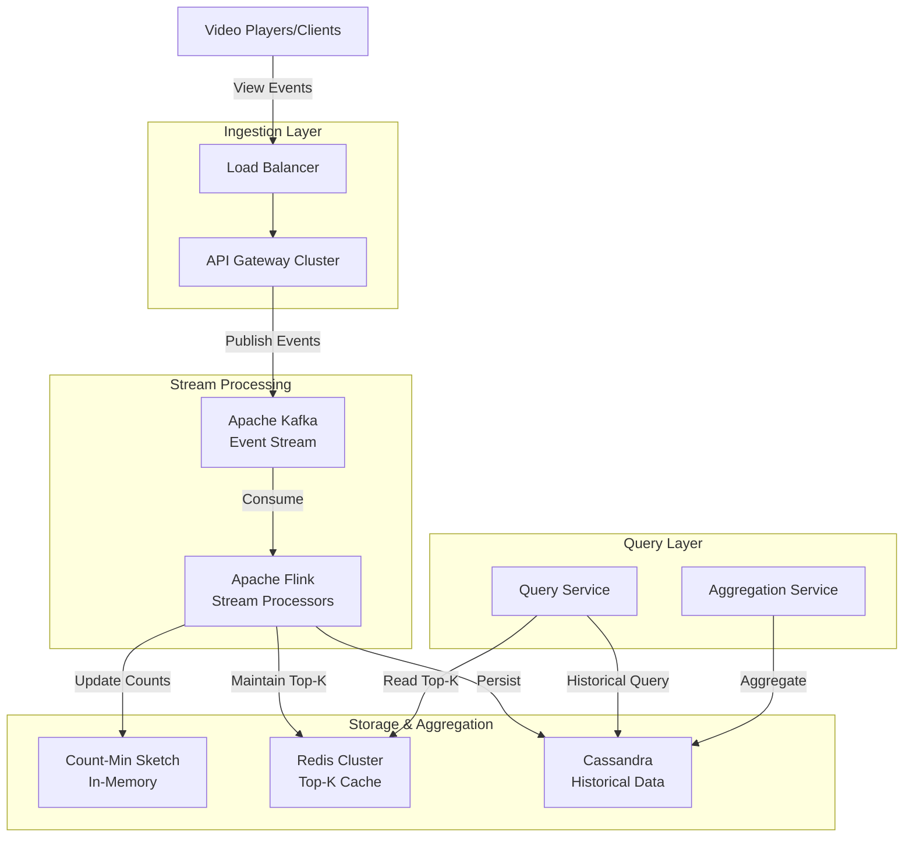

## 3. Core Components Deep Dive

### 3.1 Data Model

**View Event Schema:**
```json
{
  "event_id": "uuid",
  "video_id": "string",
  "user_id": "string",
  "timestamp": "long",
  "region": "string",
  "category": "string",
  "watch_duration": "int",
  "device_type": "string"
}
```

### 3.2 Stream Processing Pipeline

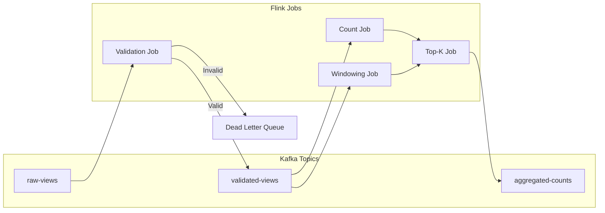

**Stream Processing Flow:**

1. **Validation Stage**: Filter duplicates, validate schema, check fraud
2. **Counting Stage**: Update Count-Min Sketch for approximate counts
3. **Aggregation Stage**: Maintain heap-based Top-K
4. **Windowing Stage**: Time-based aggregations (tumbling/sliding windows)

## 4. Count-Min Sketch Implementation

### What is Count-Min Sketch?

A probabilistic data structure that estimates frequency of events in a stream using sub-linear space.

**Key Properties:**
- Space: O(w × d) where w = width, d = depth
- Update Time: O(d)
- Query Time: O(d)
- Overestimates, never underestimates
- Error bound: ε with probability δ

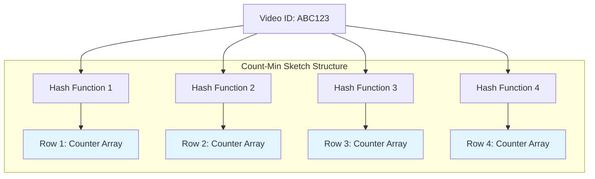

### Count-Min Sketch Algorithm

**Parameters:**
- ε (epsilon): Error tolerance (e.g., 0.01 = 1% error)
- δ (delta): Confidence (e.g., 0.99 = 99% confidence)
- Width (w): ⌈e/ε⌉ ≈ 272 for ε=0.01
- Depth (d): ⌈ln(1/δ)⌉ ≈ 5 for δ=0.01

**Update Operation:**
```
For each hash function h_i (i = 1 to d):
    index = h_i(video_id) mod w
    counter[i][index] += 1
```

**Query Operation:**
```
estimated_count = MIN(counter[i][h_i(video_id) mod w]) for all i
```

### Why Count-Min Sketch for YouTube?

**Memory Comparison:**

| Approach | Memory Required |
|----------|----------------|
| Exact Counters (2B videos) | 16 GB (8 bytes × 2B) |
| Count-Min Sketch | ~10 MB (272 × 5 × 8 bytes) |

**Space Savings: 1,600x reduction!**

## 5. Top-K Algorithm Design

### Heap-Based Approach

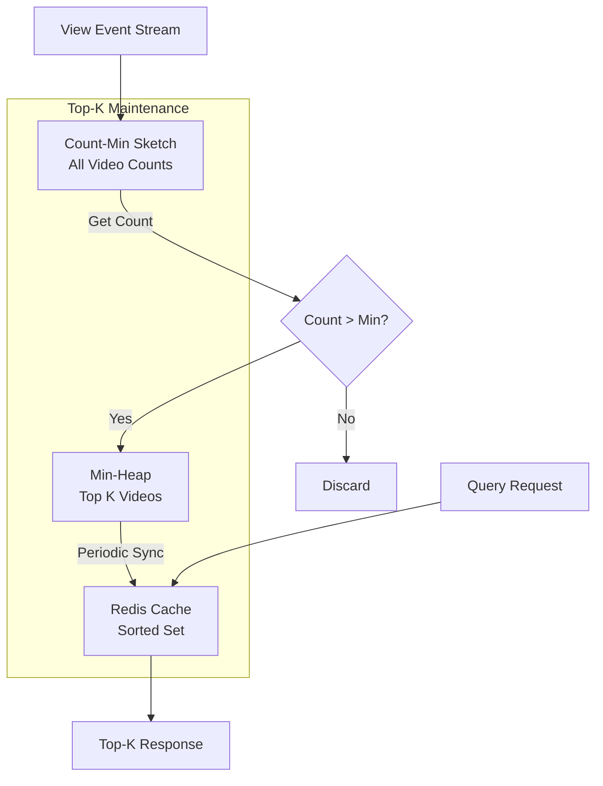

**Algorithm Steps:**

1. **Initialize**: Create min-heap of size K
2. **For each view event**:
   - Update Count-Min Sketch
   - Get estimated count from CMS
   - If count > heap minimum:
     - Remove minimum from heap
     - Insert (video_id, count) into heap
3. **Periodically sync heap to Redis** (every 1-5 seconds)

### Space-Saving Algorithm (Alternative)

Maintains K counters for heavy hitters with guaranteed error bounds:
- Space: O(K)
- Better accuracy than pure Count-Min Sketch
- Combines frequency estimation with Top-K

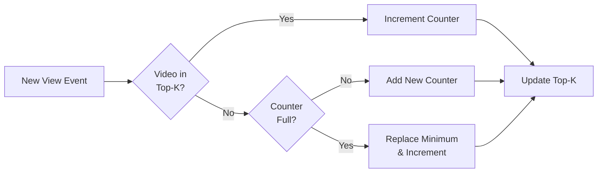

## 6. Time Window Processing

### Window Types

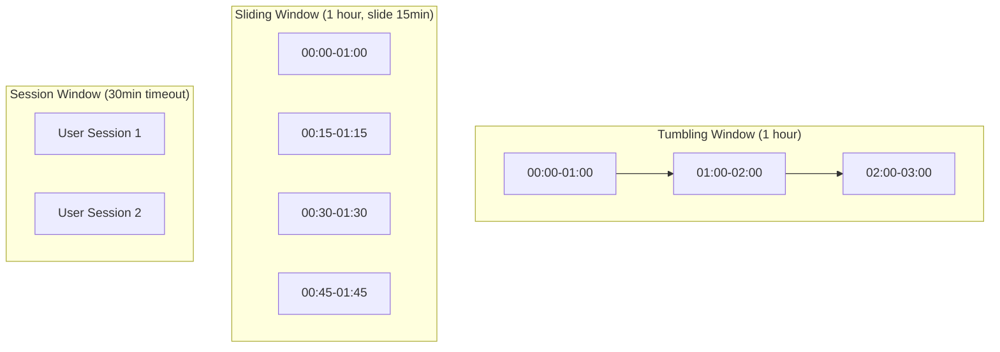

### Multi-Window Architecture

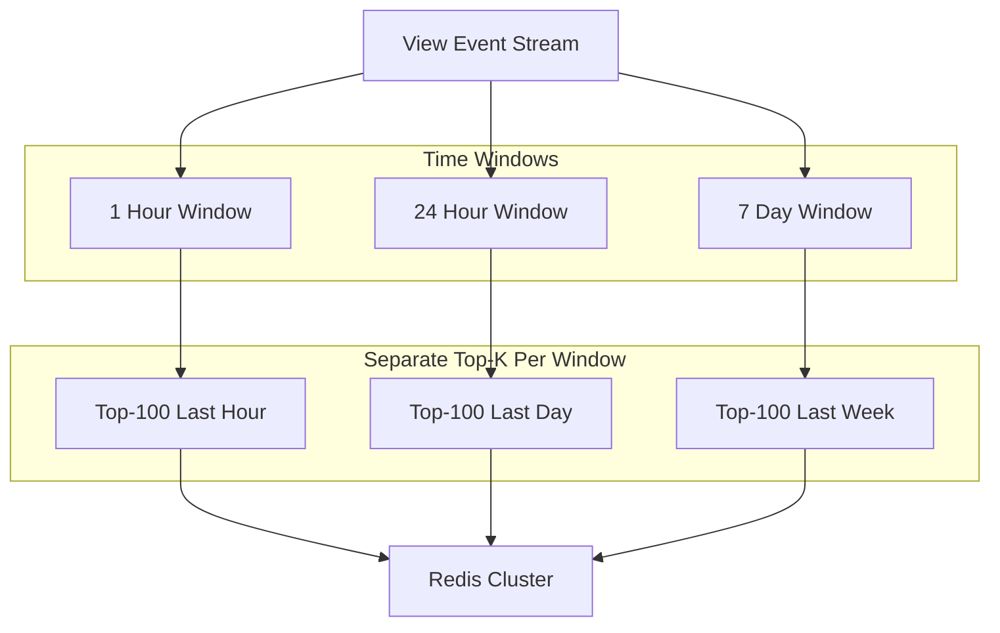

**Implementation with Apache Flink:**

```java
DataStream<ViewEvent> views = ...;

// 1-hour tumbling window
DataStream<TopK> hourlyTopK = views
    .keyBy(ViewEvent::getVideoId)
    .window(TumblingEventTimeWindows.of(Time.hours(1)))
    .aggregate(new CountMinSketchAggregator())
    .process(new TopKFunction(100));

// 24-hour sliding window (slide every hour)
DataStream<TopK> dailyTopK = views
    .keyBy(ViewEvent::getVideoId)
    .window(SlidingEventTimeWindows.of(Time.hours(24), Time.hours(1)))
    .aggregate(new CountMinSketchAggregator())
    .process(new TopKFunction(100));
```

## 7. Database Design

### Redis Schema (Hot Data - Top-K Cache)

```
Key Pattern: topk:{window}:{region}:{category}
Type: Sorted Set (ZSET)

Example:
topk:1h:global:all → [(video_1, 1M), (video_2, 900K), ...]
topk:24h:US:music → [(video_5, 5M), (video_9, 4.8M), ...]
topk:7d:global:gaming → [(video_12, 50M), ...]

Commands:
- ZADD topk:1h:global:all 1000000 video_1
- ZREVRANGE topk:1h:global:all 0 99 WITHSCORES  # Get Top-100
- ZINCRBY topk:1h:global:all 1 video_1           # Increment
```

### Cassandra Schema (Cold Data - Historical)

```cql
CREATE TABLE video_view_counts (
    video_id text,
    time_bucket timestamp,  -- Hourly buckets
    window_type text,       -- '1h', '24h', '7d'
    region text,
    category text,
    view_count bigint,
    PRIMARY KEY ((video_id, window_type), time_bucket, region, category)
) WITH CLUSTERING ORDER BY (time_bucket DESC);

CREATE TABLE top_k_snapshots (
    window_type text,
    time_bucket timestamp,
    region text,
    category text,
    ranking list<frozen<video_rank>>,
    PRIMARY KEY ((window_type, region, category), time_bucket)
) WITH CLUSTERING ORDER BY (time_bucket DESC);

-- Custom type
CREATE TYPE video_rank (
    video_id text,
    view_count bigint,
    rank int
);
```

## 8. System Architecture Patterns

### 8.1 Lambda Architecture Pattern

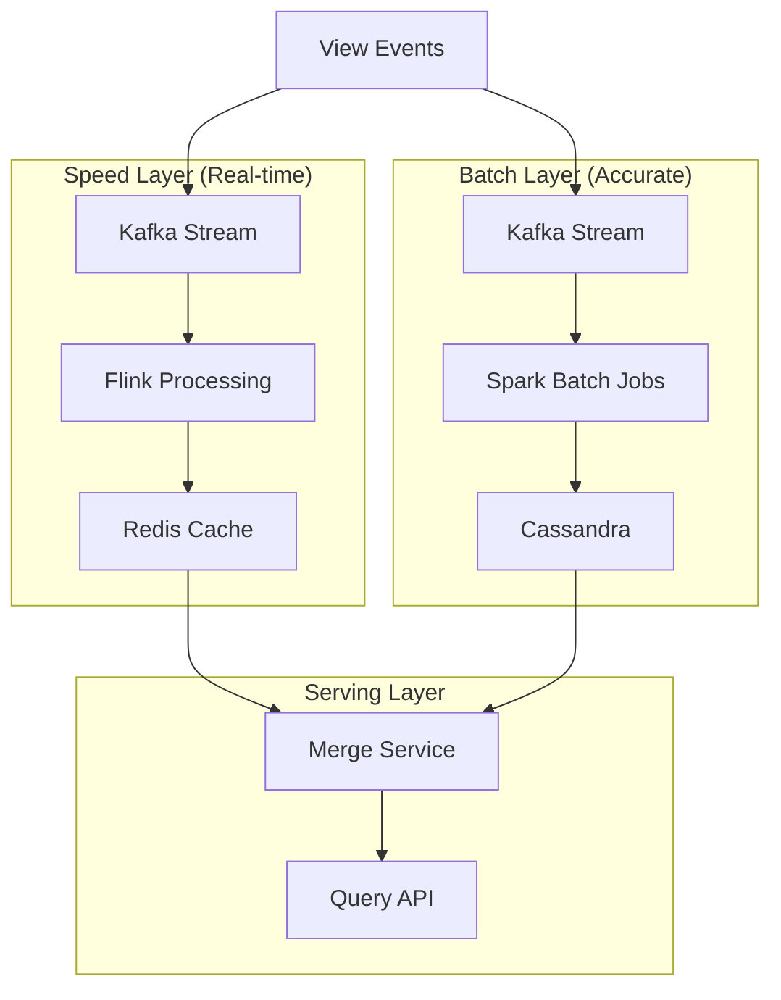

**Benefits:**
- Speed layer: Low latency, approximate results
- Batch layer: High accuracy, eventual consistency
- Serving layer: Merges both for best of both worlds

### 8.2 Kappa Architecture Pattern (Simplified)

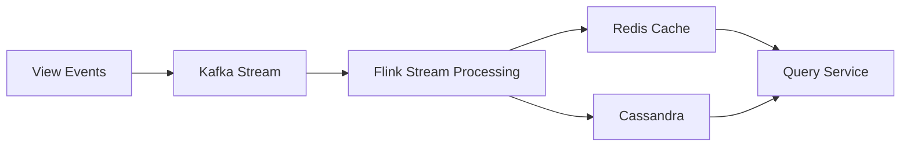

**Benefits:**
- Simpler architecture
- Single processing pipeline
- Reprocess by replaying Kafka

## 9. Optimizations & Trade-offs

### 9.1 Partitioning Strategy

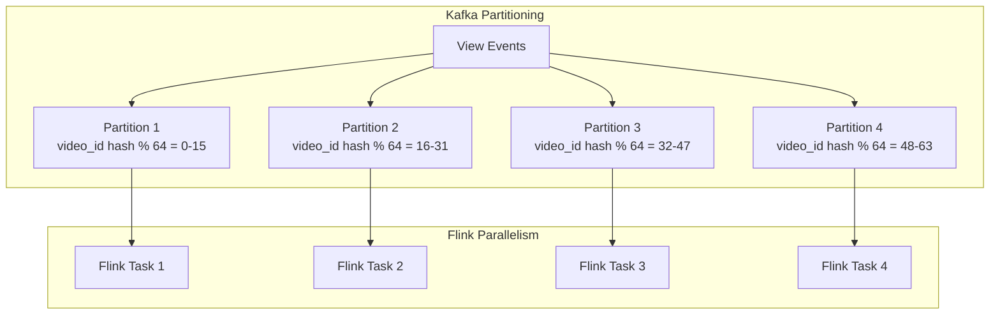

**Partitioning by video_id ensures:**
- All views for same video go to same partition
- Enables local Count-Min Sketch per partition
- Parallel processing across partitions

### 9.2 Hierarchical Aggregation

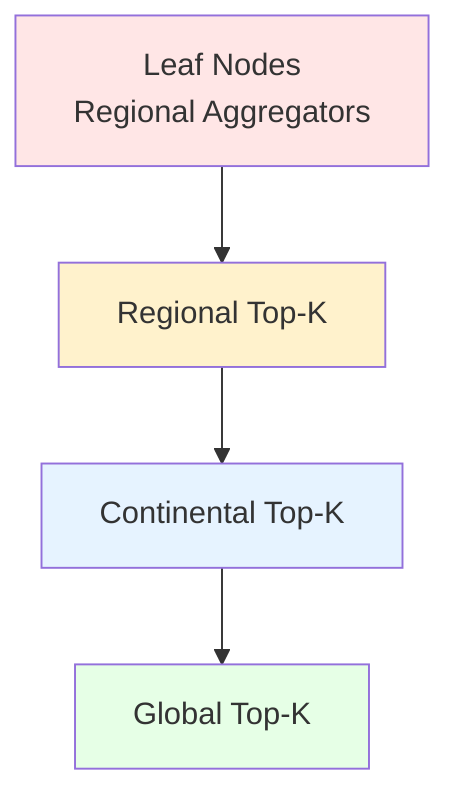

**Benefits:**
- Reduces network traffic
- Pre-aggregation at edge
- Faster global Top-K computation

### 9.3 Sampling Techniques

For extremely high traffic videos, use sampling:

```
If view_count > threshold:
    sample_rate = base_rate / (view_count / threshold)
    if random() < sample_rate:
        process_event()
        weight = 1 / sample_rate
```

## 10. Handling Edge Cases

### 10.1 Viral Video Spike

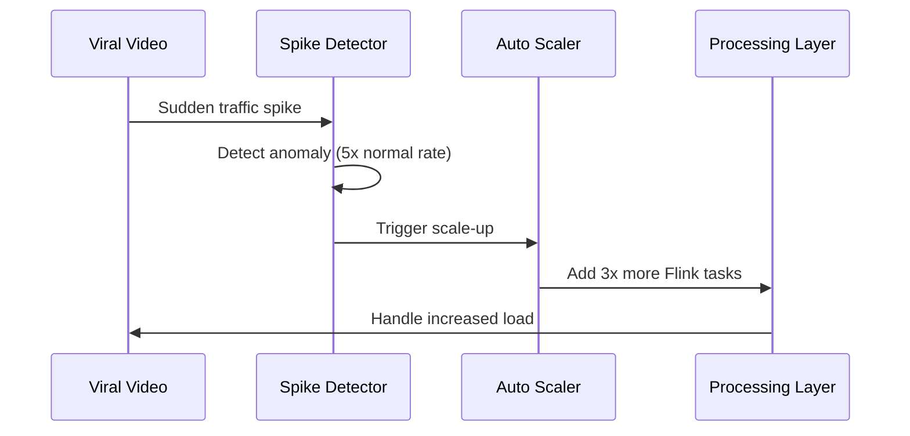

**Detection:**
- Monitor rate of change in view counts
- Alert when growth > 500% in 15 minutes
- Auto-scale processing capacity

### 10.2 Bot Detection & Fraud Prevention

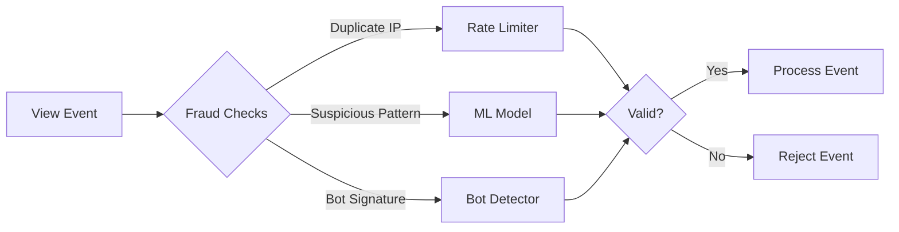

**Fraud Detection Rules:**
- IP-based rate limiting (max N views/minute)
- User session validation
- Device fingerprinting
- ML-based bot detection

### 10.3 Late Arriving Events

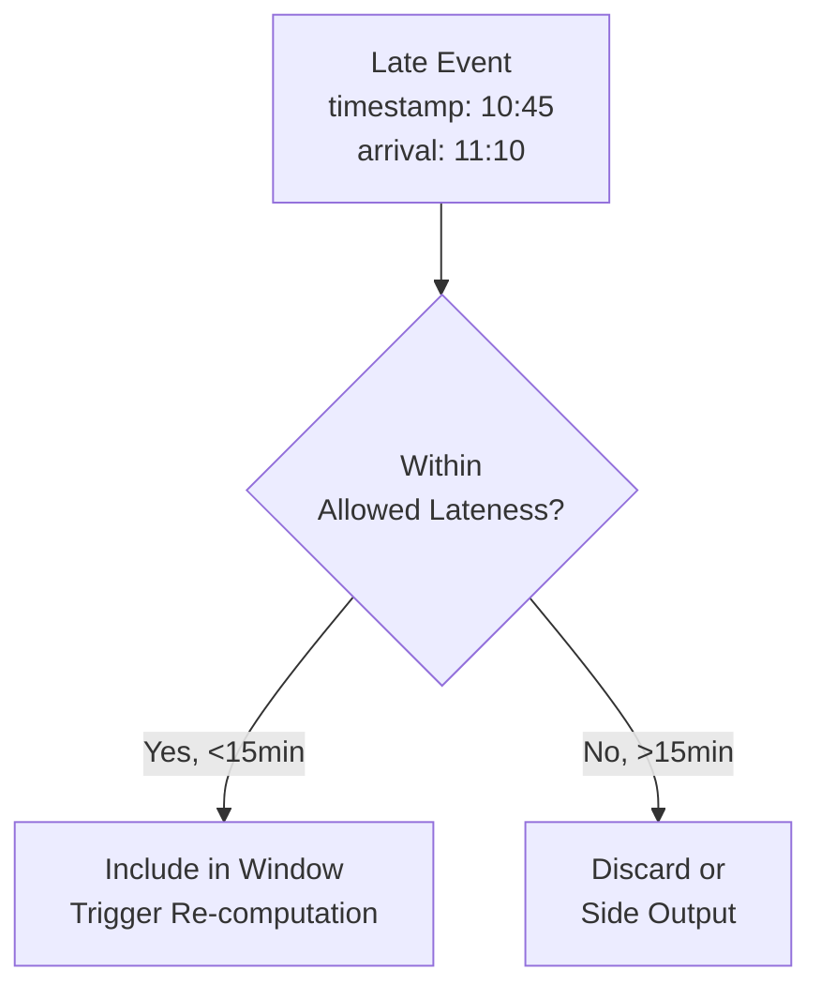

**Watermark Strategy:**
```
Watermark = Max_Event_Time - Allowed_Lateness
Allowed_Lateness = 15 minutes
```

## 11. Monitoring & Observability

### Key Metrics

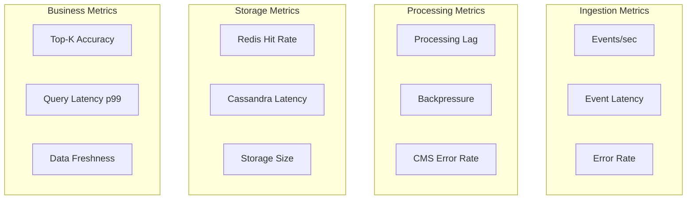

**Alerting Rules:**
- Processing lag > 10 seconds
- Error rate > 0.1%
- Redis hit rate < 95%
- Query latency p99 > 100ms

## 12. API Design

### REST API Endpoints

```
GET /api/v1/videos/top
Query Parameters:
  - k: number (default: 100)
  - window: enum (1h, 24h, 7d, 30d)
  - region: string (default: global)
  - category: string (default: all)

Response:
{
  "window": "24h",
  "region": "US",
  "category": "music",
  "timestamp": "2025-10-21T10:00:00Z",
  "videos": [
    {
      "rank": 1,
      "video_id": "abc123",
      "title": "Viral Song",
      "view_count": 5000000,
      "thumbnail_url": "...",
      "channel": "Popular Artist"
    },
    ...
  ]
}
```

### WebSocket for Real-time Updates

```
ws://api.youtube.com/v1/videos/top/stream
Message Format:
{
  "type": "ranking_update",
  "window": "1h",
  "changes": [
    {"video_id": "xyz789", "old_rank": 5, "new_rank": 3},
    {"video_id": "abc123", "old_rank": null, "new_rank": 100}
  ],
  "timestamp": "2025-10-21T10:30:15Z"
}
```

## 13. Cost Optimization

### Resource Estimates

| Component | Specification | Monthly Cost |
|-----------|--------------|--------------|
| Kafka Cluster | 20 brokers (m5.2xlarge) | $8,000 |
| Flink Cluster | 50 task managers (c5.4xlarge) | $25,000 |
| Redis Cluster | 10 nodes (r6g.2xlarge) | $5,000 |
| Cassandra | 30 nodes (i3.2xlarge) | $15,000 |
| Network | 100 TB egress | $9,000 |
| **Total** | | **~$62,000/month** |

### Cost Optimization Strategies

1. **Use Count-Min Sketch** instead of exact counters (1,600x memory savings)
2. **Tiered storage**: Redis (hot) → Cassandra (warm) → S3 (cold)
3. **Compression**: Enable Kafka message compression (60% reduction)
4. **Reserved instances**: Save 40% on compute costs
5. **Data retention**: Keep only 30 days in Cassandra, archive to S3

## 14. Generic Top-K System Design Framework

### Universal Components for Any Top-K Problem

Every Top-K system (trending tweets, popular products, hot searches, etc.) shares common patterns. Here's a reusable framework:

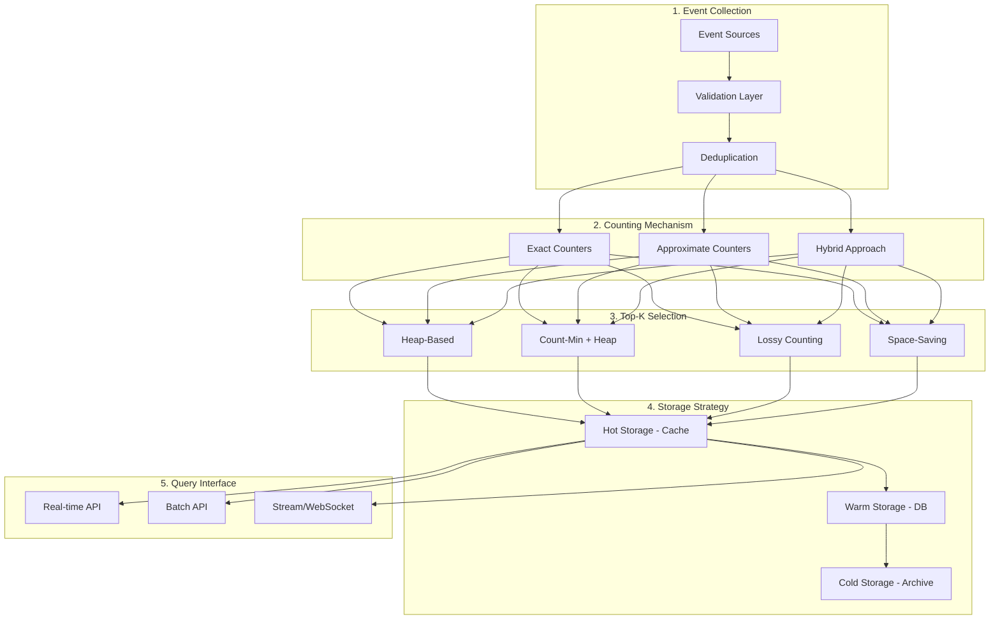

### 14.1 Problem Categories & Patterns

#### Category 1: Heavy Hitters (Most Frequent Items)

**Examples**: Top products, trending hashtags, popular searches

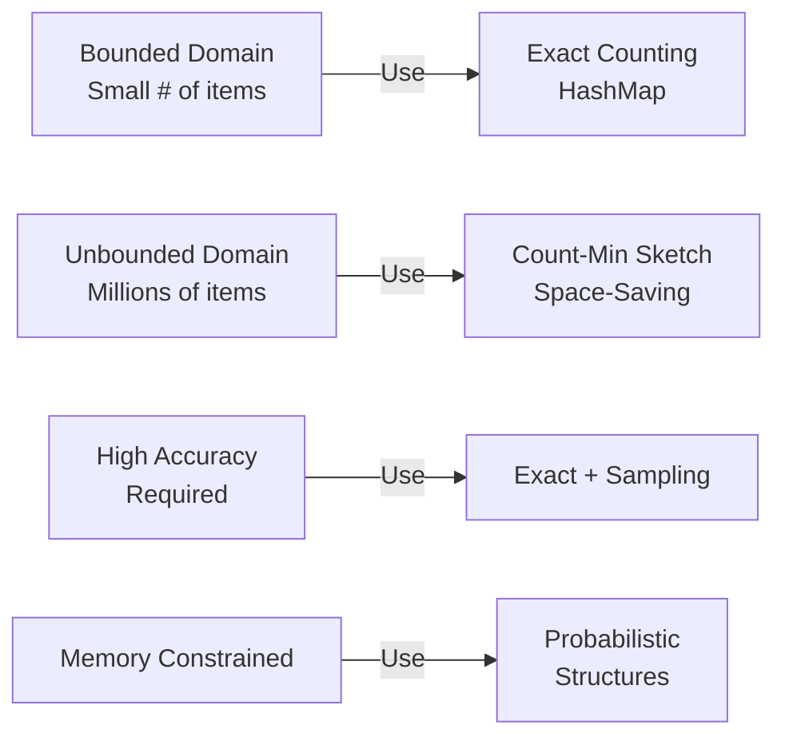

**Decision Matrix:**

| Cardinality | Memory Budget | Latency | Algorithm Choice |
|-------------|---------------|---------|------------------|
| < 100K | High | Low | HashMap + Min-Heap |
| 100K-10M | Medium | Low | Count-Min Sketch + Heap |
| > 10M | Low | Medium | Space-Saving + Sampling |
| Any | Very Low | Any | Lossy Counting |

#### Category 2: Time-Sensitive Ranking (Trending Items)

**Examples**: Trending topics, viral content, breaking news

**Key Challenge**: Balance recency vs popularity

```mermaid
graph TD
    Event[Event with Timestamp]

    subgraph "Time Decay Functions"
        Linear[Linear Decay<br/>weight = 1 - age/window]
        Exp[Exponential Decay<br/>weight = e^(-λ * age)]
        Step[Step Function<br/>weight = 1 if recent, 0 else]
    end

    subgraph "Scoring"
        Score[score = count * decay_weight]
    end

    Event --> Linear & Exp & Step
    Linear & Exp & Step --> Score
```

**Exponential Decay Formula:**
```
score(t) = count * e^(-λ * (current_time - event_time))
λ = decay_rate (e.g., 0.0001 for hourly decay)
```

#### Category 3: Multi-Dimensional Top-K

**Examples**: Top products by category, top videos by region

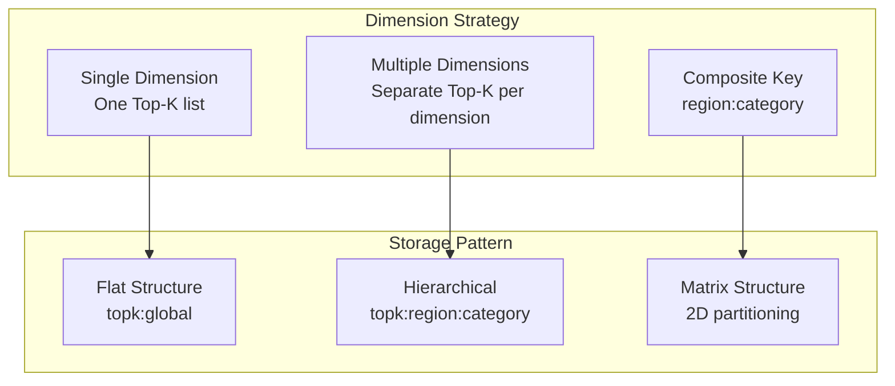

**Storage Example:**
```
# Single dimension
topk:global → [item1, item2, ...]

# Multiple dimensions
topk:us:electronics → [item3, item5, ...]
topk:uk:books → [item7, item9, ...]

# With aggregation
topk:global → aggregate(all regions, all categories)
```

### 14.2 Universal Design Checklist

#### Phase 1: Requirements Analysis

```
✓ Define "Top-K" clearly
  □ By count/frequency?
  □ By score (weighted)?
  □ By revenue/value?
  □ By engagement (clicks, time)?

✓ Cardinality estimation
  □ Total unique items: ___
  □ Active items per window: ___
  □ Expected growth rate: ___

✓ Query patterns
  □ Global Top-K
  □ Regional/Segmented Top-K
  □ Time-windowed Top-K
  □ Real-time updates needed?

✓ Accuracy requirements
  □ Exact required? (±0%)
  □ High accuracy? (±1-2%)
  □ Approximate OK? (±5-10%)

✓ Latency requirements
  □ Real-time (<1s)
  □ Near real-time (1-10s)
  □ Batch (minutes/hours)
```

#### Phase 2: Algorithm Selection

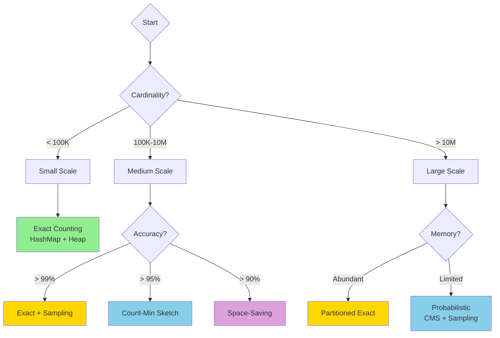

#### Phase 3: Data Structure Selection

**Comparison Table:**

| Data Structure | Space | Update | Query | Use Case |
|----------------|-------|--------|-------|----------|
| **HashMap + Heap** | O(N) | O(log K) | O(1) | Small N, exact counts |
| **Count-Min Sketch** | O(w*d) | O(d) | O(d) | Large N, approximate |
| **Count Sketch** | O(w*d) | O(d) | O(d) | Better accuracy than CMS |
| **Space-Saving** | O(K) | O(1) | O(K) | Memory-critical, Top-K only |
| **Lossy Counting** | O(1/ε) | O(1) | O(1/ε) | Bounded error, simple |
| **HyperLogLog** | O(m) | O(1) | O(1) | Cardinality only |
| **Bloom Filter** | O(m) | O(k) | O(k) | Membership, not counting |

### 14.3 Common Patterns & Anti-Patterns

#### ✅ Best Practices

**1. Layered Aggregation**
```mermaid
graph TD
    L1[Edge Layer<br/>Local Top-1000] --> L2[Regional Layer<br/>Top-500]
    L2 --> L3[Continental Layer<br/>Top-200]
    L3 --> L4[Global Layer<br/>Top-100]

    style L1 fill:#ffe6e6
    style L2 fill:#fff9e6
    style L3 fill:#e6f7ff
    style L4 fill:#e6ffe6
```

**Benefits:**
- Reduces network traffic by 10-100x
- Enables parallel processing
- Natural sharding strategy

**2. Hybrid Counting Strategy**
```
If item_count < threshold:
    Use exact counting (HashMap)
Else:
    Use Count-Min Sketch
```

**3. Progressive Accuracy**
```
Top 10:    Exact (99.9% accuracy)
Top 11-50: High precision (98% accuracy)
Top 51-100: Good enough (95% accuracy)
Top 100+:  Approximate (90% accuracy)
```

**4. Time-Based Partitioning**
```
Partition by hour/day:
  topk:2025-10-21-10 → Hour window
  topk:2025-10-21 → Day window
  topk:2025-10 → Month window

Enable:
- Parallel processing
- Easy TTL/expiration
- Historical queries
```

#### ❌ Anti-Patterns to Avoid

**1. The "Everything Exact" Trap**
```
❌ Storing exact counts for billions of items
✅ Use probabilistic for tail, exact for head
```

**2. The "Single Point of Aggregation"**
```
❌ One server aggregates all events
✅ Hierarchical aggregation across multiple layers
```

**3. The "No Time Windows"**
```
❌ Only all-time Top-K
✅ Multiple windows (1h, 24h, 7d, 30d, all-time)
```

**4. The "Synchronous Updates"**
```
❌ Update Top-K on every single event
✅ Batch updates or micro-batches (100-1000 events)
```

**5. The "Ignoring Cold Start"**
```
❌ Empty Top-K at system startup
✅ Bootstrap from historical data or defaults
```

### 14.4 Scalability Patterns

#### Horizontal Scaling Strategy

```mermaid
graph TB
    subgraph "Partition by Key"
        Hash[Consistent Hashing]
        Range[Range Partitioning]
        Custom[Custom Logic]
    end

    subgraph "Aggregation Strategy"
        Local[Local Top-K per partition]
        Merge[Merge Top-K lists]
        Final[Final Top-K]
    end

    subgraph "Example"
        P1[Partition 1<br/>Items A-F<br/>Top-100]
        P2[Partition 2<br/>Items G-L<br/>Top-100]
        P3[Partition 3<br/>Items M-R<br/>Top-100]
        P4[Partition 4<br/>Items S-Z<br/>Top-100]

        Agg[Aggregator<br/>Merge 400 items<br/>Return Top-100]
    end

    Hash & Range & Custom --> Local
    Local --> Merge --> Final

    P1 & P2 & P3 & P4 --> Agg
```

**Merge Algorithm for Distributed Top-K:**
```python
def merge_topk_lists(partition_topks: List[List[Item]], k: int):
    """
    Merge Top-K from multiple partitions
    Time: O(P * K * log K) where P = partitions
    """
    min_heap = []

    # Initialize with first item from each partition
    for partition_id, items in enumerate(partition_topks):
        if items:
            heapq.heappush(min_heap, (-items[0].count, partition_id, 0))

    result = []
    while min_heap and len(result) < k:
        neg_count, partition_id, idx = heapq.heappop(min_heap)
        items = partition_topks[partition_id]
        result.append(items[idx])

        # Add next item from same partition
        if idx + 1 < len(items):
            heapq.heappush(min_heap, (-items[idx+1].count, partition_id, idx+1))

    return result
```

#### Vertical Scaling Strategy

```mermaid
graph LR
    subgraph "Memory Tiers"
        L1[L1: Redis<br/>Top-100<br/>1ms latency]
        L2[L2: Redis<br/>Top-10K<br/>5ms latency]
        L3[L3: Cassandra<br/>Top-1M<br/>50ms latency]
        L4[L4: S3<br/>Historical<br/>500ms latency]
    end

    Query[Query] --> L1
    L1 -->|Cache Miss| L2
    L2 -->|Cache Miss| L3
    L3 -->|Cache Miss| L4

    style L1 fill:#ff6b6b
    style L2 fill:#ffd93d
    style L3 fill:#6bcf7f
    style L4 fill:#4d96ff
```

### 14.5 Testing & Validation

#### Correctness Testing

```mermaid
graph TD
    subgraph "Test Strategy"
        Unit[Unit Tests<br/>Algorithm correctness]
        Integration[Integration Tests<br/>End-to-end flow]
        Load[Load Tests<br/>Performance]
        Chaos[Chaos Tests<br/>Resilience]
    end

    subgraph "Validation Approach"
        Ground[Ground Truth<br/>Small dataset, exact count]
        Compare[Compare Results<br/>Approximate vs Exact]
        Measure[Measure Error<br/>Calculate accuracy]
    end

    Unit --> Ground
    Integration --> Compare
    Load --> Measure
```

**Accuracy Validation Script:**
```python
def validate_topk_accuracy(exact_counts, approximate_topk, k):
    """
    Validate Top-K accuracy
    """
    # Get ground truth Top-K
    ground_truth = sorted(exact_counts.items(),
                         key=lambda x: x[1],
                         reverse=True)[:k]

    # Calculate metrics
    precision = len(set(approximate_topk) & set(ground_truth)) / k

    # Rank correlation (Kendall's Tau)
    rank_correlation = calculate_kendall_tau(ground_truth, approximate_topk)

    # Count error
    avg_count_error = sum(abs(exact_counts[item] - approx_count)
                         for item, approx_count in approximate_topk) / k

    return {
        'precision': precision,
        'rank_correlation': rank_correlation,
        'avg_count_error': avg_count_error
    }
```

### 14.6 Monitoring Template

**Universal Metrics Dashboard:**

```mermaid
graph TB
    subgraph "Input Metrics"
        M1[Events/sec]
        M2[Event Size]
        M3[Unique Items/sec]
    end

    subgraph "Processing Metrics"
        M4[Processing Latency<br/>p50, p95, p99]
        M5[Queue Depth]
        M6[Error Rate]
    end

    subgraph "Accuracy Metrics"
        M7[Top-K Precision]
        M8[Count Error %]
        M9[Rank Correlation]
    end

    subgraph "Resource Metrics"
        M10[Memory Usage]
        M11[CPU Usage]
        M12[Network I/O]
    end

    subgraph "Business Metrics"
        M13[Query Latency]
        M14[Cache Hit Rate]
        M15[Data Freshness]
    end
```

**Alert Thresholds (Generic):**
```yaml
alerts:
  critical:
    - processing_lag > 60s
    - error_rate > 1%
    - query_latency_p99 > 1s
    - cache_hit_rate < 90%

  warning:
    - processing_lag > 30s
    - error_rate > 0.1%
    - memory_usage > 80%
    - topk_accuracy < 95%
```

### 14.7 Configuration Template

**Reusable Configuration Pattern:**

```yaml
top_k_config:
  # Core parameters
  k: 100                          # Number of top items
  update_interval_ms: 1000        # How often to recompute Top-K

  # Algorithm selection
  algorithm:
    small_scale: "exact_heap"     # < 100K items
    medium_scale: "count_min_sketch"  # 100K-10M items
    large_scale: "space_saving"   # > 10M items

  # Count-Min Sketch parameters
  cms:
    width: 2048                   # w = ceil(e / epsilon)
    depth: 7                      # d = ceil(ln(1 / delta))
    epsilon: 0.001                # Error rate: 0.1%
    delta: 0.001                  # Confidence: 99.9%

  # Time windows
  windows:
    - name: "realtime"
      duration: "5m"
      slide: "1m"
    - name: "hourly"
      duration: "1h"
      slide: "5m"
    - name: "daily"
      duration: "24h"
      slide: "1h"
    - name: "weekly"
      duration: "7d"
      slide: "1d"

  # Storage tiers
  storage:
    hot:
      type: "redis"
      ttl: "1h"
      max_size: "1GB"
    warm:
      type: "cassandra"
      ttl: "30d"
    cold:
      type: "s3"
      ttl: "365d"

  # Performance tuning
  performance:
    batch_size: 1000              # Events per batch
    parallelism: 16               # Parallel workers
    buffer_size: 10000            # Event buffer
    checkpoint_interval: "60s"    # State checkpoint

  # Scaling thresholds
  auto_scale:
    scale_up_threshold: 0.8       # CPU/Memory %
    scale_down_threshold: 0.3
    min_instances: 2
    max_instances: 20
```

### 14.8 Migration Strategy

**From Exact to Approximate:**

```mermaid
graph LR
    subgraph "Phase 1: Dual Write"
        Old[Exact System<br/>HashMap]
        New[Approximate System<br/>Count-Min Sketch]
        Both[Write to Both]
    end

    subgraph "Phase 2: Shadow Mode"
        Compare[Compare Results<br/>Measure Accuracy]
        Validate[Validate < 5% error]
    end

    subgraph "Phase 3: Gradual Migration"
        Route[Route 1% traffic → New]
        Increase[Gradually increase %]
        Switch[100% on New System]
    end

    subgraph "Phase 4: Cleanup"
        Remove[Remove Old System]
    end

    Both --> Compare
    Compare --> Validate
    Validate --> Route
    Route --> Increase
    Increase --> Switch
    Switch --> Remove
```

### 14.9 Quick Reference: Problem → Solution

| Problem Type | Key Challenge | Recommended Approach |
|--------------|---------------|---------------------|
| **Trending Hashtags** | Time decay | Exponential decay + Count-Min Sketch |
| **Popular Products** | Multiple categories | Multi-dimensional Top-K + Redis |
| **Viral Videos** | Sudden spikes | Auto-scaling + Heavy hitter detection |
| **Hot Searches** | Short-lived trends | Sliding windows + Space-Saving |
| **Top Sellers** | Exact revenue | Exact counting + Sampling for tail |
| **Frequent Buyers** | User segmentation | Hierarchical Top-K per segment |
| **Popular Articles** | Time + engagement | Composite score + Min-Heap |
| **Trending Topics** | Multi-region | Distributed Top-K + Merge |

## 15. Summary & Trade-offs

### Design Decisions

| Aspect | Choice | Alternative | Trade-off |
|--------|--------|-------------|-----------|
| **Counting** | Count-Min Sketch | Exact counters | Accuracy vs Memory |
| **Top-K** | Min-Heap + CMS | Space-Saving | Simplicity vs Accuracy |
| **Stream Processing** | Apache Flink | Spark Streaming | Latency vs Maturity |
| **Cache** | Redis Sorted Sets | Memcached | Features vs Speed |
| **Storage** | Cassandra | PostgreSQL | Scale vs Simplicity |
| **Architecture** | Kappa | Lambda | Simplicity vs Accuracy |

### Key Takeaways

1. **Probabilistic data structures** (Count-Min Sketch) enable massive scale
2. **Stream processing** provides real-time updates with low latency
3. **Time windows** support different use cases (trending vs popular)
4. **Partitioning by video_id** enables parallel processing
5. **Hierarchical aggregation** reduces network traffic
6. **Multi-layer caching** (Redis + Cassandra + S3) optimizes cost
7. **Accuracy trade-off** (90-95%) acceptable for this use case

### Scalability

The system can scale to:
- ✅ 500,000+ views/second
- ✅ 5+ billion videos
- ✅ Sub-second query latency
- ✅ 99.99% availability
- ✅ Global distribution across regions

---

**Total System Capacity:**
- **Throughput**: 500K events/sec
- **Latency**: `<1` second end-to-end
- **Accuracy**: 90-95% (configurable via CMS parameters)
- **Storage**: ~10 MB per Top-K (Count-Min Sketch)
- **Scale**: Horizontally scalable to billions of videos
