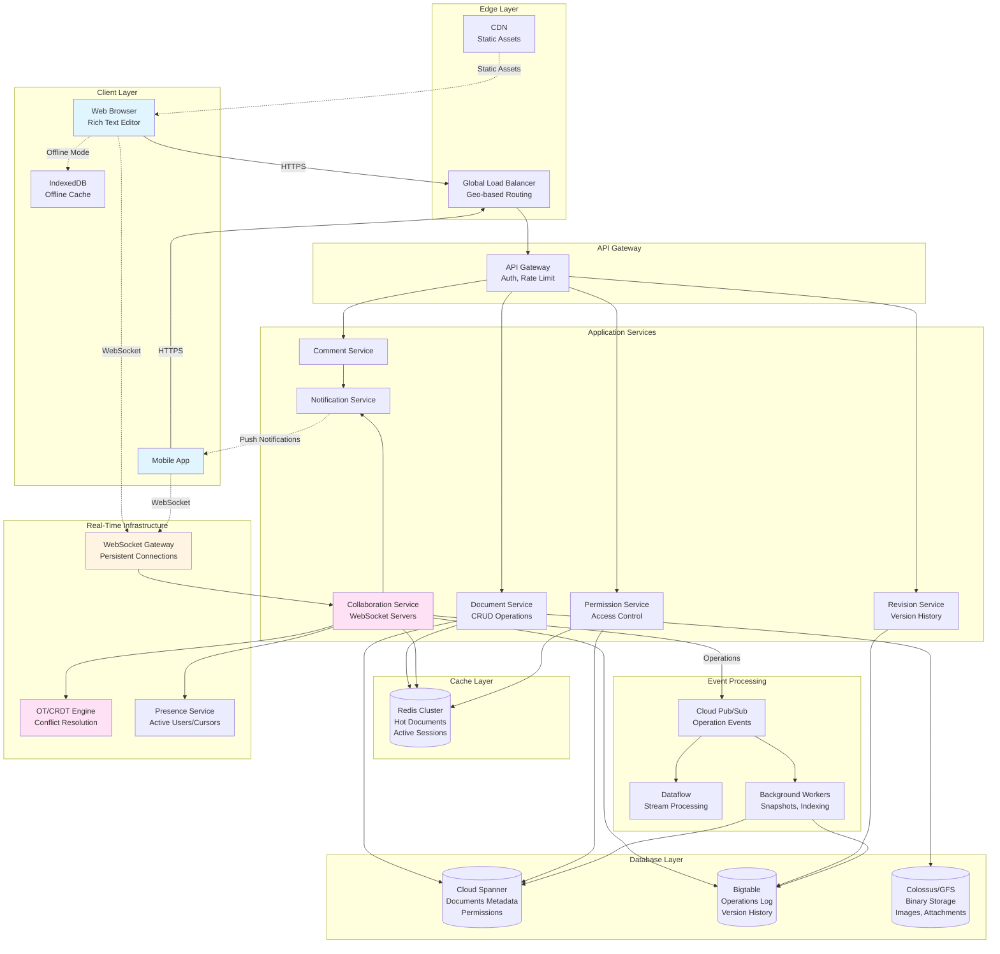

# Google Docs System Design

## 1. Requirements (~5 minutes)

### Functional Requirements

- ✅ Users should be able to **create, edit, and delete documents**
- ✅ Users should be able to **collaborate in real-time** (multiple users editing simultaneously)
- ✅ Users should be able to **see live cursors** and edits from other users
- ✅ Users should be able to **comment, suggest, and review** changes
- ✅ Users should be able to **share documents** with permissions (view, comment, edit)
- ✅ System should support **rich text formatting** (bold, italic, images, tables)
- ✅ System should maintain **version history** with ability to restore
- ✅ Users should be able to **work offline** with sync when reconnected

### Non-functional Requirements

- ✅ **Low Latency**: Real-time collaboration with < 200ms sync latency
- ✅ **Consistency**: Operational Transformation (OT) or CRDT for conflict resolution
- ✅ **High Availability**: 99.99% uptime for document access
- ✅ **Scalability**: Support millions of concurrent users
- ✅ **Data Durability**: No data loss, multiple backups
- ✅ **Conflict-Free**: Concurrent edits should merge automatically
- ✅ **Performance**: Documents should load in < 2 seconds

### Capacity Estimation

**Assumptions:**

- Total Users: 2B (Google Workspace + free users)
- Daily Active Users (DAU): 300M
- Concurrent users: 50M
- Average document size: 100 KB
- Documents per user: 50
- Concurrent editors per document: 10 (average), 100 (max)

**Storage:**

```
Total Documents = 2B users × 50 docs = 100B documents
Document Storage = 100B × 100 KB = 10 PB
Version History (5x multiplier) = 50 PB
Total Storage = 60 PB
```

**Network:**

```
Active Editing Sessions = 50M concurrent users
Operations per second per user = 2 ops/sec (typing)
Total Operations = 50M × 2 = 100M ops/sec
Average operation size = 200 bytes
Bandwidth = 100M × 200 bytes = 20 GB/sec
```

**QPS:**

```
Document Opens = 300M DAU × 20 docs/day / 86400s = ~70K QPS
Edit Operations = 100M ops/sec
Comment/Share Operations = 300M × 5/day / 86400s = ~17K QPS
```

---

## 2. Core Entities (~2 minutes)

### Document

- `documentId`, `title`, `ownerId`, `createdAt`, `lastModified`, `size`

### DocumentContent

- `documentId`, `version`, `operations[]`, `snapshot` (periodic full state)

### User

- `userId`, `email`, `displayName`, `profilePicture`, `storageUsed`

### Permission

- `documentId`, `userId`, `role` (owner/editor/commenter/viewer), `grantedAt`

### Comment

- `commentId`, `documentId`, `userId`, `text`, `range` (start, end positions), `createdAt`, `resolved`

### Revision

- `revisionId`, `documentId`, `userId`, `timestamp`, `operations[]`, `description`

### Session

- `sessionId`, `documentId`, `userId`, `cursorPosition`, `selection`, `lastActive`

---

## 3. API Interface (~5 minutes)

### Protocol Choice

- **REST** for document CRUD operations
- **WebSocket** for real-time collaborative editing
- **gRPC** for internal service communication (lower latency)

### API Endpoints

#### Document Management

```http
POST /v1/documents
{ "title": "Untitled Document" }
Response: { "documentId": "doc-123", "url": "docs.google.com/d/doc-123" }

GET /v1/documents/{documentId}
Response: {
  "document": { "id", "title", "owner", "createdAt" },
  "content": "<full document content>",
  "permissions": [Permission]
}

PUT /v1/documents/{documentId}
{ "title": "New Title" }

DELETE /v1/documents/{documentId}
```

#### Collaboration (WebSocket)

```javascript
// Client connects to WebSocket
ws://collab.google.com/documents/{documentId}?token={jwt}

// Client sends operation
{
  "type": "operation",
  "documentId": "doc-123",
  "userId": "user-456",
  "operation": {
    "type": "insert",
    "position": 150,
    "text": "Hello",
    "timestamp": 1696512000
  }
}

// Server broadcasts to all clients
{
  "type": "operation",
  "userId": "user-789",
  "operation": { ... },
  "version": 1245
}

// Cursor/selection updates
{
  "type": "cursor",
  "userId": "user-456",
  "position": 155,
  "selection": { "start": 150, "end": 155 }
}
```

#### Permissions & Sharing

```http
POST /v1/documents/{documentId}/permissions
{
  "email": "user@example.com",
  "role": "editor",
  "notify": true
}

GET /v1/documents/{documentId}/permissions
Response: { "permissions": [Permission] }

DELETE /v1/documents/{documentId}/permissions/{userId}
```

#### Comments

```http
POST /v1/documents/{documentId}/comments
{
  "text": "Please review this section",
  "range": { "start": 100, "end": 150 }
}

GET /v1/documents/{documentId}/comments
PUT /v1/comments/{commentId}/resolve
DELETE /v1/comments/{commentId}
```

#### Version History

```http
GET /v1/documents/{documentId}/revisions
Response: {
  "revisions": [
    { "id": "rev-1", "timestamp": "2025-10-05T10:00:00Z", "user": "..." }
  ]
}

GET /v1/documents/{documentId}/revisions/{revisionId}
POST /v1/documents/{documentId}/restore/{revisionId}
```

---

## 4. Data Flow (~5 minutes)

### Real-Time Collaborative Editing Flow

1. **User Opens Document**:
   - Client requests document from API
   - Server returns current snapshot + version number
   - Client establishes WebSocket connection

2. **User Types Character**:
   - Client generates operation: `insert('H', position=150)`
   - Operation sent via WebSocket to Collaboration Service
   - Server applies Operational Transformation (OT)
   - Server broadcasts to all other connected clients
   - Clients apply operation to local state

3. **Conflict Resolution**:
   - Two users edit same position simultaneously
   - OT algorithm transforms operations to maintain consistency
   - All clients converge to same final state

4. **Periodic Snapshots**:
   - Every 100 operations or 5 minutes
   - Server creates full document snapshot
   - Stored in database for faster loading

5. **Auto-Save**:
   - Operations buffered and saved every 5 seconds
   - No explicit "Save" button needed
   - Version history updated automatically

---

## 5. High Level Design (~10-15 minutes)

### Architecture Components

**Client Layer:**

- Web/Mobile Apps with rich text editor
- Offline storage (IndexedDB) for offline mode
- Local operation buffer and sync queue

**Edge Layer:**

- CDN for static assets (fonts, icons, templates)
- Geographic load balancers

**API Gateway:**

- Authentication (OAuth 2.0)
- Rate limiting per user
- Request routing

**Application Layer:**

- **Document Service**: CRUD operations
- **Collaboration Service**: Real-time editing (WebSocket servers)
- **Permission Service**: Access control
- **Comment Service**: Comments and suggestions
- **Revision Service**: Version history management
- **Notification Service**: Real-time notifications

**Data Layer:**

- **Spanner** (Google Cloud Spanner): Global distributed SQL for metadata
- **Bigtable**: Operational logs and version history (time-series)
- **Colossus (GFS)**: Binary storage for images, embedded files
- **Memcached/Redis**: Caching hot documents
- **Firestore**: Real-time sync for mobile apps

**Processing Layer:**

- **Pub/Sub**: Event streaming for operations
- **Dataflow**: Stream processing for analytics
- **Background Workers**: Snapshot generation, indexing

---

## 6. Architecture Diagram



---

## 7. Deep Dives (~10 minutes)

### 7.1 Operational Transformation (OT) for Conflict Resolution

**The Problem**: Two users edit the same document simultaneously

**Example Scenario:**

```
Initial State: "Hello World"
User A: Insert 'X' at position 6 → "Hello XWorld"
User B: Delete 'World' (positions 6-10) → "Hello "

Without OT: Chaos!
With OT: Operations transformed to produce consistent result
```

#### OT Algorithm (Simplified)

```javascript
// Operation types
class Operation {
  constructor(type, position, content) {
    this.type = type; // 'insert' or 'delete'
    this.position = position;
    this.content = content;
    this.timestamp = Date.now();
  }
}

// Transform operation against another operation
function transform(op1, op2) {
  if (op1.type === 'insert' && op2.type === 'insert') {
    if (op1.position < op2.position) {
      return op2; // No change needed
    } else if (op1.position > op2.position) {
      // Adjust position
      return new Operation(
        'insert',
        op2.position + op1.content.length,
        op2.content
      );
    } else {
      // Same position - use timestamp to break tie
      if (op1.timestamp < op2.timestamp) {
        return new Operation(
          'insert',
          op2.position + op1.content.length,
          op2.content
        );
      } else {
        return op2;
      }
    }
  }

  if (op1.type === 'insert' && op2.type === 'delete') {
    if (op1.position <= op2.position) {
      return new Operation(
        'delete',
        op2.position + op1.content.length,
        op2.content
      );
    }
    // ... more cases
  }

  // ... handle delete-delete, delete-insert cases
}

// Server applies operation
function applyOperation(documentState, operation) {
  // 1. Get all pending operations from this version
  const pendingOps = getPendingOperations(operation.version);

  // 2. Transform incoming operation against pending operations
  let transformedOp = operation;
  for (const pendingOp of pendingOps) {
    transformedOp = transform(pendingOp, transformedOp);
  }

  // 3. Apply to document
  documentState.apply(transformedOp);

  // 4. Broadcast to all clients
  broadcast(transformedOp);

  return transformedOp;
}
```

**Alternative: CRDT (Conflict-Free Replicated Data Type)**

- Used by some modern systems (e.g., Figma)
- Mathematically guarantees convergence
- No central server needed for conflict resolution
- Trade-off: More complex data structures, higher memory usage

---

### 7.2 Real-Time Collaboration Service Architecture

#### WebSocket Connection Management

```javascript
// Server maintains active connections
const activeConnections = new Map(); // documentId -> Set<WebSocket>

// Client connects
io.on('connection', socket => {
  const { documentId, userId, token } = socket.handshake.query;

  // Authenticate
  if (!verifyToken(token)) {
    socket.disconnect();
    return;
  }

  // Join document room
  socket.join(documentId);

  // Track connection
  if (!activeConnections.has(documentId)) {
    activeConnections.set(documentId, new Set());
  }
  activeConnections.get(documentId).add(socket);

  // Notify others of new user
  socket.to(documentId).emit('user-joined', {
    userId,
    userName: getUserName(userId),
  });

  // Handle operations
  socket.on('operation', op => {
    handleOperation(documentId, userId, op);
  });

  // Handle cursor updates
  socket.on('cursor', cursor => {
    socket.to(documentId).emit('cursor', { userId, ...cursor });
  });

  // Cleanup on disconnect
  socket.on('disconnect', () => {
    activeConnections.get(documentId).delete(socket);
    socket.to(documentId).emit('user-left', { userId });
  });
});
```

#### Operation Handling Flow

```
Client → WebSocket → Collaboration Service → OT Engine → Broadcast
                             ↓
                        Pub/Sub (async)
                             ↓
                    Background Workers → Bigtable
```

**Key Optimizations:**

- **Batching**: Group operations every 50ms to reduce network overhead
- **Compression**: Use binary protocol (Protocol Buffers) instead of JSON
- **Sticky Sessions**: Route user to same server for connection stability

---

### 7.3 Document Storage Strategy

#### Hybrid Storage Model

**1. Snapshot + Operations Log**

```
Document Representation:
- Snapshot (full content) at version 1000
- Operations 1001-1500 (incremental changes)

Load Document:
1. Fetch latest snapshot (version 1000)
2. Fetch operations 1001-1500
3. Apply operations to snapshot
4. Result: Current document state
```

**2. Periodic Snapshot Generation**

```javascript
// Background job runs every 100 operations or 5 minutes
async function createSnapshot(documentId) {
  // Get all operations since last snapshot
  const lastSnapshot = await getLatestSnapshot(documentId);
  const operations = await getOperationsSince(documentId, lastSnapshot.version);

  // Apply operations to reconstruct document
  let content = lastSnapshot.content;
  for (const op of operations) {
    content = applyOperation(content, op);
  }

  // Store new snapshot
  await storeSnapshot({
    documentId,
    version: lastSnapshot.version + operations.length,
    content,
    timestamp: Date.now(),
  });

  // Optional: Delete old operations (keep for version history)
}
```

#### Storage Distribution

**Cloud Spanner** (Document Metadata):

```sql
CREATE TABLE documents (
  document_id STRING(36) NOT NULL,
  title STRING(255),
  owner_id STRING(36),
  created_at TIMESTAMP,
  last_modified TIMESTAMP,
  current_version INT64,
  size_bytes INT64
) PRIMARY KEY (document_id);
```

**Bigtable** (Operations Log):

```
Row Key: {documentId}#{version}
Column Families:
  - operation: {type, position, content, userId, timestamp}
  - metadata: {clientId, deviceType}

Query: Get operations for documentId from version X to Y
```

**Colossus/GFS** (Binary Content):

```
Path: /docs/{documentId}/images/{imageId}.png
Path: /docs/{documentId}/attachments/{fileId}.pdf
```

---

### 7.4 Caching Strategy (Multi-Layer)

#### Layer 1: Client-Side Cache (IndexedDB)

```javascript
// Store document locally for offline access
async function cacheDocument(documentId, content) {
  const db = await openDB('GoogleDocs', 1);
  await db.put('documents', {
    id: documentId,
    content,
    cachedAt: Date.now(),
  });
}

// Load from cache if offline
async function loadDocument(documentId) {
  if (!navigator.onLine) {
    const db = await openDB('GoogleDocs', 1);
    return await db.get('documents', documentId);
  }
  // Otherwise fetch from server
}
```

#### Layer 2: Server-Side Cache (Redis)

```python
# Cache hot documents (actively being edited)
def get_document(document_id):
    cache_key = f"doc:{document_id}"
    cached = redis.get(cache_key)

    if cached:
        return json.loads(cached)

    # Fetch from database
    doc = spanner.query(f"SELECT * FROM documents WHERE document_id = '{document_id}'")

    # Cache for 10 minutes
    redis.setex(cache_key, 600, json.dumps(doc))
    return doc

# Cache active sessions
def cache_active_users(document_id, user_ids):
    key = f"active:{document_id}"
    redis.sadd(key, *user_ids)
    redis.expire(key, 300)  # 5 minutes
```

#### Layer 3: CDN Cache

```
Static Assets:
- JavaScript bundles
- CSS stylesheets
- Fonts, icons
- Document templates

TTL: 1 year (with versioned URLs)
```

---

### 7.5 Permission & Access Control

#### Permission Model

```
Document Permissions Hierarchy:
1. Owner (can delete, change permissions)
2. Editor (can edit, comment, suggest)
3. Commenter (can only add comments)
4. Viewer (read-only)

Additional:
- Link sharing (anyone with link can view/edit)
- Organization-wide access
- Expiring access (temporary permissions)
```

#### Authorization Check

```java
@Service
public class PermissionService {

    public boolean canEdit(String userId, String documentId) {
        // Check cache first
        String cacheKey = "perm:" + userId + ":" + documentId;
        String cached = redis.get(cacheKey);

        if (cached != null) {
            return "editor".equals(cached) || "owner".equals(cached);
        }

        // Query database
        Permission perm = spannerClient.query(
            "SELECT role FROM permissions " +
            "WHERE document_id = @docId AND user_id = @userId",
            documentId, userId
        );

        if (perm == null) {
            // Check link sharing
            perm = checkLinkSharing(documentId);
        }

        // Cache for 5 minutes
        redis.setex(cacheKey, 300, perm.getRole());

        return perm.isEditor() || perm.isOwner();
    }
}
```

#### Sharing Flow

```
1. User clicks "Share"
2. Enter email addresses
3. Select permission level
4. Optional: Add message
5. System:
   - Creates permission records
   - Sends email notification
   - Updates cache
   - Publishes event for audit log
```

---

### 7.6 Version History & Revision Management

#### Storage Strategy

```
Revision Storage:
- Snapshot every 1 hour (or 1000 operations)
- Operations between snapshots stored individually
- Named revisions: User can manually name important versions

Total Storage:
- Keep all revisions for 30 days
- After 30 days: Keep only named revisions + daily snapshots
```

#### Revision Restoration

```javascript
async function restoreRevision(documentId, revisionId) {
  // 1. Fetch revision snapshot
  const revision = await getRevision(revisionId);

  // 2. Create new revision from current state (backup)
  const currentSnapshot = await getCurrentSnapshot(documentId);
  await createRevision(documentId, currentSnapshot, 'Before restore');

  // 3. Apply revision content as current
  await updateDocument(documentId, {
    content: revision.content,
    version: currentVersion + 1,
  });

  // 4. Notify all active editors
  broadcastToDocument(documentId, {
    type: 'document-restored',
    revisionId,
  });

  return revision;
}
```

#### Revision Comparison (Diff)

```python
# Generate diff between two revisions
def compare_revisions(rev1_id, rev2_id):
    rev1 = get_revision(rev1_id)
    rev2 = get_revision(rev2_id)

    # Use diff algorithm (Myers' diff)
    diff = myers_diff(rev1.content, rev2.content)

    return {
        'additions': diff.additions,
        'deletions': diff.deletions,
        'modifications': diff.modifications
    }
```

---

### 7.7 Offline Mode & Sync

#### Offline Capabilities

1. **Edit Offline**: Client buffers operations locally
2. **Reconnect**: Upload buffered operations
3. **Conflict Resolution**: Server applies OT to merge changes

```javascript
class OfflineManager {
  constructor() {
    this.pendingOperations = [];
    this.isOnline = navigator.onLine;

    window.addEventListener('online', () => this.syncPendingOperations());
    window.addEventListener('offline', () => (this.isOnline = false));
  }

  async applyOperation(operation) {
    // Apply locally immediately
    this.localDocument.apply(operation);

    if (this.isOnline) {
      try {
        await this.sendToServer(operation);
      } catch (error) {
        // Connection lost, add to pending queue
        this.pendingOperations.push(operation);
      }
    } else {
      // Offline, buffer operation
      this.pendingOperations.push(operation);
      await this.saveToIndexedDB(operation);
    }
  }

  async syncPendingOperations() {
    this.isOnline = true;

    // Upload all pending operations
    for (const op of this.pendingOperations) {
      try {
        const transformed = await this.sendToServer(op);
        // Server may transform operation due to conflicts
        this.applyTransformedOperation(transformed);
      } catch (error) {
        console.error('Sync failed:', error);
        return; // Retry later
      }
    }

    this.pendingOperations = [];
    await this.clearIndexedDB();
  }
}
```

---

### 7.8 Commenting & Suggesting System

#### Comment Storage

```javascript
// Comment anchored to text range
{
  commentId: "comment-123",
  documentId: "doc-456",
  userId: "user-789",
  text: "Please clarify this point",
  range: {
    start: 150,
    end: 200
  },
  createdAt: "2025-10-05T10:30:00Z",
  resolved: false,
  replies: [
    {
      userId: "user-456",
      text: "Updated!",
      createdAt: "2025-10-05T11:00:00Z"
    }
  ]
}
```

#### Range Tracking Problem

**Challenge**: Comment anchored to positions 150-200, but user inserts text at position 100

**Solution**: Use anchor points + relative positions

```javascript
class CommentAnchor {
  constructor(startNode, startOffset, endNode, endOffset) {
    // Anchor to DOM nodes instead of absolute positions
    this.startNode = startNode;
    this.startOffset = startOffset;
    this.endNode = endNode;
    this.endOffset = endOffset;
  }

  updateAfterOperation(operation) {
    if (operation.type === 'insert') {
      if (operation.position < this.getAbsoluteStart()) {
        // Shift comment range right
        this.startOffset += operation.content.length;
        this.endOffset += operation.content.length;
      }
    }
    // Handle delete, etc.
  }
}
```

---

### 7.9 Performance Optimizations

#### 1. Lazy Loading for Large Documents

```javascript
// Don't load entire 100-page document at once
class DocumentLoader {
  constructor(documentId) {
    this.documentId = documentId;
    this.loadedChunks = new Map();
    this.viewport = { start: 0, end: 5000 }; // Load first 5000 chars
  }

  async loadVisible() {
    const chunk = await fetchChunk(this.documentId, this.viewport);
    this.loadedChunks.set(this.viewport.start, chunk);
    this.render(chunk);
  }

  onScroll() {
    // User scrolled down, load next chunk
    const nextViewport = this.calculateViewport();
    if (!this.loadedChunks.has(nextViewport.start)) {
      this.loadVisible();
    }
  }
}
```

#### 2. Operation Batching

```javascript
// Instead of sending every keystroke
class OperationBatcher {
  constructor() {
    this.buffer = [];
    this.timer = null;
  }

  addOperation(op) {
    this.buffer.push(op);

    // Send batch after 50ms or 10 operations
    if (this.buffer.length >= 10) {
      this.flush();
    } else if (!this.timer) {
      this.timer = setTimeout(() => this.flush(), 50);
    }
  }

  flush() {
    if (this.buffer.length > 0) {
      websocket.send({ type: 'batch', operations: this.buffer });
      this.buffer = [];
      clearTimeout(this.timer);
      this.timer = null;
    }
  }
}
```

#### 3. Differential Sync

```javascript
// Only send changed parts
function createDiff(oldDoc, newDoc) {
  const changes = [];

  // Use Myers' diff algorithm
  const diff = myersDiff(oldDoc, newDoc);

  for (const change of diff) {
    if (change.type === 'add') {
      changes.push({
        type: 'insert',
        position: change.position,
        text: change.text,
      });
    } else if (change.type === 'remove') {
      changes.push({
        type: 'delete',
        position: change.position,
        length: change.length,
      });
    }
  }

  return changes;
}
```

---

### 7.10 Search & Indexing

#### Full-Text Search Across Documents

```
User searches: "quarterly report"

Search Service:
1. Query Elasticsearch index
2. Filter by user permissions (only docs they can access)
3. Rank by relevance + recency
4. Return results with snippets
```

```javascript
// Elasticsearch query
const searchQuery = {
  query: {
    bool: {
      must: [
        {
          multi_match: {
            query: 'quarterly report',
            fields: ['title^3', 'content'],
            type: 'best_fields',
            fuzziness: 'AUTO',
          },
        },
      ],
      filter: [
        {
          terms: {
            'permissions.userId': [currentUserId, 'public'],
          },
        },
      ],
    },
  },
  highlight: {
    fields: {
      content: {
        fragment_size: 150,
        number_of_fragments: 3,
      },
    },
  },
  size: 20,
};
```

#### Indexing Pipeline

```
Document Update → Pub/Sub → Indexing Worker → Elasticsearch

Indexing Worker:
1. Fetch document content
2. Extract text from rich formatting
3. Update Elasticsearch index
4. Debounce: Wait 5 seconds after last edit before indexing
```

---

### 7.11 Monitoring & Observability

#### Key Metrics

**Collaboration Quality:**

- **Sync Latency**: Time from operation to broadcast (target: < 200ms)
- **Conflict Rate**: % of operations requiring transformation
- **Operation Throughput**: Operations/sec per document
- **WebSocket Reconnections**: Stability indicator

**Performance:**

- Document load time (P50, P95, P99)
- Operation apply time
- Search latency
- API response times

**Availability:**

- WebSocket connection success rate
- Database query latency
- Cache hit ratio
- Service uptime (99.99% target)

**User Experience:**

- Cursors visible latency
- Typing lag (keystroke to screen render)
- Auto-save success rate
- Offline sync success rate

#### Alerting Examples

```yaml
Alert: High Sync Latency
Condition: P95 sync latency > 500ms for 5 minutes
Action:
  - Check WebSocket server load
  - Scale collaboration service
  - Investigate network issues

Alert: OT Conflict Spike
Condition: Conflict rate > 10% for 10 minutes
Action:
  - Check for corrupted operations
  - Review recent deployments
  - Investigate specific documents

Alert: Database Write Lag
Condition: Bigtable write latency > 1 second
Action:
  - Scale Bigtable nodes
  - Check for hot spots
  - Review query patterns
```

---

### 7.12 Security & Data Protection

#### 1. Encryption

**At Rest:**

- All documents encrypted with AES-256
- Encryption keys managed by Google KMS
- Separate keys per organization (Workspace)

**In Transit:**

- TLS 1.3 for all HTTP/WebSocket connections
- End-to-end encryption for sensitive documents (optional)

#### 2. Access Control

```java
// Every operation checked against permissions
@PreAuthorize("@permissionService.canEdit(#userId, #documentId)")
public void applyOperation(String userId, String documentId, Operation op) {
    // Apply operation
}

// Audit logging
@AfterReturning("@annotation(Audited)")
public void logAccess(JoinPoint joinPoint) {
    AuditLog log = AuditLog.builder()
        .userId(getCurrentUser())
        .action(joinPoint.getSignature().getName())
        .documentId(extractDocumentId(joinPoint))
        .timestamp(Instant.now())
        .ipAddress(getClientIp())
        .build();

    auditLogger.log(log);
}
```

#### 3. DLP (Data Loss Prevention)

```javascript
// Scan for sensitive data before sharing
async function validateSharing(documentId, targetEmail) {
  const content = await getDocumentContent(documentId);

  // Check for PII, credit cards, SSN, etc.
  const sensitiveData = await dlpService.scan(content);

  if (sensitiveData.found) {
    return {
      allowed: false,
      reason: 'Document contains sensitive information',
      details: sensitiveData.types,
    };
  }

  // Check if sharing externally (outside organization)
  if (!isInternalEmail(targetEmail)) {
    await requestAdminApproval(documentId, targetEmail);
  }

  return { allowed: true };
}
```

#### 4. Rate Limiting

```python
# Prevent abuse
RATE_LIMITS = {
    'operations': (1000, 60),      # 1000 operations per minute
    'document_create': (50, 3600), # 50 docs per hour
    'share': (100, 3600),          # 100 shares per hour
    'export': (20, 3600)           # 20 exports per hour
}

def check_rate_limit(user_id, action):
    key = f"ratelimit:{action}:{user_id}"
    limit, window = RATE_LIMITS[action]

    current = redis.incr(key)
    if current == 1:
        redis.expire(key, window)

    if current > limit:
        raise RateLimitExceeded(f"Too many {action} requests")
```

---

## Summary

### Key Design Decisions

1. **Operational Transformation (OT)**: Ensures conflict-free collaborative editing
2. **Snapshot + Operations Log**: Efficient storage and fast loading
3. **WebSocket for Real-Time**: Low-latency synchronization (< 200ms)
4. **Distributed Database**: Spanner for global consistency, Bigtable for time-series
5. **Multi-Layer Caching**: Client (IndexedDB) → Redis → Database
6. **Offline-First**: Local operations buffer with sync on reconnect
7. **Microservices Architecture**: Independently scalable services

### Scalability Achieved

- ✅ 2B users, 50M concurrent editors
- ✅ < 200ms sync latency
- ✅ 99.99% availability
- ✅ 100M operations/sec throughput
- ✅ Conflict-free merging with OT

---

## Trade-offs & Considerations

| Decision                         | Pro                                     | Con                                                 |
| -------------------------------- | --------------------------------------- | --------------------------------------------------- |
| Operational Transformation       | Guarantees consistency, proven at scale | Complex implementation, requires careful versioning |
| Snapshot + Ops Log               | Fast loading, efficient storage         | More complex than pure event sourcing               |
| WebSocket Persistent Connections | Real-time updates, low latency          | Connection management complexity, server resources  |
| Spanner for Metadata             | Global consistency, strong ACID         | Higher cost than NoSQL alternatives                 |
| Client-Side Caching              | Offline mode, instant loading           | Sync complexity, potential staleness                |
| Periodic Snapshots               | Bounded replay time                     | Storage overhead (5x multiplier)                    |

---

## Advanced Topics

### 7.13 Rich Text Representation

#### DOM-Based vs Operational Model

```javascript
// Google Docs uses custom data structure (not direct DOM)
class DocumentModel {
  constructor() {
    this.paragraphs = [];
    this.styles = new Map();
  }

  // Paragraph with formatting
  addParagraph(text, formatting) {
    const para = {
      id: generateId(),
      text,
      formatting: {
        bold: [], // Ranges: [{start: 0, end: 5}]
        italic: [],
        fontSize: 12,
        alignment: 'left',
      },
      type: 'paragraph', // or 'heading1', 'list-item', etc.
    };
    this.paragraphs.push(para);
  }

  // Apply operation to model
  applyOperation(op) {
    const para = this.findParagraph(op.paragraphId);

    if (op.type === 'insert') {
      para.text =
        para.text.slice(0, op.position) +
        op.content +
        para.text.slice(op.position);
      this.updateFormatting(para, op);
    }

    // Render to DOM
    this.renderToDom();
  }
}
```

#### Formatting Operations

```javascript
// Bold operation: Apply bold to range
{
  type: 'format',
  paragraphId: 'para-123',
  range: { start: 10, end: 20 },
  style: 'bold',
  value: true
}

// Complex: Bold + Italic overlapping ranges
Paragraph text: "Hello World Everyone"
Bold: [0-10]
Italic: [6-15]

Result formatting:
[0-5]:   Bold only
[6-10]:  Bold + Italic
[11-15]: Italic only
[16-20]: No formatting
```

---

### 7.14 Presence & Awareness

#### Real-Time Cursor Tracking

```javascript
// Each user has a color and cursor position
class PresenceManager {
  constructor() {
    this.users = new Map(); // userId -> cursor state
    this.colors = ['#FF5733', '#33FF57', '#3357FF', ...];
  }

  updateCursor(userId, position, selection) {
    const user = this.users.get(userId) || {
      color: this.assignColor(userId),
      name: this.getUserName(userId)
    };

    user.cursor = position;
    user.selection = selection;
    user.lastUpdate = Date.now();

    this.users.set(userId, user);

    // Broadcast to others
    this.broadcast('cursor-update', {
      userId,
      position,
      selection,
      color: user.color
    });
  }

  renderCursors() {
    // Draw colored cursors and selection ranges for each user
    for (const [userId, user] of this.users) {
      if (Date.now() - user.lastUpdate > 5000) {
        this.users.delete(userId); // User inactive
        continue;
      }

      this.drawCursor(user.cursor, user.color, user.name);
      if (user.selection) {
        this.drawSelection(user.selection, user.color);
      }
    }
  }
}
```

---

### 7.15 Handling Edge Cases

#### 1. Network Partitions

```
Scenario: User edits offline for 2 hours, comes back online

Solution:
1. Upload all buffered operations
2. Server applies OT to each operation
3. If conflicts detected, server sends transformed ops back
4. Client applies transformations to local state
5. Eventual convergence guaranteed
```

#### 2. Concurrent Formatters

```
User A: Bolds "Hello"
User B: Deletes "Hello"

OT Resolution:
- Delete operation wins (text removed)
- Bold operation becomes no-op (nothing to bold)
```

#### 3. Very Large Documents

```
Problem: 1000-page document with 10 simultaneous editors

Solution:
1. Split document into sections
2. Each section has independent operation log
3. Load only visible sections + adjacent buffers
4. Background workers merge section snapshots periodically
```

---

### 7.16 Export & Import

#### Export Formats

```javascript
class ExportService {
  async export(documentId, format) {
    const doc = await getDocument(documentId);

    switch (format) {
      case 'docx':
        return this.convertToDocx(doc);
      case 'pdf':
        return this.convertToPdf(doc);
      case 'html':
        return this.convertToHtml(doc);
      case 'markdown':
        return this.convertToMarkdown(doc);
    }
  }

  convertToDocx(doc) {
    // Use library like docx.js
    const docx = new Document({
      sections: doc.paragraphs.map(p => ({
        children: [
          new Paragraph({
            text: p.text,
            bold: p.formatting.bold,
            // ... other formatting
          }),
        ],
      })),
    });

    return Packer.toBuffer(docx);
  }
}
```

#### Import & OCR

```
Import Flow:
1. User uploads Word/PDF file
2. Parse file to extract text + formatting
3. Convert to Google Docs internal format
4. Create initial snapshot
5. If PDF: Run OCR (Google Cloud Vision API)
```

---

## Future Enhancements

1. **AI-Powered Features**
   - Smart Compose (autocomplete sentences)
   - Grammar and style suggestions
   - Automatic summarization
   - Translation in real-time

2. **Advanced Collaboration**
   - Video/audio chat integrated in document
   - Live presentations with audience Q&A
   - Voting/polling within documents

3. **Enhanced Rich Media**
   - Embedded 3D models
   - Interactive charts/graphs
   - Code execution environments
   - Miro-style infinite canvas

4. **Blockchain Integration**
   - Immutable revision history
   - Document provenance tracking
   - Digital signatures for legal docs

5. **Improved Offline**
   - Peer-to-peer sync (no server needed)
   - Local-first architecture
   - Conflict resolution on device

6. **Accessibility**
   - Real-time transcription for voice input
   - Screen reader optimizations
   - Dyslexia-friendly formatting

7. **Performance**
   - WebAssembly for faster OT
   - CRDT adoption for simpler conflict resolution
   - Edge computing for global low latency

---

## Conclusion

Google Docs is fundamentally a **distributed systems problem** focused on:

1. **Consistency**: OT/CRDT ensures all users see the same document
2. **Low Latency**: WebSocket + geographic distribution
3. **Availability**: Offline mode + multi-region replication
4. **Scalability**: Microservices + horizontal scaling

The core innovation is **Operational Transformation**, which allows conflict-free merging of concurrent edits. Combined with a robust infrastructure (Spanner, Bigtable, Pub/Sub), Google Docs delivers a seamless collaborative experience to billions of users.

---

## References & Further Reading

- **Operational Transformation**: "Operational Transformation in Real-Time Group Editors" (Ellis & Gibbs, 1989)
- **CRDT**: "Conflict-free Replicated Data Types" (Shapiro et al., 2011)
- **Google Spanner**: "Spanner: Google's Globally Distributed Database" (Corbett et al., 2012)
- **Real-Time Collaboration**: "Jupiter Collaboration System" (Nichols et al., 1995)
