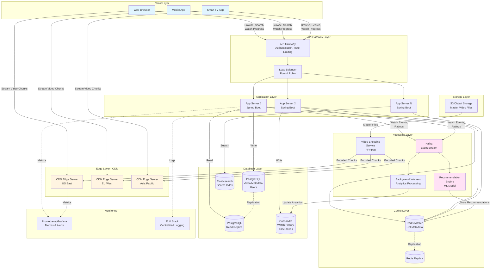

# Netflix System Design

## 1. Requirements (~5 minutes)

### Functional Requirements

- ✅ Users should be able to **browse and search** for movies/TV shows
- ✅ Users should be able to **stream videos** with adaptive quality (240p to 4K)
- ✅ Users should be able to **resume playback** from where they left off
- ✅ Users should be able to **rate content** and get personalized recommendations

### Non-functional Requirements

- ✅ The system should prioritize **availability** over consistency (CAP - users should always stream)
- ✅ The system should scale to support **200M+ concurrent users**
- ✅ Video streaming should have **initial buffering < 2 seconds**, smooth playback
- ✅ The system should be **highly available** (99.99% uptime)
- ✅ The system should handle **bursty traffic patterns** (peak: 6 PM - 11 PM)
- ✅ The system should have **geo-distributed content delivery** for low latency
- ✅ Video content should be **durable and replicated** across regions

### Capacity Estimation

**Assumptions:**

- Total Users: 500M
- Daily Active Users (DAU): 200M
- Concurrent viewers (peak): 50M
- Average video size: 1GB/hour (compressed)
- Average watch time: 2 hours/day
- Catalog size: 10,000 titles

**Storage:**

```
Video Storage = 10,000 titles × 2 hours × 5 quality levels × 1GB
              = 100,000 GB = 100 TB (master copies)
With CDN replication (×50 regions) = 5 PB
```

**Bandwidth:**

```
Peak Concurrent Streams = 50M users
Average Bitrate = 5 Mbps
Peak Bandwidth = 50M × 5 Mbps = 250 Tbps
```

**QPS:**

```
Metadata Requests = 200M DAU × 50 requests/day / 86400s = ~115K QPS
Video Chunk Requests = 50M concurrent × 4 chunks/sec = 200M requests/sec (handled by CDN)
```

---

## 2. Core Entities (~2 minutes)

### User

- `userId`, `email`, `subscriptionType`, `preferences`

### Video

- `videoId`, `title`, `description`, `duration`, `releaseDate`, `genres`, `maturityRating`

### VideoMetadata

- `videoId`, `resolutions`, `encodedFiles`, `thumbnails`, `subtitles`

### WatchHistory

- `userId`, `videoId`, `timestamp`, `watchedDuration`, `completed`

### Rating

- `userId`, `videoId`, `rating` (1-5), `timestamp`

### Recommendation

- `userId`, `recommendedVideoIds`, `score`, `generatedAt`

---

## 3. API Interface (~5 minutes)

### Protocol Choice

- **REST** for metadata operations
- **HTTP Streaming (HLS/DASH)** for video delivery

### API Endpoints

#### Authentication

```http
POST /v1/auth/login
Content-Type: application/json

{
  "email": "user@example.com",
  "password": "securepass"
}

Response: { "authToken": "jwt_token_here" }
```

```http
POST /v1/auth/refresh
Authorization: Bearer <token>

Response: { "newToken": "new_jwt_token" }
```

#### Browse & Search

```http
GET /v1/videos?genre=action&page=1&limit=20

Response: {
  "videos": [Video],
  "totalPages": 50,
  "currentPage": 1
}
```

```http
GET /v1/videos/search?query=inception

Response: {
  "results": [Video]
}
```

```http
GET /v1/videos/{videoId}

Response: {
  "video": Video,
  "metadata": VideoMetadata
}
```

#### Streaming

```http
GET /v1/videos/{videoId}/manifest

Response: {
  "manifestUrl": "https://cdn.netflix.com/videos/123/master.m3u8"
}
```

```http
GET /v1/videos/{videoId}/stream/{resolution}/{chunkId}

Response: Binary video chunk
```

#### Watch History

```http
POST /v1/watch-history
Content-Type: application/json

{
  "videoId": "video-123",
  "timestamp": 1234567890,
  "watchedDuration": 3600
}

Response: { "success": true }
```

```http
GET /v1/watch-history?userId={userId}

Response: {
  "history": [WatchHistory]
}
```

#### Ratings & Recommendations

```http
POST /v1/ratings
Content-Type: application/json

{
  "videoId": "video-123",
  "rating": 5
}

Response: { "success": true }
```

```http
GET /v1/recommendations

Response: {
  "recommendations": [Video]
}
```

---

## 4. Data Flow (~5 minutes)

### Video Streaming Flow

1. **User Requests Video**: Client sends request to API Gateway with `videoId`
2. **Fetch Metadata**: Application server retrieves video metadata from cache/DB
3. **Generate Manifest**: Server returns adaptive bitrate manifest (HLS/DASH)
4. **CDN Delivery**: Client requests video chunks from nearest CDN edge server
5. **Adaptive Streaming**: Client adapts quality based on network conditions
6. **Track Progress**: Client periodically sends watch progress to backend (async)
7. **Update Recommendations**: Background job processes watch history for ML model

---

## 5. High Level Design (~10-15 minutes)

### Architecture Components

**Client Layer:**

- Web/Mobile/TV Apps with adaptive video player

**Edge Layer:**

- CDN (CloudFront/Akamai) - caches video chunks globally
- Edge Servers - closest to users for lowest latency

**API Layer:**

- API Gateway - rate limiting, authentication
- Load Balancer - distributes traffic across app servers
- Application Servers - business logic (Spring Boot)

**Data Layer:**

- **PostgreSQL** (metadata) - videos, users, subscriptions
- **Cassandra** (watch history) - high write throughput, time-series data
- **Redis** (cache) - hot metadata, user sessions
- **Elasticsearch** - full-text search for video catalog
- **S3/Object Storage** - master video files

**Processing Layer:**

- **Video Encoding Service** - transcodes to multiple resolutions
- **Kafka** - event streaming (watch events, ratings)
- **Recommendation Engine** - ML model serving
- **Background Workers** - async processing

### Data Models

#### PostgreSQL - Video Metadata

```sql
videos:
  id (PK),
  title,
  description,
  duration_seconds,
  release_date,
  genres[],
  maturity_rating,
  thumbnail_url

users:
  id (PK),
  email,
  password_hash,
  subscription_type,
  created_at,
  last_login

video_files:
  id (PK),
  video_id (FK),
  resolution,
  codec,
  bitrate,
  cdn_url,
  file_size
```

#### Cassandra - Watch History

```sql
watch_history:
  user_id (Partition Key),
  video_id (Clustering Key),
  watched_at (Clustering Key),
  watched_duration,
  completed

  PRIMARY KEY ((user_id), video_id, watched_at)
```

#### Redis Cache

```
Key Pattern: video:{videoId} -> Video metadata JSON
Key Pattern: user:session:{token} -> User session
Key Pattern: trending:daily -> List of video IDs

TTL: 1 hour for video metadata, 24 hours for trending
```

---

## 6. Architecture Diagram



---

## 7. Deep Dives (~10 minutes)

### 7.1 Video Streaming Architecture (Adaptive Bitrate)

**Problem**: Different users have different network speeds and device capabilities

**Solution**: HLS (HTTP Live Streaming) / MPEG-DASH

#### Video Encoding Process

1. Master video uploaded to S3
2. Encoding service creates multiple versions:
   - 4K (2160p) - 20 Mbps
   - 1080p - 8 Mbps
   - 720p - 5 Mbps
   - 480p - 2.5 Mbps
   - 360p - 1 Mbps
3. Each version split into 4-10 second chunks
4. Generate manifest file (.m3u8 or .mpd)
5. Upload all chunks to CDN

#### Manifest Example (HLS)

```m3u8
#EXTM3U
#EXT-X-STREAM-INF:BANDWIDTH=8000000,RESOLUTION=1920x1080
1080p/playlist.m3u8
#EXT-X-STREAM-INF:BANDWIDTH=5000000,RESOLUTION=1280x720
720p/playlist.m3u8
#EXT-X-STREAM-INF:BANDWIDTH=2500000,RESOLUTION=854x480
480p/playlist.m3u8
```

#### Client-Side Logic

- Measures current bandwidth every few seconds
- Automatically switches quality based on available bandwidth
- Buffers ahead to prevent stuttering

---

### 7.2 CDN Strategy & Content Distribution

**Why CDN?**

- Reduced latency (content closer to users)
- Reduced load on origin servers
- Better availability

#### Push vs Pull CDN

**Push CDN** (Netflix uses this):

- Proactively push popular content to edge servers
- Predict what users will watch (recommendations drive this)
- Pre-warm cache during off-peak hours

#### Strategy

1. **Popularity-based**: Push top 20% content to all regions
2. **Regional preferences**: Push Bollywood to India, K-dramas to Asia
3. **Time-based**: Push new releases before launch
4. **Edge servers cache**: 50TB-100TB of content each

---

### 7.3 Caching Strategy (Multi-Layer)

#### Layer 1 - CDN Cache

- Video chunks (static content)
- Hit ratio: ~95%
- TTL: 30 days

#### Layer 2 - Redis Cache

```java
// Hot metadata caching
@Cacheable(value = "videos", key = "#videoId", unless = "#result == null")
public Video getVideoById(String videoId) {
    return videoRepository.findById(videoId)
        .orElseThrow(() -> new VideoNotFoundException(videoId));
}

// Cache trending videos
@Cacheable(value = "trending", key = "'daily'")
public List<Video> getTrendingVideos() {
    return videoRepository.findTrending(LocalDate.now());
}
```

#### Cache Invalidation

```java
@CacheEvict(value = "videos", key = "#videoId")
public void updateVideo(String videoId, Video video) {
    videoRepository.save(video);
}

// Cache warming on startup
@EventListener(ApplicationReadyEvent.class)
public void warmCache() {
    List<Video> popular = videoRepository.findTop100();
    popular.forEach(v -> cacheManager.getCache("videos").put(v.getId(), v));
}
```

#### Layer 3 - Database Query Cache

- PostgreSQL query result cache
- Cassandra built-in row cache

---

### 7.4 Database Scaling Strategy

#### PostgreSQL (Metadata) - Read-Heavy

**Vertical Scaling:**

- Master: Write operations
- 5+ Read Replicas: Distribute read load

**Indexing:**

```sql
CREATE INDEX idx_videos_genre ON videos USING GIN(genres);
CREATE INDEX idx_videos_release_date ON videos(release_date DESC);
CREATE INDEX idx_users_email ON users(email);
```

**Connection Pooling:**

```properties
# HikariCP configuration
spring.datasource.hikari.maximum-pool-size=50
spring.datasource.hikari.minimum-idle=10
spring.datasource.hikari.connection-timeout=30000
```

#### Cassandra (Watch History) - Write-Heavy

**Why Cassandra?**

- Handles 200M+ users × 50 watch events/day = 10B writes/day
- Linear scalability (add nodes as needed)
- Eventual consistency is acceptable

**Partition Strategy:**

```sql
-- Partitioned by user_id for fast user queries
CREATE TABLE watch_history (
    user_id UUID,
    video_id UUID,
    watched_at TIMESTAMP,
    watched_duration INT,
    completed BOOLEAN,
    PRIMARY KEY ((user_id), video_id, watched_at)
) WITH CLUSTERING ORDER BY (video_id DESC, watched_at DESC);
```

**Write Path:**

```
Client -> Kafka -> Batch Worker -> Cassandra
(Async, non-blocking, batched writes every 30 seconds)
```

---

### 7.5 Search Functionality (Elasticsearch)

**Why Elasticsearch?**

- Full-text search with fuzzy matching
- Fast autocomplete suggestions
- Faceted search (filter by genre, year, rating)

#### Index Structure

```json
{
  "mappings": {
    "properties": {
      "title": { "type": "text", "analyzer": "standard" },
      "description": { "type": "text" },
      "genres": { "type": "keyword" },
      "release_year": { "type": "integer" },
      "rating": { "type": "float" },
      "popularity_score": { "type": "integer" }
    }
  }
}
```

#### Search Query

```java
@Service
public class SearchService {

    public List<Video> search(String query, List<String> genres) {
        BoolQueryBuilder boolQuery = QueryBuilders.boolQuery()
            .must(QueryBuilders.multiMatchQuery(query, "title", "description"))
            .filter(QueryBuilders.termsQuery("genres", genres));

        return elasticsearchTemplate.search(boolQuery, Video.class);
    }
}
```

---

### 7.6 Watch History Tracking (Async)

**Challenge**: Don't block video playback with writes

**Solution**: Fire-and-forget with retry

```java
@Service
public class WatchHistoryService {

    @Async
    public CompletableFuture<Void> trackProgress(
        String userId,
        String videoId,
        int watchedDuration
    ) {
        WatchEvent event = WatchEvent.builder()
            .userId(userId)
            .videoId(videoId)
            .watchedDuration(watchedDuration)
            .timestamp(Instant.now())
            .build();

        // Send to Kafka
        kafkaTemplate.send("watch-events", event);

        return CompletableFuture.completedFuture(null);
    }
}
```

#### Kafka Consumer (Batch Processing)

```java
@KafkaListener(topics = "watch-events", batch = "true")
public void processWatchEvents(List<WatchEvent> events) {
    // Batch insert to Cassandra (every 30 seconds or 1000 events)
    watchHistoryRepository.saveAll(events);

    // Update user profile for recommendations
    events.forEach(e -> recommendationService.updateUserProfile(e));
}
```

---

### 7.7 Recommendation Engine

**Approach**: Collaborative Filtering + Content-Based

#### Data Pipeline

```
Watch History -> Feature Engineering -> ML Model -> Redis Cache
```

#### Features

- User watch history
- Genres watched
- Watch completion rate
- Time of day preferences
- Similar users' preferences

#### Serving

```java
@Service
public class RecommendationService {

    @Cacheable(value = "recommendations", key = "#userId")
    public List<Video> getRecommendations(String userId) {
        // Check pre-computed recommendations in Redis
        String cacheKey = "rec:" + userId;
        List<String> videoIds = redisTemplate.opsForList()
            .range(cacheKey, 0, 19);

        if (videoIds != null && !videoIds.isEmpty()) {
            return videoRepository.findAllById(videoIds);
        }

        // Fallback to popular content
        return videoRepository.findTrending();
    }
}
```

#### Background Job (Every 6 hours)

1. Fetch user watch history from Cassandra
2. Run ML model (TensorFlow Serving / SageMaker)
3. Generate top 50 recommendations per user
4. Store in Redis with 24-hour TTL

---

### 7.8 Handling Peak Traffic

**Problem**: 3x traffic spike during peak hours (6 PM - 11 PM)

#### Solutions

**1. Auto-Scaling:**

```yaml
# Kubernetes HPA (Horizontal Pod Autoscaler)
# Scale app servers based on CPU > 70%
# Min replicas: 50, Max replicas: 500
```

**2. Rate Limiting:**

```java
@RateLimiter(name = "api", fallbackMethod = "rateLimitFallback")
public ResponseEntity<?> getVideos() {
    // API logic
}

// Configuration
// resilience4j.ratelimiter.instances.api.limit-for-period=100
// resilience4j.ratelimiter.instances.api.limit-refresh-period=1m
```

**3. Request Prioritization:**

- **P0**: Video streaming requests (always serve)
- **P1**: Metadata, search (throttle if needed)
- **P2**: Recommendations, analytics (can drop)

---

### 7.9 Fault Tolerance & Reliability

#### Circuit Breaker Pattern

```java
@CircuitBreaker(name = "database", fallbackMethod = "fallbackGetVideo")
public Video getVideoById(String videoId) {
    return videoRepository.findById(videoId)
        .orElseThrow(() -> new VideoNotFoundException(videoId));
}

public Video fallbackGetVideo(String videoId, Exception e) {
    // Serve from cache or return graceful error
    return cacheService.get("videos", videoId)
        .orElse(Video.builder()
            .id(videoId)
            .title("Video Unavailable")
            .build());
}
```

#### Database Replication

- PostgreSQL: 1 Master + 5 Read Replicas
- Cross-region replication for disaster recovery
- Automatic failover with health checks

#### CDN Redundancy

- Multi-CDN strategy (CloudFront + Akamai)
- If one CDN fails, route to backup
- Health checks every 30 seconds

---

### 7.10 Security Considerations

#### 1. Authentication & Authorization

```java
@PreAuthorize("hasRole('PREMIUM') or hasRole('STANDARD')")
public Video streamVideo(String videoId) {
    // Only authenticated users with active subscription
}
```

#### 2. DRM (Digital Rights Management)

- Encrypt video chunks with AES-128
- Generate time-limited playback tokens
- Prevent unauthorized downloads

#### 3. API Security

- JWT tokens with 1-hour expiry
- HTTPS only (TLS 1.3)
- API rate limiting per user
- CORS policies

#### 4. Content Protection

```
Video URL Format:
https://cdn.netflix.com/{videoId}/{resolution}/{chunk}.ts?token={signed_token}

Signed Token = HMAC(videoId + userId + expiry, secret_key)
Expiry = 5 minutes (forces client to refresh)
```

---

### 7.11 Monitoring & Observability

#### Key Metrics

**Application:**

- API response time (P50, P95, P99)
- Error rate (4xx, 5xx)
- Requests per second

**Video Streaming:**

- Buffering ratio (% of playback time spent buffering)
- Startup time (time to first frame)
- Bitrate distribution
- CDN hit ratio

**Infrastructure:**

- CPU/Memory usage
- Database query latency
- Cache hit ratio
- Kafka lag

#### Tools

- **Prometheus + Grafana** (metrics)
- **ELK Stack** (logs)
- **Jaeger** (distributed tracing)
- **PagerDuty** (alerting)

#### Example Alert

```yaml
Alert: High Video Buffering
Condition: buffering_ratio > 5% for 5 minutes
Action: 1. Check CDN health
  2. Scale up edge servers
  3. Notify on-call engineer
```

---

## Summary

### Key Design Decisions

1. **CDN-First Architecture**: 95% of traffic served from edge, reducing latency
2. **Polyglot Persistence**: PostgreSQL (metadata), Cassandra (time-series), Redis (cache)
3. **Async Processing**: Kafka for watch events, non-blocking writes
4. **Adaptive Streaming**: HLS/DASH for quality adaptation
5. **Multi-Layer Caching**: CDN → Redis → Database
6. **Horizontal Scaling**: Stateless app servers, auto-scaling
7. **Eventual Consistency**: Acceptable for watch history, recommendations

### Scalability Achieved

- ✅ 200M+ concurrent users
- ✅ Sub-2-second startup time
- ✅ 99.99% availability
- ✅ Global low latency via CDN

---

## Trade-offs & Considerations

| Decision                     | Pro                                        | Con                                                          |
| ---------------------------- | ------------------------------------------ | ------------------------------------------------------------ |
| Push CDN                     | Lower latency, predictable performance     | Higher storage costs, wasted bandwidth for unpopular content |
| Cassandra for Watch History  | Linear scalability, handles massive writes | Eventual consistency, complex queries limited                |
| Async Watch Tracking         | Non-blocking, better UX                    | Possible data loss if Kafka fails                            |
| Pre-computed Recommendations | Fast response time                         | Stale recommendations (6-hour refresh)                       |
| Multi-CDN Strategy           | High availability, redundancy              | Increased complexity, higher costs                           |

---

## Future Enhancements

1. **Live Streaming**: Support for live events and sports
2. **Interactive Content**: Choose-your-own-adventure style content
3. **Offline Downloads**: Download videos for offline viewing
4. **Social Features**: Watch parties, shared profiles
5. **AI-Powered Dubbing**: Real-time audio translation
6. **VR/AR Support**: Immersive viewing experiences
7. **Edge Computing**: Process recommendations at edge for lower latency
