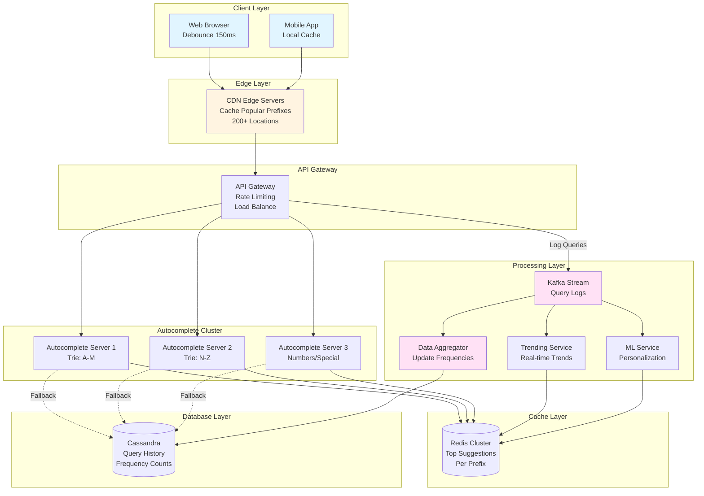

# Search Autocomplete System Design

## Table of Contents

1. [Requirements](#1-requirements-5-minutes)
2. [Capacity Estimation](#capacity-estimation)
3. [High-Level Design (HLD)](#3-high-level-design-10-15-minutes)
4. [Deep Dives](#4-deep-dives-10-minutes)
5. [Database Schema](#45-data-storage)
6. [API Design](#2-api-interface-2-minutes)
7. [Scalability & Optimization](#46-caching-strategy)

---

## 1. Requirements (~5 minutes)

### Functional Requirements

- ✅ Users should get **suggestions as they type** (after 2-3 characters)
- ✅ System should return **top 10 most relevant suggestions**
- ✅ Suggestions should be **ranked by popularity** (search frequency)
- ✅ Support for **personalized suggestions** based on user history
- ✅ Support for **multi-language** queries
- ✅ Handle **typos and spelling corrections** (fuzzy matching)
- ✅ Support **trending/real-time** queries (breaking news, events)

### Non-functional Requirements

- ✅ **Ultra-low latency**: < 100ms response time (P99)
- ✅ **High availability**: 99.99% uptime
- ✅ **Scalable**: Support 10M+ queries per second
- ✅ **Eventual consistency**: Acceptable for popularity updates
- ✅ **Real-time updates**: New trending queries appear within minutes
- ✅ Support **5B+ unique queries** in the database

### Out of Scope

- ❌ Full search results (only suggestions)
- ❌ Image/video search
- ❌ Voice search

---

## Capacity Estimation

**Assumptions:**

- Daily Active Users (DAU): 500M
- Average searches per user: 10/day
- Average keystrokes per search: 10 characters
- Suggestions requested after 2 characters
- Total unique queries: 5B

**QPS:**

```
Daily Searches = 500M users × 10 searches = 5B searches/day
Autocomplete Requests = 5B × 8 keystrokes (after 2nd char) = 40B requests/day
QPS = 40B / 86400s = ~463K requests/sec
Peak QPS (3x average) = ~1.4M requests/sec
```

**Storage:**

```
Query Storage:
- Average query length: 30 characters
- Unique queries: 5B
- Storage = 5B × 30 bytes = 150 GB

With Metadata (frequency, timestamp):
- Per query: 30 bytes (query) + 8 bytes (count) + 8 bytes (timestamp) = 46 bytes
- Total = 5B × 46 bytes = 230 GB

Trie Data Structure (in-memory):
- Trie nodes: ~26 children per node (alphabet)
- Estimated nodes: ~50M nodes
- Per node: 26 pointers (8 bytes each) + data (20 bytes) = 228 bytes
- Total = 50M × 228 bytes = ~11.4 GB per Trie
```

**Bandwidth:**

```
Request Size = 50 bytes (prefix + metadata)
Response Size = 10 suggestions × 50 bytes = 500 bytes
Peak Bandwidth In = 1.4M × 50 bytes = 70 MB/s
Peak Bandwidth Out = 1.4M × 500 bytes = 700 MB/s
```

---

## 2. API Interface (~2 minutes)

### REST API

```http
GET /api/v1/autocomplete?q={prefix}&limit=10&lang=en&user_id={userId}

Request:
GET /api/v1/autocomplete?q=face&limit=10&lang=en

Response:
{
  "suggestions": [
    {
      "text": "facebook",
      "frequency": 15000000,
      "type": "website"
    },
    {
      "text": "facebook login",
      "frequency": 8500000,
      "type": "query"
    },
    {
      "text": "face masks",
      "frequency": 5200000,
      "type": "product"
    },
    {
      "text": "facebook messenger",
      "frequency": 4100000,
      "type": "website"
    }
  ],
  "latency_ms": 45
}
```

### Query Parameters

- `q`: Search prefix (required)
- `limit`: Number of suggestions (default: 10, max: 20)
- `lang`: Language code (default: en)
- `user_id`: For personalized results (optional)
- `location`: For geo-specific suggestions (optional)

---

## 3. High-Level Design (~10-15 minutes)

### Architecture Components

**Client Layer:**

- Web browsers, mobile apps
- Debouncing: Wait 150ms after last keystroke before API call
- Client-side caching: Cache last 50 queries

**Edge Layer:**

- CDN/Edge servers at 200+ locations
- Cache popular prefixes (hit rate: ~40%)

**API Layer:**

- API Gateway: Rate limiting, authentication
- Load Balancer: Distribute to autocomplete servers
- **Autocomplete Service**: Core suggestion logic

**Data Layer:**

- **Trie Servers**: In-memory Trie data structure
- **Redis Cluster**: Cache top suggestions per prefix
- **Cassandra**: Historical query data, frequency counts
- **Kafka**: Real-time query stream for analytics

**Analytics Layer:**

- **Data Aggregator**: Process query logs, update frequencies
- **Trending Service**: Detect real-time trends
- **ML Service**: Personalization models

---

## 4. Architecture Diagram



---

## 4. Deep Dives (~10 minutes)

### 4.1 Trie Data Structure (Core Algorithm)

**Why Trie?**

- Efficient prefix matching: O(len(prefix))
- Space-efficient for common prefixes
- Easy to traverse for top-K suggestions

**Trie Node Structure:**

```
TrieNode {
    children: Map<char, TrieNode>  // 26 letters
    isEndOfWord: boolean
    frequency: long                 // How many times searched
    topSuggestions: List<String>    // Pre-computed top 10
}
```

**Example Trie for ["face", "facebook", "fact"]:**

```
        root
         |
         f
         |
         a
         |
         c
        / \
       e   t
       |   |
       *   *
       |
    book
       |
       *

* = isEndOfWord = true
```

**Lookup Process:**

1. Start at root
2. Traverse prefix: 'f' → 'a' → 'c' → 'e'
3. At 'e' node, get pre-computed topSuggestions
4. Return top 10

**Time Complexity:**

- Lookup: O(len(prefix)) + O(1) = O(p)
- Space: O(total_chars_in_all_queries)

---

### 4.2 Ranking Algorithm

**Multi-factor Scoring:**

```
Score = w1 × FrequencyScore +
        w2 × RecencyScore +
        w3 × PersonalizationScore +
        w4 × TrendingScore

Where:
- FrequencyScore = log(query_count) / log(max_count)
- RecencyScore = e^(-decay_factor × days_since_last_search)
- PersonalizationScore = user_clicked_before ? 1.5 : 0
- TrendingScore = spike_in_last_hour ? 2.0 : 0

Weights: w1=0.5, w2=0.2, w3=0.2, w4=0.1
```

**Example:**

```
Query: "facebook"
- Frequency: 15M searches → FrequencyScore = 0.95
- Last searched: Today → RecencyScore = 1.0
- User clicked before: Yes → PersonalizationScore = 1.5
- Not trending now → TrendingScore = 0

Final Score = 0.5×0.95 + 0.2×1.0 + 0.2×1.5 + 0.1×0 = 1.075
```

---

### 4.3 Trie Partitioning (Horizontal Scaling)

**Problem:** Single Trie can't fit all 5B queries in memory

**Solution:** Partition by first letter(s)

```
Server 1: A-D queries (Trie 1)
Server 2: E-H queries (Trie 2)
Server 3: I-L queries (Trie 3)
Server 4: M-P queries (Trie 4)
Server 5: Q-T queries (Trie 5)
Server 6: U-Z queries (Trie 6)
```

**Routing Logic:**

```
prefix = "face"
first_char = prefix[0] = 'f'
server = route_to_server(first_char)  // Server 2 (E-H)
```

**Benefits:**

- Each server handles ~11 GB Trie (manageable)
- Parallel processing
- Independent scaling

**Replication:**

- Each partition replicated 3x for availability
- Master-slave setup: Master handles writes, slaves for reads

---

### 4.4 Handling Updates (Frequency Changes)

**Challenge:** 40B requests/day generate millions of updates

**Solution: Batch Updates**

**Real-time Flow:**

```
User searches "facebook" →
  1. Log to Kafka (async, non-blocking)
  2. Return cached suggestions immediately
  3. Don't update Trie in real-time
```

**Batch Update Flow (Every 10 minutes):**

```
1. Kafka Consumer reads last 10 min of queries
2. Aggregate: {"facebook": +15000, "face masks": +8000}
3. Update Cassandra (frequency table)
4. Background job rebuilds Trie sections
5. Swap old Trie with new Trie (atomic pointer swap)
```

**Trie Update Strategy:**

```
Option 1: Full Rebuild (Daily)
- Build new Trie from scratch
- Takes 2-3 hours
- Swap pointers at 3 AM

Option 2: Incremental Update (Every 10 min)
- Update only changed nodes
- Faster but complex
- Risk of inconsistencies
```

**Trade-off:** Slight staleness (10 min) for performance

---

### 4.5 Data Storage

**Cassandra Schema (Query Frequency Table):**

```sql
CREATE TABLE query_stats (
    prefix TEXT,              -- First 3 chars: "fac"
    full_query TEXT,          -- Complete query: "facebook"
    frequency COUNTER,        -- Search count
    last_updated TIMESTAMP,
    PRIMARY KEY ((prefix), frequency, full_query)
) WITH CLUSTERING ORDER BY (frequency DESC);

-- Query for prefix "fac":
SELECT full_query, frequency
FROM query_stats
WHERE prefix = 'fac'
ORDER BY frequency DESC
LIMIT 10;
```

**Why Cassandra?**

- Write-heavy: 463K writes/sec
- Horizontal scaling
- Counter data type for atomic increments
- Time-series friendly

**Redis Cache (Hot Prefixes):**

```
Key: "autocomplete:fac"
Value: [
  {"text": "facebook", "score": 15000000},
  {"text": "face masks", "score": 5200000},
  ...
]
TTL: 10 minutes
```

**Cache Strategy:**

- Top 10K most popular prefixes cached
- Hit rate: ~40% (power law distribution)
- Eviction: LRU policy

---

### 4.6 Caching Strategy

**Multi-layer Cache:**

```
Layer 1: Client-side Cache (Browser)
- Cache: Last 50 queries
- Hit rate: ~20%
- TTL: Session duration

Layer 2: CDN/Edge Cache
- Cache: Popular prefixes (top 10K)
- Hit rate: ~40%
- TTL: 5 minutes

Layer 3: Redis Cluster
- Cache: All prefixes from last hour
- Hit rate: ~80%
- TTL: 10 minutes

Layer 4: Trie In-Memory
- Pre-computed top suggestions per node
- Hit rate: 100% (always in memory)

Fallback: Cassandra Database
```

**Cache Invalidation:**

- Time-based: TTL of 10 minutes
- Event-based: Breaking news triggers cache clear
- Lazy update: Rebuild on next request

---

### 4.7 Fuzzy Matching (Typo Handling)

**Challenge:** User types "facbook" instead of "facebook"

**Solutions:**

**1. Edit Distance (Levenshtein Distance):**

```
EditDistance("facbook", "facebook") = 1 (insert 'e')

For each candidate in Trie:
  if edit_distance(user_input, candidate) <= 2:
    include in suggestions
```

**Trade-off:** Expensive to compute for all candidates

**2. Phonetic Algorithms (Soundex/Metaphone):**

```
Soundex("facebook") = "F212"
Soundex("facbook") = "F212"  // Same code!

Store phonetic codes in Trie
```

**3. Bigram/Trigram Matching:**

```
"facbook" → bigrams: [fa, ac, cb, bo, oo, ok]
"facebook" → bigrams: [fa, ac, ce, eb, bo, oo, ok]

Similarity = (common bigrams) / (total unique bigrams)
          = 5 / 9 = 0.56
```

**Implementation:**

- Build inverted index: bigram → queries
- At query time, find queries with similar bigrams

**Chosen Approach:** Hybrid

- Use Trie for exact prefix
- If < 3 results, fallback to fuzzy matching (edit distance ≤ 2)

---

### 4.8 Personalization

**User History Tracking:**

```
Redis Key: "user:12345:history"
Value: [
  {"query": "python tutorial", "clicked": true, "ts": 1696512000},
  {"query": "java vs python", "clicked": false, "ts": 1696511000}
]
```

**Personalization Logic:**

```
For each suggestion:
  if user searched this before:
    boost score by 1.5x

  if user clicked this before:
    boost score by 2.0x
```

**Privacy:**

- Store only last 100 queries per user
- Hash user IDs
- TTL: 30 days
- Opt-out option

---

### 4.9 Trending/Real-time Queries

**Challenge:** Breaking news "earthquake california" should appear immediately

**Solution: Trending Detection**

**Algorithm:**

```
1. Count queries in sliding windows:
   - Last 5 minutes
   - Last 1 hour
   - Last 24 hours

2. Calculate spike ratio:
   spike = count_5min / avg_count_hourly

3. If spike > 10x:
   Mark as trending
   Boost score by 2x
   Inject into hot cache

Example:
"earthquake california"
- Last hour: 500 searches
- Last 5 min: 8000 searches
- Spike = 8000 / (500/12) = 192x
- → TRENDING! Boost to top of suggestions
```

**Implementation:**

```
Kafka Stream Processing:
  1. Consume query logs
  2. Windowed aggregation (5 min windows)
  3. Compare to baseline
  4. Push trending queries to Redis
  5. Update Trie with high priority
```

---

### 4.10 Handling Special Cases

**Case 1: Long Tail Queries**

- Problem: 80% of queries are unique (searched once)
- Solution: Don't store queries with frequency < 5
- Trade-off: Miss rare queries, save 80% storage

**Case 2: Offensive/Adult Content**

- Solution: Blacklist filter
- Maintain list of banned words/phrases
- Filter at ingestion time (Kafka consumer)
- Never show in suggestions

**Case 3: Multi-word Queries**

```
Query: "how to learn python"

Approach 1: Whole phrase matching
- Trie key: "how to learn python"
- Works but inflexible

Approach 2: Last word matching
- When user types "how to learn p"
- Match prefix "p" in context of "how to learn"
- More flexible, handles variations
```

**Case 4: Numbers/Special Characters**

```
Query: "iphone 15 pro"

Trie structure:
  i → p → h → o → n → e → SPACE → 1 → 5 → SPACE → p → r → o

Store spaces and numbers as nodes
Normalize queries: lowercase + trim
```

---

### 4.11 Geographic Personalization

**Challenge:** "football" means different things in US vs UK

**Solution: Geo-based Tries**

```
US Region:
  "football" → [
    "football schedule",
    "NFL football scores",
    "fantasy football"
  ]

UK Region:
  "football" → [
    "football premier league",
    "football transfers",
    "football world cup"
  ]
```

**Implementation:**

- Maintain separate Tries per region
- Route based on user's IP or explicit location
- Fallback to global Trie if region-specific unavailable

---

## 5. Scalability & Performance Optimizations

### 5.1 Read Optimization

**Pre-computation:**

- Store top 10 suggestions at each Trie node
- Avoids traversing entire subtree at query time

**Connection Pooling:**

- Persistent connections to Redis/Cassandra
- Reduce connection overhead

**Compression:**

- Compress Trie in memory (prefix compression)
- Save 30-40% memory

### 5.2 Write Optimization

**Async Logging:**

- Non-blocking writes to Kafka
- Don't wait for acknowledgment

**Batch Writes:**

- Aggregate 10 min of queries
- Single batch update to Cassandra

**Append-only Logs:**

- Never update Trie in-place
- Build new version, swap atomically

### 5.3 Network Optimization

**Protocol Buffers:**

- Use Protobuf instead of JSON
- 50% smaller payload

**HTTP/2:**

- Multiplexing
- Header compression

**Compression:**

- Gzip response bodies
- 70% bandwidth savings

---

## 6. Monitoring & Metrics

**Key Metrics:**

**Performance:**

- P50, P95, P99 latency (target: < 100ms)
- QPS per server
- Cache hit rates (CDN, Redis, Trie)

**Quality:**

- Suggestion relevance (CTR - click-through rate)
- Empty result rate (< 5%)
- Typo correction rate

**System Health:**

- Trie rebuild time
- Kafka consumer lag (< 10 sec)
- Redis memory usage
- Cassandra write throughput

**Alerts:**

```
Alert: High Latency
Condition: P99 > 200ms for 5 minutes
Action: Auto-scale Trie servers

Alert: Low Cache Hit Rate
Condition: Redis hit rate < 70%
Action: Increase cache size or TTL

Alert: Trie Out of Sync
Condition: Trie age > 20 minutes
Action: Trigger emergency rebuild
```

---

## 7. Trade-offs & Considerations

| Decision                     | Pros                  | Cons                                      |
| ---------------------------- | --------------------- | ----------------------------------------- |
| **Trie in-memory**           | Fast lookups (O(p))   | Limited by RAM, expensive                 |
| **Batch updates**            | High write throughput | 10-min staleness                          |
| **Pre-computed suggestions** | Ultra-fast response   | Increased storage                         |
| **Partitioning by letter**   | Horizontal scaling    | Uneven distribution (Z has fewer queries) |
| **Redis caching**            | Reduces Trie load     | Cache invalidation complexity             |
| **Fuzzy matching**           | Better UX for typos   | Increased latency                         |

---

## 8. Summary

### Key Design Decisions

1. **Trie Data Structure**: O(p) prefix matching with pre-computed top-K
2. **Horizontal Partitioning**: Scale by first letter(s)
3. **Multi-layer Caching**: Client → CDN → Redis → Trie → Cassandra
4. **Batch Updates**: Rebuild Trie every 10 min, not real-time
5. **Async Logging**: Non-blocking query logs via Kafka
6. **Personalization**: Boost user's previous queries
7. **Trending Detection**: Real-time spike detection for breaking news

### Scalability Achieved

- ✅ **1.4M QPS** (peak traffic)
- ✅ **< 100ms P99 latency**
- ✅ **5B unique queries** supported
- ✅ **99.99% availability**
- ✅ **40% CDN cache hit rate**
- ✅ **Real-time trending** (< 5 min delay)

---

## 9. Alternative Approaches

### Approach 1: Full Database Lookup (No Trie)

```sql
SELECT query, frequency
FROM queries
WHERE query LIKE 'fac%'
ORDER BY frequency DESC
LIMIT 10;
```

- **Pros:** Simple, no Trie complexity
- **Cons:** Too slow (> 500ms), can't scale

### Approach 2: Inverted Index (Elasticsearch)

```
Index:
{
  "fac": ["facebook", "face masks", "factory"],
  "ace": ["facebook", "face masks", "race car"]
}
```

- **Pros:** Flexible, supports fuzzy matching
- **Cons:** Slower than Trie (100-200ms), higher memory

### Approach 3: ML Model (Neural Networks)

- Train model to predict next characters
- **Pros:** Learns context, handles typos naturally
- **Cons:** High latency (300ms+), expensive training

**Chosen: Trie + Redis** (best latency/complexity trade-off)

---

## 10. Advanced Features

### Voice Search Support

- Convert speech to text (ASR)
- Feed to autocomplete with confidence scores
- Boost high-confidence suggestions

### Image-based Suggestions

- OCR on images
- Extract text → feed to autocomplete
- Show visual suggestions (thumbnails)

### Context-aware Suggestions

```
Previous query: "python"
Current input: "tut"
Suggestions: ["tutorial", "tutorials for beginners"]
  (biased toward Python tutorials)
```

### A/B Testing Framework

- Test ranking algorithms
- Measure CTR, conversion
- Roll out winner to 100%

---

## 11. Failure Scenarios & Recovery

### Scenario 1: Trie Server Down

- **Detection:** Health check fails
- **Recovery:** Route to replica
- **Time:** < 1 second (automatic failover)

### Scenario 2: Redis Cluster Failure

- **Detection:** All Redis nodes unreachable
- **Recovery:** Fallback to Trie (slower but works)
- **Time:** Degraded performance, no downtime

### Scenario 3: Cassandra Outage

- **Impact:** Can't update frequencies
- **Recovery:** Serve stale data from Redis/Trie
- **Time:** No user-facing impact (batch updates delayed)

### Scenario 4: Kafka Lag

- **Detection:** Consumer lag > 1 min
- **Recovery:** Scale up consumers, replay messages
- **Time:** 5-10 min to catch up

---

## 12. Interview Tips

**What interviewers look for:**

1. ✅ **Understand requirements**: Low latency is critical
2. ✅ **Choose right data structure**: Trie vs database vs inverted index
3. ✅ **Handle scale**: 1M+ QPS, 5B queries
4. ✅ **Discuss trade-offs**: Real-time updates vs batch
5. ✅ **Consider edge cases**: Typos, trending, offensive content
6. ✅ **Monitoring**: How to detect/fix issues

**Common follow-ups:**

- "How would you handle typos?" → Edit distance, phonetic codes
- "What if Trie doesn't fit in memory?" → Partitioning, compression
- "How to make suggestions personalized?" → User history, ML
- "How to detect trending queries?" → Spike detection algorithm

**Red flags to avoid:**

- ❌ Saying "use database LIKE query" (too slow)
- ❌ Ignoring latency requirements
- ❌ Not discussing caching
- ❌ Forgetting about updates (how to refresh Trie)
