# AWS Cloud Practitioner Essentials

## Table of Contents

1. [Exam Overview](#exam-overview)
2. [Module 1: Introduction to Cloud Computing](#module-1-introduction-to-cloud-computing)
   - [What is Cloud Computing?](#what-is-cloud-computing)
   - [Cloud Computing Models](#cloud-computing-models)
   - [Cloud Deployment Models](#cloud-deployment-models)
3. [Module 2: AWS Global Infrastructure](#module-2-aws-global-infrastructure)
   - [Regions](#regions)
   - [Availability Zones](#availability-zones)
   - [Edge Locations](#edge-locations)
   - [How to Choose a Region](#how-to-choose-a-region)
4. [Module 3: Compute Services](#module-3-compute-services)
   - [Amazon EC2](#amazon-ec2)
   - [AWS Lambda](#aws-lambda)
   - [Container Services](#container-services)
   - [Other Compute Services](#other-compute-services)
5. [Module 4: Storage Services](#module-4-storage-services)
   - [Amazon S3](#amazon-s3)
   - [Amazon EBS](#amazon-ebs)
   - [Amazon EFS](#amazon-efs)
   - [Storage Gateway](#storage-gateway)
6. [Module 5: Database Services](#module-5-database-services)
   - [Amazon RDS](#amazon-rds)
   - [Amazon DynamoDB](#amazon-dynamodb)
   - [Amazon Redshift](#amazon-redshift)
   - [Other Database Services](#other-database-services)
7. [Module 6: Networking & Content Delivery](#module-6-networking--content-delivery)
   - [Amazon VPC](#amazon-vpc)
   - [Route 53](#route-53)
   - [CloudFront](#cloudfront)
   - [Direct Connect](#direct-connect)
8. [Module 7: Security, Identity & Compliance](#module-7-security-identity--compliance)
   - [Shared Responsibility Model](#shared-responsibility-model)
   - [AWS IAM](#aws-iam)
   - [AWS Organizations](#aws-organizations)
   - [Compliance Programs](#compliance-programs)
   - [Security Services](#security-services)
9. [Module 8: Pricing & Support](#module-8-pricing--support)
   - [AWS Pricing Models](#aws-pricing-models)
   - [AWS Free Tier](#aws-free-tier)
   - [Cost Management Tools](#cost-management-tools)
   - [AWS Support Plans](#aws-support-plans)
10. [Module 9: Migration & Innovation](#module-9-migration--innovation)
    - [AWS Cloud Adoption Framework](#aws-cloud-adoption-framework)
    - [Migration Strategies](#migration-strategies)
    - [AWS Snow Family](#aws-snow-family)
    - [Innovation Services](#innovation-services)
11. [Module 10: Monitoring & Analytics](#module-10-monitoring--analytics)
    - [Amazon CloudWatch](#amazon-cloudwatch)
    - [AWS CloudTrail](#aws-cloudtrail)
    - [AWS Trusted Advisor](#aws-trusted-advisor)
12. [Module 11: Well-Architected Framework](#module-11-well-architected-framework)
13. [Exam Preparation Tips](#exam-preparation-tips)
14. [Practice Questions](#practice-questions)
15. [Key Terms Glossary](#key-terms-glossary)
16. [Quick Reference Tables](#quick-reference-tables)

---

## Exam Overview

### About the Exam
- **Exam Name**: AWS Certified Cloud Practitioner (CLF-C02)
- **Duration**: 90 minutes
- **Number of Questions**: 65 questions
- **Question Types**: Multiple choice (1 correct answer) and multiple response (2+ correct answers)
- **Passing Score**: 700/1000
- **Cost**: $100 USD
- **Validity**: 3 years
- **Language**: Available in multiple languages

### Exam Domains & Weightings

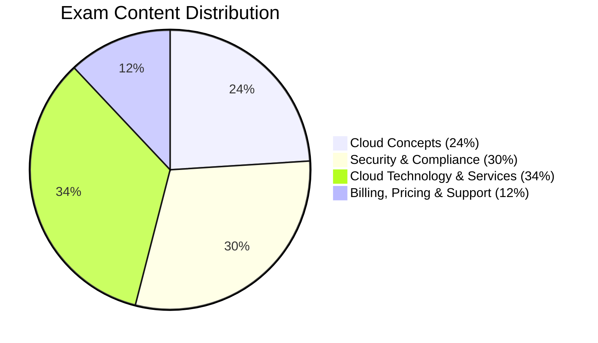
```mermaid
pie title Exam Content Distribution
    "Cloud Concepts (24%)" : 24
    "Security & Compliance (30%)" : 30
    "Cloud Technology & Services (34%)" : 34
    "Billing, Pricing & Support (12%)" : 12
```

**Domain Breakdown:**
1. **Cloud Concepts** (24%) - 15-16 questions
   - Define AWS Cloud and value proposition
   - Identify aspects of cloud economics
   - List design principles of cloud architecture

2. **Security and Compliance** (30%) - 19-20 questions
   - Understand shared responsibility model
   - Cloud security and compliance concepts
   - AWS access management capabilities
   - Security support resources

3. **Cloud Technology and Services** (34%) - 22-23 questions
   - Define AWS Cloud deployment methods
   - Define AWS Global Infrastructure
   - Identify core AWS services
   - Identify technology support resources

4. **Billing, Pricing, and Support** (12%) - 7-8 questions
   - Compare pricing models
   - Account structures and billing
   - Technical support resources

---

## Module 1: Introduction to Cloud Computing

### What is Cloud Computing?

**Definition**: On-demand delivery of IT resources over the internet with pay-as-you-go pricing.

**Key Characteristics:**
- **On-Demand Self-Service**: Provision resources without human interaction
- **Broad Network Access**: Access from anywhere via internet
- **Resource Pooling**: Multi-tenant model with shared resources
- **Rapid Elasticity**: Scale up or down quickly
- **Measured Service**: Pay only for what you use

### Benefits of Cloud Computing

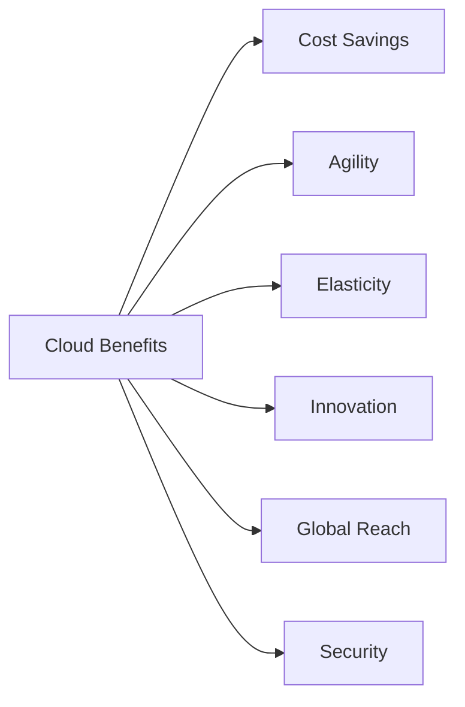
```mermaid
graph LR
    A[Cloud Benefits] --> B[Cost Savings]
    A --> C[Agility]
    A --> D[Elasticity]
    A --> E[Innovation]
    A --> F[Global Reach]
    A --> G[Security]
```

1. **Trade Capital Expense for Variable Expense**
   - No upfront data center costs
   - Pay only when you consume resources

2. **Benefit from Massive Economies of Scale**
   - Lower pay-as-you-go prices
   - AWS aggregates usage from hundreds of thousands of customers

3. **Stop Guessing Capacity**
   - Scale up or down based on actual demand
   - No over-provisioning or under-provisioning

4. **Increase Speed and Agility**
   - New resources available in minutes
   - Faster time to market

5. **Stop Spending Money on Data Centers**
   - Focus on applications, not infrastructure
   - No maintenance overhead

6. **Go Global in Minutes**
   - Deploy to multiple regions worldwide
   - Low latency for end users

### Cloud Computing Models

#### 1. Infrastructure as a Service (IaaS)
**What it is**: Provides basic building blocks for cloud IT
**You Manage**: Applications, data, runtime, middleware, OS
**Provider Manages**: Virtualization, servers, storage, networking
**Examples**: Amazon EC2, Google Compute Engine, Azure VMs

#### 2. Platform as a Service (PaaS)
**What it is**: Removes need to manage infrastructure
**You Manage**: Applications and data
**Provider Manages**: Runtime, middleware, OS, virtualization, servers, storage
**Examples**: AWS Elastic Beanstalk, Google App Engine, Heroku

#### 3. Software as a Service (SaaS)
**What it is**: Complete product run and managed by provider
**You Manage**: User access and data
**Provider Manages**: Everything else
**Examples**: Gmail, Salesforce, Microsoft 365, Dropbox

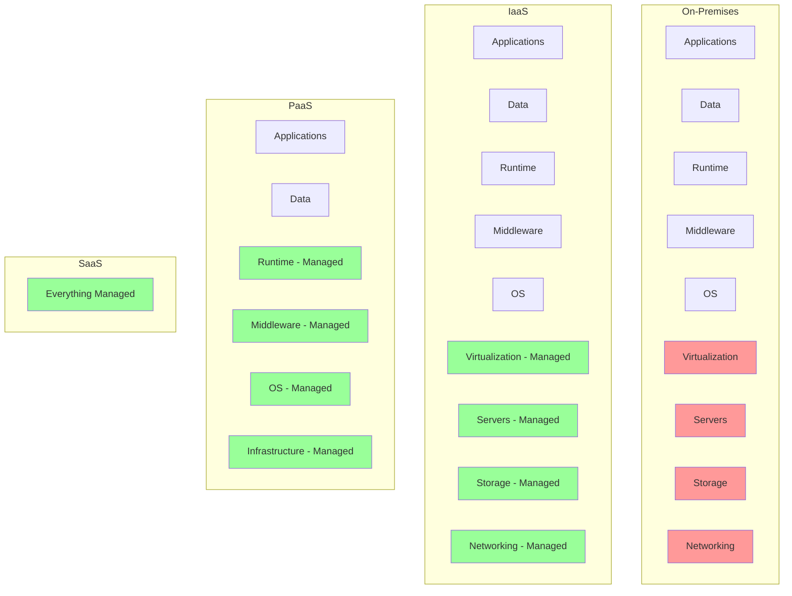
```mermaid
graph TB
    subgraph "On-Premises"
        A1[Applications]
        A2[Data]
        A3[Runtime]
        A4[Middleware]
        A5[OS]
        A6[Virtualization]
        A7[Servers]
        A8[Storage]
        A9[Networking]
    end

    subgraph "IaaS"
        B1[Applications]
        B2[Data]
        B3[Runtime]
        B4[Middleware]
        B5[OS]
        B6[Virtualization - Managed]
        B7[Servers - Managed]
        B8[Storage - Managed]
        B9[Networking - Managed]
    end

    subgraph "PaaS"
        C1[Applications]
        C2[Data]
        C3[Runtime - Managed]
        C4[Middleware - Managed]
        C5[OS - Managed]
        C6[Infrastructure - Managed]
    end

    subgraph "SaaS"
        D1[Everything Managed]
    end

    style A6 fill:#ff9999
    style A7 fill:#ff9999
    style A8 fill:#ff9999
    style A9 fill:#ff9999
    style B6 fill:#99ff99
    style B7 fill:#99ff99
    style B8 fill:#99ff99
    style B9 fill:#99ff99
    style C3 fill:#99ff99
    style C4 fill:#99ff99
    style C5 fill:#99ff99
    style C6 fill:#99ff99
    style D1 fill:#99ff99
```

### Cloud Deployment Models

#### 1. Public Cloud (Cloud-Based)
- Fully deployed in the cloud
- All parts of application run in the cloud
- Migration from existing infrastructure or new applications
- **Example**: Startup building new app on AWS

#### 2. Private Cloud (On-Premises)
- Resources deployed on-premises
- Virtualization and resource management tools
- Often for legacy applications or regulatory requirements
- **Example**: Bank with strict data regulations

#### 3. Hybrid Cloud
- Cloud-based resources connected to on-premises infrastructure
- Best of both worlds
- Gradual migration strategy
- **Example**: Company migrating workloads gradually to cloud

**📝 Exam Tip**: Know the difference between deployment models. Hybrid connects on-premises and cloud, while public cloud is fully in AWS.

---

## Module 2: AWS Global Infrastructure

### AWS Global Infrastructure Overview

AWS infrastructure is built around **Regions**, **Availability Zones**, and **Edge Locations**.

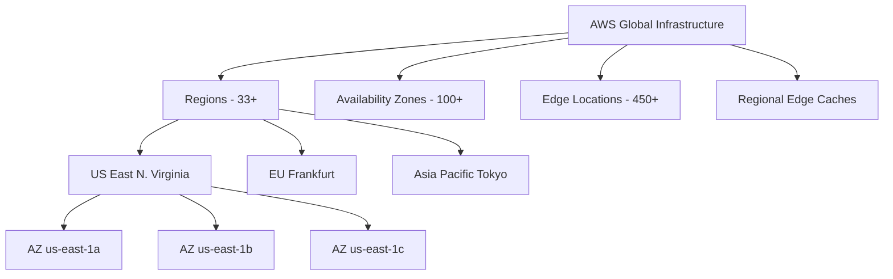
```mermaid
graph TB
    A[AWS Global Infrastructure] --> B[Regions - 33+]
    A --> C[Availability Zones - 100+]
    A --> D[Edge Locations - 450+]
    A --> E[Regional Edge Caches]
    B --> F[US East N. Virginia]
    B --> G[EU Frankfurt]
    B --> H[Asia Pacific Tokyo]
    F --> I[AZ us-east-1a]
    F --> J[AZ us-east-1b]
    F --> K[AZ us-east-1c]
```

### Regions

**What is a Region?**
A geographical area containing multiple, isolated Availability Zones.

**Key Points:**
- AWS has 33+ Regions worldwide (as of 2024)
- Each Region is completely independent
- Data doesn't leave a Region unless you explicitly transfer it
- Region names: us-east-1, eu-west-1, ap-southeast-1, etc.

**Region Examples:**
- **US East (N. Virginia)**: us-east-1
- **US West (Oregon)**: us-west-2
- **EU (Ireland)**: eu-west-1
- **Asia Pacific (Singapore)**: ap-southeast-1
- **South America (São Paulo)**: sa-east-1

### Availability Zones (AZs)

**What is an AZ?**
One or more discrete data centers with redundant power, networking, and connectivity in a Region.

**Key Points:**
- Each Region has 3 or more AZs (minimum 3)
- AZs are physically separated (different buildings)
- Connected with high-bandwidth, low-latency networking
- Designed for fault isolation
- Named: us-east-1a, us-east-1b, us-east-1c, etc.

**High Availability Pattern:**
Deploy applications across multiple AZs for fault tolerance.

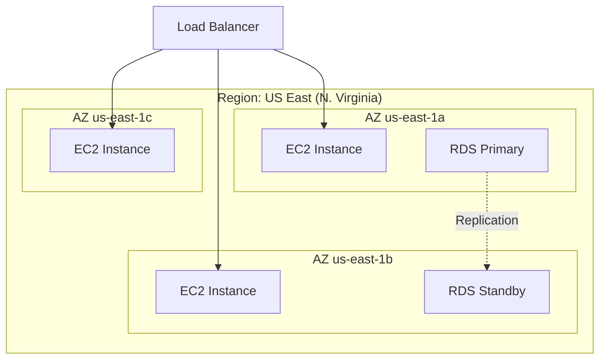
```mermaid
graph TB
    subgraph "Region: US East (N. Virginia)"
        subgraph "AZ us-east-1a"
            A1[EC2 Instance]
            A2[RDS Primary]
        end
        subgraph "AZ us-east-1b"
            B1[EC2 Instance]
            B2[RDS Standby]
        end
        subgraph "AZ us-east-1c"
            C1[EC2 Instance]
        end
    end
    LB[Load Balancer] --> A1
    LB --> B1
    LB --> C1
    A2 -.Replication.-> B2
```

### Edge Locations

**What are Edge Locations?**
Sites that CloudFront uses to cache copies of content for faster delivery to users.

**Key Points:**
- 450+ Edge Locations worldwide
- Separate from Regions and AZs
- Used by Amazon CloudFront (CDN)
- Also used by Route 53 (DNS)
- Located in major cities globally

**How Edge Locations Work:**

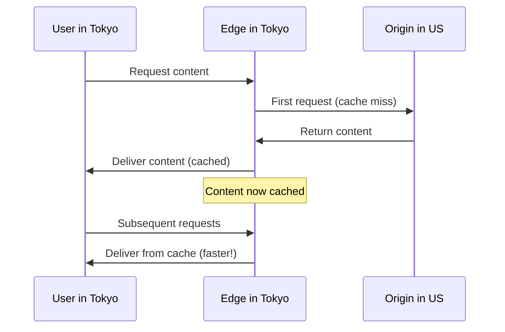
```mermaid
sequenceDiagram
    participant User in Tokyo
    participant Edge in Tokyo
    participant Origin in US

    User in Tokyo->>Edge in Tokyo: Request content
    Edge in Tokyo->>Origin in US: First request (cache miss)
    Origin in US->>Edge in Tokyo: Return content
    Edge in Tokyo->>User in Tokyo: Deliver content (cached)
    Note over Edge in Tokyo: Content now cached
    User in Tokyo->>Edge in Tokyo: Subsequent requests
    Edge in Tokyo->>User in Tokyo: Deliver from cache (faster!)
```

### Regional Edge Caches

- Sit between CloudFront Edge Locations and origin servers
- Larger caches than Edge Locations
- Content stays cached longer
- Improves performance for less frequently accessed content

### How to Choose a Region

**Four Key Factors:**

#### 1. Compliance and Legal Requirements
- Data sovereignty laws
- Industry regulations (GDPR, HIPAA, etc.)
- **Example**: EU data must stay in EU regions

#### 2. Proximity to Customers (Latency)
- Choose Region closest to your users
- Reduces latency
- **Example**: Users in Australia → use ap-southeast-2 (Sydney)

#### 3. Available Services
- Not all services available in all Regions
- New services often launch in us-east-1 first
- Check AWS Regional Services List

#### 4. Pricing
- Pricing varies by Region
- Some Regions are more expensive (e.g., São Paulo)
- **Example**: S3 storage in us-east-1 may be cheaper than in ap-southeast-1

**📝 Exam Tip**: Remember all four factors for choosing a Region. Questions often ask about scenarios requiring specific Region choices.

---

## Module 3: Compute Services

### Amazon EC2 (Elastic Compute Cloud)

**What is EC2?**
Virtual servers in the cloud - resizable compute capacity.

#### EC2 Instance Types

**Five Main Categories:**

1. **General Purpose** (T3, M6)
   - Balanced compute, memory, networking
   - **Use Cases**: Web servers, code repositories, development environments
   - **Remember**: All-around balanced performance

2. **Compute Optimized** (C6)
   - High-performance processors
   - **Use Cases**: Batch processing, media transcoding, gaming servers, scientific modeling
   - **Remember**: CPU-intensive workloads

3. **Memory Optimized** (R6, X2)
   - Fast performance for memory-intensive workloads
   - **Use Cases**: High-performance databases, in-memory caches, real-time big data analytics
   - **Remember**: Large datasets in memory

4. **Accelerated Computing** (P4, G5)
   - Hardware accelerators (GPUs)
   - **Use Cases**: Machine learning, graphics processing, game streaming
   - **Remember**: Specialized hardware for specific tasks

5. **Storage Optimized** (I4, D3)
   - High sequential read/write to local storage
   - **Use Cases**: Data warehousing, distributed file systems, log processing
   - **Remember**: High IOPS (Input/Output Operations Per Second)

#### EC2 Pricing Models

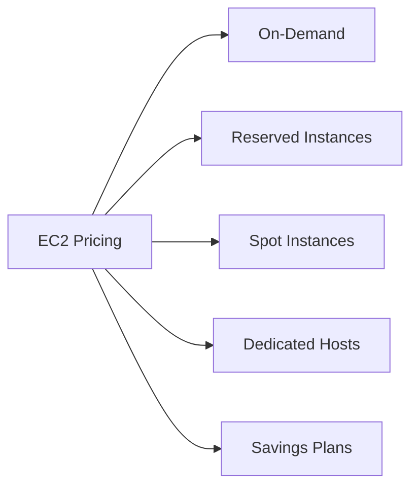
```mermaid
graph LR
    A[EC2 Pricing] --> B[On-Demand]
    A --> C[Reserved Instances]
    A --> D[Spot Instances]
    A --> E[Dedicated Hosts]
    A --> F[Savings Plans]
```

**1. On-Demand Instances**
- Pay by the hour or second
- No long-term commitments
- **Best for**: Short-term, irregular workloads, testing
- **Example**: Development/test environments

**2. Reserved Instances (RIs)**
- 1 or 3 year commitment
- Up to 75% discount vs On-Demand
- **Types**: Standard RI, Convertible RI, Scheduled RI
- **Best for**: Steady-state workloads, predictable usage
- **Example**: Production database running 24/7

**3. Spot Instances**
- Up to 90% discount vs On-Demand
- AWS can reclaim with 2-minute notice
- **Best for**: Fault-tolerant, flexible workloads
- **Example**: Batch processing, data analysis, image rendering
- **NOT suitable for**: Databases, critical applications

**4. Dedicated Hosts**
- Physical server dedicated to your use
- Most expensive option
- **Best for**: Compliance requirements, server-bound software licenses
- **Example**: Oracle database with per-core licensing

**5. Savings Plans**
- Commit to consistent usage (measured in $/hour)
- 1 or 3 year commitment
- Up to 72% savings
- More flexible than Reserved Instances
- **Best for**: Steady usage across multiple instance families

**📝 Exam Tip**:
- **Spot** = Cheapest but can be interrupted
- **Reserved/Savings Plans** = Long-term commitment for discounts
- **On-Demand** = No commitment, highest cost
- **Dedicated Hosts** = Regulatory/licensing requirements

#### EC2 Scaling

**Vertical Scaling**: Resize instance (scale up/down)
- Change instance type (t2.micro → t2.large)
- Requires restart

**Horizontal Scaling**: Add more instances (scale out/in)
- Add or remove instances
- Better for high availability

**Amazon EC2 Auto Scaling**
- Automatically add or remove EC2 instances
- **Dynamic Scaling**: Responds to changing demand
- **Predictive Scaling**: Uses ML to predict and schedule scaling
- **Target Tracking**: Maintain specific metric (e.g., CPU at 50%)
- **Minimum, Desired, Maximum Capacity**: Control scaling limits

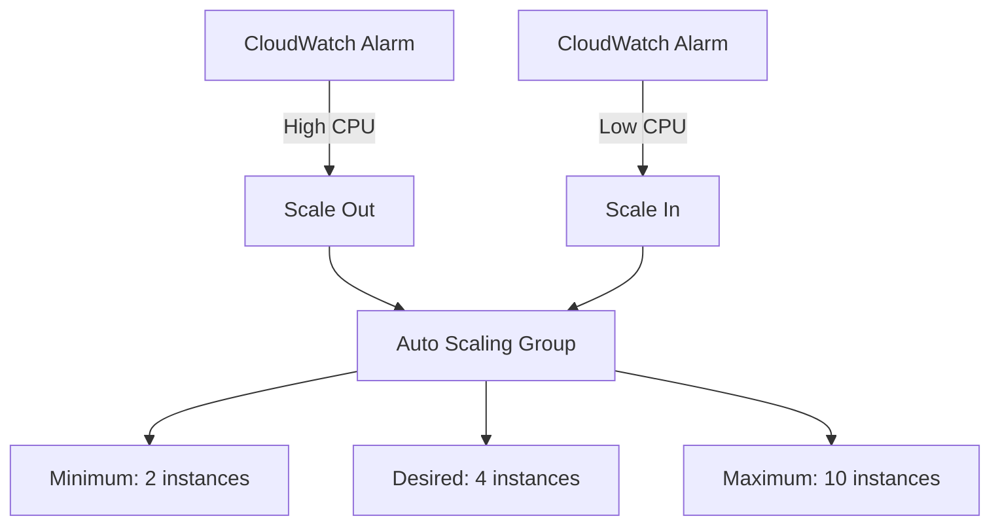
```mermaid
graph TB
    A[Auto Scaling Group] --> B[Minimum: 2 instances]
    A --> C[Desired: 4 instances]
    A --> D[Maximum: 10 instances]
    E[CloudWatch Alarm] -->|High CPU| F[Scale Out]
    G[CloudWatch Alarm] -->|Low CPU| H[Scale In]
    F --> A
    H --> A
```

#### Elastic Load Balancing (ELB)

**What is ELB?**
Automatically distributes incoming application traffic across multiple targets.

**Benefits:**
- High availability
- Automatic scaling
- Health checks

**Types:**
1. **Application Load Balancer (ALB)**: HTTP/HTTPS traffic (Layer 7)
2. **Network Load Balancer (NLB)**: TCP/UDP traffic (Layer 4), ultra-low latency
3. **Gateway Load Balancer**: Deploy and manage third-party virtual appliances
4. **Classic Load Balancer**: Legacy (not recommended for new applications)

**📝 Exam Tip**: ELB works across multiple AZs for high availability.

### AWS Lambda

**What is Lambda?**
Serverless compute - run code without managing servers.

**Key Characteristics:**
- **Event-driven**: Triggered by events
- **Automatic scaling**: Handles any scale
- **Pay per use**: Charged per request and compute time
- **No server management**: AWS handles everything
- **Subsecond billing**: Charged in 1ms increments

**Supported Runtimes:**
Python, Node.js, Java, Go, Ruby, .NET, Custom runtimes

**Use Cases:**
- Real-time file processing
- Data transformation
- Web application backends
- IoT backends
- Mobile backends

**Lambda Pricing:**
- **Free Tier**: 1M requests/month, 400,000 GB-seconds/month
- **Beyond Free Tier**: $0.20 per 1M requests + compute time

**Execution Limits:**
- **Timeout**: Max 15 minutes per execution
- **Memory**: 128 MB to 10 GB
- **Deployment Package**: Max 50 MB (zipped), 250 MB (unzipped)

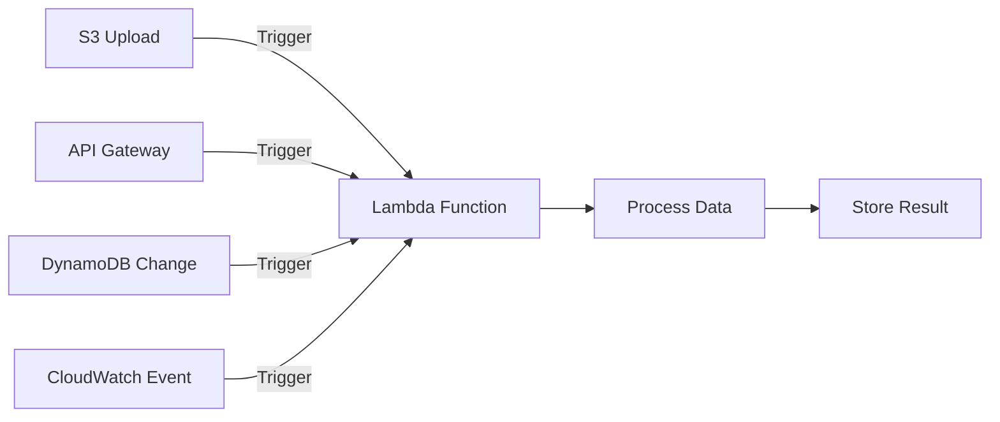
```mermaid
graph LR
    A[S3 Upload] -->|Trigger| B[Lambda Function]
    C[API Gateway] -->|Trigger| B
    D[DynamoDB Change] -->|Trigger| B
    E[CloudWatch Event] -->|Trigger| B
    B --> F[Process Data]
    F --> G[Store Result]
```

**📝 Exam Tip**: Lambda is serverless = no infrastructure management. Good for short, event-driven workloads. Max 15 minute execution.

### Container Services

#### Amazon ECS (Elastic Container Service)
- Fully managed container orchestration
- Run Docker containers
- Integrates with other AWS services
- Two launch types: **EC2** (manage servers) and **Fargate** (serverless)

#### Amazon EKS (Elastic Kubernetes Service)
- Managed Kubernetes service
- Run standard Kubernetes applications
- Supports existing Kubernetes tools

#### AWS Fargate
- Serverless compute for containers
- No EC2 instances to manage
- Pay for resources your containers use

**📝 Exam Tip**:
- **ECS** = AWS native container service
- **EKS** = Kubernetes on AWS
- **Fargate** = Serverless container compute

### Other Compute Services

#### AWS Elastic Beanstalk
- **What**: Platform as a Service (PaaS)
- **Purpose**: Deploy and scale web applications
- **You provide**: Code
- **AWS manages**: Capacity provisioning, load balancing, auto-scaling, health monitoring
- **Supported**: Java, .NET, PHP, Node.js, Python, Ruby, Go, Docker
- **Best for**: Developers who want to deploy quickly without infrastructure management

#### AWS Lightsail
- **What**: Simplified cloud service
- **Purpose**: Launch and manage virtual private servers
- **Best for**: Simple web applications, WordPress sites, dev/test environments
- **Includes**: Everything needed (VM, SSD storage, data transfer, DNS, static IP)
- **Fixed monthly price**: Predictable, low cost

#### AWS Batch
- **What**: Fully managed batch processing
- **Purpose**: Run batch computing workloads
- **Best for**: Data analytics, image processing, financial modeling
- **Benefits**: Dynamically provisions optimal compute resources

#### AWS Outposts
- **What**: AWS infrastructure on-premises
- **Purpose**: Run AWS services in your own data center
- **Use Cases**: Low latency, local data processing, data residency requirements
- **You get**: AWS APIs, tools, and infrastructure on-premises

---

## Module 4: Storage Services

### Storage Categories Overview

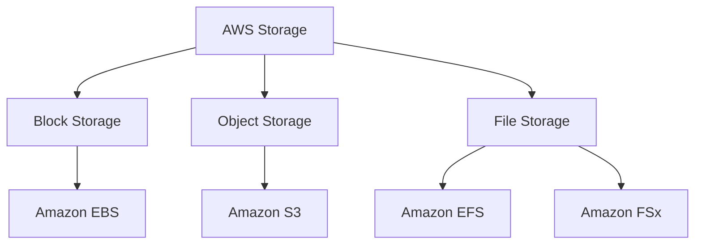
```mermaid
graph TB
    A[AWS Storage] --> B[Block Storage]
    A --> C[Object Storage]
    A --> D[File Storage]
    B --> E[Amazon EBS]
    C --> F[Amazon S3]
    D --> G[Amazon EFS]
    D --> H[Amazon FSx]
```

### Amazon S3 (Simple Storage Service)

**What is S3?**
Object storage service offering scalability, data availability, security, and performance.

#### Key Concepts

**Buckets**:
- Container for objects
- Globally unique name
- Region-specific

**Objects**:
- Files stored in S3
- Can be 0 bytes to 5 TB
- Consists of: Key (name), Value (data), Metadata, Version ID

**Key Features:**
- **Durability**: 99.999999999% (11 nines)
- **Availability**: 99.99% (varies by storage class)
- **Scalability**: Unlimited storage
- **Security**: Encryption, access controls, versioning

#### S3 Storage Classes

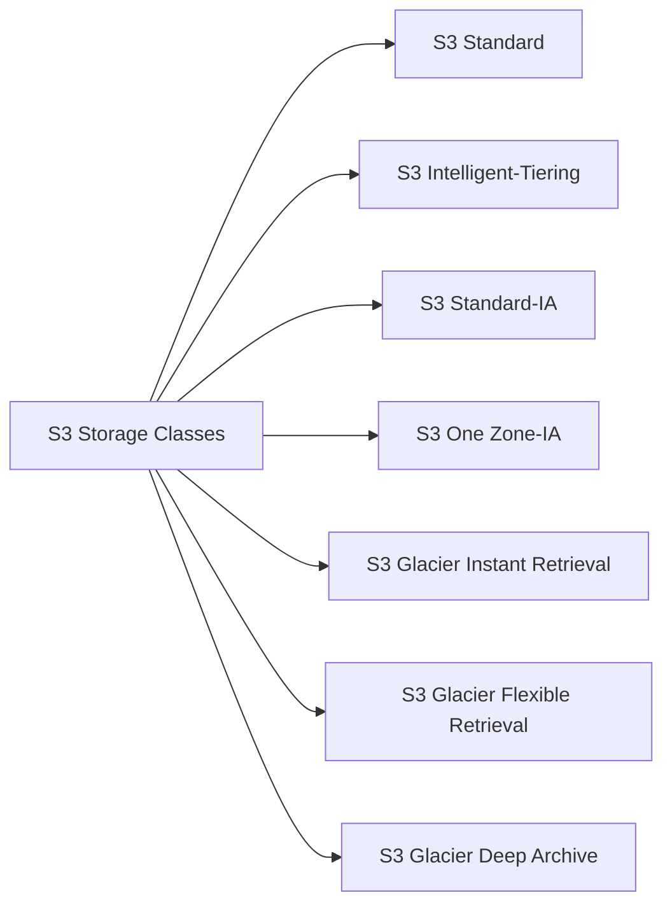
```mermaid
graph LR
    A[S3 Storage Classes] --> B[S3 Standard]
    A --> C[S3 Intelligent-Tiering]
    A --> D[S3 Standard-IA]
    A --> E[S3 One Zone-IA]
    A --> F[S3 Glacier Instant Retrieval]
    A --> G[S3 Glacier Flexible Retrieval]
    A --> H[S3 Glacier Deep Archive]
```

**1. S3 Standard**
- **Use Case**: Frequently accessed data
- **Availability**: 99.99%
- **AZs**: ≥3
- **Retrieval**: Milliseconds
- **Cost**: Highest storage cost, no retrieval fee
- **Example**: Content distribution, analytics

**2. S3 Intelligent-Tiering**
- **Use Case**: Unknown or changing access patterns
- **Feature**: Automatically moves objects between tiers
- **AZs**: ≥3
- **Cost**: Small monthly monitoring fee, no retrieval fee
- **Example**: Data lakes, user-generated content

**3. S3 Standard-IA (Infrequent Access)**
- **Use Case**: Infrequently accessed but requires rapid access
- **Availability**: 99.9%
- **AZs**: ≥3
- **Cost**: Lower storage cost, retrieval fee applies
- **Example**: Backups, disaster recovery

**4. S3 One Zone-IA**
- **Use Case**: Infrequently accessed, non-critical data
- **Availability**: 99.5%
- **AZs**: 1 (not resilient to AZ loss)
- **Cost**: 20% less than Standard-IA
- **Example**: Secondary backups, easily recreatable data

**5. S3 Glacier Instant Retrieval**
- **Use Case**: Archive data needing immediate access
- **Retrieval**: Milliseconds
- **Minimum Storage**: 90 days
- **Cost**: Lower storage cost, retrieval fee applies
- **Example**: Medical images, news media assets

**6. S3 Glacier Flexible Retrieval** (formerly Glacier)
- **Use Case**: Archive data accessed 1-2 times/year
- **Retrieval**: Minutes to hours (expedited, standard, bulk)
- **Minimum Storage**: 90 days
- **Cost**: Very low storage cost
- **Example**: Annual audits, compliance archives

**7. S3 Glacier Deep Archive**
- **Use Case**: Long-term archive, accessed rarely
- **Retrieval**: 12-48 hours
- **Minimum Storage**: 180 days
- **Cost**: Lowest storage cost
- **Example**: Financial records (7-10 year retention)

**📝 Exam Tip**:
- **Standard** = Frequently accessed
- **Standard-IA/One Zone-IA** = Infrequent access, rapid retrieval
- **Glacier** = Archive, slower retrieval
- **Deep Archive** = Lowest cost, slowest retrieval

#### S3 Lifecycle Policies

Automatically transition objects between storage classes:
- Day 0: Upload to S3 Standard
- Day 30: Move to S3 Standard-IA
- Day 90: Move to S3 Glacier
- Day 365: Delete

#### S3 Versioning

- Keep multiple versions of an object
- Protect against accidental deletion
- Can be suspended but not disabled once enabled

#### S3 Replication

**Cross-Region Replication (CRR)**:
- Replicate objects across AWS Regions
- Compliance, lower latency, disaster recovery

**Same-Region Replication (SRR)**:
- Replicate within same Region
- Log aggregation, production/test sync

#### S3 Security

**Access Control:**
- Bucket policies
- Access Control Lists (ACLs)
- IAM policies

**Encryption:**
- **At Rest**: SSE-S3, SSE-KMS, SSE-C
- **In Transit**: SSL/TLS (HTTPS)

**Other Features:**
- Block Public Access (enabled by default)
- S3 Access Points
- Object Lock (WORM - Write Once Read Many)

### Amazon EBS (Elastic Block Store)

**What is EBS?**
Block-level storage volumes for EC2 instances - like a virtual hard drive.

**Key Characteristics:**
- **Persistent**: Data persists even when EC2 instance is stopped
- **AZ-specific**: EBS volume and EC2 instance must be in same AZ
- **Attachable**: Can be attached to one EC2 instance at a time (except io2 multi-attach)
- **Snapshots**: Point-in-time backups stored in S3

#### EBS Volume Types

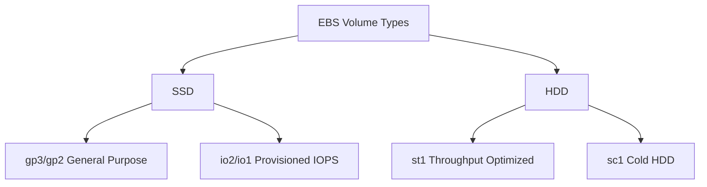
```mermaid
graph TB
    A[EBS Volume Types] --> B[SSD]
    A --> C[HDD]
    B --> D[gp3/gp2 General Purpose]
    B --> E[io2/io1 Provisioned IOPS]
    C --> F[st1 Throughput Optimized]
    C --> G[sc1 Cold HDD]
```

**SSD-Backed Volumes** (for IOPS-intensive workloads):

1. **General Purpose SSD (gp3, gp2)**
   - **Use Case**: Boot volumes, virtual desktops, dev/test
   - **Size**: 1 GB - 16 TB
   - **IOPS**: Up to 16,000
   - **Best for**: Most workloads

2. **Provisioned IOPS SSD (io2, io1)**
   - **Use Case**: Mission-critical applications, databases
   - **Size**: 4 GB - 16 TB
   - **IOPS**: Up to 64,000 (io2) or 32,000 (io1)
   - **Best for**: I/O-intensive databases (MongoDB, MySQL, PostgreSQL)

**HDD-Backed Volumes** (for throughput-intensive workloads):

3. **Throughput Optimized HDD (st1)**
   - **Use Case**: Big data, data warehouses, log processing
   - **Size**: 125 GB - 16 TB
   - **Throughput**: Up to 500 MB/s
   - **Cannot be boot volume**

4. **Cold HDD (sc1)**
   - **Use Case**: Infrequently accessed data
   - **Size**: 125 GB - 16 TB
   - **Throughput**: Up to 250 MB/s
   - **Lowest cost**
   - **Cannot be boot volume**

**📝 Exam Tip**:
- **gp3/gp2** = Most workloads, boot volumes
- **io2/io1** = High-performance databases
- **st1** = Big data, throughput-focused
- **sc1** = Lowest cost, infrequent access

#### EBS Snapshots

- Incremental backups to Amazon S3
- First snapshot is full copy, subsequent are incremental
- Can create EBS volume from snapshot in any AZ
- Can copy snapshots across Regions

### Amazon EFS (Elastic File System)

**What is EFS?**
Managed NFS (Network File System) - shared file storage.

**Key Characteristics:**
- **Shared Access**: Multiple EC2 instances can access simultaneously
- **Regional**: Automatically replicates across multiple AZs
- **Scalable**: Grows and shrinks automatically
- **Performance**: Up to 10 GB/s throughput

**Use Cases:**
- Content management
- Web serving
- Home directories
- Application development

**Storage Classes:**
- **Standard**: Frequently accessed files
- **Infrequent Access (IA)**: Lower cost for files not accessed every day

**📝 Exam Tip**:
- **EBS** = Single EC2 instance, AZ-specific
- **EFS** = Multiple EC2 instances, Regional, Linux only
- **FSx for Windows** = Windows-based shared storage

### AWS Storage Gateway

**What is Storage Gateway?**
Hybrid cloud storage service connecting on-premises to AWS cloud storage.

**Types:**

1. **File Gateway**
   - Store files as objects in S3
   - NFS and SMB protocols
   - On-premises cache for low latency

2. **Volume Gateway**
   - Block storage backed by S3
   - Two modes: Stored Volumes, Cached Volumes

3. **Tape Gateway**
   - Virtual tape library backed by S3 and Glacier
   - Replace physical tape infrastructure
   - Backup applications connect via iSCSI

**Use Case**: Extend on-premises storage to cloud, backup and disaster recovery

---

## Module 5: Database Services

### Database Types Overview

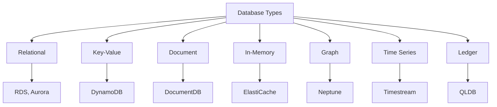
```mermaid
graph TB
    A[Database Types] --> B[Relational]
    A --> C[Key-Value]
    A --> D[Document]
    A --> E[In-Memory]
    A --> F[Graph]
    A --> G[Time Series]
    A --> H[Ledger]
    B --> I[RDS, Aurora]
    C --> J[DynamoDB]
    D --> K[DocumentDB]
    E --> L[ElastiCache]
    F --> M[Neptune]
    G --> N[Timestream]
    H --> O[QLDB]
```

### Amazon RDS (Relational Database Service)

**What is RDS?**
Managed relational database service - AWS handles infrastructure management.

**Supported Engines:**
1. **Amazon Aurora** (AWS-built, MySQL/PostgreSQL compatible)
2. **MySQL**
3. **PostgreSQL**
4. **MariaDB**
5. **Oracle**
6. **Microsoft SQL Server**

**AWS Manages:**
- Hardware provisioning
- Database setup and patching
- Automated backups
- Software updates
- High availability
- Scaling

**You Manage:**
- Application optimization
- Database schema
- Query tuning

#### Key Features

**1. Multi-AZ Deployments**
- **Purpose**: High availability and failover support
- **How it works**: Synchronous replication to standby in different AZ
- **Automatic failover**: 1-2 minutes
- **Use case**: Production databases

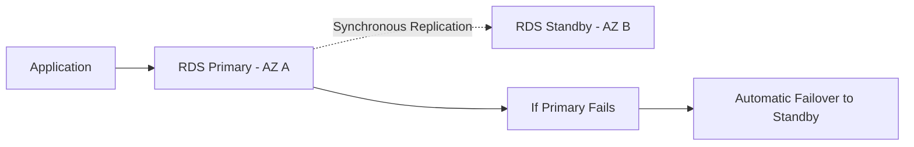
```mermaid
graph LR
    A[Application] --> B[RDS Primary - AZ A]
    B -.Synchronous Replication.-> C[RDS Standby - AZ B]
    B --> D[If Primary Fails]
    D --> E[Automatic Failover to Standby]
```

**2. Read Replicas**
- **Purpose**: Scale read workloads
- **How it works**: Asynchronous replication
- **Up to 5 read replicas** per database instance
- **Can be in different Region** (cross-region)
- **Use case**: Reporting, analytics queries

**3. Automated Backups**
- **Retention**: 0-35 days (default: 7 days)
- **Point-in-time recovery**: Restore to any second within retention period
- **Backup window**: Can specify preferred time
- **Stored in S3**

**4. Database Snapshots**
- **User-initiated**: Manual backups
- **Retention**: Kept until explicitly deleted
- **Can copy to other Regions**
- **Can share with other AWS accounts**

**📝 Exam Tip**:
- **Multi-AZ** = High availability, automatic failover, synchronous
- **Read Replicas** = Scale reads, asynchronous, can be cross-region
- Multi-AZ for disaster recovery, Read Replicas for performance

### Amazon Aurora

**What is Aurora?**
AWS-built enterprise-class relational database, MySQL and PostgreSQL compatible.

**Key Benefits:**
- **5x faster than MySQL**, 3x faster than PostgreSQL
- **Up to 128 TB** per database volume
- **6 copies of data** across 3 AZs
- **15 read replicas** (vs 5 for RDS)
- **Continuous backup** to S3
- **Aurora Serverless**: On-demand, auto-scaling

**Use Cases:**
- Enterprise applications
- SaaS applications
- Gaming applications

**Pricing:**
- Pay for compute and storage separately
- No upfront commitment for serverless

**📝 Exam Tip**: Aurora is AWS's high-performance database. More expensive than standard RDS but offers better performance and availability.

### Amazon DynamoDB

**What is DynamoDB?**
Fully managed NoSQL key-value and document database.

**Key Characteristics:**
- **Serverless**: No servers to manage
- **Performance**: Single-digit millisecond response times
- **Scalability**: Handles any scale automatically
- **Availability**: Multi-AZ by default
- **Durability**: Data replicated across multiple AZs

**Use Cases:**
- Mobile and web applications
- Gaming leaderboards
- IoT applications
- Real-time bidding
- Shopping carts

**Capacity Modes:**

1. **On-Demand**
   - Pay per request
   - No capacity planning needed
   - Good for unpredictable workloads
   - More expensive per request

2. **Provisioned**
   - Specify reads/writes per second
   - Predictable cost
   - Auto-scaling available
   - Good for predictable workloads

**Features:**

**DynamoDB Accelerator (DAX)**
- In-memory cache for DynamoDB
- Microsecond response times
- No application code changes needed

**DynamoDB Streams**
- Capture changes to items
- Trigger Lambda functions
- Build event-driven applications

**Global Tables**
- Multi-region, multi-active replication
- Local reads and writes in any region
- Disaster recovery

**📝 Exam Tip**:
- DynamoDB = NoSQL, serverless, fully managed
- RDS = SQL, managed servers
- DynamoDB for high-scale, flexible schema applications

### Amazon Redshift

**What is Redshift?**
Fully managed data warehouse service for big data analytics.

**Key Characteristics:**
- **Columnar storage**: Optimized for analytics
- **Massively Parallel Processing (MPP)**: Distributes queries across nodes
- **Petabyte scale**: Handle massive datasets
- **SQL-based**: Use standard SQL queries
- **Cost-effective**: 1/10th the cost of traditional data warehouses

**Use Cases:**
- Business intelligence
- Big data analytics
- Log analysis
- Financial reporting

**Redshift Spectrum**
- Query data in S3 without loading it
- Extend queries beyond Redshift cluster

**📝 Exam Tip**: Redshift is for data warehousing and analytics, not transactional databases.

### Other Database Services

#### Amazon ElastiCache
- **What**: In-memory caching service
- **Engines**: Redis, Memcached
- **Use cases**: Session storage, caching database queries, real-time analytics
- **Benefits**: Microsecond latency, high throughput

#### Amazon DocumentDB
- **What**: MongoDB-compatible document database
- **Fully managed**: AWS handles patching, backups, scaling
- **Use cases**: Content management, catalogs, user profiles

#### Amazon Neptune
- **What**: Graph database service
- **Use cases**: Social networks, recommendation engines, fraud detection, knowledge graphs

#### Amazon QLDB (Quantum Ledger Database)
- **What**: Ledger database with immutable, cryptographically verifiable transaction log
- **Use cases**: Financial transactions, supply chain, regulatory compliance

#### Amazon Timestream
- **What**: Time series database
- **Use cases**: IoT applications, application monitoring, industrial telemetry

#### Amazon Keyspaces
- **What**: Managed Apache Cassandra-compatible database
- **Use cases**: High-scale applications requiring single-digit millisecond latency

**📝 Exam Tip**: Know which database to use for specific scenarios:
- **Transactional**: RDS, Aurora
- **NoSQL Key-Value**: DynamoDB
- **Caching**: ElastiCache
- **Data Warehouse**: Redshift
- **Graph**: Neptune
- **Ledger**: QLDB
- **Time Series**: Timestream

---

## Module 6: Networking & Content Delivery

### Amazon VPC (Virtual Private Cloud)

**What is VPC?**
Logically isolated virtual network where you launch AWS resources.

**Key Components:**

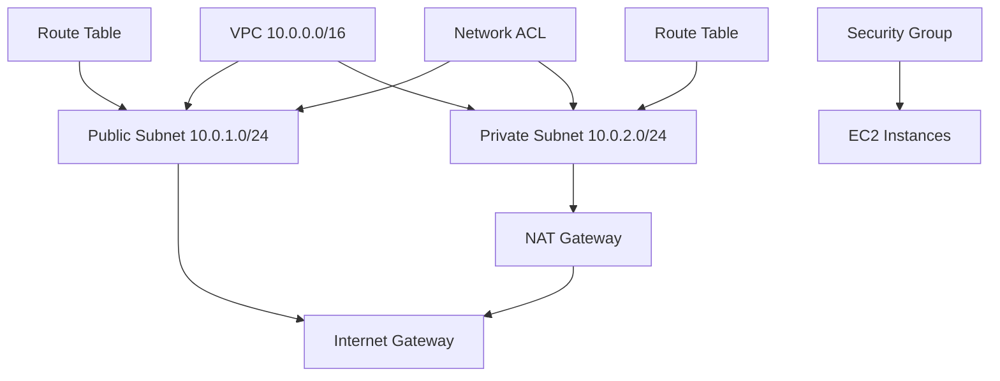
```mermaid
graph TB
    A[VPC 10.0.0.0/16] --> B[Public Subnet 10.0.1.0/24]
    A --> C[Private Subnet 10.0.2.0/24]
    B --> D[Internet Gateway]
    C --> E[NAT Gateway]
    E --> D
    F[Route Table] --> B
    G[Route Table] --> C
    H[Security Group] --> I[EC2 Instances]
    J[Network ACL] --> B
    J --> C
```

#### 1. Subnets
- **Public Subnet**: Has route to Internet Gateway (internet access)
- **Private Subnet**: No direct internet access
- **Each subnet**: Associated with one AZ

#### 2. Internet Gateway (IGW)
- **Purpose**: Connect VPC to internet
- **One IGW per VPC**
- **Horizontally scaled, redundant, highly available**

#### 3. NAT Gateway (Network Address Translation)
- **Purpose**: Allow private subnet resources to access internet
- **One-way**: Outbound only (responses allowed)
- **Placed in public subnet**
- **Managed by AWS**

#### 4. Route Tables
- **Purpose**: Control traffic routing
- **Main route table**: Automatically assigned to VPC
- **Custom route tables**: Create for specific routing needs
- **Routes**: Define where network traffic is directed

#### 5. Security Groups
- **What**: Virtual firewall for EC2 instances
- **Stateful**: Return traffic automatically allowed
- **Rules**: Allow rules only (no deny rules)
- **Level**: Instance level
- **Default**: Denies all inbound, allows all outbound

#### 6. Network ACLs (Access Control Lists)
- **What**: Firewall for subnets
- **Stateless**: Must explicitly allow return traffic
- **Rules**: Both allow and deny rules
- **Level**: Subnet level
- **Default**: Allows all inbound and outbound

**Security Group vs Network ACL:**

| Feature | Security Group | Network ACL |
|---------|---------------|-------------|
| Level | Instance | Subnet |
| State | Stateful | Stateless |
| Rules | Allow only | Allow & Deny |
| Evaluation | All rules | Rules in order |
| Applies to | Instances explicitly specified | All instances in subnet |

**📝 Exam Tip**:
- **Security Groups** = Instance firewall, stateful
- **Network ACLs** = Subnet firewall, stateless
- Remember: Security Groups have ALLOW rules only

#### VPC Peering
- **What**: Connect two VPCs privately
- **Can be**: Same account or different accounts, same region or different regions
- **Not transitive**: A→B and B→C doesn't mean A→C

#### VPC Endpoints
- **What**: Private connection to AWS services without internet gateway
- **Types**:
  - **Interface Endpoints**: ENI with private IP (powered by PrivateLink)
  - **Gateway Endpoints**: Route table target (S3 and DynamoDB only)
- **Benefits**: Enhanced security, lower latency

### AWS Direct Connect

**What is Direct Connect?**
Dedicated private network connection from on-premises to AWS.

**Benefits:**
- **Consistent network performance**: Not over public internet
- **Reduced bandwidth costs**: Lower data transfer rates
- **Private connectivity**: More secure than VPN
- **Hybrid cloud**: Seamlessly extend on-premises to cloud

**Use Cases:**
- Large datasets transfer
- Real-time data feeds
- Hybrid cloud architectures

**📝 Exam Tip**: Direct Connect = physical dedicated connection, not VPN over internet.

### Amazon Route 53

**What is Route 53?**
Highly available and scalable Domain Name System (DNS) web service.

**Key Functions:**
1. **Domain Registration**: Buy and manage domain names
2. **DNS Routing**: Route end users to applications
3. **Health Checking**: Monitor application health and route traffic accordingly

**Routing Policies:**

1. **Simple Routing**
   - One record with multiple IP addresses
   - Random selection
   - No health checks

2. **Weighted Routing**
   - Distribute traffic based on weights
   - Example: 80% to one server, 20% to another
   - Good for A/B testing

3. **Latency-based Routing**
   - Route to resource with lowest latency
   - Based on user's geographic location

4. **Failover Routing**
   - Active-passive failover
   - Primary and secondary resources
   - Health checks determine failover

5. **Geolocation Routing**
   - Route based on user's geographic location
   - Example: Europe users → eu-west-1, US users → us-east-1

6. **Geoproximity Routing**
   - Route based on geographic location of resources
   - Can configure bias

7. **Multi-value Answer Routing**
   - Return multiple healthy values
   - Client chooses which to use

**📝 Exam Tip**: Know routing policies for exam scenarios. Latency-based for performance, Geolocation for compliance, Failover for DR.

### Amazon CloudFront

**What is CloudFront?**
Content Delivery Network (CDN) that delivers content with low latency.

**How It Works:**
1. User requests content
2. Request routed to nearest Edge Location
3. If cached: Deliver from Edge Location (fast)
4. If not cached: Fetch from origin, cache, then deliver

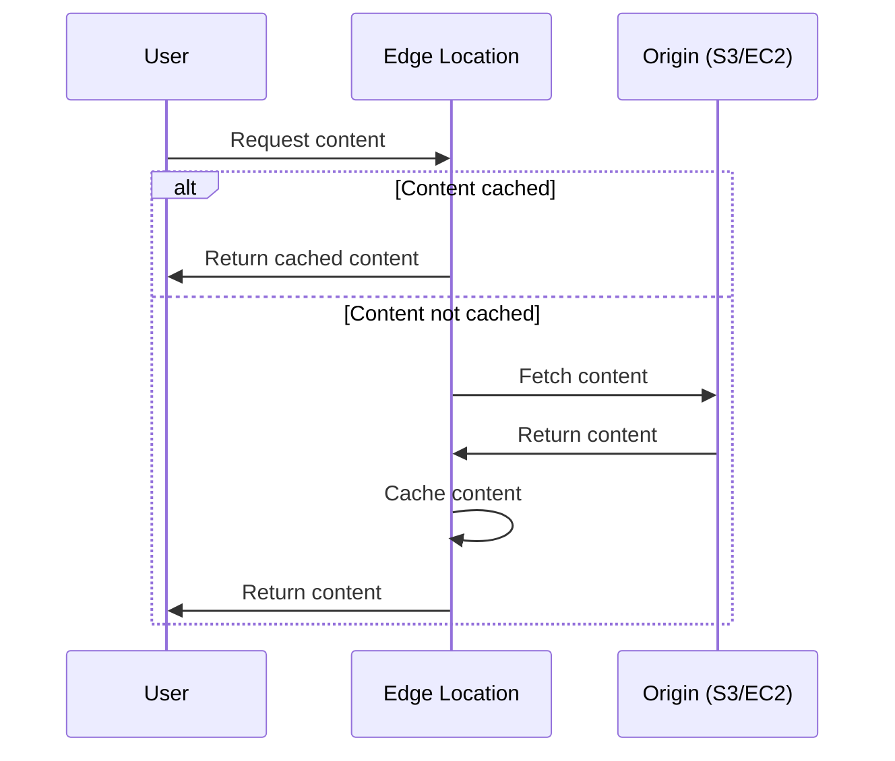
```mermaid
sequenceDiagram
    participant User
    participant Edge Location
    participant Origin (S3/EC2)

    User->>Edge Location: Request content
    alt Content cached
        Edge Location->>User: Return cached content
    else Content not cached
        Edge Location->>Origin (S3/EC2): Fetch content
        Origin (S3/EC2)->>Edge Location: Return content
        Edge Location->>Edge Location: Cache content
        Edge Location->>User: Return content
    end
```

**Benefits:**
- **Global reach**: 450+ Edge Locations
- **Low latency**: Content closer to users
- **DDoS protection**: AWS Shield Standard included
- **SSL/TLS**: HTTPS support
- **Cost-effective**: Reduce origin load

**Origins:**
- S3 buckets
- EC2 instances
- Elastic Load Balancers
- Custom origins (HTTP servers)

**Use Cases:**
- Static website hosting
- Video streaming
- API acceleration
- Software distribution

**📝 Exam Tip**: CloudFront caches content at Edge Locations for faster delivery. Different from S3 Transfer Acceleration.

### AWS Global Accelerator

**What is Global Accelerator?**
Network service that improves availability and performance of applications.

**How It Works:**
- Provides 2 static Anycast IP addresses
- Traffic routed over AWS global network
- Automatically routes to optimal endpoint

**Use Cases:**
- Gaming applications
- IoT applications
- VoIP applications

**CloudFront vs Global Accelerator:**
- **CloudFront**: HTTP/HTTPS content, caching at Edge Locations
- **Global Accelerator**: TCP/UDP traffic, no caching, improves performance of non-HTTP protocols

---

## Module 7: Security, Identity & Compliance

### Shared Responsibility Model

**Critical Concept**: AWS and customer share responsibility for security.

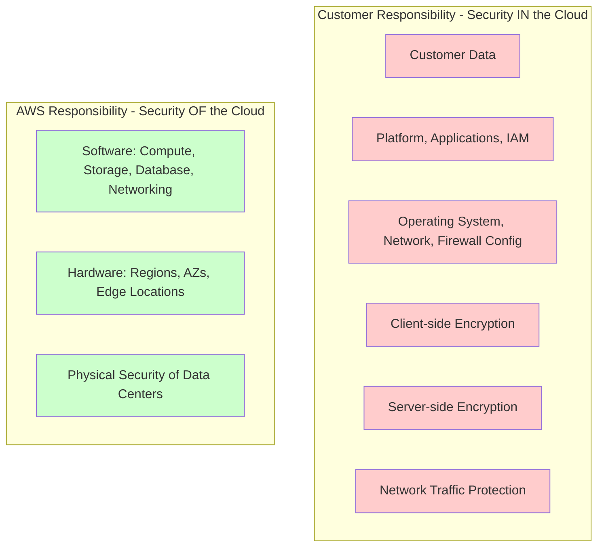
```mermaid
graph TB
    subgraph "Customer Responsibility - Security IN the Cloud"
        A[Customer Data]
        B[Platform, Applications, IAM]
        C[Operating System, Network, Firewall Config]
        D[Client-side Encryption]
        E[Server-side Encryption]
        F[Network Traffic Protection]
    end

    subgraph "AWS Responsibility - Security OF the Cloud"
        G[Software: Compute, Storage, Database, Networking]
        H[Hardware: Regions, AZs, Edge Locations]
        I[Physical Security of Data Centers]
    end

    style A fill:#ffcccc
    style B fill:#ffcccc
    style C fill:#ffcccc
    style D fill:#ffcccc
    style E fill:#ffcccc
    style F fill:#ffcccc
    style G fill:#ccffcc
    style H fill:#ccffcc
    style I fill:#ccffcc
```

**AWS Responsibility (Security OF the Cloud):**
- Physical security of data centers
- Hardware and infrastructure
- Network infrastructure
- Virtualization infrastructure
- Managed services (RDS, Lambda, etc.)

**Customer Responsibility (Security IN the Cloud):**
- Customer data
- Applications
- Identity and Access Management
- Operating systems (for EC2)
- Network configuration
- Firewall configuration
- Encryption (data at rest and in transit)

**Service Categories:**

**Infrastructure Services (EC2):**
- AWS: Physical infrastructure, hypervisor
- Customer: OS, applications, data, firewall, encryption

**Container Services (RDS):**
- AWS: Infrastructure, OS, platform
- Customer: Data, access management, encryption settings

**Abstracted Services (S3, DynamoDB):**
- AWS: Most security responsibilities
- Customer: Data classification, encryption, access policies

**📝 Exam Tip**: Know the shared responsibility model cold. Questions often ask "Who is responsible for X?" Answer depends on service type.

### AWS IAM (Identity and Access Management)

**What is IAM?**
Service to securely control access to AWS resources.

**Key Components:**

#### 1. Users
- Represent a person or application
- Permanent long-term credentials
- **Best Practice**: Create individual users, not shared credentials

#### 2. Groups
- Collection of users
- Apply permissions to multiple users at once
- Users can belong to multiple groups
- **Example**: Developers group, Admins group, QA group

#### 3. Roles
- Temporary credentials
- Assumed by users, applications, or services
- **Use cases**:
  - EC2 instance accessing S3
  - Cross-account access
  - Federation (corporate directory)

#### 4. Policies
- JSON documents defining permissions
- **Types**:
  - **Identity-based**: Attached to users, groups, roles
  - **Resource-based**: Attached to resources (S3 bucket policy)
  - **AWS Managed**: Created and managed by AWS
  - **Customer Managed**: Created and managed by you
  - **Inline**: Embedded directly in user, group, or role

**Policy Structure:**
```json
{
  "Version": "2012-10-17",
  "Statement": [
    {
      "Effect": "Allow",
      "Action": "s3:GetObject",
      "Resource": "arn:aws:s3:::my-bucket/*"
    }
  ]
}
```

**Policy Evaluation Logic:**
1. By default, all requests are denied (implicit deny)
2. Explicit allow overrides implicit deny
3. Explicit deny overrides any allow

#### IAM Best Practices

✅ **Enable MFA (Multi-Factor Authentication)**
- Root account always
- Privileged users
- Additional security layer

✅ **Follow Principle of Least Privilege**
- Grant only permissions needed
- Start with minimum permissions
- Add more as needed

✅ **Use Roles for Applications**
- EC2 instances use IAM roles
- Not hardcoded credentials

✅ **Rotate Credentials Regularly**
- Change passwords
- Rotate access keys

✅ **Use Policy Conditions**
- Add constraints (time, IP address, MFA)

✅ **Monitor Activity**
- CloudTrail logs API calls
- Access Advisor shows unused permissions

**Root User:**
- Email address used to create account
- **Has complete access** to all resources
- **Best Practice**: Don't use for everyday tasks
- **Use only for**: Account management tasks
- **Secure it**: Enable MFA, don't create access keys

**📝 Exam Tip**:
- Never use root account for daily tasks
- Users = long-term credentials, Roles = temporary credentials
- Always follow least privilege principle

### AWS Organizations

**What is AWS Organizations?**
Centrally manage multiple AWS accounts.

**Benefits:**
- **Consolidated billing**: Single payment for all accounts
- **Volume discounts**: Aggregated usage across accounts
- **Centralized management**: Control from master account
- **Service Control Policies (SCPs)**: Manage permissions across accounts

**Structure:**

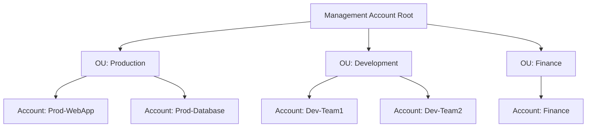
```mermaid
graph TB
    A[Management Account Root] --> B[OU: Production]
    A --> C[OU: Development]
    A --> D[OU: Finance]
    B --> E[Account: Prod-WebApp]
    B --> F[Account: Prod-Database]
    C --> G[Account: Dev-Team1]
    C --> H[Account: Dev-Team2]
    D --> I[Account: Finance]
```

**Organizational Units (OUs):**
- Group accounts with similar needs
- Apply policies to OUs
- Can nest OUs (hierarchical structure)

**Service Control Policies (SCPs):**
- Control maximum permissions for accounts
- Don't grant permissions (only limit)
- Applied to OUs or accounts
- **Example**: Prevent accounts from leaving organization, restrict regions

**📝 Exam Tip**: Organizations provide consolidated billing and centralized control. SCPs limit permissions but don't grant them.

### Compliance Programs

**AWS Compliance:**
AWS complies with many global and industry-specific standards.

**Common Programs:**
- **PCI DSS**: Payment Card Industry Data Security Standard
- **HIPAA**: Health Insurance Portability and Accountability Act
- **FedRAMP**: Federal Risk and Authorization Management Program
- **GDPR**: General Data Protection Regulation
- **SOC 1, 2, 3**: Service Organization Controls
- **ISO 27001**: Information security management
- **FISMA**: Federal Information Security Management Act

**AWS Artifact:**
- Self-service portal for compliance reports
- Access AWS security and compliance documents
- Download AWS ISO certifications, PCI reports, SOC reports
- Review and accept agreements

**📝 Exam Tip**: AWS Artifact is where you find compliance reports and agreements.

### Security Services

#### AWS Shield
- **What**: DDoS (Distributed Denial of Service) protection
- **Shield Standard**:
  - Free for all AWS customers
  - Protection against common DDoS attacks
  - Layer 3 and 4 protection
- **Shield Advanced**:
  - $3,000/month
  - Enhanced protection
  - 24/7 DDoS Response Team (DRT)
  - Cost protection (credits for scaling during attack)

#### AWS WAF (Web Application Firewall)
- **What**: Filter malicious web traffic
- **Protection against**: SQL injection, cross-site scripting (XSS)
- **Works with**: CloudFront, ALB, API Gateway, AppSync
- **Rules**: Allow, Block, or Count requests
- **Rate-based rules**: Block IPs making too many requests

#### Amazon GuardDuty
- **What**: Intelligent threat detection service
- **Analyzes**: VPC Flow Logs, CloudTrail logs, DNS logs
- **Uses**: Machine learning to detect anomalies
- **Alerts**: Unusual API calls, unauthorized deployments, compromised instances
- **No agents required**

#### Amazon Inspector
- **What**: Automated security assessment service
- **Scans**: EC2 instances, container images, Lambda functions
- **Finds**: Vulnerabilities, deviations from best practices
- **Reports**: Prioritized list of security findings
- **Continuous scanning**

#### Amazon Macie
- **What**: Data security service using machine learning
- **Purpose**: Discover and protect sensitive data (PII, financial data)
- **Monitors**: S3 buckets
- **Alerts**: When sensitive data is found or unusual access patterns

#### AWS Secrets Manager
- **What**: Manage, retrieve, and rotate secrets
- **Secrets**: Database credentials, API keys, passwords
- **Benefits**: Automatic rotation, encryption, access control
- **Integration**: RDS, Redshift, DocumentDB

#### AWS Key Management Service (KMS)
- **What**: Create and manage encryption keys
- **Integrated**: With most AWS services (S3, EBS, RDS, etc.)
- **Customer Master Keys (CMKs)**: Encrypt/decrypt data
- **Audit**: CloudTrail logs key usage

#### AWS CloudHSM
- **What**: Hardware Security Module in AWS Cloud
- **Use case**: Meet compliance requirements for dedicated hardware
- **Single-tenant**: Your keys only
- **More expensive** than KMS

**📝 Exam Tip**:
- **Shield** = DDoS protection
- **WAF** = Web application attacks
- **GuardDuty** = Threat detection
- **Inspector** = Security assessments
- **Macie** = Data discovery and protection
- **KMS** = Encryption key management

---

## Module 8: Pricing & Support

### AWS Pricing Models

**Three Fundamental Drivers:**
1. **Compute**: Hourly/second billing from instance launch to termination
2. **Storage**: Typically per GB
3. **Data Transfer**:
   - **Outbound**: Aggregated and charged
   - **Inbound**: Typically free
   - **Between Regions**: Charged
   - **Within same Region using private IP**: Free

**Pay-as-you-go Pricing:**
- No upfront costs
- No long-term commitments
- Pay only for what you use
- Scale up or down based on needs

**Pay Less When You Reserve:**
- Reserved Instances: Up to 75% savings
- Savings Plans: Flexible pricing model
- 1 or 3 year commitments

**Pay Even Less Per Unit by Using More:**
- Volume-based discounts
- **Example**: More S3 storage = lower per-GB price
- Tiered pricing

**Pay Even Less As AWS Grows:**
- AWS passes savings to customers
- 115+ price reductions since launch

### AWS Free Tier

**Three Types:**

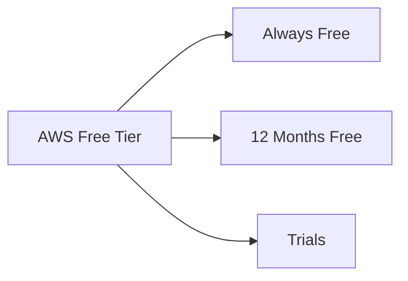
```mermaid
graph LR
    A[AWS Free Tier] --> B[Always Free]
    A --> C[12 Months Free]
    A --> D[Trials]
```

**1. Always Free**
- Never expire
- Available to all AWS customers
- **Examples**:
  - Lambda: 1M requests/month
  - DynamoDB: 25 GB storage
  - SNS: 1M publishes/month
  - CloudWatch: 10 custom metrics

**2. 12 Months Free**
- Starts from account creation date
- **Examples**:
  - EC2: 750 hours/month of t2.micro (Linux) or t3.micro (Windows)
  - S3: 5 GB Standard storage
  - RDS: 750 hours/month of db.t2.micro

**3. Trials**
- Short-term free trials
- Start from first use of service
- **Examples**:
  - SageMaker: 2 months free
  - Inspector: 90-day trial
  - Lightsail: 1 month free

**📝 Exam Tip**: Know the difference between Always Free and 12 Months Free. Lambda and DynamoDB are always free (up to limits).

### Pricing Examples

#### Amazon EC2 Pricing
- **Factors**: Instance type, Region, OS, purchase option (On-Demand, Reserved, Spot)
- **Billing**: Per hour or per second (minimum 60 seconds)
- **Additional**: Data transfer, EBS volumes, Elastic IPs

#### Amazon S3 Pricing
- **Storage**: Per GB/month
- **Requests**: PUT, GET, DELETE per 1,000 requests
- **Data Transfer**: Out to internet
- **Storage Class**: Different prices for Standard, IA, Glacier

#### Amazon RDS Pricing
- **Instance**: Per hour
- **Storage**: Per GB/month
- **Backup Storage**: Beyond free allocation
- **Data Transfer**: Out to internet

#### AWS Lambda Pricing
- **Requests**: Per 1M requests
- **Duration**: GB-seconds (memory × execution time)
- **Always Free**: 1M requests + 400,000 GB-seconds/month

### Cost Management Tools

#### AWS Budgets
- **What**: Set custom budgets that alert when exceeded
- **Types**: Cost budgets, Usage budgets, Reservation budgets, Savings Plans budgets
- **Alerts**: Email or SNS notification
- **Actions**: Can automatically apply IAM or SCP policies
- **Example**: Alert when monthly spend exceeds $500

#### AWS Cost Explorer
- **What**: Visualize and analyze costs
- **Features**:
  - View last 12 months
  - Forecast next 12 months
  - Filter by service, Region, tag, etc.
  - Identify cost drivers
  - Detect anomalies
- **Reports**: Pre-built and custom

#### AWS Cost and Usage Report
- **What**: Most comprehensive cost data
- **Details**: Hourly, daily, or monthly line items
- **Delivered to**: S3 bucket
- **Format**: CSV files
- **Use**: Deep dive analysis, integrate with other tools

#### AWS Pricing Calculator
- **What**: Estimate monthly AWS bill
- **Before**: Called Simple Monthly Calculator
- **Use**: Plan and budget for AWS services
- **Features**: Compare configurations, share estimates

**📝 Exam Tip**:
- **Budgets** = Set alerts for overspending
- **Cost Explorer** = Visualize historical and forecast costs
- **Pricing Calculator** = Estimate before you build

### AWS Support Plans

**Five Support Plans:**

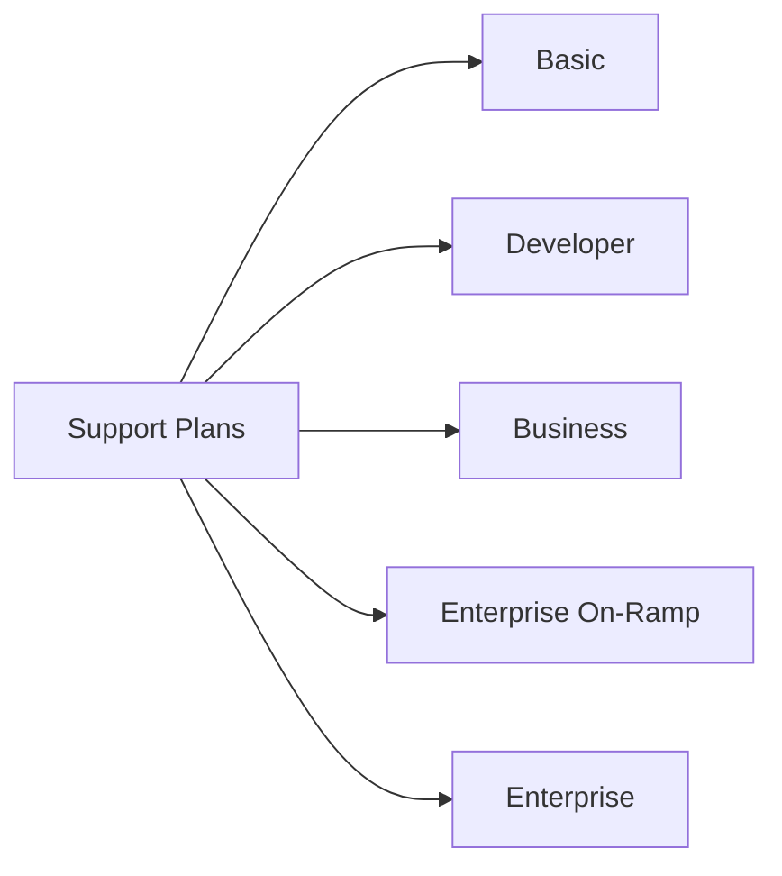
```mermaid
graph LR
    A[Support Plans] --> B[Basic]
    A --> C[Developer]
    A --> D[Business]
    A --> E[Enterprise On-Ramp]
    A --> F[Enterprise]
```

#### 1. Basic Support (Free)
- **Cost**: Free for all AWS customers
- **Includes**:
  - 24/7 access to customer service
  - Documentation, whitepapers, support forums
  - AWS Trusted Advisor: 7 core checks
  - AWS Personal Health Dashboard
- **No technical support**

#### 2. Developer Support
- **Cost**: Greater of $29/month or 3% of monthly usage
- **Best for**: Experimenting with AWS
- **Response Times**:
  - General guidance: < 24 business hours
  - System impaired: < 12 business hours
- **Communication**: Email only (business hours)
- **Trusted Advisor**: 7 core checks
- **1 primary contact**

#### 3. Business Support
- **Cost**: Greater of $100/month or 10% - 3% of monthly usage (tiered)
- **Best for**: Production workloads
- **Response Times**:
  - General guidance: < 24 hours
  - System impaired: < 12 hours
  - Production system impaired: < 4 hours
  - Production system down: < 1 hour
- **Communication**: Email, chat, phone (24/7)
- **Trusted Advisor**: All checks
- **Unlimited contacts**
- **AWS Support API**
- **Third-party software support**

#### 4. Enterprise On-Ramp Support
- **Cost**: Greater of $5,500/month or 10% of monthly usage
- **Best for**: Production/business-critical workloads
- **Response Times**:
  - Business-critical system down: < 30 minutes
  - Plus all Business tier response times
- **Includes**:
  - Pool of Technical Account Managers (TAMs)
  - Concierge Support Team
  - Access to labs and online training
  - Infrastructure Event Management (one per year)

#### 5. Enterprise Support
- **Cost**: Greater of $15,000/month or 10% - 3% of monthly usage (tiered)
- **Best for**: Mission-critical workloads
- **Response Times**:
  - Business-critical system down: < 15 minutes
  - Plus all lower tier response times
- **Includes**:
  - Designated Technical Account Manager (TAM)
  - Concierge Support Team (billing and account)
  - Infrastructure Event Management
  - Well-Architected Reviews
  - Operations Reviews
  - Training and game days

**Comparison Table:**

| Feature | Basic | Developer | Business | Enterprise On-Ramp | Enterprise |
|---------|-------|-----------|----------|-------------------|-----------|
| Cost | Free | $29+ | $100+ | $5,500+ | $15,000+ |
| Technical Support | ❌ | ✅ Email | ✅ 24/7 Phone/Chat | ✅ 24/7 Phone/Chat | ✅ 24/7 Phone/Chat |
| Trusted Advisor | 7 checks | 7 checks | All checks | All checks | All checks |
| TAM | ❌ | ❌ | ❌ | Pool | Designated |
| Production Down | N/A | N/A | < 1 hour | < 30 min | < 15 min |

**📝 Exam Tip**:
- **Basic** = Free, no technical support
- **Developer** = Email support, 12-24 hour response
- **Business** = 24/7 support, < 1 hour for production down, full Trusted Advisor
- **Enterprise** = < 15 min for critical, dedicated TAM
- Remember response times for production system down!

### AWS Trusted Advisor

**What is Trusted Advisor?**
Online tool providing real-time guidance to help provision resources following AWS best practices.

**Five Categories:**

```mermaid
graph TB
    A[Trusted Advisor] --> B[Cost Optimization]
    A --> C[Performance]
    A --> D[Security]
    A --> E[Fault Tolerance]
    A --> F[Service Limits]
```

**1. Cost Optimization**
- Identify idle resources
- Underutilized resources
- Reserved Instance recommendations
- **Examples**: Idle EC2 instances, unattached EBS volumes, unused Elastic IPs

**2. Performance**
- Improve speed and responsiveness
- **Examples**: High utilization EC2 instances, CloudFront optimizations

**3. Security**
- Close security gaps
- **Examples**: MFA on root account, security group rules, S3 bucket permissions, exposed access keys

**4. Fault Tolerance**
- Increase availability and redundancy
- **Examples**: RDS backups, Multi-AZ deployments, EBS snapshots

**5. Service Limits**
- Check service usage against limits
- **Examples**: VPC limits, EC2 instance limits, RDS limits

**Check Colors:**
- 🔴 **Red**: Action recommended
- 🟡 **Yellow**: Investigation recommended
- 🟢 **Green**: No problems detected

**Access Levels:**
- **Basic/Developer Support**: 7 core checks (security only)
- **Business/Enterprise Support**: All checks (50+ checks)

**Core Checks (Free):**
- S3 Bucket Permissions
- Security Groups - Specific Ports Unrestricted
- IAM Use
- MFA on Root Account
- EBS Public Snapshots
- RDS Public Snapshots
- Service Limits

**📝 Exam Tip**: Know the five categories. Business/Enterprise Support gets all Trusted Advisor checks, Basic/Developer only get 7 core security checks.

---

## Module 9: Migration & Innovation

### AWS Cloud Adoption Framework (CAF)

**What is CAF?**
Guidance to help organizations develop efficient cloud migration and management plans.

**Six Perspectives:**

```mermaid
graph TB
    A[AWS CAF] --> B[Business Perspectives]
    A --> C[Technical Perspectives]
    B --> D[Business]
    B --> E[People]
    B --> F[Governance]
    C --> G[Platform]
    C --> H[Security]
    C --> I[Operations]
```

#### Business Perspectives:

**1. Business Perspective**
- **Focus**: IT aligns with business needs
- **Stakeholders**: Business managers, finance managers, budget owners
- **Common Roles**: Business Analysts, Product Owners, Strategy Managers

**2. People Perspective**
- **Focus**: Evaluate organizational structures, skills, and processes
- **Supports**: Change management, training, communication
- **Stakeholders**: HR, staffing, people managers
- **Common Roles**: HR Business Partners, Training Managers

**3. Governance Perspective**
- **Focus**: Align IT strategy and governance with business strategy
- **Manages**: Risk, compliance
- **Stakeholders**: CIO, Program Managers, Project Managers
- **Common Roles**: Cloud Governance Leads, Portfolio Managers

#### Technical Perspectives:

**4. Platform Perspective**
- **Focus**: Describe architecture of target state environment
- **Principles**: Enterprise architecture, migration strategies
- **Stakeholders**: CTO, IT Managers, Solutions Architects
- **Common Roles**: Cloud Architects, Platform Engineers

**5. Security Perspective**
- **Focus**: Achieve confidentiality, integrity, and availability goals
- **Controls**: Security controls, compliance requirements
- **Stakeholders**: CISO, Security Managers, Risk Analysts
- **Common Roles**: Security Architects, Security Engineers

**6. Operations Perspective**
- **Focus**: Enable, run, use, operate, and recover IT workloads
- **Day-to-day**: Service delivery, incident management
- **Stakeholders**: IT Operations Managers, IT Support Managers
- **Common Roles**: Cloud Operations Managers, Site Reliability Engineers

**📝 Exam Tip**: CAF has 6 perspectives - 3 business (Business, People, Governance) and 3 technical (Platform, Security, Operations).

### Migration Strategies (6 Rs)

**The 6 Rs of Migration:**

```mermaid
graph LR
    A[Migration Strategies] --> B[Rehosting]
    A --> C[Replatforming]
    A --> D[Refactoring]
    A --> E[Repurchasing]
    A --> F[Retaining]
    A --> G[Retiring]
```

**1. Rehosting** ("Lift and Shift")
- **What**: Move applications as-is to AWS
- **Effort**: Low
- **Benefits**: Quick migration, immediate cost savings
- **Use case**: Large legacy migrations, time-sensitive
- **Example**: Move on-premises Oracle database to EC2

**2. Replatforming** ("Lift, Tinker, and Shift")
- **What**: Make a few cloud optimizations
- **Effort**: Medium
- **Benefits**: Some cloud benefits without changing core architecture
- **Use case**: Optimize without major changes
- **Example**: Migrate Oracle database to Amazon RDS for Oracle

**3. Refactoring** / Re-architecting
- **What**: Reimagine application using cloud-native features
- **Effort**: High
- **Benefits**: Most cloud benefits, improved agility, performance, scalability
- **Use case**: Strong business need for new features
- **Example**: Migrate monolithic application to microservices on Lambda

**4. Repurchasing**
- **What**: Move to a different product (usually SaaS)
- **Effort**: Varies
- **Benefits**: Latest features, reduced maintenance
- **Use case**: Replace legacy software
- **Example**: Migrate CRM to Salesforce, email to Gmail

**5. Retaining** (Revisit)
- **What**: Keep applications in source environment
- **Effort**: None
- **Benefits**: Focus on migration priorities
- **Use case**: Applications not ready for migration, recent upgrades
- **Example**: Mainframe applications, applications under compliance review

**6. Retiring**
- **What**: Decommission applications
- **Effort**: None (decommission)
- **Benefits**: Reduce costs, eliminate unused assets
- **Use case**: No longer useful, redundant
- **Example**: Old reporting system replaced by new tool

**📝 Exam Tip**: Know all 6 Rs and when to use each. Questions often present scenarios and ask which strategy is best.

### AWS Snow Family

**What is Snow Family?**
Physical devices to migrate large amounts of data into and out of AWS.

**Three Main Devices:**

#### 1. AWS Snowcone
- **Smallest**: 8 lbs (3.6 kg)
- **Storage**: 8 TB HDD or 14 TB SSD
- **Compute**: 2 vCPUs, 4 GB memory (optional)
- **Use case**: Edge computing, data collection in remote locations
- **Rugged**: Extreme environments
- **Example**: Drones, vehicles, remote offices

#### 2. AWS Snowball
**Snowball Edge Storage Optimized**
- **Storage**: 80 TB usable
- **Compute**: 40 vCPUs, 80 GB memory
- **Use case**: Large data migrations, edge computing
- **Example**: Datacenter migration, disaster recovery

**Snowball Edge Compute Optimized**
- **Storage**: 28 TB usable (42 TB total)
- **Compute**: 104 vCPUs, 416 GB memory, optional GPU
- **Use case**: Machine learning, video analysis at edge
- **Example**: Industrial IoT, autonomous vehicles

#### 3. AWS Snowmobile
- **Largest**: 45-foot shipping container
- **Storage**: 100 PB per Snowmobile
- **Use case**: Exabyte-scale data migration
- **Security**: GPS tracking, 24/7 video surveillance, security escort
- **Example**: Entire datacenter migration, video library migration

**Migration Process:**

```mermaid
sequenceDiagram
    participant Customer
    participant AWS
    participant Snowball Device
    participant AWS Cloud

    Customer->>AWS: Request device
    AWS->>Snowball Device: Ship device
    Snowball Device->>Customer: Receive device
    Customer->>Snowball Device: Load data
    Customer->>AWS: Ship back device
    AWS->>AWS Cloud: Import data
    AWS->>AWS Cloud: Wipe device
    AWS->>Customer: Notification complete
```

**When to Use Snow Family:**
- **Large datasets**: TBs to PBs of data
- **Limited bandwidth**: Transfer would take weeks/months over network
- **High network costs**: Cheaper than data transfer fees
- **Secure transfer**: Physical device more secure for sensitive data

**AWS DataSync Alternative:**
- **Online**: Transfer over network
- **When**: Fast internet connection available
- **Automated**: Schedule transfers
- **Use cases**: Ongoing data replication, smaller datasets

**📝 Exam Tip**:
- **Snowcone** = Smallest, 8-14 TB
- **Snowball** = Medium, 80 TB
- **Snowmobile** = Largest, 100 PB
- Use Snow Family when network transfer is too slow/expensive

### Innovation Services

#### Amazon SageMaker
- **What**: Build, train, and deploy ML models
- **Fully managed**: Infrastructure handling automated
- **Use cases**: Predictions, recommendations, forecasting

#### Amazon Augmented AI (A2I)
- **What**: Human review of ML predictions
- **Use cases**: Content moderation, text extraction

#### Amazon Lex
- **What**: Build conversational interfaces (chatbots)
- **Powers**: Amazon Alexa
- **Use cases**: Customer service bots, virtual assistants

#### Amazon Textract
- **What**: Extract text and data from documents
- **Features**: Tables, forms, handwriting recognition
- **Use cases**: Invoice processing, document digitization

#### Amazon Rekognition
- **What**: Image and video analysis
- **Features**: Object detection, face recognition, content moderation
- **Use cases**: Security, user verification, content filtering

#### Amazon Comprehend
- **What**: Natural Language Processing (NLP)
- **Features**: Sentiment analysis, entity recognition, language detection
- **Use cases**: Customer feedback analysis, social media monitoring

#### Amazon Translate
- **What**: Neural machine translation
- **Languages**: 75+ languages
- **Use cases**: Website localization, real-time translation

#### Amazon Transcribe
- **What**: Speech-to-text
- **Features**: Automatic timestamps, speaker identification
- **Use cases**: Meeting transcription, subtitle generation

#### Amazon Polly
- **What**: Text-to-speech
- **Voices**: Dozens of lifelike voices
- **Languages**: Multiple languages
- **Use cases**: Voice applications, accessibility

#### Amazon Forecast
- **What**: Time-series forecasting
- **Uses**: Machine learning
- **Use cases**: Demand planning, inventory management

#### Amazon Fraud Detector
- **What**: Identify potentially fraudulent activities
- **Use cases**: Payment fraud, fake account detection

#### Amazon Personalize
- **What**: Real-time personalized recommendations
- **Same technology**: Used by Amazon.com
- **Use cases**: Product recommendations, content personalization

**📝 Exam Tip**: Know what each AI/ML service does. Questions often describe a scenario and ask which service to use.

---

## Module 10: Monitoring & Analytics

### Amazon CloudWatch

**What is CloudWatch?**
Monitoring and observability service for AWS resources and applications.

**Key Features:**

#### 1. Metrics
- **What**: Time-ordered data points (CPU utilization, network traffic, etc.)
- **Default metrics**: Provided automatically for many AWS services
- **Custom metrics**: Create your own metrics
- **Resolution**: Standard (5 minutes) or high-resolution (1 minute)

**Common Metrics:**
- **EC2**: CPU Utilization, Disk I/O, Network I/O
- **EBS**: Read/Write Ops
- **S3**: Number of objects, bucket size
- **RDS**: Database connections, CPU, storage

#### 2. Alarms
- **What**: Watch a metric and perform actions
- **States**: OK, ALARM, INSUFFICIENT_DATA
- **Actions**: Send notification (SNS), Auto Scaling action, EC2 action (stop/terminate/reboot)
- **Example**: Alert when CPU > 80% for 5 minutes

```mermaid
graph LR
    A[CloudWatch Metric] -->|Threshold Breach| B[CloudWatch Alarm]
    B -->|Trigger| C[SNS Notification]
    B -->|Trigger| D[Auto Scaling Action]
    B -->|Trigger| E[EC2 Action]
```

#### 3. CloudWatch Logs
- **What**: Monitor and store log files
- **Log Groups**: Collection of log streams
- **Log Streams**: Sequence of log events from same source
- **Retention**: Configurable (never expire to 1 day)
- **Use cases**: Application logs, Lambda logs, VPC Flow Logs

#### 4. CloudWatch Dashboards
- **What**: Customizable home pages for monitoring
- **Widgets**: Display metrics and alarms
- **Global**: View resources across Regions
- **Share**: With people who don't have AWS accounts

#### 5. CloudWatch Events / EventBridge
- **What**: Respond to changes in AWS resources
- **Event sources**: AWS services, custom applications, SaaS apps
- **Targets**: Lambda, SNS, SQS, etc.
- **Use cases**: Scheduled jobs, respond to API calls

**📝 Exam Tip**: CloudWatch monitors performance metrics and logs. Remember it can trigger alarms and actions.

### AWS CloudTrail

**What is CloudTrail?**
Records AWS API calls and account activity - "Who did what, when?"

**Key Features:**

#### Event History
- **Automatic**: Enabled by default (90 days)
- **Records**: API calls, console sign-ins, identity information
- **Searchable**: Filter by attributes

#### CloudTrail Trails
- **What**: Log files stored in S3
- **Indefinite retention**: As long as needed
- **Multi-region**: Can log all Regions
- **Organization trail**: Apply to all accounts in AWS Organizations

**Event Types:**

1. **Management Events**
   - Control plane operations
   - **Examples**: CreateInstance, DeleteBucket, CreateRole
   - **Default**: Logged

2. **Data Events**
   - Data plane operations (high volume)
   - **Examples**: S3 GetObject, Lambda Invoke
   - **Default**: Not logged (cost)
   - **Enable**: For specific resources

3. **Insights Events**
   - Detect unusual activity
   - **Examples**: Sudden spikes in API calls
   - **Uses**: Machine learning

**Use Cases:**
- Security analysis
- Compliance auditing
- Troubleshooting
- Track changes
- Security incident investigation

**CloudTrail vs CloudWatch:**
- **CloudTrail**: Who did what (API activity)
- **CloudWatch**: Performance monitoring (metrics and logs)

**📝 Exam Tip**: CloudTrail = Audit logs of API calls. CloudWatch = Performance monitoring. Different purposes!

### AWS Trusted Advisor

(Covered in Module 8, but key points):
- 5 categories: Cost, Performance, Security, Fault Tolerance, Service Limits
- Basic/Developer: 7 core checks
- Business/Enterprise: All checks

### AWS Config

**What is AWS Config?**
Assess, audit, and evaluate configurations of AWS resources.

**Key Features:**
- **Configuration History**: Track changes over time
- **Configuration Snapshots**: Point-in-time view
- **Compliance Rules**: Automatic compliance checking
- **Relationships**: How resources are related

**Use Cases:**
- Compliance auditing
- Security analysis
- Change management
- Troubleshooting

**📝 Exam Tip**: Config tracks resource configurations and changes. Different from CloudTrail (API calls) and CloudWatch (performance).

---

## Module 11: Well-Architected Framework

**What is the Well-Architected Framework?**
Best practices and strategies for designing cloud architectures.

### Six Pillars

```mermaid
graph TB
    A[Well-Architected Framework] --> B[Operational Excellence]
    A --> C[Security]
    A --> D[Reliability]
    A --> E[Performance Efficiency]
    A --> F[Cost Optimization]
    A --> G[Sustainability]
```

### 1. Operational Excellence

**Focus**: Run and monitor systems to deliver business value and continually improve.

**Design Principles:**
- **Operations as code**: Infrastructure as code (CloudFormation)
- **Frequent, small, reversible changes**: Minimize risk
- **Refine operations procedures frequently**: Continuous improvement
- **Anticipate failure**: Pre-mortem exercises
- **Learn from failures**: Improve procedures

**Key Services:**
- CloudFormation (Infrastructure as Code)
- AWS Config (Configuration management)
- CloudWatch (Monitoring)
- CloudTrail (Audit logs)

### 2. Security

**Focus**: Protect information, systems, and assets while delivering business value.

**Design Principles:**
- **Implement strong identity foundation**: Least privilege, MFA
- **Enable traceability**: Log everything
- **Apply security at all layers**: Defense in depth
- **Automate security best practices**: Use managed services
- **Protect data in transit and at rest**: Encryption
- **Keep people away from data**: Reduce manual access
- **Prepare for security events**: Incident response plans

**Key Services:**
- IAM (Access control)
- AWS Shield, WAF (DDoS, web attacks)
- CloudTrail (Audit)
- KMS (Encryption)
- GuardDuty (Threat detection)

### 3. Reliability

**Focus**: Ensure workload performs its intended function correctly and consistently.

**Design Principles:**
- **Automatically recover from failure**: Monitor and automate recovery
- **Test recovery procedures**: Regularly test failover
- **Scale horizontally**: Distribute requests across multiple resources
- **Stop guessing capacity**: Auto Scaling
- **Manage change through automation**: Infrastructure as code

**Key Services:**
- Multi-AZ deployments (High availability)
- Auto Scaling (Handle demand)
- CloudWatch (Monitoring)
- RDS Multi-AZ (Database failover)
- Route 53 (DNS failover)

**Key Concepts:**
- **Foundations**: Sufficient network bandwidth, right Region
- **Change Management**: Monitor changes, capacity planning
- **Failure Management**: Backup, redundancy, resilience

### 4. Performance Efficiency

**Focus**: Use computing resources efficiently to meet requirements.

**Design Principles:**
- **Democratize advanced technologies**: Use managed services
- **Go global in minutes**: Deploy worldwide easily
- **Use serverless architectures**: Eliminate operational burden
- **Experiment more often**: Easy to test
- **Consider mechanical sympathy**: Use right technology for task

**Key Services:**
- Auto Scaling (Compute)
- Lambda (Serverless)
- EBS, S3 (Storage options)
- RDS, DynamoDB (Database options)
- CloudFront (Content delivery)

**Four Areas:**
1. **Selection**: Choose right resources
2. **Review**: Continue to innovate
3. **Monitoring**: Understand performance
4. **Tradeoffs**: Balance requirements (consistency vs latency)

### 5. Cost Optimization

**Focus**: Avoid unnecessary costs.

**Design Principles:**
- **Implement cloud financial management**: Dedicated team/function
- **Adopt consumption model**: Pay only for what you use
- **Measure overall efficiency**: Business output per dollar
- **Stop spending on undifferentiated heavy lifting**: Use managed services
- **Analyze and attribute expenditure**: Track costs accurately

**Key Services:**
- Cost Explorer (Analyze costs)
- AWS Budgets (Set limits)
- Reserved Instances, Savings Plans (Save money)
- Right-sizing (Match resources to needs)
- S3 Lifecycle policies (Optimize storage)

**Five Areas:**
1. **Practice Cloud Financial Management**: Governance, visibility
2. **Expenditure and usage awareness**: Track everything
3. **Cost-effective resources**: Right instance types
4. **Manage demand and supply resources**: Auto Scaling
5. **Optimize over time**: Review regularly

### 6. Sustainability

**Focus**: Minimize environmental impact of cloud workloads.

**Design Principles:**
- **Understand your impact**: Track sustainability KPIs
- **Establish sustainability goals**: Set targets
- **Maximize utilization**: Reduce idle resources
- **Anticipate and adopt new efficient technologies**: Keep current
- **Use managed services**: Shared infrastructure
- **Reduce downstream impact**: Minimize data transfer

**Key Services:**
- Auto Scaling (Efficient resource use)
- Serverless (No idle resources)
- S3 Intelligent-Tiering (Optimize storage)
- Graviton processors (Energy efficient)

**📝 Exam Tip**: Know all six pillars and their focus:
1. **Operational Excellence** = Run and monitor
2. **Security** = Protect data and systems
3. **Reliability** = Recover from failures
4. **Performance Efficiency** = Use resources efficiently
5. **Cost Optimization** = Avoid unnecessary costs
6. **Sustainability** = Minimize environmental impact

### AWS Well-Architected Tool

**What**: Free tool in AWS Console to review workloads against best practices
**Features**:
- Answer questions about your workload
- Get improvement recommendations
- Track progress over time

---

## Exam Preparation Tips

### Study Strategy

**1. Understand Core Concepts (Don't Just Memorize)**
- Focus on "WHY" not just "WHAT"
- Understand use cases and scenarios
- Know when to use each service

**2. Focus on High-Weight Domains**
- **Security & Compliance (30%)**: Biggest section
- **Cloud Technology (34%)**: Most questions
- Master these two domains well

**3. Know Service Comparisons**
- EC2 vs Lambda vs Fargate
- S3 vs EBS vs EFS
- RDS vs DynamoDB vs Redshift
- Security Groups vs Network ACLs

**4. Understand Pricing Models**
- EC2 pricing options
- Storage pricing differences
- Data transfer costs
- Free Tier details

**5. Master the Shared Responsibility Model**
- What AWS manages vs what you manage
- Different for IaaS, PaaS, SaaS

### Common Exam Traps

❌ **Trap 1**: Choosing technically correct but overly complex solutions
✅ **Solution**: Choose the simplest AWS-native solution

❌ **Trap 2**: Not considering cost optimization
✅ **Solution**: Always factor in cost-effectiveness

❌ **Trap 3**: Forgetting about regional services
✅ **Solution**: Know which services are global vs regional

❌ **Trap 4**: Confusing similar services
✅ **Solution**: Create comparison tables for similar services

### Key Exam Topics Checklist

**☑ Cloud Concepts**
- [ ] Benefits of cloud computing
- [ ] Cloud deployment models (public, private, hybrid)
- [ ] Cloud computing models (IaaS, PaaS, SaaS)
- [ ] AWS value proposition

**☑ Global Infrastructure**
- [ ] Regions, AZs, Edge Locations
- [ ] How to choose a Region
- [ ] High availability design

**☑ Compute Services**
- [ ] EC2 instance types and pricing
- [ ] Lambda use cases
- [ ] Container services (ECS, EKS, Fargate)
- [ ] Elastic Beanstalk

**☑ Storage**
- [ ] S3 storage classes
- [ ] EBS vs EFS vs Instance Store
- [ ] Storage Gateway

**☑ Databases**
- [ ] RDS vs DynamoDB
- [ ] Multi-AZ vs Read Replicas
- [ ] Aurora benefits
- [ ] ElastiCache, Redshift

**☑ Networking**
- [ ] VPC components
- [ ] Security Groups vs Network ACLs
- [ ] Route 53 routing policies
- [ ] CloudFront

**☑ Security**
- [ ] Shared Responsibility Model (critical!)
- [ ] IAM (users, groups, roles, policies)
- [ ] AWS Organizations
- [ ] Compliance (AWS Artifact)
- [ ] Security services

**☑ Pricing**
- [ ] EC2 pricing models
- [ ] Free Tier
- [ ] Cost management tools
- [ ] Support plans and response times

**☑ Migration**
- [ ] 6 Rs of migration
- [ ] Snow Family
- [ ] AWS CAF

**☑ Monitoring**
- [ ] CloudWatch (metrics, alarms, logs)
- [ ] CloudTrail (API logging)
- [ ] Trusted Advisor

**☑ Well-Architected Framework**
- [ ] Six pillars
- [ ] Design principles for each pillar

### Test-Taking Tips

**1. Read Questions Carefully**
- Identify keywords: "most cost-effective", "highly available", "secure"
- Eliminate obviously wrong answers first

**2. Watch for Qualifying Words**
- "MOST", "LEAST", "BEST", "PRIMARY"
- These indicate there may be multiple correct answers but one is better

**3. Scenario-Based Questions**
- Focus on requirements mentioned
- Consider cost, performance, security, availability
- Choose simplest solution that meets all requirements

**4. Time Management**
- 90 minutes for 65 questions ≈ 1.4 minutes per question
- Flag difficult questions and return later
- Don't spend too much time on any one question

**5. Process of Elimination**
- Cross out clearly wrong answers
- If unsure, eliminate options that don't fit scenario
- Make educated guess from remaining options

**6. AWS-Preferred Solutions**
- AWS prefers managed services over self-managed
- AWS prefers scalable, highly available architectures
- AWS prefers automation over manual processes

---

## Practice Questions

### Question 1
**Which AWS service should be used for long-term, low-cost archival storage?**

A) Amazon S3 Standard
B) Amazon EBS
C) Amazon S3 Glacier Deep Archive
D) Amazon EFS

<details>
<summary>Answer</summary>

**C) Amazon S3 Glacier Deep Archive**

**Explanation**: S3 Glacier Deep Archive is designed for long-term archival storage with the lowest cost. It's ideal for data accessed rarely (once or twice per year) with retrieval times of 12-48 hours.

- A is wrong: S3 Standard is for frequently accessed data and costs more
- B is wrong: EBS is block storage for EC2, not for archival
- D is wrong: EFS is file storage for shared access, not archival
</details>

### Question 2
**What is the relationship between Regions and Availability Zones?**

A) Each Region has exactly two Availability Zones
B) Each Region contains three or more Availability Zones
C) Each Availability Zone contains multiple Regions
D) Availability Zones and Regions are the same thing

<details>
<summary>Answer</summary>

**B) Each Region contains three or more Availability Zones**

**Explanation**: Every AWS Region contains a minimum of three Availability Zones. AZs are isolated data centers within a Region, designed for fault isolation and high availability.
</details>

### Question 3
**Which AWS service provides DDoS protection at no additional charge?**

A) AWS WAF
B) AWS Shield Advanced
C) AWS Shield Standard
D) Amazon GuardDuty

<details>
<summary>Answer</summary>

**C) AWS Shield Standard**

**Explanation**: AWS Shield Standard is automatically included with all AWS accounts at no additional cost. It provides protection against common DDoS attacks.

- A is wrong: WAF is for web application attacks and has a cost
- B is wrong: Shield Advanced costs $3,000/month
- D is wrong: GuardDuty is for threat detection, not DDoS protection
</details>

### Question 4
**Who is responsible for patching the operating system of an Amazon RDS database instance?**

A) The customer
B) AWS
C) Both AWS and the customer
D) Neither, automatic patching is not supported

<details>
<summary>Answer</summary>

**B) AWS**

**Explanation**: Amazon RDS is a managed service. AWS manages the infrastructure, OS patching, and database patching. The customer only manages their data, schema, and query optimization.

This is part of the Shared Responsibility Model - AWS handles "security OF the cloud" including infrastructure and managed service maintenance.
</details>

### Question 5
**Which EC2 pricing model provides up to 90% discount but instances can be terminated by AWS with a 2-minute warning?**

A) On-Demand Instances
B) Reserved Instances
C) Spot Instances
D) Dedicated Hosts

<details>
<summary>Answer</summary>

**C) Spot Instances**

**Explanation**: Spot Instances offer the largest discount (up to 90%) but can be reclaimed by AWS with a 2-minute warning when AWS needs the capacity. Best for fault-tolerant, flexible workloads like batch processing.
</details>

### Question 6
**What is the MINIMUM number of Availability Zones that should be used to deploy a highly available application?**

A) 1
B) 2
C) 3
D) 4

<details>
<summary>Answer</summary>

**B) 2**

**Explanation**: For high availability, applications should be deployed across at least 2 Availability Zones. This ensures that if one AZ fails, the application continues running in the other AZ.

While 3 or more AZs provide even higher availability, the minimum for HA is 2.
</details>

### Question 7
**Which AWS service records API calls made on your account and delivers log files to an S3 bucket?**

A) Amazon CloudWatch
B) AWS CloudTrail
C) AWS Config
D) Amazon Inspector

<details>
<summary>Answer</summary>

**B) AWS CloudTrail**

**Explanation**: CloudTrail logs all API calls (who did what, when, from where) and stores the logs in S3. It's primarily used for security auditing and compliance.

- A is wrong: CloudWatch monitors performance metrics
- C is wrong: Config tracks resource configurations
- D is wrong: Inspector is for security assessments
</details>

### Question 8
**Which support plan provides access to ALL AWS Trusted Advisor checks?**

A) Basic
B) Developer
C) Business
D) Both Business and Enterprise

<details>
<summary>Answer</summary>

**D) Both Business and Enterprise**

**Explanation**: Business, Enterprise On-Ramp, and Enterprise Support plans all provide access to all Trusted Advisor checks. Basic and Developer plans only get the 7 core security checks.
</details>

### Question 9
**A company wants to migrate 50 TB of data to AWS. Which service should they use if network transfer would take too long?**

A) AWS DataSync
B) AWS Snowball
C) AWS Direct Connect
D) Amazon S3 Transfer Acceleration

<details>
<summary>Answer</summary>

**B) AWS Snowball**

**Explanation**: AWS Snowball is designed for large-scale data migrations (tens of TBs) when network transfer is too slow or expensive. The physical device is shipped to you, you load data, and ship it back to AWS.

- A is wrong: DataSync is for online transfers
- C is wrong: Direct Connect is a dedicated network connection, doesn't help with one-time migration speed
- D is wrong: Transfer Acceleration speeds up uploads but still uses network
</details>

### Question 10
**Which pillar of the Well-Architected Framework focuses on the ability of a workload to perform its intended function correctly and consistently?**

A) Operational Excellence
B) Security
C) Reliability
D) Performance Efficiency

<details>
<summary>Answer</summary>

**C) Reliability**

**Explanation**: The Reliability pillar ensures workloads perform their intended functions correctly and consistently, including the ability to recover from failures and meet demand.
</details>

---

## Key Terms Glossary

**Amazon Machine Image (AMI)**: Template for EC2 instances containing OS and applications

**Auto Scaling**: Automatically adjust capacity to maintain performance at lowest cost

**Availability Zone (AZ)**: Isolated data center(s) within an AWS Region

**AWS CloudFormation**: Infrastructure as Code service to model and provision resources

**AWS Organizations**: Centrally manage multiple AWS accounts

**CloudFront**: Content Delivery Network (CDN) for fast content delivery

**DDoS**: Distributed Denial of Service attack

**Elastic Load Balancing (ELB)**: Distribute incoming traffic across multiple targets

**IAM**: Identity and Access Management for secure resource access control

**Multi-AZ**: Deploy across multiple Availability Zones for high availability

**NAT Gateway**: Allow private subnet resources to access internet (outbound only)

**Region**: Geographic area containing multiple Availability Zones

**Reserved Instance**: EC2 pricing model with 1 or 3 year commitment for discounts

**Security Group**: Virtual firewall for EC2 instances (stateful)

**Serverless**: Run applications without managing servers (e.g., Lambda)

**Shared Responsibility Model**: Security division between AWS and customer

**Spot Instance**: Unused EC2 capacity at discounted price (can be interrupted)

**VPC**: Virtual Private Cloud - isolated virtual network

**VPN**: Virtual Private Network for encrypted connection to AWS

---

## Quick Reference Tables

### Service Categories Quick Reference

| Category | Services | Primary Use |
|----------|----------|-------------|
| **Compute** | EC2, Lambda, ECS, EKS, Elastic Beanstalk | Run applications and workloads |
| **Storage** | S3, EBS, EFS, Storage Gateway | Store and retrieve data |
| **Database** | RDS, DynamoDB, Aurora, Redshift, ElastiCache | Structured and unstructured data storage |
| **Networking** | VPC, Route 53, CloudFront, Direct Connect, API Gateway | Network connectivity and content delivery |
| **Security** | IAM, Shield, WAF, GuardDuty, Inspector, Macie | Identity, compliance, and threat protection |
| **Management** | CloudWatch, CloudTrail, Config, Trusted Advisor | Monitor, audit, and optimize resources |
| **Migration** | Snow Family, DataSync, Database Migration Service | Move data and applications to AWS |

### EC2 Instance Types

| Type | Letter | Use Case | Example |
|------|--------|----------|---------|
| General Purpose | T, M | Balanced compute/memory | Web servers, small databases |
| Compute Optimized | C | CPU-intensive | Gaming servers, batch processing |
| Memory Optimized | R, X | Memory-intensive | In-memory databases, big data |
| Accelerated Computing | P, G | GPU workloads | Machine learning, graphics |
| Storage Optimized | I, D | High I/O | Data warehouses, log processing |

### Storage Comparison

| Service | Type | Use Case | Access | Durability |
|---------|------|----------|--------|------------|
| **S3** | Object | Static content, backups | Internet/API | 11 9's |
| **EBS** | Block | EC2 boot volumes | Single EC2 | 99.999% |
| **EFS** | File | Shared file storage | Multiple EC2 | 11 9's |
| **Instance Store** | Block | Temporary data | Single EC2 | Lost on stop |

### S3 Storage Classes Comparison

| Storage Class | Retrieval Time | Min Storage | AZs | Use Case | Cost |
|--------------|----------------|-------------|-----|----------|------|
| **Standard** | Milliseconds | None | ≥3 | Frequent access | $$ |
| **Intelligent-Tiering** | Milliseconds | None | ≥3 | Unknown patterns | $$ |
| **Standard-IA** | Milliseconds | 30 days | ≥3 | Infrequent access | $ |
| **One Zone-IA** | Milliseconds | 30 days | 1 | Non-critical, infrequent | $ |
| **Glacier Instant** | Milliseconds | 90 days | ≥3 | Archive, immediate access | $ |
| **Glacier Flexible** | Minutes-Hours | 90 days | ≥3 | Archive, 1-2x/year | $ |
| **Glacier Deep** | 12-48 hours | 180 days | ≥3 | Long-term archive | $ |

### Database Selection Guide

| Requirement | Service | Type | Key Feature |
|-------------|---------|------|-------------|
| SQL, predictable workload | **RDS** | Relational | Managed SQL databases |
| SQL, high performance | **Aurora** | Relational | 5x faster than MySQL |
| NoSQL, key-value | **DynamoDB** | NoSQL | Serverless, millisecond latency |
| In-memory cache | **ElastiCache** | Cache | Redis/Memcached |
| Data warehouse | **Redshift** | Analytics | Petabyte-scale analysis |
| Document database | **DocumentDB** | NoSQL | MongoDB compatible |
| Graph database | **Neptune** | Graph | Relationships and networks |
| Ledger database | **QLDB** | Ledger | Immutable transaction log |

### Security: Security Groups vs Network ACLs

| Feature | Security Group | Network ACL |
|---------|---------------|-------------|
| **Operates at** | Instance level | Subnet level |
| **Applies to** | Specific instances | All instances in subnet |
| **Rules** | Allow only | Allow and Deny |
| **State** | Stateful (return traffic auto-allowed) | Stateless (must allow return traffic) |
| **Rule evaluation** | All rules evaluated | Rules in numerical order |
| **Default** | Deny all inbound, allow all outbound | Allow all inbound/outbound |

### Support Plan Comparison

| Feature | Basic | Developer | Business | Enterprise |
|---------|-------|-----------|----------|------------|
| **Cost** | Free | $29+ | $100+ | $15,000+ |
| **Technical Support** | ❌ | Email | 24/7 Phone/Chat | 24/7 Phone/Chat |
| **Response: General** | N/A | < 24 hrs | < 24 hrs | < 24 hrs |
| **Response: System Impaired** | N/A | < 12 hrs | < 12 hrs | < 12 hrs |
| **Response: Production Down** | N/A | N/A | < 1 hr | < 1 hr |
| **Response: Business Critical** | N/A | N/A | N/A | < 15 min |
| **Trusted Advisor** | 7 checks | 7 checks | All checks | All checks |
| **TAM** | ❌ | ❌ | ❌ | Designated |
| **Best For** | Experimentation | Testing | Production | Mission-critical |

### Migration Strategies (6 Rs)

| Strategy | Effort | Description | Example |
|----------|--------|-------------|---------|
| **Rehosting** | Low | Lift and shift as-is | Move Oracle DB to EC2 |
| **Replatforming** | Medium | Optimize slightly | Migrate to Amazon RDS |
| **Refactoring** | High | Re-architect for cloud | Monolith to microservices |
| **Repurchasing** | Varies | Replace with SaaS | Move to Salesforce |
| **Retaining** | None | Keep in source environment | Mainframe systems |
| **Retiring** | None | Decommission | Unused applications |

### AWS Snow Family

| Device | Storage | Weight | Use Case |
|--------|---------|--------|----------|
| **Snowcone** | 8-14 TB | 4.5 lbs | Edge computing, remote locations |
| **Snowball Edge Storage** | 80 TB | ~50 lbs | Data migration, edge computing |
| **Snowball Edge Compute** | 28 TB | ~50 lbs | ML at edge, video processing |
| **Snowmobile** | 100 PB | 45-ft trailer | Exabyte-scale datacenter migration |

### Routing Policies

| Policy | Use Case | Health Checks |
|--------|----------|---------------|
| **Simple** | Single resource | No |
| **Weighted** | A/B testing, gradual rollout | Yes |
| **Latency** | Best performance for users | Yes |
| **Failover** | Active-passive DR | Yes (required) |
| **Geolocation** | Content localization, restrictions | Yes |
| **Geoproximity** | Route based on resource location | Yes |
| **Multi-value** | Multiple healthy resources | Yes |

### Well-Architected Framework Pillars

| Pillar | Focus | Key Question |
|--------|-------|--------------|
| **Operational Excellence** | Run and monitor | How do you support development? |
| **Security** | Protect data | How do you protect your data? |
| **Reliability** | Recover from failures | How do you recover from failures? |
| **Performance Efficiency** | Use resources efficiently | How do you select the right resources? |
| **Cost Optimization** | Avoid unnecessary costs | How do you monitor costs? |
| **Sustainability** | Minimize environmental impact | How do you reduce impact? |

---

## Final Exam Day Checklist

### Before the Exam

**✅ 1 Week Before:**
- Review all modules thoroughly
- Take practice exams (aim for 80%+ consistently)
- Focus on weak areas
- Review this study guide daily

**✅ 3 Days Before:**
- Review all Quick Reference Tables
- Practice scenario-based questions
- Review Shared Responsibility Model
- Review pricing models and support plans

**✅ 1 Day Before:**
- Light review only (don't cram)
- Review key concepts and service comparisons
- Get good sleep (very important!)
- Prepare what you need (ID, confirmation)

**✅ Day Of:**
- Eat a good meal beforehand
- Arrive early (15-30 minutes)
- Relax and stay confident
- Bring two forms of ID
- Turn off phone completely

### During the Exam

**✅ First 5 Minutes:**
- Read instructions carefully
- Note that you can mark questions for review
- Take a deep breath and stay calm

**✅ During the Test:**
- Read each question twice before answering
- Look for keywords: "MOST", "LEAST", "cost-effective"
- Eliminate wrong answers first
- Don't overthink simple questions
- Flag difficult questions and move on
- Keep track of time (90 min for 65 questions)

**✅ Review Phase:**
- If time permits, review flagged questions
- Don't change answers unless you're certain
- Make sure no questions are unanswered

### Common Question Patterns

**Pattern 1: "Which service should you use?"**
- Focus on the scenario's key requirement
- Cost-effective? Performance? Availability? Security?
- Choose the simplest AWS-native solution

**Pattern 2: "Company wants to... What should they do?"**
- Identify the main goal
- Consider constraints (cost, time, compliance)
- Match to appropriate AWS service/feature

**Pattern 3: "Which is the responsibility of AWS/Customer?"**
- Refer to Shared Responsibility Model
- Remember: AWS = infrastructure, Customer = data & access

**Pattern 4: "Most cost-effective solution?"**
- Consider Reserved Instances, Savings Plans
- S3 lifecycle policies
- Auto Scaling to match demand
- Eliminate unused resources

**Pattern 5: "Highly available solution?"**
- Multi-AZ deployments
- Multiple Availability Zones
- Auto Scaling
- Load Balancing

---

## Must-Know Facts for Exam

### Global Infrastructure
- ✅ AWS has 30+ Regions, 100+ AZs, 450+ Edge Locations
- ✅ Each Region has minimum 3 AZs
- ✅ AZs are physically separated but connected with low-latency links
- ✅ Data doesn't leave a Region unless you explicitly transfer it

### Shared Responsibility
- ✅ **AWS**: Physical security, infrastructure, managed service maintenance
- ✅ **Customer**: Data, access management, OS patching (EC2), encryption
- ✅ Varies by service type (IaaS vs PaaS vs SaaS)

### EC2
- ✅ Five instance types: General, Compute, Memory, Accelerated, Storage
- ✅ Pricing: On-Demand (highest), Reserved (commitment), Spot (cheapest but interruptible)
- ✅ Auto Scaling automatically adjusts capacity
- ✅ ELB distributes traffic across multiple instances

### Storage
- ✅ S3: Object storage, 11 9's durability, unlimited storage
- ✅ EBS: Block storage for EC2, must be in same AZ
- ✅ EFS: Shared file storage for multiple EC2 instances
- ✅ S3 Glacier: Archival storage, lowest cost

### Database
- ✅ RDS: Managed relational databases (MySQL, PostgreSQL, Oracle, SQL Server, MariaDB)
- ✅ Aurora: AWS-built, 5x faster than MySQL, 3x faster than PostgreSQL
- ✅ DynamoDB: NoSQL, serverless, millisecond latency
- ✅ Multi-AZ: High availability with automatic failover
- ✅ Read Replicas: Scale read operations (up to 5 for RDS, 15 for Aurora)

### Security
- ✅ IAM: Users (people), Groups (collections), Roles (temporary), Policies (permissions)
- ✅ Root user: Don't use for daily tasks, enable MFA
- ✅ Security Groups: Stateful, instance-level, allow rules only
- ✅ Network ACLs: Stateless, subnet-level, allow and deny rules
- ✅ Shield Standard: Free DDoS protection
- ✅ CloudTrail: Logs API calls for auditing

### Pricing & Support
- ✅ AWS Free Tier: Always Free + 12 Months Free + Trials
- ✅ Basic Support: Free, no technical support
- ✅ Developer: $29+, email support, < 12 hours for system impaired
- ✅ Business: $100+, 24/7 phone/chat, < 1 hour for production down, all Trusted Advisor checks
- ✅ Enterprise: $15,000+, < 15 min for business-critical, designated TAM
- ✅ Trusted Advisor: 5 categories (Cost, Performance, Security, Fault Tolerance, Service Limits)

### Monitoring
- ✅ CloudWatch: Performance monitoring (metrics, alarms, logs)
- ✅ CloudTrail: API activity logging (who did what, when)
- ✅ Config: Track resource configurations and changes

### Migration
- ✅ 6 Rs: Rehosting, Replatforming, Refactoring, Repurchasing, Retaining, Retiring
- ✅ Snow Family: Snowcone (8-14 TB), Snowball (80 TB), Snowmobile (100 PB)
- ✅ CAF: 6 perspectives (Business, People, Governance, Platform, Security, Operations)

### Well-Architected Framework
- ✅ 6 Pillars: Operational Excellence, Security, Reliability, Performance Efficiency, Cost Optimization, Sustainability
- ✅ Each pillar has design principles and best practices

### Networking
- ✅ VPC: Private virtual network in AWS
- ✅ Internet Gateway: Connect VPC to internet
- ✅ NAT Gateway: Private subnet outbound internet access
- ✅ Route 53: DNS service with multiple routing policies
- ✅ CloudFront: CDN with 450+ Edge Locations
- ✅ Direct Connect: Dedicated private connection to AWS

---

## Common Mistakes to Avoid

### ❌ Mistake 1: Confusing Similar Services
**Wrong**: Using EBS for shared file storage
**Right**: Use EFS for shared storage across multiple EC2 instances

**Wrong**: Using CloudWatch for API audit logs
**Right**: Use CloudTrail for API audit logs

### ❌ Mistake 2: Forgetting Regional Nature of Services
**Wrong**: Assuming IAM users are regional
**Right**: IAM is a global service

**Remember**:
- **Global Services**: IAM, CloudFront, Route 53, WAF
- **Regional Services**: EC2, S3, RDS, VPC

### ❌ Mistake 3: Misunderstanding Shared Responsibility
**Wrong**: Thinking AWS patches EC2 OS automatically
**Right**: Customer patches EC2 OS (but AWS patches RDS OS)

### ❌ Mistake 4: Not Reading Questions Carefully
**Wrong**: Missing words like "MOST cost-effective" or "LEAST"
**Right**: Identify what the question is really asking

### ❌ Mistake 5: Overcomplicating Solutions
**Wrong**: Building custom solution when managed service exists
**Right**: Use AWS managed services when possible

### ❌ Mistake 6: Forgetting About Free Tier
**Wrong**: Thinking all AWS services cost money
**Right**: Many services have Always Free tier (Lambda, DynamoDB, etc.)

### ❌ Mistake 7: Confusing Multi-AZ and Read Replicas
**Wrong**: Using Read Replicas for disaster recovery
**Right**: Multi-AZ for DR (synchronous), Read Replicas for read scaling (asynchronous)

---

## Last-Minute Review (15 Minutes Before Exam)

### Quick Memory Joggers

**Remember: "COPS" for Trusted Advisor**
- **C**ost Optimization
- **O**perational Excellence (Performance)
- **P**erformance
- **S**ecurity
- (Plus Fault Tolerance and Service Limits)

**Remember: "SORC PS" for Well-Architected**
- **S**ecurity
- **O**perational Excellence
- **R**eliability
- **C**ost Optimization
- **P**erformance Efficiency
- **S**ustainability

**Remember: Region Selection "CLAP"**
- **C**ompliance
- **L**atency
- **A**vailable services
- **P**ricing

**Remember: EC2 Pricing "ROSS"**
- **R**eserved (commitment discount)
- **O**n-Demand (no commitment)
- **S**pot (cheapest, interruptible)
- **S**avings Plans (flexible commitment)

**Remember: S3 Storage Classes (by cost/retrieval)**
- Standard > Intelligent-Tiering > Standard-IA > One Zone-IA > Glacier Instant > Glacier Flexible > Glacier Deep Archive

**Remember: Support Plan Production Down Response**
- Basic: No technical support
- Developer: No production support
- Business: < 1 hour
- Enterprise: < 15 minutes (business-critical)

**Remember: Migration 6 Rs**
- **Re**hosting (lift & shift)
- **Re**platforming (lift & tinker)
- **Re**factoring (re-architect)
- **Re**purchasing (replace)
- **Re**taining (keep)
- **Re**tiring (decommission)

---

## Motivational Note

🎯 **You've Got This!**

Remember, the AWS Certified Cloud Practitioner exam tests your understanding of AWS fundamentals, not your ability to architect complex systems. Focus on:

- Understanding **WHY** services are used, not just what they are
- Choosing the **simplest** solution that meets requirements
- Remembering **key differences** between similar services
- Knowing the **Shared Responsibility Model** cold

**Key to Success:**
- Trust your preparation
- Read questions carefully
- Don't overthink
- Stay calm and confident

The exam is designed to be passable with solid foundational knowledge. If you've studied this guide and understand the core concepts, you're ready!

**After you pass:** Your certification is valid for 3 years. Consider pursuing Associate-level certifications next (Solutions Architect, Developer, or SysOps Administrator).

---

## Additional Resources

### Official AWS Resources
- **AWS Training**: https://aws.amazon.com/training/
- **AWS Certification**: https://aws.amazon.com/certification/
- **AWS Documentation**: https://docs.aws.amazon.com/
- **AWS Whitepapers**: https://aws.amazon.com/whitepapers/
- **AWS Well-Architected Framework**: https://aws.amazon.com/architecture/well-architected/

### Practice Exams
- **AWS Skill Builder**: Official practice exams
- **Tutorials Dojo**: Highly recommended practice tests
- **Whizlabs**: Additional practice questions

### Video Courses
- **AWS Training**: Free digital training
- **A Cloud Guru**: Comprehensive video course
- **Udemy**: Stephane Maarek's course (highly rated)

### Study Tips
- Join AWS study groups on LinkedIn/Reddit
- Use AWS Free Tier for hands-on practice
- Review AWS service FAQs
- Take multiple practice exams

---

## Post-Exam: What's Next?

### After Passing ✅

**Immediate Next Steps:**
1. Update LinkedIn with certification
2. Share your achievement
3. Download your certificate from AWS Certification portal
4. Add to resume/CV

**Career Development:**
1. **Associate Level Certifications:**
   - Solutions Architect Associate (most popular)
   - Developer Associate (for developers)
   - SysOps Administrator Associate (for operations)

2. **Hands-On Experience:**
   - Build projects using AWS Free Tier
   - Contribute to open-source AWS projects
   - Create blog posts about what you learned

3. **Stay Updated:**
   - Follow AWS blogs and announcements
   - Attend AWS events and webinars
   - Join AWS community forums

### If You Don't Pass First Time

**Don't worry!** Many people don't pass on first attempt. Here's what to do:

1. **Review exam feedback** - AWS provides domain scores
2. **Focus on weak areas** identified in results
3. **Take more practice exams**
4. **Schedule retake** after adequate preparation (wait at least 14 days)
5. **Learn from the experience** - you now know what to expect

**Remember**: Each attempt makes you stronger and more knowledgeable!

---

## Final Thoughts

The AWS Cloud Practitioner certification is your first step into the world of cloud computing. It validates your understanding of AWS fundamentals and opens doors to more advanced certifications and career opportunities.

**Key Takeaways:**
- ☁️ Cloud computing offers flexibility, scalability, and cost savings
- 🌍 AWS has global infrastructure with Regions, AZs, and Edge Locations
- 🛡️ Security is a shared responsibility between AWS and customers
- 💰 Multiple pricing models help optimize costs
- 🏗️ Well-Architected Framework guides best practices
- 📊 Monitoring and management tools ensure operational excellence

**You're now ready to take the exam!** Trust your preparation, stay calm, and remember that this certification is achievable with solid foundational knowledge.

**Good luck! 🍀**

---

*Study Guide Last Updated: November 2025*
*Based on AWS Certified Cloud Practitioner (CLF-C02) Exam*

*Remember: AWS services and features are constantly evolving. Always check official AWS documentation for the most current information.*
