# Blocking vs Non-Blocking Resources - Complete Guide

## Table of Contents

1. [What Does "Blocking" Mean?](#what-does-blocking-mean)
2. [The Critical Rendering Path](#the-critical-rendering-path)
3. [Blocking Resources](#blocking-resources)
4. [Non-Blocking Resources](#non-blocking-resources)
5. [Resource Loading Matrix](#resource-loading-matrix)
6. [How Browsers Decide Priority](#how-browsers-decide-priority)
7. [Optimization Strategies](#optimization-strategies)
8. [Visual Flow Diagrams](#visual-flow-diagrams)
9. [Real Interview Scenarios](#real-interview-scenarios)
10. [Quick Reference](#quick-reference)

---

## What Does "Blocking" Mean?

A **blocking resource** is one that prevents the browser from continuing a critical step in the rendering process.

### What Can Be Blocked?

1. **HTML parsing** - Browser stops reading HTML
2. **DOM construction** - Building the DOM tree pauses
3. **CSSOM construction** - Must wait for CSS to parse
4. **Page rendering** - Cannot paint pixels until ready

### Non-Blocking Resources

**Non-blocking resources** load in parallel without stopping these critical steps. The browser continues parsing and rendering while these resources download.

### Why This Matters

Blocking resources directly impact Core Web Vitals:
- **FCP (First Contentful Paint)** - When first content appears
- **LCP (Largest Contentful Paint)** - When main content appears
- **TTI (Time to Interactive)** - When page becomes interactive

---

## The Critical Rendering Path

The browser follows this sequence to render a page:

```
1. HTML → DOM (Document Object Model)
2. CSS  → CSSOM (CSS Object Model)
3. DOM + CSSOM → Render Tree
4. Render Tree → Layout (calculate positions)
5. Layout → Paint (draw pixels)
```

### Key Principle

**Any resource that delays DOM or CSSOM construction blocks rendering.**

### Example Flow

```
User requests page
    ↓
Download HTML (200ms)
    ↓
Parse HTML → Build DOM
    ↓ (finds CSS)
Download CSS (300ms) ← BLOCKS rendering
    ↓
Parse CSS → Build CSSOM
    ↓
Combine DOM + CSSOM → Render Tree
    ↓
Layout + Paint
    ↓
First Contentful Paint ✅
```

---

## Blocking Resources

### A. CSS (Render-Blocking)

CSS is **render-blocking** - the browser cannot paint pixels until CSSOM is built.

**Example:**

```html
<link rel="stylesheet" href="styles.css">
```

#### Why Blocking?

1. **Layout depends on CSS** - Need to know sizes, positions, colors
2. **Prevents FOUC** - Flash of Unstyled Content
3. **CSSOM must be complete** - Can't render partial styles

#### Blocking Behavior

| Blocks HTML Parsing? | Blocks Rendering? |
|---------------------|-------------------|
| ❌ No | ✅ Yes |

**Note:** CSS does NOT block HTML parsing - the browser continues building the DOM. But it DOES block rendering.

#### Example Timeline

```
0ms:   Start HTML parse
100ms: Discover <link rel="stylesheet">
100ms: Start CSS download (HTML parsing continues)
300ms: CSS downloaded
350ms: CSSOM built
350ms: Render Tree created ← CSS was blocking this
400ms: First Paint
```

#### Media Queries Exception

CSS with non-matching media queries is NOT render-blocking:

```html
<!-- Blocks rendering on all devices -->
<link rel="stylesheet" href="styles.css">

<!-- Only blocks on print -->
<link rel="stylesheet" href="print.css" media="print">

<!-- Only blocks on mobile -->
<link rel="stylesheet" href="mobile.css" media="(max-width: 640px)">
```

---

### B. Synchronous JavaScript (Parse-Blocking & Render-Blocking)

Synchronous JavaScript blocks **both** HTML parsing and rendering.

**Example:**

```html
<script src="app.js"></script>
```

#### Why Blocking?

1. **JavaScript can modify DOM** - `document.write()`, element creation
2. **JavaScript can modify CSSOM** - Change styles dynamically
3. **Execution order matters** - Scripts must run in sequence
4. **CSSOM dependency** - Script execution waits for CSS to finish

#### Blocking Behavior

| Blocks HTML Parsing? | Blocks Rendering? |
|---------------------|-------------------|
| ✅ Yes | ✅ Yes |

#### Example Timeline

```
0ms:   Start HTML parse
100ms: Discover <script src="app.js">
100ms: STOP HTML parsing ← BLOCKED
100ms: Download app.js
400ms: Download complete
400ms: Execute JavaScript
500ms: Resume HTML parsing ← UNBLOCKED
```

#### JavaScript Waits for CSS

Even worse - JavaScript execution waits for pending CSS downloads:

```html
<link rel="stylesheet" href="styles.css">
<script src="app.js"></script>
```

**Timeline:**

```
0ms:   Parse HTML
50ms:  Discover CSS, start download
100ms: Discover script
100ms: Script download starts (but execution waits)
300ms: CSS finishes (CSSOM ready)
300ms: Script finishes download
300ms: NOW script can execute ← Waited for CSS!
```

**Why?** Script might query computed styles, so browser ensures CSSOM is ready first.

---

### C. Fonts (Indirectly Blocking)

Fonts don't block parsing or initial rendering, but they delay text rendering, causing **FOIT** (Flash of Invisible Text).

**Example:**

```css
@font-face {
  font-family: 'Inter';
  src: url('Inter.woff2') format('woff2');
}

body {
  font-family: Inter, sans-serif;
}
```

#### Problem: FOIT

```
0ms:   Page renders, but text is invisible
0ms:   Font downloading...
500ms: Font loaded
500ms: Text suddenly appears ← Bad UX
```

#### Problem: FOUT

With `font-display: swap`:

```
0ms:   Page renders with fallback font
0ms:   Font downloading...
500ms: Font loaded
500ms: Text layout shifts ← CLS issue
```

#### Blocking Behavior

| Blocks HTML Parsing? | Blocks Rendering? | Blocks Text? |
|---------------------|-------------------|--------------|
| ❌ No | ❌ No | ⚠️ Yes (3s timeout) |

#### Mitigation Strategies

**1. Preload Critical Fonts**

```html
<link rel="preload"
      href="/fonts/Inter-Regular.woff2"
      as="font"
      type="font/woff2"
      crossorigin>
```

**2. Use font-display**

```css
@font-face {
  font-family: 'Inter';
  src: url('Inter.woff2') format('woff2');
  font-display: swap; /* Show fallback immediately */
}
```

**3. Subset Fonts**

```
Full font:  150 KB
Subset:     30 KB (only needed characters)
```

---

## Non-Blocking Resources

### A. Images

Images load asynchronously and do NOT block parsing or rendering.

**Example:**

```html

```

#### Non-Blocking Behavior

| Blocks HTML Parsing? | Blocks Rendering? |
|---------------------|-------------------|
| ❌ No | ❌ No |

#### How It Works

```
0ms:   Parse HTML
50ms:  Discover 
50ms:  Continue parsing (doesn't wait)
50ms:  Start image download in background
200ms: HTML parsing complete
250ms: First paint (without image)
400ms: Image loads, reflow/repaint
```

#### Exception: LCP Image

If the image is the **Largest Contentful Paint** element, late loading hurts performance.

**Problem:**

```html
<!-- Hero image discovered late -->

```

**Solution:**

```html
<!-- Preload + high priority -->
<link rel="preload" href="/hero.jpg" as="image">

```

---

### B. Async JavaScript

Async JavaScript downloads in parallel and executes as soon as ready, without blocking HTML parsing.

**Example:**

```html
<script src="app.js" async></script>
```

#### Async Behavior

| Blocks HTML Parsing? | Blocks Rendering? | Execution Order? |
|---------------------|-------------------|------------------|
| ❌ No (during download) | ❌ No (during download) | ⚠️ Not guaranteed |
| ⚠️ Yes (during execution) | ⚠️ Yes (during execution) | - |

#### Timeline

```
0ms:   Parse HTML
50ms:  Discover <script async>
50ms:  Start download (parsing continues)
100ms: Still parsing HTML
200ms: Script finishes download
200ms: PAUSE parsing, execute script ← Brief block
250ms: Resume parsing
```

#### When to Use Async

✅ **Good for:**
- Analytics scripts (Google Analytics)
- Ad networks
- Social media widgets
- Any independent script that doesn't depend on DOM

❌ **Bad for:**
- Scripts that manipulate DOM
- Scripts with dependencies
- Scripts that must run in order

**Example:**

```html
<!-- ✅ Good: Independent -->
<script src="https://www.google-analytics.com/analytics.js" async></script>

<!-- ❌ Bad: Order matters -->
<script src="jquery.js" async></script>
<script src="app.js" async></script> <!-- Might run before jQuery! -->
```

---

### C. Defer JavaScript (Recommended Default)

Defer JavaScript downloads in parallel but waits to execute until HTML parsing is complete.

**Example:**

```html
<script src="app.js" defer></script>
```

#### Defer Behavior

| Blocks HTML Parsing? | Blocks Rendering? | Execution Order? |
|---------------------|-------------------|------------------|
| ❌ No | ❌ No | ✅ Guaranteed |

#### Timeline

```
0ms:   Parse HTML
50ms:  Discover <script defer>
50ms:  Start download (parsing continues)
100ms: Script downloaded (keeps parsing)
200ms: HTML parsing complete
200ms: DOMContentLoaded about to fire
200ms: Execute all deferred scripts (in order)
250ms: DOMContentLoaded fires
```

#### Why Defer is Best

1. **Non-blocking** - Downloads in parallel
2. **Predictable** - Executes in order
3. **DOM ready** - Full DOM available when script runs
4. **Performance** - Doesn't delay FCP

#### When to Use Defer

✅ **Use defer for:**
- Application JavaScript
- UI frameworks (React, Vue)
- DOM manipulation scripts
- Any script that needs the full DOM

**Example:**

```html
<!-- All defer, execute in order -->
<script src="utils.js" defer></script>
<script src="components.js" defer></script>
<script src="app.js" defer></script>
```

---

### D. Lazy-Loaded Resources

Resources loaded only when needed (typically when scrolled into view).

**Example:**

```html

```

#### Lazy Loading Behavior

| Blocks HTML Parsing? | Blocks Rendering? | When Loaded? |
|---------------------|-------------------|--------------|
| ❌ No | ❌ No | When near viewport |

#### Benefits

1. **Saves bandwidth** - Only loads visible content
2. **Faster initial load** - Fewer requests
3. **Better performance** - Prioritizes above-fold content

#### Example Usage

```html
<!-- Above-the-fold: Load immediately -->


<!-- Below-the-fold: Lazy load -->


```

#### Native vs JavaScript

```html
<!-- Native (preferred) -->


<!-- JavaScript (for older browsers) -->

<script>
  // Intersection Observer implementation
</script>
```

---

## Resource Loading Matrix

Quick reference table showing what each resource type blocks.

| Resource | Blocks Parsing? | Blocks Rendering? | Notes |
|----------|----------------|-------------------|-------|
| **HTML** | N/A | N/A | Sequential parsing |
| **CSS** | ❌ No | ✅ Yes | Render-blocking |
| **JS (sync)** | ✅ Yes | ✅ Yes | Parse & render blocking |
| **JS (async)** | ❌ No* | ❌ No* | *Execution can block briefly |
| **JS (defer)** | ❌ No | ❌ No | Executes after parsing |
| **Images** | ❌ No | ❌ No | Always non-blocking |
| **Fonts** | ❌ No | ⚠️ Indirect | FOIT - text waits for font |
| **Videos** | ❌ No | ❌ No | Always non-blocking |
| **Iframes** | ❌ No | ❌ No | Independent document |

### Visual Priority

```
Highest Priority (Blocking):
├─ HTML parsing
├─ CSS (CSSOM construction)
└─ Synchronous JavaScript

Medium Priority (Non-blocking but important):
├─ Deferred JavaScript
├─ Async JavaScript
└─ Preloaded resources

Low Priority (Opportunistic):
├─ Images (below fold)
├─ Lazy-loaded content
└─ Prefetched resources
```

---

## How Browsers Decide Priority

Understanding browser prioritization helps optimize loading strategies.

### 1. HTML is Parsed Sequentially

```html
<html>
  <head>
    <!-- Parsed first -->
  </head>
  <body>
    <!-- Parsed second -->
  </body>
</html>
```

Browser discovers resources in document order and assigns priority based on:
- Resource type
- Location in document
- Attributes (async/defer)
- Media queries

---

### 2. CSSOM Must Be Complete Before Painting

```
Cannot paint without CSSOM because:
├─ Layout calculations need dimensions
├─ Visual styles need colors/fonts
└─ Positioning needs CSS rules
```

This is why CSS is render-blocking - it's not optional for rendering.

---

### 3. JavaScript Can Block Because It Mutates DOM/CSSOM

JavaScript has the power to:

```javascript
// Modify DOM
document.write('<div>New content</div>');
document.getElementById('header').remove();

// Modify CSSOM
element.style.color = 'red';
document.body.classList.add('dark-mode');

// Query computed styles (requires CSSOM)
const width = element.offsetWidth;
const color = getComputedStyle(element).color;
```

Because of this power, browsers must:
1. Stop parsing when encountering `<script>`
2. Wait for CSSOM if script might query styles
3. Execute script before continuing

---

### 4. Images Are Independent from Layout (Mostly)

Images don't affect:
- HTML structure (DOM)
- CSS rules (CSSOM)
- JavaScript execution
- Other resource loading

Exception: Image dimensions can cause reflow if not specified.

**Good practice:**

```html
<!-- Prevents layout shift -->

```

---

### Browser Priority Levels

Browsers assign priority levels to resources:

| Priority | Resource Types |
|----------|----------------|
| **Highest** | HTML document |
| **High** | CSS (render-blocking) |
| **High** | Fonts (in use) |
| **High** | Sync scripts (in `<head>`) |
| **High** | Preloaded resources |
| **Medium** | Scripts (defer/async) |
| **Medium** | Images (above fold) |
| **Low** | Images (below fold) |
| **Lowest** | Prefetched resources |

You can override these with `fetchpriority`:

```html

<script src="analytics.js" fetchpriority="low"></script>
```

---

## Optimization Strategies

### CSS Optimizations

#### 1. Inline Critical CSS

```html
<head>
  <!-- Inline critical above-the-fold CSS -->
  <style>
    .hero { display: flex; height: 100vh; }
    .nav { position: fixed; top: 0; }
  </style>

  <!-- Load full CSS asynchronously -->
  <link rel="preload" href="/styles.css" as="style"
        onload="this.rel='stylesheet'">
  <noscript>
    <link rel="stylesheet" href="/styles.css">
  </noscript>
</head>
```

**Impact:** Reduces render-blocking time from 300ms to 0ms.

---

#### 2. Split CSS by Media Query

```html
<!-- Only blocks on matching media -->
<link rel="stylesheet" href="mobile.css" media="(max-width: 768px)">
<link rel="stylesheet" href="desktop.css" media="(min-width: 769px)">
<link rel="stylesheet" href="print.css" media="print">
```

---

#### 3. Minify and Compress

```bash
# Before
styles.css: 150 KB

# After minification
styles.min.css: 120 KB (-20%)

# After gzip
styles.min.css.gz: 25 KB (-83% total)
```

---

### JavaScript Optimizations

#### 1. Use Defer by Default

```html
<!-- ❌ Bad: Blocks parsing -->
<script src="/app.js"></script>

<!-- ✅ Good: Non-blocking -->
<script src="/app.js" defer></script>
```

---

#### 2. Code Splitting

```javascript
// Before: One large bundle
app.js: 500 KB

// After: Split by route
main.js: 50 KB (critical)
home.chunk.js: 80 KB (lazy)
about.chunk.js: 60 KB (lazy)
products.chunk.js: 120 KB (lazy)
```

**Implementation (Webpack/Vite):**

```javascript
// Dynamic import
const AboutPage = () => import('./pages/About');

// React.lazy
const About = React.lazy(() => import('./pages/About'));
```

---

#### 3. Tree Shaking

Remove unused code:

```javascript
// Before
import _ from 'lodash'; // 70 KB

// After
import debounce from 'lodash/debounce'; // 2 KB
```

---

#### 4. Avoid Long Main-Thread Tasks

```javascript
// ❌ Bad: Long blocking task
function processItems(items) {
  items.forEach(item => {
    // Complex calculations
    heavyOperation(item);
  });
} // Blocks for 2 seconds!

// ✅ Good: Break into chunks
async function processItems(items) {
  for (let i = 0; i < items.length; i++) {
    heavyOperation(items[i]);

    // Yield to browser every 50ms
    if (i % 10 === 0) {
      await new Promise(resolve => setTimeout(resolve, 0));
    }
  }
}
```

---

### Font Optimizations

#### 1. Preload + font-display

```html
<link rel="preconnect" href="https://fonts.gstatic.com" crossorigin>
<link rel="preload"
      href="/fonts/Inter-Regular.woff2"
      as="font"
      type="font/woff2"
      crossorigin>

<style>
  @font-face {
    font-family: 'Inter';
    src: url('/fonts/Inter-Regular.woff2') format('woff2');
    font-display: swap; /* Show fallback immediately */
  }
</style>
```

---

#### 2. Font Subsetting

```bash
# Full font
Inter-Regular.woff2: 150 KB

# Subset (Latin only)
Inter-Regular-Latin.woff2: 30 KB (-80%)
```

**Tools:**
- glyphhanger
- subfont
- Font Squirrel

---

### Image Optimizations

#### 1. Prioritize LCP Image

```html
<link rel="preload" href="/hero.webp" as="image">

```

---

#### 2. Lazy Load Below-Fold

```html


```

---

#### 3. Use Modern Formats

```html
<picture>
  <source srcset="/hero.avif" type="image/avif">
  <source srcset="/hero.webp" type="image/webp">
  
</picture>
```

**File size comparison:**
```
JPEG: 100 KB
WebP: 60 KB (-40%)
AVIF: 40 KB (-60%)
```

---

## Visual Flow Diagrams

### Synchronous Script Blocking


---

### Async Script (Non-Blocking)

```mermaid
sequenceDiagram
    participant Browser
    participant HTML
    participant Script
    participant Render

    Browser->>HTML: Parse HTML
    HTML->>Script: Discover <script async>
    Note over HTML: ✅ Parsing continues
    par Download in parallel
        Browser->>Script: Download script.js
    and Continue parsing
        Browser->>HTML: Parse rest of HTML
    end
    Script-->>Browser: Script ready
    Note over HTML: ⚠️ Brief pause for execution
    Browser->>Script: Execute
    Script-->>HTML: Continue
    HTML-->>Render: Complete
```



---

### Defer Script (Best Practice)

```mermaid
sequenceDiagram
    participant Browser
    participant HTML
    participant Script
    participant Render

    Browser->>HTML: Parse HTML
    HTML->>Script: Discover <script defer>
    Note over HTML: ✅ Parsing continues
    par Download in parallel
        Browser->>Script: Download script.js
    and Continue parsing
        Browser->>HTML: Parse rest of HTML
    end
    HTML-->>Browser: HTML complete
    Note over Browser: Wait for parsing to finish
    Browser->>Script: Execute (in order)
    Script-->>Render: Ready to render
```



---

### Resource Priority Timeline


---

## Real Interview Scenarios

### ❓ Why is CSS render-blocking but not parse-blocking?

**Answer:**

CSS is render-blocking because the browser needs CSSOM to calculate layout and paint pixels. However, it doesn't block HTML parsing because:

1. **Browser can parse HTML independently** - Building DOM doesn't require style information
2. **Progressive rendering optimization** - Browser continues discovering resources while CSS downloads
3. **Parallel operations** - DOM construction and CSSOM construction happen in parallel

**Example:**

```html
<html>
<head>
  <link rel="stylesheet" href="styles.css"> <!-- Downloads while parsing continues -->
</head>
<body>
  <div>Content</div> <!-- Parsed immediately -->
   <!-- Discovered and queued -->
</body>
</html>
```

Timeline:
```
0ms:   Start parsing HTML
50ms:  Discover CSS, start download (parsing continues)
100ms: Parse <div>,  tags
200ms: HTML parsing complete (DOM ready)
300ms: CSS download complete
350ms: CSSOM built
350ms: First render ← CSS was blocking this
```

---

### ❓ Why does async JavaScript still sometimes hurt performance?

**Answer:**

While async doesn't block during download, execution can still hurt performance because:

1. **Execution blocks main thread** - When script executes, it can delay rendering
2. **Unpredictable timing** - Might execute during critical rendering phase
3. **Parser pause** - Execution interrupts HTML parsing if still in progress
4. **No guarantee on readiness** - Might execute before DOM elements it needs

**Example of bad timing:**

```html
<html>
<body>
  <div id="hero">...</div>
  <script src="heavy.js" async></script> <!-- Executes whenever ready -->
  <!-- More content... -->
</body>
</html>
```

If `heavy.js` finishes downloading while browser is trying to render, it blocks rendering.

**Better approach:**

```html
<script src="heavy.js" defer></script> <!-- Waits until HTML complete -->
```

Or:

```html
<script src="analytics.js" async></script> <!-- OK for analytics -->
```

---

### ❓ What is the safest script loading strategy for modern web apps?

**Answer:**

**`defer` + code splitting** is the safest default strategy:

```html
<!-- Critical scripts with defer -->
<script src="/main.js" defer></script>
<script src="/components.js" defer></script>

<!-- Analytics with async (independent) -->
<script src="https://analytics.com/script.js" async></script>
```

**Why defer is safest:**

1. ✅ **Non-blocking** - Downloads in parallel with HTML parsing
2. ✅ **Predictable order** - Executes in document order
3. ✅ **DOM ready** - Full DOM available when script runs
4. ✅ **After CSSOM** - Styles are available for queries
5. ✅ **Before DOMContentLoaded** - Runs before event fires

**When to use async:**

Only for truly independent scripts:
- Analytics (Google Analytics, Mixpanel)
- Ad networks
- Social widgets (Facebook, Twitter)
- Error tracking (Sentry)

**Modern pattern:**

```html
<head>
  <!-- Framework -->
  <script src="/react.js" defer></script>
  <script src="/react-dom.js" defer></script>

  <!-- App code -->
  <script src="/app.js" defer></script>

  <!-- Independent scripts -->
  <script src="https://www.google-analytics.com/analytics.js" async></script>
</head>
```

With code splitting:

```javascript
// main.js
const routes = {
  home: () => import('./pages/Home'),
  about: () => import('./pages/About'),
  contact: () => import('./pages/Contact')
};

// Load route dynamically
const page = await routes[currentRoute]();
```

---

### ❓ How do you debug render-blocking resources?

**Answer:**

Use these tools and techniques:

**1. Chrome DevTools Network Panel:**

```
Filter by:
- Priority column: Look for "Highest" and "High"
- Waterfall: Find resources that delay first paint
- Size: (from cache) vs (from disk cache)
```

**2. Coverage Tool:**

```
Chrome DevTools → More tools → Coverage
Shows unused CSS/JS that's blocking unnecessarily
```

**3. Lighthouse Audit:**

```
"Eliminate render-blocking resources"
Lists specific files to optimize
```

**4. WebPageTest:**

```
Shows visual timeline
Highlights blocking resources clearly
```

**Example findings:**

```
❌ Problem: styles.css (150 KB, blocks 800ms)
✅ Solution: Inline critical CSS, defer rest

❌ Problem: jquery.js (90 KB, blocks 300ms)
✅ Solution: Remove jQuery, use native JS

❌ Problem: fonts block text for 2s
✅ Solution: font-display: swap + preload
```

---

### ❓ Can images ever be render-blocking?

**Answer:**

Images themselves are NOT render-blocking, but they can affect LCP (Largest Contentful Paint) indirectly:

**Scenario 1: LCP Element is an Image**

```html
<!-- Hero image discovered late -->

```

Problem: Browser doesn't know it's important until it parses the `` tag.

**Solution:**

```html
<!-- Hint browser to load early -->
<link rel="preload" href="/hero.jpg" as="image">

```

**Scenario 2: Image Loaded via CSS**

```css
.hero {
  background-image: url('/hero.jpg'); /* Discovered late! */
}
```

Problem: Browser must download CSS, parse it, then discover image.

**Solution:**

```html
<!-- Preload background image -->
<link rel="preload" href="/hero.jpg" as="image">
```

**Scenario 3: Missing Dimensions**

```html
<!-- Causes layout shift (CLS) -->


<!-- Prevents reflow -->

```

While not technically "blocking", layout shifts hurt user experience.

---

## Quick Reference

### Resource Blocking Quick Matrix

```
┌──────────────┬─────────────────┬──────────────────┬──────────────┐
│   Resource   │  Blocks Parse?  │  Blocks Render?  │   Solution   │
├──────────────┼─────────────────┼──────────────────┼──────────────┤
│     CSS      │       ❌        │        ✅        │ Inline crit. │
│   JS (sync)  │       ✅        │        ✅        │ Use defer    │
│  JS (async)  │       ❌        │        ❌        │ For analytics│
│  JS (defer)  │       ❌        │        ❌        │ Default ✅   │
│    Images    │       ❌        │        ❌        │ Optimize LCP │
│    Fonts     │       ❌        │        ⚠️       │ font-display │
└──────────────┴─────────────────┴──────────────────┴──────────────┘
```

### Script Loading Decision Tree

```
Need to load JavaScript?
├─ Does it manipulate DOM?
│  ├─ Yes → Use defer
│  └─ No → Is it independent (analytics)?
│     ├─ Yes → Use async
│     └─ No → Use defer
│
└─ Can it load later (below-fold)?
   ├─ Yes → Dynamic import / lazy load
   └─ No → Use defer
```

### CSS Loading Decision Tree

```
Need to load CSS?
├─ Above-the-fold styles?
│  ├─ Yes → Inline in <style> tag
│  └─ No → External stylesheet
│
├─ Large stylesheet?
│  ├─ Yes → Split into critical + non-critical
│  └─ No → Single external file
│
└─ Media-specific?
   ├─ Yes → Use media queries
   └─ No → Load normally
```

---

### Optimization Priority Order

**High Impact, Low Effort:**
1. ✅ Add `defer` to all app scripts
2. ✅ Inline critical CSS (< 14 KB)
3. ✅ Preload LCP image
4. ✅ Add `font-display: swap`

**Medium Impact, Medium Effort:**
5. ✅ Code split JavaScript
6. ✅ Minify CSS/JS
7. ✅ Enable compression (Gzip/Brotli)
8. ✅ Lazy load below-fold images

**High Impact, High Effort:**
9. ✅ Remove unused CSS/JS
10. ✅ Implement service worker
11. ✅ Switch to HTTP/2
12. ✅ Optimize third-party scripts

---

### Blocking Time Estimates

Typical blocking times by resource type:

| Resource | Avg Blocking Time | Impact Level |
|----------|------------------|--------------|
| External CSS (50 KB) | 200-400ms | 🔴 High |
| Sync JS (100 KB) | 300-600ms | 🔴 High |
| Web font (30 KB) | 100-300ms | 🟡 Medium |
| Render-blocking above | 500-1000ms combined | 🔴 Critical |

**Target:** Keep total blocking time under 600ms.

---

### Common Blocking Patterns to Avoid

#### ❌ Pattern 1: Multiple Blocking Scripts

```html
<!-- BAD: 3 blocking scripts = 900ms+ -->
<script src="jquery.js"></script>
<script src="bootstrap.js"></script>
<script src="app.js"></script>
```

**Fix:**

```html
<!-- GOOD: All deferred = 0ms blocking -->
<script src="jquery.js" defer></script>
<script src="bootstrap.js" defer></script>
<script src="app.js" defer></script>
```

---

#### ❌ Pattern 2: CSS Before Scripts

```html
<!-- BAD: Script waits for CSS -->
<link rel="stylesheet" href="styles.css">
<script src="app.js"></script>
```

Timeline:
```
0-300ms: CSS downloads (script waits)
300-400ms: CSS parses
400-700ms: Script downloads
700-800ms: Script executes
Total: 800ms blocked
```

**Fix:**

```html
<!-- GOOD: Script loads independently -->
<link rel="stylesheet" href="styles.css">
<script src="app.js" defer></script>
```

---

#### ❌ Pattern 3: Multiple CSS Files

```html
<!-- BAD: Multiple roundtrips -->
<link rel="stylesheet" href="reset.css">
<link rel="stylesheet" href="layout.css">
<link rel="stylesheet" href="components.css">
<link rel="stylesheet" href="theme.css">
```

**Fix:**

```html
<!-- GOOD: Single bundled file -->
<link rel="stylesheet" href="styles.min.css">

<!-- OR: Critical inline + rest async -->
<style>/* Critical CSS */</style>
<link rel="preload" href="styles.css" as="style"
      onload="this.rel='stylesheet'">
```

---

#### ❌ Pattern 4: Late Font Discovery

```html
<link rel="stylesheet" href="styles.css">
<!-- Font discovered only after CSS downloads -->
```

**Fix:**

```html
<!-- GOOD: Preload font -->
<link rel="preconnect" href="https://fonts.gstatic.com" crossorigin>
<link rel="preload"
      href="/fonts/Inter-Regular.woff2"
      as="font"
      type="font/woff2"
      crossorigin>
<link rel="stylesheet" href="styles.css">
```

---

### Performance Checklist

Before deploying:

#### Critical Resources
- [ ] No more than 2-3 render-blocking CSS files
- [ ] All JavaScript uses `defer` or `async`
- [ ] Critical CSS inlined (< 14 KB)
- [ ] LCP image preloaded

#### JavaScript
- [ ] No synchronous scripts in `<head>`
- [ ] Third-party scripts use `async`
- [ ] Bundle size < 200 KB (gzipped)
- [ ] Code splitting implemented

#### CSS
- [ ] Single bundled CSS file (or critical inline)
- [ ] Unused CSS removed
- [ ] Minified and compressed
- [ ] Media queries used for print/mobile-specific styles

#### Fonts
- [ ] Critical fonts preloaded
- [ ] `font-display: swap` set
- [ ] Fonts subset (if possible)
- [ ] Preconnect to font CDN

#### Images
- [ ] LCP image has `fetchpriority="high"`
- [ ] Below-fold images lazy loaded
- [ ] Dimensions specified (width/height)
- [ ] Modern formats used (WebP/AVIF)

#### Testing
- [ ] Lighthouse score > 90
- [ ] LCP < 2.5s
- [ ] FCP < 1.8s
- [ ] No blocking warnings in DevTools

---

### Real-World Performance Gains

#### Case Study 1: E-commerce Product Page

**Before:**
```
Render-blocking resources:
- styles.css (150 KB) - 400ms
- jquery.js (90 KB) - 300ms
- app.js (200 KB) - 500ms
Total blocking: 1,200ms
LCP: 3.8s
```

**After:**
```html
<style>/* Critical CSS - 8 KB */</style>
<link rel="preload" href="styles.css" as="style" onload="this.rel='stylesheet'">
<script src="app.js" defer></script>
<!-- Removed jQuery, used native JS -->
```

**Results:**
```
Total blocking: 0ms (critical CSS inline)
LCP: 1.4s (63% improvement)
Lighthouse: 67 → 94
```

---

#### Case Study 2: News Website

**Before:**
```
Render-blocking:
- fonts (4 weights) - 600ms
- analytics.js - 200ms
- ads.js - 300ms
Total: 1,100ms
FCP: 2.9s
```

**After:**
```html
<link rel="preload" href="/font-regular.woff2" as="font" crossorigin>
<style>
  @font-face {
    font-family: 'Inter';
    font-display: swap;
  }
</style>
<script src="analytics.js" async fetchpriority="low"></script>
<script src="ads.js" async fetchpriority="low"></script>
```

**Results:**
```
Total blocking: 150ms (1 font)
FCP: 1.1s (62% improvement)
User engagement: +23%
```

---

#### Case Study 3: SaaS Dashboard

**Before:**
```
Blocking:
- bootstrap.css (200 KB) - 500ms
- bootstrap.js (80 KB) - 250ms
- app bundle (500 KB) - 800ms
Total: 1,550ms
TTI: 4.5s
```

**After:**
```html
<!-- Critical CSS only -->
<style>/* 12 KB critical */</style>

<!-- Code splitting -->
<script src="main.js" defer></script>
<!-- Routes load dynamically -->

<!-- Removed Bootstrap -->
<!-- Used Tailwind (9 KB) -->
```

**Results:**
```
Total blocking: 0ms
Main bundle: 50 KB (90% reduction)
TTI: 1.2s (73% improvement)
```

---

### Browser Behavior Differences

Different browsers handle blocking slightly differently:

#### Chrome/Edge
- Aggressive preload scanner
- Parallel CSSOM + DOM construction
- HTTP/2 prioritization

#### Firefox
- More conservative preloading
- Slightly different priority heuristics
- Good async handling

#### Safari
- Most conservative preloading
- Stricter CORS handling for fonts
- Benefits most from explicit hints

**Recommendation:** Always test in multiple browsers, but Chrome DevTools gives good baseline metrics.

---

### Advanced Optimization: Critical Request Chains

**Critical Request Chain:** The sequence of dependent network requests that block rendering.

**Example chain:**

```
1. HTML (0ms)
   ├─ 2. CSS (200ms)
   │    └─ 3. Font (400ms)
   └─ 4. JS (300ms)
        └─ 5. API call (500ms)
```

**Chain depth:** 5 levels
**Total time:** 1,400ms

**Optimized chain:**

```
1. HTML (0ms) with inlined critical CSS
   ├─ 2. Font (preloaded, 200ms parallel)
   ├─ 3. Full CSS (deferred)
   └─ 4. JS (defer, 200ms parallel)
        └─ 5. API (prefetch, parallel)
```

**Chain depth:** 2 levels
**Total time:** 200ms

**Tools to analyze:**
- Chrome DevTools → Performance → Bottom-Up
- Lighthouse → Diagnostics → Critical Request Chains
- WebPageTest → Waterfall view

---

### One-Line Interview Summary

> "Blocking resources delay parsing or rendering by forcing the browser to wait; minimize them by inlining critical CSS, deferring JavaScript, and using resource hints to parallelize loading on the critical path."

---

### Key Takeaways

1. **CSS blocks rendering** but not parsing - necessary for layout
2. **Synchronous JS blocks both** - most harmful for performance
3. **`defer` is the safe default** - non-blocking, predictable, DOM-ready
4. **`async` for independent scripts** - analytics, ads, widgets
5. **Images never block** - but optimize LCP image priority
6. **Fonts delay text** - use `font-display: swap` + preload
7. **Measure before optimizing** - use Lighthouse and DevTools
8. **Inline critical CSS** - biggest single performance win

---

### Further Reading

**Official Documentation:**
- [MDN: Critical Rendering Path](https://developer.mozilla.org/en-US/docs/Web/Performance/Critical_rendering_path)
- [web.dev: Optimize CSS Delivery](https://web.dev/defer-non-critical-css/)
- [web.dev: Script Loading](https://web.dev/efficiently-load-third-party-javascript/)

**Tools:**
- Chrome DevTools (Network, Performance, Lighthouse)
- WebPageTest
- PageSpeed Insights
- Critical CSS generators

**Related Topics:**
- 🔥 Browser Caching Strategies
- 🔥 Browser Hinting Techniques
- 🔥 Critical Rendering Path
- 🔥 Web Vitals Optimization

---

*Last Updated: December 2025*
