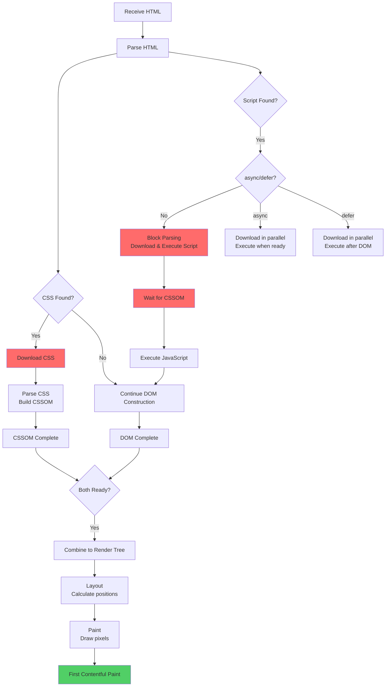

# Critical Rendering Path - Optimization Guide

## Table of Contents

1. [What is the Critical Rendering Path?](#what-is-the-critical-rendering-path)
2. [The Five Steps](#the-five-steps)
3. [Critical Rendering Path Flow](#critical-rendering-path-flow)
4. [Render-Blocking Resources](#render-blocking-resources)
5. [Optimization Strategies](#optimization-strategies)
6. [Before vs After Optimization](#before-vs-after-optimization)
7. [Quick Reference](#quick-reference)

---

## What is the Critical Rendering Path?

The **Critical Rendering Path (CRP)** is the sequence of steps the browser takes to convert HTML, CSS, and JavaScript into visible pixels on the screen.

### Why It Matters

- **Directly impacts** First Contentful Paint (FCP)
- **Determines** Largest Contentful Paint (LCP)
- **Affects** Time to Interactive (TTI)
- **Core to** perceived performance

### Goal

**Minimize the time** from receiving the HTML to rendering meaningful content by:
- Reducing critical resource count
- Minimizing critical bytes
- Shortening critical path length

---

## The Five Steps

### 1. Construct the DOM (Document Object Model)

Browser parses HTML and builds the DOM tree.

```html
<html>
  <body>
    <h1>Hello</h1>
    <p>World</p>
  </body>
</html>
```

**Blocking:** Incrementally rendered (not blocked)

---

### 2. Construct the CSSOM (CSS Object Model)

Browser parses CSS and builds the CSSOM tree.

```css
body { font-size: 16px; }
h1 { color: blue; }
```

**Blocking:** ⚠️ **Render-blocking** - Browser waits for ALL CSS before rendering

---

### 3. Execute JavaScript

JavaScript can modify both DOM and CSSOM.

```javascript
document.querySelector('h1').textContent = 'Modified';
```

**Blocking:** ⚠️ **Parser-blocking** - Halts HTML parsing until executed

---

### 4. Combine DOM + CSSOM → Render Tree

Browser combines DOM and CSSOM to create the Render Tree (only visible elements).

```
DOM + CSSOM = Render Tree
(excludes: display:none, <script>, <meta>, etc.)
```

**Blocking:** Requires both DOM and CSSOM to be ready

---

### 5. Layout + Paint

- **Layout:** Calculate position and size of elements
- **Paint:** Fill in pixels on the screen

**Blocking:** Cannot start until Render Tree is complete

---

## Critical Rendering Path Flow



### Legend
- 🔴 **Red boxes** = Blocking operations
- 🟢 **Green box** = Goal (FCP)

---

## Render-Blocking Resources

### What Makes a Resource Render-Blocking?

| Resource | Blocks DOM Parsing? | Blocks Rendering? | Solution |
|----------|---------------------|-------------------|----------|
| **HTML** | N/A | N/A | Progressive |
| **CSS** | No | ✅ **Yes** | Minimize, split, inline critical |
| **JavaScript** | ✅ **Yes** (default) | Yes | async/defer, load late |
| **Images** | No | No | Not render-blocking |
| **Fonts** | No | Delays text rendering | Preload, font-display |

### The Main Culprits

#### 1. External CSS
```html
<!-- BLOCKS rendering until downloaded -->
<link rel="stylesheet" href="/styles.css">
```

#### 2. Synchronous JavaScript
```html
<!-- BLOCKS parsing until executed -->
<script src="/app.js"></script>
```

#### 3. JavaScript That Depends on CSS
```html
<link rel="stylesheet" href="/styles.css">
<script src="/app.js"></script>
<!-- Script waits for CSS to finish loading -->
```

---

## Optimization Strategies

### 1. Minimize Critical Resources

**Reduce the number** of resources that block rendering.

#### CSS Optimization

```html
<!-- ❌ BAD: All CSS blocks rendering -->
<link rel="stylesheet" href="/styles.css">

<!-- ✅ GOOD: Only critical CSS blocks, rest loads async -->
<style>
  /* Inline critical above-the-fold CSS */
  .hero { display: flex; height: 100vh; }
</style>
<link rel="preload" href="/full-styles.css" as="style"
      onload="this.rel='stylesheet'">
```

#### JavaScript Optimization

```html
<!-- ❌ BAD: Blocks parsing -->
<script src="/app.js"></script>

<!-- ✅ GOOD: Non-blocking -->
<script src="/app.js" defer></script>
<script src="/analytics.js" async></script>
```

---

### 2. Minimize Critical Bytes

**Reduce the size** of critical resources.

```bash
# Before optimization
styles.css: 150 KB
app.js: 300 KB
Total: 450 KB

# After optimization
critical.css: 8 KB (inlined)
styles.css: 142 KB (deferred)
app.js: 180 KB (minified, tree-shaken)
Total critical: 8 KB ✅
```

**Techniques:**
- **Minification** - Remove whitespace, comments
- **Compression** - Gzip/Brotli
- **Tree shaking** - Remove unused code
- **Code splitting** - Load only what's needed

---

### 3. Shorten Critical Path Length

**Reduce roundtrips** needed to fetch critical resources.

#### Use HTTP/2
```
HTTP/1.1: Sequential requests
CSS → Font → Image (3 roundtrips)

HTTP/2: Parallel requests
CSS + Font + Image (1 roundtrip)
```

#### Inline Critical Resources
```html
<head>
  <!-- Eliminates 1 roundtrip -->
  <style>/* Critical CSS */</style>
</head>
```

#### Preconnect to Critical Origins
```html
<!-- Saves DNS + TCP + TLS time -->
<link rel="preconnect" href="https://cdn.example.com">
```

---

### 4. Optimize JavaScript Loading

#### Async vs Defer

```html
<!-- Normal: Blocks parsing, executes immediately -->
<script src="/app.js"></script>

<!-- Async: Downloads in parallel, executes ASAP (may block rendering) -->
<script src="/analytics.js" async></script>

<!-- Defer: Downloads in parallel, executes after DOM ready -->
<script src="/app.js" defer></script>
```

**Visualization:**

```
Normal Script:
HTML parsing → [BLOCKED] → Script download → Script execute → Continue parsing

Async Script:
HTML parsing ────────────────────> Complete
     ↓ (parallel)
Script download → Execute (interrupts parsing if ready)

Defer Script:
HTML parsing ────────────────────> Complete → Execute all deferred
     ↓ (parallel)
Script download
```

**Best Practice:**
- Use `defer` for scripts that need the full DOM
- Use `async` for independent scripts (analytics, ads)
- Place scripts at end of `<body>` if not using async/defer

---

### 5. Optimize CSS Delivery

#### Critical CSS Pattern

```html
<head>
  <!-- Step 1: Inline critical CSS -->
  <style>
    /* Only above-the-fold styles */
    .hero { display: flex; }
    .nav { position: fixed; }
  </style>

  <!-- Step 2: Async load full CSS -->
  <link rel="preload" href="/styles.css" as="style"
        onload="this.rel='stylesheet'">
  <noscript>
    <link rel="stylesheet" href="/styles.css">
  </noscript>
</head>
```

#### Media Queries

```html
<!-- Only blocks rendering on print -->
<link rel="stylesheet" href="/print.css" media="print">

<!-- Only blocks on mobile -->
<link rel="stylesheet" href="/mobile.css"
      media="(max-width: 640px)">
```

---

### 6. Optimize Font Loading

Fonts can delay text rendering (FOIT - Flash of Invisible Text).

```html
<head>
  <!-- Preconnect to font provider -->
  <link rel="preconnect" href="https://fonts.gstatic.com" crossorigin>

  <!-- Preload critical font -->
  <link rel="preload"
        href="/fonts/Inter-Regular.woff2"
        as="font"
        type="font/woff2"
        crossorigin>
</head>

<style>
  @font-face {
    font-family: 'Inter';
    src: url('/fonts/Inter-Regular.woff2') format('woff2');
    /* Show fallback font immediately, swap when loaded */
    font-display: swap;
  }
</style>
```

---

### 7. Resource Hints

Use browser hints to parallelize critical resource loading.

```html
<head>
  <!-- Establish early connections -->
  <link rel="preconnect" href="https://cdn.example.com">
  <link rel="dns-prefetch" href="//analytics.google.com">

  <!-- Preload critical resources -->
  <link rel="preload" href="/hero.jpg" as="image">
  <link rel="preload" href="/critical.css" as="style">
  <link rel="preload" href="/app.js" as="script">
</head>
```

---

## Before vs After Optimization

### Before Optimization

```mermaid
gantt
    title Critical Rendering Path - Before Optimization
    dateFormat X
    axisFormat %L ms

    section HTML
    Parse HTML           :0, 200

    section CSS
    Download CSS         :200, 500
    Parse CSS            :500, 600

    section JavaScript
    Download JS          :600, 1000
    Execute JS           :1000, 1200

    section Render
    Build Render Tree    :1200, 1250
    Layout               :1250, 1300
    Paint                :1300, 1350
    First Paint          :milestone, 1350, 0
```



**Total Time to First Paint: 1,350ms**

---

### After Optimization

```mermaid
gantt
    title Critical Rendering Path - After Optimization
    dateFormat X
    axisFormat %L ms

    section HTML
    Parse HTML           :0, 200

    section CSS (Parallel)
    Critical CSS (Inline):0, 0
    Full CSS (Async)     :0, 400

    section JavaScript (Parallel)
    Download JS (defer)  :0, 300
    Execute JS           :300, 400

    section Render
    Build Render Tree    :200, 225
    Layout               :225, 250
    Paint                :250, 275
    First Paint          :milestone, 275, 0
```



**Total Time to First Paint: 275ms** (80% faster!)

---

## Quick Reference

### Critical Rendering Path Metrics

| Metric | What It Measures | Target |
|--------|------------------|--------|
| **Critical Resources** | Number of blocking resources | < 3 |
| **Critical Bytes** | Total size of blocking resources | < 14 KB |
| **Critical Path Length** | Number of roundtrips | < 2 |

### Optimization Checklist

- [ ] Inline critical CSS (< 14 KB)
- [ ] Defer non-critical CSS
- [ ] Add `defer` or `async` to scripts
- [ ] Minify CSS and JavaScript
- [ ] Enable compression (Gzip/Brotli)
- [ ] Preload critical resources
- [ ] Preconnect to critical origins
- [ ] Use `font-display: swap`
- [ ] Remove unused CSS/JS
- [ ] Implement code splitting

### Quick Wins by Impact

| Optimization | Effort | Impact | Time Saved |
|--------------|--------|--------|------------|
| **Add defer to scripts** | Low | High | 200-500ms |
| **Inline critical CSS** | Medium | High | 300-600ms |
| **Preload hero image** | Low | High | 200-400ms |
| **Minify resources** | Low | Medium | 100-200ms |
| **Enable compression** | Low | Medium | 50-150ms |

### One-Line Summary

> "Optimize the Critical Rendering Path by minimizing render-blocking resources, reducing their size, and shortening the path length through inlining, deferring, and preloading."

---

*Last Updated: December 2025*
