# React Internals: JSX, Reconciliation & Virtual DOM

A deep dive into how React works under the hood, with visual diagrams and practical examples.

---

## Table of Contents

1. [JSX → React.createElement](#1-jsx--reactcreateelement)
   - JSX Transformation Example
   - React.createElement Signature
   - Complex Example
   - What React.createElement Returns
   - JSX Compilation Flow

2. [Virtual DOM vs Real DOM](#2-virtual-dom-vs-real-dom)
   - Real DOM vs Virtual DOM Comparison
   - Virtual DOM Structure
   - Example: Virtual DOM Object

3. [Diffing Algorithm](#3-diffing-algorithm)
   - Diffing Heuristics
   - Type Change Example
   - Same Type Diffing

4. [Keys and List Reconciliation](#4-keys-and-list-reconciliation)
   - Without Keys (Bad)
   - With Keys (Good)
   - Key Rules

5. [Reconciliation Process](#5-reconciliation-process)
   - High-Level Reconciliation Flow
   - Step-by-Step Example
   - Reconciliation Phases

6. [Fiber Architecture](#6-fiber-architecture)
   - What is a Fiber?
   - Fiber Tree Structure
   - Work Loop
   - Why Fiber?

7. [Putting It All Together](#7-putting-it-all-together)
   - Complete React Update Cycle
   - Real-World Example

8. [Performance Implications](#8-performance-implications)
   - Best Practices

9. [Summary](#summary)

---

## 1. JSX → React.createElement

JSX is syntactic sugar that gets transformed into `React.createElement` calls during the build process.

### JSX Transformation Example

```jsx
// What you write:
const element = <div className="container">Hello World</div>;

// What it becomes:
const element = React.createElement(
  'div',
  { className: 'container' },
  'Hello World'
);
```

### React.createElement Signature

```javascript
React.createElement(type, props, ...children)
```

- **type**: String (HTML tag) or Component (function/class)
- **props**: Object with properties (null if none)
- **children**: Child elements or text

### Complex Example

```jsx
// JSX:
<div className="card">
  <h1>Title</h1>
  <p>Description</p>
  <Button onClick={handleClick}>Click me</Button>
</div>

// Transformed to:
React.createElement(
  'div',
  { className: 'card' },
  React.createElement('h1', null, 'Title'),
  React.createElement('p', null, 'Description'),
  React.createElement(
    Button,
    { onClick: handleClick },
    'Click me'
  )
);
```

### What React.createElement Returns

It returns a **React Element** - a plain JavaScript object:

```javascript
{
  type: 'div',
  props: {
    className: 'card',
    children: [
      { type: 'h1', props: { children: 'Title' } },
      { type: 'p', props: { children: 'Description' } },
      { type: Button, props: { onClick: fn, children: 'Click me' } }
    ]
  },
  key: null,
  ref: null,
  $$typeof: Symbol.for('react.element')
}
```

### JSX Compilation Flow

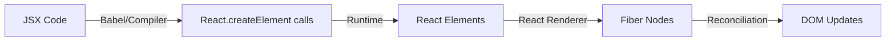

---

## 2. Virtual DOM vs Real DOM

The Virtual DOM is React's lightweight representation of the actual DOM.

### Real DOM vs Virtual DOM

| Aspect | Real DOM | Virtual DOM |
|--------|----------|-------------|
| **Nature** | Browser's actual DOM tree | JavaScript object representation |
| **Updates** | Expensive (triggers reflow/repaint) | Cheap (just object manipulation) |
| **Speed** | Slow for frequent updates | Fast diffing and batching |
| **Memory** | Heavy | Lightweight |

### Virtual DOM Structure

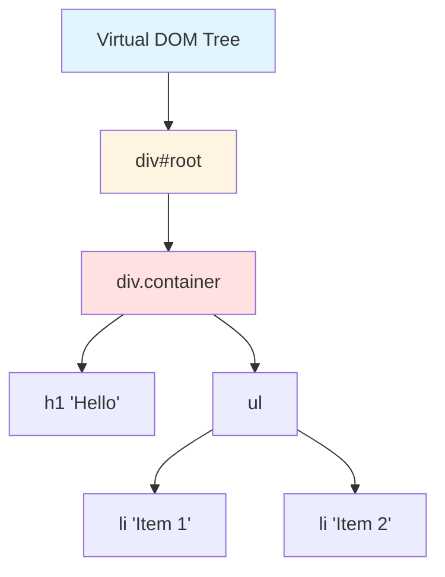

### Example: Virtual DOM Object

```javascript
// Virtual DOM representation
{
  type: 'div',
  props: {
    className: 'container',
    children: [
      {
        type: 'h1',
        props: { children: 'Hello' }
      },
      {
        type: 'ul',
        props: {
          children: [
            { type: 'li', props: { children: 'Item 1' } },
            { type: 'li', props: { children: 'Item 2' } }
          ]
        }
      }
    ]
  }
}
```

---

## 3. Diffing Algorithm

React uses a heuristic O(n) algorithm instead of the traditional O(n³) tree diffing.

### Diffing Heuristics

React makes two assumptions:

1. **Different types produce different trees** - If element type changes, rebuild from scratch
2. **Keys identify which children have changed** - Use keys to match elements across renders

### Type Change Example

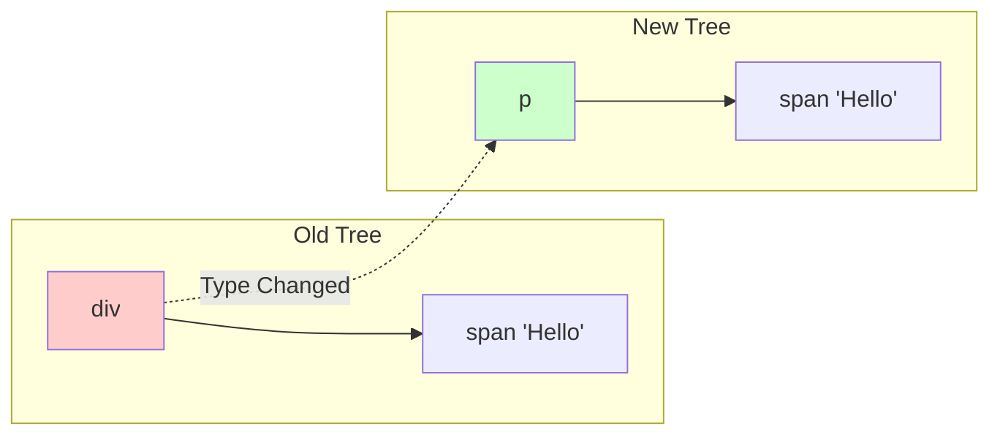

**Result**: Entire subtree is destroyed and rebuilt because `div` → `p`

```jsx
// Before:
<div><span>Hello</span></div>

// After:
<p><span>Hello</span></p>

// React destroys div and span, creates new p and span
```

### Same Type Diffing

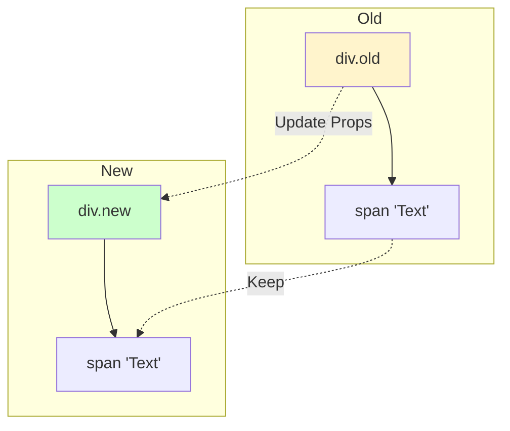

**Result**: Keep the DOM node, update only changed attributes

```jsx
// Before:
<div className="old" style={{color: 'red'}}>Text</div>

// After:
<div className="new" style={{color: 'blue'}}>Text</div>

// React only updates className and style, keeps the DOM node
```

---

## 4. Keys and List Reconciliation

Keys help React identify which items have changed, been added, or removed.

### Without Keys (Bad)

```jsx
// Initial render:
<ul>
  <li>Alice</li>
  <li>Bob</li>
</ul>

// After adding Charlie at the beginning:
<ul>
  <li>Charlie</li>
  <li>Alice</li>
  <li>Bob</li>
</ul>
```

**What React does**: Updates all three `<li>` elements (inefficient!)

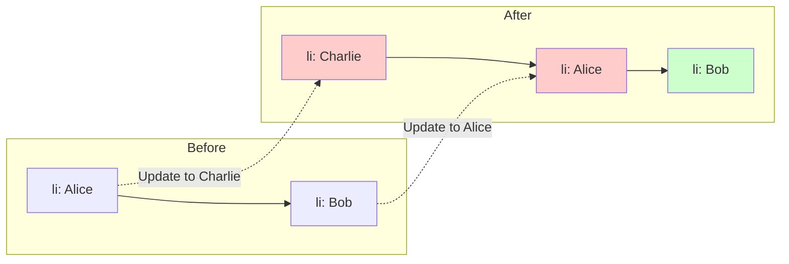

### With Keys (Good)

```jsx
// Initial render:
<ul>
  <li key="alice">Alice</li>
  <li key="bob">Bob</li>
</ul>

// After adding Charlie:
<ul>
  <li key="charlie">Charlie</li>
  <li key="alice">Alice</li>
  <li key="bob">Bob</li>
</ul>
```

**What React does**: Recognizes Alice and Bob unchanged, only inserts Charlie

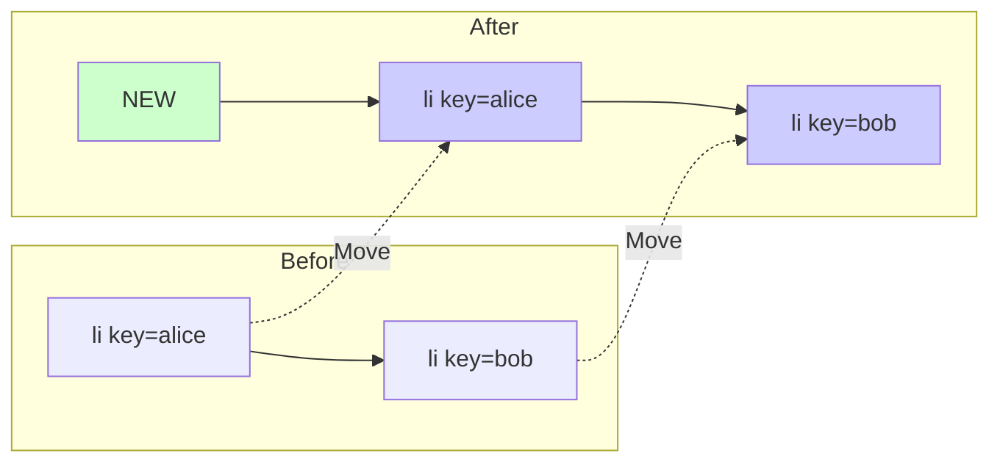

### Key Rules

```jsx
// ✅ Good: Stable, unique keys
items.map(item => <div key={item.id}>{item.name}</div>)

// ❌ Bad: Index as key (unstable when reordering)
items.map((item, index) => <div key={index}>{item.name}</div>)

// ❌ Bad: Random keys (creates new elements every render)
items.map(item => <div key={Math.random()}>{item.name}</div>)
```

---

## 5. Reconciliation Process

Reconciliation is the algorithm React uses to diff one tree with another to determine what needs to change.

### High-Level Reconciliation Flow

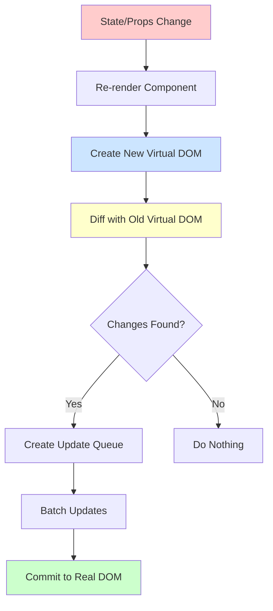

### Step-by-Step Example

```jsx
function Counter() {
  const [count, setCount] = useState(0);

  return (
    <div>
      <p>Count: {count}</p>
      <button onClick={() => setCount(count + 1)}>+</button>
    </div>
  );
}
```

**Step 1: Initial Render**

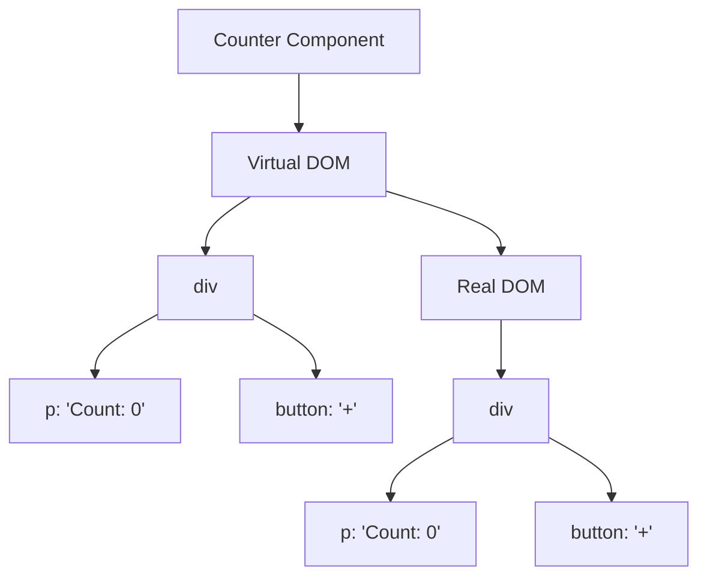

**Step 2: State Update (count = 1)**

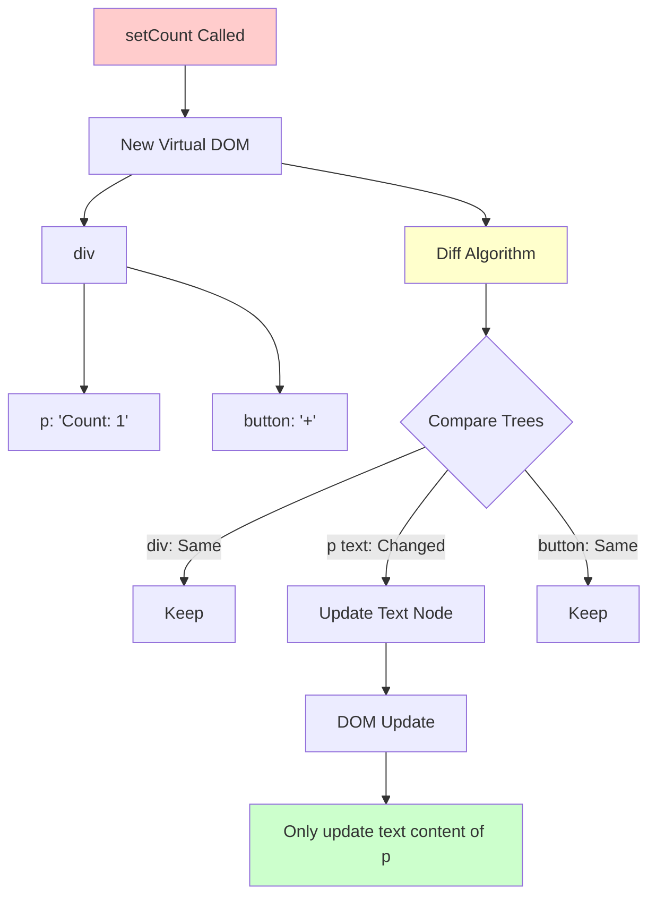

### Reconciliation Phases

React 16+ uses **Fiber architecture** with two phases:

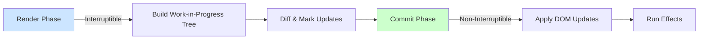

---

## 6. Fiber Architecture

Fiber is React's reconciliation engine since version 16. It's a reimplementation of the core algorithm.

### What is a Fiber?

A Fiber is a JavaScript object representing a unit of work. Each React element has a corresponding Fiber node.

```javascript
// Simplified Fiber node structure
{
  type: 'div',              // Component type
  key: null,                // Key from props
  props: { children: [...] }, // Props
  stateNode: DOMNode,       // Actual DOM node
  return: parentFiber,      // Parent fiber
  child: firstChildFiber,   // First child
  sibling: nextSiblingFiber, // Next sibling
  alternate: oldFiber,      // Previous version
  effectTag: 'UPDATE',      // What needs to be done
  nextEffect: nextFiber     // Linked list of effects
}
```

### Fiber Tree Structure

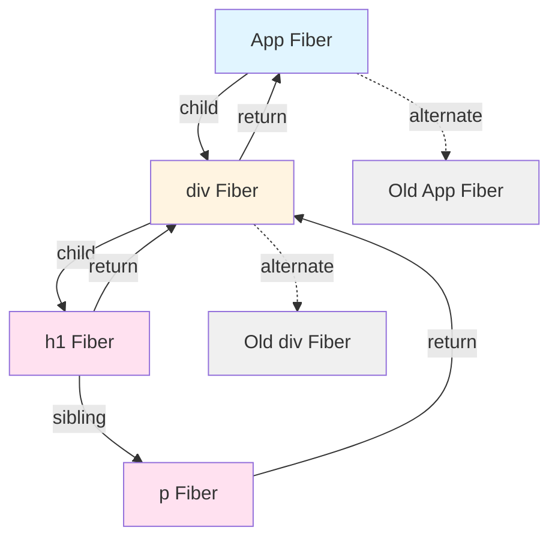

### Work Loop

Fiber enables **time-slicing**: breaking work into chunks and spreading it across multiple frames.

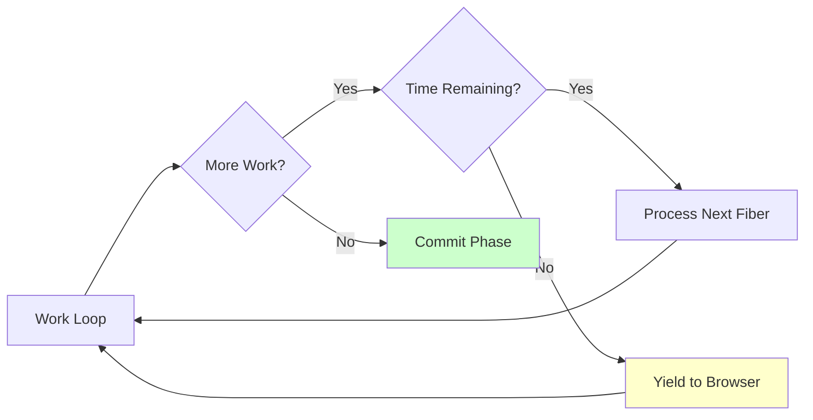

```javascript
// Simplified work loop concept
function workLoop(deadline) {
  let shouldYield = false;

  while (nextUnitOfWork && !shouldYield) {
    nextUnitOfWork = performUnitOfWork(nextUnitOfWork);
    shouldYield = deadline.timeRemaining() < 1;
  }

  if (nextUnitOfWork) {
    // More work to do, schedule next frame
    requestIdleCallback(workLoop);
  } else {
    // All work done, commit to DOM
    commitRoot();
  }
}
```

### Why Fiber?

**Before Fiber (Stack Reconciler)**:
- Synchronous, recursive
- Once started, couldn't pause
- Long updates blocked the browser

**With Fiber**:
- Asynchronous, can pause/resume
- Prioritize urgent updates (user input)
- Better perceived performance

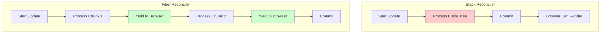

---

## 7. Putting It All Together

### Complete React Update Cycle

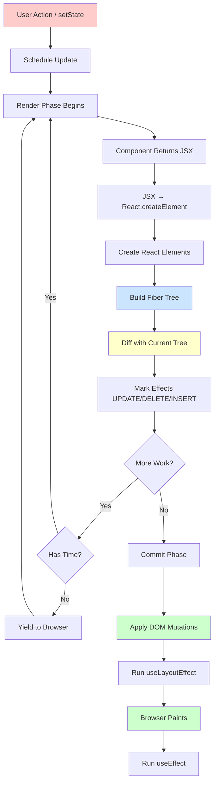

### Real-World Example

```jsx
function TodoApp() {
  const [todos, setTodos] = useState([
    { id: 1, text: 'Learn React' },
    { id: 2, text: 'Build App' }
  ]);

  const addTodo = () => {
    setTodos([...todos, { id: 3, text: 'Deploy' }]);
  };

  return (
    <div>
      <ul>
        {todos.map(todo => (
          <li key={todo.id}>{todo.text}</li>
        ))}
      </ul>
      <button onClick={addTodo}>Add</button>
    </div>
  );
}
```

**When `addTodo` is clicked:**

1. **setState** triggers update
2. **JSX** transformed to `React.createElement` calls
3. **Virtual DOM** new tree created with 3 todos
4. **Diffing** compares old (2 todos) vs new (3 todos)
5. **Keys** identify that todos 1 & 2 unchanged
6. **Fiber** marks effect: INSERT new `<li>` with id=3
7. **Commit** inserts single DOM node
8. **Result** efficient update, only one DOM insertion

---

## 8. Performance Implications

### Best Practices

**1. Use Keys for Lists**
```jsx
// ✅ Efficient reconciliation
<ul>
  {items.map(item => <li key={item.id}>{item.name}</li>)}
</ul>
```

**2. Avoid Inline Functions/Objects in JSX**
```jsx
// ❌ Creates new function every render
<button onClick={() => handleClick(id)}>Click</button>

// ✅ Memoized callback
const handleClickMemoized = useCallback(() => handleClick(id), [id]);
<button onClick={handleClickMemoized}>Click</button>
```

**3. Prevent Unnecessary Re-renders**
```jsx
// ✅ Memoize expensive components
const MemoizedChild = React.memo(Child);

// ✅ Use React.memo with custom comparison
const MemoizedItem = React.memo(Item, (prev, next) => {
  return prev.id === next.id && prev.text === next.text;
});
```

**4. Keep Component Type Stable**
```jsx
// ❌ Creates new component type every render
function Parent() {
  const Child = () => <div>Child</div>;
  return <Child />;
}

// ✅ Stable component reference
const Child = () => <div>Child</div>;
function Parent() {
  return <Child />;
}
```

---

## Summary

- **JSX** is syntactic sugar for `React.createElement` calls
- **React Elements** are plain JavaScript objects describing UI
- **Virtual DOM** is a lightweight representation enabling efficient updates
- **Diffing** uses heuristics (type comparison, keys) for O(n) performance
- **Fiber** enables interruptible rendering and better performance
- **Keys** are critical for efficient list reconciliation
- **Reconciliation** compares trees and produces minimal DOM updates

Understanding these internals helps you write more performant React applications and debug issues more effectively.
