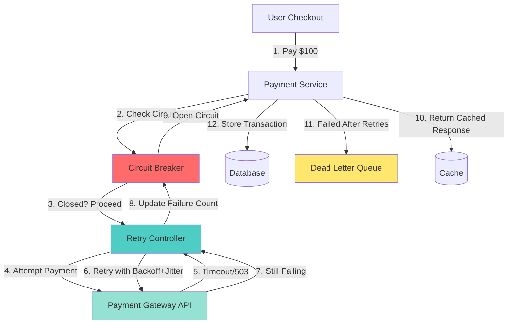
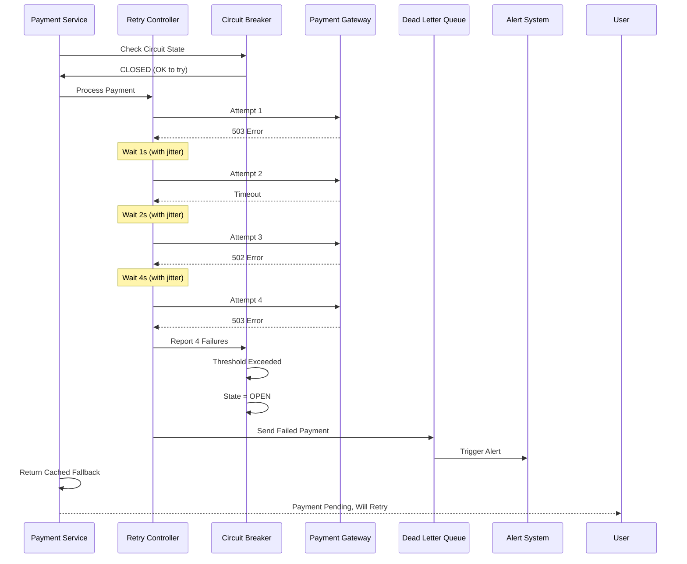

# Retry, Backoff, Jitter & Resilience Patterns

## 📚 Core Concepts

### 1️⃣ Retry

**What is it?**
When a request fails due to transient issues (network hiccup, temporary server overload, timeout), the client automatically resends the request.

**Why use it?**
Many failures in distributed systems are temporary. A simple retry often succeeds where the first attempt failed.

**⚠️ Pitfalls:**
- **Retry Storms**: If every client blindly retries, you amplify load on an already struggling system
- **Duplicate Operations**: Retrying non-idempotent operations (like payment processing) can cause unintended side effects
- **Resource Exhaustion**: Aggressive retries can exhaust connection pools, thread pools, or API quotas

**✅ Best Practices:**
- Limit retry attempts (typically 3-5 max)
- Only retry safe errors (timeouts, 503, 502, connection resets)
- Never retry on client errors (4xx) except 408, 429
- Use **idempotency keys** for state-changing operations
- Implement retry budgets to prevent cascading failures

---

### 2️⃣ Backoff

**What is it?**
Instead of retrying immediately, introduce an increasing delay between retry attempts.

**Types:**

**Fixed Backoff**
```
Delay: 2s → 2s → 2s
```
Simple but doesn't adapt to system load.

**Linear Backoff**
```
Delay: 1s → 2s → 3s → 4s
```
Gradual increase, predictable scaling.

**Exponential Backoff** ⭐ Most Common
```
Delay: 1s → 2s → 4s → 8s → 16s
```
Rapidly backs off, giving systems time to recover.

**Why use it?**
Prevents overwhelming a struggling system and gives it breathing room to recover. Immediate retries can make problems worse.

**Formula:**
```
delay = base_delay * (2 ^ attempt_number)
```

**Use Cases:**
- API rate limiting (429 responses)
- Database connection failures
- Message queue processing
- External service timeouts

---

### 3️⃣ Jitter

**What is it?**
Adding randomness to backoff delays to prevent synchronized retry patterns.

**Why use it?**
Without jitter, thousands of clients retry at exactly the same time (4s, 8s, 16s), creating a **thundering herd problem** that overwhelms the recovering system.

**Types:**

**Full Jitter**
```
delay = random(0, exponential_backoff)
Example: random(0, 8s) → could be 2.3s, 5.7s, 7.1s
```

**Equal Jitter** (Recommended)
```
delay = (exponential_backoff / 2) + random(0, exponential_backoff / 2)
Example: (8s / 2) + random(0, 4s) → between 4s and 8s
```

**Decorrelated Jitter**
```
delay = min(cap, random(base, previous_delay * 3))
More aggressive randomization for high-load scenarios
```

**Impact:**
- Without jitter: 10,000 clients retry at exactly 8s → 10,000 simultaneous requests
- With jitter: 10,000 clients retry spread across 4s-8s → ~1,250 requests per second

---

### 4️⃣ Circuit Breaker

**What is it?**
A state machine that prevents requests to a failing service, allowing it to recover without being bombarded.

**States:**

**Closed (Normal)**
- All requests pass through
- Tracks failure rate

**Open (Service Down)**
- Immediately fails requests without trying
- Returns fallback response or cached data
- Prevents cascading failures

**Half-Open (Testing)**
- Allows limited requests to test recovery
- If successful → Close circuit
- If failed → Open circuit again

**Configuration Example:**
```
Failure threshold: 50% errors in last 10 requests
Timeout: 30 seconds (before trying Half-Open)
Success threshold: 3 consecutive successes to close
```

**Why use it?**
Protects your system from wasting resources on a service that's clearly down, and protects the failing service from retry storms.

---

### 5️⃣ Rate Limiting & Throttling

**Rate Limiting**
Restricts the number of requests a client can make in a time window.
```
Examples:
- 100 requests per minute per API key
- 10 login attempts per hour per IP
- 1000 writes per second per database
```

**Throttling**
Dynamically slows down requests when system is under load.
```
- 429 Too Many Requests → retry after X seconds
- Adaptive: reduce throughput based on CPU/memory
```

**Algorithms:**
- **Token Bucket**: Refills tokens at fixed rate
- **Leaky Bucket**: Processes requests at constant rate
- **Sliding Window**: Counts requests in rolling time window
- **Fixed Window**: Resets counter at fixed intervals

---

### 6️⃣ Dead Letter Queue (DLQ)

**What is it?**
A separate queue where messages go after all retry attempts fail.

**Why use it?**
Prevents poison messages from blocking queue processing while preserving them for debugging and manual intervention.

**Flow:**
```
1. Message processing fails
2. Retry with backoff (3 times)
3. Still failing → Move to DLQ
4. Alert engineers
5. Manual inspection and reprocessing
```

**Best Practices:**
- Monitor DLQ depth
- Set up alerts for DLQ messages
- Implement DLQ replay mechanisms
- Analyze patterns in failed messages

---

## 🎯 Real-World Example: Payment Processing System

### Scenario
A **Payment Service** needs to process a transaction by calling an external **Payment Gateway API** (Stripe, PayPal, etc.)

### Architecture



### Step-by-Step Flow

#### **Step 1: Initial Request**
```
User initiates $100 payment
Payment Service generates idempotency key: "payment_abc123"
```

#### **Step 2: Circuit Breaker Check**
```
Circuit Breaker State: CLOSED (service is healthy)
✅ Allow request to proceed
```

#### **Step 3: First Attempt**
```
POST /charge
Headers: {
  Idempotency-Key: payment_abc123,
  Amount: 10000 (cents)
}

Response: 503 Service Unavailable (Gateway overloaded)
```

#### **Step 4: Retry Logic Kicks In**

**Attempt 1:**
```
Base delay: 1 second
Exponential: 2^0 = 1s
Jitter: random(0.5s, 1.5s) = 0.8s
Wait: 0.8s
Result: Timeout ❌
```

**Attempt 2:**
```
Exponential: 2^1 = 2s
Jitter: random(1s, 3s) = 2.3s
Wait: 2.3s
Result: 502 Bad Gateway ❌
```

**Attempt 3:**
```
Exponential: 2^2 = 4s
Jitter: random(2s, 6s) = 4.7s
Wait: 4.7s
Result: 200 OK ✅
Idempotency key prevents duplicate charge
```

#### **Step 5: Success Response**
```
Payment processed successfully
Circuit breaker records success
User receives confirmation
```

---

### What If All Retries Failed?



#### **Outcome:**
- Circuit breaker opens after failure threshold
- Failed payment goes to DLQ
- User gets friendly error: "Payment processing delayed, you won't be charged twice"
- Engineers notified to investigate
- Next requests fail fast (circuit open) instead of waiting for timeouts

---

## 📊 Configuration Examples

### Retry Policy
```python
retry_config = {
    "max_attempts": 4,
    "base_delay": 1.0,  # seconds
    "max_delay": 30.0,
    "exponential_base": 2,
    "jitter": "equal",
    "retryable_errors": [
        "TimeoutError",
        "ConnectionError",
        "503",
        "502",
        "429"
    ],
    "idempotency_required": True
}
```

### Circuit Breaker Config
```yaml
circuit_breaker:
  failure_threshold: 5        # failures to open
  failure_rate: 50            # % failures in window
  window_size: 10             # requests to track
  timeout: 30                 # seconds before half-open
  half_open_requests: 3       # test requests
  success_threshold: 2        # successes to close
```

---

## 🎤 Interview Talking Points

When discussing resilience patterns in **system design interviews**, demonstrate depth by covering:

### 1. **Why Retries Alone Are Dangerous**
> "Retries without backoff can create a retry storm where thousands of clients hammer a recovering service, making the problem worse. This is called the thundering herd problem."

### 2. **Retry + Backoff + Jitter = Best Practice**
> "I'd implement exponential backoff with equal jitter. This spreads retries over time and prevents synchronized stampedes. For example, with jitter, 10,000 clients retrying at 8s becomes a smooth distribution between 4-8 seconds."

### 3. **Circuit Breakers for Cascading Failure Prevention**
> "If the payment gateway is down, a circuit breaker prevents our service from wasting threads waiting for timeouts. It fails fast and returns cached responses, protecting both our system and theirs."

### 4. **Idempotency is Critical**
> "For payment processing, I'd use idempotency keys so retries don't double-charge customers. The same key ensures the gateway processes the request exactly once, even if we retry."

### 5. **Observability Matters**
> "I'd emit metrics for retry counts, circuit breaker state changes, and DLQ depth. Alerts on high retry rates or circuit breaker trips help us detect issues before they cascade."

### 6. **Dead Letter Queues for Async Systems**
> "For async payment processing with Kafka or SQS, failed messages after all retries go to a DLQ. This preserves data for debugging while preventing poison messages from blocking the queue."

---

## ⚡ Quick Formula for Interviews

```
Retry                          = Good (fixes transient issues)
Retry + Backoff                = Better (prevents overwhelming system)
Retry + Backoff + Jitter       = Best (prevents thundering herd)
+ Circuit Breaker              = Production-ready (prevents cascading failures)
+ Idempotency + DLQ + Metrics  = Enterprise-grade (robust & observable)
```

---

## 🔍 Common Interview Questions

**Q: When should you NOT retry?**
A: Don't retry on 4xx errors (except 408, 429), authentication failures, or validation errors. These are client errors that won't resolve with retries.

**Q: How do you prevent duplicate payments?**
A: Use idempotency keys. Generate a unique key per payment request and send it with every retry. The payment gateway deduplicates using this key.

**Q: What's the difference between circuit breaker and retry?**
A: Retries handle individual request failures. Circuit breakers handle systemic failures by stopping all requests when a service is clearly down, preventing resource exhaustion.

**Q: How would you handle a third-party API with rate limiting?**
A: Implement token bucket rate limiting on our side, respect 429 Retry-After headers, use exponential backoff with jitter for 429 responses, and consider request queuing with priority.

---

## 🛠️ Implementation Considerations

### Choose Your Strategy Based On:

**Low-Latency Requirements (< 100ms)**
- Fewer retries (2-3 max)
- Shorter backoff (100ms, 200ms, 400ms)
- Aggressive circuit breaker (fail fast)

**High-Reliability Requirements (payments, orders)**
- More retries (4-5)
- Longer backoff (1s, 2s, 4s, 8s)
- Conservative circuit breaker
- DLQ for all failures

**Real-Time Systems (streaming, gaming)**
- Minimal retries (1-2)
- Fallback to cached data immediately
- Fast circuit breaker trip

**Batch Processing**
- More aggressive retries (5-10)
- Exponential backoff with cap
- DLQ for permanent failures

---

## 📈 Monitoring & Alerts

**Key Metrics:**
- Retry rate per service
- Average retry attempts per request
- Circuit breaker state (open/closed/half-open)
- DLQ depth and age of messages
- Request latency (including retry delays)
- Success rate after retries

**Critical Alerts:**
- Circuit breaker opened
- Retry rate > 20%
- DLQ depth > threshold
- Retry storm detected (many simultaneous retries)

---

## 🎯 Summary

| Pattern | Purpose | When to Use |
|---------|---------|-------------|
| **Retry** | Handle transient failures | Network glitches, temporary overload |
| **Backoff** | Space out retries | Prevent overwhelming recovering systems |
| **Jitter** | Randomize retry timing | Prevent thundering herd with many clients |
| **Circuit Breaker** | Stop requests to failing service | Systemic failures, cascading prevention |
| **Rate Limiting** | Control request volume | Protect APIs, prevent abuse |
| **DLQ** | Preserve failed messages | Async systems, debugging, reprocessing |

**Golden Rule**: Always combine retry + exponential backoff + jitter for distributed systems. Add circuit breakers for critical dependencies. Implement idempotency for state-changing operations.
