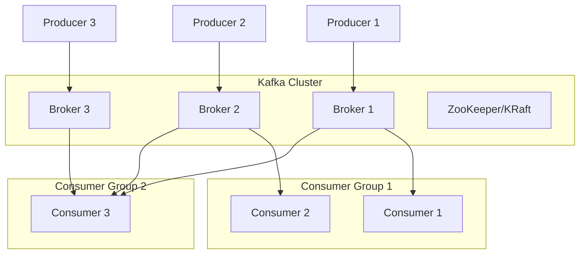
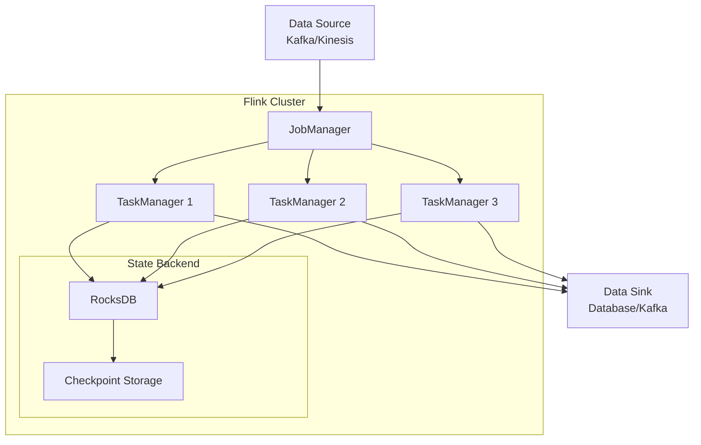
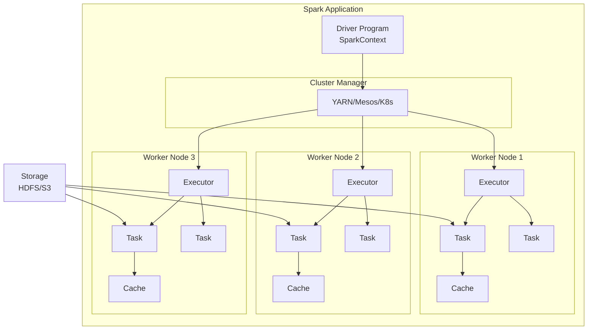
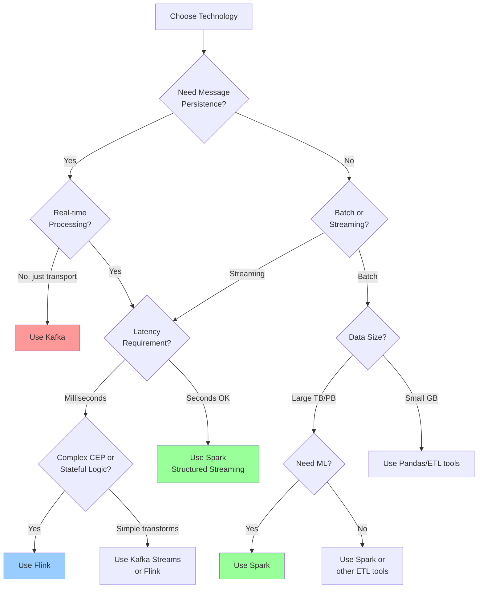
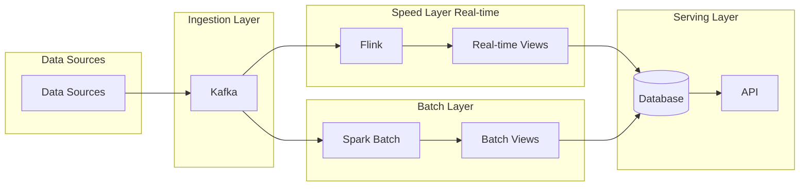
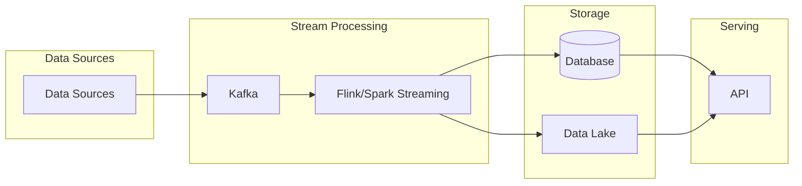
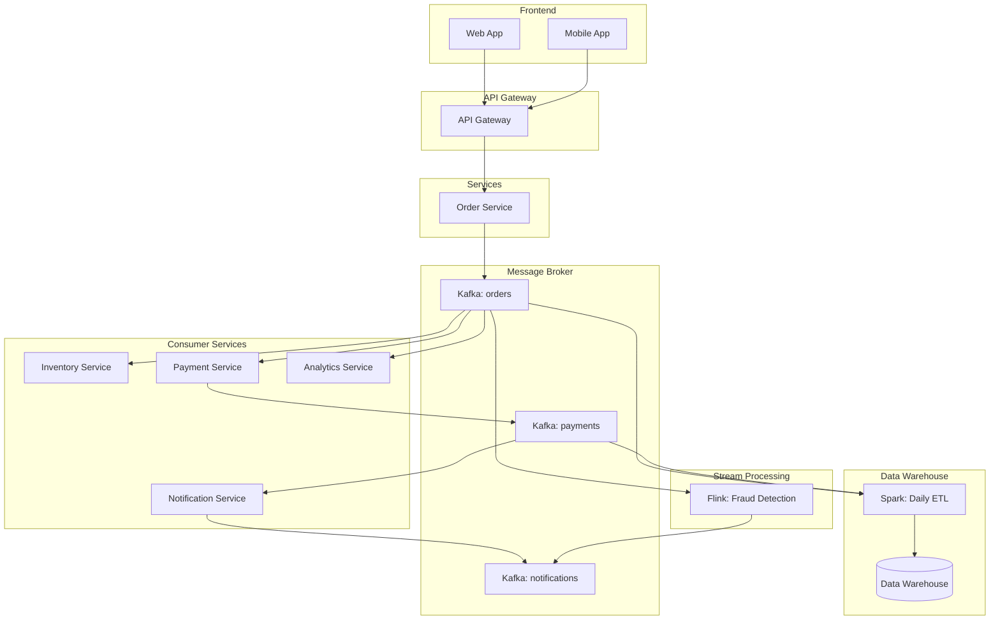
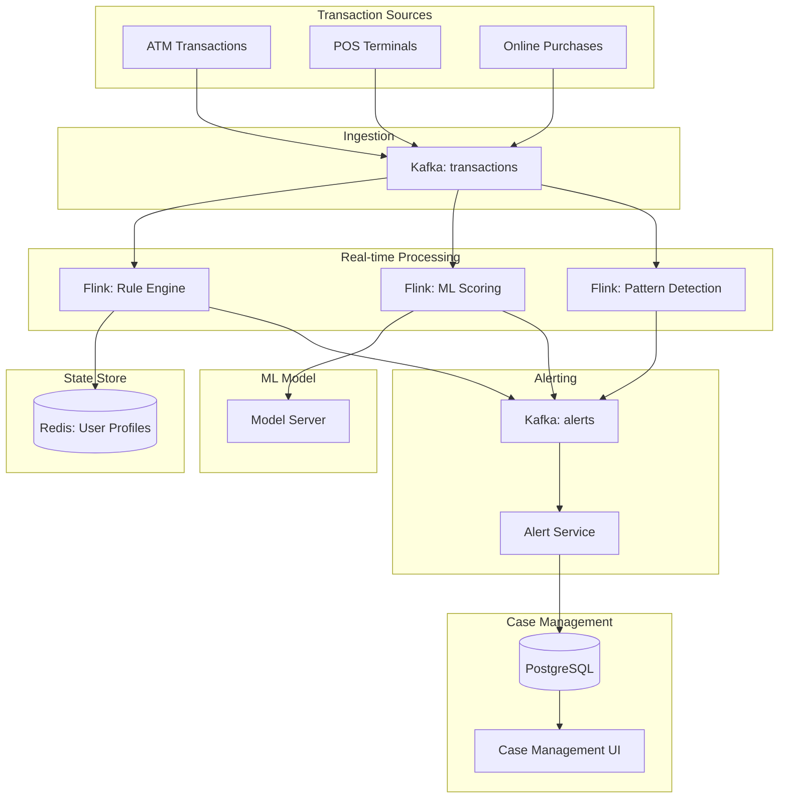
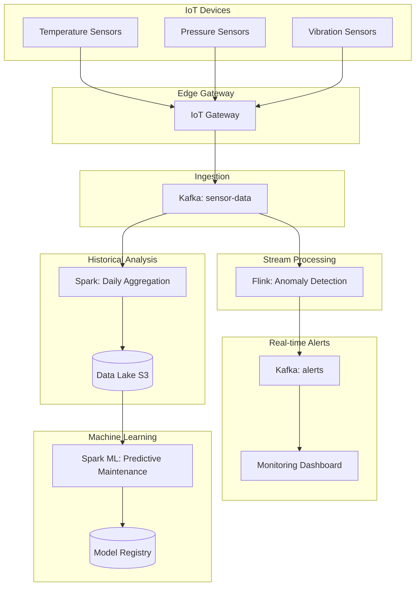
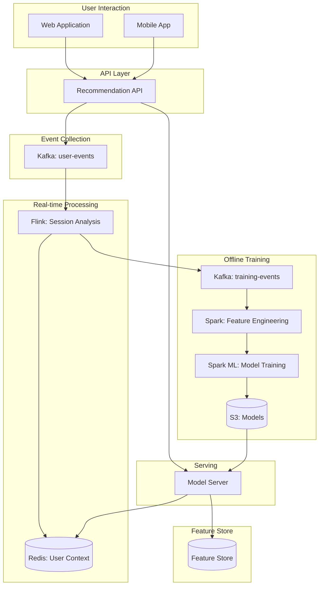

# Stream Processing & Message Queue Systems: System Design Guide

A comprehensive guide to Apache Kafka, Apache Flink, and Apache Spark from a High-Level Design perspective.

---

## Table of Contents

1. [Apache Kafka](#apache-kafka)
2. [Apache Flink](#apache-flink)
3. [Apache Spark](#apache-spark)
4. [Comparison & When to Use What](#comparison)
5. [Real-World Design Patterns](#design-patterns)

---

## Apache Kafka {#apache-kafka}

### What is Kafka?

Apache Kafka is a **distributed event streaming platform** and **message broker** that acts as a high-throughput, fault-tolerant publish-subscribe messaging system. Think of it as a distributed commit log that stores streams of records in a fault-tolerant, durable way.

### Core Concepts

- **Topics**: Categories/feeds where records are published (like database tables)
- **Producers**: Applications that publish data to topics
- **Consumers**: Applications that subscribe to topics and process data
- **Partitions**: Topics split into partitions for parallelism and scalability
- **Brokers**: Kafka servers that store data
- **Consumer Groups**: Multiple consumers working together to process data in parallel
- **Offsets**: Sequential IDs for messages, enabling replay and tracking

### Architecture Diagram



### Problems Kafka Solves

1. **System Decoupling**: Services don't need direct connections to each other
2. **Buffering & Speed Mismatch**: Handles different processing speeds between producers and consumers
3. **Message Replay**: Can replay messages from any point in time (data retention)
4. **Scalability**: Handles millions of messages per second horizontally
5. **Durability**: Messages persisted to disk, survive system failures
6. **Fault Tolerance**: Replicates data across multiple brokers
7. **Real-time Data Pipeline**: Moves data between systems with minimal latency

### When to Use Kafka

✅ **Use Kafka When:**
- Building event-driven architectures
- Need to decouple microservices
- Require message replay capability
- Building real-time data pipelines
- Collecting logs/metrics from multiple sources
- Implementing event sourcing patterns
- Need high throughput (millions of msg/sec)

❌ **Don't Use Kafka When:**
- Simple request-response communication is sufficient
- No need for message persistence
- Low message volume (hundreds per second)
- Need complex routing logic (use RabbitMQ)

### Spring Boot Kafka Producer Example

```java
@Service
public class OrderEventProducer {

    @Autowired
    private KafkaTemplate<String, OrderEvent> kafkaTemplate;

    private static final String TOPIC = "order-events";

    public void publishOrderCreated(Order order) {
        OrderEvent event = OrderEvent.builder()
            .orderId(order.getId())
            .customerId(order.getCustomerId())
            .timestamp(Instant.now())
            .eventType("ORDER_CREATED")
            .build();

        // Send with key for partition routing
        kafkaTemplate.send(TOPIC, order.getCustomerId().toString(), event)
            .whenComplete((result, ex) -> {
                if (ex == null) {
                    log.info("Order event sent: {}", event.getOrderId());
                } else {
                    log.error("Failed to send order event", ex);
                }
            });
    }
}

@Configuration
public class KafkaProducerConfig {

    @Value("${kafka.bootstrap-servers}")
    private String bootstrapServers;

    @Bean
    public ProducerFactory<String, OrderEvent> producerFactory() {
        Map<String, Object> config = new HashMap<>();
        config.put(ProducerConfig.BOOTSTRAP_SERVERS_CONFIG, bootstrapServers);
        config.put(ProducerConfig.KEY_SERIALIZER_CLASS_CONFIG, StringSerializer.class);
        config.put(ProducerConfig.VALUE_SERIALIZER_CLASS_CONFIG, JsonSerializer.class);
        config.put(ProducerConfig.ACKS_CONFIG, "all"); // Wait for all replicas
        config.put(ProducerConfig.RETRIES_CONFIG, 3);
        config.put(ProducerConfig.ENABLE_IDEMPOTENCE_CONFIG, true);
        return new DefaultKafkaProducerFactory<>(config);
    }

    @Bean
    public KafkaTemplate<String, OrderEvent> kafkaTemplate() {
        return new KafkaTemplate<>(producerFactory());
    }
}
```

### Spring Boot Kafka Consumer Example

```java
@Service
@Slf4j
public class OrderEventConsumer {

    @Autowired
    private InventoryService inventoryService;

    @Autowired
    private NotificationService notificationService;

    @KafkaListener(
        topics = "order-events",
        groupId = "inventory-service-group",
        concurrency = "3" // 3 concurrent consumers
    )
    public void consumeOrderEvent(
        @Payload OrderEvent event,
        @Header(KafkaHeaders.RECEIVED_PARTITION) int partition,
        @Header(KafkaHeaders.OFFSET) long offset
    ) {
        log.info("Received event: {} from partition: {} offset: {}",
            event.getOrderId(), partition, offset);

        try {
            // Process the event
            if ("ORDER_CREATED".equals(event.getEventType())) {
                inventoryService.reserveItems(event.getOrderId());
                notificationService.sendOrderConfirmation(event.getCustomerId());
            }
        } catch (Exception e) {
            log.error("Error processing order event", e);
            // Handle error - could send to DLQ (Dead Letter Queue)
            throw e; // Will trigger retry or send to DLT
        }
    }
}

@Configuration
public class KafkaConsumerConfig {

    @Value("${kafka.bootstrap-servers}")
    private String bootstrapServers;

    @Bean
    public ConsumerFactory<String, OrderEvent> consumerFactory() {
        Map<String, Object> config = new HashMap<>();
        config.put(ConsumerConfig.BOOTSTRAP_SERVERS_CONFIG, bootstrapServers);
        config.put(ConsumerConfig.KEY_DESERIALIZER_CLASS_CONFIG, StringDeserializer.class);
        config.put(ConsumerConfig.VALUE_DESERIALIZER_CLASS_CONFIG, JsonDeserializer.class);
        config.put(ConsumerConfig.AUTO_OFFSET_RESET_CONFIG, "earliest");
        config.put(ConsumerConfig.ENABLE_AUTO_COMMIT_CONFIG, false); // Manual commit
        config.put(JsonDeserializer.TRUSTED_PACKAGES, "*");
        return new DefaultKafkaConsumerFactory<>(config);
    }

    @Bean
    public ConcurrentKafkaListenerContainerFactory<String, OrderEvent> kafkaListenerContainerFactory() {
        ConcurrentKafkaListenerContainerFactory<String, OrderEvent> factory =
            new ConcurrentKafkaListenerContainerFactory<>();
        factory.setConsumerFactory(consumerFactory());
        factory.getContainerProperties().setAckMode(AckMode.RECORD);
        return factory;
    }
}
```

---

## Apache Flink {#apache-flink}

### What is Flink?

Apache Flink is a **distributed stream processing framework** designed for stateful computations over unbounded (streaming) and bounded (batch) data streams with **exactly-once processing guarantees** and **millisecond latency**.

### Core Concepts

- **DataStream API**: For streaming data processing
- **State Management**: Maintains computation state across millions of events
- **Event Time Processing**: Handles out-of-order events correctly using watermarks
- **Checkpointing**: Fault tolerance through periodic state snapshots
- **Windows**: Time-based or count-based aggregations (tumbling, sliding, session)
- **Exactly-Once Semantics**: Guarantees each event processed exactly once
- **Watermarks**: Tracks event time progress for handling late events

### Flink Architecture



### Problems Flink Solves

1. **Low-Latency Stream Processing**: Processes events in milliseconds
2. **Stateful Computations**: Maintains state across billions of events efficiently
3. **Exactly-Once Guarantees**: No duplicate processing or data loss
4. **Complex Event Processing (CEP)**: Pattern detection across event streams
5. **Out-of-Order Event Handling**: Correctly processes events that arrive late
6. **Large State Management**: Handles terabytes of state efficiently
7. **Event Time Processing**: Uses event timestamp, not processing time

### When to Use Flink

✅ **Use Flink When:**
- Need real-time/near-real-time processing (milliseconds to seconds)
- Require exactly-once processing guarantees
- Complex event processing and pattern detection
- Stateful stream processing (aggregations, joins, sessionization)
- Handling out-of-order events is critical
- Need high throughput AND low latency
- Building real-time fraud detection, monitoring, or alerting

❌ **Don't Use Flink When:**
- Simple stateless transformations (Kafka Streams might be simpler)
- Batch processing only (Spark is better)
- Second-level latency is acceptable (Spark Streaming might be simpler)
- Team lacks stream processing expertise

### Flink Job Example (Java)

```java
// Flink Job for Real-time Fraud Detection
public class FraudDetectionJob {

    public static void main(String[] args) throws Exception {
        StreamExecutionEnvironment env = StreamExecutionEnvironment.getExecutionEnvironment();

        // Enable checkpointing for fault tolerance
        env.enableCheckpointing(60000); // Checkpoint every minute
        env.getCheckpointConfig().setCheckpointingMode(CheckpointingMode.EXACTLY_ONCE);

        // Configure Kafka source
        KafkaSource<Transaction> kafkaSource = KafkaSource.<Transaction>builder()
            .setBootstrapServers("localhost:9092")
            .setTopics("transactions")
            .setGroupId("fraud-detection-group")
            .setStartingOffsets(OffsetsInitializer.earliest())
            .setValueOnlyDeserializer(new TransactionDeserializer())
            .build();

        DataStream<Transaction> transactions = env
            .fromSource(kafkaSource, WatermarkStrategy
                .<Transaction>forBoundedOutOfOrderness(Duration.ofSeconds(10))
                .withTimestampAssigner((event, timestamp) -> event.getTimestamp()),
                "Kafka Source");

        // Detect fraud: more than 3 transactions in 10 minutes
        DataStream<Alert> alerts = transactions
            .keyBy(Transaction::getUserId)
            .window(TumblingEventTimeWindows.of(Time.minutes(10)))
            .process(new FraudDetectionFunction());

        // Pattern detection: Small transaction followed by large one within 5 minutes
        Pattern<Transaction, ?> fraudPattern = Pattern
            .<Transaction>begin("small")
            .where(new SimpleCondition<Transaction>() {
                @Override
                public boolean filter(Transaction txn) {
                    return txn.getAmount() < 10;
                }
            })
            .next("large")
            .where(new SimpleCondition<Transaction>() {
                @Override
                public boolean filter(Transaction txn) {
                    return txn.getAmount() > 1000;
                }
            })
            .within(Time.minutes(5));

        PatternStream<Transaction> patternStream = CEP.pattern(
            transactions.keyBy(Transaction::getUserId),
            fraudPattern
        );

        DataStream<Alert> patternAlerts = patternStream
            .select(new PatternSelectFunction<Transaction, Alert>() {
                @Override
                public Alert select(Map<String, List<Transaction>> pattern) {
                    Transaction small = pattern.get("small").get(0);
                    Transaction large = pattern.get("large").get(0);
                    return new Alert(
                        small.getUserId(),
                        "Suspicious pattern detected",
                        AlertSeverity.HIGH
                    );
                }
            });

        // Send alerts to Kafka
        KafkaSink<Alert> kafkaSink = KafkaSink.<Alert>builder()
            .setBootstrapServers("localhost:9092")
            .setRecordSerializer(KafkaRecordSerializationSchema.builder()
                .setTopic("fraud-alerts")
                .setValueSerializationSchema(new AlertSerializer())
                .build())
            .setDeliveryGuarantee(DeliveryGuarantee.EXACTLY_ONCE)
            .build();

        alerts.sinkTo(kafkaSink);
        patternAlerts.sinkTo(kafkaSink);

        env.execute("Fraud Detection Job");
    }
}

// Window function to count transactions
class FraudDetectionFunction extends ProcessWindowFunction<Transaction, Alert, String, TimeWindow> {

    @Override
    public void process(
        String userId,
        Context context,
        Iterable<Transaction> transactions,
        Collector<Alert> out
    ) {
        List<Transaction> txnList = new ArrayList<>();
        transactions.forEach(txnList::add);

        if (txnList.size() > 3) {
            out.collect(new Alert(
                userId,
                String.format("User made %d transactions in 10 minutes", txnList.size()),
                AlertSeverity.MEDIUM
            ));
        }

        // Check for amount threshold
        double totalAmount = txnList.stream()
            .mapToDouble(Transaction::getAmount)
            .sum();

        if (totalAmount > 10000) {
            out.collect(new Alert(
                userId,
                String.format("Total transaction amount $%.2f exceeds threshold", totalAmount),
                AlertSeverity.HIGH
            ));
        }
    }
}
```

### Flink with Spring Boot Integration

```java
@Service
@Slf4j
public class FlinkJobService {

    @Value("${flink.jobmanager.address}")
    private String jobManagerAddress;

    public void submitFraudDetectionJob() throws Exception {
        Configuration config = new Configuration();
        config.setString("rest.address", jobManagerAddress);
        config.setInteger("rest.port", 8081);

        StreamExecutionEnvironment env = StreamExecutionEnvironment
            .createRemoteEnvironment("localhost", 8081, config);

        // Configure and submit job
        env.enableCheckpointing(60000);

        // Job definition here...

        env.execute("Fraud Detection Job");
    }

    @Scheduled(fixedDelay = 300000) // Check every 5 minutes
    public void monitorJobHealth() {
        // Monitor Flink job status via REST API
        RestTemplate restTemplate = new RestTemplate();
        String url = String.format("http://%s:8081/jobs", jobManagerAddress);

        try {
            ResponseEntity<JobsResponse> response = restTemplate.getForEntity(
                url, JobsResponse.class
            );

            if (response.getStatusCode() == HttpStatus.OK) {
                JobsResponse jobs = response.getBody();
                log.info("Running jobs: {}", jobs.getRunningJobs().size());
            }
        } catch (Exception e) {
            log.error("Failed to check Flink job status", e);
        }
    }
}
```

---

## Apache Spark {#apache-spark}

### What is Spark?

Apache Spark is a **unified analytics engine** for large-scale data processing, supporting both **batch** and **stream processing** with in-memory computing capabilities. It's optimized for iterative algorithms and interactive data analysis.

### Core Concepts

- **RDD** (Resilient Distributed Dataset): Immutable distributed collection (low-level API)
- **DataFrame/Dataset**: Structured data APIs with query optimization (high-level API)
- **Spark Streaming**: Micro-batch stream processing (older API)
- **Structured Streaming**: True streaming with DataFrame API (newer, recommended)
- **DAG** (Directed Acyclic Graph): Optimized execution plan
- **In-Memory Processing**: Caches intermediate data in RAM for speed
- **Lazy Evaluation**: Transformations computed only when action is called
- **Spark SQL**: SQL queries on structured data

### Spark Architecture



### Problems Spark Solves

1. **Large-Scale Batch Processing**: Process terabytes/petabytes of data
2. **ETL Pipelines**: Complex extract, transform, load operations
3. **In-Memory Computing**: 100x faster than MapReduce for iterative algorithms
4. **Unified Processing**: Single framework for batch, streaming, ML, and SQL
5. **Machine Learning at Scale**: Distributed ML model training (MLlib)
6. **Interactive Analytics**: Fast ad-hoc queries on big data
7. **Data Lake Processing**: Read/write multiple formats (Parquet, ORC, JSON, CSV)

### When to Use Spark

✅ **Use Spark When:**
- Processing large volumes of data (GB to PB)
- Building batch ETL pipelines
- Training machine learning models on big data
- Complex multi-stage data transformations
- Need SQL interface for big data
- Interactive data exploration and analytics
- Streaming with second-level latency is acceptable
- Working with data lakes (S3, HDFS)

❌ **Don't Use Spark When:**
- Real-time processing with millisecond latency required (use Flink)
- Small datasets (< 1GB) - overhead not worth it
- Simple transformations - use simpler tools
- Need transactional guarantees (use databases)

### Spark Batch Processing Example

```java
@Service
@Slf4j
public class DataProcessingService {

    private SparkSession spark;

    @PostConstruct
    public void init() {
        spark = SparkSession.builder()
            .appName("ETL Pipeline")
            .master("yarn") // or "local[*]" for local mode
            .config("spark.sql.warehouse.dir", "/user/hive/warehouse")
            .config("spark.executor.memory", "4g")
            .config("spark.executor.cores", "2")
            .config("spark.dynamicAllocation.enabled", "true")
            .enableHiveSupport()
            .getOrCreate();
    }

    /**
     * Daily ETL job to process user activity logs
     */
    public void processUserActivityLogs(String date) {
        log.info("Processing user activity logs for date: {}", date);

        // Read raw JSON logs from S3
        Dataset<Row> rawLogs = spark.read()
            .option("inferSchema", "true")
            .json(String.format("s3://data-lake/raw/user-activity/%s/*", date));

        // Data cleaning and transformation
        Dataset<Row> cleanedLogs = rawLogs
            .filter(col("userId").isNotNull())
            .filter(col("timestamp").isNotNull())
            .withColumn("date", to_date(col("timestamp")))
            .withColumn("hour", hour(col("timestamp")))
            .withColumn("session_id",
                concat(col("userId"), lit("_"), date_format(col("timestamp"), "yyyyMMddHH")))
            .drop("_corrupt_record");

        // Register as temp view for SQL queries
        cleanedLogs.createOrReplaceTempView("user_activity");

        // Aggregate metrics using Spark SQL
        Dataset<Row> dailyMetrics = spark.sql("""
            SELECT
                date,
                userId,
                COUNT(*) as total_events,
                COUNT(DISTINCT session_id) as sessions,
                SUM(CASE WHEN event_type = 'page_view' THEN 1 ELSE 0 END) as page_views,
                SUM(CASE WHEN event_type = 'click' THEN 1 ELSE 0 END) as clicks,
                SUM(CASE WHEN event_type = 'purchase' THEN 1 ELSE 0 END) as purchases,
                SUM(CAST(amount as DOUBLE)) as total_revenue
            FROM user_activity
            GROUP BY date, userId
        """);

        // Calculate advanced metrics
        Dataset<Row> enrichedMetrics = dailyMetrics
            .withColumn("conversion_rate",
                when(col("page_views").gt(0),
                    col("purchases").divide(col("page_views")))
                .otherwise(0))
            .withColumn("avg_revenue_per_session",
                when(col("sessions").gt(0),
                    col("total_revenue").divide(col("sessions")))
                .otherwise(0));

        // Write to data warehouse (partitioned by date)
        enrichedMetrics
            .write()
            .mode(SaveMode.Overwrite)
            .partitionBy("date")
            .format("parquet")
            .option("compression", "snappy")
            .save("s3://data-warehouse/user-metrics/");

        // Also write to Hive table
        enrichedMetrics
            .write()
            .mode(SaveMode.Overwrite)
            .insertInto("analytics.user_daily_metrics");

        log.info("Successfully processed {} records", enrichedMetrics.count());
    }

    /**
     * Feature engineering for ML model
     */
    public void prepareMLFeatures(String startDate, String endDate) {
        // Read historical data
        Dataset<Row> userMetrics = spark.read()
            .parquet("s3://data-warehouse/user-metrics/")
            .filter(col("date").between(startDate, endDate));

        // Create features using window functions
        WindowSpec userWindow = Window
            .partitionBy("userId")
            .orderBy("date")
            .rowsBetween(-6, 0); // 7-day rolling window

        Dataset<Row> features = userMetrics
            .withColumn("avg_7day_revenue", avg("total_revenue").over(userWindow))
            .withColumn("avg_7day_sessions", avg("sessions").over(userWindow))
            .withColumn("total_7day_purchases", sum("purchases").over(userWindow))
            .withColumn("days_since_last_purchase",
                datediff(current_date(), max("date").over(userWindow)))
            .filter(col("total_7day_purchases").gt(0)); // Only active users

        // Split data for training and validation
        Dataset<Row>[] splits = features.randomSplit(new double[]{0.8, 0.2}, 42);
        Dataset<Row> trainingData = splits[0];
        Dataset<Row> validationData = splits[1];

        // Save prepared datasets
        trainingData.write()
            .mode(SaveMode.Overwrite)
            .parquet("s3://ml-data/churn-prediction/training/");

        validationData.write()
            .mode(SaveMode.Overwrite)
            .parquet("s3://ml-data/churn-prediction/validation/");
    }
}
```

### Spark Structured Streaming Example

```java
@Service
@Slf4j
public class StreamingAnalyticsService {

    private SparkSession spark;

    @PostConstruct
    public void init() {
        spark = SparkSession.builder()
            .appName("Real-time Analytics")
            .master("yarn")
            .config("spark.sql.streaming.checkpointLocation", "/tmp/checkpoint")
            .getOrCreate();
    }

    /**
     * Real-time dashboard metrics from Kafka
     */
    public void startRealtimeMetrics() {
        // Read from Kafka
        Dataset<Row> kafkaStream = spark.readStream()
            .format("kafka")
            .option("kafka.bootstrap.servers", "localhost:9092")
            .option("subscribe", "user-events")
            .option("startingOffsets", "latest")
            .load();

        // Parse JSON value
        Dataset<Row> events = kafkaStream
            .selectExpr("CAST(value AS STRING) as json")
            .select(from_json(col("json"), getEventSchema()).as("data"))
            .select("data.*")
            .withColumn("event_time", to_timestamp(col("timestamp")));

        // Windowed aggregations (5-minute tumbling windows)
        Dataset<Row> windowedMetrics = events
            .withWatermark("event_time", "10 minutes") // Handle late data
            .groupBy(
                window(col("event_time"), "5 minutes"),
                col("page_url")
            )
            .agg(
                count("*").as("total_events"),
                countDistinct("user_id").as("unique_users"),
                sum(when(col("event_type").equalTo("click"), 1).otherwise(0)).as("clicks")
            );

        // Write to console for monitoring (in production, write to database)
        StreamingQuery consoleQuery = windowedMetrics.writeStream()
            .outputMode("update")
            .format("console")
            .option("truncate", false)
            .start();

        // Write to PostgreSQL for dashboard
        StreamingQuery dbQuery = windowedMetrics.writeStream()
            .outputMode("update")
            .foreachBatch((batchDF, batchId) -> {
                batchDF.write()
                    .format("jdbc")
                    .option("url", "jdbc:postgresql://localhost:5432/analytics")
                    .option("dbtable", "realtime_metrics")
                    .option("user", "postgres")
                    .option("password", "password")
                    .mode(SaveMode.Append)
                    .save();
            })
            .start();

        // Session analysis (session window)
        Dataset<Row> sessions = events
            .withWatermark("event_time", "10 minutes")
            .groupBy(
                col("user_id"),
                session_window(col("event_time"), "30 minutes") // 30 min inactivity gap
            )
            .agg(
                count("*").as("events_in_session"),
                min("event_time").as("session_start"),
                max("event_time").as("session_end")
            )
            .withColumn("session_duration_minutes",
                (unix_timestamp(col("session_end")).minus(unix_timestamp(col("session_start")))).divide(60));

        // Write session data to Kafka for downstream processing
        StreamingQuery kafkaQuery = sessions
            .selectExpr("user_id as key", "to_json(struct(*)) as value")
            .writeStream()
            .format("kafka")
            .option("kafka.bootstrap.servers", "localhost:9092")
            .option("topic", "user-sessions")
            .option("checkpointLocation", "/tmp/checkpoint/sessions")
            .start();

        try {
            consoleQuery.awaitTermination();
        } catch (StreamingQueryException e) {
            log.error("Streaming query failed", e);
        }
    }

    private StructType getEventSchema() {
        return new StructType()
            .add("user_id", DataTypes.StringType)
            .add("event_type", DataTypes.StringType)
            .add("page_url", DataTypes.StringType)
            .add("timestamp", DataTypes.StringType);
    }
}

@Configuration
public class SparkConfig {

    @Bean
    public SparkSession sparkSession() {
        return SparkSession.builder()
            .appName("Spring Boot Spark App")
            .master("local[*]") // Use "yarn" in production
            .config("spark.sql.adaptive.enabled", "true")
            .config("spark.sql.adaptive.coalescePartitions.enabled", "true")
            .getOrCreate();
    }

    @PreDestroy
    public void cleanup() {
        SparkSession spark = SparkSession.active();
        if (spark != null) {
            spark.stop();
        }
    }
}
```

---

## Comparison & When to Use What {#comparison}

### Feature Comparison Table

| Feature | Kafka | Flink | Spark |
|---------|-------|-------|-------|
| **Primary Purpose** | Message Broker | Stream Processing | Batch + Streaming |
| **Processing Model** | - | True Streaming | Micro-batch (Streaming) |
| **Latency** | Milliseconds | Milliseconds | Seconds |
| **Throughput** | Very High | High | Very High |
| **State Management** | No | Yes (Advanced) | Yes (Limited) |
| **Exactly-Once** | Yes (with config) | Yes (Native) | Yes (Structured Streaming) |
| **Windowing** | No | Advanced | Good |
| **Complex Event Processing** | No | Yes | Limited |
| **Batch Processing** | No | Yes | Excellent |
| **Machine Learning** | No | Limited | Excellent (MLlib) |
| **SQL Support** | No | Yes | Excellent |
| **Event Time Processing** | No | Excellent | Good |
| **Out-of-Order Events** | N/A | Handles Well | Handles (with watermarks) |
| **Learning Curve** | Moderate | Steep | Moderate |
| **Operational Complexity** | Moderate | High | Moderate |
| **Use Cases** | Data Pipeline | Real-time Analytics | Batch ETL, ML |

### Decision Matrix



### Common Architecture Patterns

#### Pattern 1: Lambda Architecture


**When to use:** Need both real-time and accurate historical analytics

#### Pattern 2: Kappa Architecture (Streaming-First)


**When to use:** All data can be processed as streams, simpler than Lambda

---

## Real-World Design Patterns {#design-patterns}

### Pattern 1: E-commerce Order Processing System

#### Architecture Overview


#### Technology Choices

**Kafka** is used for:
- **Order Events**: Decouple order service from downstream services
- **Event Sourcing**: Complete audit trail of all order state changes
- **Replay**: Reprocess orders if a service was down
- **Scale**: Handle Black Friday traffic spikes

**Flink** is used for:
- **Real-time Fraud Detection**: Process each transaction in milliseconds
- **Pattern Detection**: Unusual purchasing patterns (e.g., multiple high-value orders)
- **Stateful Processing**: Track user behavior across sessions
- **Exactly-Once**: No duplicate fraud alerts

**Spark** is used for:
- **Daily Analytics**: Process all order data for business reports
- **Recommendation Training**: Train product recommendation models
- **Data Lake**: Consolidate data from multiple Kafka topics
- **Historical Analysis**: Complex queries on months of data

#### Spring Boot Implementation

```java
// Order Service - Kafka Producer
@RestController
@RequestMapping("/api/orders")
@Slf4j
public class OrderController {

    @Autowired
    private OrderEventProducer eventProducer;

    @Autowired
    private OrderRepository orderRepository;

    @PostMapping
    @Transactional
    public ResponseEntity<OrderResponse> createOrder(@RequestBody OrderRequest request) {
        // Save order to database
        Order order = Order.builder()
            .customerId(request.getCustomerId())
            .items(request.getItems())
            .totalAmount(request.getTotalAmount())
            .status(OrderStatus.PENDING)
            .createdAt(Instant.now())
            .build();

        order = orderRepository.save(order);

        // Publish event to Kafka (async, non-blocking)
        OrderCreatedEvent event = OrderCreatedEvent.builder()
            .orderId(order.getId())
            .customerId(order.getCustomerId())
            .items(order.getItems())
            .totalAmount(order.getTotalAmount())
            .timestamp(order.getCreatedAt())
            .build();

        eventProducer.publishOrderCreated(event);

        log.info("Order created: {}", order.getId());

        return ResponseEntity.ok(OrderResponse.from(order));
    }
}

// Inventory Service - Kafka Consumer
@Service
@Slf4j
public class InventoryEventConsumer {

    @Autowired
    private InventoryService inventoryService;

    @Autowired
    private KafkaTemplate<String, OrderStatusEvent> kafkaTemplate;

    @KafkaListener(
        topics = "orders",
        groupId = "inventory-service",
        containerFactory = "kafkaListenerContainerFactory"
    )
    @Transactional
    public void handleOrderCreated(OrderCreatedEvent event) {
        log.info("Processing order for inventory: {}", event.getOrderId());

        try {
            // Check and reserve inventory
            boolean available = inventoryService.checkAvailability(event.getItems());

            if (available) {
                inventoryService.reserveItems(event.getOrderId(), event.getItems());

                // Publish success event
                OrderStatusEvent statusEvent = OrderStatusEvent.builder()
                    .orderId(event.getOrderId())
                    .status("INVENTORY_RESERVED")
                    .timestamp(Instant.now())
                    .build();

                kafkaTemplate.send("order-status", event.getOrderId(), statusEvent);
                log.info("Inventory reserved for order: {}", event.getOrderId());
            } else {
                // Publish failure event
                OrderStatusEvent statusEvent = OrderStatusEvent.builder()
                    .orderId(event.getOrderId())
                    .status("INVENTORY_UNAVAILABLE")
                    .reason("One or more items out of stock")
                    .timestamp(Instant.now())
                    .build();

                kafkaTemplate.send("order-status", event.getOrderId(), statusEvent);
                log.warn("Insufficient inventory for order: {}", event.getOrderId());
            }
        } catch (Exception e) {
            log.error("Error processing order inventory", e);
            // Error will trigger retry or DLQ
            throw e;
        }
    }
}

// Payment Service - Saga Pattern Implementation
@Service
@Slf4j
public class PaymentEventConsumer {

    @Autowired
    private PaymentService paymentService;

    @Autowired
    private KafkaTemplate<String, PaymentEvent> kafkaTemplate;

    @KafkaListener(
        topics = "order-status",
        groupId = "payment-service"
    )
    public void handleOrderStatusChange(OrderStatusEvent event) {
        // Only process when inventory is reserved
        if ("INVENTORY_RESERVED".equals(event.getStatus())) {
            log.info("Processing payment for order: {}", event.getOrderId());

            try {
                PaymentResult result = paymentService.processPayment(
                    event.getOrderId(),
                    event.getCustomerId(),
                    event.getAmount()
                );

                PaymentEvent paymentEvent = PaymentEvent.builder()
                    .orderId(event.getOrderId())
                    .paymentId(result.getPaymentId())
                    .status(result.isSuccess() ? "PAYMENT_SUCCESS" : "PAYMENT_FAILED")
                    .amount(event.getAmount())
                    .timestamp(Instant.now())
                    .build();

                kafkaTemplate.send("payments", event.getOrderId(), paymentEvent);

                if (result.isSuccess()) {
                    log.info("Payment successful for order: {}", event.getOrderId());
                } else {
                    log.warn("Payment failed for order: {}", event.getOrderId());
                    // Publish compensating event to release inventory
                    publishInventoryRelease(event.getOrderId());
                }
            } catch (Exception e) {
                log.error("Error processing payment", e);
                publishInventoryRelease(event.getOrderId());
                throw e;
            }
        }
    }

    private void publishInventoryRelease(String orderId) {
        CompensationEvent compensationEvent = CompensationEvent.builder()
            .orderId(orderId)
            .action("RELEASE_INVENTORY")
            .timestamp(Instant.now())
            .build();

        kafkaTemplate.send("compensations", orderId, compensationEvent);
    }
}
```

---

### Pattern 2: Real-time Fraud Detection System

#### Architecture


#### Flink Fraud Detection Job

```java
public class FraudDetectionPipeline {

    public static void main(String[] args) throws Exception {
        StreamExecutionEnvironment env = StreamExecutionEnvironment.getExecutionEnvironment();

        // Configure for exactly-once processing
        env.enableCheckpointing(60000);
        env.getCheckpointConfig().setCheckpointingMode(CheckpointingMode.EXACTLY_ONCE);
        env.getCheckpointConfig().setMinPauseBetweenCheckpoints(30000);

        // Read transactions from Kafka
        KafkaSource<Transaction> source = KafkaSource.<Transaction>builder()
            .setBootstrapServers("localhost:9092")
            .setTopics("transactions")
            .setGroupId("fraud-detection")
            .setStartingOffsets(OffsetsInitializer.latest())
            .setValueOnlyDeserializer(new TransactionDeserializer())
            .build();

        DataStream<Transaction> transactions = env
            .fromSource(source, WatermarkStrategy
                .<Transaction>forBoundedOutOfOrderness(Duration.ofSeconds(5))
                .withTimestampAssigner((txn, ts) -> txn.getTimestamp()),
                "Kafka Source");

        // Rule 1: Velocity check - multiple transactions in short time
        DataStream<FraudAlert> velocityAlerts = transactions
            .keyBy(Transaction::getCardNumber)
            .window(SlidingEventTimeWindows.of(Time.minutes(5), Time.minutes(1)))
            .process(new VelocityCheckFunction());

        // Rule 2: Geographic impossibility
        DataStream<FraudAlert> geoAlerts = transactions
            .keyBy(Transaction::getCardNumber)
            .process(new GeographicCheckFunction());

        // Rule 3: Amount threshold
        DataStream<FraudAlert> amountAlerts = transactions
            .filter(txn -> txn.getAmount() > 5000)
            .keyBy(Transaction::getCardNumber)
            .process(new AmountThresholdFunction());

        // Rule 4: Pattern detection - testing followed by large purchase
        Pattern<Transaction, ?> testPattern = Pattern
            .<Transaction>begin("smallTransactions")
            .where(new IterativeCondition<Transaction>() {
                @Override
                public boolean filter(Transaction txn, Context<Transaction> ctx) throws Exception {
                    return txn.getAmount() < 1.0;
                }
            })
            .timesOrMore(3) // 3 or more small transactions
            .consecutive()
            .within(Time.minutes(10))
            .next("largeTransaction")
            .where(new SimpleCondition<Transaction>() {
                @Override
                public boolean filter(Transaction txn) {
                    return txn.getAmount() > 1000;
                }
            });

        PatternStream<Transaction> patternStream = CEP.pattern(
            transactions.keyBy(Transaction::getCardNumber),
            testPattern
        );

        DataStream<FraudAlert> patternAlerts = patternStream
            .process(new PatternProcessFunction<Transaction, FraudAlert>() {
                @Override
                public void processMatch(
                    Map<String, List<Transaction>> match,
                    Context ctx,
                    Collector<FraudAlert> out
                ) {
                    List<Transaction> small = match.get("smallTransactions");
                    Transaction large = match.get("largeTransaction").get(0);

                    out.collect(FraudAlert.builder()
                        .cardNumber(large.getCardNumber())
                        .alertType("CARD_TESTING")
                        .severity(AlertSeverity.HIGH)
                        .description(String.format(
                            "%d small transactions followed by $%.2f purchase",
                            small.size(), large.getAmount()
                        ))
                        .transactionId(large.getId())
                        .timestamp(large.getTimestamp())
                        .build());
                }
            });

        // Combine all alerts
        DataStream<FraudAlert> allAlerts = velocityAlerts
            .union(geoAlerts)
            .union(amountAlerts)
            .union(patternAlerts);

        // Enrich with ML model scoring
        DataStream<EnrichedAlert> enrichedAlerts = allAlerts
            .keyBy(FraudAlert::getCardNumber)
            .process(new MLScoringFunction());

        // Filter high-risk alerts and send to Kafka
        enrichedAlerts
            .filter(alert -> alert.getRiskScore() > 0.7)
            .sinkTo(KafkaSink.<EnrichedAlert>builder()
                .setBootstrapServers("localhost:9092")
                .setRecordSerializer(KafkaRecordSerializationSchema.builder()
                    .setTopic("fraud-alerts")
                    .setValueSerializationSchema(new AlertSerializer())
                    .build())
                .setDeliveryGuarantee(DeliveryGuarantee.EXACTLY_ONCE)
                .build());

        // Write all alerts to database for audit
        enrichedAlerts
            .addSink(new JdbcSink<>(
                "INSERT INTO fraud_alerts (card_number, alert_type, risk_score, timestamp) " +
                "VALUES (?, ?, ?, ?)",
                (ps, alert) -> {
                    ps.setString(1, alert.getCardNumber());
                    ps.setString(2, alert.getAlertType());
                    ps.setDouble(3, alert.getRiskScore());
                    ps.setTimestamp(4, Timestamp.from(Instant.ofEpochMilli(alert.getTimestamp())));
                },
                new JdbcConnectionOptions.JdbcConnectionOptionsBuilder()
                    .withUrl("jdbc:postgresql://localhost:5432/fraud_db")
                    .withDriverName("org.postgresql.Driver")
                    .withUsername("postgres")
                    .withPassword("password")
                    .build()
            ));

        env.execute("Fraud Detection Pipeline");
    }
}

// Velocity check: Too many transactions in short time
class VelocityCheckFunction extends ProcessWindowFunction<Transaction, FraudAlert, String, TimeWindow> {

    private static final int THRESHOLD = 5; // Max 5 transactions per 5 minutes

    @Override
    public void process(
        String cardNumber,
        Context context,
        Iterable<Transaction> transactions,
        Collector<FraudAlert> out
    ) {
        List<Transaction> txnList = StreamSupport
            .stream(transactions.spliterator(), false)
            .collect(Collectors.toList());

        if (txnList.size() > THRESHOLD) {
            out.collect(FraudAlert.builder()
                .cardNumber(cardNumber)
                .alertType("HIGH_VELOCITY")
                .severity(AlertSeverity.MEDIUM)
                .description(String.format(
                    "%d transactions in 5 minutes (threshold: %d)",
                    txnList.size(), THRESHOLD
                ))
                .transactionId(txnList.get(txnList.size() - 1).getId())
                .timestamp(System.currentTimeMillis())
                .build());
        }
    }
}

// Geographic impossibility check
class GeographicCheckFunction extends KeyedProcessFunction<String, Transaction, FraudAlert> {

    private ValueState<Transaction> lastTransactionState;

    @Override
    public void open(Configuration parameters) {
        ValueStateDescriptor<Transaction> descriptor = new ValueStateDescriptor<>(
            "lastTransaction",
            Transaction.class
        );
        lastTransactionState = getRuntimeContext().getState(descriptor);
    }

    @Override
    public void processElement(
        Transaction current,
        Context ctx,
        Collector<FraudAlert> out
    ) throws Exception {
        Transaction last = lastTransactionState.value();

        if (last != null) {
            // Calculate distance between locations
            double distance = calculateDistance(
                last.getLatitude(), last.getLongitude(),
                current.getLatitude(), current.getLongitude()
            );

            // Calculate time difference in hours
            long timeDiffMs = current.getTimestamp() - last.getTimestamp();
            double timeDiffHours = timeDiffMs / (1000.0 * 60 * 60);

            // Check if physically impossible (speed > 800 km/h)
            double requiredSpeed = distance / timeDiffHours;

            if (requiredSpeed > 800) {
                out.collect(FraudAlert.builder()
                    .cardNumber(current.getCardNumber())
                    .alertType("GEOGRAPHIC_IMPOSSIBILITY")
                    .severity(AlertSeverity.HIGH)
                    .description(String.format(
                        "Transaction %.0f km away in %.1f hours (%.0f km/h required)",
                        distance, timeDiffHours, requiredSpeed
                    ))
                    .transactionId(current.getId())
                    .timestamp(current.getTimestamp())
                    .build());
            }
        }

        lastTransactionState.update(current);
    }

    private double calculateDistance(double lat1, double lon1, double lat2, double lon2) {
        // Haversine formula
        double R = 6371; // Earth's radius in km
        double dLat = Math.toRadians(lat2 - lat1);
        double dLon = Math.toRadians(lon2 - lon1);
        double a = Math.sin(dLat / 2) * Math.sin(dLat / 2) +
                   Math.cos(Math.toRadians(lat1)) * Math.cos(Math.toRadians(lat2)) *
                   Math.sin(dLon / 2) * Math.sin(dLon / 2);
        double c = 2 * Math.atan2(Math.sqrt(a), Math.sqrt(1 - a));
        return R * c;
    }
}

// ML model scoring function
class MLScoringFunction extends KeyedProcessFunction<String, FraudAlert, EnrichedAlert> {

    private transient RestTemplate restTemplate;

    @Override
    public void open(Configuration parameters) {
        restTemplate = new RestTemplate();
    }

    @Override
    public void processElement(
        FraudAlert alert,
        Context ctx,
        Collector<EnrichedAlert> out
    ) throws Exception {
        // Call ML model service for risk scoring
        try {
            String url = "http://ml-model-service:8080/score";
            ScoringRequest request = new ScoringRequest(alert);

            ResponseEntity<ScoringResponse> response = restTemplate.postForEntity(
                url, request, ScoringResponse.class
            );

            double riskScore = response.getBody().getRiskScore();

            out.collect(EnrichedAlert.builder()
                .alert(alert)
                .riskScore(riskScore)
                .modelVersion(response.getBody().getModelVersion())
                .build());
        } catch (Exception e) {
            // Fallback: use rule-based score if ML service unavailable
            double fallbackScore = calculateFallbackScore(alert);
            out.collect(EnrichedAlert.builder()
                .alert(alert)
                .riskScore(fallbackScore)
                .modelVersion("fallback")
                .build());
        }
    }

    private double calculateFallbackScore(FraudAlert alert) {
        switch (alert.getSeverity()) {
            case HIGH: return 0.8;
            case MEDIUM: return 0.5;
            case LOW: return 0.3;
            default: return 0.1;
        }
    }
}
```

---

### Pattern 3: IoT Sensor Data Analytics

#### Architecture


#### Spring Boot Kafka Producer (IoT Gateway)

```java
@Service
@Slf4j
public class SensorDataProducer {

    @Autowired
    private KafkaTemplate<String, SensorReading> kafkaTemplate;

    private static final String TOPIC = "sensor-data";

    /**
     * Batch send sensor readings for efficiency
     */
    public void sendSensorReadings(List<SensorReading> readings) {
        List<CompletableFuture<SendResult<String, SensorReading>>> futures = readings.stream()
            .map(reading -> kafkaTemplate.send(
                TOPIC,
                reading.getSensorId(), // Key for partitioning
                reading
            ))
            .map(ListenableFuture::completable)
            .collect(Collectors.toList());

        // Wait for all sends to complete
        CompletableFuture.allOf(futures.toArray(new CompletableFuture[0]))
            .thenRun(() -> log.info("Successfully sent {} sensor readings", readings.size()))
            .exceptionally(ex -> {
                log.error("Failed to send sensor readings", ex);
                return null;
            });
    }

    /**
     * Process readings from MQTT broker
     */
    @Scheduled(fixedDelay = 5000) // Every 5 seconds
    public void processIncomingReadings() {
        // Simulating batch of readings from MQTT
        List<SensorReading> batch = new ArrayList<>();

        // In real implementation, this would read from MQTT broker
        // For demo, generating sample data
        for (int i = 0; i < 100; i++) {
            SensorReading reading = SensorReading.builder()
                .sensorId("sensor-" + (i % 10))
                .sensorType(SensorType.TEMPERATURE)
                .value(20.0 + Math.random() * 10)
                .unit("celsius")
                .timestamp(Instant.now().toEpochMilli())
                .location(new Location(40.7128 + Math.random(), -74.0060 + Math.random()))
                .build();

            batch.add(reading);
        }

        sendSensorReadings(batch);
    }
}

@Configuration
public class KafkaProducerConfig {

    @Bean
    public ProducerFactory<String, SensorReading> sensorProducerFactory() {
        Map<String, Object> config = new HashMap<>();
        config.put(ProducerConfig.BOOTSTRAP_SERVERS_CONFIG, "localhost:9092");
        config.put(ProducerConfig.KEY_SERIALIZER_CLASS_CONFIG, StringSerializer.class);
        config.put(ProducerConfig.VALUE_SERIALIZER_CLASS_CONFIG, JsonSerializer.class);

        // Optimization for IoT high-throughput scenarios
        config.put(ProducerConfig.BATCH_SIZE_CONFIG, 16384);
        config.put(ProducerConfig.LINGER_MS_CONFIG, 10);
        config.put(ProducerConfig.COMPRESSION_TYPE_CONFIG, "snappy");
        config.put(ProducerConfig.ACKS_CONFIG, "1"); // Leader acknowledgment only

        return new DefaultKafkaProducerFactory<>(config);
    }
}
```

#### Spark Batch Processing (Daily Analytics)

```java
@Service
@Slf4j
public class SensorAnalyticsService {

    @Autowired
    private SparkSession spark;

    /**
     * Daily aggregation job for sensor data
     */
    public void runDailyAggregation(String date) {
        log.info("Running daily aggregation for date: {}", date);

        // Read from Kafka (batch mode - all messages for the day)
        Dataset<Row> sensorData = spark.read()
            .format("kafka")
            .option("kafka.bootstrap.servers", "localhost:9092")
            .option("subscribe", "sensor-data")
            .option("startingOffsets", getStartOffset(date))
            .option("endingOffsets", getEndOffset(date))
            .load()
            .selectExpr("CAST(key AS STRING) as sensorId", "CAST(value AS STRING) as json")
            .select(col("sensorId"), from_json(col("json"), getSensorSchema()).as("data"))
            .select("sensorId", "data.*");

        // Calculate daily statistics
        Dataset<Row> dailyStats = sensorData
            .groupBy("sensorId", "sensorType")
            .agg(
                count("*").as("reading_count"),
                avg("value").as("avg_value"),
                min("value").as("min_value"),
                max("value").as("max_value"),
                stddev("value").as("stddev_value"),
                percentile_approx(col("value"), lit(0.5)).as("median_value"),
                percentile_approx(col("value"), lit(0.95)).as("p95_value"),
                percentile_approx(col("value"), lit(0.99)).as("p99_value")
            )
            .withColumn("date", lit(date));

        // Detect anomalies using statistical methods
        Dataset<Row> anomalies = sensorData
            .join(dailyStats, Seq("sensorId", "sensorType"))
            .withColumn("z_score",
                abs(col("value").minus(col("avg_value"))).divide(col("stddev_value")))
            .filter(col("z_score").gt(3.0)) // More than 3 standard deviations
            .select(
                col("sensorId"),
                col("timestamp"),
                col("value"),
                col("z_score"),
                lit("STATISTICAL_ANOMALY").as("anomaly_type")
            );

        // Hourly patterns
        Dataset<Row> hourlyPatterns = sensorData
            .withColumn("hour", hour(from_unixtime(col("timestamp").divide(1000))))
            .groupBy("sensorId", "sensorType", "hour")
            .agg(
                avg("value").as("hourly_avg"),
                count("*").as("hourly_count")
            )
            .withColumn("date", lit(date));

        // Write results to data lake
        dailyStats
            .write()
            .mode(SaveMode.Overwrite)
            .partitionBy("date")
            .parquet("s3://data-lake/sensor-stats/");

        anomalies
            .write()
            .mode(SaveMode.Append)
            .partitionBy("date")
            .parquet("s3://data-lake/anomalies/");

        hourlyPatterns
            .write()
            .mode(SaveMode.Overwrite)
            .partitionBy("date")
            .parquet("s3://data-lake/hourly-patterns/");

        log.info("Daily aggregation completed. Processed {} records", sensorData.count());
    }

    /**
     * Predictive maintenance model training
     */
    public void trainPredictiveMaintenanceModel() {
        log.info("Training predictive maintenance model");

        // Load historical sensor data and failure events
        Dataset<Row> sensorHistory = spark.read()
            .parquet("s3://data-lake/sensor-stats/");

        Dataset<Row> failureEvents = spark.read()
            .parquet("s3://data-lake/failure-events/");

        // Create time window features (7 days before failure)
        WindowSpec window7d = Window
            .partitionBy("sensorId")
            .orderBy("date")
            .rowsBetween(-6, 0);

        Dataset<Row> features = sensorHistory
            .withColumn("avg_7d", avg("avg_value").over(window7d))
            .withColumn("max_7d", max("max_value").over(window7d))
            .withColumn("stddev_7d", avg("stddev_value").over(window7d))
            .withColumn("trend_7d",
                col("avg_value").minus(lag("avg_value", 7).over(window7d)))
            .filter(col("avg_7d").isNotNull());

        // Join with failure events (label data)
        Dataset<Row> labeledData = features
            .join(failureEvents,
                features.col("sensorId").equalTo(failureEvents.col("sensorId"))
                .and(features.col("date").between(
                    date_sub(failureEvents.col("failure_date"), 7),
                    failureEvents.col("failure_date")
                )),
                "left"
            )
            .withColumn("label", when(col("failure_date").isNotNull(), 1.0).otherwise(0.0))
            .select("sensorId", "date", "avg_7d", "max_7d", "stddev_7d", "trend_7d", "label");

        // Prepare features vector
        VectorAssembler assembler = new VectorAssembler()
            .setInputCols(new String[]{"avg_7d", "max_7d", "stddev_7d", "trend_7d"})
            .setOutputCol("features");

        Dataset<Row> assembledData = assembler.transform(labeledData);

        // Split data
        Dataset<Row>[] splits = assembledData.randomSplit(new double[]{0.8, 0.2}, 42);
        Dataset<Row> trainingData = splits[0];
        Dataset<Row> testData = splits[1];

        // Train Random Forest model
        RandomForestClassifier rf = new RandomForestClassifier()
            .setLabelCol("label")
            .setFeaturesCol("features")
            .setNumTrees(100)
            .setMaxDepth(10)
            .setFeatureSubsetStrategy("sqrt");

        RandomForestClassificationModel model = rf.fit(trainingData);

        // Evaluate model
        Dataset<Row> predictions = model.transform(testData);

        BinaryClassificationEvaluator evaluator = new BinaryClassificationEvaluator()
            .setLabelCol("label")
            .setRawPredictionCol("rawPrediction")
            .setMetricName("areaUnderROC");

        double auc = evaluator.evaluate(predictions);
        log.info("Model AUC: {}", auc);

        // Save model
        model.write().overwrite().save("s3://models/predictive-maintenance/latest");

        // Feature importance
        double[] importances = model.featureImportances().toArray();
        String[] featureNames = new String[]{"avg_7d", "max_7d", "stddev_7d", "trend_7d"};

        log.info("Feature Importances:");
        for (int i = 0; i < featureNames.length; i++) {
            log.info("  {}: {}", featureNames[i], importances[i]);
        }
    }

    private String getStartOffset(String date) {
        // Calculate Kafka offset for start of day
        return "earliest"; // Simplified for example
    }

    private String getEndOffset(String date) {
        // Calculate Kafka offset for end of day
        return "latest"; // Simplified for example
    }

    private StructType getSensorSchema() {
        return new StructType()
            .add("sensorId", DataTypes.StringType)
            .add("sensorType", DataTypes.StringType)
            .add("value", DataTypes.DoubleType)
            .add("unit", DataTypes.StringType)
            .add("timestamp", DataTypes.LongType)
            .add("location", new StructType()
                .add("latitude", DataTypes.DoubleType)
                .add("longitude", DataTypes.DoubleType));
    }
}
```

---

### Pattern 4: Real-time Recommendation System

#### Architecture


#### Flink Real-time Feature Computation

```java
public class RealtimeFeatureJob {

    public static void main(String[] args) throws Exception {
        StreamExecutionEnvironment env = StreamExecutionEnvironment.getExecutionEnvironment();
        env.enableCheckpointing(60000);

        // Read user events
        KafkaSource<UserEvent> source = KafkaSource.<UserEvent>builder()
            .setBootstrapServers("localhost:9092")
            .setTopics("user-events")
            .setGroupId("realtime-features")
            .setStartingOffsets(OffsetsInitializer.latest())
            .setValueOnlyDeserializer(new UserEventDeserializer())
            .build();

        DataStream<UserEvent> events = env
            .fromSource(source, WatermarkStrategy
                .<UserEvent>forBoundedOutOfOrderness(Duration.ofSeconds(10))
                .withTimestampAssigner((event, ts) -> event.getTimestamp()),
                "Kafka Source");

        // Compute real-time features per user
        DataStream<UserFeatures> userFeatures = events
            .keyBy(UserEvent::getUserId)
            .window(SlidingEventTimeWindows.of(Time.minutes(30), Time.minutes(5)))
            .aggregate(new UserFeatureAggregator());

        // Compute item popularity (trending items)
        DataStream<ItemPopularity> itemPopularity = events
            .filter(e -> "VIEW".equals(e.getEventType()) || "CLICK".equals(e.getEventType()))
            .keyBy(UserEvent::getItemId)
            .window(TumblingEventTimeWindows.of(Time.minutes(10)))
            .aggregate(new ItemPopularityAggregator());

        // User session features
        DataStream<SessionFeatures> sessionFeatures = events
            .keyBy(UserEvent::getUserId)
            .window(SessionWindows.withGap(Time.minutes(30)))
            .process(new SessionFeatureFunction());

        // Write features to Redis for serving
        userFeatures.addSink(new RedisSink<>(
            new FlinkJedisPoolConfig.Builder()
                .setHost("localhost")
                .setPort(6379)
                .build(),
            new UserFeatureRedisMapper()
        ));

        itemPopularity.addSink(new RedisSink<>(
            new FlinkJedisPoolConfig.Builder()
                .setHost("localhost")
                .setPort(6379)
                .build(),
            new ItemPopularityRedisMapper()
        ));

        // Send to Kafka for offline training
        userFeatures
            .sinkTo(KafkaSink.<UserFeatures>builder()
                .setBootstrapServers("localhost:9092")
                .setRecordSerializer(KafkaRecordSerializationSchema.builder()
                    .setTopic("training-events")
                    .setValueSerializationSchema(new UserFeatureSerializer())
                    .build())
                .build());

        env.execute("Realtime Feature Job");
    }
}

// Aggregate user behavior in sliding windows
class UserFeatureAggregator implements AggregateFunction<UserEvent, UserFeatureAccumulator, UserFeatures> {

    @Override
    public UserFeatureAccumulator createAccumulator() {
        return new UserFeatureAccumulator();
    }

    @Override
    public UserFeatureAccumulator add(UserEvent event, UserFeatureAccumulator acc) {
        acc.userId = event.getUserId();

        switch (event.getEventType()) {
            case "VIEW":
                acc.viewCount++;
                acc.viewedItems.add(event.getItemId());
                break;
            case "CLICK":
                acc.clickCount++;
                acc.clickedItems.add(event.getItemId());
                break;
            case "ADD_TO_CART":
                acc.cartAddCount++;
                break;
            case "PURCHASE":
                acc.purchaseCount++;
                acc.totalSpent += event.getAmount();
                break;
        }

        acc.categories.add(event.getCategory());
        acc.lastEventTime = Math.max(acc.lastEventTime, event.getTimestamp());

        return acc;
    }

    @Override
    public UserFeatures getResult(UserFeatureAccumulator acc) {
        return UserFeatures.builder()
            .userId(acc.userId)
            .viewCount(acc.viewCount)
            .clickCount(acc.clickCount)
            .cartAddCount(acc.cartAddCount)
            .purchaseCount(acc.purchaseCount)
            .uniqueItemsViewed(acc.viewedItems.size())
            .uniqueItemsClicked(acc.clickedItems.size())
            .uniqueCategories(acc.categories.size())
            .totalSpent(acc.totalSpent)
            .clickThroughRate(acc.viewCount > 0 ? (double) acc.clickCount / acc.viewCount : 0)
            .conversionRate(acc.clickCount > 0 ? (double) acc.purchaseCount / acc.clickCount : 0)
            .avgOrderValue(acc.purchaseCount > 0 ? acc.totalSpent / acc.purchaseCount : 0)
            .timestamp(acc.lastEventTime)
            .build();
    }

    @Override
    public UserFeatureAccumulator merge(UserFeatureAccumulator a, UserFeatureAccumulator b) {
        a.viewCount += b.viewCount;
        a.clickCount += b.clickCount;
        a.cartAddCount += b.cartAddCount;
        a.purchaseCount += b.purchaseCount;
        a.totalSpent += b.totalSpent;
        a.viewedItems.addAll(b.viewedItems);
        a.clickedItems.addAll(b.clickedItems);
        a.categories.addAll(b.categories);
        a.lastEventTime = Math.max(a.lastEventTime, b.lastEventTime);
        return a;
    }
}

// Session analysis
class SessionFeatureFunction extends ProcessWindowFunction<UserEvent, SessionFeatures, String, TimeWindow> {

    @Override
    public void process(
        String userId,
        Context context,
        Iterable<UserEvent> events,
        Collector<SessionFeatures> out
    ) {
        List<UserEvent> eventList = StreamSupport
            .stream(events.spliterator(), false)
            .sorted(Comparator.comparingLong(UserEvent::getTimestamp))
            .collect(Collectors.toList());

        if (eventList.isEmpty()) return;

        long sessionStart = eventList.get(0).getTimestamp();
        long sessionEnd = eventList.get(eventList.size() - 1).getTimestamp();
        long durationSeconds = (sessionEnd - sessionStart) / 1000;

        Set<String> viewedItems = new HashSet<>();
        Set<String> categories = new HashSet<>();
        int bounceIndicator = eventList.size() == 1 ? 1 : 0;

        for (UserEvent event : eventList) {
            if ("VIEW".equals(event.getEventType())) {
                viewedItems.add(event.getItemId());
            }
            categories.add(event.getCategory());
        }

        boolean hasConversion = eventList.stream()
            .anyMatch(e -> "PURCHASE".equals(e.getEventType()));

        out.collect(SessionFeatures.builder()
            .userId(userId)
            .sessionStart(sessionStart)
            .sessionEnd(sessionEnd)
            .durationSeconds(durationSeconds)
            .eventCount(eventList.size())
            .uniqueItemsViewed(viewedItems.size())
            .uniqueCategories(categories.size())
            .bounced(bounceIndicator)
            .converted(hasConversion ? 1 : 0)
            .build());
    }
}
```

#### Spring Boot Recommendation API

```java
@RestController
@RequestMapping("/api/recommendations")
@Slf4j
public class RecommendationController {

    @Autowired
    private RecommendationService recommendationService;

    @Autowired
    private KafkaTemplate<String, UserEvent> kafkaTemplate;

    @Autowired
    private RedisTemplate<String, UserFeatures> redisTemplate;

    @GetMapping("/{userId}")
    public ResponseEntity<RecommendationResponse> getRecommendations(
        @PathVariable String userId,
        @RequestParam(defaultValue = "10") int limit
    ) {
        log.info("Getting recommendations for user: {}", userId);

        // Get real-time features from Redis
        String featureKey = "user:features:" + userId;
        UserFeatures realtimeFeatures = redisTemplate.opsForValue().get(featureKey);

        if (realtimeFeatures == null) {
            realtimeFeatures = UserFeatures.builder()
                .userId(userId)
                .viewCount(0)
                .clickCount(0)
                .build();
        }

        // Get recommendations from model server
        List<ItemRecommendation> recommendations = recommendationService
            .getRecommendations(userId, realtimeFeatures, limit);

        // Track this request as an event
        UserEvent event = UserEvent.builder()
            .userId(userId)
            .eventType("RECOMMENDATION_REQUEST")
            .timestamp(System.currentTimeMillis())
            .metadata(Map.of("count", limit))
            .build();

        kafkaTemplate.send("user-events", userId, event);

        return ResponseEntity.ok(RecommendationResponse.builder()
            .userId(userId)
            .recommendations(recommendations)
            .generatedAt(Instant.now())
            .build());
    }

    @PostMapping("/events")
    public ResponseEntity<Void> trackEvent(@RequestBody UserEvent event) {
        // Validate and enrich event
        event.setTimestamp(System.currentTimeMillis());

        // Send to Kafka for real-time processing
        kafkaTemplate.send("user-events", event.getUserId(), event);

        log.debug("Tracked event: {} for user: {}", event.getEventType(), event.getUserId());

        return ResponseEntity.accepted().build();
    }
}

@Service
@Slf4j
public class RecommendationService {

    @Autowired
    private RestTemplate restTemplate;

    @Autowired
    private RedisTemplate<String, ItemPopularity> redisTemplate;

    @Value("${model.server.url}")
    private String modelServerUrl;

    public List<ItemRecommendation> getRecommendations(
        String userId,
        UserFeatures features,
        int limit
    ) {
        try {
            // Call ML model server
            ModelRequest request = ModelRequest.builder()
                .userId(userId)
                .features(features)
                .limit(limit)
                .build();

            ResponseEntity<ModelResponse> response = restTemplate.postForEntity(
                modelServerUrl + "/predict",
                request,
                ModelResponse.class
            );

            if (response.getStatusCode() == HttpStatus.OK) {
                return response.getBody().getRecommendations();
            }
        } catch (Exception e) {
            log.error("Error calling model server", e);
        }

        // Fallback: return trending items
        return getTrendingItems(limit);
    }

    private List<ItemRecommendation> getTrendingItems(int limit) {
        // Get trending items from Redis
        Set<String> trendingKeys = redisTemplate.keys("item:popularity:*");

        List<ItemPopularity> trending = trendingKeys.stream()
            .map(key -> redisTemplate.opsForValue().get(key))
            .filter(Objects::nonNull)
            .sorted(Comparator.comparingInt(ItemPopularity::getScore).reversed())
            .limit(limit)
            .collect(Collectors.toList());

        return trending.stream()
            .map(item -> ItemRecommendation.builder()
                .itemId(item.getItemId())
                .score(item.getScore())
                .reason("Trending")
                .build())
            .collect(Collectors.toList());
    }
}
```

---

## Best Practices & Design Considerations

### Kafka Best Practices

#### 1. Topic Design
```java
// Good: Specific, well-partitioned topics
kafka.topics:
  - orders.created (10 partitions)
  - orders.updated (10 partitions)
  - payments.completed (5 partitions)

// Bad: Single catch-all topic
kafka.topics:
  - all.events (100 partitions) // Hard to manage
```

#### 2. Partition Strategy
```java
@Service
public class OrderEventProducer {

    // Good: Partition by customer ID for ordering guarantees
    public void publishOrder(Order order) {
        kafkaTemplate.send(
            "orders",
            order.getCustomerId(), // Key ensures same partition
            order
        );
    }

    // Bad: Random partitioning loses ordering
    public void publishOrderBad(Order order) {
        kafkaTemplate.send("orders", order); // No key
    }
}
```

#### 3. Consumer Group Strategy
```java
// Good: One consumer group per use case
@KafkaListener(topics = "orders", groupId = "inventory-service")
public void inventoryConsumer(Order order) { }

@KafkaListener(topics = "orders", groupId = "analytics-service")
public void analyticsConsumer(Order order) { }

// Each group gets ALL messages independently
```

#### 4. Error Handling
```java
@Configuration
public class KafkaErrorConfig {

    @Bean
    public ConcurrentKafkaListenerContainerFactory<String, Order> kafkaListenerContainerFactory() {
        ConcurrentKafkaListenerContainerFactory<String, Order> factory =
            new ConcurrentKafkaListenerContainerFactory<>();

        // Configure error handler
        factory.setCommonErrorHandler(new DefaultErrorHandler(
            new DeadLetterPublishingRecoverer(kafkaTemplate(),
                (record, ex) -> {
                    // Send to DLQ after 3 retries
                    return new TopicPartition("orders.dlq", record.partition());
                }),
            new FixedBackOff(1000L, 3L) // 3 retries with 1 second delay
        ));

        return factory;
    }
}
```

### Flink Best Practices

#### 1. Checkpointing Configuration
```java
StreamExecutionEnvironment env = StreamExecutionEnvironment.getExecutionEnvironment();

// Enable checkpointing
env.enableCheckpointing(60000); // Every 60 seconds

// Configure checkpoint behavior
env.getCheckpointConfig().setCheckpointingMode(CheckpointingMode.EXACTLY_ONCE);
env.getCheckpointConfig().setMinPauseBetweenCheckpoints(30000);
env.getCheckpointConfig().setCheckpointTimeout(180000);
env.getCheckpointConfig().setMaxConcurrentCheckpoints(1);

// Retain checkpoints on cancellation
env.getCheckpointConfig().setExternalizedCheckpointCleanup(
    ExternalizedCheckpointCleanup.RETAIN_ON_CANCELLATION
);

// Configure state backend
env.setStateBackend(new RocksDBStateBackend("hdfs:///flink/checkpoints"));
```

#### 2. Watermark Strategy
```java
// Good: Account for late data
WatermarkStrategy<Event> strategy = WatermarkStrategy
    .<Event>forBoundedOutOfOrderness(Duration.ofSeconds(10))
    .withTimestampAssigner((event, timestamp) -> event.getEventTime())
    .withIdleness(Duration.ofMinutes(1)); // Handle idle partitions

// Apply to source
DataStream<Event> stream = env
    .fromSource(kafkaSource, strategy, "Kafka Source");
```

#### 3. State Management
```java
public class StatefulFunction extends KeyedProcessFunction<String, Event, Result> {

    // Use ValueState for single values
    private ValueState<Long> countState;

    // Use MapState for key-value pairs
    private MapState<String, Integer> itemCountState;

    // Use ListState for lists
    private ListState<Event> recentEventsState;

    @Override
    public void open(Configuration parameters) {
        // Configure state with TTL to prevent unbounded growth
        StateTtlConfig ttlConfig = StateTtlConfig
            .newBuilder(Time.days(7))
            .setUpdateType(StateTtlConfig.UpdateType.OnCreateAndWrite)
            .setStateVisibility(StateTtlConfig.StateVisibility.NeverReturnExpired)
            .build();

        ValueStateDescriptor<Long> countDescriptor = new ValueStateDescriptor<>(
            "count",
            Long.class
        );
        countDescriptor.enableTimeToLive(ttlConfig);

        countState = getRuntimeContext().getState(countDescriptor);
    }
}
```

### Spark Best Practices

#### 1. Memory Configuration
```java
SparkSession spark = SparkSession.builder()
    .appName("ETL Job")
    .config("spark.executor.memory", "4g")
    .config("spark.executor.cores", "2")
    .config("spark.driver.memory", "2g")

    // Optimize memory usage
    .config("spark.memory.fraction", "0.8")
    .config("spark.memory.storageFraction", "0.3")

    // Enable adaptive query execution
    .config("spark.sql.adaptive.enabled", "true")
    .config("spark.sql.adaptive.coalescePartitions.enabled", "true")

    // Configure shuffle
    .config("spark.sql.shuffle.partitions", "200")
    .config("spark.shuffle.compress", "true")

    .getOrCreate();
```

#### 2. Data Partitioning
```java
// Good: Partition by frequently queried columns
df.write()
    .partitionBy("date", "country")
    .mode(SaveMode.Overwrite)
    .parquet("s3://bucket/data/");

// Read with partition pruning
Dataset<Row> filtered = spark.read()
    .parquet("s3://bucket/data/")
    .filter("date = '2024-01-01' AND country = 'US'");
// Only reads relevant partitions!
```

#### 3. Caching Strategy
```java
// Good: Cache frequently used datasets
Dataset<Row> users = spark.read().parquet("s3://users/");
users.cache(); // or .persist(StorageLevel.MEMORY_AND_DISK())

// Use it multiple times
Dataset<Row> activeUsers = users.filter("last_login > '2024-01-01'");
Dataset<Row> premiumUsers = users.filter("subscription = 'premium'");

// Don't forget to unpersist when done
users.unpersist();
```

#### 4. Broadcast Joins
```java
// Good: Broadcast small datasets for efficient joins
Dataset<Row> largeDF = spark.read().parquet("s3://large-data/");
Dataset<Row> smallDF = spark.read().parquet("s3://small-lookup/");

// Broadcast the small dataset
Dataset<Row> result = largeDF.join(
    broadcast(smallDF),
    largeDF.col("id").equalTo(smallDF.col("id"))
);
```

---

## Monitoring & Operations

### Kafka Monitoring

```java
@Component
@Slf4j
public class KafkaMonitor {

    @Autowired
    private AdminClient adminClient;

    @Scheduled(fixedDelay = 60000)
    public void monitorConsumerLag() {
        try {
            // Get all consumer groups
            ListConsumerGroupsResult groups = adminClient.listConsumerGroups();

            for (ConsumerGroupListing group : groups.all().get()) {
                String groupId = group.groupId();

                // Get lag for each partition
                Map<TopicPartition, OffsetAndMetadata> offsets = adminClient
                    .listConsumerGroupOffsets(groupId)
                    .partitionsToOffsetAndMetadata()
                    .get();

                for (Map.Entry<TopicPartition, OffsetAndMetadata> entry : offsets.entrySet()) {
                    TopicPartition partition = entry.getKey();
                    long currentOffset = entry.getValue().offset();

                    // Get end offset (latest)
                    long endOffset = getEndOffset(partition);
                    long lag = endOffset - currentOffset;

                    if (lag > 10000) {
                        log.warn("High lag detected: Group={}, Topic={}, Partition={}, Lag={}",
                            groupId, partition.topic(), partition.partition(), lag);
                    }
                }
            }
        } catch (Exception e) {
            log.error("Error monitoring Kafka", e);
        }
    }

    private long getEndOffset(TopicPartition partition) {
        // Implementation to get end offset
        return 0L;
    }
}
```

### Flink Monitoring

```java
@Service
@Slf4j
public class FlinkJobMonitor {

    @Value("${flink.jobmanager.url}")
    private String jobManagerUrl;

    @Scheduled(fixedDelay = 30000)
    public void monitorJobHealth() {
        RestTemplate restTemplate = new RestTemplate();

        try {
            // Get job overview
            String url = jobManagerUrl + "/jobs/overview";
            ResponseEntity<JobOverview> response = restTemplate.getForEntity(
                url, JobOverview.class
            );

            JobOverview overview = response.getBody();

            for (Job job : overview.getJobs()) {
                if ("FAILED".equals(job.getState())) {
                    log.error("Flink job failed: {}", job.getId());
                    // Send alert
                }

                // Check checkpoint success rate
                String checkpointUrl = jobManagerUrl + "/jobs/" + job.getId() + "/checkpoints";
                ResponseEntity<CheckpointStats> checkpointResponse = restTemplate.getForEntity(
                    checkpointUrl, CheckpointStats.class
                );

                CheckpointStats stats = checkpointResponse.getBody();
                double successRate = (double) stats.getNumCompletedCheckpoints() /
                    stats.getNumCheckpoints();

                if (successRate < 0.95) {
                    log.warn("Low checkpoint success rate for job {}: {}%",
                        job.getId(), successRate * 100);
                }
            }
        } catch (Exception e) {
            log.error("Error monitoring Flink jobs", e);
        }
    }
}
```

---

## Conclusion

### Quick Decision Guide

**Use Kafka when:**
- You need a message broker
- Building event-driven architecture
- Require message persistence and replay
- Need to decouple services

**Use Flink when:**
- Need millisecond latency
- Complex event processing required
- Stateful stream processing
- Exactly-once guarantees critical

**Use Spark when:**
- Large-scale batch processing
- Building ETL pipelines
- Training ML models
- Second-level latency acceptable for streaming

### Common Combinations

1. **Kafka + Flink**: Real-time analytics, fraud detection
2. **Kafka + Spark**: Batch ETL with streaming ingestion
3. **Kafka + Flink + Spark**: Lambda architecture (realtime + batch)
4. **All Three**: Complete data platform

### Further Reading

- [Kafka Documentation](https://kafka.apache.org/documentation/)
- [Flink Documentation](https://flink.apache.org/docs/stable/)
- [Spark Documentation](https://spark.apache.org/docs/latest/)
- [Designing Data-Intensive Applications](https://dataintensive.net/) by Martin Kleppmann
