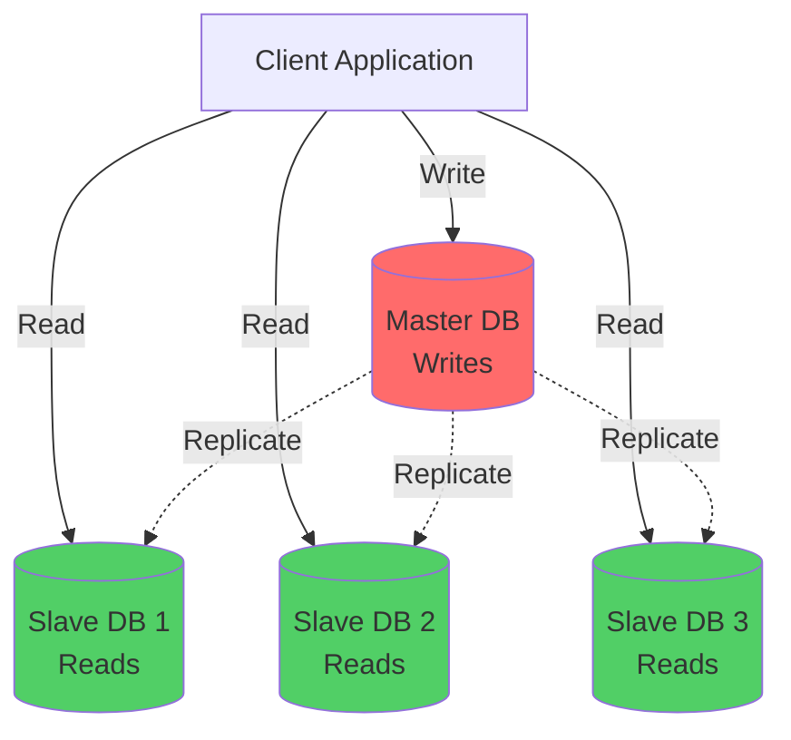
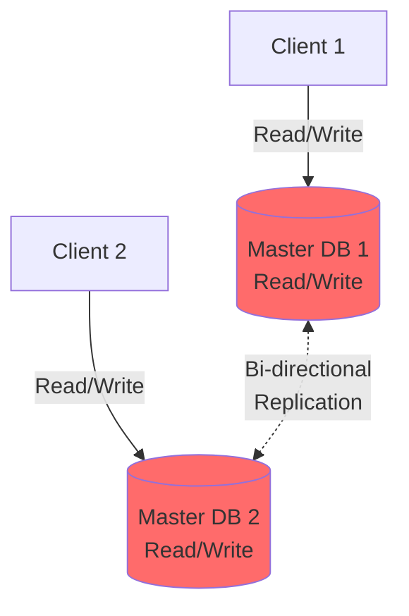
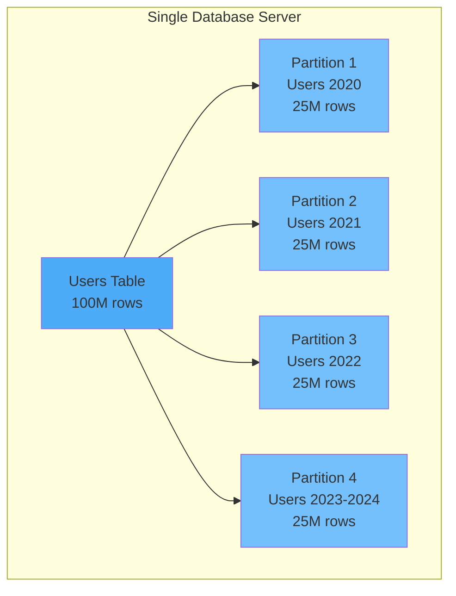
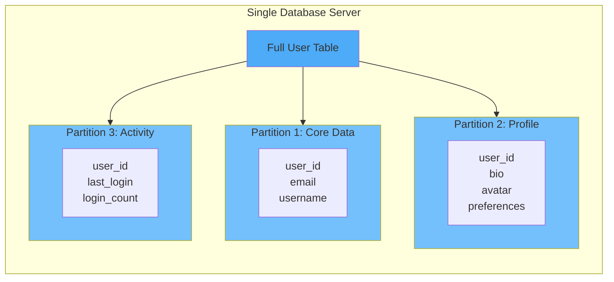
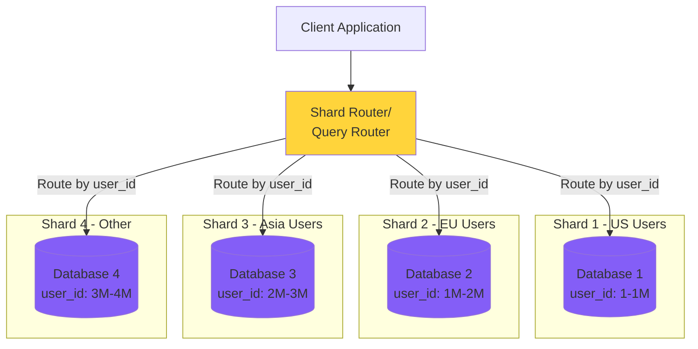
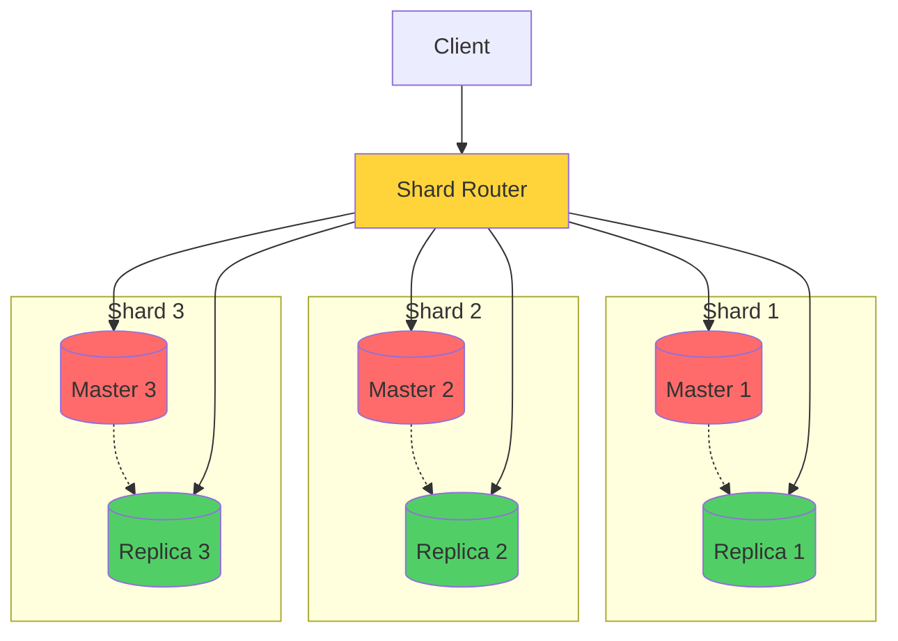
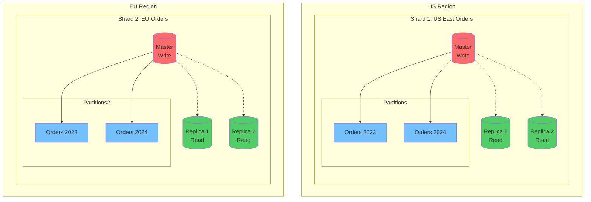
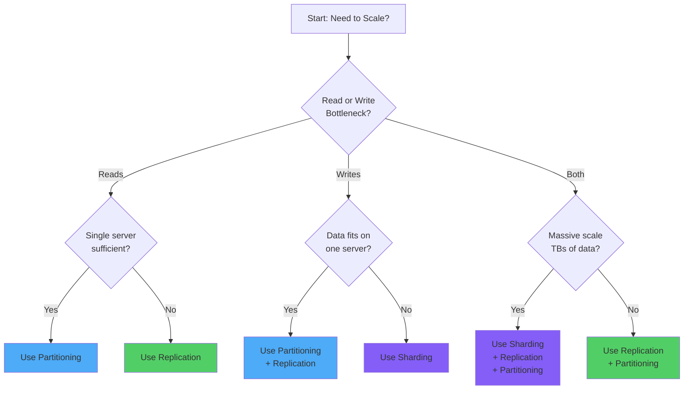

# Sharding vs Replication vs Partitioning

A comprehensive guide to database scaling strategies with practical examples and decision frameworks.

## Overview

These three strategies solve different problems in distributed systems:

- **Replication**: Copying the same data across multiple servers
- **Partitioning**: Splitting data logically within a database
- **Sharding**: Distributing data across multiple physical databases

---

## 🔄 Replication

### What is it?

Replication creates multiple copies of the same dataset across different servers. Each replica contains the full dataset (or a subset in partial replication).

### Architecture Patterns

#### Master-Slave Replication



#### Master-Master Replication



### Key Characteristics

| Aspect                | Description                                   |
| --------------------- | --------------------------------------------- |
| **Purpose**           | High availability & read scalability          |
| **Data Distribution** | Full copy on each server                      |
| **Consistency**       | Eventual or strong (depending on sync method) |
| **Failure Impact**    | Redundancy protects against server failure    |

### Replication Strategies

**Synchronous Replication**

- Write confirmed only after all replicas acknowledge
- Strong consistency
- Higher latency
- Lower availability (all replicas must be online)

**Asynchronous Replication**

- Write confirmed immediately
- Eventual consistency
- Lower latency
- Higher availability
- Risk of data loss on master failure

### Use Cases

✅ **When to use Replication:**

- High read-to-write ratio (95% reads)
- Need for high availability and fault tolerance
- Geographic distribution for low latency
- Analytics workloads on read replicas
- Disaster recovery requirements

❌ **When NOT to use:**

- Write-heavy workloads (all replicas must handle writes)
- Storage constraints (full copy per replica)
- Complex conflict resolution required

### Example Scenario

**E-commerce Product Catalog**

```
Master DB: Handles product updates (rare)
Replica 1 (US East): Serves customer browsing
Replica 2 (US West): Serves customer browsing
Replica 3 (Europe): Serves customer browsing
```

---

## 📊 Partitioning

### What is it?

Partitioning divides a large table into smaller pieces within the same database instance. Each partition contains a subset of rows but shares the same schema.

### Partitioning Types

#### Horizontal Partitioning (Row-based)



#### Vertical Partitioning (Column-based)



### Partitioning Strategies

**Range Partitioning**

```sql
-- By date
Partition P1: created_at BETWEEN '2023-01-01' AND '2023-12-31'
Partition P2: created_at BETWEEN '2024-01-01' AND '2024-12-31'

-- By ID
Partition P1: user_id BETWEEN 1 AND 1000000
Partition P2: user_id BETWEEN 1000001 AND 2000000
```

**Hash Partitioning**

```sql
-- Distribute evenly using hash function
Partition P1: HASH(user_id) % 4 = 0
Partition P2: HASH(user_id) % 4 = 1
Partition P3: HASH(user_id) % 4 = 2
Partition P4: HASH(user_id) % 4 = 3
```

**List Partitioning**

```sql
-- By discrete values
Partition P1: region IN ('US', 'Canada')
Partition P2: region IN ('UK', 'Germany', 'France')
Partition P3: region IN ('India', 'Singapore')
```

### Key Characteristics

| Aspect           | Description                        |
| ---------------- | ---------------------------------- |
| **Purpose**      | Query performance & manageability  |
| **Scope**        | Single database instance           |
| **Transparency** | Often transparent to application   |
| **Scalability**  | Limited by single server resources |

### Use Cases

✅ **When to use Partitioning:**

- Large tables slowing down queries
- Time-series data with predictable access patterns
- Easy data archival/deletion (drop old partitions)
- Maintenance operations on specific data ranges
- Query patterns that filter on partition key

❌ **When NOT to use:**

- Small tables (< 1GB)
- Queries don't align with partition key
- Need to scale beyond single server
- Uniform access across all data

### Example Scenario

**Analytics Platform with Time-Series Data**

```
logs_2024_01: January data (can archive after 90 days)
logs_2024_02: February data
logs_2024_03: March data (hot data, frequently queried)
logs_2024_04: April data (hot data, frequently queried)
```

---

## 🗂️ Sharding

### What is it?

Sharding distributes data across multiple independent database servers (shards). Each shard contains a unique subset of the data and operates autonomously.

### Sharding Architecture



### Sharding with Replication



### Sharding Strategies

**Range-Based Sharding**

```
Shard 1: user_id 1 to 1,000,000
Shard 2: user_id 1,000,001 to 2,000,000
Shard 3: user_id 2,000,001 to 3,000,000
```

**Hash-Based Sharding**

```
Shard = HASH(user_id) % number_of_shards

user_id 12345 → HASH → 2 → Shard 2
user_id 67890 → HASH → 1 → Shard 1
```

**Geographic Sharding**

```
Shard US: users where region = 'US'
Shard EU: users where region = 'EU'
Shard ASIA: users where region = 'ASIA'
```

**Entity/Directory-Based Sharding**

```
Shard mapping stored in lookup table:
tenant_id: 1001 → Shard 1
tenant_id: 1002 → Shard 3
tenant_id: 1003 → Shard 1
```

### Key Characteristics

| Aspect          | Description                                 |
| --------------- | ------------------------------------------- |
| **Purpose**     | Horizontal scalability for writes & storage |
| **Scope**       | Multiple independent database servers       |
| **Complexity**  | High (routing, joins, transactions)         |
| **Scalability** | Nearly unlimited (add more shards)          |

### Challenges

**Cross-Shard Queries**

```sql
-- This query spans multiple shards
SELECT COUNT(*) FROM users WHERE created_at > '2024-01-01'
-- Must query all shards and aggregate results
```

**Cross-Shard Joins**

```sql
-- Users on Shard 1, Orders on Shard 2
SELECT users.name, orders.total
FROM users
JOIN orders ON users.id = orders.user_id
-- Very expensive or impossible
```

**Distributed Transactions**

- Maintaining ACID across shards is complex
- Often requires 2-phase commit
- Can use eventual consistency instead

**Rebalancing**

- Adding/removing shards requires data migration
- Can cause downtime or performance issues
- Hash-based sharding makes this harder

### Use Cases

✅ **When to use Sharding:**

- Massive data volume (TBs/PBs)
- High write throughput requirements
- Single database can't handle load
- Multi-tenant applications (shard by tenant)
- Data sovereignty requirements (geographic sharding)

❌ **When NOT to use:**

- Can scale with replication/partitioning
- Frequent cross-shard queries needed
- Complex transactions across entities
- Small team without devops expertise

### Example Scenario

**Social Media Platform**

```
Shard 1: Users with last_name A-F (10M users)
Shard 2: Users with last_name G-M (10M users)
Shard 3: Users with last_name N-S (10M users)
Shard 4: Users with last_name T-Z (10M users)

Each shard has its own master + 2 replicas
```

---

## 🎯 Comparison Matrix

| Feature               | Replication              | Partitioning                         | Sharding              |
| --------------------- | ------------------------ | ------------------------------------ | --------------------- |
| **Data Distribution** | Full copy per node       | Subset per partition                 | Subset per shard      |
| **Scalability**       | Read scalability         | Single server limit                  | Unlimited horizontal  |
| **Write Performance** | No improvement           | Improved for specific queries        | Linear improvement    |
| **Read Performance**  | Linear improvement       | Improved for partition-aware queries | Improved              |
| **Complexity**        | Low-Medium               | Low                                  | High                  |
| **Storage Cost**      | High (full copies)       | Same as original                     | Distributed           |
| **Query Complexity**  | Simple                   | Simple                               | Complex (cross-shard) |
| **Failure Impact**    | Other replicas available | Single point of failure              | Only affected shard   |
| **Setup Difficulty**  | Easy                     | Easy                                 | Difficult             |
| **Maintenance**       | Medium                   | Easy                                 | Difficult             |

---

## 🎨 Combined Strategies

Real-world systems often combine these approaches:

### Example: E-commerce Platform



**Strategy:**

- **Sharding** by geographic region (data locality)
- **Replication** within each shard (high availability + read scaling)
- **Partitioning** by year (query performance + easy archival)

---

## 🚦 Decision Tree



---

## 📝 Quick Decision Guide

### Start with Replication if:

- 🎯 Your reads outnumber writes 10:1 or more
- 🎯 You need high availability
- 🎯 You want geographic distribution
- 🎯 Your data fits comfortably on one server
- 🎯 You're starting out and need simple scaling

### Add Partitioning if:

- 🎯 Single tables are becoming very large (>100GB)
- 🎯 Queries have predictable access patterns (time-based, range-based)
- 🎯 You need to archive/delete old data regularly
- 🎯 Query performance is degrading despite indexes
- 🎯 You're still on a single database server

### Move to Sharding when:

- 🎯 You've exhausted vertical scaling (bigger servers)
- 🎯 Replication doesn't help (write bottleneck)
- 🎯 Data exceeds single server capacity (multi-TB)
- 🎯 You need linear write scalability
- 🎯 You have multi-tenant architecture
- 🎯 Data sovereignty requires geographic separation

---

## 💡 Best Practices

### Replication

- Monitor replication lag
- Use read replicas for analytics
- Implement retry logic for failover
- Consider async for performance, sync for consistency

### Partitioning

- Choose partition key carefully (used in WHERE clauses)
- Keep partitions relatively equal in size
- Plan for growth (add partitions in advance)
- Use partition pruning in queries

### Sharding

- Choose a stable shard key (won't change)
- Distribute data evenly (avoid hot shards)
- Plan for rebalancing from day one
- Minimize cross-shard operations
- Use consistent hashing for dynamic sharding
- Keep shard mapping external (not hardcoded)

---

## 🔧 Implementation Examples

### Replication Setup (PostgreSQL)

```sql
-- On Master
CREATE PUBLICATION my_publication FOR ALL TABLES;

-- On Replica
CREATE SUBSCRIPTION my_subscription
CONNECTION 'host=master_host dbname=mydb user=repl_user'
PUBLICATION my_publication;
```

### Partitioning Setup (PostgreSQL)

```sql
-- Create partitioned table
CREATE TABLE orders (
    order_id BIGSERIAL,
    created_at TIMESTAMP,
    customer_id INTEGER,
    total DECIMAL
) PARTITION BY RANGE (created_at);

-- Create partitions
CREATE TABLE orders_2023 PARTITION OF orders
    FOR VALUES FROM ('2023-01-01') TO ('2024-01-01');

CREATE TABLE orders_2024 PARTITION OF orders
    FOR VALUES FROM ('2024-01-01') TO ('2025-01-01');
```

### Sharding Logic (Application Level)

```python
def get_shard(user_id, num_shards=4):
    """Hash-based sharding"""
    shard_id = hash(user_id) % num_shards
    return f"shard_{shard_id}"

def get_connection(user_id):
    """Get database connection for user"""
    shard = get_shard(user_id)
    return connection_pool[shard]

# Usage
user_id = 12345
db = get_connection(user_id)
user = db.query("SELECT * FROM users WHERE id = ?", user_id)
```

---

## 📚 Summary

**Replication** = Same data, multiple places → High availability & read scaling

**Partitioning** = Split data logically, same server → Query performance & manageability

**Sharding** = Split data physically, multiple servers → Unlimited horizontal scaling

Start simple (replication + partitioning), move to sharding only when necessary. Most applications never need sharding.

---

## 🎓 Further Reading

- PostgreSQL Replication Documentation
- MySQL Sharding Strategies
- MongoDB Sharding Architecture
- Vitess (Sharding layer for MySQL)
- Citus (Distributed PostgreSQL)
- Consistent Hashing Algorithms
- CAP Theorem and Distributed Systems
