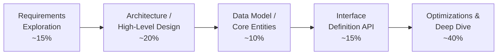
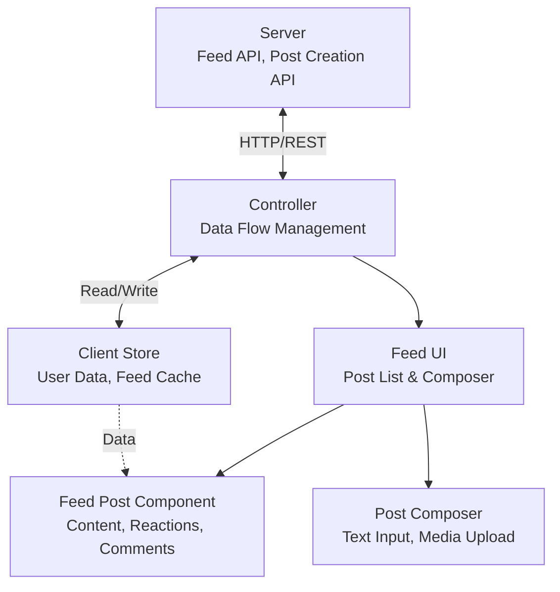

# Frontend System Design Mastery Roadmap

## Table of Contents

**[RADIO Framework - Interview Approach](#radio-framework---interview-approach)**

1. [Networking](#1-networking)
2. [Communication](#2-communication)
3. [Security](#3-security)
4. [Testing](#4-testing)
5. [Performance](#5-performance)
6. [Database & Caching](#6-database--caching)
7. [Logging & Monitoring](#7-logging--monitoring)
8. [Accessibility](#8-accessibility)
9. [Offline Support](#9-offline-support)
10. [Low-Level Design (LLD)](#10-low-level-design-lld)
11. [High-Level Design (HLD)](#11-high-level-design-hld)
12. [Modern Frontend Architecture](#12-modern-frontend-architecture)
13. [DevOps & Deployment](#13-devops--deployment)
14. [Advanced Topics](#14-advanced-topics)
15. [Soft Skills & Career](#15-soft-skills--career)
16. [Appendix: Resources](#appendix-resources)
17. [Study Approach](#study-approach)

---

## RADIO Framework - Interview Approach

**A structured approach to ace frontend system design interviews.**

### What is RADIO?



---

### R - Requirements Exploration (~15%)

**Objective:** Understand the problem and determine scope through clarifying questions.

**Key Questions to Ask:**

- What are the main use cases and core features?
- What are the functional vs non-functional requirements?
- Which features are core vs nice-to-have?
- What devices/platforms need support (desktop/mobile/tablet)?
- Is offline support necessary?
- Who are the primary users?
- Any specific performance requirements?

**Example: Design Facebook News Feed**

- Focus on: News feed display, creating posts, pagination
- Functional: View feed, create posts, like/react
- Non-functional: Fast loading, smooth scrolling, real-time updates
- Core features: Text posts, images, reactions
- Nice-to-have: Videos, polls, location check-ins

---

### A - Architecture / High-Level Design (~20%)

**Objective:** Identify key components and their relationships.

**Common Components:**

- **Server** - Backend APIs (black box)
- **Controller** - Handles user interactions and data flow
- **Model/Store** - Client-side data storage
- **View** - UI components

**Example Architecture: Facebook News Feed**



**Component Responsibilities:**

- **Server**: Provides feed data, creates new posts
- **Controller**: Manages API calls, data transformation
- **Client Store**: Caches user data, feed posts
- **Feed UI**: Renders post list and composer
- **Feed Post**: Displays individual post with interactions
- **Post Composer**: Interface for creating new posts

---

### D - Data Model / Core Entities (~10%)

**Objective:** Define data entities, fields, and ownership.

**Data Types:**

- **Server-originated**: From database (user profiles, posts)
- **Client-only**: Local state (form inputs, UI state)

**Example Data Model: News Feed**

| Source | Entity    | Component    | Fields                                                                 |
| ------ | --------- | ------------ | ---------------------------------------------------------------------- |
| Server | `Post`    | Feed Post    | `id`, `created_time`, `content`, `image`, `author` (User), `reactions` |
| Server | `Feed`    | Feed UI      | `posts[]`, `pagination` (cursor, hasNext)                              |
| Server | `User`    | Client Store | `id`, `name`, `profile_photo_url`                                      |
| Client | `NewPost` | Composer     | `message`, `image`, `isDraft`                                          |
| Client | UI State  | Feed UI      | `isLoading`, `error`, `selectedTab`                                    |

---

### I - Interface Definition (API) (~15%)

**Objective:** Define APIs between components - their functionality, parameters, and responses.

#### Server-Client API Example

**Fetch Feed Posts**

```javascript
// API Specification
GET /feed

// Parameters
{
  "size": 10,
  "cursor": "dXNlcjpXMDdRQ1JQQTQ"
}

// Response
{
  "pagination": {
    "size": 10,
    "next_cursor": "dXNlcjpVMEc5V0ZYTlo",
    "has_next": true
  },
  "results": [
    {
      "id": "123",
      "author": {
        "id": "456",
        "name": "John Doe",
        "profile_photo": "https://example.com/photo.jpg"
      },
      "content": "Hello world!",
      "image": "https://example.com/post.jpg",
      "reactions": {
        "likes": 20,
        "loves": 5
      },
      "created_time": 1620639583
    }
  ]
}
```

**Create New Post**

```javascript
POST /posts

// Parameters
{
  "content": "My new post",
  "image": "base64_encoded_image",
  "visibility": "public"
}

// Response
{
  "id": "789",
  "status": "published",
  "created_time": 1620639999
}
```

#### Client-Client API Example

```javascript
// Controller to Store
function addPostToFeed(post: Post): void

// Controller to View
function updateFeedUI(posts: Post[], isLoading: boolean): void

// Composer to Controller
function submitNewPost(content: string, image?: File): Promise<Post>
```

---

### O - Optimizations & Deep Dive (~40%)

**Objective:** Discuss optimizations and dive deep into critical areas.

**Focus Areas** (choose based on product needs):

#### 1. Performance

- **Initial Load**: Code splitting, lazy loading, SSR
- **Runtime**: Virtual scrolling for long feeds
- **Images**: Lazy loading, responsive images, WebP format
- **Caching**: Service workers, HTTP caching

#### 2. User Experience

- **Optimistic Updates**: Show post immediately, rollback on error
- **Skeleton Screens**: Show loading placeholders
- **Infinite Scroll**: Intersection Observer for pagination
- **Pull-to-Refresh**: Mobile gesture support

#### 3. Network

- **Request Batching**: Combine multiple API calls
- **Debouncing**: Limit API calls for search/autocomplete
- **Retry Logic**: Handle network failures gracefully
- **WebSockets**: Real-time updates for new posts

#### 4. Accessibility

- **Keyboard Navigation**: Tab through posts, shortcuts
- **Screen Readers**: ARIA labels, semantic HTML
- **Focus Management**: Maintain focus after interactions
- **Color Contrast**: WCAG AA/AAA compliance

#### 5. Scalability

- **Pagination Strategy**: Cursor-based for infinite scroll
- **State Management**: Redux/Zustand for complex apps
- **Component Reusability**: Atomic design principles

#### 6. Security

- **XSS Prevention**: Sanitize user input
- **CSRF Protection**: Token-based validation
- **Content Security Policy**: Restrict resource loading

---

### Example Deep Dive: Infinite Scroll Implementation

```javascript
// Using Intersection Observer for efficient infinite scroll
const FeedComponent = () => {
  const [posts, setPosts] = useState([]);
  const [cursor, setCursor] = useState(null);
  const [isLoading, setIsLoading] = useState(false);
  const observerTarget = useRef(null);

  useEffect(() => {
    const observer = new IntersectionObserver(
      entries => {
        if (entries[0].isIntersecting && !isLoading && cursor) {
          loadMorePosts();
        }
      },
      { threshold: 0.5 }
    );

    if (observerTarget.current) {
      observer.observe(observerTarget.current);
    }

    return () => observer.disconnect();
  }, [cursor, isLoading]);

  const loadMorePosts = async () => {
    setIsLoading(true);
    const data = await fetchFeed({ cursor, size: 10 });
    setPosts(prev => [...prev, ...data.results]);
    setCursor(data.pagination.next_cursor);
    setIsLoading(false);
  };

  return (
    <div>
      {posts.map(post => (
        <PostCard key={post.id} post={post} />
      ))}
      <div ref={observerTarget} />
      {isLoading && <Skeleton />}
    </div>
  );
};
```

---

### RADIO Framework Summary

| Step              | Duration | Key Focus                            |
| ----------------- | -------- | ------------------------------------ |
| **R**equirements  | `<15%`   | Clarify scope, features, constraints |
| **A**rchitecture  | ~20%     | Component diagram, relationships     |
| **D**ata Model    | ~10%     | Entities, fields, data flow          |
| **I**nterface     | ~15%     | APIs, parameters, responses          |
| **O**ptimizations | ~40%     | Performance, UX, scalability         |

**Pro Tips:**

- Write down requirements for reference
- Draw diagrams for architecture
- Choose optimization topics based on product type and your strengths
- Show depth over breadth in the deep dive section

---

## 1. Networking

### Introduction

- **Important Guidelines**
- **Network Fundamentals**
- **Browser Networking APIs**

### Core Concepts

- **How the Web Works**
  - DNS Resolution
  - TCP/IP Protocol
  - HTTP/HTTPS Protocol
  - Browser Rendering Pipeline
- **Communication Protocols**
  - HTTP/1.1, HTTP/2, HTTP/3
  - WebSocket Protocol
  - UDP vs TCP

### API & Communication Tools

- **REST APIs**
  - RESTful Principles
  - HTTP Methods & Status Codes
  - API Versioning
  - Rate Limiting
- **GraphQL**
  - Queries & Mutations
  - Schema Design
  - Caching Strategies
  - Apollo Client vs Relay
- **gRPC**
  - Protocol Buffers
  - Streaming
  - Web gRPC
- **Additional Patterns**
  - JSON-RPC
  - SOAP (Legacy Systems)
  - WebRTC for Peer-to-Peer

---

## 2. Communication

### Introduction

- **Communication Overview**
- **Client-Server Architecture**
- **Bidirectional Communication**

### Techniques for Real-Time Data

- **Short Polling**
  - Use Cases
  - Pros & Cons
- **Long Polling**
  - Implementation
  - When to Use
- **WebSockets**
  - Full-Duplex Communication
  - Socket.io vs Native WebSocket
  - Reconnection Strategies
- **Server-Sent Events (SSE)**
  - EventSource API
  - Comparison with WebSockets
- **WebHooks**
  - Webhook Security
  - Retry Mechanisms
- **Additional Techniques**
  - WebRTC Data Channels
  - Message Queues (Frontend Integration)

---

## 3. Security

### Introduction

- **Security Overview**
- **Security Best Practices**
- **Security Mindset**

### Frontend Security Concepts

- **Cross-Site Scripting (XSS)**
  - Stored XSS
  - Reflected XSS
  - DOM-based XSS
  - Prevention Techniques
- **iFrame Protection**
  - X-Frame-Options
  - Frame Busting
  - Sandboxing
- **Security Headers**
  - Content-Security-Policy (CSP)
  - Strict-Transport-Security (HSTS)
  - X-Content-Type-Options
  - Referrer-Policy
- **Client-side Security**
  - JWT Storage Best Practices
  - Token Management
  - Secure Cookie Attributes
- **Secure Communication (HTTPS)**
  - TLS/SSL
  - Certificate Pinning
  - Mixed Content Issues
- **Dependency Security**
  - NPM Audit
  - Snyk & Dependabot
  - Supply Chain Attacks
- **Compliance & Regulation**
  - GDPR
  - CCPA
  - Cookie Consent
- **Input Validation and Sanitization**
  - DOMPurify
  - Validator Libraries
  - Schema Validation

### Server-Side Security (Frontend Perspective)

- **Server-Side Request Forgery (SSRF)**
- **Server-side JavaScript Injection (SSJI)**
- **SQL Injection (via APIs)**
- **Authentication & Authorization**
  - OAuth 2.0 / OpenID Connect
  - Session Management
  - Multi-Factor Authentication (MFA)

### Policy & Integrity

- **Feature Policy | Permissions-Policy**
- **Subresource Integrity (SRI)**
- **Cross-Origin Resource Sharing (CORS)**
  - Preflight Requests
  - Credential Handling
- **Cross-Site Request Forgery (CSRF)**
  - CSRF Tokens
  - SameSite Cookie Attribute
- **Additional Security Topics**
  - Clickjacking Prevention
  - Tabnabbing Protection
  - Prototype Pollution

---

## 4. Testing

### Introduction

- **Testing Overview**
- **Testing Pyramid**
- **Testing Best Practices**

### Testing Techniques

- **Unit & Integration Testing**
  - Jest, Vitest, Mocha
  - Testing Library
  - Mocking & Stubbing
- **End-to-End (E2E) & Automation Testing**
  - Cypress
  - Playwright
  - Puppeteer
  - Selenium
- **A/B Testing**
  - Feature Flags
  - Split Testing
  - Analytics Integration
- **Performance Testing**
  - Lighthouse CI
  - WebPageTest
  - Load Testing
- **Test-Driven Development (TDD) Overview**
- **Security Testing**
  - OWASP ZAP
  - Penetration Testing
  - Vulnerability Scanning
- **Additional Testing Types**
  - Visual Regression Testing (Percy, Chromatic)
  - Accessibility Testing (axe-core)
  - Smoke Testing
  - Snapshot Testing
  - Contract Testing

### Bonus

- **Testing in React Components**
  - Component Testing
  - Hook Testing
  - Context Testing

---

## 5. Performance

### Introduction

- **Performance Overview**
- **Importance of Performance**
- **Core Web Vitals**
  - Largest Contentful Paint (LCP)
  - First Input Delay (FID) / Interaction to Next Paint (INP)
  - Cumulative Layout Shift (CLS)

### Monitoring & Tools

- **Performance Monitoring**
  - Real User Monitoring (RUM)
  - Synthetic Monitoring
  - Error Tracking (Sentry, Bugsnag)
- **Performance Tools**
  - Chrome DevTools
  - Lighthouse
  - WebPageTest
  - Performance API

### Optimization Techniques

- **Network Optimization**
  - Resource Compression (Gzip, Brotli)
  - CDN Usage
  - HTTP/2 & HTTP/3
  - DNS Prefetching
  - Preconnect, Prefetch, Preload
  - Resource Hints
- **Rendering Patterns**
  - Client-Side Rendering (CSR)
  - Server-Side Rendering (SSR)
  - Static Site Generation (SSG)
  - Incremental Static Regeneration (ISR)
  - Streaming SSR
  - Progressive Hydration
  - Islands Architecture
- **Build Optimization**
  - Code Splitting
  - Tree Shaking
  - Bundle Analysis
  - Minification & Uglification
  - Dead Code Elimination
- **Additional Optimization**
  - Image Optimization (WebP, AVIF, Lazy Loading)
  - Font Optimization (FOUT, FOIT, Variable Fonts)
  - JavaScript Optimization (Defer, Async)
  - CSS Optimization (Critical CSS, Unused CSS Removal)
  - Virtual Scrolling
  - Web Workers
  - Request Batching & Debouncing

---

## 6. Database & Caching

### Introduction

- **Database & Caching Overview**
- **Frontend Data Strategy**

### Frontend Storage Techniques

- **Local Storage**
  - Use Cases
  - Size Limits
  - Security Considerations
- **Session Storage**
- **Cookie Storage**
  - Cookie Attributes
  - Third-Party Cookies
- **Indexed DB**
  - Dexie.js
  - Complex Queries
- **Additional Storage**
  - Cache API
  - Web SQL (Deprecated but good to know)

### Database Design

- **Normalization**
  - Normal Forms
  - Denormalization for Frontend
- **Data Modeling**
  - Entity Relationships
  - Schema Design for Frontend Consumption
- **Query Optimization**

### Caching Techniques

- **HTTP Caching**
  - Cache-Control Headers
  - ETag & Last-Modified
  - Stale-While-Revalidate
- **Service Worker Caching**
  - Cache Strategies (Network First, Cache First, etc.)
  - Background Sync
- **API Caching**
  - Client-Side Caching
  - SWR (Stale-While-Revalidate)
  - React Query / TanStack Query
- **Additional Caching**
  - Memoization
  - Edge Caching (CDN)
  - Browser Cache vs Application Cache

### State Management

- **Managing Application State**
  - Redux / Redux Toolkit
  - Zustand
  - MobX
  - Recoil
  - Jotai
  - Context API
  - State Machines (XState)
- **Server State vs Client State**
- **Optimistic Updates**
- **State Persistence**

---

## 7. Logging & Monitoring

### Introduction

- **Logging & Monitoring Overview**
- **Observability Pillars**

### Core Concepts

- **Telemetry**
  - Metrics Collection
  - Distributed Tracing
  - User Session Recording
- **Alerting**
  - Error Boundaries
  - Notification Systems
  - Incident Management
- **Fixing Issues**
  - Debugging Techniques
  - Source Maps
  - Reproduction Steps
- **Additional Concepts**
  - Log Aggregation (LogRocket, Datadog)
  - Application Performance Monitoring (APM)
  - Analytics (Google Analytics, Mixpanel, Amplitude)
  - Feature Usage Tracking
  - Crash Reporting

---

## 8. Accessibility

### Accessibility Overview

- **WCAG Guidelines**
- **ARIA (Accessible Rich Internet Applications)**
- **Semantic HTML**

### Keyboard Accessibility

- **Tab Navigation**
- **Keyboard Shortcuts**
- **Focus Indicators**

### Screen Reader Compatibility

- **ARIA Labels & Descriptions**
- **Live Regions**
- **Screen Reader Testing**

### Focus Management

- **Focus Trapping**
- **Skip Links**
- **Focus Order**

### Color Contrast

- **WCAG Contrast Ratios**
- **Color Blindness Considerations**

### Accessibility Tools

- **axe DevTools**
- **WAVE**
- **Lighthouse Accessibility Audit**
- **Screen Readers (NVDA, JAWS, VoiceOver)**

### Fixing Accessibility Issues

- **Common Violations**
- **Remediation Strategies**

### Additional Topics

- **Mobile Accessibility**
- **Forms Accessibility**
- **Alternative Text for Images**
- **Captions & Transcripts**
- **Accessible Animations (prefers-reduced-motion)**

---

## 9. Offline Support

### Service Workers

- **Service Worker Lifecycle**
- **Caching Strategies**
- **Background Sync**
- **Push Notifications**

### Progressive Web Applications (PWAs)

- **Web App Manifest**
- **Install Prompts**
- **App Shell Architecture**
- **Offline First Strategy**
- **Workbox**

### Additional Offline Features

- **IndexedDB for Offline Data**
- **Network Detection**
- **Offline UI Patterns**
- **Sync Conflicts Resolution**

---

## 10. Low-Level Design (LLD)

### Component Patterns

- **Component Design**
  - Atomic Design
  - Compound Components
  - Render Props
  - Higher-Order Components (HOC)
- **Design Systems**
  - Component Libraries
  - Theming
  - Token Systems

### UI Patterns & Features

- **Config-Driven UI**
- **Shimmer UI / Skeleton Screens**
- **Routing & Protected Routes**
  - React Router / Next.js Router
  - Route Guards
  - Dynamic Routes
- **State Management + Libraries**
- **Multi-Language Support (i18n)**
  - react-i18next
  - FormatJS
  - RTL Support
- **Infinite Scroll**
  - Virtual Scrolling
  - Intersection Observer
- **Accordion**
- **Reddit Nested Comments**
  - Recursive Components
- **Image Slider / Carousel**
- **Pagination (Part 1 & Part 2)**
  - Cursor-based
  - Offset-based
- **Real-Time Updates**
- **YouTube Live Stream Chat UI**
- **Autocomplete & Search Bar**
  - Debouncing
  - Fuzzy Search
  - Highlighting

### Additional LLD Topics

- **Modal & Dialog Management**
- **Toast Notifications**
- **Dropdown & Select Components**
- **Tabs Component**
- **Form Handling & Validation**
  - React Hook Form
  - Formik
  - Yup / Zod Validation
- **Drag and Drop**
- **File Upload**
  - Progress Indicators
  - Chunk Upload
- **Data Tables**
  - Sorting, Filtering, Search
  - TanStack Table
- **Charts & Graphs**
- **Date/Time Pickers**
- **Rich Text Editors**
- **Command Palette**
- **Virtualized Lists**
- **Responsive Design Patterns**

---

## 11. High-Level Design (HLD)

### HLD Overview

- **System Design Fundamentals**
- **Scalability Principles**
- **Architecture Patterns**
- **Trade-offs & Decisions**

### Applications & Architectures

#### Social Media & Content

- **Photo Sharing App (Instagram)**
  - Image Upload & Optimization
  - Feed Generation
  - Story Feature
  - Like/Comment System
- **News Media Feed (Facebook/Twitter)**
  - Timeline Architecture
  - Real-time Updates
  - Recommendation Engine
  - Content Moderation

#### E-commerce

- **E-commerce App (Amazon/Flipkart)**
  - Product Catalog
  - Search & Filtering
  - Shopping Cart
  - Payment Integration
  - Order Tracking
  - Recommendation Engine

#### Streaming

- **Video Streaming (Netflix)**
  - Adaptive Bitrate Streaming
  - CDN Strategy
  - Recommendation Algorithm
  - Content Delivery
  - Offline Downloads
- **Music Streaming (Spotify)**
  - Audio Streaming
  - Playlist Management
  - Collaborative Playlists
  - Discovery Algorithm

#### Productivity & Communication

- **Email Client (Gmail/Outlook)**
  - Email Threading
  - Search Functionality
  - Offline Support
  - Attachment Handling
  - Spam Filtering
- **Google Docs & Google Sheets**
  - Operational Transformation (OT)
  - Conflict-Free Replicated Data Types (CRDTs)
  - Real-time Collaboration
  - Cursor Positioning
  - Undo/Redo

#### Tools & Utilities

- **Diagram Tools (Excalidraw)**
  - Canvas Rendering
  - Collaborative Drawing
  - Export Functionality
- **Analytics Dashboard (Google Analytics)**
  - Data Visualization
  - Real-time Metrics
  - Report Generation
  - Data Aggregation

#### Real-time Applications

- **Live Commentary (CricInfo/Crickbuzz)**
  - Live Score Updates
  - Ball-by-Ball Commentary
  - Real-time Notifications
  - WebSocket Implementation

### Microfrontend Architecture

- **Module Federation**
- **Single-SPA**
- **Micro-app Communication**
- **Shared Dependencies**
- **Independent Deployment**
- **Team Boundaries**

### Additional HLD Topics

- **Chat Application (WhatsApp/Slack)**
  - Message Queue
  - Read Receipts
  - End-to-End Encryption
  - Group Chats
- **Video Conferencing (Zoom/Meet)**
  - WebRTC
  - Peer-to-Peer vs Server-Mediated
  - Screen Sharing
- **Ride-Sharing App (Uber/Lyft)**
  - Real-time Location Tracking
  - Map Integration
  - Matching Algorithm
- **Food Delivery App (DoorDash/Zomato)**
  - Restaurant Search
  - Order Management
  - Real-time Tracking
- **Booking System (Airbnb/Booking.com)**
  - Search & Filters
  - Availability Calendar
  - Booking Conflicts
- **Content Management System (CMS)**
  - WYSIWYG Editor
  - Version Control
  - Publishing Workflow
- **Notification System**
  - Push Notifications
  - In-app Notifications
  - Email Notifications

---

## 12. Modern Frontend Architecture

### Build Tools & Bundlers

- **Webpack**
- **Vite**
- **Rollup**
- **Turbopack**
- **esbuild**
- **SWC**

### Meta Frameworks

- **Next.js**
  - App Router
  - Server Components
  - Server Actions
- **Remix**
- **Astro**
- **SvelteKit**
- **Nuxt.js**

### Design Patterns

- **SOLID Principles in Frontend**
- **MVC, MVVM, MVP**
- **Flux Architecture**
- **Repository Pattern**
- **Facade Pattern**
- **Observer Pattern**
- **Singleton Pattern**

### Code Quality

- **Linting (ESLint)**
- **Formatting (Prettier)**
- **Type Safety (TypeScript)**
- **Code Reviews**
- **Documentation (Storybook, JSDoc)**
- **Git Workflow & Version Control**

---

## 13. DevOps & Deployment

### CI/CD

- **GitHub Actions**
- **GitLab CI**
- **Jenkins**
- **CircleCI**

### Deployment Strategies

- **Blue-Green Deployment**
- **Canary Deployment**
- **Rolling Updates**
- **Feature Toggles**

### Hosting & Infrastructure

- **Vercel**
- **Netlify**
- **AWS (S3, CloudFront, Amplify)**
- **Google Cloud Platform**
- **Azure**
- **Docker Containers**

### Monitoring & Analytics

- **Performance Monitoring in Production**
- **Error Tracking**
- **Usage Analytics**
- **A/B Testing Infrastructure**

---

## 14. Advanced Topics

### Web Assembly (WASM)

- **Performance-Critical Operations**
- **Porting C/C++ Code**
- **Use Cases**

### Edge Computing

- **Edge Functions**
- **Cloudflare Workers**
- **Vercel Edge Functions**

### AI/ML Integration

- **TensorFlow.js**
- **ML Models in Browser**
- **AI-Powered Features**

### Browser APIs

- **Web Bluetooth**
- **Web USB**
- **Web NFC**
- **Media Capture & Streams**
- **Web Audio API**
- **Canvas & WebGL**
- **Geolocation API**
- **Battery Status API**
- **Vibration API**

### Emerging Technologies

- **Web3 Integration**
- **Blockchain Frontend**
- **WebGPU**
- **WebXR (AR/VR)**

---

## 15. Soft Skills & Career

### Technical Communication

- **Technical Writing**
- **Documentation**
- **Code Comments**
- **Architecture Decision Records (ADRs)**

### Collaboration

- **Agile/Scrum**
- **Code Reviews**
- **Pair Programming**
- **Cross-functional Teams**

### Problem Solving

- **Debugging Strategies**
- **Root Cause Analysis**
- **Performance Profiling**
- **Trade-off Analysis**

### Continuous Learning

- **Staying Updated**
- **Open Source Contribution**
- **Technical Blogs**
- **Conference Talks**

---

## Appendix: Resources

### Books

- "Designing Data-Intensive Applications" by Martin Kleppmann
- "Web Performance in Action" by Jeremy Wagner
- "High Performance Browser Networking" by Ilya Grigorik

### Online Platforms

- Frontend Masters
- Web.dev
- MDN Web Docs
- JavaScript.info

### Practice Platforms

- Frontend Interview Handbook
- GreatFrontEnd
- LeetCode Frontend Questions
- Building Real-World Projects

---

## Study Approach

1. **Foundation First**: Master networking, communication, and security basics
2. **Hands-On Practice**: Build projects implementing each LLD pattern
3. **Progressive Complexity**: Move from LLD to HLD gradually
4. **Real-World Projects**: Clone popular applications
5. **Performance Focus**: Always optimize and measure
6. **Security Mindset**: Think about security in every design decision
7. **Continuous Testing**: Write tests alongside features
8. **Document Learning**: Maintain a knowledge base

---

_This roadmap is comprehensive but not exhaustive. Frontend system design is constantly evolving, so stay curious and keep learning!_
