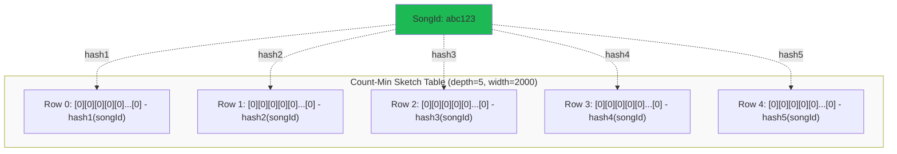
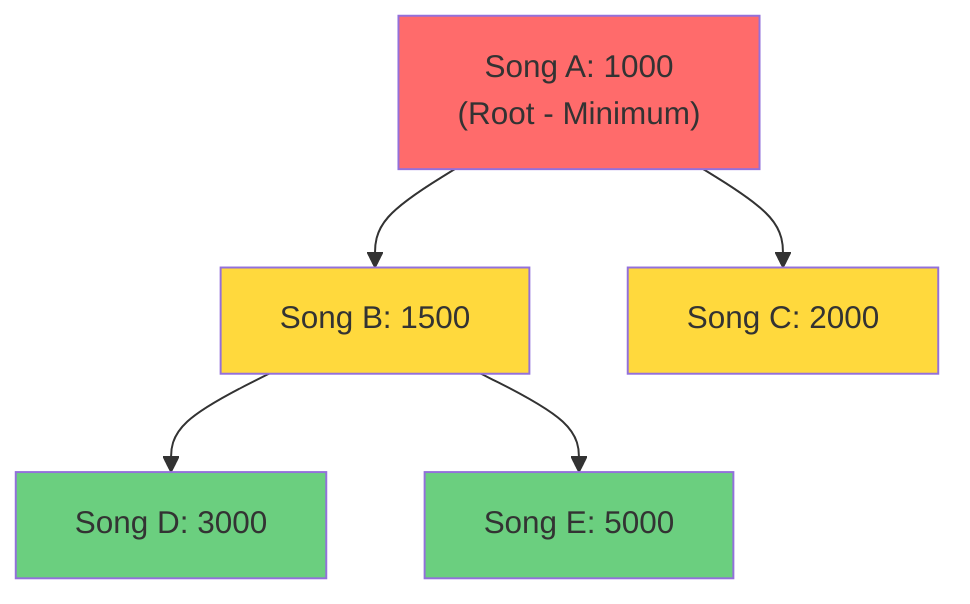
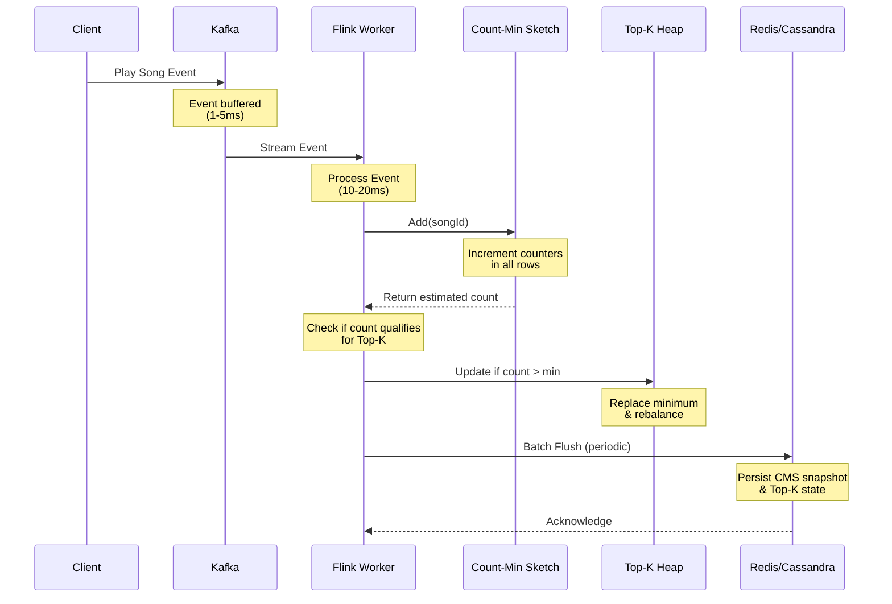

# System Design: Spotify Top-K Songs Tracker

## Problem Statement

Design a system that tracks and retrieves the top-K most played songs on Spotify in real-time, handling millions of song plays per second with minimal memory footprint.

---

## Requirements

### Functional Requirements
- Track song play counts in real-time
- Retrieve top-K most played songs (e.g., top 100)
- Handle massive data streams (millions of plays/second)
- Memory-efficient (sublinear in number of songs)
- Near real-time accuracy (small error acceptable)

### Non-Functional Requirements
- **High Throughput**: Process millions of events/second
- **Low Latency**: < 100ms for Top-K queries
- **Horizontally Scalable**: Add nodes to handle load
- **Fault Tolerant**: No single point of failure
- **Approximate Counts**: Trade accuracy for efficiency (±ε error acceptable)

---

## High-Level Architecture

```mermaid
flowchart TD
    A[Spotify Clients<br/>Web, Mobile] -->|Play Events| B[Load Balancer]
    B --> C[Event Stream Bus<br/>Apache Kafka<br/>- Partitioned<br/>- Replicated]
    C --> D[Stream Processor Layer<br/>Apache Flink/Spark]

    subgraph Processing["Stream Processing"]
        D --> E[Count-Min Sketch<br/>In-Memory]
        D --> F[Top-K Heap<br/>Min-Heap]
    end

    Processing --> G[Storage Layer<br/>Redis - CMS Cache<br/>Cassandra - TopK]
    G --> H[API Service<br/>REST/GraphQL]
    H --> I[Frontend/Dashboard]

    style A fill:#1DB954
    style D fill:#FFD700
    style G fill:#FF6B6B
    style H fill:#4ECDC4
```



---

## Core Components

### 1. Event Stream (Apache Kafka)

**Purpose**: Ingest and buffer millions of play events

**Design Decisions**:
- **Topics**: `song-plays` topic with multiple partitions
- **Partitioning Strategy**: Hash by `songId` for even distribution
- **Replication Factor**: 3 for fault tolerance
- **Retention**: 7 days for replay capability

**Benefits**:
- Decouples producers from consumers
- Handles traffic spikes via buffering
- Enables multiple consumers for different analytics

---

### 2. Stream Processing Layer (Apache Flink)

**Purpose**: Process events in real-time and maintain data structures

**Processing Logic**:
```
For each event:
  1. Parse songId from event
  2. Update Count-Min Sketch
  3. Get estimated count from CMS
  4. Update Top-K heap if needed
  5. Periodically flush to storage
```

**Parallelism**:
- Multiple Flink workers process different Kafka partitions
- Each worker maintains local CMS + TopK
- Periodic merge of local structures

**State Management**:
- Checkpointing enabled (every 1 minute)
- State stored in RocksDB for fault tolerance

---

### 3. Count-Min Sketch (CMS)

**Purpose**: Space-efficient approximate frequency counter

#### Structure



#### Operations

**Add Operation** (when song is played):
```
For each hash function h_i (i = 1 to depth):
  index = h_i(songId) % width
  table[i][index] += 1
```

**Estimate Operation** (get play count):
```
estimates = []
For each hash function h_i:
  index = h_i(songId) % width
  estimates.append(table[i][index])

return min(estimates)  // Conservative estimate
```

#### Why Minimum?

The minimum across rows gives the best estimate because:
- Each counter may have hash collisions (overcount)
- The true count is ≤ all row values
- Taking minimum reduces collision impact

#### Parameter Selection

Given desired accuracy (ε) and confidence (δ):

- **Width** = ⌈e / ε⌉
  - ε = 0.01 (1% error) → width ≈ 272

- **Depth** = ⌈ln(1/δ)⌉
  - δ = 0.001 (99.9% confidence) → depth ≈ 7

**Memory Usage**: depth × width × 4 bytes (int)
- Example: 7 × 272 × 4 = 7.6 KB per CMS!

---

### 4. Top-K Heap

**Purpose**: Maintain the K most played songs efficiently

#### Structure

**Min-Heap** of size K:



#### Operations

**Insert/Update**:
```
When new count estimate arrives:
  IF heap.size < K:
    heap.insert(song, count)
  ELSE IF count > heap.peek().count:
    heap.pop()           // Remove minimum
    heap.insert(song, count)
```

**Query Top-K**:
```
Return all elements in heap, sorted descending
Time: O(K log K)
```

**Why Min-Heap?**
- Root always has the smallest count in Top-K
- Easy to check if new song qualifies: compare with root
- O(log K) insert/delete operations

---

## Data Flow: Play Event Processing

### Sequence Diagram



### Step-by-Step Flow

1. **Event Ingestion** (1-5 ms)
   - Client sends play event to Load Balancer
   - Event published to Kafka topic
   - Kafka acknowledges write

2. **Stream Processing** (10-20 ms)
   - Flink consumer reads from Kafka partition
   - Extracts songId from event
   - Updates Count-Min Sketch in memory

3. **Count Estimation** (< 1 ms)
   - Query CMS for updated count
   - Hash songId with all hash functions
   - Return minimum value across rows

4. **Top-K Update** (< 1 ms)
   - Compare estimate with heap minimum
   - If higher, replace minimum in heap
   - Rebalance heap

5. **Persistence** (Async, periodic)
   - Batch write CMS snapshots to Redis (every 10s)
   - Write Top-K to Cassandra (every 5s)
   - Enables recovery on failure

---

## API Design

### 1. Record Play Event (Internal)

```
POST /internal/play
Content-Type: application/json

{
  "songId": "550e8400-e29b-41d4-a716-446655440000",
  "userId": "user123",
  "timestamp": 1698765432000,
  "metadata": {
    "device": "mobile",
    "duration": 180
  }
}

Response: 202 Accepted
```

### 2. Get Top-K Songs

```
GET /api/v1/topSongs?k=100&timeWindow=24h

Response: 200 OK
{
  "timestamp": 1698765432000,
  "window": "24h",
  "results": [
    {
      "rank": 1,
      "songId": "abc123",
      "title": "Shape of You",
      "artist": "Ed Sheeran",
      "playCount": 5210320,
      "confidence": 0.999
    },
    {
      "rank": 2,
      "songId": "def456",
      "title": "Blinding Lights",
      "artist": "The Weeknd",
      "playCount": 4901005,
      "confidence": 0.999
    }
    // ... 98 more
  ]
}
```

### 3. Get Song Count

```
GET /api/v1/songs/{songId}/playCount

Response: 200 OK
{
  "songId": "abc123",
  "playCount": 5210320,
  "isApproximate": true,
  "errorBound": "±1%"
}
```

---

## Distributed System Design

### Scaling Strategy

#### Horizontal Scaling

```
                    ┌─────────────┐
                    │Load Balancer│
                    └──────┬──────┘
                           │
        ┌──────────────────┼──────────────────┐
        ▼                  ▼                  ▼
   ┌─────────┐        ┌─────────┐       ┌─────────┐
   │ Kafka   │        │ Kafka   │       │ Kafka   │
   │Partition│        │Partition│       │Partition│
   │   0     │        │   1     │       │   2     │
   └────┬────┘        └────┬────┘       └────┬────┘
        │                  │                  │
        ▼                  ▼                  ▼
   ┌─────────┐        ┌─────────┐       ┌─────────┐
   │ Flink   │        │ Flink   │       │ Flink   │
   │ Worker  │        │ Worker  │       │ Worker  │
   │   1     │        │   2     │       │   3     │
   │         │        │         │       │         │
   │ CMS +   │        │ CMS +   │       │ CMS +   │
   │ TopK    │        │ TopK    │       │ TopK    │
   └────┬────┘        └────┬────┘       └────┬────┘
        │                  │                  │
        └──────────────────┼──────────────────┘
                           ▼
                    ┌─────────────┐
                    │  Combiner   │
                    │   Service   │
                    └─────────────┘
```

#### CMS Merge Operation

Each worker maintains local CMS. Periodically merge:

```
Global CMS[i][j] = Worker1.CMS[i][j] +
                   Worker2.CMS[i][j] +
                   Worker3.CMS[i][j]
```

**Properties**:
- Commutative: A + B = B + A
- Associative: (A + B) + C = A + (B + C)
- Perfect for distributed aggregation

#### Top-K Merge

Each worker reports local Top-K. Combiner:
```
1. Collect all local Top-K lists
2. Merge into single list
3. Sort by count descending
4. Take top K elements
```

---

## Optimizations

### 1. Time-Window Analysis

**Challenge**: Track Top-K for different time windows (last hour, day, week)

**Solution**: Multiple CMS instances per time window

```
┌──────────────────────────┐
│   CMS Manager            │
│                          │
│  ├─ CMS_1h (last hour)   │
│  ├─ CMS_24h (last day)   │
│  └─ CMS_7d (last week)   │
└──────────────────────────┘
```

**Sliding Window Implementation**:
- Divide time into small buckets (e.g., 5-minute buckets)
- Maintain CMS per bucket
- Sum relevant buckets for query window
- Expire old buckets

### 2. Heavy Hitters Detection

**Optimization**: Use Space-Saving Algorithm alongside CMS

Maintain small hash map (10K entries) for frequent items:
- Track exact counts for songs that appear frequently
- Falls back to CMS for less popular songs
- Reduces error for top songs

### 3. Bloom Filter Pre-filtering

**Use Case**: Reduce CMS updates for invalid/test plays

```
Bloom Filter → Check if songId exists
              ↓
           [YES] → Update CMS
           [NO]  → Reject (invalid song)
```

### 4. Caching Layer

```
┌─────────────────────────┐
│   CDN / Edge Cache      │
│   (Top-K results)       │
│   TTL: 30 seconds       │
└───────────┬─────────────┘
            │
┌───────────▼─────────────┐
│   Redis Cache           │
│   (CMS snapshots)       │
│   TTL: 5 minutes        │
└───────────┬─────────────┘
            │
┌───────────▼─────────────┐
│   Primary Storage       │
│   (Cassandra/DynamoDB)  │
└─────────────────────────┘
```

---

## Storage Layer

### Redis (In-Memory Cache)

**Purpose**: Fast access to CMS and recent Top-K

**Data Structure**:
```
Key: "cms:{timeWindow}"
Value: Serialized CMS array
TTL: 1 hour

Key: "topk:{timeWindow}"
Value: Sorted Set (song → count)
TTL: 5 minutes
```

### Cassandra (Persistent Storage)

**Table Schema**:

```sql
CREATE TABLE song_stats (
  song_id UUID,
  time_bucket TIMESTAMP,
  play_count BIGINT,
  PRIMARY KEY ((time_bucket), play_count, song_id)
) WITH CLUSTERING ORDER BY (play_count DESC);
```

**Benefits**:
- Partition by time bucket
- Cluster by play_count (descending)
- Fast Top-K queries

---

## Capacity Estimation

### Traffic
- **Daily Active Users**: 400M
- **Avg Songs/User/Day**: 20
- **Total Plays/Day**: 8 billion
- **Plays/Second**: ~92,000 (peak: 300,000)

### Storage

**Count-Min Sketch**:
- Depth: 7, Width: 272
- Per CMS: 7.6 KB
- 3 time windows × 3 replicas: 68 KB total

**Top-K Heap** (K=1000):
- Per entry: 16 bytes (songId) + 8 bytes (count)
- Total: 24 KB × 3 windows = 72 KB

**Total Memory per Worker**: < 200 KB (incredibly efficient!)

### Network
- Event size: ~200 bytes
- Kafka throughput: 300K events/s × 200 bytes = 60 MB/s
- Distributed across partitions

---

## Fault Tolerance

### Strategies

1. **Kafka Replication**
   - Replication factor: 3
   - Min in-sync replicas: 2
   - Leader election automatic

2. **Flink Checkpointing**
   - Periodic snapshots (1 min)
   - State stored in distributed FS
   - Exactly-once processing semantics

3. **Redis Sentinel/Cluster**
   - Master-slave replication
   - Automatic failover
   - No single point of failure

4. **Cassandra Multi-DC**
   - Data replicated across 3 DCs
   - Quorum reads/writes
   - Self-healing ring architecture

---

## Trade-offs & Considerations

### Accuracy vs Memory
- **Exact counting**: Requires hashmap = O(N) space for N songs
- **CMS**: O(1/ε × log(1/δ)) space, independent of N
- **Trade-off**: Accept 1% error for 1000× memory savings

### Latency vs Freshness
- **Real-time updates**: Higher CPU cost
- **Batch updates**: Lower cost, slightly stale data
- **Choice**: Micro-batching (100ms windows)

### Consistency vs Availability
- **Strong consistency**: Synchronized global state (slow)
- **Eventual consistency**: Faster, temporary inconsistencies
- **Choice**: Eventual consistency acceptable for analytics

---

## Monitoring & Observability

### Key Metrics

1. **Throughput**
   - Events/second processed
   - Kafka lag per partition

2. **Latency**
   - P50, P95, P99 processing time
   - End-to-end event latency

3. **Accuracy**
   - Compare CMS estimates vs exact counts (sample)
   - Track error distribution

4. **Resource Usage**
   - CPU per Flink worker
   - Memory per CMS instance
   - Network bandwidth

### Alerting
- Kafka lag > 10K messages
- Processing latency > 100ms (P95)
- Flink worker failures
- Error rate > 0.1%

---

## Summary

This system achieves:

- ✅ **Scalability**: Processes millions of plays/second.
- ✅ **Efficiency**: < 200 KB memory per worker.
- ✅ **Accuracy**: 99%+ accurate with configurable bounds.
- ✅ **Fault Tolerance**: No single point of failure.
- ✅ **Low Latency**: Sub-100ms Top-K queries.


**Key Innovation**: Count-Min Sketch enables probabilistic counting at massive scale with minimal resources, making real-time analytics feasible.
