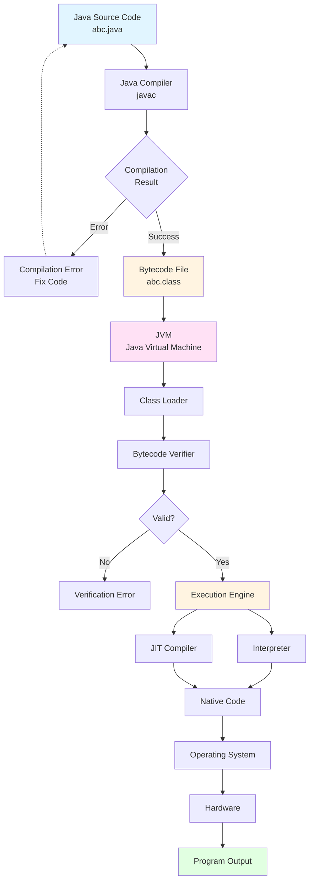
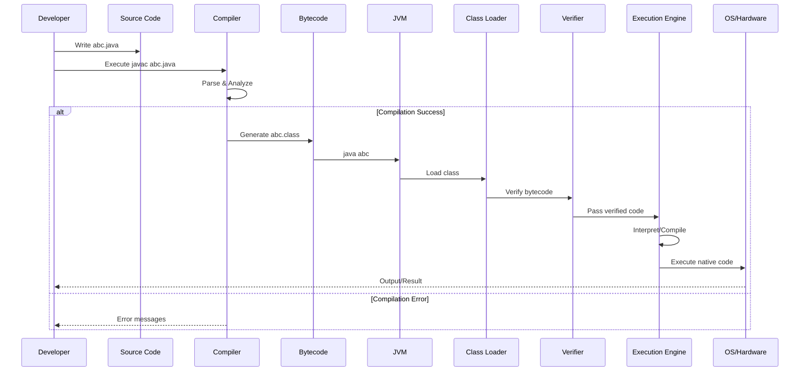
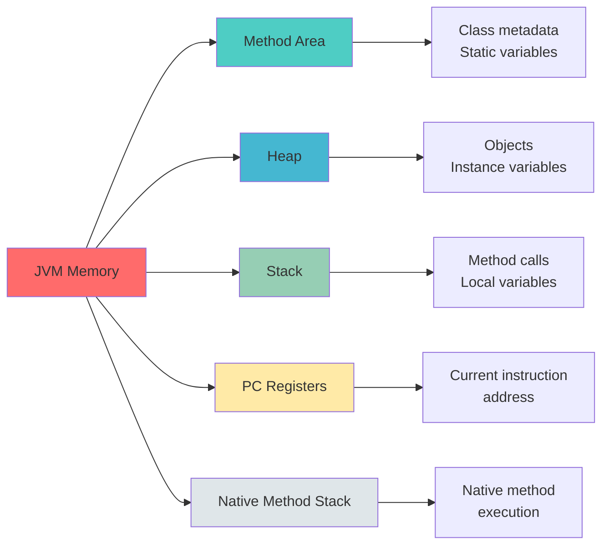

# Java Execution Process Flow

## Overview

Understanding how Java code executes is fundamental to working with the Java platform. Java uses a unique architecture that makes it platform-independent through the Java Virtual Machine (JVM).

## The Execution Process

### 1. **Writing Java Code**
Developers write source code in `.java` files using any text editor or IDE. This code follows Java syntax and programming conventions.

### 2. **Compilation Phase**
When you run the `javac` (Java Compiler) command, the compiler:
- Checks the source code for syntax errors
- Converts the `.java` file into bytecode
- Generates a `.class` file containing platform-independent bytecode

If there are compilation errors, the process stops here and error messages are displayed.

### 3. **JVM Execution Phase**

Once compilation is successful, the JVM takes over:

#### **Class Loader**
- Loads the `.class` file into memory
- Performs linking and verification
- Prepares the class for execution

#### **Bytecode Verifier**
- Ensures bytecode follows JVM specifications
- Checks for illegal code patterns
- Validates type safety and security constraints

#### **Execution Engine**
The execution engine has two main components:

**Interpreter**: Executes bytecode line by line (slower but starts quickly)

**JIT (Just-In-Time) Compiler**: Compiles frequently used bytecode into native machine code for faster execution

### 4. **Runtime Execution**
The optimized code runs on the operating system and hardware, producing the program output.

## Execution Flow Diagram

## Key Components Explained

### **Java Compiler (javac)**
- **Purpose**: Translates human-readable Java code to bytecode
- **Output**: `.class` files
- **Characteristics**: Compile-time error checking

### **JVM (Java Virtual Machine)**
- **Purpose**: Provides runtime environment for Java applications
- **Key Feature**: Platform independence ("Write Once, Run Anywhere")
- **Components**: Class Loader, Bytecode Verifier, Execution Engine

### **Class Loader**
- Loads classes dynamically as needed
- Performs three main activities: Loading, Linking, Initialization

### **Bytecode Verifier**
- Security component that validates bytecode
- Prevents illegal operations and malicious code

### **Execution Engine**
- **Interpreter**: Quick startup, slower execution
- **JIT Compiler**: Slower startup, faster execution after optimization
- Modern JVMs use both in combination

## Detailed Execution Flow

## Memory Areas in JVM

During execution, the JVM manages several memory areas:

## Why This Architecture?

**Platform Independence**: Bytecode can run on any platform with a JVM

**Security**: Bytecode verification prevents malicious code execution

**Performance**: JIT compilation optimizes frequently used code

**Memory Management**: Automatic garbage collection manages memory

## Summary

The Java execution process involves two main phases:
1. **Compile-time**: Source code → Bytecode
2. **Runtime**: Bytecode → Native code → Execution

This architecture is what makes Java a robust, secure, and platform-independent programming language.
