# Threads and Multitasking: OS vs Application Level

## Overview

Multitasking allows computers to execute multiple tasks concurrently. Understanding the difference between OS-level and application-level threading is crucial for building efficient applications.

## Types of Multitasking

### 1. **Process-Based Multitasking**
Multiple independent programs run simultaneously (e.g., browser, music player, text editor).

### 2. **Thread-Based Multitasking**
Multiple threads within a single program execute concurrently (e.g., downloading while rendering UI).

## Process vs Thread

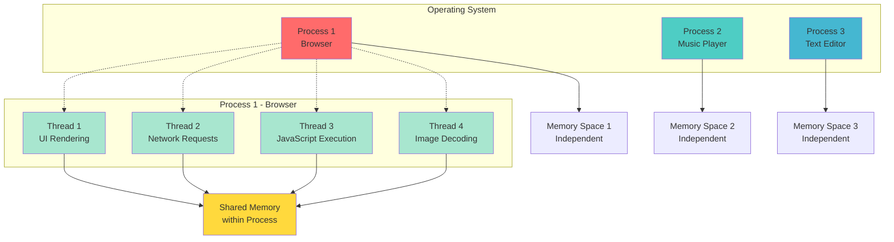

## Key Differences

| Aspect | Process | Thread |
|--------|---------|--------|
| **Memory** | Separate memory space | Shared memory within process |
| **Communication** | Inter-process communication (IPC) | Direct memory access |
| **Creation Cost** | Expensive | Lightweight |
| **Context Switching** | Slower | Faster |
| **Independence** | Fully independent | Share process resources |
| **Crash Impact** | Isolated | Can crash entire process |

## OS-Level Threading

### How Operating System Manages Threads

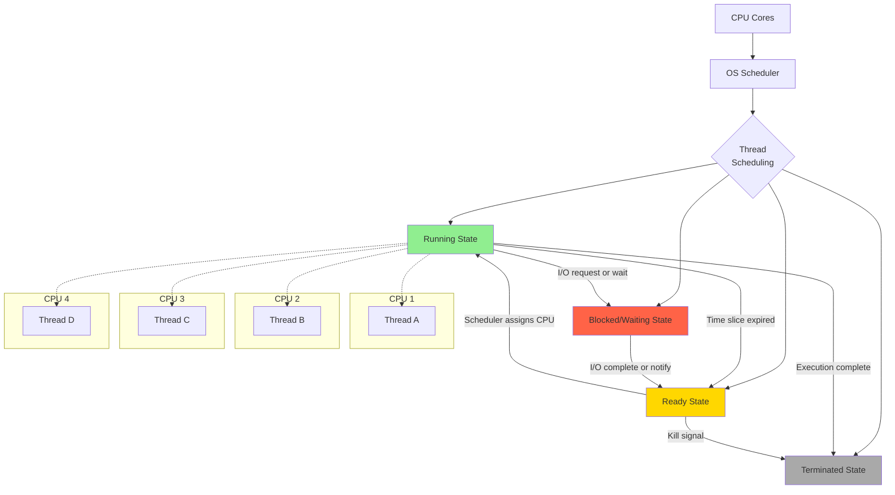

### OS Thread Types

#### **1. Kernel-Level Threads (OS Threads)**
- Managed directly by the operating system kernel
- OS scheduler handles thread scheduling
- True parallel execution on multiple CPU cores
- Higher overhead but better parallelism

#### **2. User-Level Threads (Green Threads)**
- Managed by application or runtime library
- OS sees them as a single process
- Faster context switching
- Cannot utilize multiple CPU cores directly

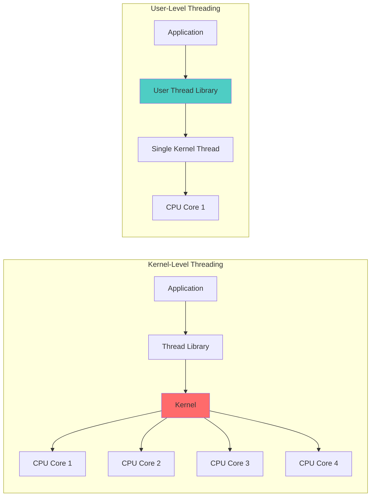

## Application-Level Threading

### Thread Lifecycle

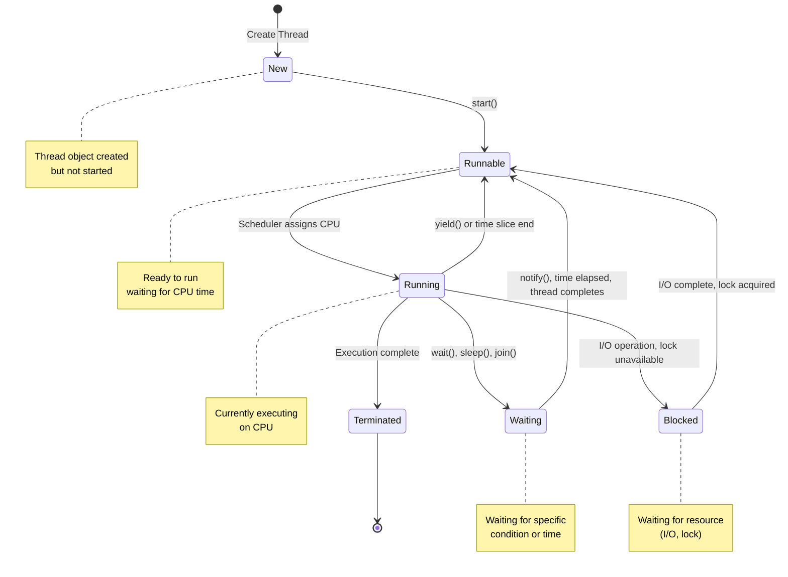

### Java Threading Model

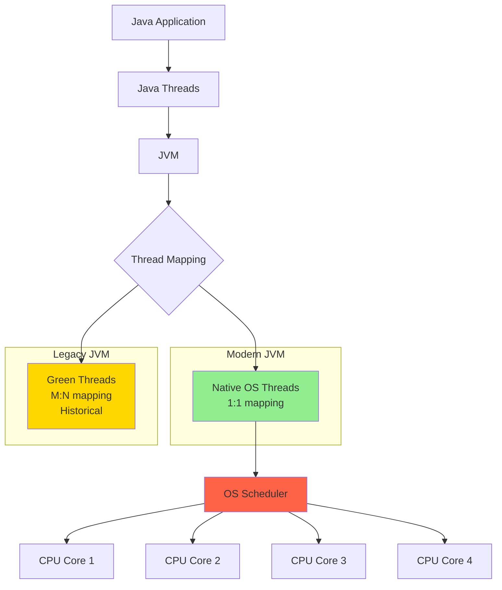

## Thread Scheduling Algorithms

### 1. **Preemptive Scheduling**
OS can interrupt a running thread to give CPU time to another thread.

### 2. **Cooperative Scheduling**
Threads voluntarily yield control (used in user-level threading).

### 3. **Priority-Based Scheduling**
Higher priority threads get CPU time first.

```mermaid
gantt
    title Thread Scheduling Timeline (Preemptive)
    dateFormat X
    axisFormat %L ms

    section CPU Core 1
    Thread A (High Priority)    :active, 0, 30
    Thread B (Medium Priority)  :active, 30, 50
    Thread A (High Priority)    :active, 50, 80
    Thread C (Low Priority)     :active, 80, 90
    Thread A (High Priority)    :active, 90, 120

    section CPU Core 2
    Thread D (High Priority)    :active, 0, 40
    Thread E (Medium Priority)  :active, 40, 70
    Thread D (High Priority)    :active, 70, 100
    Thread F (Low Priority)     :active, 100, 120
```

## Multithreading in Practice

### Example: Web Server Handling Requests

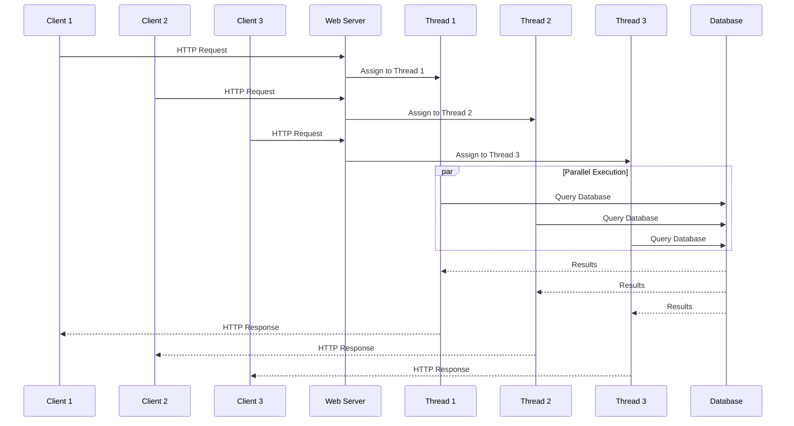

## Thread Synchronization

When multiple threads access shared resources, synchronization is needed.

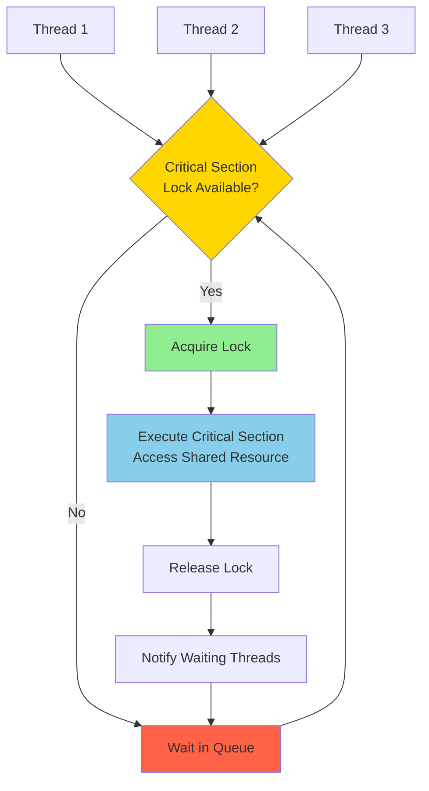

### Common Synchronization Mechanisms

1. **Mutex (Mutual Exclusion)**: Only one thread can access resource
2. **Semaphore**: Limited number of threads can access resource
3. **Monitor**: High-level synchronization construct
4. **Read-Write Locks**: Multiple readers or single writer
5. **Atomic Operations**: Lock-free synchronization

## Thread Pool Pattern

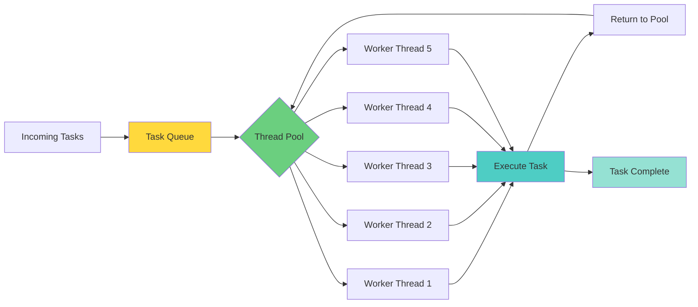

### Benefits of Thread Pools
- **Reuse**: Threads are reused instead of created/destroyed repeatedly
- **Control**: Limit number of concurrent threads
- **Performance**: Reduced overhead of thread creation
- **Resource Management**: Prevent resource exhaustion

## OS-Level vs Application-Level Comparison

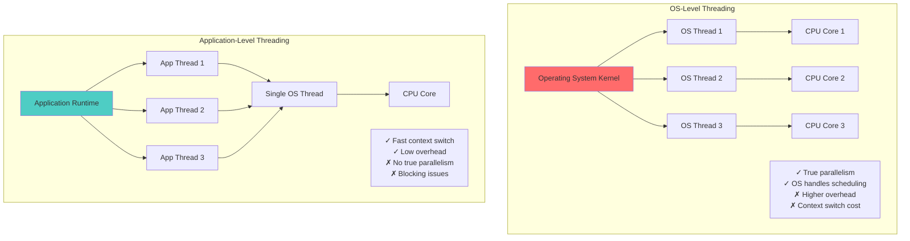

## Context Switching

### What Happens During Context Switch?

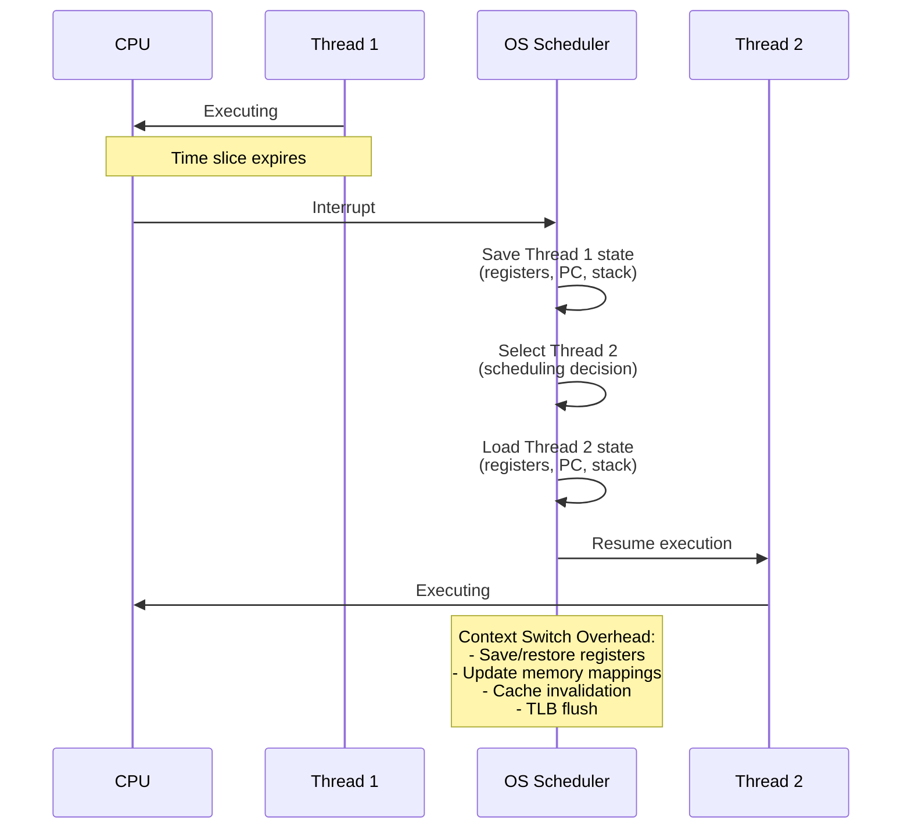

## Concurrency vs Parallelism

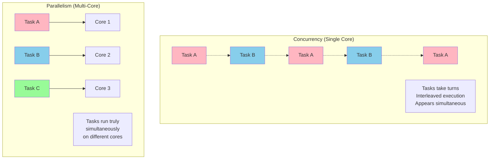

## Real-World Threading Examples

### 1. **GUI Applications**
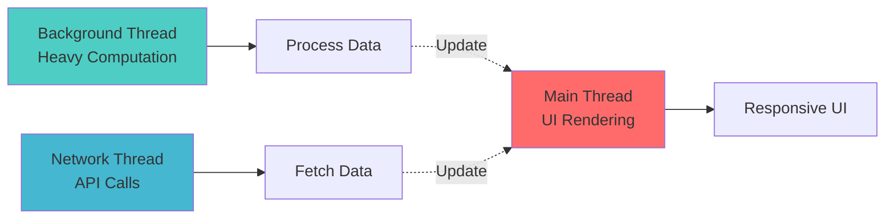

### 2. **Database Server**
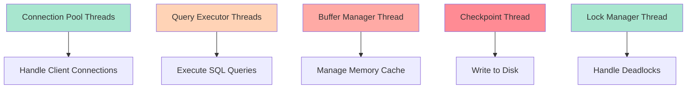

## Performance Considerations

### Thread Overhead

| Operation | Approximate Cost |
|-----------|-----------------|
| Thread creation | 10-100 microseconds |
| Context switch | 1-10 microseconds |
| Lock acquisition (uncontended) | ~25 nanoseconds |
| Lock acquisition (contended) | ~500 nanoseconds |

### Optimal Thread Count

```
Optimal Threads = Number of CPU Cores × (1 + Wait Time / Compute Time)
```

- **CPU-bound tasks**: Threads ≈ CPU cores
- **I/O-bound tasks**: Threads > CPU cores
- **Mixed workload**: Balance based on wait/compute ratio

## Best Practices

1. **Use Thread Pools** instead of creating threads manually
2. **Minimize Shared State** to reduce synchronization needs
3. **Prefer Immutable Objects** for thread safety
4. **Avoid Blocking Operations** in critical threads
5. **Use Async/Await Patterns** for I/O operations
6. **Profile Before Optimizing** thread counts
7. **Handle Thread Interruption** gracefully
8. **Consider Lock-Free Algorithms** for high contention

## Summary

### OS-Level Threading
- Managed by operating system kernel
- True parallelism on multi-core systems
- Higher overhead but better resource utilization
- Modern approach for most applications

### Application-Level Threading
- Managed by runtime or library
- Fast context switching
- Limited to single core historically
- Useful for specific scenarios (coroutines, fibers)

### Modern Trend
Most modern languages and runtimes use **hybrid approaches**:
- Map application threads to OS threads (Java, Python, C#)
- Use async/await for I/O operations
- Employ work-stealing thread pools for efficiency
