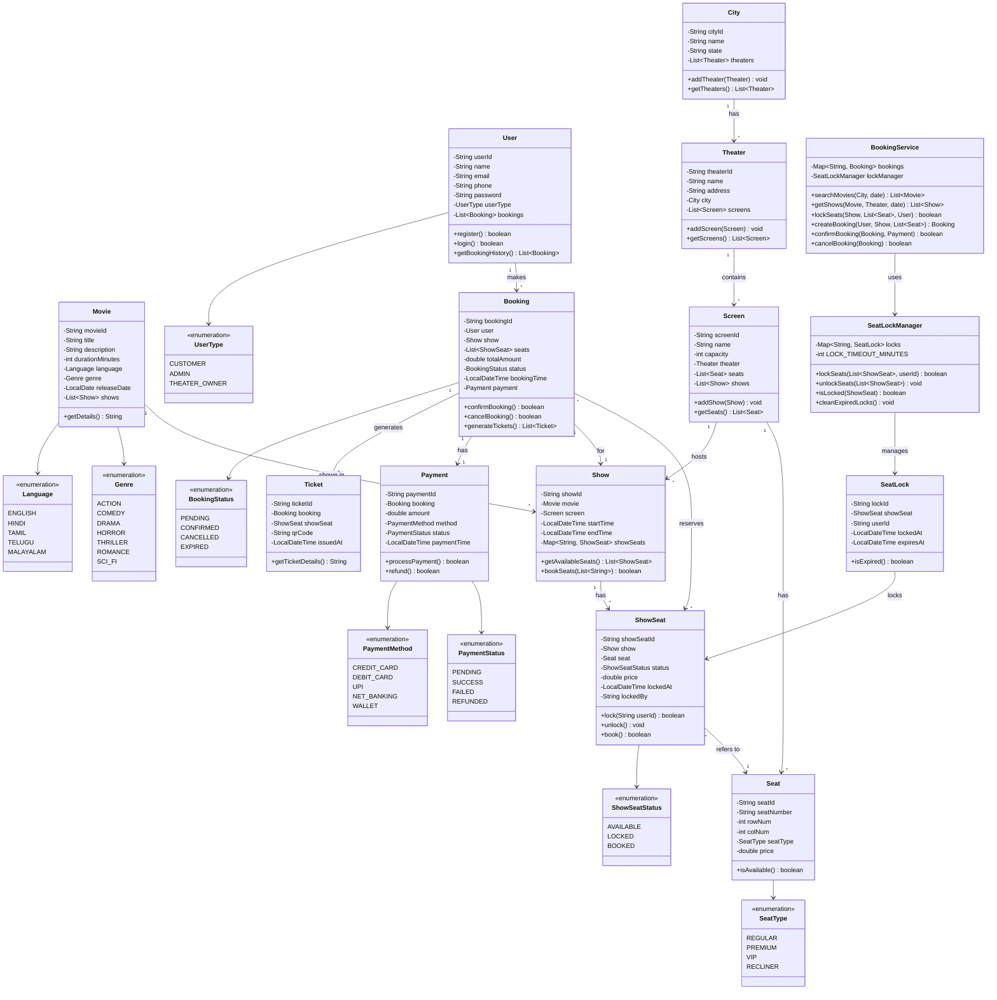

# BookMyShow

## Table of Contents

1. [Requirements Clarification](#requirements-clarification)
2. [Core Entities & Relationships](#core-entities--relationships)
3. [Class Design](#class-design)
4. [UML Class Diagram](#uml-class-diagram)
5. [Implementation](#implementation)
6. [Design Patterns & Best Practices](#design-patterns--best-practices)
7. [Concurrency & Seat Locking](#concurrency--seat-locking)
8. [Edge Cases & Extensions](#edge-cases--extensions)
9. [Summary](#summary)

---

## Requirements Clarification

### Functional Requirements

#### Core Features

- **User Management**: Registration, login, profile management
- **Movie Browsing**: Search and filter movies by city, genre, language
- **Theater Management**: View theaters showing specific movies
- **Show Management**: View showtimes for movies at different theaters
- **Seat Selection**: Browse available seats, select seats with layout visualization
- **Booking**: Reserve seats and create bookings
- **Payment Processing**: Process payments for bookings
- **Ticket Generation**: Generate tickets after successful payment
- **Booking History**: View past and upcoming bookings
- **Cancellation**: Cancel bookings with refund processing

#### Admin Features

- Add/update/remove movies
- Add/update/remove theaters and screens
- Add/update/remove shows
- Manage seat layouts
- View booking analytics

### Non-Functional Requirements

- **Concurrency**: Handle simultaneous booking requests (prevent double booking)
- **Consistency**: Ensure seat locking mechanism is reliable
- **Performance**: Fast search and booking (< 3 seconds)
- **Scalability**: Support millions of users and thousands of concurrent bookings
- **Availability**: 99.9% uptime
- **Security**: Secure payment processing and user data

### Capacity Estimates

- **Users**: 10 million registered users
- **Daily Active Users**: 500,000
- **Cities**: 100 cities
- **Theaters**: 2,000 theaters
- **Screens per Theater**: Average 5 screens
- **Shows per Screen**: 4-5 shows per day
- **Seats per Screen**: Average 200 seats
- **Daily Bookings**: 100,000 bookings

### Scope Boundaries

#### Included

- Movie and show management
- Seat selection with locking
- Booking and payment flow
- Search and filter functionality
- Cancellation and refunds
- User authentication

#### Excluded

- Food and beverage ordering
- Loyalty programs
- Real-time notifications (email/SMS)
- Movie ratings and reviews
- Streaming integration
- Physical ticket printing

---

## Core Entities & Relationships

### Main Entities

- **User**: Customers who book tickets
- **Movie**: Film information (title, genre, duration, language)
- **Theater**: Physical cinema location
- **Screen**: Auditorium within a theater
- **Show**: Specific screening of a movie in a screen at a time
- **Seat**: Individual seat in a screen with row/column
- **Booking**: Reservation made by a user
- **Payment**: Payment transaction for a booking
- **Ticket**: Confirmation ticket after successful payment
- **City**: Geographic location for theaters

### Key Relationships

- City **HAS-MANY** Theater (One-to-Many)
- Theater **HAS-MANY** Screen (One-to-Many)
- Screen **HAS-MANY** Seat (One-to-Many)
- Screen **HAS-MANY** Show (One-to-Many)
- Show **BELONGS-TO** Movie (Many-to-One)
- Show **BELONGS-TO** Screen (Many-to-One)
- User **HAS-MANY** Booking (One-to-Many)
- Booking **HAS-MANY** Seat (Many-to-Many through ShowSeat)
- Booking **HAS-ONE** Payment (One-to-One)
- Booking **GENERATES** Ticket (One-to-Many)

---

## Class Design

### Core Classes with Responsibilities

#### User Management

- **User**: Store user details, manage authentication
- **UserType**: Enum for customer/admin roles

#### Movie & Theater

- **Movie**: Store movie metadata
- **Theater**: Manage theater details and screens
- **Screen**: Manage screen layout and seats
- **City**: Store location information

#### Show & Booking

- **Show**: Represent movie screenings with timing
- **Seat**: Represent physical seats with type
- **ShowSeat**: Track seat availability for specific shows
- **Booking**: Manage reservation details
- **BookingStatus**: Enum for booking states

#### Payment & Tickets

- **Payment**: Process and track payments
- **PaymentStatus**: Enum for payment states
- **Ticket**: Generate confirmation tickets

#### Services

- **MovieService**: Handle movie operations
- **TheaterService**: Manage theater operations
- **BookingService**: Handle booking workflow
- **PaymentService**: Process payments
- **SeatLockManager**: Manage seat locking for concurrency

---

## UML Class Diagram



---

## Implementation

### Enums

#### UserType.java

```java
public enum UserType {
    CUSTOMER,
    ADMIN,
    THEATER_OWNER
}
```

#### Genre.java

```java
public enum Genre {
    ACTION,
    COMEDY,
    DRAMA,
    HORROR,
    THRILLER,
    ROMANCE,
    SCI_FI,
    ANIMATION,
    DOCUMENTARY
}
```

#### Language.java

```java
public enum Language {
    ENGLISH,
    HINDI,
    TAMIL,
    TELUGU,
    MALAYALAM,
    KANNADA,
    BENGALI,
    MARATHI
}
```

#### SeatType.java

```java
public enum SeatType {
    REGULAR(100.0),
    PREMIUM(150.0),
    VIP(200.0),
    RECLINER(300.0);

    private final double basePrice;

    SeatType(double basePrice) {
        this.basePrice = basePrice;
    }

    public double getBasePrice() {
        return basePrice;
    }
}
```

#### ShowSeatStatus.java

```java
public enum ShowSeatStatus {
    AVAILABLE,
    LOCKED,
    BOOKED
}
```

#### BookingStatus.java

```java
public enum BookingStatus {
    PENDING,
    CONFIRMED,
    CANCELLED,
    EXPIRED
}
```

#### PaymentStatus.java

```java
public enum PaymentStatus {
    PENDING,
    SUCCESS,
    FAILED,
    REFUNDED
}
```

#### PaymentMethod.java

```java
public enum PaymentMethod {
    CREDIT_CARD,
    DEBIT_CARD,
    UPI,
    NET_BANKING,
    WALLET
}
```

---

### Core Entity Classes

#### User.java

```java
import java.util.ArrayList;
import java.util.List;

public class User {
    private String userId;
    private String name;
    private String email;
    private String phone;
    private String passwordHash;
    private UserType userType;
    private List<Booking> bookings;

    public User(String userId, String name, String email, String phone,
                String passwordHash, UserType userType) {
        this.userId = userId;
        this.name = name;
        this.email = email;
        this.phone = phone;
        this.passwordHash = passwordHash;
        this.userType = userType;
        this.bookings = new ArrayList<>();
    }

    public void addBooking(Booking booking) {
        bookings.add(booking);
    }

    public List<Booking> getBookingHistory() {
        return new ArrayList<>(bookings);
    }

    // Getters
    public String getUserId() { return userId; }
    public String getName() { return name; }
    public String getEmail() { return email; }
    public String getPhone() { return phone; }
    public UserType getUserType() { return userType; }

    @Override
    public String toString() {
        return String.format("User[%s]: %s (%s)", userId, name, email);
    }
}
```

#### Movie.java

```java
import java.time.LocalDate;
import java.util.ArrayList;
import java.util.List;

public class Movie {
    private String movieId;
    private String title;
    private String description;
    private int durationMinutes;
    private Language language;
    private Genre genre;
    private LocalDate releaseDate;
    private List<Show> shows;

    public Movie(String movieId, String title, String description,
                 int durationMinutes, Language language, Genre genre,
                 LocalDate releaseDate) {
        this.movieId = movieId;
        this.title = title;
        this.description = description;
        this.durationMinutes = durationMinutes;
        this.language = language;
        this.genre = genre;
        this.releaseDate = releaseDate;
        this.shows = new ArrayList<>();
    }

    public void addShow(Show show) {
        shows.add(show);
    }

    public List<Show> getShows() {
        return new ArrayList<>(shows);
    }

    // Getters
    public String getMovieId() { return movieId; }
    public String getTitle() { return title; }
    public String getDescription() { return description; }
    public int getDurationMinutes() { return durationMinutes; }
    public Language getLanguage() { return language; }
    public Genre getGenre() { return genre; }
    public LocalDate getReleaseDate() { return releaseDate; }

    @Override
    public String toString() {
        return String.format("%s (%s) - %s | %d mins",
            title, language, genre, durationMinutes);
    }
}
```

#### City.java

```java
import java.util.ArrayList;
import java.util.List;

public class City {
    private String cityId;
    private String name;
    private String state;
    private List<Theater> theaters;

    public City(String cityId, String name, String state) {
        this.cityId = cityId;
        this.name = name;
        this.state = state;
        this.theaters = new ArrayList<>();
    }

    public void addTheater(Theater theater) {
        theaters.add(theater);
    }

    public List<Theater> getTheaters() {
        return new ArrayList<>(theaters);
    }

    // Getters
    public String getCityId() { return cityId; }
    public String getName() { return name; }
    public String getState() { return state; }

    @Override
    public String toString() {
        return String.format("%s, %s", name, state);
    }
}
```

#### Theater.java

```java
import java.util.ArrayList;
import java.util.List;

public class Theater {
    private String theaterId;
    private String name;
    private String address;
    private City city;
    private List<Screen> screens;

    public Theater(String theaterId, String name, String address, City city) {
        this.theaterId = theaterId;
        this.name = name;
        this.address = address;
        this.city = city;
        this.screens = new ArrayList<>();
    }

    public void addScreen(Screen screen) {
        screens.add(screen);
    }

    public List<Screen> getScreens() {
        return new ArrayList<>(screens);
    }

    // Getters
    public String getTheaterId() { return theaterId; }
    public String getName() { return name; }
    public String getAddress() { return address; }
    public City getCity() { return city; }

    @Override
    public String toString() {
        return String.format("%s - %s", name, address);
    }
}
```

#### Screen.java

```java
import java.util.ArrayList;
import java.util.List;

public class Screen {
    private String screenId;
    private String name;
    private int capacity;
    private Theater theater;
    private List<Seat> seats;
    private List<Show> shows;

    public Screen(String screenId, String name, Theater theater) {
        this.screenId = screenId;
        this.name = name;
        this.theater = theater;
        this.seats = new ArrayList<>();
        this.shows = new ArrayList<>();
        this.capacity = 0;
    }

    public void addSeat(Seat seat) {
        seats.add(seat);
        capacity++;
    }

    public void addShow(Show show) {
        shows.add(show);
    }

    public List<Seat> getSeats() {
        return new ArrayList<>(seats);
    }

    public List<Show> getShows() {
        return new ArrayList<>(shows);
    }

    // Getters
    public String getScreenId() { return screenId; }
    public String getName() { return name; }
    public int getCapacity() { return capacity; }
    public Theater getTheater() { return theater; }

    @Override
    public String toString() {
        return String.format("Screen %s (%d seats)", name, capacity);
    }
}
```

#### Seat.java

```java
public class Seat {
    private String seatId;
    private String seatNumber;
    private int rowNum;
    private int colNum;
    private SeatType seatType;

    public Seat(String seatId, int rowNum, int colNum, SeatType seatType) {
        this.seatId = seatId;
        this.rowNum = rowNum;
        this.colNum = colNum;
        this.seatType = seatType;
        this.seatNumber = generateSeatNumber(rowNum, colNum);
    }

    private String generateSeatNumber(int row, int col) {
        char rowChar = (char) ('A' + row);
        return String.format("%c%d", rowChar, col + 1);
    }

    // Getters
    public String getSeatId() { return seatId; }
    public String getSeatNumber() { return seatNumber; }
    public int getRowNum() { return rowNum; }
    public int getColNum() { return colNum; }
    public SeatType getSeatType() { return seatType; }

    @Override
    public String toString() {
        return String.format("%s (%s)", seatNumber, seatType);
    }
}
```

---

### Show and Booking Classes

#### Show.java

```java
import java.time.LocalDateTime;
import java.time.format.DateTimeFormatter;
import java.util.*;

public class Show {
    private String showId;
    private Movie movie;
    private Screen screen;
    private LocalDateTime startTime;
    private LocalDateTime endTime;
    private Map<String, ShowSeat> showSeats; // seatId -> ShowSeat

    public Show(String showId, Movie movie, Screen screen, LocalDateTime startTime) {
        this.showId = showId;
        this.movie = movie;
        this.screen = screen;
        this.startTime = startTime;
        this.endTime = startTime.plusMinutes(movie.getDurationMinutes());
        this.showSeats = new HashMap<>();
        initializeShowSeats();
    }

    private void initializeShowSeats() {
        for (Seat seat : screen.getSeats()) {
            ShowSeat showSeat = new ShowSeat(
                UUID.randomUUID().toString(),
                this,
                seat,
                seat.getSeatType().getBasePrice()
            );
            showSeats.put(seat.getSeatId(), showSeat);
        }
    }

    public List<ShowSeat> getAvailableSeats() {
        List<ShowSeat> available = new ArrayList<>();
        for (ShowSeat showSeat : showSeats.values()) {
            if (showSeat.getStatus() == ShowSeatStatus.AVAILABLE) {
                available.add(showSeat);
            }
        }
        return available;
    }

    public ShowSeat getShowSeat(String seatId) {
        return showSeats.get(seatId);
    }

    public Map<String, ShowSeat> getAllShowSeats() {
        return new HashMap<>(showSeats);
    }

    // Getters
    public String getShowId() { return showId; }
    public Movie getMovie() { return movie; }
    public Screen getScreen() { return screen; }
    public LocalDateTime getStartTime() { return startTime; }
    public LocalDateTime getEndTime() { return endTime; }

    @Override
    public String toString() {
        DateTimeFormatter formatter = DateTimeFormatter.ofPattern("dd-MMM-yyyy HH:mm");
        return String.format("Show: %s at %s - %s",
            movie.getTitle(), screen.getName(), startTime.format(formatter));
    }
}
```

#### ShowSeat.java

```java
import java.time.LocalDateTime;

public class ShowSeat {
    private String showSeatId;
    private Show show;
    private Seat seat;
    private ShowSeatStatus status;
    private double price;
    private LocalDateTime lockedAt;
    private String lockedBy;

    public ShowSeat(String showSeatId, Show show, Seat seat, double price) {
        this.showSeatId = showSeatId;
        this.show = show;
        this.seat = seat;
        this.price = price;
        this.status = ShowSeatStatus.AVAILABLE;
    }

    public synchronized boolean lock(String userId) {
        if (status == ShowSeatStatus.AVAILABLE) {
            status = ShowSeatStatus.LOCKED;
            lockedBy = userId;
            lockedAt = LocalDateTime.now();
            return true;
        }
        return false;
    }

    public synchronized void unlock() {
        if (status == ShowSeatStatus.LOCKED) {
            status = ShowSeatStatus.AVAILABLE;
            lockedBy = null;
            lockedAt = null;
        }
    }

    public synchronized boolean book() {
        if (status == ShowSeatStatus.LOCKED) {
            status = ShowSeatStatus.BOOKED;
            return true;
        }
        return false;
    }

    public boolean isLockedBy(String userId) {
        return status == ShowSeatStatus.LOCKED &&
               lockedBy != null &&
               lockedBy.equals(userId);
    }

    // Getters
    public String getShowSeatId() { return showSeatId; }
    public Show getShow() { return show; }
    public Seat getSeat() { return seat; }
    public ShowSeatStatus getStatus() { return status; }
    public double getPrice() { return price; }
    public LocalDateTime getLockedAt() { return lockedAt; }
    public String getLockedBy() { return lockedBy; }

    public void setStatus(ShowSeatStatus status) {
        this.status = status;
    }

    @Override
    public String toString() {
        return String.format("%s - %s ($%.2f)",
            seat.getSeatNumber(), status, price);
    }
}
```

#### Booking.java

```java
import java.time.LocalDateTime;
import java.util.ArrayList;
import java.util.List;
import java.util.UUID;

public class Booking {
    private String bookingId;
    private User user;
    private Show show;
    private List<ShowSeat> seats;
    private double totalAmount;
    private BookingStatus status;
    private LocalDateTime bookingTime;
    private Payment payment;
    private List<Ticket> tickets;

    public Booking(User user, Show show, List<ShowSeat> seats) {
        this.bookingId = "BK" + UUID.randomUUID().toString().substring(0, 8).toUpperCase();
        this.user = user;
        this.show = show;
        this.seats = new ArrayList<>(seats);
        this.status = BookingStatus.PENDING;
        this.bookingTime = LocalDateTime.now();
        this.tickets = new ArrayList<>();
        calculateTotalAmount();
    }

    private void calculateTotalAmount() {
        totalAmount = seats.stream()
            .mapToDouble(ShowSeat::getPrice)
            .sum();
    }

    public boolean confirmBooking() {
        if (payment != null && payment.getStatus() == PaymentStatus.SUCCESS) {
            status = BookingStatus.CONFIRMED;

            // Book all seats
            for (ShowSeat seat : seats) {
                seat.book();
            }

            // Generate tickets
            generateTickets();
            return true;
        }
        return false;
    }

    public boolean cancelBooking() {
        if (status == BookingStatus.CONFIRMED) {
            status = BookingStatus.CANCELLED;

            // Release seats
            for (ShowSeat seat : seats) {
                seat.setStatus(ShowSeatStatus.AVAILABLE);
            }

            // Process refund
            if (payment != null) {
                payment.refund();
            }
            return true;
        }
        return false;
    }

    private void generateTickets() {
        for (ShowSeat showSeat : seats) {
            Ticket ticket = new Ticket(this, showSeat);
            tickets.add(ticket);
        }
    }

    // Getters and Setters
    public String getBookingId() { return bookingId; }
    public User getUser() { return user; }
    public Show getShow() { return show; }
    public List<ShowSeat> getSeats() { return new ArrayList<>(seats); }
    public double getTotalAmount() { return totalAmount; }
    public BookingStatus getStatus() { return status; }
    public LocalDateTime getBookingTime() { return bookingTime; }
    public Payment getPayment() { return payment; }
    public void setPayment(Payment payment) { this.payment = payment; }
    public List<Ticket> getTickets() { return new ArrayList<>(tickets); }

    @Override
    public String toString() {
        return String.format("Booking %s: %s - %d seats - $%.2f - %s",
            bookingId, show.getMovie().getTitle(), seats.size(), totalAmount, status);
    }
}
```

---

### Payment and Ticket Classes

#### Payment.java

```java
import java.time.LocalDateTime;
import java.util.UUID;

public class Payment {
    private String paymentId;
    private Booking booking;
    private double amount;
    private PaymentMethod method;
    private PaymentStatus status;
    private LocalDateTime paymentTime;
    private String transactionId;

    public Payment(Booking booking, PaymentMethod method) {
        this.paymentId = "PAY" + UUID.randomUUID().toString().substring(0, 8).toUpperCase();
        this.booking = booking;
        this.amount = booking.getTotalAmount();
        this.method = method;
        this.status = PaymentStatus.PENDING;
    }

    public boolean processPayment() {
        // Simulate payment processing
        System.out.println("Processing payment of $" + amount + " via " + method);

        try {
            // Simulate payment gateway call
            Thread.sleep(1000);

            // Simulate success (in real system, this would be actual payment gateway response)
            this.status = PaymentStatus.SUCCESS;
            this.paymentTime = LocalDateTime.now();
            this.transactionId = "TXN" + UUID.randomUUID().toString().substring(0, 10).toUpperCase();

            System.out.println("✓ Payment successful! Transaction ID: " + transactionId);
            return true;

        } catch (Exception e) {
            this.status = PaymentStatus.FAILED;
            System.out.println("✗ Payment failed!");
            return false;
        }
    }

    public boolean refund() {
        if (status == PaymentStatus.SUCCESS) {
            System.out.println("Processing refund of $" + amount);
            this.status = PaymentStatus.REFUNDED;
            System.out.println("✓ Refund successful!");
            return true;
        }
        return false;
    }

    // Getters
    public String getPaymentId() { return paymentId; }
    public Booking getBooking() { return booking; }
    public double getAmount() { return amount; }
    public PaymentMethod getMethod() { return method; }
    public PaymentStatus getStatus() { return status; }
    public LocalDateTime getPaymentTime() { return paymentTime; }
    public String getTransactionId() { return transactionId; }

    @Override
    public String toString() {
        return String.format("Payment %s: $%.2f via %s - %s",
            paymentId, amount, method, status);
    }
}
```

#### Ticket.java

```java
import java.time.LocalDateTime;
import java.time.format.DateTimeFormatter;
import java.util.UUID;

public class Ticket {
    private String ticketId;
    private Booking booking;
    private ShowSeat showSeat;
    private String qrCode;
    private LocalDateTime issuedAt;

    public Ticket(Booking booking, ShowSeat showSeat) {
        this.ticketId = "TKT" + UUID.randomUUID().toString().substring(0, 8).toUpperCase();
        this.booking = booking;
        this.showSeat = showSeat;
        this.qrCode = generateQRCode();
        this.issuedAt = LocalDateTime.now();
    }

    private String generateQRCode() {
        // In real system, this would generate actual QR code
        return "QR-" + ticketId + "-" + showSeat.getSeat().getSeatNumber();
    }

    public String getTicketDetails() {
        DateTimeFormatter formatter = DateTimeFormatter.ofPattern("dd-MMM-yyyy HH:mm");
        StringBuilder details = new StringBuilder();
        details.append("========== TICKET ==========\n");
        details.append("Ticket ID: ").append(ticketId).append("\n");
        details.append("Booking ID: ").append(booking.getBookingId()).append("\n");
        details.append("Movie: ").append(booking.getShow().getMovie().getTitle()).append("\n");
        details.append("Theater: ").append(booking.getShow().getScreen().getTheater().getName()).append("\n");
        details.append("Screen: ").append(booking.getShow().getScreen().getName()).append("\n");
        details.append("Seat: ").append(showSeat.getSeat().getSeatNumber()).append("\n");
        details.append("Show Time: ").append(booking.getShow().getStartTime().format(formatter)).append("\n");
        details.append("Price: $").append(String.format("%.2f", showSeat.getPrice())).append("\n");
        details.append("QR Code: ").append(qrCode).append("\n");
        details.append("============================\n");
        return details.toString();
    }

    // Getters
    public String getTicketId() { return ticketId; }
    public Booking getBooking() { return booking; }
    public ShowSeat getShowSeat() { return showSeat; }
    public String getQrCode() { return qrCode; }
    public LocalDateTime getIssuedAt() { return issuedAt; }

    @Override
    public String toString() {
        return String.format("Ticket %s: %s - Seat %s",
            ticketId, booking.getShow().getMovie().getTitle(),
            showSeat.getSeat().getSeatNumber());
    }
}
```

---

### Service Classes

#### SeatLockManager.java

```java
import java.time.LocalDateTime;
import java.util.*;
import java.util.concurrent.ConcurrentHashMap;

public class SeatLockManager {
    private static final int LOCK_TIMEOUT_MINUTES = 10;
    private final Map<String, SeatLock> locks; // showSeatId -> SeatLock

    public SeatLockManager() {
        this.locks = new ConcurrentHashMap<>();
        startLockCleanupTask();
    }

    public synchronized boolean lockSeats(List<ShowSeat> seats, String userId) {
        // Check if all seats can be locked
        for (ShowSeat seat : seats) {
            if (!canLock(seat, userId)) {
                return false;
            }
        }

        // Lock all seats
        for (ShowSeat seat : seats) {
            if (seat.lock(userId)) {
                SeatLock lock = new SeatLock(seat, userId);
                locks.put(seat.getShowSeatId(), lock);
            }
        }

        System.out.println("✓ Locked " + seats.size() + " seats for user: " + userId);
        return true;
    }

    public synchronized void unlockSeats(List<ShowSeat> seats) {
        for (ShowSeat seat : seats) {
            seat.unlock();
            locks.remove(seat.getShowSeatId());
        }
        System.out.println("✓ Unlocked " + seats.size() + " seats");
    }

    private boolean canLock(ShowSeat seat, String userId) {
        if (seat.getStatus() == ShowSeatStatus.BOOKED) {
            return false;
        }

        if (seat.getStatus() == ShowSeatStatus.LOCKED) {
            // Check if locked by same user or if lock expired
            SeatLock lock = locks.get(seat.getShowSeatId());
            if (lock != null) {
                if (lock.getUserId().equals(userId)) {
                    return true; // Same user can re-lock
                }
                if (lock.isExpired()) {
                    // Expired lock, release it
                    seat.unlock();
                    locks.remove(seat.getShowSeatId());
                    return true;
                }
            }
            return false;
        }

        return true; // Available
    }

    public boolean isLocked(ShowSeat seat) {
        return locks.containsKey(seat.getShowSeatId());
    }

    public void cleanExpiredLocks() {
        List<String> expiredLocks = new ArrayList<>();

        for (Map.Entry<String, SeatLock> entry : locks.entrySet()) {
            if (entry.getValue().isExpired()) {
                expiredLocks.add(entry.getKey());
            }
        }

        for (String showSeatId : expiredLocks) {
            SeatLock lock = locks.remove(showSeatId);
            if (lock != null) {
                lock.getShowSeat().unlock();
            }
        }

        if (!expiredLocks.isEmpty()) {
            System.out.println("Cleaned " + expiredLocks.size() + " expired locks");
        }
    }

    private void startLockCleanupTask() {
        Timer timer = new Timer(true);
        timer.scheduleAtFixedRate(new TimerTask() {
            @Override
            public void run() {
                cleanExpiredLocks();
            }
        }, 60000, 60000); // Run every minute
    }

    // Inner class for seat locks
    private static class SeatLock {
        private final String lockId;
        private final ShowSeat showSeat;
        private final String userId;
        private final LocalDateTime lockedAt;
        private final LocalDateTime expiresAt;

        public SeatLock(ShowSeat showSeat, String userId) {
            this.lockId = UUID.randomUUID().toString();
            this.showSeat = showSeat;
            this.userId = userId;
            this.lockedAt = LocalDateTime.now();
            this.expiresAt = lockedAt.plusMinutes(LOCK_TIMEOUT_MINUTES);
        }

        public boolean isExpired() {
            return LocalDateTime.now().isAfter(expiresAt);
        }

        public ShowSeat getShowSeat() { return showSeat; }
        public String getUserId() { return userId; }
    }
}
```

#### BookingService.java

```java
import java.time.LocalDate;
import java.time.LocalDateTime;
import java.util.*;
import java.util.stream.Collectors;

public class BookingService {
    private final Map<String, Booking> bookings;
    private final SeatLockManager lockManager;
    private final Map<String, Movie> movies;
    private final Map<String, Theater> theaters;
    private final Map<String, Show> shows;

    public BookingService() {
        this.bookings = new HashMap<>();
        this.lockManager = new SeatLockManager();
        this.movies = new HashMap<>();
        this.theaters = new HashMap<>();
        this.shows = new HashMap<>();
    }

    // Movie search
    public List<Movie> searchMovies(City city, String title) {
        return movies.values().stream()
            .filter(m -> m.getTitle().toLowerCase().contains(title.toLowerCase()))
            .filter(m -> hasShowsInCity(m, city))
            .collect(Collectors.toList());
    }

    public List<Movie> getMoviesByCity(City city) {
        return movies.values().stream()
            .filter(m -> hasShowsInCity(m, city))
            .collect(Collectors.toList());
    }

    private boolean hasShowsInCity(Movie movie, City city) {
        return movie.getShows().stream()
            .anyMatch(show -> show.getScreen().getTheater().getCity().equals(city));
    }

    // Theater and Show search
    public List<Theater> getTheatersShowingMovie(Movie movie, City city) {
        return movie.getShows().stream()
            .map(show -> show.getScreen().getTheater())
            .filter(theater -> theater.getCity().equals(city))
            .distinct()
            .collect(Collectors.toList());
    }

    public List<Show> getShows(Movie movie, Theater theater, LocalDate date) {
        return movie.getShows().stream()
            .filter(show -> show.getScreen().getTheater().equals(theater))
            .filter(show -> show.getStartTime().toLocalDate().equals(date))
            .sorted(Comparator.comparing(Show::getStartTime))
            .collect(Collectors.toList());
    }

    // Seat availability
    public List<ShowSeat> getAvailableSeats(Show show) {
        return show.getAvailableSeats();
    }

    public Map<SeatType, List<ShowSeat>> getSeatsGroupedByType(Show show) {
        return show.getAvailableSeats().stream()
            .collect(Collectors.groupingBy(ss -> ss.getSeat().getSeatType()));
    }

    // Booking workflow
    public boolean lockSeats(Show show, List<String> seatIds, User user) {
        List<ShowSeat> seatsToLock = seatIds.stream()
            .map(show::getShowSeat)
            .filter(Objects::nonNull)
            .collect(Collectors.toList());

        if (seatsToLock.size() != seatIds.size()) {
            System.out.println("Some seats not found!");
            return false;
        }

        return lockManager.lockSeats(seatsToLock, user.getUserId());
    }

    public Booking createBooking(User user, Show show, List<String> seatIds) {
        List<ShowSeat> seats = seatIds.stream()
            .map(show::getShowSeat)
            .filter(Objects::nonNull)
            .filter(ss -> ss.isLockedBy(user.getUserId()))
            .collect(Collectors.toList());

        if (seats.size() != seatIds.size()) {
            System.out.println("Not all seats are locked by this user!");
            return null;
        }

        Booking booking = new Booking(user, show, seats);
        bookings.put(booking.getBookingId(), booking);
        user.addBooking(booking);

        System.out.println("✓ Booking created: " + booking.getBookingId());
        return booking;
    }

    public boolean confirmBooking(Booking booking, Payment payment) {
        booking.setPayment(payment);

        if (payment.processPayment()) {
            boolean confirmed = booking.confirmBooking();
            if (confirmed) {
                System.out.println("✓ Booking confirmed: " + booking.getBookingId());
                return true;
            }
        }

        // Payment failed, unlock seats
        lockManager.unlockSeats(booking.getSeats());
        System.out.println("✗ Booking failed: " + booking.getBookingId());
        return false;
    }

    public boolean cancelBooking(String bookingId) {
        Booking booking = bookings.get(bookingId);
        if (booking != null) {
            boolean cancelled = booking.cancelBooking();
            if (cancelled) {
                System.out.println("✓ Booking cancelled: " + bookingId);
                return true;
            }
        }
        return false;
    }

    // Admin operations
    public void addMovie(Movie movie) {
        movies.put(movie.getMovieId(), movie);
        System.out.println("✓ Movie added: " + movie.getTitle());
    }

    public void addTheater(Theater theater) {
        theaters.put(theater.getTheaterId(), theater);
        System.out.println("✓ Theater added: " + theater.getName());
    }

    public void addShow(Show show) {
        shows.put(show.getShowId(), show);
        show.getMovie().addShow(show);
        show.getScreen().addShow(show);
        System.out.println("✓ Show added: " + show);
    }

    // Getters
    public Booking getBooking(String bookingId) {
        return bookings.get(bookingId);
    }

    public Movie getMovie(String movieId) {
        return movies.get(movieId);
    }

    public Theater getTheater(String theaterId) {
        return theaters.get(theaterId);
    }

    public Show getShow(String showId) {
        return shows.get(showId);
    }
}
```

---

### Demo Application

#### BookMyShowDemo.java

```java
import java.time.LocalDate;
import java.time.LocalDateTime;
import java.util.Arrays;
import java.util.List;

public class BookMyShowDemo {
    public static void main(String[] args) {
        System.out.println("========== BookMyShow System Demo ==========\n");

        // Initialize service
        BookingService bookingService = new BookingService();

        // Setup: Create cities
        City mumbai = new City("C1", "Mumbai", "Maharashtra");
        City bangalore = new City("C2", "Bangalore", "Karnataka");

        // Setup: Create theaters
        Theater pvr = new Theater("T1", "PVR Cinemas", "Phoenix Mall, Mumbai", mumbai);
        Theater inox = new Theater("T2", "INOX", "Forum Mall, Bangalore", bangalore);
        mumbai.addTheater(pvr);
        bangalore.addTheater(inox);

        // Setup: Create screens
        Screen pvrScreen1 = new Screen("S1", "Screen 1", pvr);
        Screen pvrScreen2 = new Screen("S2", "Screen 2", pvr);
        Screen inoxScreen1 = new Screen("S3", "Screen 1", inox);
        pvr.addScreen(pvrScreen1);
        pvr.addScreen(pvrScreen2);
        inox.addScreen(inoxScreen1);

        // Setup: Create seats for screens
        createSeatsForScreen(pvrScreen1);
        createSeatsForScreen(pvrScreen2);
        createSeatsForScreen(inoxScreen1);

        // Setup: Create movies
        Movie inception = new Movie("M1", "Inception",
            "A mind-bending thriller", 148, Language.ENGLISH,
            Genre.SCI_FI, LocalDate.of(2010, 7, 16));

        Movie avengers = new Movie("M2", "Avengers: Endgame",
            "Epic superhero finale", 181, Language.ENGLISH,
            Genre.ACTION, LocalDate.of(2019, 4, 26));

        bookingService.addMovie(inception);
        bookingService.addMovie(avengers);
        bookingService.addTheater(pvr);
        bookingService.addTheater(inox);

        // Setup: Create shows
        LocalDateTime today = LocalDateTime.now();

        Show show1 = new Show("SH1", inception, pvrScreen1,
            today.withHour(14).withMinute(0));
        Show show2 = new Show("SH2", inception, pvrScreen1,
            today.withHour(18).withMinute(30));
        Show show3 = new Show("SH3", avengers, pvrScreen2,
            today.withHour(15).withMinute(0));
        Show show4 = new Show("SH4", avengers, inoxScreen1,
            today.withHour(19).withMinute(0));

        bookingService.addShow(show1);
        bookingService.addShow(show2);
        bookingService.addShow(show3);
        bookingService.addShow(show4);

        // Setup: Create users
        User user1 = new User("U1", "John Doe", "john@example.com",
            "9876543210", "hashedpass", UserType.CUSTOMER);
        User user2 = new User("U2", "Jane Smith", "jane@example.com",
            "9876543211", "hashedpass", UserType.CUSTOMER);

        System.out.println("========== SCENARIO 1: Search and Browse ==========\n");

        // Search movies in Mumbai
        System.out.println("Movies in Mumbai:");
        List<Movie> moviesInMumbai = bookingService.getMoviesByCity(mumbai);
        for (Movie movie : moviesInMumbai) {
            System.out.println("  - " + movie);
        }

        // Get theaters showing Inception
        System.out.println("\nTheaters showing Inception in Mumbai:");
        List<Theater> theaters = bookingService.getTheatersShowingMovie(inception, mumbai);
        for (Theater theater : theaters) {
            System.out.println("  - " + theater);
        }

        // Get shows
        System.out.println("\nShows for Inception at PVR today:");
        List<Show> shows = bookingService.getShows(inception, pvr, LocalDate.now());
        for (Show show : shows) {
            System.out.println("  - " + show);
        }

        System.out.println("\n========== SCENARIO 2: Successful Booking ==========\n");

        // Select show and view available seats
        Show selectedShow = show1;
        System.out.println("Selected: " + selectedShow);
        System.out.println("Available seats: " + selectedShow.getAvailableSeats().size());

        // Lock seats
        List<String> seatsToBook = Arrays.asList(
            pvrScreen1.getSeats().get(50).getSeatId(),  // Middle row, good seats
            pvrScreen1.getSeats().get(51).getSeatId()
        );

        System.out.println("\nAttempting to lock seats...");
        boolean locked = bookingService.lockSeats(selectedShow, seatsToBook, user1);

        if (locked) {
            // Create booking
            Booking booking = bookingService.createBooking(user1, selectedShow, seatsToBook);

            if (booking != null) {
                System.out.println("Booking created: " + booking);

                // Process payment
                Payment payment = new Payment(booking, PaymentMethod.UPI);
                boolean confirmed = bookingService.confirmBooking(booking, payment);

                if (confirmed) {
                    // Display tickets
                    System.out.println("\n--- Tickets Generated ---");
                    for (Ticket ticket : booking.getTickets()) {
                        System.out.println(ticket.getTicketDetails());
                    }
                }
            }
        }

        System.out.println("\n========== SCENARIO 3: Concurrent Booking Attempt ==========\n");

        // User 2 tries to book same seats
        System.out.println("User 2 attempting to book same seats...");
        boolean locked2 = bookingService.lockSeats(selectedShow, seatsToBook, user2);

        if (!locked2) {
            System.out.println("✗ Cannot lock seats - already booked by another user");
        }

        // User 2 books different seats
        List<String> differentSeats = Arrays.asList(
            pvrScreen1.getSeats().get(52).getSeatId(),
            pvrScreen1.getSeats().get(53).getSeatId(),
            pvrScreen1.getSeats().get(54).getSeatId()
        );

        System.out.println("\nUser 2 booking different seats...");
        locked2 = bookingService.lockSeats(selectedShow, differentSeats, user2);

        if (locked2) {
            Booking booking2 = bookingService.createBooking(user2, selectedShow, differentSeats);
            Payment payment2 = new Payment(booking2, PaymentMethod.CREDIT_CARD);
            bookingService.confirmBooking(booking2, payment2);
        }

        System.out.println("\n========== SCENARIO 4: Booking Cancellation ==========\n");

        // User 1 cancels booking
        System.out.println("User 1 requesting cancellation...");
        boolean cancelled = bookingService.cancelBooking(
            user1.getBookingHistory().get(0).getBookingId()
        );

        if (cancelled) {
            System.out.println("Refund processed successfully");
        }

        System.out.println("\n========== SCENARIO 5: View Booking History ==========\n");

        System.out.println("User 1 Booking History:");
        for (Booking booking : user1.getBookingHistory()) {
            System.out.println("  " + booking);
        }

        System.out.println("\nUser 2 Booking History:");
        for (Booking booking : user2.getBookingHistory()) {
            System.out.println("  " + booking);
        }

        System.out.println("\n========== Demo Complete ==========");
    }

    private static void createSeatsForScreen(Screen screen) {
        // Create 10 rows with 12 seats each (120 total)
        int rows = 10;
        int cols = 12;

        for (int row = 0; row < rows; row++) {
            for (int col = 0; col < cols; col++) {
                SeatType seatType;

                // Front 2 rows: REGULAR
                if (row < 2) {
                    seatType = SeatType.REGULAR;
                }
                // Middle 5 rows: PREMIUM
                else if (row < 7) {
                    seatType = SeatType.PREMIUM;
                }
                // Back 2 rows: VIP
                else if (row < 9) {
                    seatType = SeatType.VIP;
                }
                // Last row: RECLINER
                else {
                    seatType = SeatType.RECLINER;
                }

                String seatId = screen.getScreenId() + "-R" + row + "C" + col;
                Seat seat = new Seat(seatId, row, col, seatType);
                screen.addSeat(seat);
            }
        }

        System.out.println("Created " + screen.getCapacity() + " seats for " + screen.getName());
    }
}
```

## Design Patterns & Best Practices

### Design Patterns Used

#### 1. **Singleton Pattern**

- **SeatLockManager**: Ensures only one instance manages all seat locks
- Prevents conflicts in concurrent booking scenarios

#### 2. **Factory Pattern**

- Could be extended for creating different types of users, payments, or tickets
- Example: `UserFactory`, `PaymentFactory`

#### 3. **Strategy Pattern**

- **PaymentMethod**: Different payment strategies (UPI, Card, etc.)
- Allows easy addition of new payment methods

#### 4. **Observer Pattern**

- Could be implemented for:
  - Notifying users about booking confirmation
  - Sending email/SMS notifications
  - Updating booking analytics

#### 5. **State Pattern**

- **BookingStatus**: Manages booking lifecycle (PENDING → CONFIRMED → CANCELLED)
- **PaymentStatus**: Manages payment states
- **ShowSeatStatus**: Manages seat states (AVAILABLE → LOCKED → BOOKED)

#### 6. **Repository Pattern**

- Service classes act as repositories for data access
- Separates business logic from data storage

### SOLID Principles

#### Single Responsibility Principle (SRP)

- Each class has one clear responsibility:
  - `User`: User management
  - `Booking`: Booking logic
  - `Payment`: Payment processing
  - `SeatLockManager`: Seat locking only

#### Open/Closed Principle (OCP)

- Enums for extensibility (PaymentMethod, SeatType)
- Easy to add new payment methods or seat types
- Service classes can be extended without modification

#### Liskov Substitution Principle (LSP)

- All entities can be substituted with their base types
- Inheritance hierarchies maintain behavior contracts

#### Interface Segregation Principle (ISP)

- Classes don't depend on interfaces they don't use
- Focused, minimal interfaces

#### Dependency Inversion Principle (DIP)

- High-level modules (BookingService) depend on abstractions
- Could be improved with interfaces for services

---

## Concurrency & Seat Locking

### Concurrency Challenges

#### Problem: Double Booking

When multiple users try to book the same seat simultaneously:

```
Time    User A              User B
t1      Check seat status
t2      Seat is available   Check seat status
t3                          Seat is available
t4      Book seat           Book seat
        ❌ BOTH BOOKED!
```

### Solution: Pessimistic Locking

#### Seat Lock Mechanism

1. **Lock Before Booking**
   - User selects seats → Seats are locked for 10 minutes
   - Other users cannot lock the same seats
   - If payment not completed in 10 minutes → Lock expires

2. **Synchronized Methods**

   ```java
   public synchronized boolean lock(String userId) {
       if (status == ShowSeatStatus.AVAILABLE) {
           status = ShowSeatStatus.LOCKED;
           lockedBy = userId;
           lockedAt = LocalDateTime.now();
           return true;
       }
       return false;
   }
   ```

3. **Lock Expiration**
   - Background thread cleans expired locks every minute
   - Prevents indefinite seat blocking
   - Releases seats if user abandons booking

#### Thread Safety

- **ConcurrentHashMap**: Used for storing locks
- **Synchronized methods**: Prevent race conditions
- **Atomic operations**: Lock/unlock happen atomically

### Booking Flow with Locking

```
1. User selects seats
   ↓
2. System locks seats (10-min timeout)
   ↓
3. User proceeds to payment
   ↓
4. Payment processed
   ↓
5a. SUCCESS → Seats booked, lock removed
5b. FAILURE → Seats unlocked, available again
5c. TIMEOUT → Lock expires, seats released
```

---

## Edge Cases & Extensions

### Edge Cases Handled

#### 1. **Expired Locks**

- Background cleanup task releases expired locks
- Seats become available again after timeout

#### 2. **Payment Failure**

- Locked seats are released immediately
- User can retry booking

#### 3. **Concurrent Lock Attempts**

- Only first user gets the lock
- Others receive failure notification

#### 4. **Same User Re-locking**

- User can extend their own lock
- Prevents accidental seat loss during booking

#### 5. **Show Time Conflicts**

- Validation can be added to prevent overlapping shows
- Buffer time between shows for cleaning

#### 6. **Cancellation Window**

- Can add time-based cancellation rules
- Full refund if cancelled 24 hours before show
- Partial refund if cancelled later

### Potential Extensions

#### 1. **Dynamic Pricing**

```java
public class DynamicPricingService {
    public double calculatePrice(ShowSeat seat, LocalDateTime showTime) {
        double basePrice = seat.getPrice();

        // Weekend pricing
        if (isWeekend(showTime)) {
            basePrice *= 1.2;
        }

        // Prime time (evening shows)
        if (isPrimeTime(showTime)) {
            basePrice *= 1.15;
        }

        // High demand (> 80% occupancy)
        if (getOccupancyRate(seat.getShow()) > 0.8) {
            basePrice *= 1.25;
        }

        return basePrice;
    }
}
```

#### 2. **Seat Recommendations**

```java
public class SeatRecommendationService {
    public List<ShowSeat> recommendSeats(Show show, int numSeats) {
        // Find best available seats based on:
        // - Center position
        // - Row preference (middle rows)
        // - Contiguous seats
        // - User preferences (aisle, window)
    }
}
```

#### 3. **Loyalty Program**

```java
public class LoyaltyProgram {
    private Map<String, Integer> userPoints;

    public void awardPoints(User user, Booking booking) {
        int points = (int) (booking.getTotalAmount() * 0.1);
        userPoints.merge(user.getUserId(), points, Integer::sum);
    }

    public double applyDiscount(User user, double amount) {
        int points = userPoints.getOrDefault(user.getUserId(), 0);
        double discount = Math.min(points * 0.1, amount * 0.2); // Max 20% discount
        return amount - discount;
    }
}
```

#### 4. **Food & Beverage**

```java
public class FoodOrder {
    private String orderId;
    private Booking booking;
    private List<FoodItem> items;
    private double totalAmount;

    public void addToBooking(Booking booking) {
        // Add food order to booking
        // Deliver to seat during show
    }
}
```

#### 5. **Notifications**

```java
public interface NotificationService {
    void sendBookingConfirmation(User user, Booking booking);
    void sendCancellationConfirmation(User user, Booking booking);
    void sendReminder(User user, Booking booking, int hoursBeforeShow);
}

public class EmailNotificationService implements NotificationService {
    // Email implementation
}

public class SMSNotificationService implements NotificationService {
    // SMS implementation
}
```

#### 6. **Analytics Dashboard**

```java
public class AnalyticsService {
    public BookingAnalytics getAnalytics(LocalDate startDate, LocalDate endDate) {
        // Revenue by movie
        // Popular time slots
        // Occupancy rates
        // User demographics
        // Cancellation rates
        return new BookingAnalytics();
    }
}
```

---

## Summary

### Key Design Decisions

1. **Seat Locking**: Prevents double booking with 10-minute timeout
2. **Three-State Seat Status**: AVAILABLE → LOCKED → BOOKED
3. **Separation of Concerns**: Services handle business logic, entities hold data
4. **Enum-Based Configuration**: Easy to extend seat types, payment methods, etc.
5. **Thread Safety**: Synchronized methods and concurrent collections

### Scalability Considerations

#### Database Design

- **Indexing**: On movieId, theaterId, showTime, userId
- **Partitioning**: Shows by date, bookings by user
- **Caching**: Popular movies, theater listings, available seats

#### Distributed Systems

- **Load Balancer**: Distribute booking requests
- **Redis**: For seat locking across multiple servers
- **Message Queue**: For async operations (notifications, analytics)
- **CDN**: For static content (movie posters, theater images)

#### Performance Optimization

- **Read Replicas**: For search queries
- **Write-Heavy Optimization**: Booking confirmations
- **Connection Pooling**: Database connections
- **Caching Strategy**:
  - Movie list: 1 hour TTL
  - Show timings: 15 minutes TTL
  - Seat availability: Real-time (no cache)

### Testing Strategy

1. **Unit Tests**: Individual class methods
2. **Integration Tests**: Service interactions
3. **Concurrency Tests**: Multiple simultaneous bookings
4. **Load Tests**: 1000s of concurrent users
5. **Edge Case Tests**: Timeouts, failures, race conditions

### Future Enhancements

- Mobile app integration
- Social features (group bookings, sharing)
- AI-based seat recommendations
- Virtual reality seat preview
- Blockchain-based ticketing
- Integration with streaming platforms
- Multi-language support
- Accessibility features (wheelchair seats, audio descriptions)
