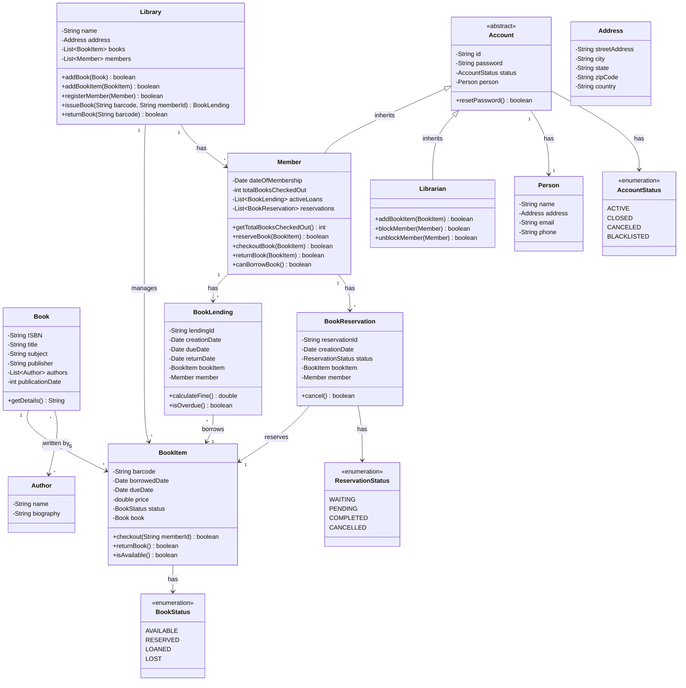

# Library Management System

## Table of Contents

1. [Requirements Clarification](#requirements-clarification)
2. [Core Entities & Relationships](#core-entities--relationships)
3. [Class Design](#class-design)
4. [UML Class Diagram](#uml-class-diagram)
5. [Implementation](#implementation)
6. [Edge Cases & Extensions](#edge-cases--extensions)
7. [Summary](#summary)

---

## Requirements Clarification

### Functional Requirements

- **Book Management**: Add, remove, update, and search books
- **Member Management**: Register members, issue library cards
- **Borrowing**: Members can borrow books (checkout)
- **Returning**: Members can return borrowed books
- **Search**: Search books by title, author, ISBN, or subject
- **Fine Calculation**: Calculate fines for overdue books
- **Reservation**: Members can reserve books that are currently borrowed

### Non-Functional Requirements

- **Scalability**: Support multiple branches (optional)
- **Performance**: Fast search operations
- **Constraints**: Max 5 books per member, 14-day borrowing period
- **Concurrency**: Handle multiple transactions simultaneously

### Scope Boundaries

#### Included
- Core lending operations
- Member and book management
- Fine calculation
- Basic search

#### Excluded
- Payment processing
- E-book management
- Inter-library loans
- Complex recommendation systems

---

## Core Entities & Relationships

### Main Entities

- **Book**: Represents a book metadata
- **BookItem**: Physical copy of a book (composition with Book)
- **Member**: Library member who can borrow books
- **Librarian**: Staff who manages the library (inherits from Account)
- **BookLending**: Represents a borrowing transaction
- **BookReservation**: Represents a book reservation
- **Library**: Central system managing all operations

### Key Relationships

- Book **HAS-MANY** BookItem (Composition)
- Member **HAS-MANY** BookLending (Association)
- BookItem **HAS-ONE** BookLending (Association)
- Account **IS-A** base class for Member and Librarian (Inheritance)

---

## Class Design

### Core Classes with Responsibilities

- **Book**: Stores book metadata (title, author, ISBN, publisher)
- **BookItem**: Represents individual physical copies with barcode, status (Available, Reserved, Loaned, Lost)
- **Member**: Can borrow/return books, reserve books, has borrowing limits
- **Librarian**: Can add/remove books, manage members, block/unblock accounts
- **BookLending**: Tracks lending transaction with due date, return date, fine calculation
- **Library**: Singleton orchestrating all operations

---

## UML Class Diagram



---

## Implementation

### Enums

#### BookStatus.java

```java
public enum BookStatus {
    AVAILABLE,
    RESERVED,
    LOANED,
    LOST
}
```

#### ReservationStatus.java

```java
public enum ReservationStatus {
    WAITING,
    PENDING,
    COMPLETED,
    CANCELLED,
    NONE
}
```

#### AccountStatus.java

```java
public enum AccountStatus {
    ACTIVE,
    CLOSED,
    CANCELED,
    BLACKLISTED
}
```

---

### Basic Classes

#### Address.java

```java
public class Address {
    private String streetAddress;
    private String city;
    private String state;
    private String zipCode;
    private String country;

    public Address(String street, String city, String state, String zip, String country) {
        this.streetAddress = street;
        this.city = city;
        this.state = state;
        this.zipCode = zip;
        this.country = country;
    }

    public String getFullAddress() {
        return streetAddress + ", " + city + ", " + state + " " + zipCode + ", " + country;
    }
}
```

#### Person.java

```java
public class Person {
    private String name;
    private Address address;
    private String email;
    private String phone;

    public Person(String name, Address address, String email, String phone) {
        this.name = name;
        this.address = address;
        this.email = email;
        this.phone = phone;
    }

    public String getName() {
        return name;
    }

    public String getEmail() {
        return email;
    }
}
```

#### Author.java

```java
public class Author {
    private String name;
    private String biography;

    public Author(String name, String biography) {
        this.name = name;
        this.biography = biography;
    }

    public String getName() {
        return name;
    }
}
```

---

### Core Domain Classes

#### Book.java

```java
import java.util.ArrayList;
import java.util.List;

public class Book {
    private String ISBN;
    private String title;
    private String subject;
    private String publisher;
    private List<Author> authors;
    private int publicationDate;

    public Book(String ISBN, String title, String subject, String publisher, int publicationDate) {
        this.ISBN = ISBN;
        this.title = title;
        this.subject = subject;
        this.publisher = publisher;
        this.publicationDate = publicationDate;
        this.authors = new ArrayList<>();
    }

    public void addAuthor(Author author) {
        authors.add(author);
    }

    public String getISBN() {
        return ISBN;
    }

    public String getTitle() {
        return title;
    }

    public String getSubject() {
        return subject;
    }

    public List<Author> getAuthors() {
        return authors;
    }

    public String getDetails() {
        StringBuilder details = new StringBuilder();
        details.append("Title: ").append(title).append("\n");
        details.append("ISBN: ").append(ISBN).append("\n");
        details.append("Subject: ").append(subject).append("\n");
        details.append("Authors: ");
        for (Author author : authors) {
            details.append(author.getName()).append(", ");
        }
        return details.toString();
    }
}
```

#### BookItem.java

```java
import java.util.Date;
import java.util.concurrent.TimeUnit;

public class BookItem {
    private String barcode;
    private Date borrowedDate;
    private Date dueDate;
    private double price;
    private BookStatus status;
    private Book book;

    public BookItem(String barcode, Book book, double price) {
        this.barcode = barcode;
        this.book = book;
        this.price = price;
        this.status = BookStatus.AVAILABLE;
    }

    public boolean checkout(String memberId) {
        if (status != BookStatus.AVAILABLE) {
            return false;
        }
        status = BookStatus.LOANED;
        borrowedDate = new Date();
        dueDate = new Date(borrowedDate.getTime() + TimeUnit.DAYS.toMillis(14));
        return true;
    }

    public boolean returnBook() {
        if (status != BookStatus.LOANED) {
            return false;
        }
        status = BookStatus.AVAILABLE;
        borrowedDate = null;
        dueDate = null;
        return true;
    }

    public boolean isAvailable() {
        return status == BookStatus.AVAILABLE;
    }

    public String getBarcode() {
        return barcode;
    }

    public BookStatus getStatus() {
        return status;
    }

    public void setStatus(BookStatus status) {
        this.status = status;
    }

    public Book getBook() {
        return book;
    }

    public Date getDueDate() {
        return dueDate;
    }

    public Date getBorrowedDate() {
        return borrowedDate;
    }

    public double getPrice() {
        return price;
    }
}
```

---

### Account Hierarchy

#### Account.java

```java
public abstract class Account {
    private String id;
    private String password;
    private AccountStatus status;
    private Person person;

    public Account(String id, String password, Person person) {
        this.id = id;
        this.password = password;
        this.person = person;
        this.status = AccountStatus.ACTIVE;
    }

    public boolean resetPassword(String newPassword) {
        this.password = newPassword;
        return true;
    }

    public String getId() {
        return id;
    }

    public AccountStatus getStatus() {
        return status;
    }

    public void setStatus(AccountStatus status) {
        this.status = status;
    }

    public Person getPerson() {
        return person;
    }
}
```

#### Member.java

```java
import java.util.ArrayList;
import java.util.Date;
import java.util.List;

public class Member extends Account {
    private Date dateOfMembership;
    private int totalBooksCheckedOut;
    private List<BookLending> activeLoans;
    private List<BookReservation> reservations;
    private static final int MAX_BOOKS_LIMIT = 5;

    public Member(String id, String password, Person person) {
        super(id, password, person);
        this.dateOfMembership = new Date();
        this.totalBooksCheckedOut = 0;
        this.activeLoans = new ArrayList<>();
        this.reservations = new ArrayList<>();
    }

    public int getTotalBooksCheckedOut() {
        return totalBooksCheckedOut;
    }

    public boolean canBorrowBook() {
        return totalBooksCheckedOut < MAX_BOOKS_LIMIT &&
               getStatus() == AccountStatus.ACTIVE;
    }

    public boolean checkoutBook(BookItem bookItem) {
        if (!canBorrowBook()) {
            System.out.println("Cannot borrow more books. Limit reached or account not active.");
            return false;
        }
        if (!bookItem.isAvailable()) {
            System.out.println("Book is not available.");
            return false;
        }

        BookLending lending = new BookLending(bookItem, this);
        activeLoans.add(lending);
        totalBooksCheckedOut++;
        bookItem.checkout(getId());
        return true;
    }

    public boolean returnBook(BookItem bookItem) {
        BookLending lendingToReturn = null;
        for (BookLending lending : activeLoans) {
            if (lending.getBookItem().getBarcode().equals(bookItem.getBarcode())) {
                lendingToReturn = lending;
                break;
            }
        }

        if (lendingToReturn == null) {
            System.out.println("This book was not borrowed by this member.");
            return false;
        }

        lendingToReturn.returnBook();
        activeLoans.remove(lendingToReturn);
        totalBooksCheckedOut--;
        bookItem.returnBook();

        double fine = lendingToReturn.calculateFine();
        if (fine > 0) {
            System.out.println("Fine to be paid: $" + fine);
        }

        return true;
    }

    public boolean reserveBook(BookItem bookItem) {
        if (bookItem.getStatus() == BookStatus.AVAILABLE) {
            System.out.println("Book is available. No need to reserve.");
            return false;
        }
        BookReservation reservation = new BookReservation(bookItem, this);
        reservations.add(reservation);
        bookItem.setStatus(BookStatus.RESERVED);
        return true;
    }

    public List<BookLending> getActiveLoans() {
        return activeLoans;
    }

    public List<BookReservation> getReservations() {
        return reservations;
    }
}
```

#### Librarian.java

```java
public class Librarian extends Account {

    public Librarian(String id, String password, Person person) {
        super(id, password, person);
    }

    public boolean addBookItem(Library library, BookItem bookItem) {
        return library.addBookItem(bookItem);
    }

    public boolean blockMember(Member member) {
        if (member.getStatus() == AccountStatus.ACTIVE) {
            member.setStatus(AccountStatus.BLACKLISTED);
            System.out.println("Member " + member.getId() + " has been blocked.");
            return true;
        }
        return false;
    }

    public boolean unblockMember(Member member) {
        if (member.getStatus() == AccountStatus.BLACKLISTED) {
            member.setStatus(AccountStatus.ACTIVE);
            System.out.println("Member " + member.getId() + " has been unblocked.");
            return true;
        }
        return false;
    }
}
```

---

### Transaction Classes

#### BookLending.java

```java
import java.util.Date;
import java.util.UUID;
import java.util.concurrent.TimeUnit;

public class BookLending {
    private String lendingId;
    private Date creationDate;
    private Date dueDate;
    private Date returnDate;
    private BookItem bookItem;
    private Member member;
    private static final double FINE_PER_DAY = 1.0;

    public BookLending(BookItem bookItem, Member member) {
        this.lendingId = UUID.randomUUID().toString();
        this.creationDate = new Date();
        this.bookItem = bookItem;
        this.member = member;
        this.dueDate = new Date(creationDate.getTime() + TimeUnit.DAYS.toMillis(14));
    }

    public double calculateFine() {
        if (returnDate == null) {
            returnDate = new Date();
        }

        if (returnDate.after(dueDate)) {
            long diffInMillis = returnDate.getTime() - dueDate.getTime();
            long daysLate = TimeUnit.MILLISECONDS.toDays(diffInMillis);
            return daysLate * FINE_PER_DAY;
        }
        return 0.0;
    }

    public boolean isOverdue() {
        return new Date().after(dueDate) && returnDate == null;
    }

    public void returnBook() {
        this.returnDate = new Date();
    }

    public String getLendingId() {
        return lendingId;
    }

    public Date getCreationDate() {
        return creationDate;
    }

    public Date getDueDate() {
        return dueDate;
    }

    public Date getReturnDate() {
        return returnDate;
    }

    public BookItem getBookItem() {
        return bookItem;
    }

    public Member getMember() {
        return member;
    }
}
```

#### BookReservation.java

```java
import java.util.Date;
import java.util.UUID;

public class BookReservation {
    private String reservationId;
    private Date creationDate;
    private ReservationStatus status;
    private BookItem bookItem;
    private Member member;

    public BookReservation(BookItem bookItem, Member member) {
        this.reservationId = UUID.randomUUID().toString();
        this.creationDate = new Date();
        this.bookItem = bookItem;
        this.member = member;
        this.status = ReservationStatus.WAITING;
    }

    public boolean cancel() {
        if (status == ReservationStatus.WAITING || status == ReservationStatus.PENDING) {
            status = ReservationStatus.CANCELLED;
            bookItem.setStatus(BookStatus.AVAILABLE);
            return true;
        }
        return false;
    }

    public String getReservationId() {
        return reservationId;
    }

    public ReservationStatus getStatus() {
        return status;
    }

    public void setStatus(ReservationStatus status) {
        this.status = status;
    }

    public BookItem getBookItem() {
        return bookItem;
    }

    public Member getMember() {
        return member;
    }
}
```

---

### Library (Facade/Orchestrator)

#### Library.java

```java
import java.util.*;

public class Library {
    private String name;
    private Address address;
    private List<BookItem> bookItems;
    private Map<String, Book> books;
    private Map<String, Member> members;
    private Map<String, BookItem> bookItemMap;

    private static Library instance;

    private Library(String name, Address address) {
        this.name = name;
        this.address = address;
        this.bookItems = new ArrayList<>();
        this.books = new HashMap<>();
        this.members = new HashMap<>();
        this.bookItemMap = new HashMap<>();
    }

    public static Library getInstance(String name, Address address) {
        if (instance == null) {
            synchronized (Library.class) {
                if (instance == null) {
                    instance = new Library(name, address);
                }
            }
        }
        return instance;
    }

    public boolean addBook(Book book) {
        if (books.containsKey(book.getISBN())) {
            System.out.println("Book already exists in catalog.");
            return false;
        }
        books.put(book.getISBN(), book);
        return true;
    }

    public boolean addBookItem(BookItem bookItem) {
        if (bookItemMap.containsKey(bookItem.getBarcode())) {
            System.out.println("Book item with this barcode already exists.");
            return false;
        }
        bookItems.add(bookItem);
        bookItemMap.put(bookItem.getBarcode(), bookItem);

        Book book = bookItem.getBook();
        if (!books.containsKey(book.getISBN())) {
            books.put(book.getISBN(), book);
        }
        return true;
    }

    public boolean registerMember(Member member) {
        if (members.containsKey(member.getId())) {
            System.out.println("Member already registered.");
            return false;
        }
        members.put(member.getId(), member);
        return true;
    }

    public BookLending issueBook(String barcode, String memberId) {
        BookItem bookItem = bookItemMap.get(barcode);
        Member member = members.get(memberId);

        if (bookItem == null) {
            System.out.println("Book item not found.");
            return null;
        }

        if (member == null) {
            System.out.println("Member not found.");
            return null;
        }

        if (member.checkoutBook(bookItem)) {
            System.out.println("Book issued successfully to " + member.getPerson().getName());
            List<BookLending> loans = member.getActiveLoans();
            return loans.get(loans.size() - 1);
        }
        return null;
    }

    public boolean returnBook(String barcode, String memberId) {
        BookItem bookItem = bookItemMap.get(barcode);
        Member member = members.get(memberId);

        if (bookItem == null || member == null) {
            System.out.println("Book item or member not found.");
            return false;
        }

        return member.returnBook(bookItem);
    }

    public List<BookItem> searchByTitle(String title) {
        List<BookItem> result = new ArrayList<>();
        for (BookItem item : bookItems) {
            if (item.getBook().getTitle().toLowerCase().contains(title.toLowerCase())
                && item.isAvailable()) {
                result.add(item);
            }
        }
        return result;
    }

    public List<BookItem> searchByAuthor(String authorName) {
        List<BookItem> result = new ArrayList<>();
        for (BookItem item : bookItems) {
            for (Author author : item.getBook().getAuthors()) {
                if (author.getName().toLowerCase().contains(authorName.toLowerCase())
                    && item.isAvailable()) {
                    result.add(item);
                    break;
                }
            }
        }
        return result;
    }

    public List<BookItem> searchByISBN(String ISBN) {
        List<BookItem> result = new ArrayList<>();
        Book book = books.get(ISBN);
        if (book != null) {
            for (BookItem item : bookItems) {
                if (item.getBook().getISBN().equals(ISBN) && item.isAvailable()) {
                    result.add(item);
                }
            }
        }
        return result;
    }

    public List<BookItem> searchBySubject(String subject) {
        List<BookItem> result = new ArrayList<>();
        for (BookItem item : bookItems) {
            if (item.getBook().getSubject().toLowerCase().contains(subject.toLowerCase())
                && item.isAvailable()) {
                result.add(item);
            }
        }
        return result;
    }

    public String getName() {
        return name;
    }

    public Map<String, Member> getMembers() {
        return members;
    }

    public Map<String, BookItem> getBookItemMap() {
        return bookItemMap;
    }
}
```

---

### Demo/Test Class

#### LibraryManagementDemo.java

```java
public class LibraryManagementDemo {
    public static void main(String[] args) {
        Address libraryAddress = new Address("123 Main St", "New York", "NY", "10001", "USA");
        Library library = Library.getInstance("Central Library", libraryAddress);

        Author author1 = new Author("Robert Martin", "Software engineer and author");
        Author author2 = new Author("Joshua Bloch", "Java architect");

        Book book1 = new Book("978-0132350884", "Clean Code", "Programming", "Prentice Hall", 2008);
        book1.addAuthor(author1);

        Book book2 = new Book("978-0134685991", "Effective Java", "Programming", "Addison-Wesley", 2017);
        book2.addAuthor(author2);

        BookItem item1 = new BookItem("BC001", book1, 45.99);
        BookItem item2 = new BookItem("BC002", book1, 45.99);
        BookItem item3 = new BookItem("BC003", book2, 50.00);

        library.addBookItem(item1);
        library.addBookItem(item2);
        library.addBookItem(item3);

        Address memberAddress = new Address("456 Elm St", "New York", "NY", "10002", "USA");
        Person person1 = new Person("John Doe", memberAddress, "john@email.com", "555-1234");
        Member member1 = new Member("M001", "password123", person1);

        Person person2 = new Person("Jane Smith", memberAddress, "jane@email.com", "555-5678");
        Member member2 = new Member("M002", "password456", person2);

        library.registerMember(member1);
        library.registerMember(member2);

        Person librarianPerson = new Person("Alice Johnson", libraryAddress, "alice@library.com", "555-9999");
        Librarian librarian = new Librarian("L001", "libpass", librarianPerson);

        System.out.println("=== Library Management System Demo ===\n");

        System.out.println("--- Member borrowing books ---");
        library.issueBook("BC001", "M001");
        library.issueBook("BC003", "M001");

        System.out.println("\n--- Searching for books by title 'Clean' ---");
        List<BookItem> searchResults = library.searchByTitle("Clean");
        for (BookItem item : searchResults) {
            System.out.println("Found: " + item.getBook().getTitle() + " (Barcode: " + item.getBarcode() + ")");
        }

        System.out.println("\n--- Member 2 trying to borrow already borrowed book ---");
        library.issueBook("BC001", "M002");

        System.out.println("\n--- Member 2 reserving the book ---");
        member2.reserveBook(item1);

        System.out.println("\n--- Member 1's active loans ---");
        for (BookLending loan : member1.getActiveLoans()) {
            System.out.println("Book: " + loan.getBookItem().getBook().getTitle() +
                             ", Due Date: " + loan.getDueDate());
        }

        System.out.println("\n--- Member 1 returning book ---");
        library.returnBook("BC001", "M001");

        System.out.println("\n--- Checking remaining loans ---");
        System.out.println("Member 1 has " + member1.getTotalBooksCheckedOut() + " books checked out.");

        System.out.println("\n--- Librarian blocking member ---");
        librarian.blockMember(member1);

        System.out.println("\n--- Blocked member trying to borrow ---");
        library.issueBook("BC002", "M001");

        System.out.println("\n--- Librarian unblocking member ---");
        librarian.unblockMember(member1);

        System.out.println("\n=== Demo Complete ===");
    }
}
```

---

## Edge Cases & Extensions

### Edge Cases Handled

- **Max Book Limit**: Members cannot borrow more than 5 books
- **Account Status Check**: Blocked members cannot borrow
- **Book Availability**: Cannot borrow already loaned books
- **Fine Calculation**: Automatic fine calculation for overdue books
- **Duplicate Prevention**: Cannot add duplicate books or members

### Design Patterns Used

- **Singleton Pattern**: Library class (central management)
- **Factory Pattern**: Can be used for creating different types of books
- **Strategy Pattern**: Can be implemented for different fine calculation strategies
- **Observer Pattern**: Can notify members when reserved books become available

### Scalability Considerations

#### Current Implementation

- In-memory storage using HashMaps for O(1) lookups
- Simple list-based search (can be improved)

#### Improvements for Production

- **Database Integration**: Use JPA/Hibernate with relational DB
- **Caching**: Redis for frequently accessed data
- **Search Optimization**: ElasticSearch for full-text search
- **Concurrency**: Add synchronization or use concurrent collections
- **Notification System**: Email/SMS for due dates and reservations
- **Analytics**: Track popular books, borrowing patterns
- **Multi-branch Support**: Add branch entity and routing logic

### Thread Safety Enhancements

```java
// For production, add synchronization
public synchronized boolean checkoutBook(BookItem bookItem) {
    // Implementation with thread safety
}

// Or use ConcurrentHashMap
private ConcurrentHashMap<String, Member> members = new ConcurrentHashMap<>();
```

### Additional Features (Extensions)

- **Rack System**: Organize books by rack location
- **Late Fee Payment**: Integration with payment gateway
- **Book Renewal**: Extend due date if no reservations
- **Digital Library Card**: QR code generation
- **Reading History**: Track all books read by member
- **Recommendation Engine**: Suggest books based on history
