# Notification System Design

## Table of Contents

1. [Overview](#overview)
2. [Requirements Analysis](#requirements-analysis)
3. [System Architecture](#system-architecture)
4. [Core Components](#core-components)
5. [Class Design](#class-design)
6. [UML Class Diagram](#uml-class-diagram)
7. [Implementation](#implementation)
8. [Design Patterns](#design-patterns)
9. [Scalability Considerations](#scalability-considerations)
10. [Advanced Features](#advanced-features)

---

## Overview

A general-purpose Notification System is a critical infrastructure component that enables applications to communicate with users through multiple channels (email, SMS, push notifications, in-app messages, etc.). This system must be scalable, reliable, and extensible to support various notification types and delivery mechanisms.

### Key Characteristics

- **Multi-Channel Support**: Email, SMS, Push, In-App, Webhook
- **Priority-Based Delivery**: Critical, High, Medium, Low priority levels
- **Template Management**: Reusable notification templates
- **User Preferences**: Per-user channel and frequency settings
- **Retry Mechanism**: Automatic retry for failed deliveries
- **Rate Limiting**: Prevent notification spam
- **Analytics**: Track delivery status and engagement metrics

---

## Requirements Analysis

### Functional Requirements

#### Core Features

1. **Send Notifications**: Support multiple channels simultaneously
2. **Template Management**: Create, update, delete notification templates
3. **User Preferences**: Manage user notification settings per channel
4. **Scheduling**: Send notifications immediately or schedule for later
5. **Batching**: Group similar notifications for efficient delivery
6. **Status Tracking**: Monitor delivery status (sent, delivered, failed, read)
7. **Retry Logic**: Automatic retry with exponential backoff
8. **Priority Handling**: Process high-priority notifications first

#### Notification Types

- **Transactional**: Account verification, password reset, receipts
- **Marketing**: Promotional campaigns, newsletters
- **Alert**: System alerts, security warnings
- **Reminder**: Upcoming events, deadlines
- **Social**: Comments, likes, mentions
- **System**: Service updates, maintenance notices

### Non-Functional Requirements

- **Scalability**: Handle millions of notifications per day
- **Reliability**: 99.9% delivery success rate
- **Performance**: `<100ms` notification processing time
- **Availability**: 99.99% uptime
- **Idempotency**: Prevent duplicate notifications
- **Compliance**: GDPR, CAN-SPAM, TCPA compliance

### Constraints

- **Rate Limits**: Respect third-party API limits (Twilio, SendGrid)
- **Cost Optimization**: Minimize delivery costs
- **Delivery Windows**: Respect user timezone and quiet hours
- **Message Size**: Channel-specific size limitations

---

## System Architecture

### High-Level Architecture

```
┌─────────────┐
│ Application │
└──────┬──────┘
       │
       ▼
┌─────────────────────────────────┐
│   Notification Service API      │
│  - Send Notification            │
│  - Schedule Notification        │
│  - Get Status                   │
└──────┬──────────────────────────┘
       │
       ▼
┌─────────────────────────────────┐
│   Notification Manager          │
│  - Validation                   │
│  - Template Processing          │
│  - Priority Queue               │
└──────┬──────────────────────────┘
       │
       ├─────────────┬──────────────┬──────────────┐
       ▼             ▼              ▼              ▼
┌──────────┐  ┌──────────┐  ┌──────────┐  ┌──────────┐
│  Email   │  │   SMS    │  │   Push   │  │  In-App  │
│ Channel  │  │ Channel  │  │ Channel  │  │ Channel  │
└──────────┘  └──────────┘  └──────────┘  └──────────┘
       │             │              │              │
       ▼             ▼              ▼              ▼
┌──────────┐  ┌──────────┐  ┌──────────┐  ┌──────────┐
│SendGrid  │  │  Twilio  │  │ Firebase │  │ Database │
└──────────┘  └──────────┘  └──────────┘  └──────────┘
```

### Component Layers

1. **API Layer**: REST/GraphQL endpoints for notification requests
2. **Business Logic Layer**: Validation, template processing, routing
3. **Channel Layer**: Channel-specific implementations
4. **Persistence Layer**: Store notifications, templates, preferences
5. **Queue Layer**: Message queue for async processing (Kafka, RabbitMQ)
6. **Monitoring Layer**: Metrics, logging, alerting

---

## Core Components

### 1. Notification Service

Central orchestrator that receives notification requests and coordinates delivery.

**Responsibilities**:
- Accept notification requests
- Validate input
- Apply user preferences
- Route to appropriate channels
- Track delivery status

### 2. Channel Interface

Abstract interface defining common operations for all notification channels.

**Responsibilities**:
- Send notification
- Validate channel-specific requirements
- Handle delivery failures
- Report delivery status

### 3. Template Engine

Manages notification templates with variable substitution.

**Responsibilities**:
- Store templates
- Render templates with dynamic data
- Support multiple languages
- Version control for templates

### 4. User Preference Manager

Manages user notification preferences.

**Responsibilities**:
- Store user preferences
- Determine allowed channels
- Respect quiet hours
- Manage opt-outs

### 5. Queue Manager

Handles asynchronous notification processing.

**Responsibilities**:
- Priority-based queuing
- Load balancing
- Dead letter queue handling
- Rate limiting

### 6. Retry Handler

Manages failed notification retries.

**Responsibilities**:
- Exponential backoff
- Maximum retry attempts
- Failure notifications
- Circuit breaker pattern

---

## Class Design

### Core Classes

#### NotificationService (Facade)
- Central entry point for notification operations
- Coordinates between all components

#### Notification (Entity)
- Represents a notification instance
- Contains recipient, content, metadata

#### NotificationChannel (Interface)
- Defines contract for all channels
- Implemented by EmailChannel, SMSChannel, etc.

#### NotificationTemplate
- Stores reusable templates
- Supports variable substitution

#### UserPreference
- Stores user notification settings
- Channel-specific preferences

#### NotificationQueue
- Priority queue implementation
- Handles async processing

#### NotificationStatus (Enum)
- PENDING, QUEUED, SENT, DELIVERED, FAILED, CANCELLED

#### NotificationPriority (Enum)
- CRITICAL, HIGH, MEDIUM, LOW

---

## UML Class Diagram

```mermaid
classDiagram
    class NotificationService {
        -NotificationQueue queue
        -TemplateEngine templateEngine
        -PreferenceManager preferenceManager
        -Map~String, NotificationChannel~ channels
        +sendNotification(Notification) String
        +scheduleNotification(Notification, Date) String
        +getNotificationStatus(String id) NotificationStatus
        +cancelNotification(String id) boolean
    }

    class Notification {
        -String id
        -String recipientId
        -NotificationType type
        -NotificationPriority priority
        -String subject
        -String content
        -Map~String, Object~ data
        -List~ChannelType~ channels
        -Date createdAt
        -Date scheduledAt
        -NotificationStatus status
        +getId() String
        +validate() boolean
        +isExpired() boolean
    }

    class NotificationChannel {
        <<interface>>
        +send(Notification) DeliveryResult
        +validateConfig() boolean
        +getChannelType() ChannelType
        +isAvailable() boolean
    }

    class EmailChannel {
        -String smtpHost
        -int smtpPort
        -String apiKey
        +send(Notification) DeliveryResult
        +sendBatch(List~Notification~) List~DeliveryResult~
        -formatEmailContent(Notification) EmailMessage
    }

    class SMSChannel {
        -String apiKey
        -String phoneNumber
        -int maxLength
        +send(Notification) DeliveryResult
        -validatePhoneNumber(String) boolean
        -truncateMessage(String) String
    }

    class PushChannel {
        -String serverKey
        -String appId
        +send(Notification) DeliveryResult
        +sendToTopic(String topic, Notification) DeliveryResult
        -buildPushPayload(Notification) PushPayload
    }

    class InAppChannel {
        -NotificationRepository repository
        +send(Notification) DeliveryResult
        +markAsRead(String notificationId) boolean
        +getUnreadCount(String userId) int
    }

    class WebhookChannel {
        -String webhookUrl
        -Map~String, String~ headers
        +send(Notification) DeliveryResult
        -signPayload(String) String
    }

    class TemplateEngine {
        -Map~String, NotificationTemplate~ templates
        +registerTemplate(NotificationTemplate) void
        +renderTemplate(String templateId, Map~String, Object~) String
        +validateTemplate(String template) boolean
        +getTemplate(String id) NotificationTemplate
    }

    class NotificationTemplate {
        -String id
        -String name
        -ChannelType channelType
        -String subject
        -String body
        -String language
        -int version
        +render(Map~String, Object~) String
        +clone() NotificationTemplate
    }

    class PreferenceManager {
        -Map~String, UserPreference~ preferences
        +getUserPreference(String userId) UserPreference
        +updatePreference(String userId, UserPreference) void
        +isChannelEnabled(String userId, ChannelType) boolean
        +isQuietHours(String userId) boolean
    }

    class UserPreference {
        -String userId
        -Map~ChannelType, Boolean~ enabledChannels
        -Map~NotificationType, Boolean~ enabledTypes
        -TimeRange quietHours
        -String timezone
        -String language
        +isChannelEnabled(ChannelType) boolean
        +canReceiveAt(Date time) boolean
    }

    class NotificationQueue {
        -PriorityQueue~Notification~ highPriority
        -PriorityQueue~Notification~ normalPriority
        -ExecutorService executor
        +enqueue(Notification) void
        +dequeue() Notification
        +process() void
        +getQueueSize() int
    }

    class DeliveryResult {
        -String notificationId
        -ChannelType channel
        -DeliveryStatus status
        -String messageId
        -Date deliveredAt
        -String errorMessage
        -int retryCount
        +isSuccess() boolean
        +shouldRetry() boolean
    }

    class RetryHandler {
        -int maxRetries
        -long baseDelayMs
        -Map~String, RetryContext~ retryMap
        +shouldRetry(DeliveryResult) boolean
        +scheduleRetry(Notification, DeliveryResult) void
        +getNextRetryTime(int attempt) Date
        -calculateBackoff(int attempt) long
    }

    class NotificationLogger {
        -LogRepository repository
        +logSent(Notification, ChannelType) void
        +logDelivered(String id, ChannelType) void
        +logFailed(String id, String error) void
        +getNotificationHistory(String userId) List~NotificationLog~
    }

    class RateLimiter {
        -Map~String, TokenBucket~ userBuckets
        -int maxPerHour
        -int maxPerDay
        +allowRequest(String userId, ChannelType) boolean
        +getRemainingQuota(String userId) int
        -refillBuckets() void
    }

    class NotificationStatus {
        <<enumeration>>
        PENDING
        QUEUED
        PROCESSING
        SENT
        DELIVERED
        FAILED
        CANCELLED
        EXPIRED
    }

    class NotificationType {
        <<enumeration>>
        TRANSACTIONAL
        MARKETING
        ALERT
        REMINDER
        SOCIAL
        SYSTEM
    }

    class NotificationPriority {
        <<enumeration>>
        CRITICAL
        HIGH
        MEDIUM
        LOW
    }

    class ChannelType {
        <<enumeration>>
        EMAIL
        SMS
        PUSH
        IN_APP
        WEBHOOK
    }

    class DeliveryStatus {
        <<enumeration>>
        SUCCESS
        FAILED
        RETRY
        SKIPPED
    }

    NotificationService --> NotificationQueue
    NotificationService --> TemplateEngine
    NotificationService --> PreferenceManager
    NotificationService --> NotificationChannel
    NotificationService --> RetryHandler
    NotificationService --> RateLimiter

    NotificationChannel <|.. EmailChannel
    NotificationChannel <|.. SMSChannel
    NotificationChannel <|.. PushChannel
    NotificationChannel <|.. InAppChannel
    NotificationChannel <|.. WebhookChannel

    Notification --> NotificationStatus
    Notification --> NotificationType
    Notification --> NotificationPriority
    Notification --> ChannelType

    NotificationChannel --> DeliveryResult
    DeliveryResult --> DeliveryStatus

    TemplateEngine --> NotificationTemplate
    NotificationTemplate --> ChannelType

    PreferenceManager --> UserPreference
    UserPreference --> ChannelType
    UserPreference --> NotificationType

    RetryHandler --> DeliveryResult
    NotificationLogger --> Notification
```



---

## Implementation

### Enums

#### NotificationStatus.java

```java
public enum NotificationStatus {
    PENDING,      // Created but not yet queued
    QUEUED,       // In queue waiting for processing
    PROCESSING,   // Currently being processed
    SENT,         // Sent to provider
    DELIVERED,    // Confirmed delivery
    FAILED,       // Delivery failed
    CANCELLED,    // Cancelled before delivery
    EXPIRED       // Expired before delivery
}
```

#### NotificationType.java

```java
public enum NotificationType {
    TRANSACTIONAL,  // Account-related, high priority
    MARKETING,      // Promotional content
    ALERT,          // Important system alerts
    REMINDER,       // Scheduled reminders
    SOCIAL,         // User interactions
    SYSTEM          // System announcements
}
```

#### NotificationPriority.java

```java
public enum NotificationPriority {
    CRITICAL(1),   // Must be delivered immediately
    HIGH(2),       // Should be delivered quickly
    MEDIUM(3),     // Normal delivery
    LOW(4);        // Can be delayed

    private final int level;

    NotificationPriority(int level) {
        this.level = level;
    }

    public int getLevel() {
        return level;
    }
}
```

#### ChannelType.java

```java
public enum ChannelType {
    EMAIL,
    SMS,
    PUSH,
    IN_APP,
    WEBHOOK
}
```

#### DeliveryStatus.java

```java
public enum DeliveryStatus {
    SUCCESS,   // Successfully delivered
    FAILED,    // Failed to deliver
    RETRY,     // Scheduled for retry
    SKIPPED    // Skipped due to user preferences
}
```

---

### Core Domain Classes

#### Notification.java

```java
import java.util.*;

public class Notification {
    private String id;
    private String recipientId;
    private NotificationType type;
    private NotificationPriority priority;
    private String subject;
    private String content;
    private Map<String, Object> data;
    private List<ChannelType> channels;
    private Date createdAt;
    private Date scheduledAt;
    private Date expiresAt;
    private NotificationStatus status;
    private String templateId;

    public Notification(String recipientId, NotificationType type, NotificationPriority priority) {
        this.id = UUID.randomUUID().toString();
        this.recipientId = recipientId;
        this.type = type;
        this.priority = priority;
        this.createdAt = new Date();
        this.status = NotificationStatus.PENDING;
        this.data = new HashMap<>();
        this.channels = new ArrayList<>();
    }

    public boolean validate() {
        if (recipientId == null || recipientId.isEmpty()) {
            return false;
        }
        if (channels.isEmpty()) {
            return false;
        }
        if (subject == null && content == null && templateId == null) {
            return false;
        }
        return true;
    }

    public boolean isExpired() {
        if (expiresAt == null) {
            return false;
        }
        return new Date().after(expiresAt);
    }

    public boolean shouldSendNow() {
        if (scheduledAt == null) {
            return true;
        }
        return new Date().after(scheduledAt);
    }

    // Getters and Setters
    public String getId() { return id; }
    public String getRecipientId() { return recipientId; }
    public NotificationType getType() { return type; }
    public NotificationPriority getPriority() { return priority; }
    public String getSubject() { return subject; }
    public void setSubject(String subject) { this.subject = subject; }
    public String getContent() { return content; }
    public void setContent(String content) { this.content = content; }
    public Map<String, Object> getData() { return data; }
    public void setData(Map<String, Object> data) { this.data = data; }
    public List<ChannelType> getChannels() { return channels; }
    public void addChannel(ChannelType channel) { this.channels.add(channel); }
    public NotificationStatus getStatus() { return status; }
    public void setStatus(NotificationStatus status) { this.status = status; }
    public Date getScheduledAt() { return scheduledAt; }
    public void setScheduledAt(Date scheduledAt) { this.scheduledAt = scheduledAt; }
    public Date getExpiresAt() { return expiresAt; }
    public void setExpiresAt(Date expiresAt) { this.expiresAt = expiresAt; }
    public String getTemplateId() { return templateId; }
    public void setTemplateId(String templateId) { this.templateId = templateId; }
}
```

#### DeliveryResult.java

```java
import java.util.Date;

public class DeliveryResult {
    private String notificationId;
    private ChannelType channel;
    private DeliveryStatus status;
    private String messageId;
    private Date deliveredAt;
    private String errorMessage;
    private int retryCount;
    private Map<String, String> metadata;

    public DeliveryResult(String notificationId, ChannelType channel) {
        this.notificationId = notificationId;
        this.channel = channel;
        this.retryCount = 0;
        this.metadata = new HashMap<>();
    }

    public boolean isSuccess() {
        return status == DeliveryStatus.SUCCESS;
    }

    public boolean shouldRetry() {
        return status == DeliveryStatus.FAILED && retryCount < 3;
    }

    public void markSuccess(String messageId) {
        this.status = DeliveryStatus.SUCCESS;
        this.messageId = messageId;
        this.deliveredAt = new Date();
    }

    public void markFailed(String errorMessage) {
        this.status = DeliveryStatus.FAILED;
        this.errorMessage = errorMessage;
    }

    // Getters and Setters
    public String getNotificationId() { return notificationId; }
    public ChannelType getChannel() { return channel; }
    public DeliveryStatus getStatus() { return status; }
    public void setStatus(DeliveryStatus status) { this.status = status; }
    public String getMessageId() { return messageId; }
    public String getErrorMessage() { return errorMessage; }
    public int getRetryCount() { return retryCount; }
    public void incrementRetryCount() { this.retryCount++; }
    public Map<String, String> getMetadata() { return metadata; }
}
```

---

### Channel Interface and Implementations

#### NotificationChannel.java

```java
public interface NotificationChannel {
    DeliveryResult send(Notification notification);
    boolean validateConfig();
    ChannelType getChannelType();
    boolean isAvailable();
    int getMaxRetries();
}
```

#### EmailChannel.java

```java
public class EmailChannel implements NotificationChannel {
    private String smtpHost;
    private int smtpPort;
    private String apiKey;
    private String fromAddress;
    private boolean isConfigured;

    public EmailChannel(String smtpHost, int smtpPort, String apiKey, String fromAddress) {
        this.smtpHost = smtpHost;
        this.smtpPort = smtpPort;
        this.apiKey = apiKey;
        this.fromAddress = fromAddress;
        this.isConfigured = validateConfig();
    }

    @Override
    public DeliveryResult send(Notification notification) {
        DeliveryResult result = new DeliveryResult(notification.getId(), ChannelType.EMAIL);

        try {
            if (!isAvailable()) {
                result.markFailed("Email channel not available");
                return result;
            }

            // Simulate email sending
            String emailContent = formatEmailContent(notification);
            String messageId = sendEmail(notification.getRecipientId(),
                                        notification.getSubject(),
                                        emailContent);

            result.markSuccess(messageId);
            System.out.println("Email sent successfully: " + messageId);

        } catch (Exception e) {
            result.markFailed(e.getMessage());
            System.err.println("Email sending failed: " + e.getMessage());
        }

        return result;
    }

    private String formatEmailContent(Notification notification) {
        StringBuilder content = new StringBuilder();
        content.append("<html><body>");
        content.append("<h2>").append(notification.getSubject()).append("</h2>");
        content.append("<p>").append(notification.getContent()).append("</p>");
        content.append("</body></html>");
        return content.toString();
    }

    private String sendEmail(String to, String subject, String content) {
        // In production: integrate with SendGrid, AWS SES, etc.
        return "email-" + UUID.randomUUID().toString();
    }

    @Override
    public boolean validateConfig() {
        return smtpHost != null && !smtpHost.isEmpty() &&
               fromAddress != null && !fromAddress.isEmpty();
    }

    @Override
    public ChannelType getChannelType() {
        return ChannelType.EMAIL;
    }

    @Override
    public boolean isAvailable() {
        return isConfigured;
    }

    @Override
    public int getMaxRetries() {
        return 3;
    }
}
```

#### SMSChannel.java

```java
public class SMSChannel implements NotificationChannel {
    private String apiKey;
    private String phoneNumber;
    private static final int MAX_LENGTH = 160;
    private boolean isConfigured;

    public SMSChannel(String apiKey, String phoneNumber) {
        this.apiKey = apiKey;
        this.phoneNumber = phoneNumber;
        this.isConfigured = validateConfig();
    }

    @Override
    public DeliveryResult send(Notification notification) {
        DeliveryResult result = new DeliveryResult(notification.getId(), ChannelType.SMS);

        try {
            if (!isAvailable()) {
                result.markFailed("SMS channel not available");
                return result;
            }

            String message = truncateMessage(notification.getContent());
            String messageId = sendSMS(notification.getRecipientId(), message);

            result.markSuccess(messageId);
            System.out.println("SMS sent successfully: " + messageId);

        } catch (Exception e) {
            result.markFailed(e.getMessage());
            System.err.println("SMS sending failed: " + e.getMessage());
        }

        return result;
    }

    private String truncateMessage(String message) {
        if (message.length() > MAX_LENGTH) {
            return message.substring(0, MAX_LENGTH - 3) + "...";
        }
        return message;
    }

    private boolean validatePhoneNumber(String phone) {
        return phone != null && phone.matches("^\\+?[1-9]\\d{1,14}$");
    }

    private String sendSMS(String to, String message) {
        // In production: integrate with Twilio, AWS SNS, etc.
        return "sms-" + UUID.randomUUID().toString();
    }

    @Override
    public boolean validateConfig() {
        return apiKey != null && !apiKey.isEmpty() &&
               phoneNumber != null && !phoneNumber.isEmpty();
    }

    @Override
    public ChannelType getChannelType() {
        return ChannelType.SMS;
    }

    @Override
    public boolean isAvailable() {
        return isConfigured;
    }

    @Override
    public int getMaxRetries() {
        return 2;
    }
}
```

#### PushChannel.java

```java
public class PushChannel implements NotificationChannel {
    private String serverKey;
    private String appId;
    private boolean isConfigured;

    public PushChannel(String serverKey, String appId) {
        this.serverKey = serverKey;
        this.appId = appId;
        this.isConfigured = validateConfig();
    }

    @Override
    public DeliveryResult send(Notification notification) {
        DeliveryResult result = new DeliveryResult(notification.getId(), ChannelType.PUSH);

        try {
            if (!isAvailable()) {
                result.markFailed("Push channel not available");
                return result;
            }

            Map<String, Object> payload = buildPushPayload(notification);
            String messageId = sendPushNotification(notification.getRecipientId(), payload);

            result.markSuccess(messageId);
            System.out.println("Push notification sent: " + messageId);

        } catch (Exception e) {
            result.markFailed(e.getMessage());
            System.err.println("Push notification failed: " + e.getMessage());
        }

        return result;
    }

    private Map<String, Object> buildPushPayload(Notification notification) {
        Map<String, Object> payload = new HashMap<>();
        payload.put("title", notification.getSubject());
        payload.put("body", notification.getContent());
        payload.put("data", notification.getData());
        payload.put("priority", notification.getPriority().name());
        return payload;
    }

    private String sendPushNotification(String deviceToken, Map<String, Object> payload) {
        // In production: integrate with FCM, APNS, etc.
        return "push-" + UUID.randomUUID().toString();
    }

    @Override
    public boolean validateConfig() {
        return serverKey != null && !serverKey.isEmpty() &&
               appId != null && !appId.isEmpty();
    }

    @Override
    public ChannelType getChannelType() {
        return ChannelType.PUSH;
    }

    @Override
    public boolean isAvailable() {
        return isConfigured;
    }

    @Override
    public int getMaxRetries() {
        return 3;
    }
}
```

#### InAppChannel.java

```java
import java.util.*;

public class InAppChannel implements NotificationChannel {
    private Map<String, List<Notification>> userNotifications;
    private Map<String, Integer> unreadCounts;

    public InAppChannel() {
        this.userNotifications = new HashMap<>();
        this.unreadCounts = new HashMap<>();
    }

    @Override
    public DeliveryResult send(Notification notification) {
        DeliveryResult result = new DeliveryResult(notification.getId(), ChannelType.IN_APP);

        try {
            String userId = notification.getRecipientId();

            userNotifications.computeIfAbsent(userId, k -> new ArrayList<>())
                           .add(notification);

            unreadCounts.merge(userId, 1, Integer::sum);

            result.markSuccess(notification.getId());
            System.out.println("In-app notification stored for user: " + userId);

        } catch (Exception e) {
            result.markFailed(e.getMessage());
            System.err.println("In-app notification failed: " + e.getMessage());
        }

        return result;
    }

    public boolean markAsRead(String notificationId, String userId) {
        List<Notification> notifications = userNotifications.get(userId);
        if (notifications != null) {
            unreadCounts.merge(userId, -1, Integer::sum);
            return true;
        }
        return false;
    }

    public int getUnreadCount(String userId) {
        return unreadCounts.getOrDefault(userId, 0);
    }

    public List<Notification> getUserNotifications(String userId) {
        return userNotifications.getOrDefault(userId, new ArrayList<>());
    }

    @Override
    public boolean validateConfig() {
        return true;
    }

    @Override
    public ChannelType getChannelType() {
        return ChannelType.IN_APP;
    }

    @Override
    public boolean isAvailable() {
        return true;
    }

    @Override
    public int getMaxRetries() {
        return 1;
    }
}
```

#### WebhookChannel.java

```java
import java.util.*;

public class WebhookChannel implements NotificationChannel {
    private String webhookUrl;
    private Map<String, String> headers;
    private String secretKey;

    public WebhookChannel(String webhookUrl, String secretKey) {
        this.webhookUrl = webhookUrl;
        this.secretKey = secretKey;
        this.headers = new HashMap<>();
        this.headers.put("Content-Type", "application/json");
    }

    @Override
    public DeliveryResult send(Notification notification) {
        DeliveryResult result = new DeliveryResult(notification.getId(), ChannelType.WEBHOOK);

        try {
            if (!isAvailable()) {
                result.markFailed("Webhook channel not configured");
                return result;
            }

            String payload = buildWebhookPayload(notification);
            String signature = signPayload(payload);

            String messageId = sendWebhook(payload, signature);
            result.markSuccess(messageId);
            System.out.println("Webhook sent successfully: " + messageId);

        } catch (Exception e) {
            result.markFailed(e.getMessage());
            System.err.println("Webhook failed: " + e.getMessage());
        }

        return result;
    }

    private String buildWebhookPayload(Notification notification) {
        // Build JSON payload
        return String.format("{\"id\":\"%s\",\"type\":\"%s\",\"content\":\"%s\"}",
                           notification.getId(),
                           notification.getType(),
                           notification.getContent());
    }

    private String signPayload(String payload) {
        // In production: use HMAC-SHA256
        return "signature-" + payload.hashCode();
    }

    private String sendWebhook(String payload, String signature) {
        // In production: HTTP POST to webhook URL
        return "webhook-" + UUID.randomUUID().toString();
    }

    @Override
    public boolean validateConfig() {
        return webhookUrl != null && !webhookUrl.isEmpty();
    }

    @Override
    public ChannelType getChannelType() {
        return ChannelType.WEBHOOK;
    }

    @Override
    public boolean isAvailable() {
        return webhookUrl != null && !webhookUrl.isEmpty();
    }

    @Override
    public int getMaxRetries() {
        return 3;
    }
}
```

---

### Template Management

#### NotificationTemplate.java

```java
import java.util.*;
import java.util.regex.*;

public class NotificationTemplate {
    private String id;
    private String name;
    private ChannelType channelType;
    private String subject;
    private String body;
    private String language;
    private int version;
    private Date createdAt;
    private Date updatedAt;

    public NotificationTemplate(String name, ChannelType channelType, String subject, String body) {
        this.id = UUID.randomUUID().toString();
        this.name = name;
        this.channelType = channelType;
        this.subject = subject;
        this.body = body;
        this.language = "en";
        this.version = 1;
        this.createdAt = new Date();
    }

    public String render(Map<String, Object> data) {
        String rendered = body;

        // Replace variables like {{variableName}}
        Pattern pattern = Pattern.compile("\\{\\{(\\w+)\\}\\}");
        Matcher matcher = pattern.matcher(rendered);

        StringBuffer sb = new StringBuffer();
        while (matcher.find()) {
            String variable = matcher.group(1);
            Object value = data.get(variable);
            matcher.appendReplacement(sb, value != null ? value.toString() : "");
        }
        matcher.appendTail(sb);

        return sb.toString();
    }

    public String renderSubject(Map<String, Object> data) {
        if (subject == null) return "";

        String rendered = subject;
        Pattern pattern = Pattern.compile("\\{\\{(\\w+)\\}\\}");
        Matcher matcher = pattern.matcher(rendered);

        StringBuffer sb = new StringBuffer();
        while (matcher.find()) {
            String variable = matcher.group(1);
            Object value = data.get(variable);
            matcher.appendReplacement(sb, value != null ? value.toString() : "");
        }
        matcher.appendTail(sb);

        return sb.toString();
    }

    public NotificationTemplate clone() {
        NotificationTemplate cloned = new NotificationTemplate(
            this.name, this.channelType, this.subject, this.body
        );
        cloned.language = this.language;
        cloned.version = this.version + 1;
        return cloned;
    }

    // Getters and Setters
    public String getId() { return id; }
    public String getName() { return name; }
    public ChannelType getChannelType() { return channelType; }
    public String getSubject() { return subject; }
    public String getBody() { return body; }
    public void setBody(String body) {
        this.body = body;
        this.updatedAt = new Date();
    }
    public String getLanguage() { return language; }
    public void setLanguage(String language) { this.language = language; }
    public int getVersion() { return version; }
}
```

#### TemplateEngine.java

```java
import java.util.*;

public class TemplateEngine {
    private Map<String, NotificationTemplate> templates;
    private Map<String, Map<String, NotificationTemplate>> templatesByChannel;

    public TemplateEngine() {
        this.templates = new HashMap<>();
        this.templatesByChannel = new HashMap<>();
    }

    public void registerTemplate(NotificationTemplate template) {
        templates.put(template.getId(), template);

        ChannelType channel = template.getChannelType();
        templatesByChannel.computeIfAbsent(channel.name(), k -> new HashMap<>())
                         .put(template.getName(), template);

        System.out.println("Template registered: " + template.getName() +
                         " for channel: " + channel);
    }

    public String renderTemplate(String templateId, Map<String, Object> data) {
        NotificationTemplate template = templates.get(templateId);
        if (template == null) {
            throw new IllegalArgumentException("Template not found: " + templateId);
        }
        return template.render(data);
    }

    public NotificationTemplate getTemplate(String templateId) {
        return templates.get(templateId);
    }

    public NotificationTemplate getTemplateByName(String name, ChannelType channelType) {
        Map<String, NotificationTemplate> channelTemplates =
            templatesByChannel.get(channelType.name());

        if (channelTemplates != null) {
            return channelTemplates.get(name);
        }
        return null;
    }

    public boolean validateTemplate(String templateContent) {
        // Check for valid variable syntax
        Pattern pattern = Pattern.compile("\\{\\{\\w+\\}\\}");
        Matcher matcher = pattern.matcher(templateContent);

        // Basic validation - can be extended
        return templateContent != null && !templateContent.isEmpty();
    }

    public List<NotificationTemplate> getAllTemplates() {
        return new ArrayList<>(templates.values());
    }

    public void deleteTemplate(String templateId) {
        NotificationTemplate template = templates.remove(templateId);
        if (template != null) {
            Map<String, NotificationTemplate> channelTemplates =
                templatesByChannel.get(template.getChannelType().name());
            if (channelTemplates != null) {
                channelTemplates.remove(template.getName());
            }
        }
    }
}
```

---

### User Preference Management

#### UserPreference.java

```java
import java.util.*;

public class UserPreference {
    private String userId;
    private Map<ChannelType, Boolean> enabledChannels;
    private Map<NotificationType, Boolean> enabledTypes;
    private TimeRange quietHours;
    private String timezone;
    private String language;
    private int maxNotificationsPerDay;

    public UserPreference(String userId) {
        this.userId = userId;
        this.enabledChannels = new HashMap<>();
        this.enabledTypes = new HashMap<>();
        this.timezone = "UTC";
        this.language = "en";
        this.maxNotificationsPerDay = 50;

        // Default: all channels enabled
        for (ChannelType channel : ChannelType.values()) {
            enabledChannels.put(channel, true);
        }

        // Default: all types enabled
        for (NotificationType type : NotificationType.values()) {
            enabledTypes.put(type, true);
        }
    }

    public boolean isChannelEnabled(ChannelType channel) {
        return enabledChannels.getOrDefault(channel, false);
    }

    public boolean isTypeEnabled(NotificationType type) {
        return enabledTypes.getOrDefault(type, true);
    }

    public void enableChannel(ChannelType channel) {
        enabledChannels.put(channel, true);
    }

    public void disableChannel(ChannelType channel) {
        enabledChannels.put(channel, false);
    }

    public void setQuietHours(int startHour, int endHour) {
        this.quietHours = new TimeRange(startHour, endHour);
    }

    public boolean canReceiveAt(Date time) {
        if (quietHours == null) {
            return true;
        }

        Calendar cal = Calendar.getInstance(TimeZone.getTimeZone(timezone));
        cal.setTime(time);
        int hour = cal.get(Calendar.HOUR_OF_DAY);

        return !quietHours.isInRange(hour);
    }

    public boolean canReceiveType(NotificationType type) {
        // Critical notifications bypass preferences
        if (type == NotificationType.ALERT) {
            return true;
        }
        return isTypeEnabled(type);
    }

    // Getters and Setters
    public String getUserId() { return userId; }
    public Map<ChannelType, Boolean> getEnabledChannels() { return enabledChannels; }
    public String getTimezone() { return timezone; }
    public void setTimezone(String timezone) { this.timezone = timezone; }
    public String getLanguage() { return language; }
    public void setLanguage(String language) { this.language = language; }
    public int getMaxNotificationsPerDay() { return maxNotificationsPerDay; }
    public void setMaxNotificationsPerDay(int max) { this.maxNotificationsPerDay = max; }
}
```

#### TimeRange.java

```java
public class TimeRange {
    private int startHour;
    private int endHour;

    public TimeRange(int startHour, int endHour) {
        if (startHour < 0 || startHour > 23 || endHour < 0 || endHour > 23) {
            throw new IllegalArgumentException("Hours must be between 0 and 23");
        }
        this.startHour = startHour;
        this.endHour = endHour;
    }

    public boolean isInRange(int hour) {
        if (startHour <= endHour) {
            return hour >= startHour && hour < endHour;
        } else {
            // Handles ranges that cross midnight (e.g., 22:00 - 06:00)
            return hour >= startHour || hour < endHour;
        }
    }

    public int getStartHour() { return startHour; }
    public int getEndHour() { return endHour; }
}
```

#### PreferenceManager.java

```java
import java.util.*;

public class PreferenceManager {
    private Map<String, UserPreference> preferences;

    public PreferenceManager() {
        this.preferences = new HashMap<>();
    }

    public UserPreference getUserPreference(String userId) {
        return preferences.computeIfAbsent(userId, UserPreference::new);
    }

    public void updatePreference(String userId, UserPreference preference) {
        preferences.put(userId, preference);
        System.out.println("Preferences updated for user: " + userId);
    }

    public boolean isChannelEnabled(String userId, ChannelType channel) {
        UserPreference pref = getUserPreference(userId);
        return pref.isChannelEnabled(channel);
    }

    public boolean canSendNotification(String userId, NotificationType type, Date time) {
        UserPreference pref = getUserPreference(userId);

        if (!pref.canReceiveType(type)) {
            return false;
        }

        if (!pref.canReceiveAt(time)) {
            return false;
        }

        return true;
    }

    public List<ChannelType> getEnabledChannels(String userId) {
        UserPreference pref = getUserPreference(userId);
        List<ChannelType> enabled = new ArrayList<>();

        for (ChannelType channel : ChannelType.values()) {
            if (pref.isChannelEnabled(channel)) {
                enabled.add(channel);
            }
        }

        return enabled;
    }

    public boolean isQuietHours(String userId) {
        UserPreference pref = getUserPreference(userId);
        return !pref.canReceiveAt(new Date());
    }
}
```

---

### Queue Management

#### NotificationQueue.java

```java
import java.util.*;
import java.util.concurrent.*;

public class NotificationQueue {
    private PriorityQueue<Notification> criticalQueue;
    private PriorityQueue<Notification> highPriorityQueue;
    private PriorityQueue<Notification> normalQueue;
    private PriorityQueue<Notification> lowPriorityQueue;
    private ExecutorService executor;
    private volatile boolean isProcessing;

    public NotificationQueue(int threadPoolSize) {
        Comparator<Notification> comparator =
            Comparator.comparing(Notification::getScheduledAt,
                               Comparator.nullsFirst(Comparator.naturalOrder()));

        this.criticalQueue = new PriorityQueue<>(comparator);
        this.highPriorityQueue = new PriorityQueue<>(comparator);
        this.normalQueue = new PriorityQueue<>(comparator);
        this.lowPriorityQueue = new PriorityQueue<>(comparator);
        this.executor = Executors.newFixedThreadPool(threadPoolSize);
        this.isProcessing = false;
    }

    public void enqueue(Notification notification) {
        notification.setStatus(NotificationStatus.QUEUED);

        switch (notification.getPriority()) {
            case CRITICAL:
                criticalQueue.offer(notification);
                break;
            case HIGH:
                highPriorityQueue.offer(notification);
                break;
            case MEDIUM:
                normalQueue.offer(notification);
                break;
            case LOW:
                lowPriorityQueue.offer(notification);
                break;
        }

        System.out.println("Notification queued: " + notification.getId() +
                         " with priority: " + notification.getPriority());
    }

    public Notification dequeue() {
        // Process in priority order
        if (!criticalQueue.isEmpty()) {
            Notification n = criticalQueue.peek();
            if (n.shouldSendNow()) {
                return criticalQueue.poll();
            }
        }

        if (!highPriorityQueue.isEmpty()) {
            Notification n = highPriorityQueue.peek();
            if (n.shouldSendNow()) {
                return highPriorityQueue.poll();
            }
        }

        if (!normalQueue.isEmpty()) {
            Notification n = normalQueue.peek();
            if (n.shouldSendNow()) {
                return normalQueue.poll();
            }
        }

        if (!lowPriorityQueue.isEmpty()) {
            Notification n = lowPriorityQueue.peek();
            if (n.shouldSendNow()) {
                return lowPriorityQueue.poll();
            }
        }

        return null;
    }

    public int getQueueSize() {
        return criticalQueue.size() + highPriorityQueue.size() +
               normalQueue.size() + lowPriorityQueue.size();
    }

    public Map<NotificationPriority, Integer> getQueueSizeByPriority() {
        Map<NotificationPriority, Integer> sizes = new HashMap<>();
        sizes.put(NotificationPriority.CRITICAL, criticalQueue.size());
        sizes.put(NotificationPriority.HIGH, highPriorityQueue.size());
        sizes.put(NotificationPriority.MEDIUM, normalQueue.size());
        sizes.put(NotificationPriority.LOW, lowPriorityQueue.size());
        return sizes;
    }

    public void shutdown() {
        isProcessing = false;
        executor.shutdown();
        try {
            if (!executor.awaitTermination(60, TimeUnit.SECONDS)) {
                executor.shutdownNow();
            }
        } catch (InterruptedException e) {
            executor.shutdownNow();
        }
    }
}
```

---

### Retry Handler

#### RetryHandler.java

```java
import java.util.*;
import java.util.concurrent.*;

public class RetryHandler {
    private int maxRetries;
    private long baseDelayMs;
    private Map<String, RetryContext> retryMap;
    private ScheduledExecutorService scheduler;

    public RetryHandler(int maxRetries, long baseDelayMs) {
        this.maxRetries = maxRetries;
        this.baseDelayMs = baseDelayMs;
        this.retryMap = new ConcurrentHashMap<>();
        this.scheduler = Executors.newScheduledThreadPool(2);
    }

    public boolean shouldRetry(DeliveryResult result) {
        if (result.isSuccess()) {
            return false;
        }

        RetryContext context = retryMap.get(result.getNotificationId());
        if (context == null) {
            return true;
        }

        return context.getAttemptCount() < maxRetries;
    }

    public void scheduleRetry(Notification notification, DeliveryResult result,
                            NotificationChannel channel) {
        RetryContext context = retryMap.computeIfAbsent(
            notification.getId(),
            k -> new RetryContext(notification.getId())
        );

        context.incrementAttempt();
        result.incrementRetryCount();

        if (context.getAttemptCount() >= maxRetries) {
            System.out.println("Max retries reached for notification: " + notification.getId());
            notification.setStatus(NotificationStatus.FAILED);
            retryMap.remove(notification.getId());
            return;
        }

        long delay = calculateBackoff(context.getAttemptCount());
        Date nextRetryTime = new Date(System.currentTimeMillis() + delay);
        context.setNextRetryTime(nextRetryTime);

        System.out.println("Scheduling retry #" + context.getAttemptCount() +
                         " for notification: " + notification.getId() +
                         " in " + delay + "ms");

        scheduler.schedule(() -> {
            System.out.println("Retrying notification: " + notification.getId());
            channel.send(notification);
        }, delay, TimeUnit.MILLISECONDS);
    }

    private long calculateBackoff(int attempt) {
        // Exponential backoff: baseDelay * 2^attempt
        return baseDelayMs * (long) Math.pow(2, attempt - 1);
    }

    public Date getNextRetryTime(String notificationId) {
        RetryContext context = retryMap.get(notificationId);
        return context != null ? context.getNextRetryTime() : null;
    }

    public int getRetryCount(String notificationId) {
        RetryContext context = retryMap.get(notificationId);
        return context != null ? context.getAttemptCount() : 0;
    }

    public void clearRetryContext(String notificationId) {
        retryMap.remove(notificationId);
    }

    public void shutdown() {
        scheduler.shutdown();
        try {
            if (!scheduler.awaitTermination(30, TimeUnit.SECONDS)) {
                scheduler.shutdownNow();
            }
        } catch (InterruptedException e) {
            scheduler.shutdownNow();
        }
    }
}
```

#### RetryContext.java

```java
import java.util.Date;

public class RetryContext {
    private String notificationId;
    private int attemptCount;
    private Date firstAttempt;
    private Date lastAttempt;
    private Date nextRetryTime;

    public RetryContext(String notificationId) {
        this.notificationId = notificationId;
        this.attemptCount = 0;
        this.firstAttempt = new Date();
    }

    public void incrementAttempt() {
        this.attemptCount++;
        this.lastAttempt = new Date();
    }

    public String getNotificationId() { return notificationId; }
    public int getAttemptCount() { return attemptCount; }
    public Date getFirstAttempt() { return firstAttempt; }
    public Date getLastAttempt() { return lastAttempt; }
    public Date getNextRetryTime() { return nextRetryTime; }
    public void setNextRetryTime(Date nextRetryTime) { this.nextRetryTime = nextRetryTime; }
}
```

---

### Rate Limiter

#### RateLimiter.java

```java
import java.util.*;
import java.util.concurrent.*;

public class RateLimiter {
    private Map<String, TokenBucket> userBuckets;
    private int maxPerHour;
    private int maxPerDay;
    private ScheduledExecutorService refillScheduler;

    public RateLimiter(int maxPerHour, int maxPerDay) {
        this.maxPerHour = maxPerHour;
        this.maxPerDay = maxPerDay;
        this.userBuckets = new ConcurrentHashMap<>();
        this.refillScheduler = Executors.newScheduledThreadPool(1);

        // Refill buckets every minute
        refillScheduler.scheduleAtFixedRate(
            this::refillBuckets, 1, 1, TimeUnit.MINUTES
        );
    }

    public boolean allowRequest(String userId, ChannelType channel) {
        TokenBucket bucket = userBuckets.computeIfAbsent(
            userId + "-" + channel,
            k -> new TokenBucket(maxPerHour, maxPerDay)
        );

        return bucket.tryConsume();
    }

    public int getRemainingQuota(String userId, ChannelType channel) {
        TokenBucket bucket = userBuckets.get(userId + "-" + channel);
        return bucket != null ? bucket.getHourlyTokens() : maxPerHour;
    }

    private void refillBuckets() {
        for (TokenBucket bucket : userBuckets.values()) {
            bucket.refill();
        }
    }

    public void shutdown() {
        refillScheduler.shutdown();
    }
}
```

#### TokenBucket.java

```java
import java.util.Date;

public class TokenBucket {
    private int hourlyTokens;
    private int dailyTokens;
    private int maxHourly;
    private int maxDaily;
    private Date lastRefill;
    private Date dailyReset;

    public TokenBucket(int maxHourly, int maxDaily) {
        this.maxHourly = maxHourly;
        this.maxDaily = maxDaily;
        this.hourlyTokens = maxHourly;
        this.dailyTokens = maxDaily;
        this.lastRefill = new Date();
        this.dailyReset = new Date();
    }

    public synchronized boolean tryConsume() {
        checkAndResetDaily();

        if (hourlyTokens > 0 && dailyTokens > 0) {
            hourlyTokens--;
            dailyTokens--;
            return true;
        }
        return false;
    }

    public synchronized void refill() {
        long now = System.currentTimeMillis();
        long hoursSinceRefill = (now - lastRefill.getTime()) / (1000 * 60 * 60);

        if (hoursSinceRefill >= 1) {
            hourlyTokens = maxHourly;
            lastRefill = new Date();
        }

        checkAndResetDaily();
    }

    private void checkAndResetDaily() {
        long now = System.currentTimeMillis();
        long daysSinceReset = (now - dailyReset.getTime()) / (1000 * 60 * 60 * 24);

        if (daysSinceReset >= 1) {
            dailyTokens = maxDaily;
            dailyReset = new Date();
        }
    }

    public int getHourlyTokens() { return hourlyTokens; }
    public int getDailyTokens() { return dailyTokens; }
}
```

---

### Notification Service (Main Orchestrator)

#### NotificationService.java

```java
import java.util.*;

public class NotificationService {
    private NotificationQueue queue;
    private TemplateEngine templateEngine;
    private PreferenceManager preferenceManager;
    private Map<ChannelType, NotificationChannel> channels;
    private RetryHandler retryHandler;
    private RateLimiter rateLimiter;
    private NotificationLogger logger;
    private Map<String, Notification> notificationStore;

    private static NotificationService instance;

    private NotificationService() {
        this.queue = new NotificationQueue(5);
        this.templateEngine = new TemplateEngine();
        this.preferenceManager = new PreferenceManager();
        this.channels = new HashMap<>();
        this.retryHandler = new RetryHandler(3, 1000);
        this.rateLimiter = new RateLimiter(100, 1000);
        this.logger = new NotificationLogger();
        this.notificationStore = new HashMap<>();

        initializeChannels();
    }

    public static synchronized NotificationService getInstance() {
        if (instance == null) {
            instance = new NotificationService();
        }
        return instance;
    }

    private void initializeChannels() {
        // Register default channels
        channels.put(ChannelType.EMAIL,
            new EmailChannel("smtp.example.com", 587, "api-key", "noreply@example.com"));
        channels.put(ChannelType.SMS,
            new SMSChannel("sms-api-key", "+1234567890"));
        channels.put(ChannelType.PUSH,
            new PushChannel("push-server-key", "app-id"));
        channels.put(ChannelType.IN_APP,
            new InAppChannel());
        channels.put(ChannelType.WEBHOOK,
            new WebhookChannel("https://webhook.example.com", "secret"));
    }

    public String sendNotification(Notification notification) {
        try {
            // Validate notification
            if (!notification.validate()) {
                System.out.println("Invalid notification");
                return null;
            }

            // Check if expired
            if (notification.isExpired()) {
                System.out.println("Notification expired");
                notification.setStatus(NotificationStatus.EXPIRED);
                return null;
            }

            // Process template if specified
            if (notification.getTemplateId() != null) {
                processTemplate(notification);
            }

            // Apply user preferences
            List<ChannelType> allowedChannels = filterChannelsByPreference(notification);
            if (allowedChannels.isEmpty()) {
                System.out.println("No channels allowed for user");
                notification.setStatus(NotificationStatus.CANCELLED);
                return null;
            }

            // Store notification
            notificationStore.put(notification.getId(), notification);

            // Queue or send immediately
            if (notification.shouldSendNow()) {
                sendToChannels(notification, allowedChannels);
            } else {
                queue.enqueue(notification);
            }

            return notification.getId();

        } catch (Exception e) {
            System.err.println("Error sending notification: " + e.getMessage());
            return null;
        }
    }

    private void processTemplate(Notification notification) {
        NotificationTemplate template = templateEngine.getTemplate(notification.getTemplateId());
        if (template != null) {
            String renderedContent = template.render(notification.getData());
            String renderedSubject = template.renderSubject(notification.getData());

            notification.setContent(renderedContent);
            notification.setSubject(renderedSubject);
        }
    }

    private List<ChannelType> filterChannelsByPreference(Notification notification) {
        List<ChannelType> filtered = new ArrayList<>();
        UserPreference pref = preferenceManager.getUserPreference(notification.getRecipientId());

        for (ChannelType channel : notification.getChannels()) {
            if (pref.isChannelEnabled(channel)) {
                // Check rate limit
                if (rateLimiter.allowRequest(notification.getRecipientId(), channel)) {
                    filtered.add(channel);
                } else {
                    System.out.println("Rate limit exceeded for user: " +
                                     notification.getRecipientId() + " on channel: " + channel);
                }
            }
        }

        return filtered;
    }

    private void sendToChannels(Notification notification, List<ChannelType> channelTypes) {
        notification.setStatus(NotificationStatus.PROCESSING);

        for (ChannelType channelType : channelTypes) {
            NotificationChannel channel = channels.get(channelType);

            if (channel == null || !channel.isAvailable()) {
                System.out.println("Channel not available: " + channelType);
                continue;
            }

            DeliveryResult result = channel.send(notification);
            logger.logDelivery(notification, channelType, result);

            if (!result.isSuccess() && retryHandler.shouldRetry(result)) {
                retryHandler.scheduleRetry(notification, result, channel);
            }
        }

        notification.setStatus(NotificationStatus.SENT);
    }

    public String scheduleNotification(Notification notification, Date scheduledTime) {
        notification.setScheduledAt(scheduledTime);
        queue.enqueue(notification);
        notificationStore.put(notification.getId(), notification);

        System.out.println("Notification scheduled for: " + scheduledTime);
        return notification.getId();
    }

    public NotificationStatus getNotificationStatus(String notificationId) {
        Notification notification = notificationStore.get(notificationId);
        return notification != null ? notification.getStatus() : null;
    }

    public boolean cancelNotification(String notificationId) {
        Notification notification = notificationStore.get(notificationId);
        if (notification != null &&
            (notification.getStatus() == NotificationStatus.PENDING ||
             notification.getStatus() == NotificationStatus.QUEUED)) {
            notification.setStatus(NotificationStatus.CANCELLED);
            return true;
        }
        return false;
    }

    public void registerChannel(ChannelType type, NotificationChannel channel) {
        channels.put(type, channel);
        System.out.println("Channel registered: " + type);
    }

    public TemplateEngine getTemplateEngine() {
        return templateEngine;
    }

    public PreferenceManager getPreferenceManager() {
        return preferenceManager;
    }

    public NotificationQueue getQueue() {
        return queue;
    }

    public void shutdown() {
        queue.shutdown();
        retryHandler.shutdown();
        rateLimiter.shutdown();
        System.out.println("Notification service shut down");
    }
}
```

---

### Logging and Monitoring

#### NotificationLogger.java

```java
import java.util.*;

public class NotificationLogger {
    private List<NotificationLog> logs;
    private Map<String, List<NotificationLog>> userLogs;

    public NotificationLogger() {
        this.logs = new ArrayList<>();
        this.userLogs = new HashMap<>();
    }

    public void logDelivery(Notification notification, ChannelType channel, DeliveryResult result) {
        NotificationLog log = new NotificationLog(
            notification.getId(),
            notification.getRecipientId(),
            channel,
            result.getStatus(),
            result.getErrorMessage(),
            new Date()
        );

        logs.add(log);
        userLogs.computeIfAbsent(notification.getRecipientId(), k -> new ArrayList<>())
               .add(log);

        System.out.println("Logged: " + log);
    }

    public List<NotificationLog> getNotificationHistory(String userId) {
        return userLogs.getOrDefault(userId, new ArrayList<>());
    }

    public List<NotificationLog> getAllLogs() {
        return new ArrayList<>(logs);
    }

    public Map<DeliveryStatus, Integer> getDeliveryStats() {
        Map<DeliveryStatus, Integer> stats = new HashMap<>();
        for (NotificationLog log : logs) {
            stats.merge(log.getStatus(), 1, Integer::sum);
        }
        return stats;
    }

    public Map<ChannelType, Integer> getChannelStats() {
        Map<ChannelType, Integer> stats = new HashMap<>();
        for (NotificationLog log : logs) {
            stats.merge(log.getChannel(), 1, Integer::sum);
        }
        return stats;
    }
}
```

#### NotificationLog.java

```java
import java.util.Date;

public class NotificationLog {
    private String notificationId;
    private String userId;
    private ChannelType channel;
    private DeliveryStatus status;
    private String errorMessage;
    private Date timestamp;

    public NotificationLog(String notificationId, String userId, ChannelType channel,
                          DeliveryStatus status, String errorMessage, Date timestamp) {
        this.notificationId = notificationId;
        this.userId = userId;
        this.channel = channel;
        this.status = status;
        this.errorMessage = errorMessage;
        this.timestamp = timestamp;
    }

    @Override
    public String toString() {
        return String.format("[%s] Notification %s to user %s via %s: %s%s",
            timestamp, notificationId, userId, channel, status,
            errorMessage != null ? " - " + errorMessage : "");
    }

    // Getters
    public String getNotificationId() { return notificationId; }
    public String getUserId() { return userId; }
    public ChannelType getChannel() { return channel; }
    public DeliveryStatus getStatus() { return status; }
    public String getErrorMessage() { return errorMessage; }
    public Date getTimestamp() { return timestamp; }
}
```

---

## Design Patterns

### 1. **Singleton Pattern**

**Used In**: `NotificationService`

**Purpose**: Ensures single instance of the notification service across the application.

```java
public static synchronized NotificationService getInstance() {
    if (instance == null) {
        instance = new NotificationService();
    }
    return instance;
}
```

### 2. **Strategy Pattern**

**Used In**: `NotificationChannel` interface with multiple implementations

**Purpose**: Different delivery strategies for different channels while maintaining a common interface.

```java
public interface NotificationChannel {
    DeliveryResult send(Notification notification);
}
```

### 3. **Template Method Pattern**

**Used In**: `NotificationTemplate` and `TemplateEngine`

**Purpose**: Define the skeleton of template rendering while allowing customization.

### 4. **Observer Pattern** (Implicit)

**Can Be Extended**: Notify subscribers when notification status changes

```java
// Future enhancement
public interface NotificationObserver {
    void onStatusChanged(Notification notification, NotificationStatus oldStatus, NotificationStatus newStatus);
}
```

### 5. **Factory Pattern** (Can Be Extended)

**Purpose**: Create different notification types

```java
public class NotificationFactory {
    public static Notification createTransactional(String recipientId, String templateId) {
        Notification n = new Notification(recipientId, NotificationType.TRANSACTIONAL, NotificationPriority.HIGH);
        n.setTemplateId(templateId);
        return n;
    }
}
```

### 6. **Builder Pattern** (Can Be Extended)

**Purpose**: Fluent API for building complex notifications

```java
public class NotificationBuilder {
    private Notification notification;

    public NotificationBuilder(String recipientId) {
        this.notification = new Notification(recipientId, NotificationType.TRANSACTIONAL, NotificationPriority.MEDIUM);
    }

    public NotificationBuilder withSubject(String subject) {
        notification.setSubject(subject);
        return this;
    }

    public NotificationBuilder withContent(String content) {
        notification.setContent(content);
        return this;
    }

    public NotificationBuilder addChannel(ChannelType channel) {
        notification.addChannel(channel);
        return this;
    }

    public Notification build() {
        return notification;
    }
}
```

### 7. **Chain of Responsibility** (Can Be Extended)

**Purpose**: Process notifications through validation, filtering, transformation chain

---

## Testing & Demo

### NotificationSystemDemo.java

```java
import java.util.*;

public class NotificationSystemDemo {
    public static void main(String[] args) throws InterruptedException {
        System.out.println("=== Notification System Demo ===\n");

        NotificationService service = NotificationService.getInstance();

        // Setup templates
        setupTemplates(service);

        // Setup user preferences
        setupUserPreferences(service);

        // Demo 1: Simple Email Notification
        System.out.println("--- Demo 1: Simple Email Notification ---");
        demoSimpleEmail(service);

        // Demo 2: Multi-Channel Notification
        System.out.println("\n--- Demo 2: Multi-Channel Notification ---");
        demoMultiChannel(service);

        // Demo 3: Template-Based Notification
        System.out.println("\n--- Demo 3: Template-Based Notification ---");
        demoTemplateNotification(service);

        // Demo 4: Scheduled Notification
        System.out.println("\n--- Demo 4: Scheduled Notification ---");
        demoScheduledNotification(service);

        // Demo 5: User Preferences & Quiet Hours
        System.out.println("\n--- Demo 5: User Preferences Test ---");
        demoUserPreferences(service);

        // Demo 6: Priority Queue
        System.out.println("\n--- Demo 6: Priority Queue Handling ---");
        demoPriorityQueue(service);

        // Demo 7: Rate Limiting
        System.out.println("\n--- Demo 7: Rate Limiting ---");
        demoRateLimiting(service);

        // Display Statistics
        System.out.println("\n--- Notification Statistics ---");
        displayStatistics(service);

        // Cleanup
        System.out.println("\n--- Shutting down ---");
        service.shutdown();

        System.out.println("\n=== Demo Complete ===");
    }

    private static void setupTemplates(NotificationService service) {
        TemplateEngine engine = service.getTemplateEngine();

        // Welcome email template
        NotificationTemplate welcomeEmail = new NotificationTemplate(
            "welcome_email",
            ChannelType.EMAIL,
            "Welcome to {{serviceName}}!",
            "Hi {{userName}},\n\nWelcome to {{serviceName}}! We're excited to have you on board.\n\nBest regards,\nThe Team"
        );
        engine.registerTemplate(welcomeEmail);

        // Order confirmation template
        NotificationTemplate orderConfirm = new NotificationTemplate(
            "order_confirmation",
            ChannelType.EMAIL,
            "Order #{{orderId}} Confirmed",
            "Hi {{userName}},\n\nYour order #{{orderId}} has been confirmed.\nTotal: ${{amount}}\n\nThank you for your purchase!"
        );
        engine.registerTemplate(orderConfirm);

        // SMS alert template
        NotificationTemplate smsAlert = new NotificationTemplate(
            "sms_alert",
            ChannelType.SMS,
            null,
            "ALERT: {{message}}"
        );
        engine.registerTemplate(smsAlert);

        System.out.println("Templates registered successfully\n");
    }

    private static void setupUserPreferences(NotificationService service) {
        PreferenceManager prefManager = service.getPreferenceManager();

        // User 1: All channels enabled
        UserPreference user1Pref = prefManager.getUserPreference("user-001");

        // User 2: Email only, with quiet hours
        UserPreference user2Pref = prefManager.getUserPreference("user-002");
        user2Pref.disableChannel(ChannelType.SMS);
        user2Pref.disableChannel(ChannelType.PUSH);
        user2Pref.setQuietHours(22, 8); // 10 PM to 8 AM
        prefManager.updatePreference("user-002", user2Pref);

        System.out.println("User preferences configured\n");
    }

    private static void demoSimpleEmail(NotificationService service) {
        Notification notification = new Notification(
            "user-001",
            NotificationType.TRANSACTIONAL,
            NotificationPriority.HIGH
        );
        notification.setSubject("Account Verification");
        notification.setContent("Please verify your email address by clicking the link below.");
        notification.addChannel(ChannelType.EMAIL);

        String notificationId = service.sendNotification(notification);
        System.out.println("Email notification sent with ID: " + notificationId);
    }

    private static void demoMultiChannel(NotificationService service) {
        Notification notification = new Notification(
            "user-001",
            NotificationType.ALERT,
            NotificationPriority.CRITICAL
        );
        notification.setSubject("Security Alert");
        notification.setContent("Unusual login detected from a new device.");
        notification.addChannel(ChannelType.EMAIL);
        notification.addChannel(ChannelType.SMS);
        notification.addChannel(ChannelType.PUSH);
        notification.addChannel(ChannelType.IN_APP);

        String notificationId = service.sendNotification(notification);
        System.out.println("Multi-channel notification sent with ID: " + notificationId);
    }

    private static void demoTemplateNotification(NotificationService service) {
        Notification notification = new Notification(
            "user-001",
            NotificationType.TRANSACTIONAL,
            NotificationPriority.HIGH
        );

        // Set template and data
        notification.setTemplateId(service.getTemplateEngine()
            .getTemplateByName("welcome_email", ChannelType.EMAIL).getId());

        Map<String, Object> data = new HashMap<>();
        data.put("userName", "John Doe");
        data.put("serviceName", "NotifyHub");
        notification.setData(data);
        notification.addChannel(ChannelType.EMAIL);

        String notificationId = service.sendNotification(notification);
        System.out.println("Template-based notification sent with ID: " + notificationId);
    }

    private static void demoScheduledNotification(NotificationService service) {
        Notification notification = new Notification(
            "user-001",
            NotificationType.REMINDER,
            NotificationPriority.MEDIUM
        );
        notification.setSubject("Reminder: Meeting Tomorrow");
        notification.setContent("Don't forget about your meeting tomorrow at 10 AM.");
        notification.addChannel(ChannelType.EMAIL);
        notification.addChannel(ChannelType.PUSH);

        // Schedule for 5 seconds from now
        Calendar cal = Calendar.getInstance();
        cal.add(Calendar.SECOND, 5);
        Date scheduledTime = cal.getTime();

        String notificationId = service.scheduleNotification(notification, scheduledTime);
        System.out.println("Notification scheduled for: " + scheduledTime);
        System.out.println("Scheduled notification ID: " + notificationId);
    }

    private static void demoUserPreferences(NotificationService service) {
        // This user has SMS disabled
        Notification notification = new Notification(
            "user-002",
            NotificationType.MARKETING,
            NotificationPriority.LOW
        );
        notification.setSubject("Special Offer");
        notification.setContent("Get 20% off your next purchase!");
        notification.addChannel(ChannelType.EMAIL);
        notification.addChannel(ChannelType.SMS); // Will be filtered out

        String notificationId = service.sendNotification(notification);
        System.out.println("Notification with preference filtering: " + notificationId);
        System.out.println("Note: SMS channel was filtered out based on user preferences");
    }

    private static void demoPriorityQueue(NotificationService service) {
        // Send low priority first
        Notification lowPriority = new Notification(
            "user-001",
            NotificationType.MARKETING,
            NotificationPriority.LOW
        );
        lowPriority.setSubject("Newsletter");
        lowPriority.setContent("Check out our latest articles.");
        lowPriority.addChannel(ChannelType.EMAIL);

        // Then critical priority
        Notification criticalPriority = new Notification(
            "user-001",
            NotificationType.ALERT,
            NotificationPriority.CRITICAL
        );
        criticalPriority.setSubject("System Down");
        criticalPriority.setContent("Critical system failure detected!");
        criticalPriority.addChannel(ChannelType.EMAIL);
        criticalPriority.addChannel(ChannelType.SMS);

        // Schedule both
        Calendar future = Calendar.getInstance();
        future.add(Calendar.SECOND, 3);

        service.scheduleNotification(lowPriority, future.getTime());
        service.scheduleNotification(criticalPriority, future.getTime());

        System.out.println("Queued notifications with different priorities");
        System.out.println("Queue size by priority: " +
            service.getQueue().getQueueSizeByPriority());
    }

    private static void demoRateLimiting(NotificationService service) {
        System.out.println("Sending multiple notifications to test rate limiting...");

        for (int i = 0; i < 5; i++) {
            Notification notification = new Notification(
                "user-003",
                NotificationType.SOCIAL,
                NotificationPriority.LOW
            );
            notification.setSubject("New Message #" + (i + 1));
            notification.setContent("You have a new message.");
            notification.addChannel(ChannelType.PUSH);

            String id = service.sendNotification(notification);
            System.out.println("Sent notification " + (i + 1) + ": " + id);
        }
    }

    private static void displayStatistics(NotificationService service) {
        System.out.println("Total notifications in queue: " +
            service.getQueue().getQueueSize());

        Map<NotificationPriority, Integer> queueStats =
            service.getQueue().getQueueSizeByPriority();
        System.out.println("Queue breakdown by priority:");
        for (Map.Entry<NotificationPriority, Integer> entry : queueStats.entrySet()) {
            System.out.println("  " + entry.getKey() + ": " + entry.getValue());
        }
    }
}
```

---

## Scalability Considerations

### Current Implementation Limitations

1. **In-Memory Storage**: All data stored in memory (not persistent)
2. **Single Instance**: No distributed processing
3. **Synchronous Processing**: Limited throughput
4. **No Persistence**: Data lost on restart

### Production-Ready Enhancements

#### 1. Database Integration

```java
// Use JPA/Hibernate for persistence
@Entity
public class Notification {
    @Id
    private String id;

    @ManyToOne
    private User recipient;

    // Other fields...
}
```

#### 2. Message Queue Integration

```java
// Use Kafka, RabbitMQ, or AWS SQS
public class KafkaNotificationQueue {
    private KafkaProducer<String, Notification> producer;

    public void enqueue(Notification notification) {
        ProducerRecord<String, Notification> record =
            new ProducerRecord<>("notifications", notification);
        producer.send(record);
    }
}
```

#### 3. Distributed Processing

```
┌─────────────┐      ┌─────────────┐      ┌─────────────┐
│  Service 1  │      │  Service 2  │      │  Service 3  │
└──────┬──────┘      └──────┬──────┘      └──────┬──────┘
       │                    │                    │
       └────────────────────┼────────────────────┘
                            │
                    ┌───────▼────────┐
                    │  Kafka Cluster │
                    └───────┬────────┘
                            │
       ┌────────────────────┼────────────────────┐
       │                    │                    │
┌──────▼──────┐      ┌──────▼──────┐      ┌──────▼──────┐
│  Worker 1   │      │  Worker 2   │      │  Worker 3   │
│  (Email)    │      │   (SMS)     │      │   (Push)    │
└─────────────┘      └─────────────┘      └─────────────┘
```

#### 4. Caching Strategy

```java
// Use Redis for caching
public class RedisCacheManager {
    private RedisTemplate<String, Object> redisTemplate;

    public UserPreference getUserPreference(String userId) {
        String key = "user:pref:" + userId;
        UserPreference cached = (UserPreference) redisTemplate.opsForValue().get(key);

        if (cached == null) {
            cached = loadFromDatabase(userId);
            redisTemplate.opsForValue().set(key, cached, 1, TimeUnit.HOURS);
        }

        return cached;
    }
}
```

#### 5. Monitoring & Observability

```java
// Integrate with Prometheus, Grafana, ELK
public class MetricsCollector {
    private MeterRegistry registry;

    public void recordNotificationSent(ChannelType channel) {
        Counter.builder("notifications.sent")
               .tag("channel", channel.name())
               .register(registry)
               .increment();
    }

    public void recordDeliveryTime(ChannelType channel, long milliseconds) {
        Timer.builder("notifications.delivery.time")
             .tag("channel", channel.name())
             .register(registry)
             .record(milliseconds, TimeUnit.MILLISECONDS);
    }
}
```

#### 6. Circuit Breaker Pattern

```java
// Use Resilience4j
@CircuitBreaker(name = "emailService", fallbackMethod = "emailFallback")
public DeliveryResult send(Notification notification) {
    return emailChannel.send(notification);
}

public DeliveryResult emailFallback(Notification notification, Exception ex) {
    // Log failure and queue for retry
    return new DeliveryResult(notification.getId(), ChannelType.EMAIL)
        .markFailed("Circuit breaker open: " + ex.getMessage());
}
```

---

## Advanced Features

### 1. Batch Notifications

```java
public class BatchNotificationService {
    public void sendBatch(List<Notification> notifications) {
        Map<ChannelType, List<Notification>> grouped = notifications.stream()
            .collect(Collectors.groupingBy(n -> n.getChannels().get(0)));

        for (Map.Entry<ChannelType, List<Notification>> entry : grouped.entrySet()) {
            NotificationChannel channel = channels.get(entry.getKey());
            if (channel instanceof BatchCapable) {
                ((BatchCapable) channel).sendBatch(entry.getValue());
            }
        }
    }
}
```

### 2. A/B Testing Support

```java
public class ABTestingManager {
    public NotificationTemplate selectTemplate(String baseTemplateId, String userId) {
        // 50/50 split
        int variant = Math.abs(userId.hashCode() % 2);
        return variant == 0 ?
            getTemplate(baseTemplateId + "_A") :
            getTemplate(baseTemplateId + "_B");
    }
}
```

### 3. Localization Support

```java
public class LocalizationEngine {
    private Map<String, Map<String, String>> translations;

    public String translate(String key, String language) {
        return translations.getOrDefault(language, new HashMap<>())
                         .getOrDefault(key, key);
    }

    public NotificationTemplate getLocalizedTemplate(String templateId, String language) {
        // Return language-specific template
        return templates.get(templateId + "_" + language);
    }
}
```

### 4. Webhook Signature Verification

```java
public class WebhookSecurityManager {
    public String generateSignature(String payload, String secret) {
        try {
            Mac mac = Mac.getInstance("HmacSHA256");
            SecretKeySpec secretKey = new SecretKeySpec(secret.getBytes(), "HmacSHA256");
            mac.init(secretKey);
            byte[] hash = mac.doFinal(payload.getBytes());
            return Base64.getEncoder().encodeToString(hash);
        } catch (Exception e) {
            throw new RuntimeException("Failed to generate signature", e);
        }
    }

    public boolean verifySignature(String payload, String signature, String secret) {
        String computed = generateSignature(payload, secret);
        return MessageDigest.isEqual(
            computed.getBytes(),
            signature.getBytes()
        );
    }
}
```

### 5. Analytics & Reporting

```java
public class NotificationAnalytics {
    public NotificationReport generateReport(Date startDate, Date endDate) {
        List<NotificationLog> logs = getLogsBetween(startDate, endDate);

        return NotificationReport.builder()
            .totalSent(logs.size())
            .deliveryRate(calculateDeliveryRate(logs))
            .averageDeliveryTime(calculateAverageTime(logs))
            .channelBreakdown(getChannelBreakdown(logs))
            .failureReasons(getFailureReasons(logs))
            .build();
    }

    public Map<String, Double> getEngagementMetrics(String userId) {
        // Calculate open rate, click rate, etc.
        return Map.of(
            "openRate", 0.45,
            "clickRate", 0.23,
            "unsubscribeRate", 0.02
        );
    }
}
```

### 6. Idempotency Support

```java
public class IdempotencyManager {
    private Map<String, String> idempotencyKeys;

    public boolean isDuplicate(String idempotencyKey) {
        return idempotencyKeys.containsKey(idempotencyKey);
    }

    public void recordRequest(String idempotencyKey, String notificationId) {
        idempotencyKeys.put(idempotencyKey, notificationId);
    }

    public String getExistingNotificationId(String idempotencyKey) {
        return idempotencyKeys.get(idempotencyKey);
    }
}
```

---

## Summary

This Notification System design provides:

### ✅ **Core Features**
- Multi-channel support (Email, SMS, Push, In-App, Webhook)
- Template management with variable substitution
- User preference management with quiet hours
- Priority-based queue processing
- Retry mechanism with exponential backoff
- Rate limiting to prevent spam
- Comprehensive logging and analytics

### ✅ **Design Principles**
- **SOLID Principles**: Single responsibility, Open/closed, Interface segregation
- **Design Patterns**: Singleton, Strategy, Template Method
- **Scalability**: Ready for distributed processing
- **Extensibility**: Easy to add new channels and features
- **Maintainability**: Clean separation of concerns

### ✅ **Production Considerations**
- Database integration for persistence
- Message queue for async processing
- Caching for performance
- Monitoring and observability
- Circuit breaker for resilience
- Security and compliance

### 🚀 **Future Enhancements**
- Machine learning for optimal send times
- Advanced segmentation and targeting
- Real-time delivery tracking
- Interactive notifications
- Rich media support
- Cross-platform unification
