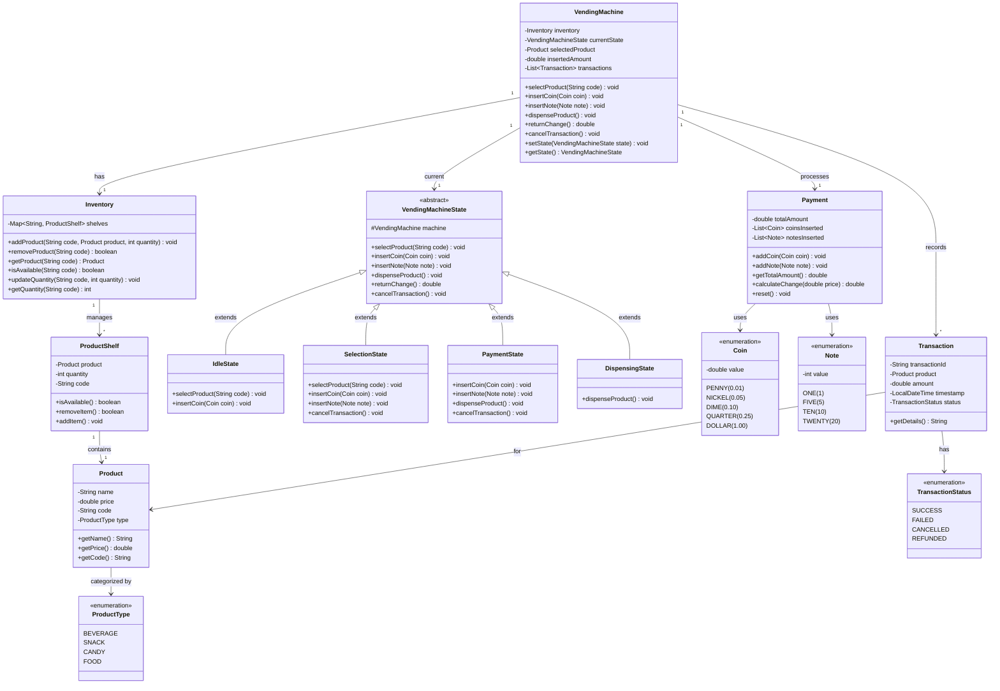

# Vending Machine System

## Table of Contents

1. [Requirements Clarification](#requirements-clarification)
2. [Core Entities & Relationships](#core-entities--relationships)
3. [Class Design](#class-design)
4. [UML Class Diagram](#uml-class-diagram)
5. [Implementation](#implementation)
6. [State Design Pattern Deep Dive](#state-design-pattern-deep-dive)
7. [Design Patterns & Best Practices](#design-patterns--best-practices)
8. [Edge Cases & Extensions](#edge-cases--extensions)
9. [Summary](#summary)

---

## Requirements Clarification

### Functional Requirements

- **Product Selection**: Users can browse and select products
- **Inventory Management**: Track product availability and stock levels
- **Payment Processing**: Accept multiple payment methods (Cash, Card, Digital Wallet)
- **Change Return**: Calculate and dispense correct change
- **Product Dispensing**: Dispense selected product after successful payment
- **Refund**: Return money if product unavailable or transaction cancelled
- **Multiple Products**: Support various product types with different prices
- **State Management**: Handle different machine states (Idle, Selection, Payment, Dispensing)

### Non-Functional Requirements

- **Reliability**: Handle edge cases like insufficient funds, out of stock
- **Concurrency**: Thread-safe operations (one transaction at a time)
- **Maintainability**: Easy to add new products and payment methods
- **Usability**: Clear user feedback at each step
- **Security**: Secure payment processing

### Scope Boundaries

#### Included
- Product catalog management
- Inventory tracking
- Payment processing simulation
- Change calculation and dispensing
- State machine implementation
- Transaction logging

#### Excluded
- Real hardware integration
- Network connectivity
- Remote monitoring dashboard
- Temperature control for perishables
- Barcode scanning
- Touchscreen UI implementation

---

## Core Entities & Relationships

### Main Entities

- **VendingMachine**: Main controller managing the entire system
- **Product**: Represents items available in the machine
- **Inventory**: Manages stock levels for all products
- **State**: Represents different states of the vending machine
- **Payment**: Handles payment processing
- **Coin/Note**: Represents currency denominations
- **Transaction**: Records transaction details

### Key Relationships

- VendingMachine **HAS-ONE** Inventory (Composition)
- VendingMachine **HAS-ONE** State (Association)
- Inventory **HAS-MANY** Product (Aggregation)
- Transaction **HAS-ONE** Product (Association)
- Payment **USES** Coin/Note (Association)

---

## Class Design

### Core Classes with Responsibilities

- **VendingMachine**: Orchestrates all operations, manages state transitions
- **Inventory**: Tracks product availability and manages stock
- **Product**: Stores product details (name, price, code)
- **VendingMachineState**: Abstract state class for state pattern
- **IdleState, SelectionState, PaymentState, DispensingState**: Concrete states
- **Payment**: Handles payment logic and change calculation
- **Coin/Note**: Represents money denominations
- **Transaction**: Records transaction history

---

## UML Class Diagram



---

## Implementation

### Enums

#### Coin.java

```java
public enum Coin {
    PENNY(0.01),
    NICKEL(0.05),
    DIME(0.10),
    QUARTER(0.25),
    DOLLAR(1.00);

    private final double value;

    Coin(double value) {
        this.value = value;
    }

    public double getValue() {
        return value;
    }
}
```

#### Note.java

```java
public enum Note {
    ONE(1),
    FIVE(5),
    TEN(10),
    TWENTY(20),
    FIFTY(50);

    private final int value;

    Note(int value) {
        this.value = value;
    }

    public int getValue() {
        return value;
    }
}
```

#### TransactionStatus.java

```java
public enum TransactionStatus {
    SUCCESS,
    FAILED,
    CANCELLED,
    REFUNDED
}
```

#### ProductType.java

```java
public enum ProductType {
    BEVERAGE,
    SNACK,
    CANDY,
    FOOD,
    OTHER
}
```

---

### Product Classes

#### Product.java

```java
public class Product {
    private String name;
    private double price;
    private String code;
    private ProductType type;

    public Product(String name, double price, String code, ProductType type) {
        this.name = name;
        this.price = price;
        this.code = code;
        this.type = type;
    }

    public String getName() {
        return name;
    }

    public double getPrice() {
        return price;
    }

    public String getCode() {
        return code;
    }

    public ProductType getType() {
        return type;
    }

    @Override
    public String toString() {
        return String.format("%s (%s) - $%.2f", name, code, price);
    }
}
```

#### ProductShelf.java

```java
public class ProductShelf {
    private Product product;
    private int quantity;
    private String code;

    public ProductShelf(String code, Product product, int quantity) {
        this.code = code;
        this.product = product;
        this.quantity = quantity;
    }

    public boolean isAvailable() {
        return quantity > 0;
    }

    public synchronized boolean removeItem() {
        if (quantity > 0) {
            quantity--;
            return true;
        }
        return false;
    }

    public synchronized void addItem() {
        quantity++;
    }

    public synchronized void addItems(int count) {
        quantity += count;
    }

    public Product getProduct() {
        return product;
    }

    public int getQuantity() {
        return quantity;
    }

    public String getCode() {
        return code;
    }
}
```

---

### Inventory Management

#### Inventory.java

```java
import java.util.HashMap;
import java.util.Map;

public class Inventory {
    private Map<String, ProductShelf> shelves;

    public Inventory() {
        this.shelves = new HashMap<>();
    }

    public void addProduct(String code, Product product, int quantity) {
        if (shelves.containsKey(code)) {
            ProductShelf shelf = shelves.get(code);
            shelf.addItems(quantity);
            System.out.println("Added " + quantity + " units of " + product.getName());
        } else {
            ProductShelf shelf = new ProductShelf(code, product, quantity);
            shelves.put(code, shelf);
            System.out.println("Added new product: " + product.getName() + " with " + quantity + " units");
        }
    }

    public boolean removeProduct(String code) {
        if (shelves.containsKey(code)) {
            ProductShelf shelf = shelves.get(code);
            return shelf.removeItem();
        }
        return false;
    }

    public Product getProduct(String code) {
        ProductShelf shelf = shelves.get(code);
        return shelf != null ? shelf.getProduct() : null;
    }

    public boolean isAvailable(String code) {
        ProductShelf shelf = shelves.get(code);
        return shelf != null && shelf.isAvailable();
    }

    public int getQuantity(String code) {
        ProductShelf shelf = shelves.get(code);
        return shelf != null ? shelf.getQuantity() : 0;
    }

    public void displayInventory() {
        System.out.println("\n=== Current Inventory ===");
        for (ProductShelf shelf : shelves.values()) {
            System.out.printf("%s - Quantity: %d - $%.2f%n",
                shelf.getProduct().getName(),
                shelf.getQuantity(),
                shelf.getProduct().getPrice());
        }
        System.out.println("========================\n");
    }

    public Map<String, ProductShelf> getAllShelves() {
        return shelves;
    }
}
```

---

### Payment Processing

#### Payment.java

```java
import java.util.ArrayList;
import java.util.List;

public class Payment {
    private double totalAmount;
    private List<Coin> coinsInserted;
    private List<Note> notesInserted;

    public Payment() {
        this.totalAmount = 0.0;
        this.coinsInserted = new ArrayList<>();
        this.notesInserted = new ArrayList<>();
    }

    public void addCoin(Coin coin) {
        coinsInserted.add(coin);
        totalAmount += coin.getValue();
        System.out.printf("Coin inserted: %s ($%.2f). Total: $%.2f%n",
            coin.name(), coin.getValue(), totalAmount);
    }

    public void addNote(Note note) {
        notesInserted.add(note);
        totalAmount += note.getValue();
        System.out.printf("Note inserted: $%d. Total: $%.2f%n",
            note.getValue(), totalAmount);
    }

    public double getTotalAmount() {
        return totalAmount;
    }

    public double calculateChange(double price) {
        return totalAmount - price;
    }

    public boolean hasSufficientAmount(double price) {
        return totalAmount >= price;
    }

    public void reset() {
        this.totalAmount = 0.0;
        this.coinsInserted.clear();
        this.notesInserted.clear();
    }

    public List<Coin> getCoinsInserted() {
        return coinsInserted;
    }

    public List<Note> getNotesInserted() {
        return notesInserted;
    }
}
```

---

### Transaction Management

#### Transaction.java

```java
import java.time.LocalDateTime;
import java.time.format.DateTimeFormatter;
import java.util.UUID;

public class Transaction {
    private String transactionId;
    private Product product;
    private double amount;
    private LocalDateTime timestamp;
    private TransactionStatus status;

    public Transaction(Product product, double amount, TransactionStatus status) {
        this.transactionId = UUID.randomUUID().toString().substring(0, 8);
        this.product = product;
        this.amount = amount;
        this.timestamp = LocalDateTime.now();
        this.status = status;
    }

    public String getDetails() {
        DateTimeFormatter formatter = DateTimeFormatter.ofPattern("yyyy-MM-dd HH:mm:ss");
        return String.format("Transaction ID: %s%nProduct: %s%nAmount: $%.2f%nTime: %s%nStatus: %s",
            transactionId, product.getName(), amount, timestamp.format(formatter), status);
    }

    public String getTransactionId() {
        return transactionId;
    }

    public Product getProduct() {
        return product;
    }

    public double getAmount() {
        return amount;
    }

    public TransactionStatus getStatus() {
        return status;
    }

    public LocalDateTime getTimestamp() {
        return timestamp;
    }
}
```

---

### State Pattern Implementation

#### VendingMachineState.java (Abstract)

```java
public abstract class VendingMachineState {
    protected VendingMachine machine;

    public VendingMachineState(VendingMachine machine) {
        this.machine = machine;
    }

    public abstract void selectProduct(String code);

    public abstract void insertCoin(Coin coin);

    public abstract void insertNote(Note note);

    public abstract void dispenseProduct();

    public abstract double returnChange();

    public abstract void cancelTransaction();
}
```

#### IdleState.java

```java
public class IdleState extends VendingMachineState {

    public IdleState(VendingMachine machine) {
        super(machine);
    }

    @Override
    public void selectProduct(String code) {
        System.out.println("\n--- Product Selection ---");

        if (!machine.getInventory().isAvailable(code)) {
            System.out.println("Product not available or out of stock!");
            return;
        }

        Product product = machine.getInventory().getProduct(code);
        machine.setSelectedProduct(product);
        System.out.println("Selected: " + product);
        System.out.printf("Price: $%.2f. Please insert money.%n", product.getPrice());

        machine.setState(new SelectionState(machine));
    }

    @Override
    public void insertCoin(Coin coin) {
        System.out.println("Please select a product first!");
    }

    @Override
    public void insertNote(Note note) {
        System.out.println("Please select a product first!");
    }

    @Override
    public void dispenseProduct() {
        System.out.println("Please select a product first!");
    }

    @Override
    public double returnChange() {
        System.out.println("No transaction in progress.");
        return 0.0;
    }

    @Override
    public void cancelTransaction() {
        System.out.println("No transaction to cancel.");
    }
}
```

#### SelectionState.java

```java
public class SelectionState extends VendingMachineState {

    public SelectionState(VendingMachine machine) {
        super(machine);
    }

    @Override
    public void selectProduct(String code) {
        System.out.println("Product already selected. Complete or cancel current transaction.");
    }

    @Override
    public void insertCoin(Coin coin) {
        System.out.println("\n--- Payment Processing ---");
        machine.getPayment().addCoin(coin);
        checkPaymentCompletion();
    }

    @Override
    public void insertNote(Note note) {
        System.out.println("\n--- Payment Processing ---");
        machine.getPayment().addNote(note);
        checkPaymentCompletion();
    }

    private void checkPaymentCompletion() {
        Product selectedProduct = machine.getSelectedProduct();
        Payment payment = machine.getPayment();

        if (payment.hasSufficientAmount(selectedProduct.getPrice())) {
            System.out.println("Payment complete! Dispensing product...");
            machine.setState(new PaymentState(machine));
            machine.getState().dispenseProduct();
        } else {
            double remaining = selectedProduct.getPrice() - payment.getTotalAmount();
            System.out.printf("Amount remaining: $%.2f%n", remaining);
        }
    }

    @Override
    public void dispenseProduct() {
        System.out.println("Please complete payment first!");
    }

    @Override
    public double returnChange() {
        System.out.println("Transaction not complete.");
        return 0.0;
    }

    @Override
    public void cancelTransaction() {
        System.out.println("\n--- Transaction Cancelled ---");
        double refund = machine.getPayment().getTotalAmount();

        if (refund > 0) {
            System.out.printf("Refunding: $%.2f%n", refund);
        }

        // Record cancelled transaction
        machine.addTransaction(new Transaction(
            machine.getSelectedProduct(),
            refund,
            TransactionStatus.CANCELLED
        ));

        machine.reset();
        System.out.println("Machine reset. Select a new product.");
    }
}
```

#### PaymentState.java

```java
public class PaymentState extends VendingMachineState {

    public PaymentState(VendingMachine machine) {
        super(machine);
    }

    @Override
    public void selectProduct(String code) {
        System.out.println("Please complete current transaction first!");
    }

    @Override
    public void insertCoin(Coin coin) {
        System.out.println("Payment already completed!");
    }

    @Override
    public void insertNote(Note note) {
        System.out.println("Payment already completed!");
    }

    @Override
    public void dispenseProduct() {
        machine.setState(new DispensingState(machine));
        machine.getState().dispenseProduct();
    }

    @Override
    public double returnChange() {
        Product product = machine.getSelectedProduct();
        Payment payment = machine.getPayment();
        double change = payment.calculateChange(product.getPrice());

        if (change > 0) {
            System.out.printf("Returning change: $%.2f%n", change);
        }

        return change;
    }

    @Override
    public void cancelTransaction() {
        System.out.println("Cannot cancel - payment completed. Dispensing product...");
        dispenseProduct();
    }
}
```

#### DispensingState.java

```java
public class DispensingState extends VendingMachineState {

    public DispensingState(VendingMachine machine) {
        super(machine);
    }

    @Override
    public void selectProduct(String code) {
        System.out.println("Please wait - dispensing product...");
    }

    @Override
    public void insertCoin(Coin coin) {
        System.out.println("Please wait - dispensing product...");
    }

    @Override
    public void insertNote(Note note) {
        System.out.println("Please wait - dispensing product...");
    }

    @Override
    public void dispenseProduct() {
        System.out.println("\n--- Dispensing Product ---");

        Product product = machine.getSelectedProduct();

        // Remove product from inventory
        boolean dispensed = machine.getInventory().removeProduct(product.getCode());

        if (dispensed) {
            System.out.println("✓ " + product.getName() + " dispensed successfully!");

            // Return change
            double change = returnChange();

            // Record successful transaction
            machine.addTransaction(new Transaction(
                product,
                product.getPrice(),
                TransactionStatus.SUCCESS
            ));

            System.out.println("Thank you for your purchase!");
        } else {
            System.out.println("✗ Error dispensing product. Refunding...");
            double refund = machine.getPayment().getTotalAmount();
            System.out.printf("Refunded: $%.2f%n", refund);

            machine.addTransaction(new Transaction(
                product,
                refund,
                TransactionStatus.FAILED
            ));
        }

        // Reset machine
        machine.reset();
    }

    @Override
    public double returnChange() {
        Product product = machine.getSelectedProduct();
        Payment payment = machine.getPayment();
        double change = payment.calculateChange(product.getPrice());

        if (change > 0) {
            System.out.printf("✓ Change returned: $%.2f%n", change);
        }

        return change;
    }

    @Override
    public void cancelTransaction() {
        System.out.println("Cannot cancel - product being dispensed.");
    }
}
```

---

### Main Vending Machine

#### VendingMachine.java

```java
import java.util.ArrayList;
import java.util.List;

public class VendingMachine {
    private Inventory inventory;
    private VendingMachineState currentState;
    private Product selectedProduct;
    private Payment payment;
    private List<Transaction> transactions;

    public VendingMachine() {
        this.inventory = new Inventory();
        this.currentState = new IdleState(this);
        this.payment = new Payment();
        this.transactions = new ArrayList<>();
        System.out.println("Vending Machine initialized!");
    }

    // State operations - delegate to current state
    public void selectProduct(String code) {
        currentState.selectProduct(code);
    }

    public void insertCoin(Coin coin) {
        currentState.insertCoin(coin);
    }

    public void insertNote(Note note) {
        currentState.insertNote(note);
    }

    public void dispenseProduct() {
        currentState.dispenseProduct();
    }

    public double returnChange() {
        return currentState.returnChange();
    }

    public void cancelTransaction() {
        currentState.cancelTransaction();
    }

    // State management
    public void setState(VendingMachineState state) {
        this.currentState = state;
    }

    public VendingMachineState getState() {
        return currentState;
    }

    // Reset machine to idle state
    public void reset() {
        this.selectedProduct = null;
        this.payment.reset();
        this.currentState = new IdleState(this);
    }

    // Getters and setters
    public Inventory getInventory() {
        return inventory;
    }

    public Product getSelectedProduct() {
        return selectedProduct;
    }

    public void setSelectedProduct(Product product) {
        this.selectedProduct = product;
    }

    public Payment getPayment() {
        return payment;
    }

    public void addTransaction(Transaction transaction) {
        transactions.add(transaction);
    }

    public List<Transaction> getTransactions() {
        return transactions;
    }

    // Display methods
    public void displayProducts() {
        System.out.println("\n======= Available Products =======");
        for (ProductShelf shelf : inventory.getAllShelves().values()) {
            Product p = shelf.getProduct();
            System.out.printf("[%s] %s - $%.2f (Stock: %d)%n",
                p.getCode(), p.getName(), p.getPrice(), shelf.getQuantity());
        }
        System.out.println("==================================\n");
    }

    public void displayTransactionHistory() {
        System.out.println("\n======= Transaction History =======");
        if (transactions.isEmpty()) {
            System.out.println("No transactions yet.");
        } else {
            for (Transaction t : transactions) {
                System.out.println(t.getDetails());
                System.out.println("-----------------------------------");
            }
        }
        System.out.println("===================================\n");
    }
}
```

---

### Demo Class

#### VendingMachineDemo.java

```java
public class VendingMachineDemo {
    public static void main(String[] args) {
        System.out.println("=== Vending Machine System Demo ===\n");

        // Initialize vending machine
        VendingMachine machine = new VendingMachine();

        // Stock the machine with products
        System.out.println("--- Stocking Machine ---");
        machine.getInventory().addProduct("A1",
            new Product("Coca Cola", 1.50, "A1", ProductType.BEVERAGE), 10);
        machine.getInventory().addProduct("A2",
            new Product("Pepsi", 1.50, "A2", ProductType.BEVERAGE), 8);
        machine.getInventory().addProduct("B1",
            new Product("Lays Chips", 2.00, "B1", ProductType.SNACK), 15);
        machine.getInventory().addProduct("B2",
            new Product("Doritos", 2.25, "B2", ProductType.SNACK), 12);
        machine.getInventory().addProduct("C1",
            new Product("Snickers", 1.75, "C1", ProductType.CANDY), 20);
        machine.getInventory().addProduct("C2",
            new Product("KitKat", 1.50, "C2", ProductType.CANDY), 18);

        machine.displayProducts();

        // Scenario 1: Successful purchase with exact amount
        System.out.println("\n========== SCENARIO 1: Exact Payment ==========");
        machine.selectProduct("A1");
        machine.insertNote(Note.ONE);
        machine.insertCoin(Coin.QUARTER);
        machine.insertCoin(Coin.QUARTER);

        machine.displayProducts();

        // Scenario 2: Successful purchase with change
        System.out.println("\n========== SCENARIO 2: Payment with Change ==========");
        machine.selectProduct("B1");
        machine.insertNote(Note.FIVE);

        machine.displayProducts();

        // Scenario 3: Transaction cancellation
        System.out.println("\n========== SCENARIO 3: Cancelled Transaction ==========");
        machine.selectProduct("C1");
        machine.insertNote(Note.ONE);
        machine.cancelTransaction();

        // Scenario 4: Out of stock
        System.out.println("\n========== SCENARIO 4: Depleting Stock ==========");
        // Buy all Coca Cola
        for (int i = 0; i < 9; i++) {
            machine.selectProduct("A1");
            machine.insertNote(Note.FIVE);
        }

        // Try to buy when out of stock
        System.out.println("\n--- Attempting to buy out-of-stock item ---");
        machine.selectProduct("A1");

        machine.displayProducts();

        // Scenario 5: Insufficient payment
        System.out.println("\n========== SCENARIO 5: Insufficient Payment ==========");
        machine.selectProduct("B2");
        machine.insertNote(Note.ONE);
        System.out.println("Need more money...");
        machine.insertNote(Note.ONE);
        machine.insertCoin(Coin.QUARTER);

        // Display transaction history
        machine.displayTransactionHistory();

        System.out.println("\n=== Demo Complete ===");
    }
}
```

---

## State Design Pattern Deep Dive

### Why State Pattern?

The State pattern is perfect for vending machines because:

1. **Clear State Transitions**: Machine has distinct states (Idle → Selection → Payment → Dispensing)
2. **Different Behaviors**: Same operation (insertCoin) behaves differently in each state
3. **Maintainability**: Easy to add new states without modifying existing code
4. **Eliminates Conditionals**: No complex if-else chains

### State Transition Diagram

```
┌─────────┐
│  Idle   │◄──────────────────────┐
└────┬────┘                       │
     │ selectProduct()            │
     ▼                            │
┌─────────┐                       │
│Selection│                       │
└────┬────┘                       │
     │ insertCoin/Note()          │
     │ (sufficient payment)       │
     ▼                            │
┌─────────┐                       │
│ Payment │                       │
└────┬────┘                       │
     │ dispenseProduct()          │
     ▼                            │
┌─────────┐                       │
│Dispensing│                      │
└────┬────┘                       │
     │ complete                   │
     └────────────────────────────┘
```

### Benefits in Our Implementation

```java
// Without State Pattern (BAD):
public void insertCoin(Coin coin) {
    if (state == IDLE) {
        System.out.println("Select product first");
    } else if (state == SELECTION) {
        // Add coin logic
    } else if (state == PAYMENT) {
        System.out.println("Already paid");
    } else if (state == DISPENSING) {
        System.out.println("Dispensing...");
    }
}

// With State Pattern (GOOD):
public void insertCoin(Coin coin) {
    currentState.insertCoin(coin); // Delegate to state
}
```

---

## Design Patterns & Best Practices

### Design Patterns Used

#### 1. State Pattern
**Purpose**: Manage vending machine states and their transitions

**Implementation**:
- Abstract `VendingMachineState` class defines contract
- Concrete states: `IdleState`, `SelectionState`, `PaymentState`, `DispensingState`
- Each state handles operations differently
- Clean state transitions without complex conditionals

**Benefits**:
- Single Responsibility: Each state manages its own behavior
- Open/Closed: Easy to add new states without modifying existing code
- Eliminates complex if-else chains
- Clear state transition logic

#### 2. Singleton Pattern (Optional Enhancement)
**Purpose**: Ensure only one vending machine instance exists

```java
public class VendingMachine {
    private static VendingMachine instance;

    private VendingMachine() {
        // Private constructor
    }

    public static synchronized VendingMachine getInstance() {
        if (instance == null) {
            instance = new VendingMachine();
        }
        return instance;
    }
}
```

#### 3. Strategy Pattern (Payment Processing)
**Purpose**: Support multiple payment methods

```java
public interface PaymentStrategy {
    boolean processPayment(double amount);
    void refund(double amount);
}

public class CashPayment implements PaymentStrategy {
    @Override
    public boolean processPayment(double amount) {
        // Cash processing logic
        return true;
    }
}

public class CardPayment implements PaymentStrategy {
    @Override
    public boolean processPayment(double amount) {
        // Card processing logic
        return true;
    }
}
```

#### 4. Factory Pattern (Product Creation)
**Purpose**: Create different types of products

```java
public class ProductFactory {
    public static Product createProduct(ProductType type, String name,
                                       double price, String code) {
        switch (type) {
            case BEVERAGE:
                return new BeverageProduct(name, price, code);
            case SNACK:
                return new SnackProduct(name, price, code);
            case CANDY:
                return new CandyProduct(name, price, code);
            default:
                return new Product(name, price, code, type);
        }
    }
}
```

### SOLID Principles Applied

#### Single Responsibility Principle (SRP)
- **Inventory**: Only manages product stock
- **Payment**: Only handles payment processing
- **VendingMachineState**: Only manages state behavior
- **Transaction**: Only records transaction data

#### Open/Closed Principle (OCP)
- System is open for extension (new states, products, payment methods)
- Closed for modification (core logic doesn't change)
- Example: Add new payment method without changing existing code

#### Liskov Substitution Principle (LSP)
- All state classes can substitute `VendingMachineState`
- Polymorphic behavior works correctly

#### Interface Segregation Principle (ISP)
- States implement only relevant operations
- No forced implementation of unused methods

#### Dependency Inversion Principle (DIP)
- VendingMachine depends on abstract `VendingMachineState`
- Not dependent on concrete state implementations

### Best Practices Implemented

#### 1. Encapsulation
```java
// Private fields with public getters/setters
private Inventory inventory;
private VendingMachineState currentState;

public Inventory getInventory() {
    return inventory;
}
```

#### 2. Thread Safety
```java
// Synchronized methods in ProductShelf
public synchronized boolean removeItem() {
    if (quantity > 0) {
        quantity--;
        return true;
    }
    return false;
}
```

#### 3. Immutability (Enums)
```java
public enum Coin {
    PENNY(0.01);

    private final double value; // Final field

    Coin(double value) {
        this.value = value;
    }
}
```

#### 4. Defensive Programming
```java
// Check for null and boundary conditions
public Product getProduct(String code) {
    ProductShelf shelf = shelves.get(code);
    return shelf != null ? shelf.getProduct() : null;
}
```

#### 5. Clear Naming Conventions
- Classes: PascalCase (e.g., `VendingMachine`)
- Methods: camelCase (e.g., `selectProduct`)
- Constants: UPPER_SNAKE_CASE (e.g., `TRANSACTION_TIMEOUT`)

---

## Edge Cases & Extensions

### Edge Cases Handled

#### 1. Out of Stock
```java
@Override
public void selectProduct(String code) {
    if (!machine.getInventory().isAvailable(code)) {
        System.out.println("Product not available or out of stock!");
        return;
    }
    // Continue with selection
}
```

#### 2. Insufficient Payment
```java
private void checkPaymentCompletion() {
    if (payment.hasSufficientAmount(selectedProduct.getPrice())) {
        // Proceed to dispensing
    } else {
        double remaining = selectedProduct.getPrice() - payment.getTotalAmount();
        System.out.printf("Amount remaining: $%.2f%n", remaining);
    }
}
```

#### 3. Transaction Cancellation
```java
@Override
public void cancelTransaction() {
    double refund = machine.getPayment().getTotalAmount();
    if (refund > 0) {
        System.out.printf("Refunding: $%.2f%n", refund);
    }
    machine.addTransaction(new Transaction(
        machine.getSelectedProduct(),
        refund,
        TransactionStatus.CANCELLED
    ));
    machine.reset();
}
```

#### 4. Dispensing Failure
```java
if (dispensed) {
    // Success path
} else {
    System.out.println("✗ Error dispensing product. Refunding...");
    double refund = machine.getPayment().getTotalAmount();
    machine.addTransaction(new Transaction(
        product, refund, TransactionStatus.FAILED
    ));
}
```

#### 5. Concurrent Access
```java
// Synchronized methods prevent race conditions
public synchronized boolean removeItem() {
    if (quantity > 0) {
        quantity--;
        return true;
    }
    return false;
}
```

### Potential Extensions

#### 1. Multi-Currency Support
```java
public class CurrencyConverter {
    private Map<String, Double> exchangeRates;

    public double convert(double amount, String from, String to) {
        // Currency conversion logic
        return amount * exchangeRates.get(to) / exchangeRates.get(from);
    }
}
```

#### 2. Digital Payment Integration
```java
public class DigitalWallet implements PaymentStrategy {
    private String walletId;

    @Override
    public boolean processPayment(double amount) {
        // Integrate with payment gateway API
        return PaymentGateway.charge(walletId, amount);
    }
}
```

#### 3. Temperature Control (for perishables)
```java
public class RefrigeratedShelf extends ProductShelf {
    private double currentTemp;
    private double targetTemp;

    public boolean isTemperatureOptimal() {
        return Math.abs(currentTemp - targetTemp) < 2.0;
    }

    public void adjustTemperature() {
        // Temperature control logic
    }
}
```

#### 4. Remote Monitoring
```java
public class VendingMachineMonitor {
    private VendingMachine machine;

    public void sendInventoryAlert() {
        for (ProductShelf shelf : machine.getInventory().getAllShelves().values()) {
            if (shelf.getQuantity() < 3) {
                notifyAdmin("Low stock: " + shelf.getProduct().getName());
            }
        }
    }

    public void sendStatusReport() {
        // Send machine status to central server
    }
}
```

#### 5. Loyalty Program
```java
public class LoyaltyProgram {
    private Map<String, Integer> customerPoints;

    public void addPoints(String customerId, double purchaseAmount) {
        int points = (int) (purchaseAmount * 10);
        customerPoints.put(customerId,
            customerPoints.getOrDefault(customerId, 0) + points);
    }

    public boolean redeemPoints(String customerId, int points) {
        if (customerPoints.getOrDefault(customerId, 0) >= points) {
            customerPoints.put(customerId, customerPoints.get(customerId) - points);
            return true;
        }
        return false;
    }
}
```

#### 6. Expiry Date Tracking
```java
public class PerishableProduct extends Product {
    private LocalDate expiryDate;

    public PerishableProduct(String name, double price, String code,
                            ProductType type, LocalDate expiryDate) {
        super(name, price, code, type);
        this.expiryDate = expiryDate;
    }

    public boolean isExpired() {
        return LocalDate.now().isAfter(expiryDate);
    }

    public long getDaysUntilExpiry() {
        return ChronoUnit.DAYS.between(LocalDate.now(), expiryDate);
    }
}
```

#### 7. Dynamic Pricing
```java
public class PricingStrategy {
    public double calculatePrice(Product product, LocalTime time) {
        // Off-peak discount (10 PM - 6 AM)
        if (time.isAfter(LocalTime.of(22, 0)) ||
            time.isBefore(LocalTime.of(6, 0))) {
            return product.getPrice() * 0.9; // 10% discount
        }
        return product.getPrice();
    }

    public double applyBulkDiscount(Product product, int quantity) {
        if (quantity >= 3) {
            return product.getPrice() * 0.85; // 15% bulk discount
        }
        return product.getPrice();
    }
}
```

#### 8. Maintenance Mode
```java
public class MaintenanceState extends VendingMachineState {
    private String maintenanceReason;

    public MaintenanceState(VendingMachine machine, String reason) {
        super(machine);
        this.maintenanceReason = reason;
    }

    @Override
    public void selectProduct(String code) {
        System.out.println("Machine under maintenance: " + maintenanceReason);
    }

    // Override all methods to show maintenance message
}
```

#### 9. Receipt Generation
```java
public class ReceiptGenerator {
    public String generateReceipt(Transaction transaction) {
        StringBuilder receipt = new StringBuilder();
        receipt.append("========== RECEIPT ==========\n");
        receipt.append("Date: ").append(transaction.getTimestamp()).append("\n");
        receipt.append("Transaction ID: ").append(transaction.getTransactionId()).append("\n");
        receipt.append("Product: ").append(transaction.getProduct().getName()).append("\n");
        receipt.append("Price: $").append(String.format("%.2f", transaction.getAmount())).append("\n");
        receipt.append("Status: ").append(transaction.getStatus()).append("\n");
        receipt.append("=============================\n");
        return receipt.toString();
    }
}
```

#### 10. Analytics & Reporting
```java
public class VendingMachineAnalytics {
    private List<Transaction> transactions;

    public Map<String, Integer> getMostPopularProducts() {
        return transactions.stream()
            .filter(t -> t.getStatus() == TransactionStatus.SUCCESS)
            .collect(Collectors.groupingBy(
                t -> t.getProduct().getName(),
                Collectors.summingInt(e -> 1)
            ));
    }

    public double getTotalRevenue() {
        return transactions.stream()
            .filter(t -> t.getStatus() == TransactionStatus.SUCCESS)
            .mapToDouble(Transaction::getAmount)
            .sum();
    }

    public Map<LocalDate, Double> getDailyRevenue() {
        return transactions.stream()
            .filter(t -> t.getStatus() == TransactionStatus.SUCCESS)
            .collect(Collectors.groupingBy(
                t -> t.getTimestamp().toLocalDate(),
                Collectors.summingDouble(Transaction::getAmount)
            ));
    }
}
```

### Error Handling Improvements

#### 1. Custom Exceptions
```java
public class InsufficientStockException extends Exception {
    public InsufficientStockException(String product) {
        super("Product out of stock: " + product);
    }
}

public class InsufficientPaymentException extends Exception {
    public InsufficientPaymentException(double required, double provided) {
        super(String.format("Insufficient payment. Required: $%.2f, Provided: $%.2f",
            required, provided));
    }
}

public class ProductNotFoundException extends Exception {
    public ProductNotFoundException(String code) {
        super("Product not found with code: " + code);
    }
}
```

#### 2. Logging Framework Integration
```java
import java.util.logging.Logger;
import java.util.logging.Level;

public class VendingMachine {
    private static final Logger LOGGER = Logger.getLogger(VendingMachine.class.getName());

    public void selectProduct(String code) {
        LOGGER.log(Level.INFO, "Product selection attempted: " + code);
        try {
            currentState.selectProduct(code);
            LOGGER.log(Level.INFO, "Product selected successfully: " + code);
        } catch (Exception e) {
            LOGGER.log(Level.SEVERE, "Error selecting product", e);
        }
    }
}
```

---

## Summary

### Key Design Decisions

1. **State Pattern**: Core pattern for managing machine behavior across different states
2. **Enum for Currency**: Type-safe representation of coins and notes
3. **Synchronized Methods**: Thread-safe inventory management
4. **Transaction Logging**: Complete audit trail of all operations
5. **Separation of Concerns**: Clear separation between inventory, payment, and state management

### System Characteristics

#### Strengths
- **Maintainable**: Easy to understand and modify
- **Extensible**: Simple to add new features
- **Robust**: Handles edge cases gracefully
- **Type-Safe**: Strong typing prevents errors
- **Thread-Safe**: Safe for concurrent access

#### Trade-offs
- **Memory**: Stores all transaction history in memory
- **Complexity**: State pattern adds initial complexity
- **Single Transaction**: Only one transaction at a time
- **No Persistence**: Data lost on restart (can be extended with database)

### Testing Strategy

#### Unit Tests
```java
@Test
public void testProductSelection() {
    VendingMachine machine = new VendingMachine();
    machine.getInventory().addProduct("A1",
        new Product("Coke", 1.50, "A1", ProductType.BEVERAGE), 5);

    machine.selectProduct("A1");
    assertNotNull(machine.getSelectedProduct());
    assertEquals("Coke", machine.getSelectedProduct().getName());
}

@Test
public void testInsufficientPayment() {
    VendingMachine machine = new VendingMachine();
    machine.getInventory().addProduct("A1",
        new Product("Coke", 1.50, "A1", ProductType.BEVERAGE), 5);

    machine.selectProduct("A1");
    machine.insertCoin(Coin.QUARTER);

    // Should still be in SelectionState, not Payment
    assertTrue(machine.getState() instanceof SelectionState);
}
```

#### Integration Tests
```java
@Test
public void testCompleteTransaction() {
    VendingMachine machine = new VendingMachine();
    machine.getInventory().addProduct("A1",
        new Product("Coke", 1.50, "A1", ProductType.BEVERAGE), 5);

    machine.selectProduct("A1");
    machine.insertNote(Note.FIVE);

    assertEquals(1, machine.getTransactions().size());
    assertEquals(TransactionStatus.SUCCESS,
        machine.getTransactions().get(0).getStatus());
    assertEquals(4, machine.getInventory().getQuantity("A1"));
}
```

### Performance Considerations

1. **Time Complexity**:
   - Product selection: O(1) - HashMap lookup
   - Inventory check: O(1) - HashMap lookup
   - State transition: O(1) - Direct reference
   - Transaction logging: O(1) - ArrayList append

2. **Space Complexity**:
   - Inventory: O(n) where n = number of product types
   - Transactions: O(m) where m = number of transactions
   - Payment: O(c) where c = number of coins/notes inserted

3. **Optimizations**:
   - Use HashMap for O(1) product lookup
   - Lazy initialization of states (optional)
   - Connection pooling for database operations (if added)
   - Cache frequently accessed products

### Deployment Considerations

1. **Configuration Management**:
   - Externalize product catalog (JSON/Database)
   - Configure currency denominations
   - Set inventory thresholds for alerts

2. **Monitoring**:
   - Track inventory levels
   - Monitor transaction success rates
   - Alert on dispensing failures
   - Log payment anomalies

3. **Security**:
   - Encrypt payment data
   - Validate all inputs
   - Implement rate limiting
   - Audit all operations

### Conclusion

This low-level design provides a robust, maintainable, and extensible foundation for a vending machine system. The use of the State pattern ensures clean state management, while SOLID principles make the codebase easy to understand and modify. The system handles common edge cases and provides clear extension points for future enhancements.

The design balances simplicity with functionality, making it suitable for both educational purposes and as a foundation for real-world implementations with appropriate extensions for hardware integration, persistence, and advanced features.
