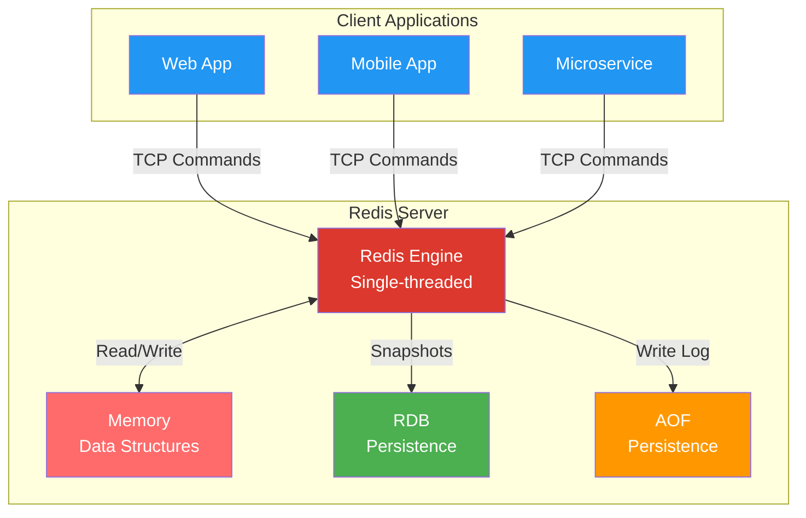
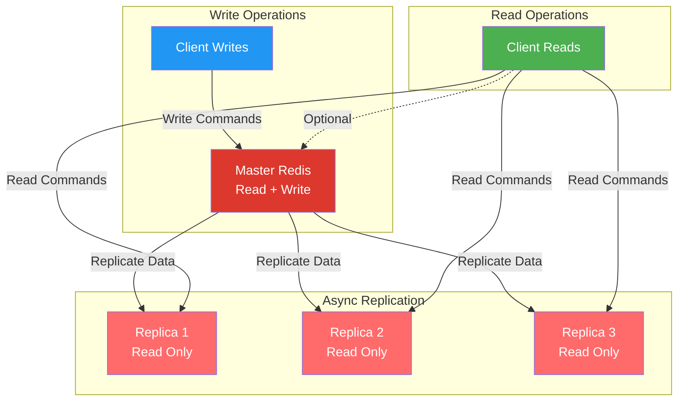
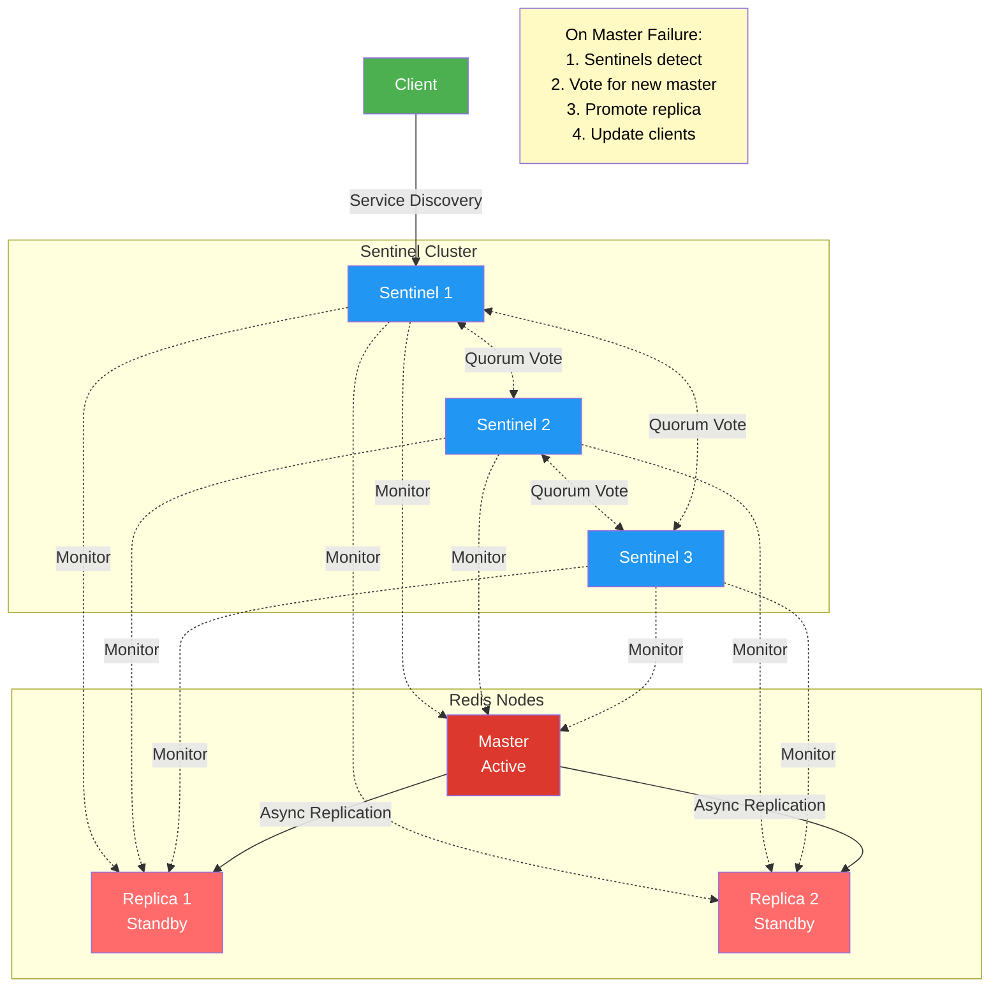
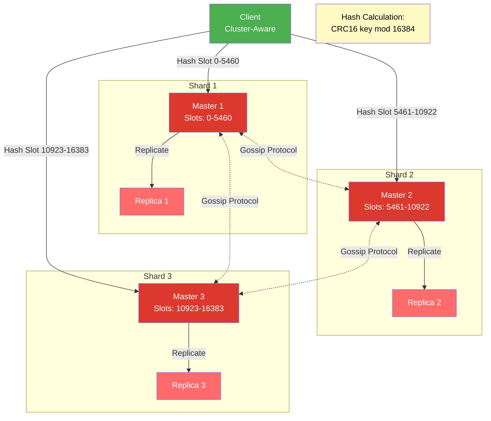
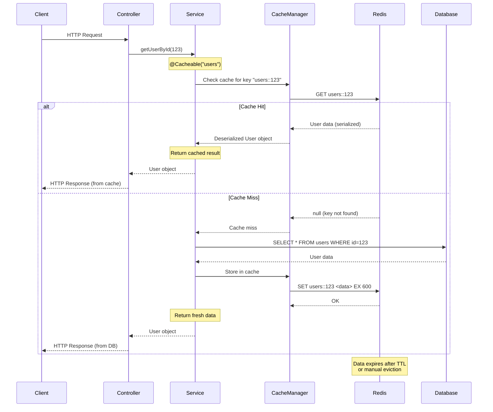
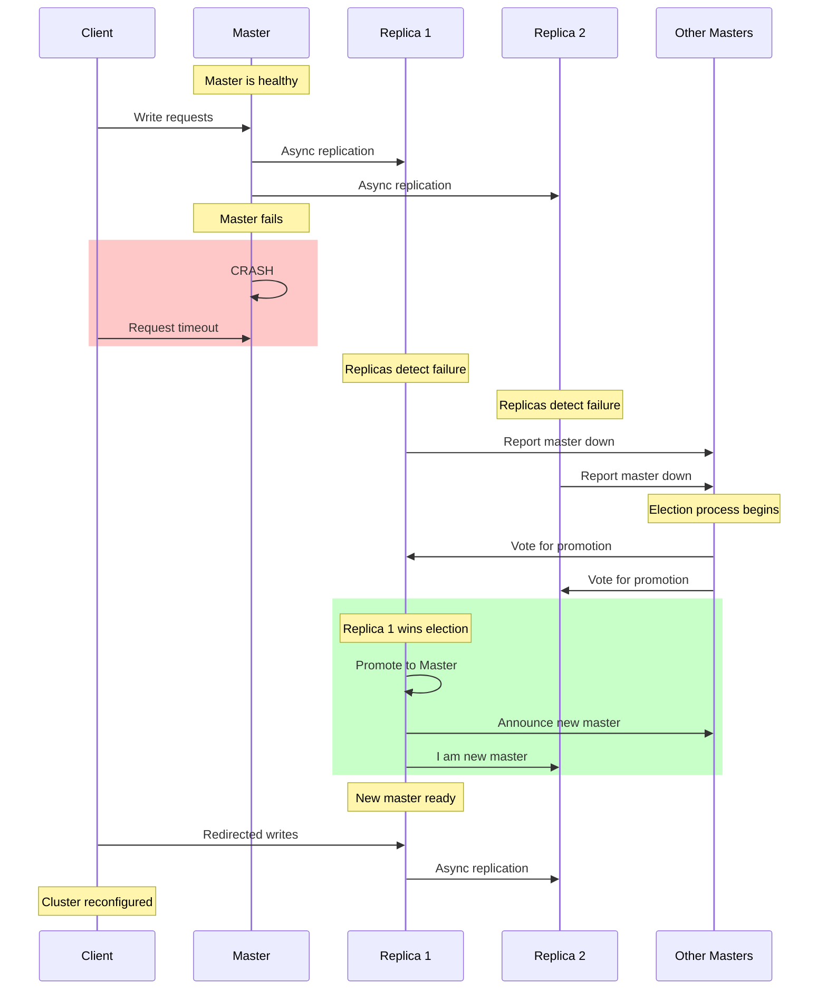

# Complete Redis Guide with Spring Boot Integration

## Table of Contents

### 📚 Core Concepts

1. [What is Redis?](#what-is-redis)
2. [Redis Data Structures](#redis-data-structures)
   - [String](#string)
   - [List](#list)
   - [Set](#set)
   - [Sorted Set (ZSet)](#sorted-set-zset)
   - [Hash](#hash)
   - [Bitmap / Bitfield](#bitmap--bitfield)
   - [HyperLogLog](#hyperloglog)
   - [Stream](#stream)
   - [Geo (Geospatial)](#geo-geospatial)
3. [Essential Redis Commands](#essential-redis-commands)
4. [Redis Persistence](#redis-persistence)
   - [RDB (Redis Database)](#rdb-redis-database---snapshotting)
   - [AOF (Append Only File)](#aof-append-only-file---write-logging)
   - [Hybrid Persistence](#hybrid-persistence-rdb--aof)

### ⚙️ Advanced Features

5. [Redis Expiration & TTL](#redis-expiration--ttl)
6. [Redis Eviction Policies](#redis-eviction-policies)
7. [Redis Transactions](#redis-transactions)
8. [Redis Pub/Sub](#redis-pubsub)
9. [Redis Streams (Advanced Messaging)](#redis-streams-advanced-messaging)
10. [Redis Cluster (Horizontal Scaling)](#redis-cluster-horizontal-scaling)
11. [Redis Replication (Master-Slave)](#redis-replication-master-slave)
12. [Rate Limiting Pattern](#rate-limiting-pattern)
13. [Pipelining](#pipelining)
14. [Lua Scripting](#lua-scripting)

### 🚀 Performance & Optimization

15. [Performance Optimization](#performance-optimization)
16. [Redis Tools](#redis-tools)

- [redis-cli](#redis-cli-command-line-interface)
- [redis-benchmark](#redis-benchmark-performance-testing)
- [RedisInsight](#redisinsight-gui-visualization)

### 🍃 Spring Boot Integration

17. [Spring Boot Redis Integration](#spring-boot-redis-integration)

- [Maven Dependencies](#maven-dependencies)
- [Application Configuration](#application-properties)
- [Redis Configuration Class](#redis-configuration-class)
- [Service Layer with Caching](#service-layer-with-spring-cache-annotations)
- [Custom Cache Key Generator](#custom-cache-key-generator)
- [Using RedisTemplate Directly](#using-redistemplate-directly)
- [Rate Limiting with Spring Boot](#rate-limiting-with-spring-boot)
- [Session Management](#session-management-with-redis)

### 📊 Diagrams & Architecture

18. [Redis Architecture Diagrams](#redis-architecture-diagrams)

- [Basic Client-Server Architecture](#basic-redis-client-server-architecture)
- [Master-Replica Replication](#master-replica-replication)
- [Redis Sentinel High Availability](#redis-sentinel-high-availability)
- [Redis Cluster Sharding](#redis-cluster-sharding-architecture)
- [Spring Boot Caching Flow](#spring-boot-redis-caching-flow)
- [Pub/Sub vs Streams](#redis-pubsub-vs-streams-architecture)
- [Data Structure Memory Layout](#redis-data-structure-memory-layout)
- [Cluster Failover Process](#redis-cluster-failover-process)
- [Spring Boot Application Architecture](#spring-boot-application-architecture-with-redis)

### 💡 Use Cases & Patterns

19. [Redis Use Cases in Detail](#redis-use-cases-in-detail)

- [Caching Strategy](#1-caching-strategy)
- [Session Store](#2-session-store)
- [Leaderboard Implementation](#3-leaderboard-implementation)
- [Real-Time Analytics](#4-real-time-analytics)
- [Distributed Locks](#5-distributed-locks)

### 🔧 Advanced Patterns

20. [Advanced Redis Patterns](#advanced-redis-patterns)

- [Cache Stampede Prevention](#1-cache-stampede-prevention)
- [Bloom Filter](#2-bloom-filter-for-existence-checks)
- [Sliding Window Rate Limiter](#3-sliding-window-rate-limiter-token-bucket)
- [Geospatial Indexing](#4-geospatial-indexing-for-location-based-services)
- [Job Queue with Priority](#5-job-queue-with-priority)
- [Activity Feed](#6-implement-activity-feed)

### 🛡️ Best Practices

21. [Redis Best Practices](#redis-best-practices)

- [Key Naming Conventions](#1-key-naming-conventions)
- [Memory Optimization](#2-memory-optimization)
- [Always Set TTL](#3-always-set-ttl-on-cache-keys)
- [Use Connection Pooling](#4-use-connection-pooling)
- [Monitor Performance](#5-monitor-performance)
- [Security Hardening](#6-security-hardening)
- [Backup Strategy](#7-backup-strategy)
- [Handle Failures Gracefully](#8-handle-failures-gracefully)
- [Avoid Large Keys](#9-avoid-large-keys-and-values)
- [Use Appropriate Data Structures](#10-use-appropriate-data-structures)

### 📈 Monitoring & Debugging

22. [Redis Monitoring and Debugging](#redis-monitoring-and-debugging)

- [Key Metrics to Monitor](#1-key-metrics-to-monitor)
- [Monitoring Script Example](#2-monitoring-script-example)
- [Debugging Techniques](#3-debugging-techniques)
- [Common Issues and Solutions](#4-common-issues-and-solutions)

### 🔄 Comparison & Benchmarks

23. [Redis vs Other Caching Solutions](#redis-vs-other-caching-solutions)
24. [Redis Performance Benchmarks](#redis-performance-benchmarks)

### 📖 Reference

25. [Redis Configuration Reference](#redis-configuration-reference)
26. [Redis Cheat Sheet](#redis-cheat-sheet)
27. [Redis Ecosystem and Tools](#redis-ecosystem-and-tools)
28. [Conclusion](#conclusion)

---

## What is Redis?

Redis (REmote DIctionary Server) is an open-source, in-memory key-value data store that serves multiple roles in modern applications:

- **Cache**: High-speed data caching layer
- **Database**: In-memory database with optional persistence
- **Message Broker**: Pub/Sub and streaming capabilities
- **Session Store**: Distributed session management

**Key Characteristics:**

- **In-Memory Storage**: Data stored in RAM for microsecond latency
- **Persistence Options**: Optional disk persistence (RDB/AOF)
- **Single-Threaded**: Uses single thread for command execution (atomic operations)
- **Speed**: Handles millions of operations per second
- **Rich Data Structures**: Beyond simple key-value pairs

## Redis Data Structures

### String

The most basic type - can store text, integers, floats, or binary data up to 512MB.

**Use Cases**: Caching simple values, user tokens, counters, serialized objects

```redis
SET user:token "abc123xyz"
GET user:token
INCR page:views
SET config:timeout 30 EX 3600
```

### List

Ordered collection of strings, maintains insertion order. Acts as linked list.

**Use Cases**: Queues (FIFO/LIFO), activity logs, message streams, recent items

```redis
LPUSH queue:jobs "job1"        # Push to head
RPUSH queue:jobs "job2"        # Push to tail
LPOP queue:jobs                # Pop from head
RPOP queue:jobs                # Pop from tail
LRANGE queue:jobs 0 -1         # Get all items
LTRIM queue:jobs 0 99          # Keep only first 100
```

### Set

Unordered collection of unique strings. No duplicates allowed.

**Use Cases**: Unique tags, followers, user permissions, unique visitors

```redis
SADD user:100:tags "redis" "nosql" "cache"
SMEMBERS user:100:tags
SISMEMBER user:100:tags "redis"
SINTER user:100:tags user:200:tags    # Intersection
SUNION user:100:tags user:200:tags    # Union
SCARD user:100:tags                    # Count members
```

### Sorted Set (ZSet)

Set where each member has an associated score for ordering.

**Use Cases**: Leaderboards, rankings, priority queues, time-series data

```redis
ZADD leaderboard 1000 "player1" 1500 "player2"
ZRANGE leaderboard 0 -1 WITHSCORES
ZREVRANK leaderboard "player1"          # Get rank
ZINCRBY leaderboard 50 "player1"        # Increment score
ZRANGEBYSCORE leaderboard 1000 2000     # Range query
```

### Hash

Maps between string fields and string values - like a miniature Redis inside a key.

**Use Cases**: User profiles, object storage, configuration settings

```redis
HSET user:1000 name "John" age 30 email "john@example.com"
HGET user:1000 name
HGETALL user:1000
HINCRBY user:1000 age 1
HMGET user:1000 name email
```

### Bitmap / Bitfield

String treated as array of bits. Extremely memory efficient.

**Use Cases**: Feature flags, user activity tracking (daily logins), A/B testing

```redis
SETBIT user:logins:2025-10-24 1000 1    # User 1000 logged in
GETBIT user:logins:2025-10-24 1000
BITCOUNT user:logins:2025-10-24         # Count active users
BITOP AND result key1 key2              # Bitwise operations
```

### HyperLogLog

Probabilistic data structure for cardinality estimation.

**Use Cases**: Approximate unique count (unique visitors, events) with minimal memory

```redis
PFADD visitors:2025-10-24 "user1" "user2" "user1"
PFCOUNT visitors:2025-10-24             # Returns ~2
PFMERGE visitors:week day1 day2 day3    # Merge multiple HLLs
```

**Memory**: Uses ~12KB per key regardless of cardinality!

### Stream

Append-only log data structure for message queuing and event sourcing.

**Use Cases**: Real-time data pipelines, event logs, microservices communication

```redis
XADD orders * user_id 100 product "laptop" price 1200
XREAD COUNT 10 STREAMS orders 0
XGROUP CREATE orders processors 0
XREADGROUP GROUP processors consumer1 COUNT 1 STREAMS orders >
```

### Geo (Geospatial)

Store longitude/latitude coordinates and perform spatial queries.

**Use Cases**: Location-based queries (nearby stores, delivery routing)

```redis
GEOADD stores 77.2090 28.6139 "Delhi Store"
GEOADD stores 72.8777 19.0760 "Mumbai Store"
GEORADIUS stores 77.2090 28.6139 100 km WITHDIST
GEODIST stores "Delhi Store" "Mumbai Store" km
```

## Essential Redis Commands

### Basic Key Operations

```redis
SET key value [EX seconds] [NX|XX]    # Set with options
GET key                                # Retrieve value
DEL key [key ...]                      # Delete one or more keys
EXISTS key [key ...]                   # Check existence
EXPIRE key seconds                     # Set expiration
PERSIST key                            # Remove expiration
TTL key                                # Get remaining time (-1 = no expiry, -2 = doesn't exist)
RENAME key newkey                      # Rename key
TYPE key                               # Get data type
```

### Numeric Operations

```redis
INCR key                               # Increment by 1
INCRBY key increment                   # Increment by n
DECR key                               # Decrement by 1
DECRBY key decrement                   # Decrement by n
INCRBYFLOAT key increment              # Float increment
```

### Key Pattern Operations

```redis
KEYS pattern                           # Find keys (avoid in production!)
SCAN cursor [MATCH pattern] [COUNT n]  # Iterate keys (production-safe)
RANDOMKEY                              # Get random key
```

### Server & Info Commands

```redis
PING                                   # Test connection
INFO [section]                         # Server statistics
DBSIZE                                 # Count keys in current DB
FLUSHDB                               # Clear current database
FLUSHALL                              # Clear all databases
SAVE                                  # Synchronous save
BGSAVE                                # Background save
LASTSAVE                              # Last save timestamp
CONFIG GET parameter                   # Get config
CONFIG SET parameter value             # Set config
CLIENT LIST                           # List connected clients
SLOWLOG GET [count]                   # Get slow queries
```

## Redis Persistence

### RDB (Redis Database) - Snapshotting

Point-in-time snapshots of the entire dataset saved to disk.

**Configuration:**

```redis
# Save after 900s if at least 1 key changed
save 900 1
# Save after 300s if at least 10 keys changed
save 300 10
# Save after 60s if at least 10000 keys changed
save 60 10000
```

**Pros:**

- Compact single-file backups
- Faster recovery/restart times
- Better for disaster recovery
- Lower CPU overhead during normal operation

**Cons:**

- Potential data loss between snapshots
- Fork() can pause server with large datasets
- Not suitable for minimal data loss requirements

**Manual Triggers:**

```redis
SAVE       # Synchronous (blocks server)
BGSAVE     # Background (forks process)
```

### AOF (Append Only File) - Write Logging

Logs every write operation received by the server.

**Configuration:**

```redis
appendonly yes
appendfilename "appendonly.aof"

# Fsync policies
appendfsync always     # Sync every write (slowest, safest)
appendfsync everysec   # Sync every second (good balance)
appendfsync no        # Let OS handle sync (fastest, least safe)
```

**Pros:**

- More durable (minimal data loss)
- Human-readable log format
- Automatic rewriting to optimize size
- Can be replayed for recovery

**Cons:**

- Larger file sizes than RDB
- Slower than RDB
- Can be slower on restart

**AOF Rewrite:**

```redis
BGREWRITEAOF    # Optimize AOF in background
```

### Hybrid Persistence (RDB + AOF)

Combine both for optimal durability and performance. Recommended for production!

```redis
# Enable both
save 900 1
appendonly yes
aof-use-rdb-preamble yes
```

On restart, Redis loads RDB snapshot first, then replays AOF log for latest changes.

## Redis Expiration & TTL

### Setting Expiration

```redis
# Set key with expiration
SET session:abc123 "user_data" EX 3600      # Expires in 3600 seconds
SETEX session:abc123 3600 "user_data"       # Same as above

# Add expiration to existing key
EXPIRE user:token 1800                       # Expires in 1800 seconds
EXPIREAT user:token 1729814400              # Expires at Unix timestamp

# Remove expiration
PERSIST user:token
```

### Checking TTL

```redis
TTL key         # Returns seconds remaining
                # -1 = key exists but no expiration
                # -2 = key doesn't exist

PTTL key        # Returns milliseconds remaining
```

### Cache Invalidation Strategy

```redis
# Pattern: Cache with automatic expiration
SET cache:user:100 "{...json...}" EX 600

# Pattern: Conditional caching
SET cache:product:50 "{...json...}" NX EX 300    # Only if not exists
```

**Use Cases:**

- Session management (expire inactive sessions)
- Rate limiting (expire counters)
- Temporary data (OTP codes, verification tokens)
- Cache eviction

## Redis Eviction Policies

When Redis reaches `maxmemory` limit, it evicts keys based on configured policy:

### Available Policies

| Policy            | Description                       | Best For                        |
| ----------------- | --------------------------------- | ------------------------------- |
| `noeviction`      | Return errors on write operations | When you never want data loss   |
| `allkeys-lru`     | Evict least recently used keys    | General caching                 |
| `allkeys-lfu`     | Evict least frequently used keys  | Hotspot caching                 |
| `allkeys-random`  | Evict random keys                 | When all keys equally important |
| `volatile-lru`    | Evict LRU among keys with TTL     | Mixed use (cache + persistent)  |
| `volatile-lfu`    | Evict LFU among keys with TTL     | Frequency-based cache           |
| `volatile-random` | Evict random key with TTL         | Random cache eviction           |
| `volatile-ttl`    | Evict keys with shortest TTL      | Prioritize longer-lived cache   |

### Configuration

```redis
CONFIG SET maxmemory 2gb
CONFIG SET maxmemory-policy allkeys-lru

# Check current memory usage
INFO memory
MEMORY STATS
```

### Recommendations

- **Pure cache**: Use `allkeys-lru` or `allkeys-lfu`
- **Cache + persistent data**: Use `volatile-lru` (set TTL on cache keys)
- **Production default**: `allkeys-lru` with appropriate `maxmemory`

## Redis Transactions

Redis transactions allow executing multiple commands atomically.

### Basic Transaction Flow

```redis
MULTI                           # Start transaction
SET account:1 1000
DECRBY account:1 100
INCRBY account:2 100
EXEC                           # Execute all commands atomically

# Or discard
MULTI
SET key1 value1
DISCARD                        # Cancel transaction
```

### Features

- **Atomicity**: All commands executed or none
- **Isolation**: Commands queued, not executed until EXEC
- **No rollback**: If command fails during EXEC, other commands still execute

### WATCH for Optimistic Locking

```redis
WATCH balance:user:100         # Monitor key for changes
val = GET balance:user:100
MULTI
SET balance:user:100 (val-100)
EXEC                           # Fails if balance was modified
```

**Use Cases:**

- Transfer funds between accounts
- Atomic counter updates
- Multi-step operations requiring consistency

## Redis Pub/Sub

Publisher-Subscriber messaging pattern for real-time communication.

### Basic Commands

```redis
# Subscribe to channels
SUBSCRIBE channel1 channel2

# Subscribe with pattern matching
PSUBSCRIBE news:* sports:*

# Publish message
PUBLISH channel1 "Hello World"

# Unsubscribe
UNSUBSCRIBE channel1
```

### Characteristics

- **Fire-and-forget**: Messages not persisted
- **No delivery guarantees**: If no subscribers, message lost
- **Real-time**: Instant message delivery
- **Decoupling**: Publishers don't know about subscribers

### Use Cases

- Chat applications
- Real-time notifications
- Live dashboards
- Microservices event broadcasting

### Limitations

- No message history
- No acknowledgments
- No message persistence
- Subscriber must be connected

**Alternative**: Use Redis Streams for reliable messaging with persistence!

## Redis Streams (Advanced Messaging)

Append-only log structure with consumer groups - better than Pub/Sub for reliable messaging.

### Basic Stream Operations

```redis
# Add entry to stream
XADD mystream * sensor-id 1234 temperature 19.8
# Returns: "1526919030474-0" (ID: timestamp-sequence)

# Read from stream
XREAD COUNT 2 STREAMS mystream 0
XREAD BLOCK 5000 STREAMS mystream $    # Block for new messages

# Get stream length
XLEN mystream

# Get stream info
XINFO STREAM mystream
```

### Consumer Groups (Reliable Processing)

```redis
# Create consumer group
XGROUP CREATE orders processors 0

# Read as consumer
XREADGROUP GROUP processors consumer1 COUNT 1 STREAMS orders >

# Acknowledge processed message
XACK orders processors 1526919030474-0

# Claim unacknowledged messages
XCLAIM orders processors consumer2 3600000 1526919030474-0
```

### Features Over Pub/Sub

✅ **Persistence**: Messages stored on disk
✅ **History**: Read old messages
✅ **Consumer Groups**: Load balancing across consumers
✅ **Acknowledgments**: Ensure message processing
✅ **Dead Letter Queue**: Handle failed messages

### Use Cases

- Event sourcing
- Microservices communication
- Job queues with reliability
- Activity feeds
- IoT data ingestion

## Redis Cluster (Horizontal Scaling)

Distributed Redis implementation with automatic sharding and high availability.

### Architecture

- **16,384 hash slots** divided among nodes
- Each node handles subset of hash slots
- **Sharding**: Keys distributed via `CRC16(key) % 16384`
- **Replication**: Each master has replica nodes
- **Automatic failover**: Replicas promoted on master failure

### Key Distribution

```
Node 1: Slots 0-5460
Node 2: Slots 5461-10922
Node 3: Slots 10923-16383
```

### Hash Tags

Force related keys to same slot:

```redis
# These go to same slot
SET {user:1000}:profile "data"
SET {user:1000}:sessions "data"
SET {user:1000}:cart "data"
# Everything between {} used for hash calculation
```

### Cluster Commands

```redis
CLUSTER INFO                    # Cluster status
CLUSTER NODES                  # List all nodes
CLUSTER SLOTS                  # Show slot distribution
CLUSTER MEET ip port          # Add node to cluster
CLUSTER REPLICATE node-id     # Make current node replica
```

### Limitations

- No cross-slot operations (except with hash tags)
- `MULTI/EXEC` limited to single slot
- SELECT database command not supported (only DB 0)

### Benefits

- **Horizontal scaling**: Add nodes to increase capacity
- **High availability**: Automatic failover
- **Linear scalability**: Performance scales with nodes
- **No single point of failure**

## Redis Replication (Master-Slave)

### Basic Replication Setup

```redis
# On replica node
REPLICAOF master-host 6379
# or
SLAVEOF master-host 6379

# Stop replication
REPLICAOF NO ONE
```

### Characteristics

- **Asynchronous replication**: Eventual consistency
- **Automatic reconnection**: Replicas reconnect on disconnect
- **Read scalability**: Distribute reads across replicas
- **Data redundancy**: Multiple copies of data

### Replication Flow

1. Replica connects to master
2. Master starts background save (BGSAVE)
3. Master streams RDB to replica
4. Master buffers new writes
5. Replica loads RDB, applies buffered writes
6. Continuous replication of new commands

### Configuration

```redis
# Master
bind 0.0.0.0
protected-mode no

# Replica
replicaof master-ip 6379
replica-read-only yes
replica-serve-stale-data yes
```

### Use Cases

- **Read scaling**: Route reads to replicas
- **Backup**: Replicas as live backups
- **Analytics**: Run queries on replica
- **Geographic distribution**: Replicas in different regions

## Rate Limiting Pattern

Implement API rate limiting using Redis counters and expiration.

### Fixed Window Counter

```redis
# Allow 100 requests per minute
key = "rate:user:123:" + current_minute

INCR key
EXPIRE key 60

if count > 100:
    reject request
```

### Sliding Window Log

```redis
# Track individual request timestamps
key = "rate:user:123"

ZADD key current_timestamp request_id
ZREMRANGEBYSCORE key 0 (current_timestamp - 60)
ZCARD key

if count > 100:
    reject request

EXPIRE key 120
```

### Token Bucket (Redis Script)

```lua
local key = KEYS[1]
local capacity = tonumber(ARGV[1])
local rate = tonumber(ARGV[2])
local now = tonumber(ARGV[3])

local tokens = tonumber(redis.call('HGET', key, 'tokens') or capacity)
local last = tonumber(redis.call('HGET', key, 'last') or now)

local delta = math.max(0, now - last)
local new_tokens = math.min(capacity, tokens + delta * rate)

if new_tokens >= 1 then
    redis.call('HMSET', key, 'tokens', new_tokens - 1, 'last', now)
    redis.call('EXPIRE', key, 60)
    return 1
else
    return 0
end
```

### Use Cases

- API rate limiting per user/IP
- Prevent brute force attacks
- Throttle resource-intensive operations
- Fair usage enforcement

## Pipelining

Send multiple commands at once without waiting for individual replies - reduces network round trips.

### Without Pipelining

```
Client → Server: INCR X
Server → Client: 1
Client → Server: INCR X
Server → Client: 2
Client → Server: INCR X
Server → Client: 3
# 3 RTTs (Round Trip Times)
```

### With Pipelining

```
Client → Server: INCR X, INCR X, INCR X
Server → Client: 1, 2, 3
# 1 RTT
```

### Performance Impact

- **10x-100x faster** for bulk operations
- Reduces network latency overhead
- Especially effective over high-latency connections

### When to Use

- Bulk inserts/updates
- Batch processing
- Multiple independent operations
- High-latency network connections

**Limitation**: Commands in pipeline are not atomic (use transactions for atomicity)

## Lua Scripting

Execute complex atomic operations on the server side.

### Why Lua Scripts?

- **Atomicity**: Entire script executes atomically
- **Reduced network**: Single round trip
- **Server-side logic**: Complex operations without back-and-forth
- **Performance**: No parsing overhead

### Basic Example

```redis
# Simple Lua script
EVAL "return redis.call('SET', KEYS[1], ARGV[1])" 1 mykey myvalue

# Multi-step atomic operation
EVAL "
local val = redis.call('GET', KEYS[1])
if val == false then
    return redis.call('SET', KEYS[1], ARGV[1])
else
    return 0
end
" 1 mykey newvalue
```

### Rate Limiter Script

```lua
local key = KEYS[1]
local limit = tonumber(ARGV[1])
local current = tonumber(redis.call('GET', key) or "0")

if current + 1 > limit then
    return 0
else
    redis.call('INCR', key)
    redis.call('EXPIRE', key, 60)
    return 1
end
```

### Script Management

```redis
# Load script (returns SHA1)
SCRIPT LOAD "return redis.call('GET', KEYS[1])"

# Execute by SHA1
EVALSHA sha1 1 mykey

# Check if script exists
SCRIPT EXISTS sha1

# Flush all scripts
SCRIPT FLUSH
```

### Best Practices

- Keep scripts short and fast
- Use KEYS and ARGV properly
- Cache script SHA1 and use EVALSHA
- Handle nil values carefully
- Test scripts thoroughly

## Performance Optimization

### 1. Connection Pooling

Reuse connections to reduce overhead of establishing new connections.

```redis
# Monitor connections
CLIENT LIST
INFO clients

# Set connection limits
maxclients 10000
timeout 300
```

### 2. Avoid Expensive Operations

```redis
# ❌ Avoid in production
KEYS *                  # O(N) - blocks server
SMEMBERS large_set     # O(N) - returns all members

# ✅ Use instead
SCAN 0                 # Iterates incrementally
SSCAN set 0            # Iterates set incrementally
```

### 3. Use Appropriate Data Structures

- Use **Hashes** for objects instead of separate keys
- Use **Sorted Sets** for ranked data
- Use **Bitmaps** for boolean flags (millions fit in KB)

### 4. Batch Operations

```redis
# Instead of multiple SET
SET key1 val1
SET key2 val2
SET key3 val3

# Use pipeline or MSET
MSET key1 val1 key2 val2 key3 val3
```

### 5. Memory Optimization

```redis
# Use smaller keys
user:1000:profile → u:1000:p

# Enable compression
hash-max-ziplist-entries 512
list-max-ziplist-size -2

# Monitor memory
MEMORY STATS
MEMORY DOCTOR
```

### 6. Monitor Slow Queries

```redis
# Configure slow log
CONFIG SET slowlog-log-slower-than 10000    # Microseconds
CONFIG SET slowlog-max-len 128

# View slow queries
SLOWLOG GET 10
SLOWLOG LEN
SLOWLOG RESET
```

## Redis Tools

### redis-cli (Command Line Interface)

```bash
# Connect to Redis
redis-cli -h localhost -p 6379 -a password

# Execute command directly
redis-cli GET mykey

# Interactive mode
redis-cli
127.0.0.1:6379> SET key value

# Monitor all commands in real-time
redis-cli MONITOR

# Get server statistics
redis-cli --stat

# Scan for large keys
redis-cli --bigkeys

# Import data
cat data.txt | redis-cli --pipe

# Run Lua script from file
redis-cli --eval script.lua key1 key2 , arg1 arg2

# CSV output
redis-cli --csv LRANGE mylist 0 -1
```

### redis-benchmark (Performance Testing)

```bash
# Basic benchmark
redis-benchmark

# Specific operations
redis-benchmark -t set,get -n 100000 -q

# Test with specific data size
redis-benchmark -t set -d 100 -n 100000

# Simulate real workload
redis-benchmark -r 10000 -n 100000 -t get,set,lpush,lpop

# Pipeline testing
redis-benchmark -P 16 -q

# Custom commands
redis-benchmark -t set -n 100000 -q --csv
```

**Output Metrics:**

- Requests per second
- Latency percentiles (p50, p95, p99)
- Operations completed

### RedisInsight (GUI Visualization)

Official Redis GUI tool with advanced features:

**Features:**

- **Browser**: Navigate keys with visual tree
- **Workbench**: Execute commands with auto-complete
- **Profiler**: Real-time command monitoring
- **Memory Analysis**: Visualize memory usage by key pattern
- **Slow Log Viewer**: Analyze slow queries
- **Cluster Management**: Visualize cluster topology
- **Stream Consumer Groups**: Monitor stream processing

**Download**: https://redis.com/redis-enterprise/redis-insight/

**Best For:**

- Development and debugging
- Visualizing data structures
- Monitoring performance
- Learning Redis commands

### Other Useful Tools

**redis-rdb-tools**: Analyze RDB files

```bash
rdb --command memory dump.rdb --bytes 128 -f memory.csv
```

**redis-stat**: Real-time monitoring

```bash
redis-stat --server=localhost:6379
```

## Spring Boot Redis Integration

### Maven Dependencies

```xml
<dependencies>
    <!-- Spring Boot Redis Starter -->
    <dependency>
        <groupId>org.springframework.boot</groupId>
        <artifactId>spring-boot-starter-data-redis</artifactId>
    </dependency>

    <!-- Spring Cache Support -->
    <dependency>
        <groupId>org.springframework.boot</groupId>
        <artifactId>spring-boot-starter-cache</artifactId>
    </dependency>

    <!-- Lettuce (default) or Jedis client -->
    <dependency>
        <groupId>io.lettuce</groupId>
        <artifactId>lettuce-core</artifactId>
    </dependency>

    <!-- JSON serialization -->
    <dependency>
        <groupId>com.fasterxml.jackson.core</groupId>
        <artifactId>jackson-databind</artifactId>
    </dependency>
</dependencies>
```

### Application Properties

```properties
# application.properties
spring.data.redis.host=localhost
spring.data.redis.port=6379
spring.data.redis.password=
spring.data.redis.database=0
spring.data.redis.timeout=2000ms

# Connection pool settings (Lettuce)
spring.data.redis.lettuce.pool.max-active=20
spring.data.redis.lettuce.pool.max-idle=10
spring.data.redis.lettuce.pool.min-idle=5
spring.data.redis.lettuce.pool.max-wait=-1ms

# Cache settings
spring.cache.type=redis
spring.cache.redis.time-to-live=600000
spring.cache.redis.cache-null-values=false
```

### Redis Configuration Class

```java
@Configuration
@EnableCaching
public class RedisConfig {

    @Bean
    public RedisTemplate<String, Object> redisTemplate(
            RedisConnectionFactory connectionFactory) {

        RedisTemplate<String, Object> template = new RedisTemplate<>();
        template.setConnectionFactory(connectionFactory);

        // JSON serializer
        GenericJackson2JsonRedisSerializer serializer =
            new GenericJackson2JsonRedisSerializer();

        // String serializer for keys
        StringRedisSerializer stringSerializer = new StringRedisSerializer();

        template.setKeySerializer(stringSerializer);
        template.setValueSerializer(serializer);
        template.setHashKeySerializer(stringSerializer);
        template.setHashValueSerializer(serializer);

        template.afterPropertiesSet();
        return template;
    }

    @Bean
    public CacheManager cacheManager(RedisConnectionFactory factory) {
        RedisCacheConfiguration config = RedisCacheConfiguration
            .defaultCacheConfig()
            .entryTtl(Duration.ofMinutes(10))
            .serializeKeysWith(
                RedisSerializationContext.SerializationPair
                    .fromSerializer(new StringRedisSerializer()))
            .serializeValuesWith(
                RedisSerializationContext.SerializationPair
                    .fromSerializer(new GenericJackson2JsonRedisSerializer()))
            .disableCachingNullValues();

        // Different TTL for different caches
        Map<String, RedisCacheConfiguration> cacheConfigurations = new HashMap<>();
        cacheConfigurations.put("users", config.entryTtl(Duration.ofMinutes(30)));
        cacheConfigurations.put("products", config.entryTtl(Duration.ofHours(1)));
        cacheConfigurations.put("sessions", config.entryTtl(Duration.ofHours(24)));

        return RedisCacheManager.builder(factory)
            .cacheDefaults(config)
            .withInitialCacheConfigurations(cacheConfigurations)
            .build();
    }

    @Bean
    public RedisConnectionFactory redisConnectionFactory() {
        LettuceClientConfiguration clientConfig = LettuceClientConfiguration
            .builder()
            .commandTimeout(Duration.ofSeconds(2))
            .shutdownTimeout(Duration.ZERO)
            .build();

        RedisStandaloneConfiguration serverConfig =
            new RedisStandaloneConfiguration("localhost", 6379);

        return new LettuceConnectionFactory(serverConfig, clientConfig);
    }
}
```

### Service Layer with Spring Cache Annotations

```java
@Service
@Slf4j
public class UserService {

    @Autowired
    private UserRepository userRepository;

    /**
     * Cache the result - subsequent calls return cached value
     * Key: users::userId
     */
    @Cacheable(value = "users", key = "#userId")
    public User getUserById(Long userId) {
        log.info("Fetching user from database: {}", userId);
        return userRepository.findById(userId)
            .orElseThrow(() -> new UserNotFoundException(userId));
    }

    /**
     * Cache result using SpEL expression
     * Key: users::email@example.com
     */
    @Cacheable(value = "users", key = "#email", unless = "#result == null")
    public User getUserByEmail(String email) {
        log.info("Fetching user by email from database: {}", email);
        return userRepository.findByEmail(email);
    }

    /**
     * Update cache after method execution
     * Updates the cached value with new data
     */
    @CachePut(value = "users", key = "#user.id")
    public User updateUser(User user) {
        log.info("Updating user: {}", user.getId());
        return userRepository.save(user);
    }

    /**
     * Remove specific entry from cache
     */
    @CacheEvict(value = "users", key = "#userId")
    public void deleteUser(Long userId) {
        log.info("Deleting user: {}", userId);
        userRepository.deleteById(userId);
    }

    /**
     * Clear entire cache
     */
    @CacheEvict(value = "users", allEntries = true)
    public void clearUserCache() {
        log.info("Clearing all user cache");
    }

    /**
     * Multiple cache operations
     */
    @Caching(
        evict = {
            @CacheEvict(value = "users", key = "#userId"),
            @CacheEvict(value = "userProfiles", key = "#userId")
        }
    )
    public void invalidateUserCaches(Long userId) {
        log.info("Invalidating caches for user: {}", userId);
    }

    /**
     * Conditional caching
     */
    @Cacheable(
        value = "users",
        key = "#userId",
        condition = "#userId > 0",
        unless = "#result.status == 'INACTIVE'"
    )
    public User getActiveUser(Long userId) {
        return userRepository.findById(userId)
            .orElse(null);
    }
}
```

### Custom Cache Key Generator

```java
@Configuration
public class CacheConfig {

    @Bean("customKeyGenerator")
    public KeyGenerator customKeyGenerator() {
        return (target, method, params) -> {
            StringBuilder key = new StringBuilder();
            key.append(target.getClass().getSimpleName())
               .append(".")
               .append(method.getName())
               .append(":");

            for (Object param : params) {
                if (param != null) {
                    key.append(param.toString()).append("_");
                }
            }

            return key.toString();
        };
    }
}

// Usage in service
@Cacheable(value = "products", keyGenerator = "customKeyGenerator")
public Product getProduct(Long id, String category) {
    return productRepository.findByIdAndCategory(id, category);
}
```

### Using RedisTemplate Directly

```java
@Service
public class RedisService {

    @Autowired
    private RedisTemplate<String, Object> redisTemplate;

    // String operations
    public void setString(String key, String value, long timeout) {
        redisTemplate.opsForValue().set(key, value, timeout, TimeUnit.SECONDS);
    }

    public String getString(String key) {
        return (String) redisTemplate.opsForValue().get(key);
    }

    // Hash operations
    public void setHash(String key, String field, Object value) {
        redisTemplate.opsForHash().put(key, field, value);
    }

    public Object getHash(String key, String field) {
        return redisTemplate.opsForHash().get(key, field);
    }

    public Map<Object, Object> getAllHash(String key) {
        return redisTemplate.opsForHash().entries(key);
    }

    // List operations
    public void pushToList(String key, Object value) {
        redisTemplate.opsForList().rightPush(key, value);
    }

    public List<Object> getList(String key, long start, long end) {
        return redisTemplate.opsForList().range(key, start, end);
    }

    // Set operations
    public void addToSet(String key, Object... values) {
        redisTemplate.opsForSet().add(key, values);
    }

    public Set<Object> getSet(String key) {
        return redisTemplate.opsForSet().members(key);
    }

    // Sorted Set operations
    public void addToSortedSet(String key, Object value, double score) {
        redisTemplate.opsForZSet().add(key, value, score);
    }

    public Set<Object> getSortedSetRange(String key, long start, long end) {
        return redisTemplate.opsForZSet().range(key, start, end);
    }

    // Delete key
    public void delete(String key) {
        redisTemplate.delete(key);
    }

    // Check if key exists
    public boolean hasKey(String key) {
        return Boolean.TRUE.equals(redisTemplate.hasKey(key));
    }

    // Set expiration
    public void setExpire(String key, long timeout, TimeUnit unit) {
        redisTemplate.expire(key, timeout, unit);
    }

    // Pipeline example
    public List<Object> pipelineOperations() {
        return redisTemplate.executePipelined(new RedisCallback<Object>() {
            @Override
            public Object doInRedis(RedisConnection connection) {
                connection.set("key1".getBytes(), "value1".getBytes());
                connection.set("key2".getBytes(), "value2".getBytes());
                connection.set("key3".getBytes(), "value3".getBytes());
                return null;
            }
        });
    }
}
```

### Rate Limiting with Spring Boot

```java
@Component
public class RateLimiter {

    @Autowired
    private RedisTemplate<String, Object> redisTemplate;

    public boolean allowRequest(String userId, int maxRequests, int windowSeconds) {
        String key = "rate_limit:" + userId;
        Long currentCount = redisTemplate.opsForValue().increment(key);

        if (currentCount == 1) {
            // First request in window - set expiration
            redisTemplate.expire(key, windowSeconds, TimeUnit.SECONDS);
        }

        return currentCount <= maxRequests;
    }

    // Sliding window rate limiter
    public boolean allowRequestSlidingWindow(String userId, int maxRequests, int windowSeconds) {
        String key = "rate_limit:sliding:" + userId;
        long now = System.currentTimeMillis();
        long windowStart = now - (windowSeconds * 1000L);

        // Remove old entries
        redisTemplate.opsForZSet().removeRangeByScore(key, 0, windowStart);

        // Count current requests in window
        Long count = redisTemplate.opsForZSet().zCard(key);

        if (count < maxRequests) {
            // Add current request
            redisTemplate.opsForZSet().add(key, UUID.randomUUID().toString(), now);
            redisTemplate.expire(key, windowSeconds * 2, TimeUnit.SECONDS);
            return true;
        }

        return false;
    }
}

// Usage in controller
@RestController
@RequestMapping("/api")
public class ApiController {

    @Autowired
    private RateLimiter rateLimiter;

    @GetMapping("/data")
    public ResponseEntity<?> getData(@RequestHeader("User-Id") String userId) {
        if (!rateLimiter.allowRequest(userId, 100, 60)) {
            return ResponseEntity.status(HttpStatus.TOO_MANY_REQUESTS)
                .body("Rate limit exceeded. Try again later.");
        }

        // Process request
        return ResponseEntity.ok("Data response");
    }
}
```

### Session Management with Redis

```java
@Configuration
@EnableRedisHttpSession(maxInactiveIntervalInSeconds = 3600)
public class SessionConfig {
    // Spring Session automatically stores sessions in Redis
}

// Controller example
@RestController
public class SessionController {

    @GetMapping("/session/set")
    public String setSession(HttpSession session) {
        session.setAttribute("user", "john_doe");
        return "Session data set";
    }

    @GetMapping("/session/get")
    public String getSession(HttpSession session) {
        return (String) session.getAttribute("user");
    }
}
```

## Redis Architecture Diagrams

### Basic Redis Client-Server Architecture



### Master-Replica Replication



### Redis Sentinel High Availability



### Redis Cluster Sharding Architecture



### Spring Boot Redis Caching Flow



### Redis Pub/Sub vs Streams Architecture

```mermaid
graph TB
    subgraph "Pub/Sub Pattern"
        P1[Publisher 1] -->|PUBLISH| CH[Channel: orders]
        P2[Publisher 2] -->|PUBLISH| CH

        CH -.Fire & Forget.-> SUB1[Subscriber 1]
        CH -.Fire & Forget.-> SUB2[Subscriber 2]
        CH -.Fire & Forget.-> SUB3[Subscriber 3]

        Note1[❌ No persistence<br/>❌ No history<br/>❌ No acknowledgment]
    end

    subgraph "Streams Pattern"
        P3[Producer 1] -->|XADD| ST[Stream: orders]
        P4[Producer 2] -->|XADD| ST

        ST -->|Persistent Log| DISK[(Disk Storage)]

        ST -->|XREADGROUP| CG1[Consumer Group 1]
        ST -->|XREADGROUP| CG2[Consumer Group 2]

        CG1 --> C1[Consumer 1]
        CG1 --> C2[Consumer 2]

        C1 -.XACK.-> ST
        C2 -.XACK.-> ST

        Note2[✅ Persistence<br/>✅ Message history<br/>✅ Acknowledgments<br/>✅ Consumer groups]
    end

    style CH fill:#FF6B6B,color:#fff
    style ST fill:#4CAF50,color:#fff
    style P1 fill:#2196F3,color:#fff
    style P2 fill:#2196F3,color:#fff
    style P3 fill:#2196F3,color:#fff
    style P4 fill:#2196F3,color:#fff
    style Note1 fill:#FFCDD2,color:#000
    style Note2 fill:#C8E6C9,color:#000
```



### Redis Data Structure Memory Layout

```mermaid
graph TB
    subgraph "Redis Memory Space"
        direction TB

        subgraph "String Keys"
            K1[Key: user:1000:token]
            V1[Value: 'eyJhbGc...']
            K1 --> V1
        end

        subgraph "Hash"
            K2[Key: user:1000:profile]
            V2[name: John<br/>age: 30<br/>email: john@example.com<br/>city: New York]
            K2 --> V2
        end

        subgraph "List"
            K3[Key: queue:tasks]
            V3[0: task1<br/>1: task2<br/>2: task3<br/>3: task4]
            K3 --> V3
        end

        subgraph "Set"
            K4[Key: user:1000:tags]
            V4[redis<br/>nosql<br/>cache<br/>database]
            K4 --> V4
        end

        subgraph "Sorted Set"
            K5[Key: leaderboard]
            V5[player1: 1500<br/>player2: 1200<br/>player3: 1000]
            K5 --> V5
        end

        subgraph "Stream"
            K6[Key: events]
            V6[1729814400-0: &#123;user: 1, event: login&#125;<br/>1729814401-0: &#123;user: 2, event: purchase&#125;]
            K6 --> V6
        end
    end

    style K1 fill:#2196F3,color:#fff
    style K2 fill:#2196F3,color:#fff
    style K3 fill:#2196F3,color:#fff
    style K4 fill:#2196F3,color:#fff
    style K5 fill:#2196F3,color:#fff
    style K6 fill:#2196F3,color:#fff
    style V1 fill:#4CAF50,color:#fff
    style V2 fill:#FF9800,color:#fff
    style V3 fill:#9C27B0,color:#fff
    style V4 fill:#F44336,color:#fff
    style V5 fill:#00BCD4,color:#fff
    style V6 fill:#E91E63,color:#fff
```



### Redis Cluster Failover Process



### Spring Boot Application Architecture with Redis

```mermaid
graph TB
    subgraph "Client Layer"
        WEB[Web Browser]
        MOBILE[Mobile App]
        API[External API]
    end

    subgraph "Spring Boot Application"
        CONTROLLER[Controllers<br/>@RestController]
        SERVICE[Service Layer<br/>@Cacheable/@CachePut/@CacheEvict]
        REPO[Repository Layer<br/>JPA/MyBatis]

        CONTROLLER --> SERVICE
        SERVICE --> REPO
    end

    subgraph "Caching Layer"
        CM[Cache Manager]
        RT[RedisTemplate]

        SERVICE --> CM
        SERVICE -.Direct Access.-> RT
    end

    subgraph "Redis Infrastructure"
        REDIS[Redis Server<br/>Cache Storage]
        SENTINEL[Redis Sentinel<br/>High Availability]
    end

    subgraph "Data Layer"
        DB[(Primary Database<br/>PostgreSQL/MySQL)]
    end

    WEB --> CONTROLLER
    MOBILE --> CONTROLLER
    API --> CONTROLLER

    CM --> REDIS
    RT --> REDIS
    SENTINEL -.Monitor.-> REDIS

    REPO --> DB

    FLOW1[First Request:<br/>1. Check Redis<br/>2. Cache miss<br/>3. Query database<br/>4. Store in Redis<br/>5. Return data]

    FLOW2[Subsequent Requests:<br/>1. Check Redis<br/>2. Cache hit<br/>3. Return from cache<br/>4. Skip database]

    style CONTROLLER fill:#2196F3,color:#fff
    style SERVICE fill:#4CAF50,color:#fff
    style CM fill:#FF9800,color:#fff
    style RT fill:#FF9800,color:#fff
    style REDIS fill:#dc382d,color:#fff
    style DB fill:#9C27B0,color:#fff
    style FLOW1 fill:#FFF9C4,color:#000
    style FLOW2 fill:#C8E6C9,color:#000
```

## Redis Use Cases in Detail

### 1. Caching Strategy

**Cache-Aside (Lazy Loading)**

```java
public User getUser(Long id) {
    // Try cache first
    User user = redisTemplate.opsForValue().get("user:" + id);

    if (user == null) {
        // Cache miss - load from database
        user = database.findById(id);

        // Store in cache for next time
        redisTemplate.opsForValue().set("user:" + id, user, 10, TimeUnit.MINUTES);
    }

    return user;
}
```

**Write-Through**

```java
public User updateUser(User user) {
    // Update database first
    User updated = database.save(user);

    // Update cache immediately
    redisTemplate.opsForValue().set("user:" + user.getId(), updated, 10, TimeUnit.MINUTES);

    return updated;
}
```

**Write-Behind (Write-Back)**

```java
public void updateUserAsync(User user) {
    // Update cache immediately
    redisTemplate.opsForValue().set("user:" + user.getId(), user);

    // Queue database update asynchronously
    taskQueue.add(new UpdateUserTask(user));
}
```

### 2. Session Store

```java
@Configuration
@EnableRedisHttpSession(maxInactiveIntervalInSeconds = 1800)
public class SessionConfig {
    // Automatic session management in Redis
}

// Sessions automatically stored as:
// spring:session:sessions:<session-id>
```

### 3. Leaderboard Implementation

```java
@Service
public class LeaderboardService {

    @Autowired
    private RedisTemplate<String, Object> redisTemplate;

    private static final String LEADERBOARD_KEY = "game:leaderboard";

    public void addScore(String player, double score) {
        redisTemplate.opsForZSet().add(LEADERBOARD_KEY, player, score);
    }

    public void incrementScore(String player, double increment) {
        redisTemplate.opsForZSet().incrementScore(LEADERBOARD_KEY, player, increment);
    }

    public List<String> getTopPlayers(int count) {
        Set<Object> top = redisTemplate.opsForZSet()
            .reverseRange(LEADERBOARD_KEY, 0, count - 1);
        return top.stream()
            .map(Object::toString)
            .collect(Collectors.toList());
    }

    public Long getPlayerRank(String player) {
        return redisTemplate.opsForZSet().reverseRank(LEADERBOARD_KEY, player);
    }

    public Double getPlayerScore(String player) {
        return redisTemplate.opsForZSet().score(LEADERBOARD_KEY, player);
    }
}
```

### 4. Real-Time Analytics

```java
@Service
public class AnalyticsService {

    @Autowired
    private RedisTemplate<String, Object> redisTemplate;

    // Track page views
    public void trackPageView(String page) {
        String key = "analytics:pageviews:" + LocalDate.now();
        redisTemplate.opsForHash().increment(key, page, 1);
        redisTemplate.expire(key, 30, TimeUnit.DAYS);
    }

    // Track unique visitors using HyperLogLog
    public void trackUniqueVisitor(String userId) {
        String key = "analytics:visitors:" + LocalDate.now();
        redisTemplate.opsForHyperLogLog().add(key, userId);
    }

    public Long getUniqueVisitors() {
        String key = "analytics:visitors:" + LocalDate.now();
        return redisTemplate.opsForHyperLogLog().size(key);
    }

    // Track online users using sets
    public void userOnline(String userId) {
        redisTemplate.opsForSet().add("online:users", userId);
        redisTemplate.expire("online:users", 5, TimeUnit.MINUTES);
    }

    public Long getOnlineUserCount() {
        return redisTemplate.opsForSet().size("online:users");
    }
}
```

### 5. Distributed Locks

```java
@Component
public class RedisDistributedLock {

    @Autowired
    private RedisTemplate<String, Object> redisTemplate;

    public boolean acquireLock(String lockKey, String requestId, long expireTime) {
        Boolean result = redisTemplate.opsForValue()
            .setIfAbsent(lockKey, requestId, expireTime, TimeUnit.SECONDS);
        return Boolean.TRUE.equals(result);
    }

    public boolean releaseLock(String lockKey, String requestId) {
        String script =
            "if redis.call('get', KEYS[1]) == ARGV[1] then " +
            "    return redis.call('del', KEYS[1]) " +
            "else " +
            "    return 0 " +
            "end";

        Long result = redisTemplate.execute(
            new DefaultRedisScript<>(script, Long.class),
            Collections.singletonList(lockKey),
            requestId
        );

        return result != null && result == 1L;
    }
}

// Usage
public void processOrder(String orderId) {
    String lockKey = "lock:order:" + orderId;
    String requestId = UUID.randomUUID().toString();

    try {
        if (distributedLock.acquireLock(lockKey, requestId, 30)) {
            // Process order (only one instance can execute)
            processOrderLogic(orderId);
        } else {
            throw new RuntimeException("Could not acquire lock");
        }
    } finally {
        distributedLock.releaseLock(lockKey, requestId);
    }
}
```

## Redis Best Practices

### 1. Key Naming Conventions

```redis
# Use colons for hierarchy
user:1000:profile
user:1000:sessions
order:2024:10:24:12345

# Use descriptive prefixes
cache:user:1000
temp:verification:abc123
counter:api:requests:user:1000

# Keep keys reasonably short
# ❌ application:production:user:profile:data:1000
# ✅ app:prod:user:1000
```

### 2. Memory Optimization

```redis
# Use hashes for objects instead of multiple keys
# ❌ Bad
SET user:1000:name "John"
SET user:1000:email "john@example.com"
SET user:1000:age "30"

# ✅ Good
HSET user:1000 name "John" email "john@example.com" age 30

# Enable compression
CONFIG SET hash-max-ziplist-entries 512
CONFIG SET hash-max-ziplist-value 64
```

### 3. Always Set TTL on Cache Keys

```redis
# ❌ Bad - no expiration
SET cache:data value

# ✅ Good - with TTL
SET cache:data value EX 3600
```

### 4. Use Connection Pooling

```java
@Bean
public LettuceConnectionFactory redisConnectionFactory() {
    GenericObjectPoolConfig poolConfig = new GenericObjectPoolConfig();
    poolConfig.setMaxTotal(20);
    poolConfig.setMaxIdle(10);
    poolConfig.setMinIdle(5);
    poolConfig.setMaxWaitMillis(2000);

    LettuceClientConfiguration clientConfig = LettuceClientConfiguration
        .builder()
        .poolConfig(poolConfig)
        .build();

    return new LettuceConnectionFactory(serverConfig, clientConfig);
}
```

### 5. Monitor Performance

```redis
# Check slow queries
SLOWLOG GET 10

# Monitor memory
INFO memory
MEMORY STATS

# Track command statistics
INFO commandstats

# Monitor in real-time
MONITOR  # Use with caution in production!
```

### 6. Security Hardening

```redis
# Require password
requirepass your_strong_password

# Rename dangerous commands
rename-command FLUSHDB ""
rename-command FLUSHALL ""
rename-command CONFIG "CONFIG_abc123"

# Bind to specific interface
bind 127.0.0.1

# Disable protected mode for production (with firewall)
protected-mode yes

# Use TLS/SSL
tls-port 6380
tls-cert-file /path/to/redis.crt
tls-key-file /path/to/redis.key
```

### 7. Backup Strategy

```bash
# Automated backups
# Configure in redis.conf
save 900 1
save 300 10
save 60 10000

# Manual backup
redis-cli BGSAVE

# Copy RDB file
cp /var/lib/redis/dump.rdb /backup/dump-$(date +%Y%m%d).rdb

# Enable AOF for durability
appendonly yes
appendfsync everysec
```

### 8. Handle Failures Gracefully

```java
@Service
public class ResilientCacheService {

    @Autowired
    private RedisTemplate<String, Object> redisTemplate;

    public User getUserWithFallback(Long id) {
        try {
            User cached = (User) redisTemplate.opsForValue().get("user:" + id);
            if (cached != null) {
                return cached;
            }
        } catch (Exception e) {
            log.error("Redis connection failed, falling back to database", e);
        }

        // Fallback to database
        return database.findById(id);
    }
}
```

### 9. Avoid Large Keys and Values

```redis
# ❌ Bad - storing large JSON (>1MB)
SET user:data '{"huge": "json object with MB of data"}'

# ✅ Good - break into smaller chunks
HSET user:1000 profile {...}
HSET user:1000 preferences {...}
HSET user:1000 settings {...}

# Monitor large keys
redis-cli --bigkeys
```

### 10. Use Appropriate Data Structures

```java
// ❌ Bad - storing set as JSON string
redisTemplate.opsForValue().set("tags", "[\"redis\",\"cache\",\"nosql\"]");

// ✅ Good - use native Set
redisTemplate.opsForSet().add("tags", "redis", "cache", "nosql");

// ❌ Bad - storing sorted data as list
redisTemplate.opsForList().rightPush("scores", "player1:100");

// ✅ Good - use sorted set
redisTemplate.opsForZSet().add("scores", "player1", 100);
```

## Advanced Redis Patterns

### 1. Cache Stampede Prevention

```java
@Service
public class CacheStampedeService {

    @Autowired
    private RedisTemplate<String, Object> redisTemplate;

    public User getUserWithStampedePrevention(Long id) {
        String cacheKey = "user:" + id;
        String lockKey = "lock:" + cacheKey;

        // Try to get from cache
        User user = (User) redisTemplate.opsForValue().get(cacheKey);
        if (user != null) {
            return user;
        }

        // Try to acquire lock
        Boolean lockAcquired = redisTemplate.opsForValue()
            .setIfAbsent(lockKey, "1", 10, TimeUnit.SECONDS);

        if (Boolean.TRUE.equals(lockAcquired)) {
            try {
                // Double-check cache
                user = (User) redisTemplate.opsForValue().get(cacheKey);
                if (user != null) {
                    return user;
                }

                // Load from database
                user = database.findById(id);

                // Cache with expiration
                redisTemplate.opsForValue().set(cacheKey, user, 10, TimeUnit.MINUTES);

                return user;
            } finally {
                // Release lock
                redisTemplate.delete(lockKey);
            }
        } else {
            // Wait and retry
            try {
                Thread.sleep(100);
                return getUserWithStampedePrevention(id);
            } catch (InterruptedException e) {
                Thread.currentThread().interrupt();
                throw new RuntimeException(e);
            }
        }
    }
}
```

### 2. Bloom Filter for Existence Checks

```java
@Service
public class BloomFilterService {

    @Autowired
    private RedisTemplate<String, Object> redisTemplate;

    private static final String BLOOM_KEY = "bloom:users";

    // Add element to bloom filter
    public void add(String userId) {
        int[] hashes = getHashes(userId, 3);
        for (int hash : hashes) {
            redisTemplate.opsForValue().setBit(BLOOM_KEY, hash, true);
        }
    }

    // Check if element might exist
    public boolean mightExist(String userId) {
        int[] hashes = getHashes(userId, 3);
        for (int hash : hashes) {
            Boolean bit = redisTemplate.opsForValue().getBit(BLOOM_KEY, hash);
            if (!Boolean.TRUE.equals(bit)) {
                return false;
            }
        }
        return true; // Might exist (or false positive)
    }

    private int[] getHashes(String value, int numHashes) {
        int[] hashes = new int[numHashes];
        for (int i = 0; i < numHashes; i++) {
            hashes[i] = Math.abs((value + i).hashCode()) % 10000000;
        }
        return hashes;
    }
}
```

### 3. Sliding Window Rate Limiter (Token Bucket)

```java
@Service
public class TokenBucketRateLimiter {

    @Autowired
    private RedisTemplate<String, Object> redisTemplate;

    public boolean allowRequest(String userId, int capacity, double refillRate) {
        String script =
            "local key = KEYS[1]\n" +
            "local capacity = tonumber(ARGV[1])\n" +
            "local refill_rate = tonumber(ARGV[2])\n" +
            "local now = tonumber(ARGV[3])\n" +
            "local requested = tonumber(ARGV[4])\n" +
            "\n" +
            "local tokens = tonumber(redis.call('HGET', key, 'tokens'))\n" +
            "local last_refill = tonumber(redis.call('HGET', key, 'last_refill'))\n" +
            "\n" +
            "if tokens == nil then\n" +
            "    tokens = capacity\n" +
            "    last_refill = now\n" +
            "end\n" +
            "\n" +
            "local time_passed = now - last_refill\n" +
            "local new_tokens = math.min(capacity, tokens + time_passed * refill_rate)\n" +
            "\n" +
            "if new_tokens >= requested then\n" +
            "    new_tokens = new_tokens - requested\n" +
            "    redis.call('HMSET', key, 'tokens', new_tokens, 'last_refill', now)\n" +
            "    redis.call('EXPIRE', key, 3600)\n" +
            "    return 1\n" +
            "else\n" +
            "    return 0\n" +
            "end";

        Long result = redisTemplate.execute(
            new DefaultRedisScript<>(script, Long.class),
            Collections.singletonList("rate_limit:" + userId),
            String.valueOf(capacity),
            String.valueOf(refillRate),
            String.valueOf(System.currentTimeMillis() / 1000.0),
            "1"
        );

        return result != null && result == 1L;
    }
}
```

### 4. Geospatial Indexing for Location-Based Services

```java
@Service
public class LocationService {

    @Autowired
    private RedisTemplate<String, Object> redisTemplate;

    private static final String GEO_KEY = "locations:stores";

    // Add store location
    public void addStore(String storeId, double longitude, double latitude) {
        redisTemplate.opsForGeo().add(GEO_KEY,
            new Point(longitude, latitude), storeId);
    }

    // Find nearby stores within radius
    public List<String> findNearbyStores(double longitude, double latitude,
                                         double radiusKm) {
        Circle circle = new Circle(new Point(longitude, latitude),
            new Distance(radiusKm, Metrics.KILOMETERS));

        GeoResults<GeoLocation<Object>> results = redisTemplate.opsForGeo()
            .radius(GEO_KEY, circle);

        return results.getContent().stream()
            .map(result -> result.getContent().getName().toString())
            .collect(Collectors.toList());
    }

    // Get distance between two stores
    public Double getDistance(String store1, String store2) {
        Distance distance = redisTemplate.opsForGeo()
            .distance(GEO_KEY, store1, store2, Metrics.KILOMETERS);
        return distance != null ? distance.getValue() : null;
    }

    // Get store coordinates
    public Point getStoreLocation(String storeId) {
        List<Point> positions = redisTemplate.opsForGeo()
            .position(GEO_KEY, storeId);
        return positions != null && !positions.isEmpty() ? positions.get(0) : null;
    }
}
```

### 5. Job Queue with Priority

```java
@Service
public class PriorityJobQueue {

    @Autowired
    private RedisTemplate<String, Object> redisTemplate;

    private static final String QUEUE_KEY = "jobs:queue";

    // Add job with priority (higher score = higher priority)
    public void enqueue(String jobId, int priority) {
        redisTemplate.opsForZSet().add(QUEUE_KEY, jobId, -priority);
    }

    // Get highest priority job
    public String dequeue() {
        Set<Object> jobs = redisTemplate.opsForZSet().range(QUEUE_KEY, 0, 0);
        if (jobs != null && !jobs.isEmpty()) {
            String jobId = jobs.iterator().next().toString();
            redisTemplate.opsForZSet().remove(QUEUE_KEY, jobId);
            return jobId;
        }
        return null;
    }

    // Peek at next job without removing
    public String peek() {
        Set<Object> jobs = redisTemplate.opsForZSet().range(QUEUE_KEY, 0, 0);
        return jobs != null && !jobs.isEmpty() ?
            jobs.iterator().next().toString() : null;
    }

    // Get queue size
    public Long size() {
        return redisTemplate.opsForZSet().zCard(QUEUE_KEY);
    }

    // Get all jobs in priority order
    public List<String> getAllJobs() {
        Set<Object> jobs = redisTemplate.opsForZSet().range(QUEUE_KEY, 0, -1);
        return jobs.stream()
            .map(Object::toString)
            .collect(Collectors.toList());
    }
}
```

### 6. Implement Activity Feed

```java
@Service
public class ActivityFeedService {

    @Autowired
    private RedisTemplate<String, Object> redisTemplate;

    // Add activity to user's feed
    public void addActivity(Long userId, Activity activity) {
        String feedKey = "feed:user:" + userId;

        // Add to stream
        redisTemplate.opsForStream().add(
            StreamRecords.newRecord()
                .in(feedKey)
                .ofObject(activity)
        );

        // Trim to keep only last 1000 activities
        redisTemplate.opsForStream().trim(feedKey, 1000);
    }

    // Get user's recent activities
    public List<Activity> getRecentActivities(Long userId, int count) {
        String feedKey = "feed:user:" + userId;

        List<ObjectRecord<String, Activity>> records = redisTemplate.opsForStream()
            .range(Activity.class, feedKey, Range.unbounded(), Limit.limit().count(count));

        return records.stream()
            .map(MapRecord::getValue)
            .collect(Collectors.toList());
    }

    // Fan out activity to followers
    public void publishActivity(Long userId, Activity activity) {
        // Get user's followers
        Set<Object> followers = redisTemplate.opsForSet()
            .members("followers:" + userId);

        if (followers != null) {
            for (Object followerId : followers) {
                addActivity(Long.parseLong(followerId.toString()), activity);
            }
        }
    }
}
```

## Redis Monitoring and Debugging

### 1. Key Metrics to Monitor

```redis
# Memory usage
INFO memory
MEMORY STATS
MEMORY DOCTOR

# Command statistics
INFO commandstats

# Client connections
INFO clients
CLIENT LIST

# Replication status
INFO replication

# Persistence status
INFO persistence

# Server statistics
INFO stats

# CPU usage
INFO cpu

# Keyspace statistics
INFO keyspace
```

### 2. Monitoring Script Example

```java
@Service
@Slf4j
public class RedisMonitoringService {

    @Autowired
    private RedisTemplate<String, Object> redisTemplate;

    @Scheduled(fixedRate = 60000) // Every minute
    public void monitorRedis() {
        try {
            Properties info = redisTemplate.getConnectionFactory()
                .getConnection()
                .info();

            // Memory usage
            String usedMemory = info.getProperty("used_memory_human");
            String maxMemory = info.getProperty("maxmemory_human");
            log.info("Memory Usage: {} / {}", usedMemory, maxMemory);

            // Connected clients
            String connectedClients = info.getProperty("connected_clients");
            log.info("Connected Clients: {}", connectedClients);

            // Operations per second
            String opsPerSec = info.getProperty("instantaneous_ops_per_sec");
            log.info("Operations/sec: {}", opsPerSec);

            // Hit rate
            String keyspaceHits = info.getProperty("keyspace_hits");
            String keyspaceMisses = info.getProperty("keyspace_misses");
            if (keyspaceHits != null && keyspaceMisses != null) {
                long hits = Long.parseLong(keyspaceHits);
                long misses = Long.parseLong(keyspaceMisses);
                double hitRate = hits > 0 ? (double) hits / (hits + misses) * 100 : 0;
                log.info("Cache Hit Rate: {:.2f}%", hitRate);
            }

        } catch (Exception e) {
            log.error("Error monitoring Redis", e);
        }
    }
}
```

### 3. Debugging Techniques

```redis
# Find large keys
redis-cli --bigkeys

# Monitor commands in real-time
MONITOR

# Analyze slow queries
SLOWLOG GET 10
SLOWLOG LEN
SLOWLOG RESET

# Check memory usage by key pattern
MEMORY USAGE key

# Scan keys safely
SCAN 0 MATCH user:* COUNT 100

# Get key information
TYPE key
OBJECT ENCODING key
TTL key
PTTL key

# Debug specific key
DEBUG OBJECT key
```

### 4. Common Issues and Solutions

**Issue: High Memory Usage**

```redis
# Find memory hogs
redis-cli --bigkeys

# Check fragmentation
INFO memory | grep fragmentation

# Solution: Delete unused keys, set TTL, optimize data structures
```

**Issue: Slow Performance**

```redis
# Check slow queries
SLOWLOG GET 10

# Solution: Avoid KEYS command, use SCAN
# Use pipelining for bulk operations
# Add more replicas for read scaling
```

**Issue: Connection Timeouts**

```redis
# Check connection settings
CONFIG GET timeout
CONFIG GET tcp-keepalive

# Solution: Increase connection pool size
# Set appropriate timeouts
# Monitor network latency
```

## Redis vs Other Caching Solutions

### Comparison Table

| Feature           | Redis                                   | Memcached         | Hazelcast              | Ehcache    |
| ----------------- | --------------------------------------- | ----------------- | ---------------------- | ---------- |
| Data Structures   | ✅ Rich (String, Hash, List, Set, etc.) | ❌ Key-Value only | ✅ Maps, Lists, Queues | ✅ Limited |
| Persistence       | ✅ RDB + AOF                            | ❌ No             | ✅ Yes                 | ✅ Yes     |
| Replication       | ✅ Master-Replica                       | ❌ No             | ✅ Yes                 | ✅ Limited |
| Clustering        | ✅ Built-in                             | ❌ Client-side    | ✅ Built-in            | ✅ Limited |
| Pub/Sub           | ✅ Yes                                  | ❌ No             | ✅ Yes                 | ❌ No      |
| Transactions      | ✅ Yes                                  | ❌ No             | ✅ Yes                 | ✅ Limited |
| Lua Scripting     | ✅ Yes                                  | ❌ No             | ❌ No                  | ❌ No      |
| TTL Support       | ✅ Yes                                  | ✅ Yes            | ✅ Yes                 | ✅ Yes     |
| Performance       | ⚡ Very High                            | ⚡ Very High      | ⚡ High                | ⚡ High    |
| Memory Efficiency | ⚡ High                                 | ⚡ Very High      | ⚡ Medium              | ⚡ High    |

### When to Use Redis

✅ **Use Redis when:**

- Need rich data structures beyond key-value
- Require persistence and durability
- Want pub/sub messaging capabilities
- Need geospatial or time-series data
- Require Lua scripting for complex operations
- Want built-in clustering and replication

❌ **Consider alternatives when:**

- Only need simple key-value caching (Memcached might be lighter)
- Need distributed computing (Hazelcast)
- Want in-process caching (Ehcache/Caffeine)
- Have extremely limited memory budget

## Redis Performance Benchmarks

### Typical Performance Numbers

```
Single Instance (Standard Hardware):
- SET operations: ~100,000 ops/sec
- GET operations: ~100,000 ops/sec
- INCR operations: ~100,000 ops/sec
- LPUSH operations: ~90,000 ops/sec
- LRANGE (100 elements): ~30,000 ops/sec

With Pipelining (16 commands):
- SET operations: ~1,000,000 ops/sec
- GET operations: ~1,000,000 ops/sec

Latency:
- Average: < 1ms
- P99: < 2ms
- P99.9: < 5ms
```

### Running Your Own Benchmarks

```bash
# Basic benchmark
redis-benchmark -t set,get -n 1000000 -q

# With different data sizes
redis-benchmark -t set,get -n 100000 -d 100 -q
redis-benchmark -t set,get -n 100000 -d 1024 -q

# Test pipelining
redis-benchmark -t set,get -n 100000 -P 16 -q

# Specific key pattern
redis-benchmark -t set -r 100000 -n 1000000 -q

# Multiple clients
redis-benchmark -t set,get -n 100000 -c 50 -q

# CSV output for analysis
redis-benchmark -t set,get -n 100000 --csv > results.csv
```

## Redis Configuration Reference

### Important Configuration Parameters

```ini
# redis.conf

# Network
bind 127.0.0.1                    # Bind to localhost
port 6379                         # Default port
tcp-backlog 511                   # TCP listen backlog
timeout 0                         # Close idle connections after N seconds
tcp-keepalive 300                 # TCP keepalive

# Memory
maxmemory 2gb                     # Maximum memory limit
maxmemory-policy allkeys-lru      # Eviction policy

# Persistence - RDB
save 900 1                        # Save after 900s if 1 key changed
save 300 10                       # Save after 300s if 10 keys changed
save 60 10000                     # Save after 60s if 10000 keys changed
dbfilename dump.rdb               # RDB filename
dir /var/lib/redis                # Working directory

# Persistence - AOF
appendonly yes                    # Enable AOF
appendfilename "appendonly.aof"   # AOF filename
appendfsync everysec              # Fsync policy (always/everysec/no)
no-appendfsync-on-rewrite no      # Don't fsync during rewrite
auto-aof-rewrite-percentage 100   # Rewrite when 100% larger
auto-aof-rewrite-min-size 64mb    # Minimum size for rewrite

# Replication
replicaof <masterip> <masterport> # Set as replica
replica-read-only yes             # Replicas are read-only
repl-diskless-sync no             # Disk-backed replication

# Security
requirepass yourpassword          # Set password
rename-command FLUSHDB ""         # Disable dangerous commands

# Limits
maxclients 10000                  # Maximum number of clients

# Slow Log
slowlog-log-slower-than 10000     # Microseconds (10ms)
slowlog-max-len 128               # Maximum slow log entries

# Advanced
hash-max-ziplist-entries 512      # Optimize hash memory
hash-max-ziplist-value 64
list-max-ziplist-size -2
set-max-intset-entries 512
```

## Redis Cheat Sheet

### Quick Command Reference

```redis
# Strings
SET key value [EX seconds] [NX|XX]
GET key
MSET key1 val1 key2 val2
MGET key1 key2
INCR key
DECR key
APPEND key value

# Hashes
HSET key field value
HGET key field
HMSET key f1 v1 f2 v2
HMGET key f1 f2
HGETALL key
HDEL key field
HINCRBY key field increment

# Lists
LPUSH key value
RPUSH key value
LPOP key
RPOP key
LRANGE key start stop
LLEN key
LTRIM key start stop

# Sets
SADD key member
SREM key member
SMEMBERS key
SISMEMBER key member
SINTER key1 key2
SUNION key1 key2
SCARD key

# Sorted Sets
ZADD key score member
ZRANGE key start stop [WITHSCORES]
ZREVRANGE key start stop
ZRANK key member
ZSCORE key member
ZINCRBY key increment member
ZREM key member

# Keys
DEL key
EXISTS key
EXPIRE key seconds
TTL key
PERSIST key
KEYS pattern
SCAN cursor
RENAME key newkey

# Server
PING
INFO [section]
CONFIG GET parameter
CONFIG SET parameter value
FLUSHDB
FLUSHALL
SAVE
BGSAVE
DBSIZE
CLIENT LIST
SLOWLOG GET
```

## Redis Ecosystem and Tools

### Official Tools

- **redis-cli**: Command-line interface
- **redis-benchmark**: Performance testing
- **redis-check-aof**: AOF file repair
- **redis-check-rdb**: RDB file analysis
- **RedisInsight**: Official GUI (recommended)

### Third-Party Tools

- **Redis Commander**: Web-based management
- **RedisDesktopManager**: Desktop GUI
- **redis-rdb-tools**: RDB file analysis
- **redis-stat**: Real-time monitoring
- **Medis**: macOS native client

### Client Libraries

- **Java**: Jedis, Lettuce (recommended), Redisson
- **Python**: redis-py, aioredis
- **Node.js**: ioredis, node-redis
- **Go**: go-redis, redigo
- **C#**: StackExchange.Redis
- **PHP**: Predis, PhpRedis

### Cloud Providers

- **AWS ElastiCache**: Managed Redis
- **Azure Cache for Redis**: Managed service
- **Google Cloud Memorystore**: Managed Redis
- **Redis Enterprise Cloud**: Official cloud offering
- **Upstash**: Serverless Redis

## Conclusion

Redis is a powerful, versatile in-memory data store that excels in multiple roles:

### Key Takeaways

1. **Versatility**: Not just a cache - database, message broker, and more
2. **Performance**: Sub-millisecond latency for most operations
3. **Rich Data Structures**: Choose the right structure for your use case
4. **Persistence**: Optional durability with RDB and AOF
5. **Scalability**: Built-in replication and clustering
6. **Spring Boot Integration**: Seamless caching with annotations

### Best Use Cases

✅ Caching layer for reducing database load
✅ Session storage for web applications
✅ Real-time analytics and leaderboards
✅ Rate limiting and API throttling
✅ Message queues and pub/sub
✅ Distributed locks
✅ Geospatial applications

### When Not to Use Redis

❌ Primary data store for critical data (use with persistence + backups)
❌ Complex relational queries (use RDBMS)
❌ Large blob storage (use object storage)
❌ Full-text search (use Elasticsearch)

### Next Steps

1. **Practice**: Set up local Redis and try commands
2. **Integrate**: Add Redis caching to your Spring Boot app
3. **Monitor**: Set up monitoring and alerting
4. **Scale**: Learn clustering when you need horizontal scaling
5. **Optimize**: Profile your application and optimize cache usage

### Resources

- **Official Documentation**: https://redis.io/documentation
- **Redis University**: https://university.redis.com/
- **Spring Data Redis**: https://spring.io/projects/spring-data-redis
- **Redis Commands**: https://redis.io/commands

Redis combines simplicity with powerful features, making it an essential tool in modern application architecture. Master Redis, and you'll have a versatile solution for caching, messaging, and real-time data processing!
