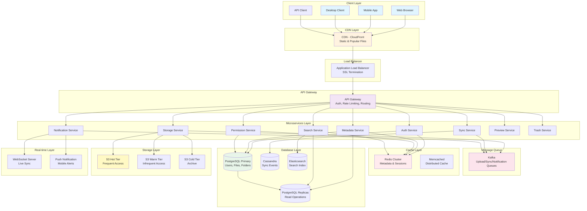
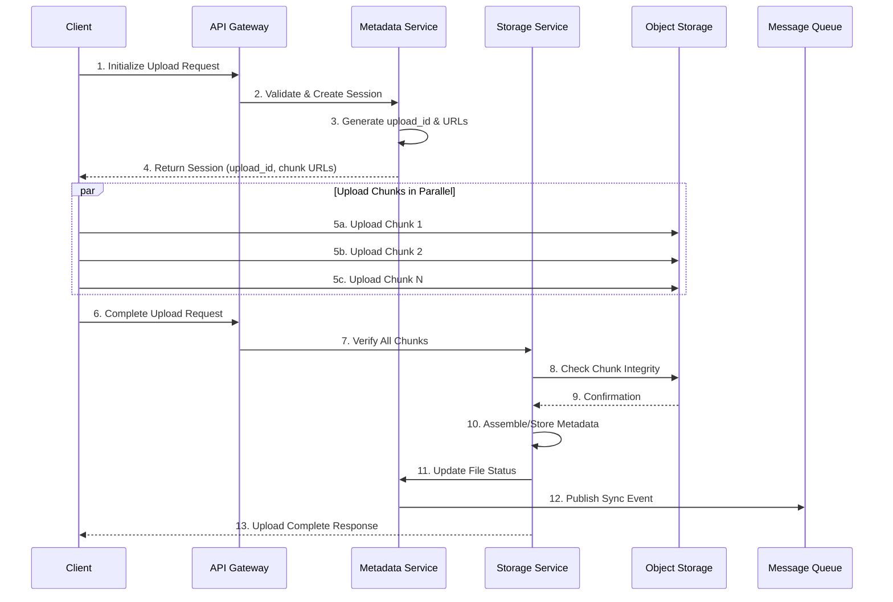
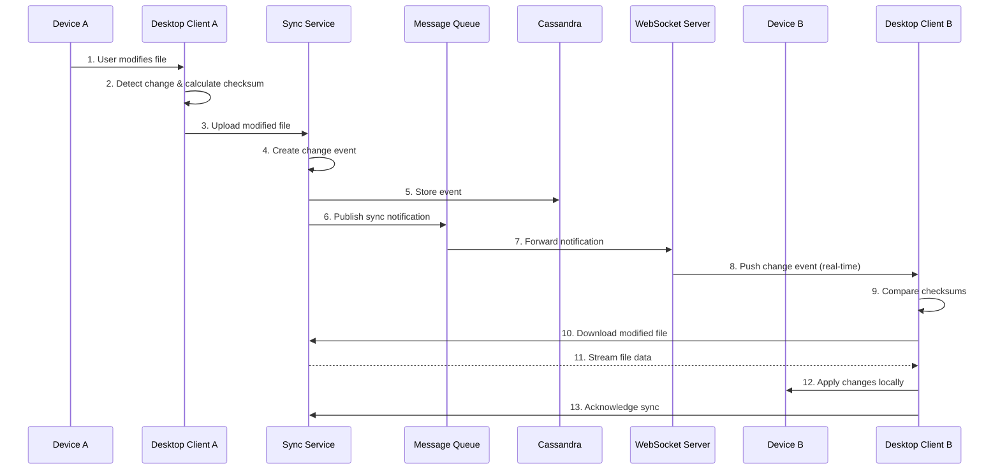
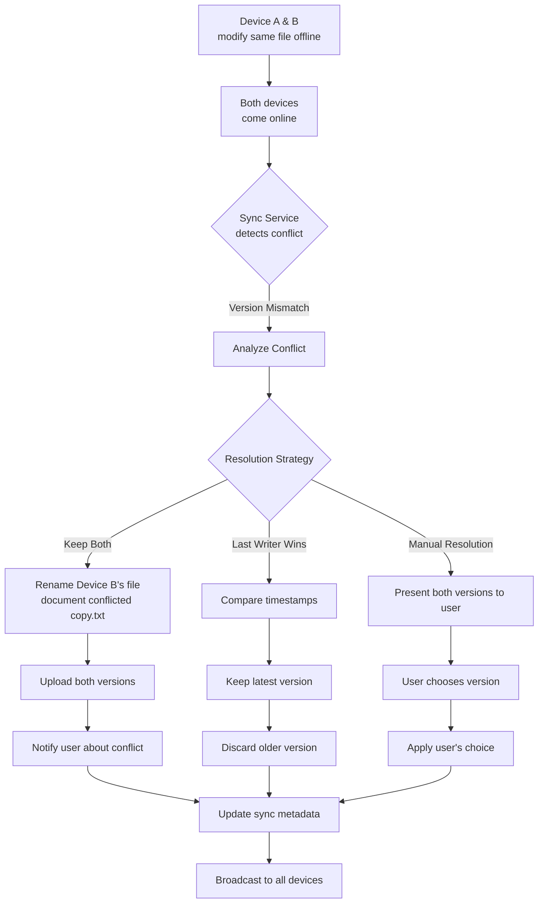
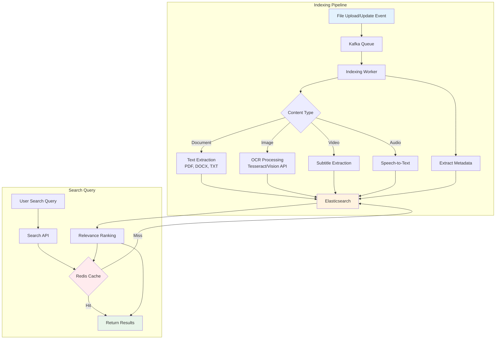

# Google Drive System Design

## Table of Contents
1. [Requirements](#requirements)
2. [Core Entities](#core-entities)
3. [API Interface](#api-interface)
4. [Data Flow](#data-flow)
5. [High-Level Design (HLD)](#high-level-design)
6. [Deep Dives](#deep-dives)
7. [Database Schema](#database-schema)
8. [Capacity Estimation](#capacity-estimation)
9. [Scalability & Optimization](#scalability-optimization)

---

## Requirements

### Functional Requirements

**Core Features:**
1. **File Operations**
   - Upload files (single and batch)
   - Download files
   - Delete files (trash and permanent)
   - Copy and move files
   - File versioning

2. **Folder Operations**
   - Create, rename, delete folders
   - Move files/folders between folders
   - Nested folder hierarchy
   - Folder permissions

3. **Sharing & Permissions**
   - Share files/folders with specific users
   - Share via public/private links
   - Permission levels: Viewer, Commenter, Editor, Owner
   - Revoke access

4. **Synchronization**
   - Sync files across devices
   - Desktop client synchronization
   - Mobile app synchronization
   - Conflict detection and resolution

5. **Search & Organization**
   - Search by filename
   - Search by file type
   - Filter by date, owner
   - Star/favorite files

6. **Storage Management**
   - Track storage quota per user
   - Display storage breakdown by file type
   - Warn when approaching limit

### Non-Functional Requirements

1. **Availability**
   - 99.99% uptime
   - No single point of failure
   - Graceful degradation

2. **Consistency**
   - Strong consistency for file metadata
   - Eventual consistency for synchronization
   - Conflict-free file versioning

3. **Performance**
   - Fast upload/download (utilize full bandwidth)
   - Sync latency < 2 seconds
   - API response < 200ms

4. **Scalability**
   - Support billions of files
   - Handle millions of concurrent users
   - Efficient storage utilization

5. **Security**
   - End-to-end encryption for files at rest
   - Encryption in transit (HTTPS)
   - Secure sharing with access controls
   - Audit logs for compliance

6. **Reliability**
   - Data durability: 99.999999999% (11 nines)
   - Automatic backups
   - Disaster recovery

---

## Core Entities

### 1. User
```
User {
  user_id: UUID (primary key)
  email: string (unique)
  name: string
  storage_quota: long (bytes)
  storage_used: long (bytes)
  created_at: timestamp
  last_login: timestamp
}
```

**Key Attributes:**
- Unique identifier for each user
- Email for authentication and notifications
- Storage quota and usage tracking
- Account metadata

### 2. File
```
File {
  file_id: UUID (primary key)
  name: string
  parent_folder_id: UUID (foreign key)
  owner_id: UUID (foreign key to User)
  size: long (bytes)
  mime_type: string
  storage_path: string
  checksum: string (SHA-256)
  version: integer
  is_deleted: boolean
  created_at: timestamp
  updated_at: timestamp
  deleted_at: timestamp
}
```

**Key Attributes:**
- Unique file identifier
- Parent folder for hierarchy
- Owner and permissions
- Storage location and metadata
- Version tracking
- Soft delete support

### 3. Folder
```
Folder {
  folder_id: UUID (primary key)
  name: string
  parent_folder_id: UUID (foreign key, nullable for root)
  owner_id: UUID (foreign key to User)
  is_deleted: boolean
  created_at: timestamp
  updated_at: timestamp
}
```

**Key Attributes:**
- Unique folder identifier
- Hierarchical structure via parent reference
- Owner and permissions
- Soft delete support

### 4. FileVersion
```
FileVersion {
  version_id: UUID (primary key)
  file_id: UUID (foreign key)
  version_number: integer
  size: long
  storage_path: string
  checksum: string
  created_at: timestamp
  created_by: UUID (foreign key to User)
}
```

**Key Attributes:**
- Track all versions of a file
- Storage location for each version
- Version metadata and creator

### 5. Permission
```
Permission {
  permission_id: UUID (primary key)
  resource_id: UUID (file_id or folder_id)
  resource_type: enum (FILE, FOLDER)
  user_id: UUID (foreign key to User, nullable)
  permission_type: enum (OWNER, EDITOR, COMMENTER, VIEWER)
  is_public: boolean
  share_link: string (nullable)
  created_at: timestamp
  expires_at: timestamp (nullable)
}
```

**Key Attributes:**
- Granular access control per file/folder
- Support for user-specific and public sharing
- Permission hierarchy (owner > editor > commenter > viewer)
- Optional expiration

### 6. SyncMetadata
```
SyncMetadata {
  sync_id: UUID (primary key)
  user_id: UUID (foreign key)
  device_id: string
  file_id: UUID (foreign key)
  local_path: string
  last_synced: timestamp
  sync_status: enum (SYNCED, PENDING, CONFLICT)
  checksum: string
}
```

**Key Attributes:**
- Track sync status per device
- Detect conflicts
- Map cloud files to local paths

---

## API Interface

### Authentication APIs
```
POST   /api/v1/auth/login
POST   /api/v1/auth/logout
POST   /api/v1/auth/refresh-token
GET    /api/v1/auth/me
```

### File Management APIs
```
POST   /api/v1/files/upload
GET    /api/v1/files/{file_id}
GET    /api/v1/files/{file_id}/download
PUT    /api/v1/files/{file_id}
DELETE /api/v1/files/{file_id}
POST   /api/v1/files/{file_id}/copy
POST   /api/v1/files/{file_id}/move
GET    /api/v1/files/{file_id}/versions
POST   /api/v1/files/{file_id}/restore
```

### Folder Management APIs
```
POST   /api/v1/folders
GET    /api/v1/folders/{folder_id}
PUT    /api/v1/folders/{folder_id}
DELETE /api/v1/folders/{folder_id}
GET    /api/v1/folders/{folder_id}/contents
POST   /api/v1/folders/{folder_id}/move
```

### Sharing & Permissions APIs
```
POST   /api/v1/files/{file_id}/share
GET    /api/v1/files/{file_id}/permissions
PUT    /api/v1/permissions/{permission_id}
DELETE /api/v1/permissions/{permission_id}
POST   /api/v1/files/{file_id}/share-link
GET    /api/v1/shared-with-me
```

### Synchronization APIs
```
GET    /api/v1/sync/changes?cursor={cursor}
POST   /api/v1/sync/register-device
GET    /api/v1/sync/status
POST   /api/v1/sync/resolve-conflict
```

### Search APIs
```
GET    /api/v1/search?q={query}&type={file_type}&owner={owner}
GET    /api/v1/recent
GET    /api/v1/starred
```

### Storage Management APIs
```
GET    /api/v1/storage/quota
GET    /api/v1/storage/breakdown
GET    /api/v1/trash
POST   /api/v1/trash/{file_id}/restore
DELETE /api/v1/trash/{file_id}/permanent
POST   /api/v1/trash/empty
```

---

## Data Flow

### 1. File Upload Flow

```
User Upload Request
    ↓
API Gateway (Auth & Validation)
    ↓
Application Server
    ↓
├─→ Metadata Service
│   ├─→ Generate file_id
│   ├─→ Check storage quota
│   ├─→ Create metadata entry in DB
│   └─→ Return upload URL
│
└─→ Client receives upload URL
    ↓
Client uploads to Storage Service
    ↓
├─→ Chunk file (if large)
├─→ Calculate checksum
├─→ Upload chunks to Object Storage
└─→ Verify integrity
    ↓
Storage Service confirms upload
    ↓
Metadata Service updates status
    ↓
├─→ Update file status to COMPLETE
├─→ Update user storage_used
├─→ Add to file version history
└─→ Trigger sync notification
    ↓
Notification Service
    ↓
Notify other devices via WebSocket/Push
```

### 2. File Download Flow

```
User Download Request
    ↓
API Gateway (Auth & Permission Check)
    ↓
Application Server
    ↓
Metadata Service
    ↓
├─→ Verify file exists
├─→ Check user permissions
└─→ Get storage location
    ↓
Check CDN Cache
    ↓
├─→ Cache Hit: Return from CDN
└─→ Cache Miss: Fetch from Object Storage
    ↓
Object Storage
    ↓
├─→ Stream file chunks
├─→ Update CDN cache
└─→ Return to client
    ↓
Client receives file
```

### 3. File Sync Flow

```
Device A: File Modified
    ↓
Desktop Client detects change
    ↓
├─→ Calculate checksum
├─→ Compare with last sync
└─→ Detect modification
    ↓
Upload to Cloud (via Upload Flow)
    ↓
Metadata Service
    ↓
├─→ Update file version
├─→ Create change event
└─→ Add to sync queue
    ↓
Notification Service
    ↓
├─→ WebSocket: Notify online devices
└─→ Push: Notify offline devices
    ↓
Device B receives notification
    ↓
Desktop Client on Device B
    ↓
├─→ Fetch change events (polling/WebSocket)
├─→ Compare local checksum
└─→ Detect conflict or update needed
    ↓
Download modified file
    ↓
Apply changes locally
    ↓
Update sync metadata
```

### 4. Sharing Flow

```
User initiates share
    ↓
API Gateway
    ↓
Permission Service
    ↓
├─→ Validate share request
├─→ Check owner permissions
└─→ Create permission entry
    ↓
If sharing with user:
    ├─→ Create user-specific permission
    ├─→ Notify user via email
    └─→ Add to "Shared with me"

If sharing via link:
    ├─→ Generate unique share link
    ├─→ Store link mapping
    └─→ Return link to user
    ↓
Recipient accesses shared resource
    ↓
Permission Service validates access
    ↓
Grant access based on permission level
```

### 5. Conflict Resolution Flow

```
Device A: Modifies file
Device B: Modifies same file (offline)
    ↓
Device A syncs first
    ↓
Cloud version updated (v2)
    ↓
Device B comes online
    ↓
Sync Service detects conflict
    ↓
├─→ Cloud version: v2 (checksum X)
└─→ Local version: v2 (checksum Y)
    ↓
Conflict Resolution Strategy
    ↓
├─→ Keep both versions:
│   ├─→ Rename Device B's file
│   │   "document.txt" → "document (Device B's conflicted copy).txt"
│   └─→ Upload as new file
│
├─→ Last-writer-wins (if configured):
│   └─→ Overwrite with latest timestamp
│
└─→ Manual resolution:
    └─→ Prompt user to choose version
    ↓
Update sync metadata
    ↓
Notify all devices
```

---

## High-Level Design

### System Architecture



### Component Responsibilities

**1. Client Layer**
- Web, mobile, and desktop applications
- Local file system monitoring (desktop)
- Chunked upload/download
- Offline support with local cache

**2. CDN Layer**
- Cache static assets and popular files
- Edge location serving for low latency
- Reduce origin server load

**3. Load Balancer**
- Distribute traffic across API gateways
- SSL/TLS termination
- Health checks and automatic failover
- Geographic routing

**4. API Gateway**
- Centralized authentication and authorization
- Rate limiting per user/IP
- Request validation
- API versioning
- Request routing to microservices

**5. Microservices**

- **Auth Service**: User authentication, JWT token management, OAuth integration
- **Metadata Service**: File/folder metadata CRUD, hierarchy management, version tracking
- **Storage Service**: Handle file uploads/downloads, chunking, deduplication
- **Sync Service**: Track device sync state, detect changes, conflict resolution
- **Permission Service**: Manage access control, sharing, link generation
- **Notification Service**: Push notifications, email alerts, WebSocket updates
- **Search Service**: Index files, full-text search, filter and sort
- **Preview Service**: Generate thumbnails, document previews, image processing
- **Trash Service**: Soft delete management, trash retention, permanent deletion

**6. Message Queue**
- Decouple services
- Async processing (uploads, sync, notifications)
- Guaranteed delivery
- Load smoothing

**7. Cache Layer**
- **Redis**: Hot metadata (file info, folder structure, user sessions)
- **Memcached**: Distributed session store
- Reduce database load
- Fast read operations

**8. Database Layer**
- **PostgreSQL**: Relational data (users, files, folders, permissions)
- **Read Replicas**: Scale read operations
- **Cassandra**: High-write throughput (sync events, activity logs)
- **Elasticsearch**: Full-text search indexing

**9. Object Storage**
- **Hot Tier**: Frequently accessed files
- **Warm Tier**: Infrequently accessed files
- **Cold Tier**: Archive storage
- 11 nines durability
- Versioning support

**10. Real-time Communication**
- WebSocket for live sync notifications
- Push notifications for mobile
- Server-sent events for web

---

## Deep Dives

### Deep Dive 1: File Upload System

#### Upload Architecture

**Chunked Upload Strategy**

For large files, implement resumable chunked uploads:

1. **Client-side chunking**
   - Split file into chunks (e.g., 4MB each)
   - Calculate checksum for each chunk
   - Calculate overall file checksum

2. **Upload initialization**
   - Client requests upload session from Metadata Service
   - Metadata Service generates upload_id and pre-signed URLs
   - Return chunk upload URLs to client

3. **Parallel chunk upload**
   - Client uploads chunks concurrently (e.g., 4-6 parallel connections)
   - Each chunk uploaded to Object Storage directly
   - Resume failed chunks without re-uploading entire file

4. **Upload completion**
   - Client notifies completion
   - Storage Service verifies all chunks received
   - Assembles chunks or stores chunk metadata
   - Updates file status in metadata database

**Deduplication**

Implement content-based deduplication:

1. **Block-level deduplication**
   - Calculate SHA-256 hash for each chunk
   - Check if chunk hash exists in storage
   - If exists, create reference pointer instead of storing duplicate
   - Store only unique chunks

2. **Benefits**
   - Reduce storage costs by 30-50%
   - Faster uploads for duplicate content
   - Efficient for common files (photos, documents)

**Upload Flow Diagram**



**Storage Optimization**

1. **Compression**
   - Compress text-based files (documents, code)
   - Smart compression for images (detect already compressed formats)
   - Video transcoding for streaming

2. **Tiered Storage**
   - Hot: Files accessed in last 30 days (SSD-backed)
   - Warm: Files accessed in last 90 days (Standard storage)
   - Cold: Files not accessed in 90+ days (Archive storage)
   - Automatic lifecycle policies

---

### Deep Dive 2: Synchronization Service

#### Sync Architecture

**Change Detection**

Multiple strategies for detecting file changes:

1. **File System Monitoring (Desktop Client)**
   - Use OS-specific APIs (inotify on Linux, FSEvents on macOS, ReadDirectoryChangesW on Windows)
   - Watch for CREATE, MODIFY, DELETE, RENAME events
   - Debounce rapid changes (e.g., wait 1 second of inactivity)

2. **Polling (Mobile/Web)**
   - Long-polling or periodic polling
   - Fetch changes since last sync timestamp
   - Delta sync to minimize data transfer

3. **Push Notifications**
   - Server pushes changes to connected clients via WebSocket
   - Immediate notification for multi-device sync
   - Fallback to polling if WebSocket unavailable

**Change Propagation Flow**



**Conflict Resolution**

Multi-strategy conflict handling:



**Sync Optimization**

1. **Delta Sync**
   - Only sync changed blocks, not entire file
   - Use rsync algorithm or binary diff
   - Reduce bandwidth by 80-90% for large file modifications

2. **Batch Sync**
   - Group multiple small file changes
   - Single sync request for batch
   - Reduce API calls and overhead

3. **Sync Prioritization**
   - Prioritize recent files
   - Prioritize starred/important files
   - Background sync for old files

4. **Bandwidth Management**
   - Adaptive bandwidth throttling
   - Pause/resume sync
   - Sync scheduling (night-time for large files)

---

### Deep Dive 3: Metadata Management

#### Metadata Architecture

**Metadata Storage Strategy**

1. **Hot Metadata (Redis)**
   - Recently accessed file/folder metadata
   - User session data
   - Permission cache
   - TTL: 1 hour

2. **Warm Metadata (PostgreSQL)**
   - Complete file/folder hierarchy
   - User information
   - Permissions
   - File versions

3. **Cold Metadata (Archive)**
   - Deleted files metadata (trash)
   - Old versions metadata
   - Audit logs

**Folder Hierarchy Representation**

**Approach 1: Adjacency List**
- Each folder stores parent_folder_id
- Simple inserts and updates
- Inefficient for retrieving full path

**Approach 2: Materialized Path**
- Store full path: `/root/folder1/folder2/`
- Fast path retrieval
- Complex updates when renaming parent

**Approach 3: Nested Set Model**
- Store left and right boundaries
- Efficient subtree queries
- Complex inserts/deletes

**Recommended: Hybrid Approach**
- Use Adjacency List in PostgreSQL
- Cache materialized paths in Redis
- Regenerate cache on path changes

**Metadata Operations**

1. **List Folder Contents**
   - Query: `SELECT * FROM files WHERE parent_folder_id = ? AND is_deleted = false`
   - Cache result in Redis with key: `folder:contents:{folder_id}`
   - Invalidate cache on any child modification

2. **Get Full Path**
   - Recursive query up parent hierarchy
   - Cache path in Redis: `folder:path:{folder_id}` → `/path/to/folder`
   - Eager cache regeneration on rename

3. **Search Files**
   - Full-text search in Elasticsearch
   - Index: filename, content (OCR for images), owner, tags
   - Filter by folder, date range, file type
   - Return file_ids, fetch metadata from PostgreSQL

4. **Move File/Folder**
   - Update parent_folder_id
   - Check permission in new location
   - If folder, recursively update all children paths
   - Invalidate affected caches

**Metadata Consistency**

1. **Write Operations**
   - Write to PostgreSQL (source of truth)
   - Invalidate Redis cache
   - Async update Elasticsearch index
   - Strong consistency for critical operations

2. **Read Operations**
   - Check Redis cache first
   - Cache miss: Query PostgreSQL
   - Populate cache with TTL
   - Eventual consistency acceptable

3. **Transaction Management**
   - Use database transactions for multi-table updates
   - Example: Move file = Update file table + Update parent's modified timestamp + Update user's storage
   - Ensure atomicity

---

### Deep Dive 4: Sharing & Permissions

#### Permission Model

**Permission Hierarchy**

1. **Owner**
   - Full control over file/folder
   - Can delete, rename, share
   - Can change permissions
   - Cannot be removed as owner

2. **Editor**
   - Can view, comment, and edit
   - Can upload new versions
   - Cannot delete or change permissions
   - Can share with others (if owner allows)

3. **Commenter**
   - Can view and add comments
   - Cannot edit content
   - Useful for review workflows

4. **Viewer**
   - Read-only access
   - Can view and download
   - No modification rights

**Inheritance Model**

Permissions cascade down folder hierarchy:

1. **Explicit Permissions**
   - Directly assigned to file/folder
   - Takes precedence over inherited permissions

2. **Inherited Permissions**
   - Folder permissions apply to all children
   - Child can have more restrictive permissions
   - Cannot have more permissive permissions than parent

3. **Permission Resolution**
   - Check explicit permission first
   - If none, traverse up folder hierarchy
   - Apply most restrictive permission found
   - Cache permission resolution result

**Sharing Implementation**

1. **Share with Specific Users**
   - User A shares file with User B
   - Create permission entry: `{file_id, user_b_id, EDITOR}`
   - Send email notification to User B
   - Add to User B's "Shared with me" view
   - User B can access via shared view or direct link

2. **Share via Link**
   - Generate unique share token: `https://drive.com/share/{token}`
   - Store mapping: `{token → file_id, permission_level, expiration}`
   - Anyone with link can access (if configured)
   - Optional: Password protection, expiration date
   - Track link usage in analytics

3. **Public Sharing**
   - Set file/folder as public
   - Accessible to anyone on internet
   - Indexable by search engines (optional)
   - Show warning about public access

**Share Link Security**

1. **Token Generation**
   - Use cryptographically secure random tokens
   - Minimum 32 characters
   - Non-guessable URLs

2. **Access Validation**
   - Check token exists and not expired
   - Verify permission level
   - Rate limit link access (prevent scraping)
   - Log all access attempts

3. **Revocation**
   - Owner can revoke share link instantly
   - Delete token mapping
   - All future access attempts fail
   - Notify affected users (optional)

---

### Deep Dive 5: Search & Indexing

#### Search Architecture



**Elasticsearch Index Design**

Index structure for file search:

```
file_search_index {
  file_id: keyword
  filename: text (analyzed)
  file_extension: keyword
  owner_id: keyword
  owner_name: text
  parent_path: text
  mime_type: keyword
  size: long
  created_at: date
  updated_at: date
  is_starred: boolean
  is_shared: boolean
  shared_with: keyword[] (user_ids)
  tags: keyword[]
  content: text (for text files)
  ocr_text: text (for images with OCR)
}
```

**Indexing Pipeline**

1. **Real-time Indexing**
   - On file upload/update, publish event to Kafka
   - Indexing worker consumes event
   - Extract metadata and content
   - Index in Elasticsearch
   - Latency: < 2 seconds

2. **Content Extraction**
   - **Documents**: Extract text from PDF, DOCX, TXT
   - **Images**: OCR using Google Vision API or Tesseract
   - **Videos**: Extract subtitles/captions if available
   - **Audio**: Speech-to-text transcription
   - Store extracted content in `content` field

3. **Incremental Indexing**
   - Only index changed files
   - Update existing documents in index
   - Delete index entries for deleted files

**Search Query Types**

1. **Simple Search**
   - Search by filename
   - Query: `GET /file_search_index/_search?q=filename:report`
   - Fuzzy matching for typos
   - Autocomplete suggestions

2. **Advanced Search**
   - Multi-field search: filename OR content
   - Filters: file type, owner, date range
   - Sorting: relevance, date, size
   - Pagination with scroll API

3. **Faceted Search**
   - Aggregations by file type, owner, date
   - Show counts for each facet
   - Enable drill-down filtering

**Search Optimization**

1. **Query Performance**
   - Use index sharding (shard by user_id)
   - Filter before query (reduce search space)
   - Cache frequent searches
   - Use result pagination

2. **Relevance Tuning**
   - Boost filename matches over content
   - Boost recent files
   - Boost files from owner
   - Custom scoring algorithm

3. **Search Analytics**
   - Track popular searches
   - Identify failed searches (no results)
   - Improve indexing based on usage patterns

---

### Deep Dive 6: Real-time Collaboration

#### Collaborative Editing Architecture

**Operational Transformation (OT)**

For real-time collaborative document editing:

1. **Basic Concepts**
   - Multiple users edit same document simultaneously
   - Each edit is an operation: INSERT, DELETE, REPLACE
   - Operations are transformed to account for concurrent edits
   - Ensures all clients converge to same state

2. **Operation Flow**
   - User A types "Hello" at position 0
   - Operation: `{type: INSERT, position: 0, text: "Hello"}`
   - Send to server
   - Server broadcasts to all connected clients
   - Clients apply operation to local document

3. **Conflict Resolution**
   - User A inserts at position 5
   - User B deletes at position 3
   - Operations conflict
   - OT algorithm transforms operations
   - Both clients converge to same result

**Real-time Communication**

1. **WebSocket Connection**
   - Establish WebSocket on document open
   - Persistent bidirectional connection
   - Low latency (< 100ms)
   - Heartbeat to detect disconnections

2. **Presence Awareness**
   - Show active users editing document
   - Display cursor positions
   - Show user avatars and colors
   - Indicate who is typing

3. **Offline Support**
   - Queue operations locally when offline
   - Sync when connection restored
   - Resolve conflicts with OT

**Document Locking**

For non-collaborative workflows:

1. **Pessimistic Locking**
   - User requests edit lock
   - Lock granted if document not locked
   - Other users see "locked by User X"
   - Auto-release lock after timeout (30 min)

2. **Optimistic Locking**
   - Allow concurrent edits
   - Detect conflicts on save
   - Prompt user to resolve conflicts
   - Merge changes or overwrite

---

## Database Schema

### PostgreSQL Schema

**Users Table**
```sql
CREATE TABLE users (
    user_id UUID PRIMARY KEY DEFAULT gen_random_uuid(),
    email VARCHAR(255) UNIQUE NOT NULL,
    name VARCHAR(255) NOT NULL,
    password_hash VARCHAR(255) NOT NULL,
    storage_quota BIGINT DEFAULT 15000000000, -- 15GB in bytes
    storage_used BIGINT DEFAULT 0,
    is_active BOOLEAN DEFAULT true,
    created_at TIMESTAMP DEFAULT CURRENT_TIMESTAMP,
    updated_at TIMESTAMP DEFAULT CURRENT_TIMESTAMP,
    last_login TIMESTAMP
);

CREATE INDEX idx_users_email ON users(email);
CREATE INDEX idx_users_created_at ON users(created_at);
```

**Folders Table**
```sql
CREATE TABLE folders (
    folder_id UUID PRIMARY KEY DEFAULT gen_random_uuid(),
    name VARCHAR(255) NOT NULL,
    parent_folder_id UUID REFERENCES folders(folder_id) ON DELETE CASCADE,
    owner_id UUID REFERENCES users(user_id) NOT NULL,
    is_deleted BOOLEAN DEFAULT false,
    is_starred BOOLEAN DEFAULT false,
    created_at TIMESTAMP DEFAULT CURRENT_TIMESTAMP,
    updated_at TIMESTAMP DEFAULT CURRENT_TIMESTAMP,
    deleted_at TIMESTAMP
);

CREATE INDEX idx_folders_parent ON folders(parent_folder_id) WHERE is_deleted = false;
CREATE INDEX idx_folders_owner ON folders(owner_id) WHERE is_deleted = false;
CREATE INDEX idx_folders_deleted ON folders(deleted_at) WHERE is_deleted = true;
```

**Files Table**
```sql
CREATE TABLE files (
    file_id UUID PRIMARY KEY DEFAULT gen_random_uuid(),
    name VARCHAR(255) NOT NULL,
    parent_folder_id UUID REFERENCES folders(folder_id),
    owner_id UUID REFERENCES users(user_id) NOT NULL,
    size BIGINT NOT NULL,
    mime_type VARCHAR(127),
    storage_path VARCHAR(1023) NOT NULL,
    checksum VARCHAR(64) NOT NULL, -- SHA-256
    version INTEGER DEFAULT 1,
    is_deleted BOOLEAN DEFAULT false,
    is_starred BOOLEAN DEFAULT false,
    created_at TIMESTAMP DEFAULT CURRENT_TIMESTAMP,
    updated_at TIMESTAMP DEFAULT CURRENT_TIMESTAMP,
    deleted_at TIMESTAMP
);

CREATE INDEX idx_files_parent ON files(parent_folder_id) WHERE is_deleted = false;
CREATE INDEX idx_files_owner ON files(owner_id) WHERE is_deleted = false;
CREATE INDEX idx_files_checksum ON files(checksum); -- For deduplication
CREATE INDEX idx_files_deleted ON files(deleted_at) WHERE is_deleted = true;
CREATE INDEX idx_files_updated ON files(updated_at DESC);
```

**File Versions Table**
```sql
CREATE TABLE file_versions (
    version_id UUID PRIMARY KEY DEFAULT gen_random_uuid(),
    file_id UUID REFERENCES files(file_id) ON DELETE CASCADE,
    version_number INTEGER NOT NULL,
    size BIGINT NOT NULL,
    storage_path VARCHAR(1023) NOT NULL,
    checksum VARCHAR(64) NOT NULL,
    created_at TIMESTAMP DEFAULT CURRENT_TIMESTAMP,
    created_by UUID REFERENCES users(user_id),
    UNIQUE(file_id, version_number)
);

CREATE INDEX idx_versions_file ON file_versions(file_id, version_number DESC);
```

**Permissions Table**
```sql
CREATE TABLE permissions (
    permission_id UUID PRIMARY KEY DEFAULT gen_random_uuid(),
    resource_id UUID NOT NULL, -- file_id or folder_id
    resource_type VARCHAR(10) NOT NULL CHECK (resource_type IN ('FILE', 'FOLDER')),
    user_id UUID REFERENCES users(user_id), -- NULL for public/link shares
    permission_type VARCHAR(10) NOT NULL CHECK (permission_type IN ('OWNER', 'EDITOR', 'COMMENTER', 'VIEWER')),
    is_public BOOLEAN DEFAULT false,
    share_token VARCHAR(64) UNIQUE, -- For shareable links
    share_password_hash VARCHAR(255), -- Optional password protection
    created_at TIMESTAMP DEFAULT CURRENT_TIMESTAMP,
    expires_at TIMESTAMP, -- Optional expiration
    created_by UUID REFERENCES users(user_id)
);

CREATE INDEX idx_permissions_resource ON permissions(resource_id, resource_type);
CREATE INDEX idx_permissions_user ON permissions(user_id);
CREATE INDEX idx_permissions_token ON permissions(share_token) WHERE share_token IS NOT NULL;
CREATE INDEX idx_permissions_public ON permissions(is_public) WHERE is_public = true;
```

**Sync Metadata Table**
```sql
CREATE TABLE sync_metadata (
    sync_id UUID PRIMARY KEY DEFAULT gen_random_uuid(),
    user_id UUID REFERENCES users(user_id) NOT NULL,
    device_id VARCHAR(255) NOT NULL,
    device_name VARCHAR(255),
    file_id UUID REFERENCES files(file_id),
    local_path VARCHAR(1023),
    last_synced TIMESTAMP,
    sync_status VARCHAR(20) CHECK (sync_status IN ('SYNCED', 'PENDING', 'CONFLICT', 'ERROR')),
    checksum VARCHAR(64),
    UNIQUE(user_id, device_id, file_id)
);

CREATE INDEX idx_sync_user_device ON sync_metadata(user_id, device_id);
CREATE INDEX idx_sync_status ON sync_metadata(sync_status) WHERE sync_status != 'SYNCED';
```

**Shared With Me View**
```sql
CREATE VIEW shared_with_me AS
SELECT
    p.permission_id,
    p.resource_id,
    p.resource_type,
    p.permission_type,
    p.created_at as shared_at,
    u.user_id as owner_id,
    u.name as owner_name,
    CASE
        WHEN p.resource_type = 'FILE' THEN f.name
        WHEN p.resource_type = 'FOLDER' THEN fo.name
    END as resource_name
FROM permissions p
LEFT JOIN files f ON p.resource_id = f.file_id AND p.resource_type = 'FILE'
LEFT JOIN folders fo ON p.resource_id = fo.folder_id AND p.resource_type = 'FOLDER'
LEFT JOIN users u ON f.owner_id = u.user_id OR fo.owner_id = u.user_id
WHERE p.user_id IS NOT NULL;
```

### Cassandra Schema (for Sync Events)

**Sync Events Table**
```
CREATE TABLE sync_events (
    user_id UUID,
    event_id TIMEUUID,
    event_type TEXT, -- CREATE, UPDATE, DELETE, RENAME, MOVE
    resource_id UUID,
    resource_type TEXT, -- FILE, FOLDER
    device_id TEXT,
    checksum TEXT,
    old_path TEXT,
    new_path TEXT,
    timestamp TIMESTAMP,
    PRIMARY KEY ((user_id), event_id)
) WITH CLUSTERING ORDER BY (event_id DESC)
AND default_time_to_live = 2592000; -- 30 days TTL
```

### Redis Cache Schema

**Cache Keys**

```
# User session
session:{user_id} → {token, device_id, expires_at}

# File metadata
file:metadata:{file_id} → {name, size, mime_type, owner_id, ...}

# Folder contents
folder:contents:{folder_id} → [{file_id, name, size}, ...]

# User storage
user:storage:{user_id} → {quota, used, percentage}

# Permissions cache
permission:{user_id}:{resource_id} → {permission_type}

# Share token mapping
share:token:{token} → {resource_id, resource_type, permission_type, expires_at}

# Recent files per user
user:recent:{user_id} → [file_id1, file_id2, ...] (ordered list, max 50)

# Sync cursor (for delta sync)
sync:cursor:{user_id}:{device_id} → {last_event_id, timestamp}
```

---

## Capacity Estimation

### Traffic Estimates

**Assumptions:**
- Total users: 1 billion
- Daily Active Users (DAU): 100 million (10%)
- Average files per user: 1000
- Average file size: 2 MB
- Daily uploads per active user: 5 files
- Daily downloads per active user: 10 files
- Read:Write ratio: 70:30

**Daily Metrics:**
```
Daily Uploads:
100M users × 5 uploads = 500M uploads/day
500M / 86400 = ~5,787 uploads/sec (average)
Peak (3x average) = ~17,361 uploads/sec

Daily Downloads:
100M users × 10 downloads = 1B downloads/day
1B / 86400 = ~11,574 downloads/sec (average)
Peak = ~34,722 downloads/sec

Metadata Operations (list, search, etc.):
100M users × 50 operations = 5B operations/day
5B / 86400 = ~57,870 ops/sec (average)
Peak = ~173,610 ops/sec
```

### Storage Estimates

**File Storage:**
```
Total users: 1B
Files per user: 1,000
Average file size: 2 MB

Total files = 1B × 1,000 = 1 trillion files
Total storage = 1T × 2 MB = 2,000 PB = 2 EB (Exabytes)

With deduplication (40% reduction):
Actual storage = 2 EB × 0.6 = 1.2 EB

Daily new storage:
500M uploads × 2 MB = 1 PB/day
Annual new storage = 365 PB/year
```

**Metadata Storage:**
```
Metadata per file = 1 KB (file_id, name, path, owner, size, etc.)
Total files = 1 trillion
Metadata storage = 1T × 1 KB = 1 TB

With indexes (3x data size):
Total metadata storage = 1 TB × 3 = 3 TB
```

**Version Storage:**
```
Average versions per file: 3
Version metadata: 500 bytes
Total version storage = 1T files × 3 versions × 500 bytes = 1.5 TB

Version file storage (20% of files have multiple versions):
0.2 × 1T × 2 versions × 2 MB = 800 PB
```

**Total Storage (with replication factor 3):**
```
File storage: 1.2 EB × 3 = 3.6 EB
Metadata: 3 TB × 3 = 9 TB
Versions: 800 PB × 3 = 2.4 PB
Total: ~3.6 EB
```

### Bandwidth Estimates

**Incoming (Upload):**
```
Average: 5,787 uploads/sec × 2 MB = 11.5 GB/sec = 92 Gbps
Peak: 17,361 uploads/sec × 2 MB = 34.7 GB/sec = 278 Gbps
```

**Outgoing (Download):**
```
Average: 11,574 downloads/sec × 2 MB = 23.1 GB/sec = 185 Gbps
Peak: 34,722 downloads/sec × 2 MB = 69.4 GB/sec = 555 Gbps
```

**Metadata API:**
```
Average: 57,870 ops/sec × 10 KB = 578 MB/sec = 4.6 Gbps
Peak: 173,610 ops/sec × 10 KB = 1.7 GB/sec = 13.6 Gbps
```

**Total Bandwidth:**
```
Average: 92 + 185 + 4.6 = 281.6 Gbps
Peak: 278 + 555 + 13.6 = 846.6 Gbps ≈ 850 Gbps
```

### Memory Estimates

**Cache Requirements:**
```
# Hot metadata cache (1% of files accessed frequently)
Hot files = 1T × 0.01 = 10B files
Metadata per file = 1 KB
Cache size = 10B × 1 KB = 10 TB

# Session cache
Concurrent users = 10M
Session data = 1 KB per user
Total = 10M × 1 KB = 10 GB

# Permission cache (hot permissions)
Hot permissions = 100M
Per permission = 200 bytes
Total = 100M × 200 bytes = 20 GB

Total cache requirement: 10 TB + 10 GB + 20 GB ≈ 10 TB
```

### Server Estimates

**API Servers:**
```
Total requests per second (peak): 173,610 ops/sec
Requests per server: 1,000 req/sec
Required servers: 173,610 / 1,000 = 174 servers
With redundancy (2x): 350 servers
```

**Upload Workers:**
```
Peak uploads: 17,361 uploads/sec
Average upload time: 10 seconds (with chunking)
Concurrent uploads: 17,361 × 10 = 173,610
Workers per upload: 1
Required workers: 174,000 workers (scaled dynamically)
```

**Database Servers:**
```
PostgreSQL (Metadata):
- Primary: 1 large instance (write)
- Read replicas: 50 instances (read-heavy workload)

Cassandra (Sync Events):
- 100 nodes (for high write throughput)
- Replication factor: 3

Elasticsearch (Search):
- 200 nodes (sharded by user_id)
- 50 billion documents indexed
```

**Storage Servers:**
```
Object storage (S3-compatible):
- Distributed across multiple regions
- Multiple storage tiers (hot, warm, cold)
- Automatic replication and durability
```

---

## Scalability & Optimization

### Horizontal Scaling Strategies

**1. Database Sharding**

**Metadata Sharding (PostgreSQL):**
- Shard by user_id using consistent hashing
- Each shard contains subset of users
- 100 shards to distribute load
- Shard key: `user_id % 100`

**Sync Event Sharding (Cassandra):**
- Naturally sharded by partition key (user_id)
- Add nodes as users grow
- Automatic rebalancing

**Search Sharding (Elasticsearch):**
- Shard by user_id
- 500 shards across 200 nodes
- Co-locate user's data on same shard for efficiency

**2. Service Replication**

**Stateless Services:**
- API servers, microservices are stateless
- Use load balancer to distribute requests
- Auto-scale based on CPU/memory/request rate
- Kubernetes HPA for dynamic scaling

**Stateful Services:**
- Database read replicas
- Redis cluster with master-slave replication
- Cassandra multi-datacenter replication

**3. Geographic Distribution**

**Multi-Region Deployment:**
- Deploy in multiple AWS regions (us-east-1, eu-west-1, ap-southeast-1)
- Users routed to nearest region
- Reduce latency by 60-80%

**Cross-Region Replication:**
- Async replication of file data across regions
- Metadata replicated with eventual consistency
- Sync events propagated globally

**4. CDN Edge Caching**

**Static Content:**
- Cache images, videos, documents at edge locations
- 300+ edge locations globally
- Cache hit ratio: 80%+
- Reduce origin load by 80%

**Dynamic Content:**
- Cache file metadata at edge
- Cache user sessions
- Invalidate on updates

### Performance Optimization

**1. Chunked Upload/Download**

**Upload Optimization:**
- Split large files into 4MB chunks
- Parallel upload of chunks (6 connections)
- Resume failed chunks
- Bandwidth utilization: 95%+

**Download Optimization:**
- Range requests for partial downloads
- Parallel chunk downloads
- Resume interrupted downloads
- Adaptive bitrate for videos

**2. Compression**

**File Compression:**
- Compress text files (GZIP): 70% reduction
- Compress images (WebP): 30% reduction
- Skip already compressed formats (JPEG, MP4)
- Background compression for cold storage

**Network Compression:**
- GZIP response compression
- Brotli for supported clients
- Reduce bandwidth by 60%

**3. Deduplication**

**Block-Level Deduplication:**
- Calculate SHA-256 for each 4MB chunk
- Store unique chunks only
- Reference counting for shared chunks
- Storage savings: 40-50%

**Benefits:**
- Reduced storage costs
- Faster uploads (skip duplicate chunks)
- Efficient backups

**4. Caching Strategy**

**Multi-Level Cache:**

**L1: CDN (Edge)**
- Static files, images, videos
- TTL: 24 hours
- Hit ratio: 80%

**L2: Application Cache (Redis)**
- Hot metadata, permissions
- TTL: 1 hour
- Hit ratio: 90%

**L3: Database Query Cache**
- Frequently accessed queries
- TTL: 5 minutes
- Hit ratio: 70%

**Cache Invalidation:**
- Write-through: Update cache on write
- Event-driven: Invalidate on file change
- TTL-based: Expire old entries

**5. Database Optimization**

**Query Optimization:**
- Proper indexing on foreign keys
- Composite indexes for common queries
- Partial indexes for filtered queries
- Query plan analysis and optimization

**Connection Pooling:**
- Pool size: 100 connections per app server
- Reuse connections
- Reduce connection overhead

**Read/Write Splitting:**
- Route writes to primary
- Route reads to replicas
- Load balance across replicas

**6. Async Processing**

**Background Jobs:**
- File preview generation
- Thumbnail creation
- OCR processing
- Video transcoding
- Search indexing

**Benefits:**
- Non-blocking user operations
- Better resource utilization
- Smooth out load spikes

### Availability & Reliability

**1. High Availability Architecture**

**Multi-AZ Deployment:**
- Deploy across 3 availability zones
- Automatic failover on AZ failure
- Synchronous replication within region

**Load Balancer:**
- Active-active load balancers
- Health checks every 10 seconds
- Automatic removal of unhealthy instances

**Database Failover:**
- PostgreSQL automatic failover (30 seconds)
- Cassandra self-healing (no downtime)
- Redis Sentinel for master failover

**2. Data Durability**

**Replication:**
- 3x replication for file data
- Cross-region async replication
- Versioning enabled

**Backups:**
- Daily full backups
- Continuous incremental backups
- 30-day retention
- Point-in-time recovery

**Disaster Recovery:**
- RTO (Recovery Time Objective): 1 hour
- RPO (Recovery Point Objective): 5 minutes
- Regular DR drills

**3. Monitoring & Alerting**

**Metrics:**
- Upload/download success rate
- API latency (p50, p95, p99)
- Error rates
- Storage usage
- Cache hit ratios
- Queue depths

**Alerting:**
- Error rate > 1%
- Latency p99 > 5 seconds
- Storage > 90% capacity
- Queue depth > 10,000
- Service health check failures

**4. Rate Limiting**

**Multi-Level Rate Limits:**
- Per user: 1000 API calls/hour
- Per IP: 10,000 requests/hour
- Upload: 50 GB/day for free tier
- Download: No limit (owned files)

**Throttling:**
- Token bucket algorithm
- Exponential backoff on violations
- Premium users get higher limits

### Security Measures

**1. Encryption**

**At Rest:**
- AES-256 encryption for all files
- Separate encryption keys per user
- Key management service (KMS)
- Encrypted database volumes

**In Transit:**
- TLS 1.3 for all connections
- Certificate pinning for mobile apps
- End-to-end encryption option (client-side)

**2. Access Control**

**Authentication:**
- JWT tokens with 1-hour expiry
- Refresh tokens with 30-day expiry
- Multi-factor authentication (MFA)
- OAuth2 integration (Google, Microsoft)

**Authorization:**
- Role-based access control (RBAC)
- Permission inheritance
- Audit logging of all access

**3. Malware Scanning**

**Upload Scanning:**
- Scan all uploads with antivirus
- Quarantine suspicious files
- Notify user and admin
- Automatic deletion after review

**4. DDoS Protection**

**Mitigation:**
- CloudFlare or AWS Shield
- Rate limiting at edge
- IP blacklisting
- Geographic restrictions

**5. Compliance**

**Regulations:**
- GDPR compliance (EU users)
- HIPAA compliance (healthcare)
- SOC 2 certification
- Regular security audits

**Data Residency:**
- Store EU user data in EU region
- Data sovereignty compliance
- Right to deletion (GDPR)

### Cost Optimization

**1. Tiered Storage**

**Hot Tier (SSD):**
- Files accessed in last 30 days
- Cost: $0.023/GB/month
- Usage: 10% of total storage

**Warm Tier (HDD):**
- Files accessed 30-90 days ago
- Cost: $0.01/GB/month
- Usage: 20% of total storage

**Cold Tier (Archive):**
- Files not accessed in 90+ days
- Cost: $0.004/GB/month
- Usage: 70% of total storage

**Savings:**
- Blended cost: ~$0.008/GB/month
- vs. Hot-only: $0.023/GB/month
- Cost reduction: 65%

**2. Compression**

**Storage Savings:**
- Compress text files: 70% reduction
- Compress images: 30% reduction
- Overall savings: 40%

**3. Deduplication**

**Savings:**
- Block-level dedup: 40-50% reduction
- Especially effective for:
  - Common files (OS files, libraries)
  - User backups
  - Multiple uploads of same file

**4. Spot Instances**

**Use Cases:**
- Background processing workers
- Batch jobs (transcoding, OCR)
- Non-critical workloads

**Savings:**
- 70-90% cost reduction
- Handle interruptions gracefully

**5. Reserved Instances**

**Commit to 1-3 year contracts:**
- Database servers: 50% savings
- Core application servers: 40% savings
- Predictable workload

### Estimated Costs (Monthly)

**Compute (Application Servers):**
```
350 servers × $200/month = $70,000
```

**Compute (Workers - Spot Instances):**
```
1000 workers × $30/month = $30,000
```

**Database:**
```
PostgreSQL: 51 instances × $500/month = $25,500
Cassandra: 100 nodes × $300/month = $30,000
Elasticsearch: 200 nodes × $250/month = $50,000
Redis: 20 nodes × $200/month = $4,000
Total: $109,500
```

**Storage (1.2 EB with tiering):**
```
Hot (120 PB): 120,000 TB × $23 = $2,760,000
Warm (240 PB): 240,000 TB × $10 = $2,400,000
Cold (840 PB): 840,000 TB × $4 = $3,360,000
Total: $8,520,000
```

**Bandwidth (Outgoing - 185 Gbps average):**
```
~600 PB/month × $0.05/GB = $30,000,000
```

**CDN:**
```
Data transfer: 400 PB/month × $0.02/GB = $8,000,000
```

**Monitoring & Logging:**
```
$50,000
```

**Total Monthly Cost:**
```
Compute: $100,000
Database: $109,500
Storage: $8,520,000
Bandwidth: $30,000,000
CDN: $8,000,000
Misc: $50,000

Total: ~$46.8 Million/month
Annual: ~$561 Million/year
```

**Revenue Model:**
```
Free tier: 15 GB
Paid tier: $9.99/month for 100 GB (10M paid users)
Enterprise: Custom pricing

Monthly revenue: 10M × $10 = $100M/month
Annual revenue: $1.2 Billion/year
Profit margin: 54%
```

---

## Summary

### Key Design Decisions

1. **Microservices Architecture**: Independent scaling, fault isolation, technology flexibility
2. **Object Storage for Files**: Durability, scalability, cost-effective at scale
3. **PostgreSQL for Metadata**: ACID compliance, relational integrity, strong consistency
4. **Cassandra for Sync Events**: High write throughput, time-series data, eventual consistency
5. **Elasticsearch for Search**: Full-text search, faceted search, fast queries
6. **Redis for Caching**: Hot metadata, sessions, low latency reads
7. **Chunked Uploads**: Resumable, parallel, efficient bandwidth utilization
8. **Block-Level Deduplication**: Storage savings, faster uploads
9. **Tiered Storage**: Cost optimization without sacrificing performance
10. **Multi-Region Deployment**: Low latency globally, high availability

### Trade-offs

| Aspect | Choice | Trade-off |
|--------|--------|-----------|
| Storage | Object storage | Durability & scalability vs. higher latency than block storage |
| Metadata | PostgreSQL | Strong consistency vs. limited write scalability |
| Sync | Eventual consistency | Performance vs. potential temporary inconsistencies |
| Deduplication | Block-level | Storage savings vs. computational overhead |
| Caching | Aggressive caching | Read performance vs. potential stale data |
| Sharding | User-based | Balanced load vs. cross-shard queries complexity |
| Replication | 3x replication | Durability vs. 3x storage cost |

### Scale Summary

**System Capacity:**
- Users: 1 billion
- Daily Active Users: 100 million
- Total Files: 1 trillion
- Total Storage: 1.2 EB (with deduplication)
- Peak Upload Rate: 17,361 files/sec
- Peak Download Rate: 34,722 files/sec
- Peak API Requests: 173,610 req/sec
- Bandwidth: 850 Gbps peak

**Performance Targets:**
- Upload latency: < 10 seconds (10 MB file)
- Download latency: < 5 seconds (10 MB file)
- Sync latency: < 2 seconds
- API response: < 200ms
- Search results: < 500ms
- Uptime: 99.99%

### Future Enhancements

**1. AI-Powered Features**
- Smart search with natural language
- Auto-categorization and tagging
- Duplicate detection and cleanup
- Content recommendations
- Intelligent compression

**2. Advanced Collaboration**
- Video conferencing integration
- Whiteboard collaboration
- Task management integration
- Version comparison and merge tools
- Collaborative annotations

**3. Enhanced Security**
- Zero-knowledge encryption
- Blockchain-based audit logs
- AI-powered anomaly detection
- Ransomware protection
- Data loss prevention (DLP)

**4. Performance Improvements**
- Edge computing for processing
- P2P sync between devices
- Predictive prefetching
- Machine learning for cache optimization
- Protocol optimization (QUIC)

**5. Mobile Optimization**
- Offline-first architecture
- Selective sync
- Photo backup optimization
- Bandwidth-aware sync
- Battery-efficient sync

---

## Appendix

### API Request/Response Examples

**1. File Upload**

Request:
```json
POST /api/v1/files/upload

Headers:
Authorization: Bearer {jwt_token}
Content-Type: multipart/form-data

Body:
{
  "file": <binary_data>,
  "parent_folder_id": "f5a4e3d2-c1b0-4a5e-8d7c-6b5a4e3d2c1b",
  "name": "document.pdf",
  "mime_type": "application/pdf"
}
```

Response:
```json
{
  "file_id": "a1b2c3d4-e5f6-4a7b-8c9d-0e1f2a3b4c5d",
  "name": "document.pdf",
  "size": 2048576,
  "mime_type": "application/pdf",
  "checksum": "e3b0c44298fc1c149afbf4c8996fb92427ae41e4649b934ca495991b7852b855",
  "version": 1,
  "created_at": "2025-10-07T10:30:00Z",
  "storage_path": "s3://bucket/users/user123/files/a1b2c3d4.pdf",
  "upload_status": "COMPLETE"
}
```

**2. Chunked Upload Initialization**

Request:
```json
POST /api/v1/files/upload/init

{
  "filename": "large_video.mp4",
  "file_size": 524288000,
  "mime_type": "video/mp4",
  "parent_folder_id": "folder123",
  "chunk_size": 4194304
}
```

Response:
```json
{
  "upload_id": "upload_abc123",
  "file_id": "file_xyz789",
  "total_chunks": 125,
  "chunk_urls": [
    {
      "chunk_number": 1,
      "upload_url": "https://s3.amazonaws.com/presigned-url-1",
      "expires_at": "2025-10-07T11:30:00Z"
    },
    {
      "chunk_number": 2,
      "upload_url": "https://s3.amazonaws.com/presigned-url-2",
      "expires_at": "2025-10-07T11:30:00Z"
    }
    // ... more chunks
  ],
  "expires_at": "2025-10-07T11:30:00Z"
}
```

**3. Complete Chunked Upload**

Request:
```json
POST /api/v1/files/upload/complete

{
  "upload_id": "upload_abc123",
  "file_id": "file_xyz789",
  "chunks": [
    {
      "chunk_number": 1,
      "checksum": "abc123..."
    },
    {
      "chunk_number": 2,
      "checksum": "def456..."
    }
    // ... all chunks
  ]
}
```

Response:
```json
{
  "file_id": "file_xyz789",
  "status": "COMPLETE",
  "message": "File uploaded successfully",
  "verification_status": "VERIFIED"
}
```

**4. List Folder Contents**

Request:
```json
GET /api/v1/folders/folder123/contents?page=1&limit=50&sort=name&order=asc

Headers:
Authorization: Bearer {jwt_token}
```

Response:
```json
{
  "folder_id": "folder123",
  "folder_name": "Documents",
  "items": [
    {
      "type": "FOLDER",
      "folder_id": "subfolder456",
      "name": "Work",
      "created_at": "2025-09-01T10:00:00Z",
      "updated_at": "2025-10-01T15:30:00Z",
      "is_shared": false
    },
    {
      "type": "FILE",
      "file_id": "file789",
      "name": "report.pdf",
      "size": 1048576,
      "mime_type": "application/pdf",
      "created_at": "2025-10-05T09:15:00Z",
      "updated_at": "2025-10-05T09:15:00Z",
      "is_starred": true,
      "is_shared": true,
      "thumbnail_url": "https://cdn.example.com/thumbnails/file789.jpg"
    }
    // ... more items
  ],
  "pagination": {
    "current_page": 1,
    "total_pages": 5,
    "total_items": 247,
    "items_per_page": 50
  }
}
```

**5. Share File**

Request:
```json
POST /api/v1/files/file789/share

{
  "share_with": [
    {
      "email": "colleague@example.com",
      "permission": "EDITOR"
    }
  ],
  "message": "Please review this document",
  "notify": true
}
```

Response:
```json
{
  "file_id": "file789",
  "shared_with": [
    {
      "user_id": "user456",
      "email": "colleague@example.com",
      "permission": "EDITOR",
      "shared_at": "2025-10-07T10:45:00Z"
    }
  ],
  "notification_sent": true
}
```

**6. Generate Share Link**

Request:
```json
POST /api/v1/files/file789/share-link

{
  "permission": "VIEWER",
  "allow_download": true,
  "expires_in_days": 7,
  "password_protected": true,
  "password": "secure123"
}
```

Response:
```json
{
  "share_link": "https://drive.example.com/share/a1b2c3d4e5f6",
  "short_link": "https://drv.ex/xyz123",
  "permission": "VIEWER",
  "expires_at": "2025-10-14T10:50:00Z",
  "password_protected": true,
  "access_count": 0,
  "created_at": "2025-10-07T10:50:00Z"
}
```

**7. Sync Changes (Delta Sync)**

Request:
```json
GET /api/v1/sync/changes?cursor=abc123xyz&limit=100

Headers:
Authorization: Bearer {jwt_token}
X-Device-ID: device_abc123
```

Response:
```json
{
  "changes": [
    {
      "event_id": "event_001",
      "event_type": "CREATE",
      "resource_type": "FILE",
      "file_id": "file_new123",
      "name": "newfile.txt",
      "parent_folder_id": "folder123",
      "checksum": "sha256_hash",
      "size": 2048,
      "timestamp": "2025-10-07T10:55:00Z",
      "device_id": "device_xyz789"
    },
    {
      "event_id": "event_002",
      "event_type": "UPDATE",
      "resource_type": "FILE",
      "file_id": "file_existing456",
      "name": "updated.txt",
      "checksum": "new_sha256_hash",
      "version": 3,
      "timestamp": "2025-10-07T10:56:00Z",
      "device_id": "device_xyz789"
    },
    {
      "event_id": "event_003",
      "event_type": "DELETE",
      "resource_type": "FILE",
      "file_id": "file_deleted789",
      "timestamp": "2025-10-07T10:57:00Z",
      "device_id": "device_xyz789"
    }
    // ... more changes
  ],
  "next_cursor": "def456uvw",
  "has_more": true,
  "timestamp": "2025-10-07T10:58:00Z"
}
```

**8. Resolve Sync Conflict**

Request:
```json
POST /api/v1/sync/resolve-conflict

{
  "file_id": "file_conflict123",
  "device_id": "device_abc123",
  "resolution": "KEEP_BOTH",
  "local_version": {
    "checksum": "local_sha256",
    "modified_at": "2025-10-07T10:30:00Z"
  },
  "cloud_version": {
    "checksum": "cloud_sha256",
    "modified_at": "2025-10-07T10:35:00Z"
  }
}
```

Response:
```json
{
  "resolution": "KEEP_BOTH",
  "original_file": {
    "file_id": "file_conflict123",
    "name": "document.txt",
    "checksum": "cloud_sha256"
  },
  "conflicted_copy": {
    "file_id": "file_new_copy456",
    "name": "document (Device ABC's conflicted copy).txt",
    "checksum": "local_sha256"
  },
  "message": "Conflict resolved. Both versions kept."
}
```

**9. Search Files**

Request:
```json
GET /api/v1/search?q=project+report&type=pdf&owner=me&modified_after=2025-09-01&limit=20

Headers:
Authorization: Bearer {jwt_token}
```

Response:
```json
{
  "query": "project report",
  "filters": {
    "type": "pdf",
    "owner": "me",
    "modified_after": "2025-09-01"
  },
  "results": [
    {
      "file_id": "file_search1",
      "name": "Q3 Project Report.pdf",
      "parent_path": "/Work/Projects/Q3",
      "size": 3145728,
      "modified_at": "2025-09-15T14:20:00Z",
      "relevance_score": 0.95,
      "snippet": "...quarterly project report shows significant progress...",
      "thumbnail_url": "https://cdn.example.com/thumbnails/file_search1.jpg"
    },
    {
      "file_id": "file_search2",
      "name": "Annual Report Draft.pdf",
      "parent_path": "/Documents/Reports",
      "size": 5242880,
      "modified_at": "2025-10-01T09:30:00Z",
      "relevance_score": 0.87,
      "snippet": "...annual project summary and key findings..."
    }
    // ... more results
  ],
  "facets": {
    "file_types": {
      "pdf": 15,
      "docx": 8,
      "xlsx": 3
    },
    "owners": {
      "me": 20,
      "shared": 6
    },
    "date_ranges": {
      "last_week": 5,
      "last_month": 12,
      "older": 9
    }
  },
  "total_results": 26,
  "search_time_ms": 45
}
```

**10. Get Storage Quota**

Request:
```json
GET /api/v1/storage/quota

Headers:
Authorization: Bearer {jwt_token}
```

Response:
```json
{
  "user_id": "user123",
  "storage_quota": 107374182400,
  "storage_used": 32212254720,
  "storage_used_readable": "30 GB",
  "storage_quota_readable": "100 GB",
  "usage_percentage": 30,
  "breakdown": {
    "documents": {
      "size": 5368709120,
      "size_readable": "5 GB",
      "percentage": 16.7,
      "file_count": 1250
    },
    "images": {
      "size": 16106127360,
      "size_readable": "15 GB",
      "percentage": 50,
      "file_count": 3420
    },
    "videos": {
      "size": 8589934592,
      "size_readable": "8 GB",
      "percentage": 26.7,
      "file_count": 45
    },
    "others": {
      "size": 2147483648,
      "size_readable": "2 GB",
      "percentage": 6.7,
      "file_count": 890
    }
  },
  "warning": null
}
```

### WebSocket Events

**Connection Establishment:**
```javascript
// Client connects to WebSocket
ws://drive.example.com/sync/ws?token={jwt_token}&device_id={device_id}

// Server confirms connection
{
  "type": "CONNECTION_ACK",
  "device_id": "device_abc123",
  "user_id": "user123",
  "timestamp": "2025-10-07T11:00:00Z"
}
```

**Real-time Sync Notification:**
```json
{
  "type": "FILE_CHANGED",
  "event": {
    "event_id": "event_123",
    "event_type": "UPDATE",
    "file_id": "file_abc",
    "name": "document.txt",
    "checksum": "new_hash",
    "version": 5,
    "modified_by": "user456",
    "modified_at": "2025-10-07T11:01:00Z",
    "device_id": "device_xyz789"
  },
  "timestamp": "2025-10-07T11:01:00Z"
}
```

**Collaboration Notification:**
```json
{
  "type": "FILE_SHARED",
  "file_id": "file_shared123",
  "name": "Quarterly Report.pdf",
  "shared_by": {
    "user_id": "user789",
    "name": "John Doe",
    "email": "john@example.com"
  },
  "permission": "EDITOR",
  "message": "Please review and edit",
  "timestamp": "2025-10-07T11:02:00Z"
}
```

**User Presence (for collaborative editing):**
```json
{
  "type": "USER_PRESENCE",
  "file_id": "file_collab456",
  "users": [
    {
      "user_id": "user123",
      "name": "Alice",
      "cursor_position": 125,
      "color": "#FF5733"
    },
    {
      "user_id": "user456",
      "name": "Bob",
      "cursor_position": 457,
      "color": "#33C4FF"
    }
  ],
  "timestamp": "2025-10-07T11:03:00Z"
}
```

### Error Handling

**Standard Error Response:**
```json
{
  "error": {
    "code": "INSUFFICIENT_STORAGE",
    "message": "Not enough storage space available",
    "details": {
      "required_space": 104857600,
      "available_space": 52428800,
      "required_readable": "100 MB",
      "available_readable": "50 MB"
    },
    "timestamp": "2025-10-07T11:05:00Z",
    "request_id": "req_abc123xyz"
  }
}
```

**Common Error Codes:**
- `AUTHENTICATION_FAILED`: Invalid or expired token
- `PERMISSION_DENIED`: User lacks required permission
- `RESOURCE_NOT_FOUND`: File or folder not found
- `INSUFFICIENT_STORAGE`: Storage quota exceeded
- `FILE_TOO_LARGE`: File exceeds size limit
- `RATE_LIMIT_EXCEEDED`: Too many requests
- `CONFLICT`: Sync conflict detected
- `INVALID_REQUEST`: Malformed request
- `INTERNAL_SERVER_ERROR`: Server-side error

### Monitoring Metrics

**System Health Metrics:**
```
# Upload metrics
drive_uploads_total{status="success"} 5787/sec
drive_uploads_total{status="failed"} 12/sec
drive_upload_duration_seconds{quantile="0.5"} 2.3
drive_upload_duration_seconds{quantile="0.95"} 8.7
drive_upload_duration_seconds{quantile="0.99"} 15.2

# Download metrics
drive_downloads_total{status="success"} 11574/sec
drive_download_duration_seconds{quantile="0.95"} 3.2

# API metrics
drive_api_requests_total{endpoint="/files",method="GET",status="200"} 45320/sec
drive_api_requests_total{endpoint="/files",method="POST",status="201"} 5787/sec
drive_api_request_duration_seconds{endpoint="/files"}{quantile="0.95"} 0.15

# Cache metrics
drive_cache_hits_total{cache="redis"} 41790/sec
drive_cache_misses_total{cache="redis"} 3530/sec
drive_cache_hit_ratio{cache="redis"} 0.922

# Storage metrics
drive_storage_used_bytes{user_type="free"} 850TB
drive_storage_used_bytes{user_type="paid"} 11200TB
drive_storage_total_bytes 1200000TB

# Sync metrics
drive_sync_events_total{type="create"} 2315/sec
drive_sync_events_total{type="update"} 3158/sec
drive_sync_events_total{type="delete"} 314/sec
drive_sync_conflicts_total 23/sec

# Queue metrics
drive_queue_depth{queue="upload"} 1245
drive_queue_depth{queue="sync"} 3456
drive_queue_processing_duration_seconds{quantile="0.95"} 1.8

# Database metrics
drive_db_connections{state="active",db="postgres"} 876
drive_db_connections{state="idle",db="postgres"} 124
drive_db_query_duration_seconds{quantile="0.95"} 0.045
```

---

## Conclusion

This Google Drive system design handles:
- ✅ **1 billion users** with horizontal scaling
- ✅ **1 trillion files** with efficient metadata management
- ✅ **1.2 EB storage** with tiered storage and deduplication
- ✅ **850 Gbps peak bandwidth** with CDN and chunking
- ✅ **99.99% uptime** with multi-region deployment
- ✅ **< 2 second sync latency** with real-time notifications
- ✅ **< 200ms API response** with multi-level caching
- ✅ **Strong security** with encryption and access control
- ✅ **Cost-effective** with optimization strategies

The design prioritizes:
1. **Scalability**: Horizontal scaling at every layer
2. **Reliability**: Replication, backups, failover
3. **Performance**: Caching, CDN, optimization
4. **Security**: Encryption, access control, auditing
5. **Cost-efficiency**: Tiered storage, deduplication, compression
