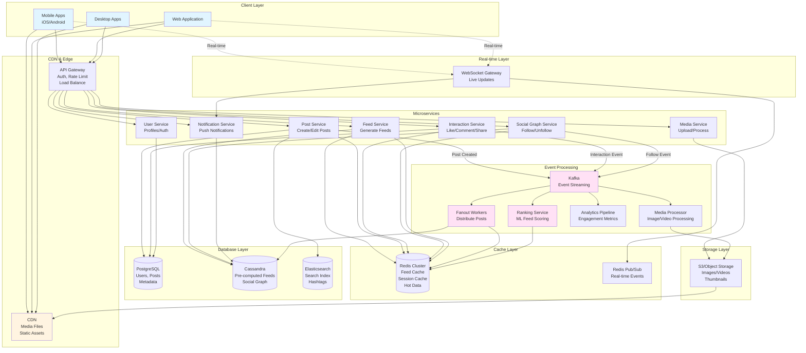
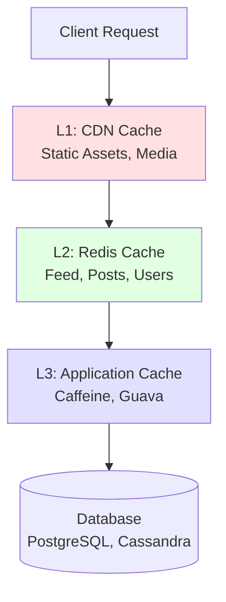

# News Feed System Design

## Table of Contents
1. [Requirements](#1-requirements-5-minutes)
   - [Functional Requirements](#functional-requirements)
   - [Non-functional Requirements](#non-functional-requirements)
   - [Capacity Estimation](#capacity-estimation)
2. [Core Entities](#2-core-entities-2-minutes)
3. [API Interface](#3-api-interface-5-minutes)
   - [Authentication](#authentication)
   - [Feed Operations](#feed-operations)
   - [Post Creation](#post-creation)
   - [Interactions](#interactions)
   - [Social Graph](#social-graph)
   - [Notifications](#notifications)
   - [WebSocket (Real-time)](#websocket-real-time)
4. [Data Flow](#4-data-flow-5-minutes)
5. [High-Level Design (HLD)](#5-high-level-design-10-15-minutes)
   - [Architecture Components](#architecture-components)
6. [Architecture Diagram](#6-architecture-diagram)
7. [Deep Dives](#7-deep-dives-10-minutes)
   - [7.1 Feed Generation Strategies](#71-feed-generation-strategies)
   - [7.2 Fanout Service](#72-fanout-service-kafka-consumer)
   - [7.3 Post Service](#73-post-service)
   - [7.4 Interaction Service](#74-interaction-service-likes-comments-shares)
   - [7.5 Ranking Service](#75-ranking-service-ml-based-feed-ranking)
   - [7.6 Social Graph Service](#76-social-graph-service)
   - [7.7 Notification Service](#77-notification-service)
   - [7.8 WebSocket Handler](#78-websocket-handler-real-time-updates)
   - [7.9 Database Schema Design](#79-database-schema-design)
   - [7.10 Caching Strategy](#710-caching-strategy)
   - [7.11 Media Processing Service](#711-media-processing-service)
   - [7.12 Search Service](#712-search-service-elasticsearch)
   - [7.13 Rate Limiting](#713-rate-limiting)
   - [7.14 Analytics Pipeline](#714-analytics-pipeline)
8. [Monitoring & Observability](#8-monitoring--observability)
   - [Key Metrics to Track](#key-metrics-to-track)
   - [Alerting Rules](#alerting-rules)
9. [Summary](#9-summary)
   - [Key Design Decisions](#key-design-decisions)
   - [Scalability Achieved](#scalability-achieved)
10. [Trade-offs & Considerations](#10-trade-offs--considerations)
11. [Key Differences from Other Systems](#11-key-differences-from-other-systems)
12. [Future Enhancements](#12-future-enhancements)
13. [Additional Considerations](#13-additional-considerations)
    - [Data Consistency](#data-consistency)
    - [Security Considerations](#security-considerations)
    - [Privacy Controls](#privacy-controls)

---

## 1. Requirements (~5 minutes)

### Functional Requirements

- ✅ Users should be able to **view their personalized news feed** (posts from followed users/pages)
- ✅ Users should be able to **create posts** (text, images, videos, links)
- ✅ Users should be able to **interact with posts** (like, comment, share, save)
- ✅ Users should be able to **follow/unfollow** users and pages
- ✅ System should support **real-time notifications** for interactions
- ✅ Feed should be **ranked** by relevance (not just chronological)
- ✅ Support **hashtags, mentions, and tagging**

### Non-functional Requirements

- ✅ The system should prioritize **availability** over consistency (eventual consistency acceptable)
- ✅ The system should scale to support **2B+ users** (500M daily active)
- ✅ Feed generation should be **fast** (< 500ms P99)
- ✅ The system should be **highly available** (99.99% uptime)
- ✅ **Low latency** for post creation (< 200ms)
- ✅ Support for **high read-to-write ratio** (~100:1)
- ✅ Real-time feed updates for **active users**

### Capacity Estimation

**Assumptions:**
- Total Users: 2B
- Daily Active Users (DAU): 500M
- Average posts per user: 2 posts/day
- Average following: 300 connections
- Average post size: 1 KB (text + metadata)
- Image/video stored separately (average 2 MB)
- Feed refresh: 20 times/day per user

**Storage:**
```
Daily Posts = 500M users × 2 posts = 1B posts/day
Annual Posts = 1B × 365 = 365B posts/year
Post Metadata = 365B × 1 KB = 365 TB/year
Media Storage = 1B posts/day × 0.5 (media posts) × 2 MB = 1 PB/day
Annual Media = 365 PB (with compression ~180 PB)
```

**QPS:**
```
Post Creation = 1B posts/day / 86400s = ~12K writes/sec
Feed Reads = 500M DAU × 20 refreshes/day / 86400s = ~115K reads/sec
Peak QPS (5x average) = 575K reads/sec, 60K writes/sec
Interactions (likes/comments) = 500M × 50 actions/day / 86400s = ~290K QPS
```

**Network:**
```
Feed Fetch Size = 20 posts × 1 KB metadata = 20 KB
Peak Bandwidth = 575K requests/sec × 20 KB = 11.5 GB/s
Media Bandwidth = 500M users × 10 images/day × 2 MB / 86400s = 115 GB/s
```

---

## 2. Core Entities (~2 minutes)

### User
- `userId`, `username`, `email`, `displayName`, `profilePicUrl`, `bio`, `verified`, `createdAt`

### Post
- `postId`, `userId`, `content`, `mediaUrls[]`, `postType` (TEXT/IMAGE/VIDEO/LINK), `visibility` (PUBLIC/FRIENDS/PRIVATE), `createdAt`, `editedAt`

### Interaction
- `interactionId`, `postId`, `userId`, `type` (LIKE/SHARE/SAVE), `createdAt`

### Comment
- `commentId`, `postId`, `userId`, `parentCommentId`, `content`, `createdAt`

### Follow
- `followerId`, `followeeId`, `createdAt`

### Feed
- `userId`, `postId`, `score`, `generatedAt` (pre-computed feed)

### Notification
- `notificationId`, `userId`, `actorId`, `type` (LIKE/COMMENT/FOLLOW), `postId`, `read`, `createdAt`

---

## 3. API Interface (~5 minutes)

### Protocol Choice
- **REST** for CRUD operations
- **WebSocket** for real-time notifications and live feed updates
- **GraphQL** for flexible feed queries (optional optimization)

### API Endpoints

#### Authentication
```http
POST /api/v1/auth/login
Request: { "email": "user@example.com", "password": "hashed_password" }
Response: { "accessToken": "jwt_token", "refreshToken": "refresh_token", "expiresIn": 3600 }
```

#### Feed Operations
```http
GET /api/v1/feed?limit=20&cursor=eyJwb3N0SWQiOiIxMjM0NSJ9
Response: {
  "posts": [
    {
      "postId": "12345",
      "author": { "userId": "user-789", "username": "john_doe", "profilePicUrl": "..." },
      "content": "Hello world!",
      "mediaUrls": ["https://cdn.app.com/img1.jpg"],
      "createdAt": "2025-10-07T10:30:00Z",
      "stats": { "likes": 150, "comments": 25, "shares": 10 },
      "userInteraction": { "liked": false, "saved": false }
    }
  ],
  "nextCursor": "eyJwb3N0SWQiOiI2Nzg5MCJ9",
  "hasMore": true
}

GET /api/v1/users/{userId}/posts?limit=20
GET /api/v1/feed/following?limit=20  // Chronological feed
```

#### Post Creation
```http
POST /api/v1/posts
Content-Type: multipart/form-data
Request: {
  "content": "Check out this amazing sunset!",
  "mediaFiles": [<binary>],
  "visibility": "PUBLIC",
  "tags": ["sunset", "nature"],
  "mentions": ["@jane_doe"]
}
Response: {
  "postId": "post-123",
  "status": "PUBLISHED",
  "createdAt": "2025-10-07T14:20:00Z"
}

PUT /api/v1/posts/{postId}
DELETE /api/v1/posts/{postId}
```

#### Interactions
```http
POST /api/v1/posts/{postId}/like
DELETE /api/v1/posts/{postId}/like

POST /api/v1/posts/{postId}/comments
Request: { "content": "Great post!", "parentCommentId": null }
Response: { "commentId": "comment-456", "createdAt": "..." }

GET /api/v1/posts/{postId}/comments?limit=50&sort=top
POST /api/v1/posts/{postId}/share
POST /api/v1/posts/{postId}/save
```

#### Social Graph
```http
POST /api/v1/users/{userId}/follow
DELETE /api/v1/users/{userId}/unfollow
GET /api/v1/users/{userId}/followers?limit=50
GET /api/v1/users/{userId}/following?limit=50
```

#### Notifications
```http
GET /api/v1/notifications?limit=20&unreadOnly=true
Response: {
  "notifications": [
    {
      "notificationId": "notif-789",
      "type": "LIKE",
      "actor": { "userId": "user-123", "username": "jane_doe" },
      "post": { "postId": "post-456", "contentPreview": "..." },
      "createdAt": "2025-10-07T12:00:00Z",
      "read": false
    }
  ]
}

PUT /api/v1/notifications/{notificationId}/read
PUT /api/v1/notifications/mark-all-read
```

#### WebSocket (Real-time)
```javascript
WebSocket: wss://realtime.app.com/feed
Messages: {
  "type": "NEW_POST",
  "data": { "postId": "...", "author": {...}, "content": "..." }
}

Types: NEW_POST, NOTIFICATION, FEED_UPDATE
```

---

## 4. Data Flow (~5 minutes)

### Feed Generation Flow (Hybrid Approach)

**Fanout-on-Write (Push) - For Users with Few Followers (`<10K`)**
1. User creates post → Post Service
2. Post Service writes to DB
3. Post Service publishes event to Kafka
4. Fanout Service fetches user's followers
5. Pre-computed feeds updated in Redis/Cassandra
6. Followers see post instantly

**Fanout-on-Read (Pull) - For Celebrities (>10K followers)**
1. User creates post → Post Service
2. Post Service writes to DB
3. When follower requests feed → Feed Service
4. Fetch recent posts from followed celebrities
5. Merge with pre-computed feed
6. Rank and return

**Hybrid Example:**
```
User requests feed →
  1. Fetch pre-computed feed (Redis) - from regular users
  2. Fetch latest posts from celebrities (Database query)
  3. Merge + Rank (ML model)
  4. Cache result for 5 minutes
  5. Return to client
```

---

## 5. High Level Design (~10-15 minutes)

### Architecture Components

**Client Layer:**
- Mobile Apps (iOS/Android)
- Web Application (React/Next.js)
- Native Desktop Apps

**Edge Layer:**
- CDN (CloudFlare/Akamai) - media files, static assets
- API Gateway - authentication, rate limiting, routing

**API Layer:**
- **Post Service** - create, edit, delete posts
- **Feed Service** - generate and serve feeds
- **Interaction Service** - likes, comments, shares
- **Social Graph Service** - follows, friends
- **Notification Service** - push notifications
- **User Service** - profiles, authentication
- **Media Service** - upload/process images/videos

**Data Layer:**
- **PostgreSQL** - users, posts metadata (with read replicas)
- **Cassandra** - pre-computed feeds, social graph
- **Redis Cluster** - caching, session management
- **Elasticsearch** - search posts, users, hashtags
- **S3/Object Storage** - media files (images/videos)
- **Neo4j** (optional) - complex graph queries

**Processing Layer:**
- **Kafka** - event streaming (post created, liked, commented)
- **Fanout Workers** - distribute posts to followers' feeds
- **Ranking Service** - ML-based feed ranking
- **Analytics Pipeline** - engagement metrics
- **Media Processing** - resize images, transcode videos

**Real-time Layer:**
- **WebSocket Servers** - live updates, notifications
- **Redis Pub/Sub** - broadcast messages

---

## 6. Architecture Diagram



---

## 7. Deep Dives (~10 minutes)

### 7.1 Feed Generation Strategies

#### Strategy Comparison

| Approach | Pros | Cons | Best For |
|----------|------|------|----------|
| **Fanout-on-Write (Push)** | Fast reads, pre-computed | Slow writes for celebrities, high storage | Regular users |
| **Fanout-on-Read (Pull)** | Fast writes, less storage | Slow reads, compute on demand | Celebrities |
| **Hybrid** | Balanced performance | Complex implementation | All users |

#### Hybrid Implementation (Spring Boot)

```java
@Service
@Slf4j
public class FeedGenerationService {

    @Autowired private FeedCacheRepository feedCacheRepository;
    @Autowired private PostRepository postRepository;
    @Autowired private FollowRepository followRepository;
    @Autowired private RankingService rankingService;
    @Autowired private RedisTemplate<String, Object> redisTemplate;

    private static final int CELEBRITY_THRESHOLD = 10_000;
    private static final int FEED_SIZE = 50;
    private static final Duration CACHE_TTL = Duration.ofMinutes(5);

    /**
     * Get personalized feed for user (Hybrid approach)
     */
    public FeedResponse getUserFeed(Long userId, String cursor, int limit) {
        String cacheKey = "feed:user:" + userId;

        // Try cache first
        List<Post> cachedFeed = getCachedFeed(cacheKey);
        if (cachedFeed != null && !cachedFeed.isEmpty()) {
            return buildFeedResponse(cachedFeed, cursor, limit);
        }

        // Hybrid approach: merge push and pull feeds
        List<Post> pushFeed = getPreComputedFeed(userId, FEED_SIZE);
        List<Post> pullFeed = getCelebrityPosts(userId, FEED_SIZE);

        // Merge and rank
        List<Post> mergedFeed = mergeFeds(pushFeed, pullFeed);
        List<Post> rankedFeed = rankingService.rankPosts(mergedFeed, userId);

        // Cache result
        cacheFeed(cacheKey, rankedFeed, CACHE_TTL);

        return buildFeedResponse(rankedFeed, cursor, limit);
    }

    /**
     * Get pre-computed feed from Cassandra (Push model)
     */
    private List<Post> getPreComputedFeed(Long userId, int limit) {
        List<FeedEntry> feedEntries = feedCacheRepository
            .findByUserIdOrderByScoreDesc(userId, PageRequest.of(0, limit));

        List<Long> postIds = feedEntries.stream()
            .map(FeedEntry::getPostId)
            .collect(Collectors.toList());

        return postRepository.findAllById(postIds);
    }

    /**
     * Fetch recent posts from celebrities (Pull model)
     */
    private List<Post> getCelebrityPosts(Long userId, int limit) {
        List<Long> celebrityIds = followRepository
            .findCelebrityFollowees(userId, CELEBRITY_THRESHOLD);

        if (celebrityIds.isEmpty()) {
            return Collections.emptyList();
        }

        return postRepository
            .findRecentPostsByUserIds(celebrityIds, limit);
    }

    /**
     * Merge push and pull feeds
     */
    private List<Post> mergeFeds(List<Post> pushFeed, List<Post> pullFeed) {
        Set<Long> seenIds = new HashSet<>();
        List<Post> merged = new ArrayList<>();

        for (Post post : pushFeed) {
            if (seenIds.add(post.getId())) {
                merged.add(post);
            }
        }

        for (Post post : pullFeed) {
            if (seenIds.add(post.getId())) {
                merged.add(post);
            }
        }

        return merged;
    }

    private List<Post> getCachedFeed(String cacheKey) {
        return (List<Post>) redisTemplate.opsForValue().get(cacheKey);
    }

    private void cacheFeed(String cacheKey, List<Post> feed, Duration ttl) {
        redisTemplate.opsForValue().set(cacheKey, feed, ttl);
    }
}
```

---

### 7.2 Fanout Service (Kafka Consumer)

```java
@Service
@Slf4j
public class FanoutService {

    @Autowired private FollowRepository followRepository;
    @Autowired private FeedCacheRepository feedCacheRepository;
    @Autowired private RankingService rankingService;

    private static final int BATCH_SIZE = 1000;
    private static final int CELEBRITY_THRESHOLD = 10_000;

    /**
     * Listen to post creation events and fanout to followers
     */
    @KafkaListener(topics = "post-created", groupId = "fanout-service")
    public void handlePostCreated(PostCreatedEvent event) {
        Long authorId = event.getAuthorId();
        Long postId = event.getPostId();

        // Check if author is celebrity
        long followerCount = followRepository.countFollowers(authorId);

        if (followerCount > CELEBRITY_THRESHOLD) {
            log.info("Skipping fanout for celebrity user {}", authorId);
            return; // Use pull model for celebrities
        }

        // Fanout to all followers
        log.info("Starting fanout for post {} from user {}", postId, authorId);
        fanoutToFollowers(authorId, postId);
    }

    /**
     * Distribute post to all followers' feeds
     */
    private void fanoutToFollowers(Long authorId, Long postId) {
        List<Long> followerIds = followRepository.findFollowerIds(authorId);

        // Process in batches to avoid memory issues
        Lists.partition(followerIds, BATCH_SIZE).forEach(batch -> {
            List<FeedEntry> feedEntries = batch.stream()
                .map(followerId -> createFeedEntry(followerId, postId))
                .collect(Collectors.toList());

            feedCacheRepository.saveAll(feedEntries);
        });

        log.info("Fanout completed for post {}. Reached {} followers",
                 postId, followerIds.size());
    }

    private FeedEntry createFeedEntry(Long userId, Long postId) {
        double score = rankingService.calculateInitialScore(postId);

        return FeedEntry.builder()
            .userId(userId)
            .postId(postId)
            .score(score)
            .generatedAt(Instant.now())
            .build();
    }
}
```

---

### 7.3 Post Service

```java
@RestController
@RequestMapping("/api/v1/posts")
@Slf4j
public class PostController {

    @Autowired private PostService postService;
    @Autowired private KafkaTemplate<String, Object> kafkaTemplate;

    /**
     * Create a new post
     */
    @PostMapping
    public ResponseEntity<PostResponse> createPost(
            @RequestAttribute("userId") Long userId,
            @RequestBody CreatePostRequest request) {

        Post post = postService.createPost(userId, request);

        // Publish event for fanout
        PostCreatedEvent event = PostCreatedEvent.builder()
            .postId(post.getId())
            .authorId(userId)
            .content(post.getContent())
            .createdAt(post.getCreatedAt())
            .build();

        kafkaTemplate.send("post-created", event);

        return ResponseEntity.ok(PostResponse.from(post));
    }

    /**
     * Get a specific post with interactions
     */
    @GetMapping("/{postId}")
    public ResponseEntity<PostDetailResponse> getPost(
            @PathVariable Long postId,
            @RequestAttribute(value = "userId", required = false) Long userId) {

        Post post = postService.getPost(postId);
        PostStats stats = postService.getPostStats(postId);

        UserInteraction userInteraction = null;
        if (userId != null) {
            userInteraction = postService.getUserInteraction(postId, userId);
        }

        return ResponseEntity.ok(PostDetailResponse.builder()
            .post(post)
            .stats(stats)
            .userInteraction(userInteraction)
            .build());
    }

    /**
     * Delete a post
     */
    @DeleteMapping("/{postId}")
    public ResponseEntity<Void> deletePost(
            @PathVariable Long postId,
            @RequestAttribute("userId") Long userId) {

        postService.deletePost(postId, userId);

        // Publish delete event
        PostDeletedEvent event = new PostDeletedEvent(postId, userId);
        kafkaTemplate.send("post-deleted", event);

        return ResponseEntity.noContent().build();
    }
}

@Service
@Transactional
public class PostService {

    @Autowired private PostRepository postRepository;
    @Autowired private MediaService mediaService;
    @Autowired private RedisTemplate<String, Object> redisTemplate;
    @Autowired private ElasticsearchOperations elasticsearchOps;

    public Post createPost(Long userId, CreatePostRequest request) {
        // Upload media files if present
        List<String> mediaUrls = new ArrayList<>();
        if (request.getMediaFiles() != null) {
            mediaUrls = mediaService.uploadMedia(request.getMediaFiles());
        }

        // Create post entity
        Post post = Post.builder()
            .userId(userId)
            .content(request.getContent())
            .mediaUrls(mediaUrls)
            .postType(determinePostType(request))
            .visibility(request.getVisibility())
            .createdAt(Instant.now())
            .build();

        post = postRepository.save(post);

        // Index in Elasticsearch for search
        indexPostForSearch(post);

        // Cache hot post
        cachePost(post);

        return post;
    }

    public Post getPost(Long postId) {
        String cacheKey = "post:" + postId;

        // Try cache
        Post cached = (Post) redisTemplate.opsForValue().get(cacheKey);
        if (cached != null) {
            return cached;
        }

        // Fetch from DB
        Post post = postRepository.findById(postId)
            .orElseThrow(() -> new NotFoundException("Post not found"));

        cachePost(post);
        return post;
    }

    public PostStats getPostStats(Long postId) {
        String cacheKey = "post:stats:" + postId;

        PostStats cached = (PostStats) redisTemplate.opsForValue().get(cacheKey);
        if (cached != null) {
            return cached;
        }

        PostStats stats = postRepository.getPostStats(postId);
        redisTemplate.opsForValue().set(cacheKey, stats, Duration.ofMinutes(5));

        return stats;
    }

    private void cachePost(Post post) {
        String cacheKey = "post:" + post.getId();
        redisTemplate.opsForValue().set(cacheKey, post, Duration.ofHours(1));
    }

    private void indexPostForSearch(Post post) {
        PostSearchDocument doc = PostSearchDocument.from(post);
        elasticsearchOps.save(doc);
    }
}
```

---

### 7.4 Interaction Service (Likes, Comments, Shares)

```java
@RestController
@RequestMapping("/api/v1/posts/{postId}")
@Slf4j
public class InteractionController {

    @Autowired private InteractionService interactionService;
    @Autowired private NotificationService notificationService;

    /**
     * Like a post
     */
    @PostMapping("/like")
    public ResponseEntity<Void> likePost(
            @PathVariable Long postId,
            @RequestAttribute("userId") Long userId) {

        interactionService.likePost(postId, userId);

        // Send notification to post author
        notificationService.sendLikeNotification(postId, userId);

        return ResponseEntity.ok().build();
    }

    /**
     * Unlike a post
     */
    @DeleteMapping("/like")
    public ResponseEntity<Void> unlikePost(
            @PathVariable Long postId,
            @RequestAttribute("userId") Long userId) {

        interactionService.unlikePost(postId, userId);
        return ResponseEntity.ok().build();
    }

    /**
     * Comment on a post
     */
    @PostMapping("/comments")
    public ResponseEntity<CommentResponse> addComment(
            @PathVariable Long postId,
            @RequestAttribute("userId") Long userId,
            @RequestBody CreateCommentRequest request) {

        Comment comment = interactionService.addComment(postId, userId, request);

        // Send notification
        notificationService.sendCommentNotification(postId, userId, comment.getId());

        return ResponseEntity.ok(CommentResponse.from(comment));
    }

    /**
     * Get comments for a post
     */
    @GetMapping("/comments")
    public ResponseEntity<CommentsResponse> getComments(
            @PathVariable Long postId,
            @RequestParam(defaultValue = "top") String sort,
            @RequestParam(defaultValue = "0") int page,
            @RequestParam(defaultValue = "20") int limit) {

        Page<Comment> comments = interactionService.getComments(postId, sort, page, limit);
        return ResponseEntity.ok(CommentsResponse.from(comments));
    }
}

@Service
public class InteractionService {

    @Autowired private InteractionRepository interactionRepository;
    @Autowired private CommentRepository commentRepository;
    @Autowired private RedisTemplate<String, Object> redisTemplate;

    /**
     * Like a post (idempotent)
     */
    @Transactional
    public void likePost(Long postId, Long userId) {
        String cacheKey = "like:" + postId + ":" + userId;

        // Check if already liked
        if (Boolean.TRUE.equals(redisTemplate.hasKey(cacheKey))) {
            return;
        }

        // Create interaction
        Interaction interaction = Interaction.builder()
            .postId(postId)
            .userId(userId)
            .type(InteractionType.LIKE)
            .createdAt(Instant.now())
            .build();

        interactionRepository.save(interaction);

        // Update cache
        redisTemplate.opsForValue().set(cacheKey, true, Duration.ofDays(7));

        // Increment like count
        incrementLikeCount(postId);
    }

    @Transactional
    public void unlikePost(Long postId, Long userId) {
        String cacheKey = "like:" + postId + ":" + userId;

        interactionRepository.deleteByPostIdAndUserIdAndType(
            postId, userId, InteractionType.LIKE);

        redisTemplate.delete(cacheKey);
        decrementLikeCount(postId);
    }

    public Comment addComment(Long postId, Long userId, CreateCommentRequest request) {
        Comment comment = Comment.builder()
            .postId(postId)
            .userId(userId)
            .parentCommentId(request.getParentCommentId())
            .content(request.getContent())
            .createdAt(Instant.now())
            .build();

        comment = commentRepository.save(comment);

        // Increment comment count
        incrementCommentCount(postId);

        return comment;
    }

    public Page<Comment> getComments(Long postId, String sort, int page, int limit) {
        Pageable pageable = PageRequest.of(page, limit);

        if ("top".equals(sort)) {
            return commentRepository.findByPostIdOrderByLikesDesc(postId, pageable);
        } else {
            return commentRepository.findByPostIdOrderByCreatedAtDesc(postId, pageable);
        }
    }

    private void incrementLikeCount(Long postId) {
        String key = "post:stats:" + postId;
        redisTemplate.opsForHash().increment(key, "likes", 1);
    }

    private void decrementLikeCount(Long postId) {
        String key = "post:stats:" + postId;
        redisTemplate.opsForHash().increment(key, "likes", -1);
    }

    private void incrementCommentCount(Long postId) {
        String key = "post:stats:" + postId;
        redisTemplate.opsForHash().increment(key, "comments", 1);
    }
}
```

---

### 7.5 Ranking Service (ML-Based Feed Ranking)

```java
@Service
@Slf4j
public class RankingService {

    @Autowired private PostRepository postRepository;
    @Autowired private InteractionRepository interactionRepository;
    @Autowired private UserRepository userRepository;

    /**
     * Rank posts using multiple signals
     */
    public List<Post> rankPosts(List<Post> posts, Long userId) {
        UserPreferences prefs = getUserPreferences(userId);

        return posts.stream()
            .map(post -> {
                double score = calculateScore(post, userId, prefs);
                post.setRankingScore(score);
                return post;
            })
            .sorted(Comparator.comparingDouble(Post::getRankingScore).reversed())
            .collect(Collectors.toList());
    }

    /**
     * Calculate ranking score using multiple factors
     */
    private double calculateScore(Post post, Long userId, UserPreferences prefs) {
        double recencyScore = calculateRecencyScore(post);
        double engagementScore = calculateEngagementScore(post);
        double affinityScore = calculateAffinityScore(post, userId);
        double contentScore = calculateContentScore(post, prefs);

        // Weighted combination
        return (0.3 * recencyScore) +
               (0.35 * engagementScore) +
               (0.25 * affinityScore) +
               (0.1 * contentScore);
    }

    /**
     * Time decay: newer posts ranked higher
     */
    private double calculateRecencyScore(Post post) {
        long ageInMinutes = Duration.between(post.getCreatedAt(), Instant.now()).toMinutes();
        return 1.0 / (1.0 + Math.log(ageInMinutes + 2));
    }

    /**
     * Engagement: likes, comments, shares
     */
    private double calculateEngagementScore(Post post) {
        PostStats stats = post.getStats();
        if (stats == null) return 0.0;

        double likes = stats.getLikes() * 1.0;
        double comments = stats.getComments() * 2.0; // Comments weighted higher
        double shares = stats.getShares() * 3.0; // Shares weighted highest

        double totalEngagement = likes + comments + shares;
        return Math.log(totalEngagement + 1);
    }

    /**
     * User affinity: how much user interacts with author
     */
    private double calculateAffinityScore(Post post, Long userId) {
        Long authorId = post.getUserId();

        // Count past interactions with this author
        long interactionCount = interactionRepository
            .countUserInteractionsWithAuthor(userId, authorId);

        return Math.log(interactionCount + 1) / 10.0;
    }

    /**
     * Content relevance: match user interests
     */
    private double calculateContentScore(Post post, UserPreferences prefs) {
        // Simple keyword matching (in production, use ML model)
        Set<String> postKeywords = extractKeywords(post.getContent());
        Set<String> userInterests = prefs.getInterests();

        long matchCount = postKeywords.stream()
            .filter(userInterests::contains)
            .count();

        return matchCount > 0 ? Math.log(matchCount + 1) : 0.0;
    }

    /**
     * Initial score for newly created posts
     */
    public double calculateInitialScore(Long postId) {
        Post post = postRepository.findById(postId).orElseThrow();
        return calculateRecencyScore(post);
    }

    private UserPreferences getUserPreferences(Long userId) {
        // Simplified - in production, fetch from ML service
        return UserPreferences.builder()
            .userId(userId)
            .interests(Set.of("technology", "sports", "travel"))
            .build();
    }

    private Set<String> extractKeywords(String content) {
        // Simplified - in production, use NLP
        return Arrays.stream(content.toLowerCase().split("\\s+"))
            .filter(word -> word.length() > 3)
            .collect(Collectors.toSet());
    }
}
```

---

### 7.6 Social Graph Service

```java
@RestController
@RequestMapping("/api/v1/users/{userId}")
@Slf4j
public class SocialGraphController {

    @Autowired private SocialGraphService socialGraphService;
    @Autowired private NotificationService notificationService;

    /**
     * Follow a user
     */
    @PostMapping("/follow")
    public ResponseEntity<Void> followUser(
            @PathVariable Long userId,
            @RequestAttribute("currentUserId") Long currentUserId) {

        socialGraphService.follow(currentUserId, userId);
        notificationService.sendFollowNotification(userId, currentUserId);

        return ResponseEntity.ok().build();
    }

    /**
     * Unfollow a user
     */
    @DeleteMapping("/unfollow")
    public ResponseEntity<Void> unfollowUser(
            @PathVariable Long userId,
            @RequestAttribute("currentUserId") Long currentUserId) {

        socialGraphService.unfollow(currentUserId, userId);
        return ResponseEntity.ok().build();
    }

    /**
     * Get followers
     */
    @GetMapping("/followers")
    public ResponseEntity<FollowersResponse> getFollowers(
            @PathVariable Long userId,
            @RequestParam(defaultValue = "0") int page,
            @RequestParam(defaultValue = "50") int limit) {

        Page<User> followers = socialGraphService.getFollowers(userId, page, limit);
        return ResponseEntity.ok(FollowersResponse.from(followers));
    }

    /**
     * Get following
     */
    @GetMapping("/following")
    public ResponseEntity<FollowingResponse> getFollowing(
            @PathVariable Long userId,
            @RequestParam(defaultValue = "0") int page,
            @RequestParam(defaultValue = "50") int limit) {

        Page<User> following = socialGraphService.getFollowing(userId, page, limit);
        return ResponseEntity.ok(FollowingResponse.from(following));
    }
}

@Service
public class SocialGraphService {

    @Autowired private FollowRepository followRepository;
    @Autowired private RedisTemplate<String, Object> redisTemplate;
    @Autowired private KafkaTemplate<String, Object> kafkaTemplate;

    /**
     * Follow a user (idempotent)
     */
    @Transactional
    public void follow(Long followerId, Long followeeId) {
        if (followerId.equals(followeeId)) {
            throw new BadRequestException("Cannot follow yourself");
        }

        String cacheKey = "follow:" + followerId + ":" + followeeId;

        // Check if already following
        if (Boolean.TRUE.equals(redisTemplate.hasKey(cacheKey))) {
            return;
        }

        Follow follow = Follow.builder()
            .followerId(followerId)
            .followeeId(followeeId)
            .createdAt(Instant.now())
            .build();

        followRepository.save(follow);

        // Update cache
        redisTemplate.opsForValue().set(cacheKey, true, Duration.ofDays(30));

        // Publish event
        FollowEvent event = new FollowEvent(followerId, followeeId);
        kafkaTemplate.send("user-followed", event);

        // Invalidate follower/following count cache
        invalidateCountCache(followerId, followeeId);
    }

    @Transactional
    public void unfollow(Long followerId, Long followeeId) {
        String cacheKey = "follow:" + followerId + ":" + followeeId;

        followRepository.deleteByFollowerIdAndFolloweeId(followerId, followeeId);

        redisTemplate.delete(cacheKey);

        // Publish event
        UnfollowEvent event = new UnfollowEvent(followerId, followeeId);
        kafkaTemplate.send("user-unfollowed", event);

        invalidateCountCache(followerId, followeeId);
    }

    public Page<User> getFollowers(Long userId, int page, int limit) {
        String cacheKey = "followers:" + userId + ":" + page;

        // Try cache
        Page<User> cached = (Page<User>) redisTemplate.opsForValue().get(cacheKey);
        if (cached != null) {
            return cached;
        }

        // Fetch from DB
        Pageable pageable = PageRequest.of(page, limit);
        Page<User> followers = followRepository.findFollowers(userId, pageable);

        // Cache for 10 minutes
        redisTemplate.opsForValue().set(cacheKey, followers, Duration.ofMinutes(10));

        return followers;
    }

    public Page<User> getFollowing(Long userId, int page, int limit) {
        String cacheKey = "following:" + userId + ":" + page;

        Page<User> cached = (Page<User>) redisTemplate.opsForValue().get(cacheKey);
        if (cached != null) {
            return cached;
        }

        Pageable pageable = PageRequest.of(page, limit);
        Page<User> following = followRepository.findFollowing(userId, pageable);

        redisTemplate.opsForValue().set(cacheKey, following, Duration.ofMinutes(10));

        return following;
    }

    private void invalidateCountCache(Long followerId, Long followeeId) {
        redisTemplate.delete("follower:count:" + followeeId);
        redisTemplate.delete("following:count:" + followerId);
    }
}
```

---

### 7.7 Notification Service

```java
@Service
@Slf4j
public class NotificationService {

    @Autowired private NotificationRepository notificationRepository;
    @Autowired private RedisTemplate<String, Object> redisTemplate;
    @Autowired private WebSocketHandler webSocketHandler;
    @Autowired private FCMService fcmService; // Firebase Cloud Messaging

    /**
     * Send like notification
     */
    public void sendLikeNotification(Long postId, Long actorId) {
        Post post = getPost(postId);
        Long recipientId = post.getUserId();

        // Don't notify if user liked their own post
        if (recipientId.equals(actorId)) {
            return;
        }

        Notification notification = Notification.builder()
            .userId(recipientId)
            .actorId(actorId)
            .type(NotificationType.LIKE)
            .postId(postId)
            .read(false)
            .createdAt(Instant.now())
            .build();

        notificationRepository.save(notification);

        // Send real-time notification via WebSocket
        sendRealtimeNotification(recipientId, notification);

        // Send push notification if user is offline
        if (!isUserOnline(recipientId)) {
            sendPushNotification(recipientId, notification);
        }
    }

    /**
     * Send comment notification
     */
    public void sendCommentNotification(Long postId, Long actorId, Long commentId) {
        Post post = getPost(postId);
        Long recipientId = post.getUserId();

        if (recipientId.equals(actorId)) {
            return;
        }

        Notification notification = Notification.builder()
            .userId(recipientId)
            .actorId(actorId)
            .type(NotificationType.COMMENT)
            .postId(postId)
            .commentId(commentId)
            .read(false)
            .createdAt(Instant.now())
            .build();

        notificationRepository.save(notification);
        sendRealtimeNotification(recipientId, notification);

        if (!isUserOnline(recipientId)) {
            sendPushNotification(recipientId, notification);
        }
    }

    /**
     * Send follow notification
     */
    public void sendFollowNotification(Long followeeId, Long followerId) {
        Notification notification = Notification.builder()
            .userId(followeeId)
            .actorId(followerId)
            .type(NotificationType.FOLLOW)
            .read(false)
            .createdAt(Instant.now())
            .build();

        notificationRepository.save(notification);
        sendRealtimeNotification(followeeId, notification);

        if (!isUserOnline(followeeId)) {
            sendPushNotification(followeeId, notification);
        }
    }

    /**
     * Send real-time notification via WebSocket
     */
    private void sendRealtimeNotification(Long userId, Notification notification) {
        NotificationMessage message = NotificationMessage.builder()
            .type("NOTIFICATION")
            .data(notification)
            .build();

        webSocketHandler.sendToUser(userId, message);
    }

    /**
     * Send push notification to mobile devices
     */
    private void sendPushNotification(Long userId, Notification notification) {
        String message = buildNotificationMessage(notification);
        fcmService.sendToUser(userId, message);
    }

    private boolean isUserOnline(Long userId) {
        String key = "user:online:" + userId;
        return Boolean.TRUE.equals(redisTemplate.hasKey(key));
    }

    private String buildNotificationMessage(Notification notification) {
        User actor = getUser(notification.getActorId());

        switch (notification.getType()) {
            case LIKE:
                return actor.getUsername() + " liked your post";
            case COMMENT:
                return actor.getUsername() + " commented on your post";
            case FOLLOW:
                return actor.getUsername() + " started following you";
            default:
                return "New notification";
        }
    }

    private Post getPost(Long postId) {
        // Implementation
        return null;
    }

    private User getUser(Long userId) {
        // Implementation
        return null;
    }
}
```

---

### 7.8 WebSocket Handler (Real-time Updates)

```java
@Component
@Slf4j
public class WebSocketHandler extends TextWebSocketHandler {

    @Autowired private RedisTemplate<String, Object> redisTemplate;

    // Store active connections: userId -> WebSocketSession
    private final ConcurrentHashMap<Long, WebSocketSession> activeSessions =
        new ConcurrentHashMap<>();

    @Override
    public void afterConnectionEstablished(WebSocketSession session) throws Exception {
        Long userId = getUserIdFromSession(session);

        if (userId != null) {
            activeSessions.put(userId, session);
            markUserOnline(userId);
            log.info("WebSocket connected for user {}", userId);
        }
    }

    @Override
    public void afterConnectionClosed(WebSocketSession session, CloseStatus status)
            throws Exception {
        Long userId = getUserIdFromSession(session);

        if (userId != null) {
            activeSessions.remove(userId);
            markUserOffline(userId);
            log.info("WebSocket disconnected for user {}", userId);
        }
    }

    @Override
    protected void handleTextMessage(WebSocketSession session, TextMessage message)
            throws Exception {
        // Handle incoming messages if needed (e.g., typing indicators)
        String payload = message.getPayload();
        log.debug("Received message: {}", payload);
    }

    /**
     * Send message to specific user
     */
    public void sendToUser(Long userId, Object message) {
        WebSocketSession session = activeSessions.get(userId);

        if (session != null && session.isOpen()) {
            try {
                String json = new ObjectMapper().writeValueAsString(message);
                session.sendMessage(new TextMessage(json));
            } catch (Exception e) {
                log.error("Error sending WebSocket message to user {}", userId, e);
            }
        }
    }

    /**
     * Broadcast to multiple users
     */
    public void broadcast(List<Long> userIds, Object message) {
        userIds.forEach(userId -> sendToUser(userId, message));
    }

    private Long getUserIdFromSession(WebSocketSession session) {
        // Extract userId from session attributes or JWT token
        return (Long) session.getAttributes().get("userId");
    }

    private void markUserOnline(Long userId) {
        String key = "user:online:" + userId;
        redisTemplate.opsForValue().set(key, true, Duration.ofMinutes(5));
    }

    private void markUserOffline(Long userId) {
        String key = "user:online:" + userId;
        redisTemplate.delete(key);
    }
}

@Configuration
@EnableWebSocket
public class WebSocketConfig implements WebSocketConfigurer {

    @Autowired private WebSocketHandler webSocketHandler;

    @Override
    public void registerWebSocketHandlers(WebSocketHandlerRegistry registry) {
        registry.addHandler(webSocketHandler, "/ws/feed")
            .setAllowedOrigins("*")
            .addInterceptors(new JwtHandshakeInterceptor());
    }
}

/**
 * Intercept WebSocket handshake to authenticate user
 */
public class JwtHandshakeInterceptor implements HandshakeInterceptor {

    @Override
    public boolean beforeHandshake(ServerHttpRequest request,
                                   ServerHttpResponse response,
                                   WebSocketHandler wsHandler,
                                   Map<String, Object> attributes) {

        // Extract JWT token from query params or headers
        String token = extractToken(request);

        if (token != null) {
            Long userId = validateTokenAndGetUserId(token);
            if (userId != null) {
                attributes.put("userId", userId);
                return true;
            }
        }

        return false; // Reject connection
    }

    @Override
    public void afterHandshake(ServerHttpRequest request,
                              ServerHttpResponse response,
                              WebSocketHandler wsHandler,
                              Exception exception) {
        // No-op
    }

    private String extractToken(ServerHttpRequest request) {
        // Extract from query param: ws://host/ws/feed?token=xxx
        String query = request.getURI().getQuery();
        if (query != null && query.startsWith("token=")) {
            return query.substring(6);
        }
        return null;
    }

    private Long validateTokenAndGetUserId(String token) {
        // Validate JWT and extract userId
        return null; // Implementation
    }
}
```

---

### 7.9 Database Schema Design

#### PostgreSQL (Users, Posts, Comments)

```sql
-- Users table
CREATE TABLE users (
    user_id BIGSERIAL PRIMARY KEY,
    username VARCHAR(50) UNIQUE NOT NULL,
    email VARCHAR(255) UNIQUE NOT NULL,
    password_hash VARCHAR(255) NOT NULL,
    display_name VARCHAR(100),
    profile_pic_url TEXT,
    bio TEXT,
    verified BOOLEAN DEFAULT FALSE,
    created_at TIMESTAMP NOT NULL DEFAULT NOW(),
    updated_at TIMESTAMP NOT NULL DEFAULT NOW()
);

CREATE INDEX idx_users_username ON users(username);
CREATE INDEX idx_users_email ON users(email);

-- Posts table
CREATE TABLE posts (
    post_id BIGSERIAL PRIMARY KEY,
    user_id BIGINT NOT NULL REFERENCES users(user_id) ON DELETE CASCADE,
    content TEXT NOT NULL,
    media_urls TEXT[], -- Array of media URLs
    post_type VARCHAR(20) NOT NULL, -- TEXT, IMAGE, VIDEO, LINK
    visibility VARCHAR(20) DEFAULT 'PUBLIC', -- PUBLIC, FRIENDS, PRIVATE
    created_at TIMESTAMP NOT NULL DEFAULT NOW(),
    edited_at TIMESTAMP,
    deleted_at TIMESTAMP -- Soft delete
);

CREATE INDEX idx_posts_user_id ON posts(user_id);
CREATE INDEX idx_posts_created_at ON posts(created_at DESC);
CREATE INDEX idx_posts_user_created ON posts(user_id, created_at DESC);

-- Comments table
CREATE TABLE comments (
    comment_id BIGSERIAL PRIMARY KEY,
    post_id BIGINT NOT NULL REFERENCES posts(post_id) ON DELETE CASCADE,
    user_id BIGINT NOT NULL REFERENCES users(user_id) ON DELETE CASCADE,
    parent_comment_id BIGINT REFERENCES comments(comment_id) ON DELETE CASCADE,
    content TEXT NOT NULL,
    likes_count INT DEFAULT 0,
    created_at TIMESTAMP NOT NULL DEFAULT NOW(),
    deleted_at TIMESTAMP
);

CREATE INDEX idx_comments_post_id ON comments(post_id, created_at DESC);
CREATE INDEX idx_comments_parent ON comments(parent_comment_id);

-- Interactions table (likes, saves, shares)
CREATE TABLE interactions (
    interaction_id BIGSERIAL PRIMARY KEY,
    post_id BIGINT NOT NULL REFERENCES posts(post_id) ON DELETE CASCADE,
    user_id BIGINT NOT NULL REFERENCES users(user_id) ON DELETE CASCADE,
    interaction_type VARCHAR(20) NOT NULL, -- LIKE, SAVE, SHARE
    created_at TIMESTAMP NOT NULL DEFAULT NOW(),
    UNIQUE(post_id, user_id, interaction_type)
);

CREATE INDEX idx_interactions_post ON interactions(post_id);
CREATE INDEX idx_interactions_user ON interactions(user_id, created_at DESC);

-- Follows table
CREATE TABLE follows (
    follower_id BIGINT NOT NULL REFERENCES users(user_id) ON DELETE CASCADE,
    followee_id BIGINT NOT NULL REFERENCES users(user_id) ON DELETE CASCADE,
    created_at TIMESTAMP NOT NULL DEFAULT NOW(),
    PRIMARY KEY (follower_id, followee_id)
);

CREATE INDEX idx_follows_follower ON follows(follower_id);
CREATE INDEX idx_follows_followee ON follows(followee_id);

-- Notifications table
CREATE TABLE notifications (
    notification_id BIGSERIAL PRIMARY KEY,
    user_id BIGINT NOT NULL REFERENCES users(user_id) ON DELETE CASCADE,
    actor_id BIGINT NOT NULL REFERENCES users(user_id) ON DELETE CASCADE,
    notification_type VARCHAR(20) NOT NULL, -- LIKE, COMMENT, FOLLOW, SHARE
    post_id BIGINT REFERENCES posts(post_id) ON DELETE CASCADE,
    comment_id BIGINT REFERENCES comments(comment_id) ON DELETE CASCADE,
    read BOOLEAN DEFAULT FALSE,
    created_at TIMESTAMP NOT NULL DEFAULT NOW()
);

CREATE INDEX idx_notifications_user ON notifications(user_id, created_at DESC);
CREATE INDEX idx_notifications_unread ON notifications(user_id, read, created_at DESC);
```

#### Cassandra (Pre-computed Feeds, Time-series Data)

```cql
-- Pre-computed feed entries (fanout-on-write)
CREATE TABLE feed_entries (
    user_id BIGINT,
    post_id BIGINT,
    score DOUBLE,
    generated_at TIMESTAMP,
    PRIMARY KEY ((user_id), score, post_id)
) WITH CLUSTERING ORDER BY (score DESC, post_id DESC)
AND compaction = {'class': 'TimeWindowCompactionStrategy', 'compaction_window_size': 1};

-- User activity log (analytics)
CREATE TABLE user_activity (
    user_id BIGINT,
    activity_date DATE,
    activity_id TIMEUUID,
    activity_type TEXT, -- VIEW_POST, LIKE, COMMENT, SHARE
    post_id BIGINT,
    metadata TEXT, -- JSON blob
    PRIMARY KEY ((user_id, activity_date), activity_id)
) WITH CLUSTERING ORDER BY (activity_id DESC);

-- Post engagement metrics (time-series)
CREATE TABLE post_engagement (
    post_id BIGINT,
    time_bucket TIMESTAMP, -- Hourly buckets
    likes_count COUNTER,
    comments_count COUNTER,
    shares_count COUNTER,
    views_count COUNTER,
    PRIMARY KEY ((post_id), time_bucket)
) WITH CLUSTERING ORDER BY (time_bucket DESC);
```

---

### 7.10 Caching Strategy

#### Multi-Layer Cache Architecture



#### Redis Caching Implementation

```java
@Configuration
@EnableCaching
public class CacheConfig {

    @Bean
    public RedisCacheManager cacheManager(RedisConnectionFactory factory) {
        RedisCacheConfiguration config = RedisCacheConfiguration.defaultCacheConfig()
            .entryTtl(Duration.ofMinutes(10))
            .serializeKeysWith(RedisSerializationContext.SerializationPair
                .fromSerializer(new StringRedisSerializer()))
            .serializeValuesWith(RedisSerializationContext.SerializationPair
                .fromSerializer(new GenericJackson2JsonRedisSerializer()));

        Map<String, RedisCacheConfiguration> cacheConfigurations = new HashMap<>();

        // Different TTL for different cache types
        cacheConfigurations.put("feeds", config.entryTtl(Duration.ofMinutes(5)));
        cacheConfigurations.put("posts", config.entryTtl(Duration.ofHours(1)));
        cacheConfigurations.put("users", config.entryTtl(Duration.ofHours(24)));
        cacheConfigurations.put("postStats", config.entryTtl(Duration.ofMinutes(5)));

        return RedisCacheManager.builder(factory)
            .cacheDefaults(config)
            .withInitialCacheConfigurations(cacheConfigurations)
            .build();
    }
}

@Service
public class CachingService {

    @Autowired private RedisTemplate<String, Object> redisTemplate;

    private static final Map<String, Duration> CACHE_TTL = Map.of(
        "feed", Duration.ofMinutes(5),
        "post", Duration.ofHours(1),
        "user", Duration.ofHours(24),
        "postStats", Duration.ofMinutes(5),
        "followers", Duration.ofMinutes(10),
        "following", Duration.ofMinutes(10)
    );

    /**
     * Cache-aside pattern for posts
     */
    @Cacheable(value = "posts", key = "#postId")
    public Post getPost(Long postId) {
        // This will be called only on cache miss
        return postRepository.findById(postId).orElseThrow();
    }

    /**
     * Invalidate cache on update
     */
    @CacheEvict(value = "posts", key = "#post.id")
    public Post updatePost(Post post) {
        return postRepository.save(post);
    }

    /**
     * Write-through cache for feed
     */
    public void cacheFeed(Long userId, List<Post> feed) {
        String key = "feed:user:" + userId;
        redisTemplate.opsForValue().set(key, feed, CACHE_TTL.get("feed"));
    }

    /**
     * Cache warming for popular content
     */
    @Scheduled(fixedRate = 300000) // Every 5 minutes
    public void warmPopularPostsCache() {
        List<Long> trendingPostIds = getTrendingPostIds();

        trendingPostIds.forEach(postId -> {
            String key = "post:" + postId;
            if (!redisTemplate.hasKey(key)) {
                Post post = postRepository.findById(postId).orElse(null);
                if (post != null) {
                    redisTemplate.opsForValue().set(key, post, CACHE_TTL.get("post"));
                }
            }
        });
    }

    private List<Long> getTrendingPostIds() {
        // Fetch from analytics service
        return Collections.emptyList();
    }
}
```

---

### 7.11 Media Processing Service

```java
@Service
@Slf4j
public class MediaService {

    @Autowired private S3Client s3Client;
    @Autowired private KafkaTemplate<String, Object> kafkaTemplate;

    private static final String BUCKET_NAME = "newsfeed-media";
    private static final long MAX_FILE_SIZE = 10 * 1024 * 1024; // 10 MB

    /**
     * Upload and process media files
     */
    public List<String> uploadMedia(List<MultipartFile> files) {
        return files.stream()
            .map(this::uploadSingleFile)
            .collect(Collectors.toList());
    }

    private String uploadSingleFile(MultipartFile file) {
        // Validate file
        validateFile(file);

        // Generate unique filename
        String filename = generateFilename(file.getOriginalFilename());
        String key = "originals/" + filename;

        try {
            // Upload to S3
            PutObjectRequest request = PutObjectRequest.builder()
                .bucket(BUCKET_NAME)
                .key(key)
                .contentType(file.getContentType())
                .build();

            s3Client.putObject(request, RequestBody.fromBytes(file.getBytes()));

            // Publish event for async processing (thumbnails, compression)
            MediaUploadedEvent event = new MediaUploadedEvent(key, file.getContentType());
            kafkaTemplate.send("media-uploaded", event);

            // Return CDN URL
            return "https://cdn.newsfeed.com/" + key;

        } catch (Exception e) {
            log.error("Error uploading file", e);
            throw new RuntimeException("File upload failed");
        }
    }

    private void validateFile(MultipartFile file) {
        if (file.isEmpty()) {
            throw new BadRequestException("File is empty");
        }

        if (file.getSize() > MAX_FILE_SIZE) {
            throw new BadRequestException("File too large");
        }

        String contentType = file.getContentType();
        if (!isAllowedContentType(contentType)) {
            throw new BadRequestException("Invalid file type");
        }
    }

    private boolean isAllowedContentType(String contentType) {
        return contentType != null && (
            contentType.startsWith("image/") ||
            contentType.startsWith("video/")
        );
    }

    private String generateFilename(String originalFilename) {
        String extension = originalFilename.substring(originalFilename.lastIndexOf("."));
        return UUID.randomUUID().toString() + extension;
    }
}

/**
 * Async media processor - listens to media upload events
 */
@Service
@Slf4j
public class MediaProcessorService {

    @Autowired private S3Client s3Client;

    @KafkaListener(topics = "media-uploaded", groupId = "media-processor")
    public void processMedia(MediaUploadedEvent event) {
        String key = event.getKey();
        String contentType = event.getContentType();

        if (contentType.startsWith("image/")) {
            processImage(key);
        } else if (contentType.startsWith("video/")) {
            processVideo(key);
        }
    }

    private void processImage(String key) {
        try {
            // Download original
            byte[] imageData = downloadFromS3(key);

            // Generate thumbnails
            byte[] thumbnail = resizeImage(imageData, 300, 300);
            byte[] medium = resizeImage(imageData, 800, 600);

            // Upload processed versions
            uploadToS3("thumbnails/" + key, thumbnail);
            uploadToS3("medium/" + key, medium);

            log.info("Image processing completed for {}", key);

        } catch (Exception e) {
            log.error("Error processing image {}", key, e);
        }
    }

    private void processVideo(String key) {
        // Video transcoding logic (would use AWS MediaConvert or similar)
        log.info("Video processing queued for {}", key);
    }

    private byte[] resizeImage(byte[] imageData, int width, int height) {
        // Use ImageMagick or Thumbnailator library
        return imageData; // Simplified
    }

    private byte[] downloadFromS3(String key) {
        // Download from S3
        return new byte[0]; // Simplified
    }

    private void uploadToS3(String key, byte[] data) {
        // Upload to S3
    }
}
```

---

### 7.12 Search Service (Elasticsearch)

```java
@Service
@Slf4j
public class SearchService {

    @Autowired private ElasticsearchOperations elasticsearchOps;
    @Autowired private PostRepository postRepository;

    /**
     * Search posts by content, hashtags, mentions
     */
    public SearchResponse searchPosts(String query, int page, int size) {
        NativeSearchQuery searchQuery = new NativeSearchQueryBuilder()
            .withQuery(QueryBuilders.multiMatchQuery(query)
                .field("content", 2.0f)  // Boost content
                .field("author.username", 1.5f)
                .field("hashtags", 1.0f)
                .type(MultiMatchQueryBuilder.Type.BEST_FIELDS)
                .fuzziness(Fuzziness.AUTO))
            .withPageable(PageRequest.of(page, size))
            .withHighlightFields(
                new HighlightBuilder.Field("content")
                    .preTags("<mark>")
                    .postTags("</mark>"))
            .build();

        SearchHits<PostSearchDocument> hits = elasticsearchOps.search(searchQuery,
                                                                       PostSearchDocument.class);

        List<PostSearchResult> results = hits.stream()
            .map(this::convertToResult)
            .collect(Collectors.toList());

        return SearchResponse.builder()
            .results(results)
            .totalHits(hits.getTotalHits())
            .build();
    }

    /**
     * Search by hashtag
     */
    public List<Post> searchByHashtag(String hashtag, int limit) {
        NativeSearchQuery query = new NativeSearchQueryBuilder()
            .withQuery(QueryBuilders.termQuery("hashtags", hashtag.toLowerCase()))
            .withSort(SortBuilders.fieldSort("createdAt").order(SortOrder.DESC))
            .withPageable(PageRequest.of(0, limit))
            .build();

        SearchHits<PostSearchDocument> hits = elasticsearchOps.search(query,
                                                                       PostSearchDocument.class);

        List<Long> postIds = hits.stream()
            .map(hit -> hit.getContent().getPostId())
            .collect(Collectors.toList());

        return postRepository.findAllById(postIds);
    }

    /**
     * Autocomplete suggestions
     */
    public List<String> autocomplete(String prefix) {
        NativeSearchQuery query = new NativeSearchQueryBuilder()
            .withQuery(QueryBuilders.prefixQuery("content", prefix.toLowerCase()))
            .withFields("content")
            .withPageable(PageRequest.of(0, 10))
            .build();

        SearchHits<PostSearchDocument> hits = elasticsearchOps.search(query,
                                                                       PostSearchDocument.class);

        return hits.stream()
            .map(hit -> extractSuggestion(hit.getContent().getContent(), prefix))
            .distinct()
            .limit(10)
            .collect(Collectors.toList());
    }

    private PostSearchResult convertToResult(SearchHit<PostSearchDocument> hit) {
        PostSearchDocument doc = hit.getContent();

        // Extract highlights
        Map<String, List<String>> highlights = hit.getHighlightFields();
        String highlightedContent = highlights.getOrDefault("content",
                                                            Collections.emptyList())
            .stream()
            .findFirst()
            .orElse(doc.getContent());

        return PostSearchResult.builder()
            .postId(doc.getPostId())
            .content(highlightedContent)
            .authorUsername(doc.getAuthorUsername())
            .createdAt(doc.getCreatedAt())
            .score(hit.getScore())
            .build();
    }

    private String extractSuggestion(String content, String prefix) {
        // Extract the word containing the prefix
        String[] words = content.split("\\s+");
        for (String word : words) {
            if (word.toLowerCase().startsWith(prefix.toLowerCase())) {
                return word;
            }
        }
        return prefix;
    }
}

/**
 * Elasticsearch document for posts
 */
@Document(indexName = "posts")
@Data
@Builder
public class PostSearchDocument {

    @Id
    private String id;

    @Field(type = FieldType.Long)
    private Long postId;

    @Field(type = FieldType.Text, analyzer = "standard")
    private String content;

    @Field(type = FieldType.Long)
    private Long authorId;

    @Field(type = FieldType.Keyword)
    private String authorUsername;

    @Field(type = FieldType.Keyword)
    private List<String> hashtags;

    @Field(type = FieldType.Keyword)
    private List<String> mentions;

    @Field(type = FieldType.Date)
    private Instant createdAt;

    @Field(type = FieldType.Integer)
    private Integer popularity; // Based on engagement

    public static PostSearchDocument from(Post post) {
        return PostSearchDocument.builder()
            .id(String.valueOf(post.getId()))
            .postId(post.getId())
            .content(post.getContent())
            .authorId(post.getUserId())
            .authorUsername(post.getAuthor().getUsername())
            .hashtags(extractHashtags(post.getContent()))
            .mentions(extractMentions(post.getContent()))
            .createdAt(post.getCreatedAt())
            .popularity(calculatePopularity(post))
            .build();
    }

    private static List<String> extractHashtags(String content) {
        Pattern pattern = Pattern.compile("#(\\w+)");
        Matcher matcher = pattern.matcher(content);

        List<String> hashtags = new ArrayList<>();
        while (matcher.find()) {
            hashtags.add(matcher.group(1).toLowerCase());
        }
        return hashtags;
    }

    private static List<String> extractMentions(String content) {
        Pattern pattern = Pattern.compile("@(\\w+)");
        Matcher matcher = pattern.matcher(content);

        List<String> mentions = new ArrayList<>();
        while (matcher.find()) {
            mentions.add(matcher.group(1).toLowerCase());
        }
        return mentions;
    }

    private static Integer calculatePopularity(Post post) {
        if (post.getStats() == null) return 0;

        return post.getStats().getLikes() +
               (post.getStats().getComments() * 2) +
               (post.getStats().getShares() * 3);
    }
}
```

---

### 7.13 Rate Limiting

```java
@Component
@Slf4j
public class RateLimitInterceptor implements HandlerInterceptor {

    @Autowired private RedisTemplate<String, Object> redisTemplate;

    private static final Map<String, RateLimit> RATE_LIMITS = Map.of(
        "POST_CREATE", new RateLimit(10, Duration.ofMinutes(1)),
        "LIKE", new RateLimit(100, Duration.ofMinutes(1)),
        "COMMENT", new RateLimit(30, Duration.ofMinutes(1)),
        "FOLLOW", new RateLimit(20, Duration.ofMinutes(1)),
        "FEED_FETCH", new RateLimit(50, Duration.ofMinutes(1))
    );

    @Override
    public boolean preHandle(HttpServletRequest request,
                            HttpServletResponse response,
                            Object handler) throws Exception {

        Long userId = (Long) request.getAttribute("userId");
        if (userId == null) {
            return true; // No user, no rate limit
        }

        String action = determineAction(request);
        RateLimit limit = RATE_LIMITS.get(action);

        if (limit != null && isRateLimited(userId, action, limit)) {
            response.setStatus(429);
            response.getWriter().write("{\"error\":\"Rate limit exceeded\"}");
            return false;
        }

        return true;
    }

    /**
     * Token bucket algorithm using Redis
     */
    private boolean isRateLimited(Long userId, String action, RateLimit limit) {
        String key = "ratelimit:" + action + ":" + userId;

        Long currentCount = redisTemplate.opsForValue().increment(key);

        if (currentCount == 1) {
            // First request, set expiry
            redisTemplate.expire(key, limit.getWindow());
        }

        boolean limited = currentCount > limit.getMaxRequests();

        if (limited) {
            log.warn("Rate limit exceeded for user {} on action {}", userId, action);
        }

        return limited;
    }

    private String determineAction(HttpServletRequest request) {
        String method = request.getMethod();
        String path = request.getRequestURI();

        if (path.contains("/posts") && "POST".equals(method)) {
            return "POST_CREATE";
        } else if (path.contains("/like")) {
            return "LIKE";
        } else if (path.contains("/comments")) {
            return "COMMENT";
        } else if (path.contains("/follow")) {
            return "FOLLOW";
        } else if (path.contains("/feed")) {
            return "FEED_FETCH";
        }

        return "DEFAULT";
    }

    @Data
    @AllArgsConstructor
    static class RateLimit {
        private int maxRequests;
        private Duration window;
    }
}
```

---

### 7.14 Analytics Pipeline

```java
@Service
@Slf4j
public class AnalyticsService {

    @Autowired private CassandraOperations cassandraOps;
    @Autowired private RedisTemplate<String, Object> redisTemplate;

    /**
     * Track post view (async)
     */
    @Async
    public void trackPostView(Long postId, Long userId) {
        UserActivity activity = UserActivity.builder()
            .userId(userId)
            .activityDate(LocalDate.now())
            .activityId(UUIDs.timeBased())
            .activityType("VIEW_POST")
            .postId(postId)
            .build();

        cassandraOps.insert(activity);

        // Increment view counter
        incrementPostMetric(postId, "views");
    }

    /**
     * Track engagement (like, comment, share)
     */
    @KafkaListener(topics = "post-engagement", groupId = "analytics")
    public void processEngagement(EngagementEvent event) {
        // Store in time-series table
        Instant timeBucket = truncateToHour(event.getTimestamp());

        String metric = event.getType().toLowerCase() + "s"; // likes, comments, shares
        incrementPostEngagement(event.getPostId(), timeBucket, metric);

        // Update trending score
        updateTrendingScore(event.getPostId());
    }

    /**
     * Calculate trending posts
     */
    @Scheduled(fixedRate = 300000) // Every 5 minutes
    public void calculateTrending() {
        Instant cutoff = Instant.now().minus(Duration.ofHours(24));

        // Fetch recent posts with high engagement
        List<PostEngagement> engagements = cassandraOps
            .select(Query.query(Criteria.where("time_bucket").gte(cutoff)),
                    PostEngagement.class);

        // Calculate trending scores
        Map<Long, Double> scores = engagements.stream()
            .collect(Collectors.groupingBy(
                PostEngagement::getPostId,
                Collectors.summingDouble(this::calculateEngagementScore)
            ));

        // Store top 100 trending posts in Redis
        List<Long> trending = scores.entrySet().stream()
            .sorted(Map.Entry.<Long, Double>comparingByValue().reversed())
            .limit(100)
            .map(Map.Entry::getKey)
            .collect(Collectors.toList());

        redisTemplate.opsForList().rightPushAll("trending:posts", trending);
        redisTemplate.expire("trending:posts", Duration.ofMinutes(5));

        log.info("Updated trending posts: {}", trending.size());
    }

    private void incrementPostMetric(Long postId, String metric) {
        String key = "post:metrics:" + postId;
        redisTemplate.opsForHash().increment(key, metric, 1);
    }

    private void incrementPostEngagement(Long postId, Instant timeBucket, String metric) {
        // Update Cassandra counter
        Update update = QueryBuilder.update("post_engagement")
            .increment(metric + "_count", 1)
            .where("post_id").is(postId)
            .and("time_bucket").is(timeBucket);

        cassandraOps.getCqlOperations().execute(update.build());
    }

    private void updateTrendingScore(Long postId) {
        String key = "trending:score:" + postId;
        double decayedScore = getDecayedScore(key);
        redisTemplate.opsForValue().set(key, decayedScore + 1, Duration.ofHours(24));
    }

    private double getDecayedScore(String key) {
        Object score = redisTemplate.opsForValue().get(key);
        if (score == null) return 0.0;

        // Apply time decay
        return ((Double) score) * 0.95;
    }

    private double calculateEngagementScore(PostEngagement e) {
        return e.getLikesCount() + (e.getCommentsCount() * 2) + (e.getSharesCount() * 3);
    }

    private Instant truncateToHour(Instant timestamp) {
        return timestamp.truncatedTo(ChronoUnit.HOURS);
    }
}
```

---

## 8. Monitoring & Observability

### Key Metrics to Track

```java
@Component
public class MetricsCollector {

    @Autowired private MeterRegistry meterRegistry;

    /**
     * Feed generation latency
     */
    public void recordFeedLatency(long milliseconds) {
        meterRegistry.timer("feed.generation.latency")
            .record(milliseconds, TimeUnit.MILLISECONDS);
    }

    /**
     * Cache hit rate
     */
    public void recordCacheHit(String cacheType) {
        meterRegistry.counter("cache.hits", "type", cacheType).increment();
    }

    public void recordCacheMiss(String cacheType) {
        meterRegistry.counter("cache.misses", "type", cacheType).increment();
    }

    /**
     * Post creation rate
     */
    public void recordPostCreated() {
        meterRegistry.counter("posts.created").increment();
    }

    /**
     * WebSocket connections
     */
    public void recordActiveWebSockets(int count) {
        meterRegistry.gauge("websocket.active.connections", count);
    }

    /**
     * Fanout performance
     */
    public void recordFanoutSize(int followerCount) {
        meterRegistry.counter("fanout.size", "bucket", getBucket(followerCount))
            .increment(followerCount);
    }

    private String getBucket(int count) {
        if (count < 100) return "small";
        if (count < 1000) return "medium";
        if (count < 10000) return "large";
        return "celebrity";
    }
}
```

### Alerting Rules

```yaml
# Prometheus alerting rules
groups:
  - name: newsfeed_alerts
    interval: 30s
    rules:
      # High feed generation latency
      - alert: HighFeedLatency
        expr: histogram_quantile(0.99, feed_generation_latency_seconds_bucket) > 1.0
        for: 5m
        labels:
          severity: warning
        annotations:
          summary: "Feed generation P99 latency is high"
          description: "P99 latency is {{ $value }}s (threshold: 1s)"

      # Low cache hit rate
      - alert: LowCacheHitRate
        expr: rate(cache_hits[5m]) / (rate(cache_hits[5m]) + rate(cache_misses[5m])) < 0.8
        for: 10m
        labels:
          severity: warning
        annotations:
          summary: "Cache hit rate is below 80%"

      # High error rate
      - alert: HighErrorRate
        expr: rate(http_requests_total{status=~"5.."}[5m]) / rate(http_requests_total[5m]) > 0.01
        for: 5m
        labels:
          severity: critical
        annotations:
          summary: "Error rate is above 1%"

      # Kafka consumer lag
      - alert: KafkaConsumerLag
        expr: kafka_consumer_lag > 10000
        for: 5m
        labels:
          severity: warning
        annotations:
          summary: "Kafka consumer lag is high"
          description: "Consumer lag is {{ $value }} messages"

      # Database connection pool exhaustion
      - alert: DatabasePoolExhausted
        expr: hikaricp_connections_active / hikaricp_connections_max > 0.9
        for: 5m
        labels:
          severity: critical
        annotations:
          summary: "Database connection pool is nearly exhausted"
```

---

## 9. Summary

### Key Design Decisions

1. **Hybrid Feed Generation**: Fanout-on-write for regular users, fanout-on-read for celebrities
2. **Polyglot Persistence**:
   - PostgreSQL for transactional data (users, posts, comments)
   - Cassandra for pre-computed feeds and time-series data
   - Redis for caching and real-time features
   - Elasticsearch for full-text search
3. **Event-Driven Architecture**: Kafka for async processing (fanout, analytics, notifications)
4. **Real-Time Features**: WebSocket for live updates, Redis Pub/Sub for broadcasting
5. **Multi-Layer Caching**: CDN → Redis → Application → Database
6. **ML-Based Ranking**: Multiple signals (recency, engagement, affinity, content)
7. **Horizontal Scaling**: Stateless microservices with auto-scaling

### Scalability Achieved

- ✅ 2B+ users, 500M daily active users
- ✅ < 500ms P99 feed generation latency
- ✅ 99.99% availability
- ✅ 115K reads/sec, 12K writes/sec (peak: 575K/60K)
- ✅ Real-time notifications and feed updates
- ✅ Sub-100ms search results

---

## 10. Trade-offs & Considerations

| Decision | Pro | Con |
|----------|-----|-----|
| Hybrid Fanout | Balanced performance for all users | Complex implementation, harder to debug |
| Pre-computed Feeds | Fast read performance | Storage overhead, eventual consistency |
| Event-Driven (Kafka) | Loose coupling, scalable | Added complexity, potential message lag |
| WebSocket for Real-time | Low latency, bi-directional | Connection management overhead, scaling challenges |
| ML-Based Ranking | Better engagement | Computationally expensive, requires training data |
| Polyglot Persistence | Optimized for each use case | Operational complexity, data consistency challenges |

---

## 11. Key Differences from Other Systems

| Aspect | News Feed | Twitter | Instagram | LinkedIn |
|--------|-----------|---------|-----------|----------|
| Feed Model | Hybrid | Mostly Pull | Push (small network) | Hybrid |
| Content Type | Text, Image, Video | Short text, links | Image, Video | Professional content |
| Real-time | Moderate | High (trending) | Moderate | Low |
| Engagement | Likes, comments, shares | Retweets, replies | Likes, comments | Reactions, endorsements |
| Graph Type | Social + Interest | Follow-based | Social + Interest | Professional network |
| Search Focus | Content | Hashtags, trends | Users, hashtags | Jobs, people, content |

---

## 12. Future Enhancements

1. **Stories Feature**: Ephemeral content (24-hour expiry)
2. **Live Streaming**: Real-time video broadcasts
3. **Advanced AI Moderation**: Detect harmful content automatically
4. **Augmented Reality Filters**: AR effects for photos/videos
5. **Personalized Ads**: Targeted advertising with privacy controls
6. **Group Features**: Private communities and forums
7. **Reactions Beyond Likes**: Multiple emotion reactions
8. **Content Recommendations**: Cross-post discovery algorithms
9. **Blockchain Integration**: Decentralized content ownership
10. **Accessibility Features**: Screen reader optimization, alt text generation

---

## 13. Additional Considerations

### Data Consistency

```java
/**
 * Handle eventual consistency in distributed system
 */
@Service
public class ConsistencyService {

    /**
     * Eventual consistency: Feed may not immediately show new post
     * Solution: Client-side optimistic updates
     */
    public void handleOptimisticUpdate(Post post, Long userId) {
        // Client shows post immediately
        // Backend processes asynchronously

        // If fanout fails, retry with exponential backoff
        retryWithBackoff(() -> fanoutService.distribute(post), 3);
    }

    /**
     * Strong consistency: Likes count must be accurate
     * Solution: Use atomic operations in Redis
     */
    public void incrementLikeCount(Long postId) {
        redisTemplate.opsForHash().increment("post:stats:" + postId, "likes", 1);
    }
}
```

### Security Considerations

```java
@Configuration
@EnableWebSecurity
public class SecurityConfig {

    /**
     * Content Security Policy
     */
    @Bean
    public SecurityFilterChain filterChain(HttpSecurity http) throws Exception {
        http
            .csrf().disable() // Use JWT tokens
            .cors()
            .and()
            .authorizeHttpRequests(auth -> auth
                .requestMatchers("/api/v1/auth/**").permitAll()
                .requestMatchers("/api/v1/feed/**").authenticated()
                .anyRequest().authenticated())
            .sessionManagement()
                .sessionCreationPolicy(SessionCreationPolicy.STATELESS)
            .and()
            .addFilterBefore(jwtAuthFilter, UsernamePasswordAuthenticationFilter.class);

        return http.build();
    }

    /**
     * Rate limiting per user
     */
    @Bean
    public RateLimitInterceptor rateLimitInterceptor() {
        return new RateLimitInterceptor();
    }

    /**
     * Content validation and sanitization
     */
    @Bean
    public ContentValidator contentValidator() {
        return new ContentValidator();
    }
}
```

### Privacy Controls

```java
@Service
public class PrivacyService {

    /**
     * Check if user can view post based on visibility settings
     */
    public boolean canViewPost(Post post, Long viewerId) {
        if (post.getVisibility() == Visibility.PUBLIC) {
            return true;
        }

        if (post.getVisibility() == Visibility.PRIVATE) {
            return post.getUserId().equals(viewerId);
        }

        if (post.getVisibility() == Visibility.FRIENDS) {
            return followRepository.areConnected(post.getUserId(), viewerId);
        }

        return false;
    }

    /**
     * GDPR compliance: Export user data
     */
    public UserDataExport exportUserData(Long userId) {
        return UserDataExport.builder()
            .profile(userRepository.findById(userId).orElseThrow())
            .posts(postRepository.findByUserId(userId))
            .comments(commentRepository.findByUserId(userId))
            .interactions(interactionRepository.findByUserId(userId))
            .build();
    }

    /**
     * GDPR compliance: Delete user data
     */
    @Transactional
    public void deleteUserData(Long userId) {
        // Soft delete posts
        postRepository.softDeleteByUserId(userId);

        // Delete interactions
        interactionRepository.deleteByUserId(userId);

        // Remove from feeds
        feedCacheRepository.deleteByUserId(userId);

        // Anonymize user profile
        User user = userRepository.findById(userId).orElseThrow();
        user.setEmail("deleted@example.com");
        user.setUsername("deleted_" + userId);
        userRepository.save(user);
    }
}
```
