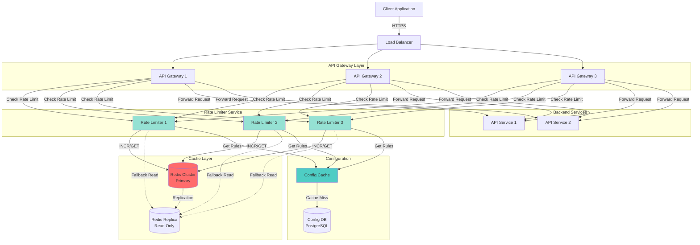
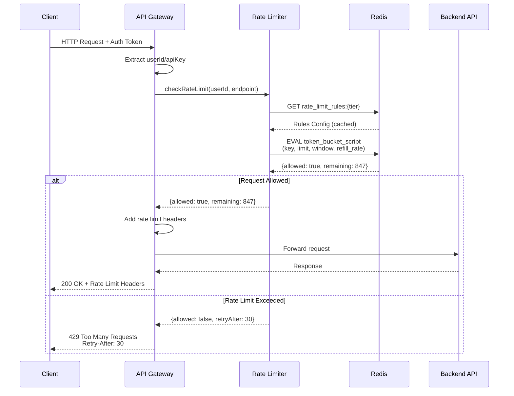

# Rate Limiter System Design

A distributed rate limiting system to protect APIs from abuse and ensure fair resource usage.

---

## 1. Requirements (~5 minutes)

### Functional Requirements

✓ **Rate Limiting**: The system should limit the number of requests a user/client can make within a time window (e.g., 100 requests per minute)

✓ **Multiple Rules**: Support different rate limit rules based on user tiers (free: 10/min, premium: 1000/min, enterprise: custom)

✓ **Feedback**: When rate limit is exceeded, return clear error message with retry-after time

### Non-Functional Requirements

- **Low Latency**: Rate limiting check should add minimal latency (target: `<5ms`)
- **High Availability**: System should be fault-tolerant; if rate limiter fails, default to allowing requests (fail-open)
- **Accuracy**: Should prevent more than 5% deviation from configured limits in distributed environment
- **Scalability**: Handle millions of requests per second across distributed servers
- **Consistency**: Prefer availability over strict consistency (eventual consistency acceptable)

### Capacity Estimation

**Assumptions:**

- 1 billion requests per day
- 10 million unique users
- Average 100 requests per user per day

**Calculations:**

**QPS (Queries Per Second):**

```
Average QPS = 1B / (24 * 3600) ≈ 11,574 QPS
Peak QPS (3x average) ≈ 35,000 QPS
```

**Memory Requirements (Redis):**

```
Per user: ~100 bytes (key + counter + metadata)
10M users × 100 bytes = 1 GB
With overhead and multiple time windows: ~5 GB
```

**Cache Hit Rate:**

- 80% of requests from 20% of users (power law)
- Active cache size: ~1 GB for hot users

---

## 2. Core Entities (~2 minutes)

**RateLimitRule**: Configuration defining rate limiting behavior

- `ruleId`: Unique identifier
- `limit`: Maximum requests allowed
- `window`: Time window (seconds)
- `tier`: User tier (free, premium, enterprise)

**RateLimitCounter**: Tracks request counts per user

- `userId/apiKey`: Identifier
- `requestCount`: Current count
- `windowStart`: Window start timestamp
- `expiresAt`: TTL for cleanup

**RateLimitResponse**: Result of rate limit check

- `allowed`: Boolean indicating if request is allowed
- `remaining`: Requests remaining in window
- `resetTime`: When the limit resets
- `retryAfter`: Seconds to wait if rate limited

---

## 3. API or System Interface (~5 minutes)

### Protocol: REST + gRPC for internal services

### Public API Endpoints

**Check Rate Limit (Internal)**

```
POST /v1/ratelimit/check
Headers:
  Authorization: Bearer <token>
Body:
{
  "userId": "user123",
  "apiKey": "key_abc",
  "endpoint": "/api/posts",
  "tier": "premium"
}

Response:
{
  "allowed": true,
  "limit": 1000,
  "remaining": 847,
  "resetTime": 1696523400,
  "retryAfter": null
}
```

**Get User Rate Limit Status**

```
GET /v1/ratelimit/status/{userId}
Headers:
  Authorization: Bearer <token>

Response:
{
  "rules": [
    {
      "endpoint": "/api/posts",
      "limit": 1000,
      "remaining": 847,
      "resetTime": 1696523400
    }
  ]
}
```

**Configure Rate Limit Rules (Admin)**

```
POST /v1/admin/ratelimit/rules
Headers:
  Authorization: Bearer <admin_token>
Body:
{
  "tier": "premium",
  "rules": [
    {
      "endpoint": "/api/*",
      "limit": 1000,
      "window": 60
    }
  ]
}
```

### Response Headers (Added to all API responses)

```
X-RateLimit-Limit: 1000
X-RateLimit-Remaining: 847
X-RateLimit-Reset: 1696523400
Retry-After: 30 (if rate limited)
```

---

## 4. High Level Design (~10-15 minutes)

### Algorithm Choice: **Token Bucket Algorithm**

**Why Token Bucket?**

- Allows burst traffic while maintaining average rate
- Simple to implement in Redis
- Memory efficient
- Handles distributed systems well

**Alternative Algorithms:**

- **Fixed Window**: Simple but allows burst at window boundaries
- **Sliding Window Log**: Accurate but memory intensive
- **Sliding Window Counter**: Good balance but more complex

### Architecture Diagram



### Request Flow



### Data Models

**Redis Keys Structure:**

```
# Token bucket counter
rate_limit:{userId}:{endpoint}:{window}
  - tokens: current available tokens
  - lastRefill: last refill timestamp
  - TTL: window duration

# Rule configuration (cached)
rate_limit_rules:{tier}
  - JSON blob with all rules for tier
  - TTL: 5 minutes

# User tier mapping
user_tier:{userId}
  - tier name (free/premium/enterprise)
  - TTL: 1 hour
```

**PostgreSQL Schema:**

```sql
-- Rate limit rules configuration
CREATE TABLE rate_limit_rules (
    id SERIAL PRIMARY KEY,
    tier VARCHAR(50) NOT NULL,
    endpoint_pattern VARCHAR(255) NOT NULL,
    limit_count INTEGER NOT NULL,
    window_seconds INTEGER NOT NULL,
    created_at TIMESTAMP DEFAULT NOW(),
    updated_at TIMESTAMP DEFAULT NOW()
);

-- User tier assignments
CREATE TABLE user_tiers (
    user_id VARCHAR(255) PRIMARY KEY,
    tier VARCHAR(50) NOT NULL,
    custom_limits JSONB,
    created_at TIMESTAMP DEFAULT NOW(),
    updated_at TIMESTAMP DEFAULT NOW()
);

-- Rate limit violations log (for analytics)
CREATE TABLE rate_limit_violations (
    id SERIAL PRIMARY KEY,
    user_id VARCHAR(255) NOT NULL,
    endpoint VARCHAR(255) NOT NULL,
    timestamp TIMESTAMP NOT NULL,
    attempted_count INTEGER
);
```

### Token Bucket Redis Lua Script

```lua
-- Token Bucket Algorithm Implementation
local key = KEYS[1]
local limit = tonumber(ARGV[1])
local window = tonumber(ARGV[2])
local rate = limit / window
local now = tonumber(ARGV[3])

local bucket = redis.call('HMGET', key, 'tokens', 'lastRefill')
local tokens = tonumber(bucket[1])
local lastRefill = tonumber(bucket[2])

if tokens == nil then
    tokens = limit
    lastRefill = now
end

-- Refill tokens based on time elapsed
local elapsed = now - lastRefill
local tokensToAdd = elapsed * rate
tokens = math.min(limit, tokens + tokensToAdd)
lastRefill = now

-- Try to consume 1 token
local allowed = 0
if tokens >= 1 then
    tokens = tokens - 1
    allowed = 1
end

redis.call('HMSET', key, 'tokens', tokens, 'lastRefill', lastRefill)
redis.call('EXPIRE', key, window)

return {allowed, math.floor(tokens)}
```

---

## 5. Deep Dives (~10 minutes)

### 5.1 Spring Boot Implementation

#### Domain Models

```java
// RateLimitResponse.java
@Data
@Builder
@NoArgsConstructor
@AllArgsConstructor
public class RateLimitResponse {
    private boolean allowed;
    private int limit;
    private int remaining;
    private long resetTime;
    private Integer retryAfter;
    private boolean degraded;
}

// RateLimitRule.java
@Entity
@Table(name = "rate_limit_rules")
@Data
@NoArgsConstructor
@AllArgsConstructor
public class RateLimitRule {
    @Id
    @GeneratedValue(strategy = GenerationType.IDENTITY)
    private Long id;

    @Column(nullable = false)
    private String tier;

    @Column(name = "endpoint_pattern", nullable = false)
    private String endpointPattern;

    @Column(name = "limit_count", nullable = false)
    private Integer limitCount;

    @Column(name = "window_seconds", nullable = false)
    private Integer windowSeconds;

    @CreatedDate
    @Column(name = "created_at")
    private LocalDateTime createdAt;

    @LastModifiedDate
    @Column(name = "updated_at")
    private LocalDateTime updatedAt;
}

// UserTier.java
@Entity
@Table(name = "user_tiers")
@Data
@NoArgsConstructor
@AllArgsConstructor
public class UserTier {
    @Id
    @Column(name = "user_id")
    private String userId;

    @Column(nullable = false)
    private String tier;

    @Type(type = "jsonb")
    @Column(name = "custom_limits", columnDefinition = "jsonb")
    private String customLimits;

    @CreatedDate
    @Column(name = "created_at")
    private LocalDateTime createdAt;

    @LastModifiedDate
    @Column(name = "updated_at")
    private LocalDateTime updatedAt;
}
```

#### Rate Limiter Service

```java
@Service
@Slf4j
public class RateLimiterService {

    @Autowired
    private RedisTemplate<String, String> redisTemplate;

    @Autowired
    private RateLimitRuleRepository ruleRepository;

    @Value("classpath:token_bucket.lua")
    private Resource tokenBucketScript;

    private RedisScript<List> script;

    @PostConstruct
    public void init() throws IOException {
        String scriptContent = new String(
            tokenBucketScript.getInputStream().readAllBytes()
        );
        script = RedisScript.of(scriptContent, List.class);
    }

    /**
     * Check if request is allowed under rate limit
     * Implements fail-open strategy
     */
    public RateLimitResponse checkRateLimit(String userId, String endpoint, String tier) {
        try {
            // Get rate limit rule for tier and endpoint
            RateLimitRule rule = getRateLimitRule(tier, endpoint);
            if (rule == null) {
                return allowRequest(); // No rule configured, allow
            }

            // Build Redis key
            String key = buildRateLimitKey(userId, endpoint, rule.getWindowSeconds());

            // Execute token bucket algorithm
            List<Long> result = executeTokenBucket(
                key,
                rule.getLimitCount(),
                rule.getWindowSeconds()
            );

            long allowed = result.get(0);
            long remaining = result.get(1);
            long resetTime = System.currentTimeMillis() / 1000 + rule.getWindowSeconds();

            return RateLimitResponse.builder()
                .allowed(allowed == 1)
                .limit(rule.getLimitCount())
                .remaining((int) remaining)
                .resetTime(resetTime)
                .retryAfter(allowed == 0 ? rule.getWindowSeconds() : null)
                .degraded(false)
                .build();

        } catch (RedisConnectionFailureException ex) {
            log.error("Redis connection failed, failing open: {}", ex.getMessage());
            return failOpen();
        } catch (Exception ex) {
            log.error("Rate limiter error: {}", ex.getMessage(), ex);
            return failOpen();
        }
    }

    /**
     * Execute token bucket Lua script in Redis
     */
    private List<Long> executeTokenBucket(String key, int limit, int window) {
        long now = System.currentTimeMillis() / 1000;

        return redisTemplate.execute(
            script,
            Collections.singletonList(key),
            String.valueOf(limit),
            String.valueOf(window),
            String.valueOf(now)
        );
    }

    /**
     * Get rate limit rule with caching
     */
    @Cacheable(value = "rateLimitRules", key = "#tier + ':' + #endpoint")
    public RateLimitRule getRateLimitRule(String tier, String endpoint) {
        return ruleRepository.findByTierAndEndpointPattern(tier, endpoint)
            .orElse(null);
    }

    /**
     * Build Redis key for rate limiting
     */
    private String buildRateLimitKey(String userId, String endpoint, int window) {
        return String.format("rate_limit:%s:%s:%d", userId, endpoint, window);
    }

    /**
     * Fail-open: Allow request when rate limiter unavailable
     */
    private RateLimitResponse failOpen() {
        return RateLimitResponse.builder()
            .allowed(true)
            .degraded(true)
            .limit(0)
            .remaining(0)
            .resetTime(0)
            .build();
    }

    private RateLimitResponse allowRequest() {
        return RateLimitResponse.builder()
            .allowed(true)
            .limit(Integer.MAX_VALUE)
            .remaining(Integer.MAX_VALUE)
            .resetTime(0)
            .build();
    }
}
```

#### REST Controller

```java
@RestController
@RequestMapping("/v1/ratelimit")
@Slf4j
public class RateLimitController {

    @Autowired
    private RateLimiterService rateLimiterService;

    /**
     * Check rate limit for a request
     */
    @PostMapping("/check")
    public ResponseEntity<RateLimitResponse> checkRateLimit(
            @RequestBody RateLimitCheckRequest request) {

        RateLimitResponse response = rateLimiterService.checkRateLimit(
            request.getUserId(),
            request.getEndpoint(),
            request.getTier()
        );

        return ResponseEntity.ok(response);
    }

    /**
     * Get rate limit status for a user
     */
    @GetMapping("/status/{userId}")
    public ResponseEntity<RateLimitStatusResponse> getStatus(
            @PathVariable String userId,
            @RequestHeader("Authorization") String token) {

        // Implementation here
        return ResponseEntity.ok(new RateLimitStatusResponse());
    }
}

@Data
class RateLimitCheckRequest {
    private String userId;
    private String apiKey;
    private String endpoint;
    private String tier;
}

@Data
class RateLimitStatusResponse {
    private List<RuleStat us> rules;
}

@Data
class RuleStatus {
    private String endpoint;
    private int limit;
    private int remaining;
    private long resetTime;
}
```

#### Interceptor for API Gateway

```java
@Component
@Slf4j
public class RateLimitInterceptor implements HandlerInterceptor {

    @Autowired
    private RateLimiterService rateLimiterService;

    @Autowired
    private UserService userService;

    @Override
    public boolean preHandle(HttpServletRequest request,
                           HttpServletResponse response,
                           Object handler) throws Exception {

        // Extract user information from token/session
        String userId = extractUserId(request);
        String endpoint = request.getRequestURI();
        String tier = userService.getUserTier(userId);

        // Check rate limit
        RateLimitResponse rateLimitResponse = rateLimiterService.checkRateLimit(
            userId, endpoint, tier
        );

        // Add rate limit headers
        response.addHeader("X-RateLimit-Limit",
            String.valueOf(rateLimitResponse.getLimit()));
        response.addHeader("X-RateLimit-Remaining",
            String.valueOf(rateLimitResponse.getRemaining()));
        response.addHeader("X-RateLimit-Reset",
            String.valueOf(rateLimitResponse.getResetTime()));

        // Check if request is allowed
        if (!rateLimitResponse.isAllowed()) {
            response.setStatus(HttpStatus.TOO_MANY_REQUESTS.value());
            response.addHeader("Retry-After",
                String.valueOf(rateLimitResponse.getRetryAfter()));

            response.getWriter().write(
                "{\"error\": \"Rate limit exceeded\", \"retryAfter\": " +
                rateLimitResponse.getRetryAfter() + "}"
            );

            return false;
        }

        return true;
    }

    private String extractUserId(HttpServletRequest request) {
        // Extract from JWT token or session
        String authHeader = request.getHeader("Authorization");
        // Parse JWT and extract userId
        return "user123"; // Placeholder
    }
}
```

### 5.2 Redis Configuration

```java
@Configuration
@EnableCaching
public class RedisConfig {

    @Value("${spring.redis.host}")
    private String redisHost;

    @Value("${spring.redis.port}")
    private int redisPort;

    @Value("${spring.redis.pool.max-active}")
    private int maxActive;

    @Value("${spring.redis.pool.max-idle}")
    private int maxIdle;

    /**
     * Redis connection factory with connection pooling
     */
    @Bean
    public RedisConnectionFactory redisConnectionFactory() {
        JedisPoolConfig poolConfig = new JedisPoolConfig();
        poolConfig.setMaxTotal(maxActive);
        poolConfig.setMaxIdle(maxIdle);
        poolConfig.setMinIdle(10);
        poolConfig.setTestOnBorrow(true);
        poolConfig.setTestOnReturn(true);
        poolConfig.setTestWhileIdle(true);

        JedisClientConfiguration clientConfig = JedisClientConfiguration.builder()
            .usePooling()
            .poolConfig(poolConfig)
            .and()
            .readTimeout(Duration.ofMillis(2000))
            .connectTimeout(Duration.ofMillis(1000))
            .build();

        RedisStandaloneConfiguration serverConfig =
            new RedisStandaloneConfiguration(redisHost, redisPort);

        return new JedisConnectionFactory(serverConfig, clientConfig);
    }

    /**
     * Redis template for operations
     */
    @Bean
    public RedisTemplate<String, String> redisTemplate(
            RedisConnectionFactory connectionFactory) {

        RedisTemplate<String, String> template = new RedisTemplate<>();
        template.setConnectionFactory(connectionFactory);
        template.setKeySerializer(new StringRedisSerializer());
        template.setValueSerializer(new StringRedisSerializer());
        template.setHashKeySerializer(new StringRedisSerializer());
        template.setHashValueSerializer(new StringRedisSerializer());
        template.afterPropertiesSet();

        return template;
    }

    /**
     * Cache manager for Spring Cache abstraction
     */
    @Bean
    public CacheManager cacheManager(RedisConnectionFactory connectionFactory) {
        RedisCacheConfiguration config = RedisCacheConfiguration.defaultCacheConfig()
            .entryTtl(Duration.ofMinutes(5))
            .serializeKeysWith(
                RedisSerializationContext.SerializationPair.fromSerializer(
                    new StringRedisSerializer()
                )
            )
            .serializeValuesWith(
                RedisSerializationContext.SerializationPair.fromSerializer(
                    new GenericJackson2JsonRedisSerializer()
                )
            );

        return RedisCacheManager.builder(connectionFactory)
            .cacheDefaults(config)
            .build();
    }
}
```

### 5.3 Circuit Breaker Pattern

```java
@Service
@Slf4j
public class RateLimiterServiceWithCircuitBreaker {

    @Autowired
    private RateLimiterService rateLimiterService;

    private final CircuitBreaker circuitBreaker;

    public RateLimiterServiceWithCircuitBreaker() {
        CircuitBreakerConfig config = CircuitBreakerConfig.custom()
            .failureRateThreshold(50)
            .waitDurationInOpenState(Duration.ofSeconds(30))
            .slidingWindowSize(10)
            .build();

        CircuitBreakerRegistry registry = CircuitBreakerRegistry.of(config);
        this.circuitBreaker = registry.circuitBreaker("rateLimiter");
    }

    public RateLimitResponse checkRateLimit(String userId, String endpoint, String tier) {
        return circuitBreaker.executeSupplier(() ->
            rateLimiterService.checkRateLimit(userId, endpoint, tier)
        );
    }
}
```

### 5.4 Redis Pipeline for Performance

```java
@Service
public class OptimizedRateLimiterService {

    @Autowired
    private RedisTemplate<String, String> redisTemplate;

    /**
     * Check multiple rate limits using pipeline
     */
    public Map<String, RateLimitResponse> checkMultipleRateLimits(
            List<RateLimitCheckRequest> requests) {

        Map<String, RateLimitResponse> results = new HashMap<>();

        // Execute pipelined operations
        List<Object> pipelineResults = redisTemplate.executePipelined(
            (RedisCallback<Object>) connection -> {
                for (RateLimitCheckRequest req : requests) {
                    String key = buildKey(req);
                    connection.get(key.getBytes());
                }
                return null;
            }
        );

        // Process results
        for (int i = 0; i < requests.size(); i++) {
            RateLimitCheckRequest req = requests.get(i);
            Object result = pipelineResults.get(i);

            RateLimitResponse response = processResult(req, result);
            results.put(req.getUserId(), response);
        }

        return results;
    }

    private String buildKey(RateLimitCheckRequest req) {
        return String.format("rate_limit:%s:%s",
            req.getUserId(), req.getEndpoint());
    }

    private RateLimitResponse processResult(RateLimitCheckRequest req, Object result) {
        // Process and build response
        return RateLimitResponse.builder()
            .allowed(true)
            .build();
    }
}
```

### 5.5 Application Properties

```yaml
# application.yml
spring:
  redis:
    host: localhost
    port: 6379
    timeout: 2000
    pool:
      max-active: 100
      max-idle: 50
      min-idle: 10
      max-wait: 1000

  datasource:
    url: jdbc:postgresql://localhost:5432/ratelimiter
    username: postgres
    password: password
    hikari:
      maximum-pool-size: 20
      minimum-idle: 5
      connection-timeout: 30000

  jpa:
    hibernate:
      ddl-auto: validate
    show-sql: false
    properties:
      hibernate:
        dialect: org.hibernate.dialect.PostgreSQLDialect
        format_sql: true

# Rate limiter specific configs
ratelimiter:
  fail-open: true
  default-limit: 1000
  default-window: 60
  cache-ttl-minutes: 5
```

### 5.6 Monitoring & Metrics

```java
@Service
@Slf4j
public class RateLimiterMetricsService {

    private final MeterRegistry meterRegistry;
    private final Counter rateLimitExceededCounter;
    private final Timer rateLimitCheckTimer;

    public RateLimiterMetricsService(MeterRegistry meterRegistry) {
        this.meterRegistry = meterRegistry;

        this.rateLimitExceededCounter = Counter.builder("ratelimit.exceeded")
            .description("Number of rate limit violations")
            .tag("service", "ratelimiter")
            .register(meterRegistry);

        this.rateLimitCheckTimer = Timer.builder("ratelimit.check.duration")
            .description("Rate limit check duration")
            .tag("service", "ratelimiter")
            .register(meterRegistry);
    }

    public void recordRateLimitExceeded(String userId, String endpoint) {
        rateLimitExceededCounter.increment();

        Gauge.builder("ratelimit.violations", () -> getUserViolationCount(userId))
            .tag("userId", userId)
            .register(meterRegistry);
    }

    public <T> T timeRateLimitCheck(Supplier<T> operation) {
        return rateLimitCheckTimer.record(operation);
    }

    private double getUserViolationCount(String userId) {
        // Query violation count from database or cache
        return 0.0;
    }
}
```

### 5.7 Admin API Controller

```java
@RestController
@RequestMapping("/v1/admin/ratelimit")
@Slf4j
public class RateLimitAdminController {

    @Autowired
    private RateLimitRuleRepository ruleRepository;

    @Autowired
    private CacheManager cacheManager;

    /**
     * Create or update rate limit rules
     */
    @PostMapping("/rules")
    @PreAuthorize("hasRole('ADMIN')")
    public ResponseEntity<RateLimitRule> createRule(
            @RequestBody @Valid RateLimitRuleDto ruleDto) {

        RateLimitRule rule = new RateLimitRule();
        rule.setTier(ruleDto.getTier());
        rule.setEndpointPattern(ruleDto.getEndpointPattern());
        rule.setLimitCount(ruleDto.getLimitCount());
        rule.setWindowSeconds(ruleDto.getWindowSeconds());

        RateLimitRule saved = ruleRepository.save(rule);

        // Invalidate cache
        invalidateRuleCache(ruleDto.getTier());

        return ResponseEntity.ok(saved);
    }

    /**
     * Get all rules for a tier
     */
    @GetMapping("/rules/{tier}")
    @PreAuthorize("hasRole('ADMIN')")
    public ResponseEntity<List<RateLimitRule>> getRules(
            @PathVariable String tier) {

        List<RateLimitRule> rules = ruleRepository.findByTier(tier);
        return ResponseEntity.ok(rules);
    }

    /**
     * Delete a rule
     */
    @DeleteMapping("/rules/{ruleId}")
    @PreAuthorize("hasRole('ADMIN')")
    public ResponseEntity<Void> deleteRule(@PathVariable Long ruleId) {
        ruleRepository.deleteById(ruleId);
        return ResponseEntity.noContent().build();
    }

    private void invalidateRuleCache(String tier) {
        Cache cache = cacheManager.getCache("rateLimitRules");
        if (cache != null) {
            cache.evict(tier);
        }
    }
}

@Data
class RateLimitRuleDto {
    @NotBlank
    private String tier;

    @NotBlank
    private String endpointPattern;

    @Min(1)
    private Integer limitCount;

    @Min(1)
    private Integer windowSeconds;
}
```

---

## 6. Alternative Approaches

### Approach 1: Fixed Window Counter

**Pros**: Simple, low memory
**Cons**: Burst at window boundaries

### Approach 2: Sliding Window Log

**Pros**: Very accurate
**Cons**: High memory usage (store all request timestamps)

### Approach 3: Leaky Bucket

**Pros**: Smooth traffic, no bursts
**Cons**: Less flexible, may reject valid bursts

**Chosen: Token Bucket** - Best balance of accuracy, flexibility, and performance

---

## 7. Trade-offs & Decisions

| Decision                             | Trade-off                 | Rationale                                        |
| ------------------------------------ | ------------------------- | ------------------------------------------------ |
| Token Bucket over Fixed Window       | Complexity vs Accuracy    | Allows legitimate bursts while maintaining rate  |
| Fail-Open on Redis failure           | Availability vs Security  | Business continuity over strict enforcement      |
| Eventual consistency in multi-region | Consistency vs Latency    | Low latency more important than perfect accuracy |
| 5% accuracy margin                   | Strictness vs Performance | Acceptable for most use cases, huge perf gain    |
| Redis over Database                  | Cost vs Performance       | Sub-5ms latency requirement demands in-memory    |

---

## 8. Extended Features (Future Enhancements)

### 8.1 Dynamic Rate Limiting Based on System Load

```java
@Service
public class DynamicRateLimiterService {

    @Autowired
    private RateLimiterService rateLimiterService;

    @Autowired
    private SystemLoadMonitor loadMonitor;

    /**
     * Adjust rate limits based on current system load
     */
    public RateLimitResponse checkWithDynamicLimit(
            String userId, String endpoint, String tier) {

        double loadFactor = loadMonitor.getCurrentLoadFactor();

        // Reduce limits when system is under heavy load
        if (loadFactor > 0.8) {
            // Apply 50% reduction
            return rateLimiterService.checkRateLimit(
                userId, endpoint, tier, 0.5
            );
        } else if (loadFactor > 0.6) {
            // Apply 25% reduction
            return rateLimiterService.checkRateLimit(
                userId, endpoint, tier, 0.75
            );
        }

        return rateLimiterService.checkRateLimit(userId, endpoint, tier);
    }
}

@Component
class SystemLoadMonitor {

    @Autowired
    private MeterRegistry meterRegistry;

    public double getCurrentLoadFactor() {
        // Monitor CPU, memory, and request queue depth
        double cpu = getCpuUsage();
        double memory = getMemoryUsage();
        double queueDepth = getQueueDepth();

        return Math.max(cpu, Math.max(memory, queueDepth));
    }

    private double getCpuUsage() {
        return meterRegistry.get("system.cpu.usage").gauge().value();
    }

    private double getMemoryUsage() {
        return meterRegistry.get("jvm.memory.used").gauge().value() /
               meterRegistry.get("jvm.memory.max").gauge().value();
    }

    private double getQueueDepth() {
        // Custom metric for request queue
        return 0.0; // Placeholder
    }
}
```

### 8.2 User Quota Management with Rollover

```java
@Service
public class QuotaManagementService {

    @Autowired
    private RedisTemplate<String, String> redisTemplate;

    @Autowired
    private QuotaRepository quotaRepository;

    /**
     * Check monthly quota with rollover support
     */
    public QuotaResponse checkMonthlyQuota(String userId) {
        String key = "quota:monthly:" + userId;
        String month = getCurrentMonth();

        // Get current usage
        String usageStr = redisTemplate.opsForValue().get(key + ":" + month);
        long currentUsage = usageStr != null ? Long.parseLong(usageStr) : 0;

        // Get quota limit
        UserQuota quota = quotaRepository.findByUserId(userId)
            .orElse(getDefaultQuota());

        long available = quota.getMonthlyLimit() + quota.getRolloverAmount() - currentUsage;

        return QuotaResponse.builder()
            .userId(userId)
            .limit(quota.getMonthlyLimit())
            .used(currentUsage)
            .available(available)
            .rollover(quota.getRolloverAmount())
            .resetsAt(getMonthEndTimestamp())
            .build();
    }

    /**
     * Increment quota usage
     */
    public void incrementUsage(String userId, long amount) {
        String key = "quota:monthly:" + userId + ":" + getCurrentMonth();
        redisTemplate.opsForValue().increment(key, amount);
        redisTemplate.expire(key, Duration.ofDays(40)); // Keep for 40 days
    }

    /**
     * Process monthly rollover
     */
    @Scheduled(cron = "0 0 0 1 * ?") // First day of each month
    public void processMonthlyRollover() {
        List<UserQuota> allQuotas = quotaRepository.findAll();

        for (UserQuota quota : allQuotas) {
            String lastMonth = getLastMonth();
            String key = "quota:monthly:" + quota.getUserId() + ":" + lastMonth;

            String usageStr = redisTemplate.opsForValue().get(key);
            long lastMonthUsage = usageStr != null ? Long.parseLong(usageStr) : 0;

            // Calculate rollover (unused quota from last month)
            long unused = Math.max(0, quota.getMonthlyLimit() - lastMonthUsage);
            long rollover = Math.min(unused, quota.getMaxRollover());

            // Update quota with rollover
            quota.setRolloverAmount(rollover);
            quotaRepository.save(quota);
        }
    }

    private String getCurrentMonth() {
        return LocalDate.now().format(DateTimeFormatter.ofPattern("yyyy-MM"));
    }

    private String getLastMonth() {
        return LocalDate.now().minusMonths(1)
            .format(DateTimeFormatter.ofPattern("yyyy-MM"));
    }

    private long getMonthEndTimestamp() {
        return LocalDate.now().plusMonths(1).withDayOfMonth(1)
            .atStartOfDay(ZoneId.systemDefault())
            .toEpochSecond();
    }

    private UserQuota getDefaultQuota() {
        return UserQuota.builder()
            .monthlyLimit(10000)
            .rolloverAmount(0)
            .maxRollover(5000)
            .build();
    }
}

@Entity
@Table(name = "user_quotas")
@Data
@Builder
@NoArgsConstructor
@AllArgsConstructor
class UserQuota {
    @Id
    private String userId;

    @Column(name = "monthly_limit")
    private Long monthlyLimit;

    @Column(name = "rollover_amount")
    private Long rolloverAmount;

    @Column(name = "max_rollover")
    private Long maxRollover;
}

@Data
@Builder
class QuotaResponse {
    private String userId;
    private long limit;
    private long used;
    private long available;
    private long rollover;
    private long resetsAt;
}
```

### 8.3 Cost-Based Rate Limiting

```java
@Service
public class CostBasedRateLimiterService {

    @Autowired
    private RedisTemplate<String, String> redisTemplate;

    @Autowired
    private CostConfigRepository costConfigRepository;

    private static final Map<String, Integer> DEFAULT_COSTS = Map.of(
        "GET", 1,
        "POST", 5,
        "PUT", 5,
        "DELETE", 10
    );

    /**
     * Check rate limit based on operation cost
     */
    public RateLimitResponse checkCostBasedLimit(
            String userId, String endpoint, String method, String tier) {

        // Get cost for this operation
        int cost = getOperationCost(endpoint, method);

        // Get user's cost budget
        String key = "cost_budget:" + userId + ":" + getCurrentMinute();
        String budgetStr = redisTemplate.opsForValue().get(key);

        int remainingBudget = budgetStr != null ?
            Integer.parseInt(budgetStr) : getBudgetForTier(tier);

        boolean allowed = remainingBudget >= cost;

        if (allowed) {
            // Deduct cost from budget
            long newBudget = redisTemplate.opsForValue()
                .decrement(key, cost);
            redisTemplate.expire(key, Duration.ofMinutes(1));

            return RateLimitResponse.builder()
                .allowed(true)
                .remaining((int) newBudget / cost) // Approximate remaining requests
                .build();
        }

        return RateLimitResponse.builder()
            .allowed(false)
            .retryAfter(60)
            .build();
    }

    /**
     * Get operation cost from config or defaults
     */
    @Cacheable("operationCosts")
    public int getOperationCost(String endpoint, String method) {
        return costConfigRepository
            .findByEndpointAndMethod(endpoint, method)
            .map(CostConfig::getCost)
            .orElse(DEFAULT_COSTS.getOrDefault(method, 1));
    }

    private int getBudgetForTier(String tier) {
        return switch (tier) {
            case "free" -> 100;
            case "premium" -> 10000;
            case "enterprise" -> 100000;
            default -> 100;
        };
    }

    private String getCurrentMinute() {
        return LocalDateTime.now()
            .format(DateTimeFormatter.ofPattern("yyyy-MM-dd-HH-mm"));
    }
}

@Entity
@Table(name = "operation_costs")
@Data
class CostConfig {
    @Id
    @GeneratedValue(strategy = GenerationType.IDENTITY)
    private Long id;

    private String endpoint;
    private String method;
    private Integer cost;
}
```

### 8.4 Machine Learning for Anomaly Detection

```java
@Service
public class AnomalyDetectionService {

    @Autowired
    private RedisTemplate<String, String> redisTemplate;

    @Autowired
    private UserBehaviorRepository behaviorRepository;

    /**
     * Detect anomalous request patterns
     */
    public AnomalyScore analyzeRequestPattern(String userId, String endpoint) {
        // Get recent request history
        List<Long> requestTimestamps = getRecentRequests(userId, endpoint);

        if (requestTimestamps.size() < 10) {
            return AnomalyScore.normal();
        }

        // Calculate request rate statistics
        double avgInterval = calculateAverageInterval(requestTimestamps);
        double stdDev = calculateStdDev(requestTimestamps, avgInterval);

        // Get user's historical baseline
        UserBehavior baseline = behaviorRepository
            .findByUserIdAndEndpoint(userId, endpoint)
            .orElse(null);

        if (baseline == null) {
            // First time, create baseline
            createBaseline(userId, endpoint, avgInterval, stdDev);
            return AnomalyScore.normal();
        }

        // Calculate anomaly score (Z-score)
        double zScore = Math.abs((avgInterval - baseline.getAvgInterval()) /
                                  baseline.getStdDev());

        if (zScore > 3.0) {
            return AnomalyScore.builder()
                .score(zScore)
                .anomalous(true)
                .reason("Request rate significantly different from baseline")
                .action(AnomalyAction.THROTTLE)
                .build();
        } else if (zScore > 2.0) {
            return AnomalyScore.builder()
                .score(zScore)
                .anomalous(true)
                .reason("Request rate moderately different from baseline")
                .action(AnomalyAction.MONITOR)
                .build();
        }

        return AnomalyScore.normal();
    }

    /**
     * Get recent request timestamps
     */
    private List<Long> getRecentRequests(String userId, String endpoint) {
        String key = "request_history:" + userId + ":" + endpoint;
        Set<String> timestamps = redisTemplate.opsForZSet()
            .rangeByScore(key, System.currentTimeMillis() - 300000,
                         System.currentTimeMillis());

        return timestamps.stream()
            .map(Long::parseLong)
            .collect(Collectors.toList());
    }

    /**
     * Record request timestamp
     */
    public void recordRequest(String userId, String endpoint) {
        String key = "request_history:" + userId + ":" + endpoint;
        long now = System.currentTimeMillis();

        redisTemplate.opsForZSet().add(key, String.valueOf(now), now);

        // Keep only last 100 requests
        redisTemplate.opsForZSet().removeRange(key, 0, -101);
        redisTemplate.expire(key, Duration.ofMinutes(10));
    }

    private double calculateAverageInterval(List<Long> timestamps) {
        if (timestamps.size() < 2) return 0;

        List<Long> intervals = new ArrayList<>();
        for (int i = 1; i < timestamps.size(); i++) {
            intervals.add(timestamps.get(i) - timestamps.get(i - 1));
        }

        return intervals.stream()
            .mapToLong(Long::longValue)
            .average()
            .orElse(0.0);
    }

    private double calculateStdDev(List<Long> timestamps, double avgInterval) {
        if (timestamps.size() < 2) return 0;

        List<Long> intervals = new ArrayList<>();
        for (int i = 1; i < timestamps.size(); i++) {
            intervals.add(timestamps.get(i) - timestamps.get(i - 1));
        }

        double variance = intervals.stream()
            .mapToDouble(interval -> Math.pow(interval - avgInterval, 2))
            .average()
            .orElse(0.0);

        return Math.sqrt(variance);
    }

    private void createBaseline(String userId, String endpoint,
                               double avgInterval, double stdDev) {
        UserBehavior behavior = new UserBehavior();
        behavior.setUserId(userId);
        behavior.setEndpoint(endpoint);
        behavior.setAvgInterval(avgInterval);
        behavior.setStdDev(stdDev);
        behavior.setUpdatedAt(LocalDateTime.now());

        behaviorRepository.save(behavior);
    }
}

@Entity
@Table(name = "user_behaviors")
@Data
class UserBehavior {
    @Id
    @GeneratedValue(strategy = GenerationType.IDENTITY)
    private Long id;

    @Column(name = "user_id")
    private String userId;

    private String endpoint;

    @Column(name = "avg_interval")
    private Double avgInterval;

    @Column(name = "std_dev")
    private Double stdDev;

    @Column(name = "updated_at")
    private LocalDateTime updatedAt;
}

@Data
@Builder
class AnomalyScore {
    private double score;
    private boolean anomalous;
    private String reason;
    private AnomalyAction action;

    public static AnomalyScore normal() {
        return AnomalyScore.builder()
            .score(0.0)
            .anomalous(false)
            .action(AnomalyAction.ALLOW)
            .build();
    }
}

enum AnomalyAction {
    ALLOW,
    MONITOR,
    THROTTLE,
    BLOCK
}
```

### 8.5 Self-Service Dashboard API

```java
@RestController
@RequestMapping("/v1/dashboard")
public class UserDashboardController {

    @Autowired
    private RateLimiterService rateLimiterService;

    @Autowired
    private QuotaManagementService quotaService;

    @Autowired
    private UsageAnalyticsService analyticsService;

    /**
     * Get user's current rate limit status
     */
    @GetMapping("/status")
    public ResponseEntity<DashboardStatus> getDashboardStatus(
            @AuthenticationPrincipal UserDetails user) {

        String userId = user.getUsername();

        // Get quota status
        QuotaResponse quota = quotaService.checkMonthlyQuota(userId);

        // Get usage analytics
        UsageStats stats = analyticsService.getUserStats(userId);

        // Get active rate limits
        List<RateLimitStatus> rateLimits = rateLimiterService
            .getAllRateLimitStatuses(userId);

        DashboardStatus status = DashboardStatus.builder()
            .userId(userId)
            .quota(quota)
            .usageStats(stats)
            .rateLimits(rateLimits)
            .build();

        return ResponseEntity.ok(status);
    }

    /**
     * Get usage history
     */
    @GetMapping("/usage/history")
    public ResponseEntity<UsageHistory> getUsageHistory(
            @AuthenticationPrincipal UserDetails user,
            @RequestParam @DateTimeFormat(iso = DateTimeFormat.ISO.DATE) LocalDate startDate,
            @RequestParam @DateTimeFormat(iso = DateTimeFormat.ISO.DATE) LocalDate endDate) {

        String userId = user.getUsername();
        UsageHistory history = analyticsService.getUsageHistory(userId, startDate, endDate);

        return ResponseEntity.ok(history);
    }

    /**
     * Request tier upgrade
     */
    @PostMapping("/tier/upgrade")
    public ResponseEntity<UpgradeRequest> requestTierUpgrade(
            @AuthenticationPrincipal UserDetails user,
            @RequestBody TierUpgradeDto upgradeDto) {

        String userId = user.getUsername();

        UpgradeRequest request = UpgradeRequest.builder()
            .userId(userId)
            .currentTier(upgradeDto.getCurrentTier())
            .requestedTier(upgradeDto.getRequestedTier())
            .reason(upgradeDto.getReason())
            .status("PENDING")
            .createdAt(LocalDateTime.now())
            .build();

        // Save request for admin review
        // Send notification to admins

        return ResponseEntity.ok(request);
    }
}

@Data
@Builder
class DashboardStatus {
    private String userId;
    private QuotaResponse quota;
    private UsageStats usageStats;
    private List<RateLimitStatus> rateLimits;
}

@Data
@Builder
class UsageStats {
    private long totalRequests;
    private long requestsToday;
    private long requestsThisMonth;
    private Map<String, Long> requestsByEndpoint;
    private List<TimeSeriesPoint> hourlyUsage;
}

@Data
@Builder
class TimeSeriesPoint {
    private long timestamp;
    private long value;
}

@Data
@Builder
class RateLimitStatus {
    private String endpoint;
    private int limit;
    private int remaining;
    private long resetTime;
}

@Data
class TierUpgradeDto {
    private String currentTier;
    private String requestedTier;
    private String reason;
}

@Data
@Builder
class UpgradeRequest {
    private String userId;
    private String currentTier;
    private String requestedTier;
    private String reason;
    private String status;
    private LocalDateTime createdAt;
}
```

### 8.6 Testing

```java
@SpringBootTest
@AutoConfigureMockMvc
class RateLimiterServiceTest {

    @Autowired
    private RateLimiterService rateLimiterService;

    @Autowired
    private RedisTemplate<String, String> redisTemplate;

    @BeforeEach
    void setUp() {
        // Clean up Redis
        redisTemplate.getConnectionFactory()
            .getConnection()
            .flushAll();
    }

    @Test
    void testRateLimitAllowsRequestsWithinLimit() {
        String userId = "testUser";
        String endpoint = "/api/test";
        String tier = "free";

        // Configure rule: 10 requests per minute
        RateLimitRule rule = new RateLimitRule();
        rule.setTier(tier);
        rule.setEndpointPattern(endpoint);
        rule.setLimitCount(10);
        rule.setWindowSeconds(60);

        // Make 10 requests - all should be allowed
        for (int i = 0; i < 10; i++) {
            RateLimitResponse response = rateLimiterService
                .checkRateLimit(userId, endpoint, tier);

            assertTrue(response.isAllowed());
            assertEquals(10 - i - 1, response.getRemaining());
        }
    }

    @Test
    void testRateLimitBlocksRequestsExceedingLimit() {
        String userId = "testUser";
        String endpoint = "/api/test";
        String tier = "free";

        // Make 11 requests - 11th should be blocked
        for (int i = 0; i < 10; i++) {
            rateLimiterService.checkRateLimit(userId, endpoint, tier);
        }

        RateLimitResponse response = rateLimiterService
            .checkRateLimit(userId, endpoint, tier);

        assertFalse(response.isAllowed());
        assertNotNull(response.getRetryAfter());
    }

    @Test
    void testFailOpenWhenRedisUnavailable() {
        // Stop Redis or simulate connection failure
        RedisTemplate<String, String> mockRedis = mock(RedisTemplate.class);
        when(mockRedis.execute(any(RedisScript.class), anyList(), any()))
            .thenThrow(new RedisConnectionFailureException("Connection failed"));

        RateLimiterService serviceWithMock = new RateLimiterService();
        // Inject mock

        RateLimitResponse response = serviceWithMock
            .checkRateLimit("user", "/api/test", "free");

        assertTrue(response.isAllowed());
        assertTrue(response.isDegraded());
    }
}

@SpringBootTest
@AutoConfigureTestDatabase
class RateLimitIntegrationTest {

    @Autowired
    private MockMvc mockMvc;

    @Test
    void testRateLimitHeadersInResponse() throws Exception {
        mockMvc.perform(get("/api/posts")
                .header("Authorization", "Bearer test-token"))
            .andExpect(status().isOk())
            .andExpect(header().exists("X-RateLimit-Limit"))
            .andExpect(header().exists("X-RateLimit-Remaining"))
            .andExpect(header().exists("X-RateLimit-Reset"));
    }

    @Test
    void testRateLimitReturns429WhenExceeded() throws Exception {
        // Make requests until rate limited
        for (int i = 0; i < 100; i++) {
            mockMvc.perform(get("/api/posts")
                    .header("Authorization", "Bearer test-token"));
        }

        mockMvc.perform(get("/api/posts")
                .header("Authorization", "Bearer test-token"))
            .andExpect(status().isTooManyRequests())
            .andExpect(header().exists("Retry-After"))
            .andExpect(jsonPath("$.error").value("Rate limit exceeded"));
    }
}
```

---

## 9. Summary

This rate limiter design provides:

- ✅ Sub-5ms latency with Redis + Token Bucket
- ✅ High availability with fail-open strategy
- ✅ Scalable to millions of QPS
- ✅ Flexible multi-tier support
- ✅ Distributed system friendly
- ✅ Production-ready monitoring
- ✅ Complete Spring Boot implementation
- ✅ Circuit breaker for fault tolerance
- ✅ Pipeline support for performance
- ✅ Comprehensive testing strategy

**Key Components**: API Gateway → Rate Limiter Service → Redis Cluster → PostgreSQL Config DB

**Maven Dependencies Required**:

```xml
<dependencies>
    <dependency>
        <groupId>org.springframework.boot</groupId>
        <artifactId>spring-boot-starter-web</artifactId>
    </dependency>
    <dependency>
        <groupId>org.springframework.boot</groupId>
        <artifactId>spring-boot-starter-data-jpa</artifactId>
    </dependency>
    <dependency>
        <groupId>org.springframework.boot</groupId>
        <artifactId>spring-boot-starter-data-redis</artifactId>
    </dependency>
    <dependency>
        <groupId>redis.clients</groupId>
        <artifactId>jedis</artifactId>
    </dependency>
    <dependency>
        <groupId>org.postgresql</groupId>
        <artifactId>postgresql</artifactId>
    </dependency>
    <dependency>
        <groupId>io.github.resilience4j</groupId>
        <artifactId>resilience4j-spring-boot2</artifactId>
    </dependency>
    <dependency>
        <groupId>io.micrometer</groupId>
        <artifactId>micrometer-registry-prometheus</artifactId>
    </dependency>
</dependencies>
```
