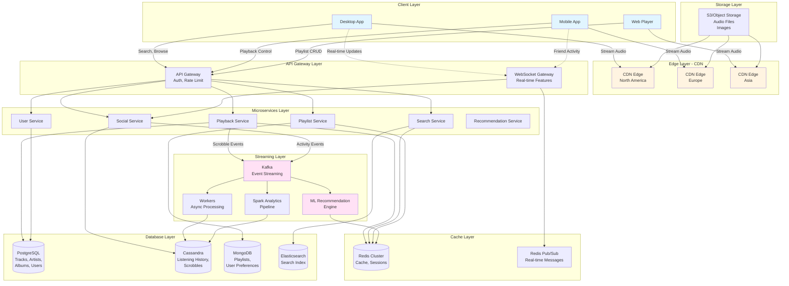

# Spotify System Design

## 1. Requirements (~5 minutes)

### Functional Requirements

- ✅ Users should be able to **search and browse** music (songs, albums, artists, playlists)
- ✅ Users should be able to **stream music** with offline download support
- ✅ Users should be able to **create and share playlists**
- ✅ Users should be able to **follow artists** and get personalized recommendations
- ✅ System should support **real-time lyrics** and podcast streaming
- ✅ Users should be able to **connect to multiple devices** (seamless handoff)

### Non-functional Requirements

- ✅ The system should prioritize **availability** over consistency (CAP - users should always stream)
- ✅ The system should scale to support **500M+ users** (100M concurrent)
- ✅ Audio streaming should have **instant playback** (< 200ms latency)
- ✅ The system should be **highly available** (99.99% uptime)
- ✅ The system should handle **320 kbps high-quality audio** streaming
- ✅ The system should provide **real-time social features** (collaborative playlists, friend activity)
- ✅ Search results should be **fast** (< 100ms P99)

### Capacity Estimation

**Assumptions:**

- Total Users: 500M
- Daily Active Users (DAU): 200M
- Concurrent listeners (peak): 100M
- Average song size: 3-5 MB (320 kbps)
- Average listening time: 2.5 hours/day (~50 songs)
- Catalog size: 100M tracks

**Storage:**

```
Audio Storage = 100M tracks × 5 MB × 3 quality levels = 1.5 PB
With CDN replication (×30 regions) = 45 PB
Metadata Storage = 100M tracks × 10 KB = 1 TB
User Data (playlists, history) = 500M users × 5 MB = 2.5 PB
```

**Bandwidth:**

```
Peak Concurrent Streams = 100M users
Average Bitrate = 320 kbps = 40 KB/s
Peak Bandwidth = 100M × 40 KB/s = 4 TB/s = 32 Tbps
```

**QPS:**

```
Metadata Requests = 200M DAU × 100 requests/day / 86400s = ~230K QPS
Audio Chunk Requests = 100M concurrent × 10 chunks/sec = 1B requests/sec (CDN)
Search Queries = 200M DAU × 10 searches/day / 86400s = ~23K QPS
```

---

## 2. Core Entities (~2 minutes)

### User

- `userId`, `email`, `displayName`, `subscriptionType` (Free/Premium), `country`

### Track

- `trackId`, `title`, `artistIds[]`, `albumId`, `duration`, `releaseDate`, `genres[]`, `isrc`

### Artist

- `artistId`, `name`, `bio`, `imageUrl`, `followerCount`, `verified`

### Album

- `albumId`, `title`, `artistId`, `releaseDate`, `trackIds[]`, `coverArtUrl`

### Playlist

- `playlistId`, `name`, `ownerId`, `trackIds[]`, `isPublic`, `isCollaborative`, `followerCount`

### ListeningHistory

- `userId`, `trackId`, `playedAt`, `duration`, `context` (playlist/album/radio)

### SocialActivity

- `userId`, `activityType` (listening/playlist_created), `trackId`, `timestamp`

---

## 3. API Interface (~5 minutes)

### Protocol Choice

- **REST** for metadata and user operations
- **WebSocket** for real-time features (friend activity, collaborative playlists)
- **HTTP/2** for audio streaming with range requests

### API Endpoints

#### Authentication

```http
POST /v1/auth/login
{ "email": "user@example.com", "password": "hash" }
Response: { "accessToken": "jwt", "refreshToken": "refresh_jwt" }
```

#### Search & Browse

```http
GET /v1/search?q=bohemian&type=track,artist&limit=20
Response: {
  "tracks": [Track],
  "artists": [Artist],
  "albums": [Album]
}

GET /v1/browse/featured-playlists?country=US
GET /v1/browse/new-releases
GET /v1/browse/categories/{categoryId}/playlists
```

#### Playback

```http
GET /v1/tracks/{trackId}/stream?quality=high
Response: Binary audio stream (MP3/OGG/AAC)

POST /v1/me/player/play
{
  "context_uri": "spotify:playlist:xyz",
  "offset": { "position": 5 },
  "position_ms": 0
}

PUT /v1/me/player/pause
PUT /v1/me/player/next
PUT /v1/me/player/previous
GET /v1/me/player/currently-playing
```

#### Playlists

```http
GET /v1/playlists/{playlistId}
POST /v1/users/{userId}/playlists
{ "name": "My Playlist", "public": true }

POST /v1/playlists/{playlistId}/tracks
{ "uris": ["spotify:track:abc", "spotify:track:def"] }

DELETE /v1/playlists/{playlistId}/tracks
```

#### Social Features

```http
GET /v1/me/following?type=artist
PUT /v1/me/following?type=artist&ids=artistId1,artistId2

GET /v1/me/player/recently-played?limit=50
GET /v1/me/top/tracks?time_range=short_term

WebSocket: wss://realtime.spotify.com/social
Messages: { "type": "friend_activity", "data": {...} }
```

---

## 4. Data Flow (~5 minutes)

### Music Streaming Flow

1. **User Searches**: Client queries search service (Elasticsearch)
2. **Select Track**: User selects track, client fetches metadata from cache/DB
3. **Request Stream**: Client requests audio stream URL from API
4. **CDN Delivery**: Client streams audio chunks from nearest CDN edge
5. **Buffer Ahead**: Client buffers 30-60 seconds ahead for seamless playback
6. **Track Progress**: Client sends scrobbles (every 30s) to backend asynchronously
7. **Update Feed**: Background service updates user's listening history and social feed
8. **Generate Recommendations**: ML pipeline processes listening patterns

---

## 5. High Level Design (~10-15 minutes)

### Architecture Components

**Client Layer:**

- Desktop/Mobile/Web Apps with audio player
- Offline storage for downloaded tracks (Premium users)

**Edge Layer:**

- CDN (CloudFront/Fastly) - caches audio files globally
- Edge Servers - 200-300 PoPs worldwide

**API Layer:**

- API Gateway - authentication, rate limiting
- Load Balancer - distributes traffic
- Microservices:
  - **Playback Service** - stream management
  - **Search Service** - query processing
  - **Playlist Service** - CRUD operations
  - **Social Service** - friend activity, following
  - **User Service** - profiles, subscriptions

**Data Layer:**

- **PostgreSQL** - users, tracks, albums, artists (normalized)
- **Cassandra** - listening history, scrobbles (time-series)
- **MongoDB** - playlists (flexible schema, nested arrays)
- **Redis** - caching, session management, real-time features
- **Elasticsearch** - full-text search index
- **S3/Object Storage** - audio files, images

**Processing Layer:**

- **Kafka** - event streaming (scrobbles, social events)
- **Recommendation Engine** - ML model (collaborative filtering)
- **Analytics Pipeline** - Spark jobs for insights
- **Background Workers** - async processing

**Real-time Layer:**

- **WebSocket Servers** - friend activity, collaborative editing
- **Redis Pub/Sub** - message broadcasting

---

## 6. Architecture Diagram



---

## 7. Deep Dives (~10 minutes)

### 7.1 Audio Streaming Architecture

**Key Difference from Video**: Audio files are smaller (3-5 MB vs 1 GB), so we can:

- Stream entire file vs chunked delivery
- Support offline downloads easily
- Cache more aggressively

#### Audio Formats & Quality Levels

| Quality  | Bitrate   | Format     | Use Case                |
| -------- | --------- | ---------- | ----------------------- |
| Low      | 96 kbps   | OGG Vorbis | Mobile data saver       |
| Normal   | 160 kbps  | OGG Vorbis | Free tier, default      |
| High     | 320 kbps  | OGG Vorbis | Premium users           |
| Lossless | 1411 kbps | FLAC       | Audiophiles (HiFi tier) |

#### Streaming Protocol

```http
GET /v1/tracks/{trackId}/stream?quality=high
Range: bytes=0-1048575

Response:
HTTP/1.1 206 Partial Content
Content-Range: bytes 0-1048575/4500000
Content-Type: audio/ogg
Accept-Ranges: bytes

[Binary audio data]
```

**Client Logic:**

- Request file in 1MB chunks
- Buffer 30-60 seconds ahead
- Prefetch next 2-3 tracks in queue
- Adjust quality based on network speed

---

### 7.2 Search System (Elasticsearch)

**Challenge**: Search across 100M tracks, artists, albums with sub-100ms latency

#### Index Structure

```json
{
  "tracks": {
    "properties": {
      "title": { "type": "text", "analyzer": "standard", "boost": 2.0 },
      "artist_name": { "type": "text", "boost": 1.5 },
      "album_name": { "type": "text" },
      "lyrics": { "type": "text", "analyzer": "english" },
      "genres": { "type": "keyword" },
      "popularity": { "type": "integer" },
      "release_date": { "type": "date" }
    }
  }
}
```

#### Query Strategy

```javascript
// Multi-field search with boosting
GET /tracks/_search
{
  "query": {
    "multi_match": {
      "query": "bohemian rhapsody",
      "fields": ["title^3", "artist_name^2", "album_name"],
      "type": "best_fields",
      "fuzziness": "AUTO"
    }
  },
  "sort": [
    { "_score": "desc" },
    { "popularity": "desc" }
  ]
}
```

**Optimization:**

- Index sharding: 50 shards × 3 replicas
- Search across shards in parallel
- Cache top 10K queries (60% hit rate)
- Autocomplete with prefix queries

---

### 7.3 Playlist Management (MongoDB)

**Why MongoDB?**

- Flexible schema for nested arrays
- Fast array operations (add/remove tracks)
- Horizontal scaling with sharding

#### Document Structure

```javascript
{
  _id: "playlist-123",
  name: "Chill Vibes",
  owner_id: "user-456",
  is_public: true,
  is_collaborative: false,
  tracks: [
    {
      track_id: "track-789",
      added_by: "user-456",
      added_at: ISODate("2025-01-15T10:30:00Z")
    },
    // ... up to 10,000 tracks
  ],
  follower_count: 15420,
  image_url: "https://cdn.spotify.com/...",
  created_at: ISODate("2024-06-01T00:00:00Z"),
  updated_at: ISODate("2025-10-05T08:15:00Z")
}
```

#### Operations

```javascript
// Add tracks (atomic operation)
db.playlists.updateOne(
  { _id: "playlist-123" },
  {
    $push: {
      tracks: {
        $each: [{ track_id: "new-track", added_by: "user-456", added_at: new Date() }],
        $position: 0  // Add to beginning
      }
    },
    $set: { updated_at: new Date() }
  }
)

// Remove tracks
db.playlists.updateOne(
  { _id: "playlist-123" },
  { $pull: { tracks: { track_id: "track-789" } } }
)

// Collaborative playlists (optimistic locking)
db.playlists.updateOne(
  { _id: "playlist-123", version: 5 },
  { $push: { tracks: {...} }, $inc: { version: 1 } }
)
```

**Sharding Strategy:**

- Shard key: `owner_id` (co-locate user's playlists)
- Hot shard problem: Popular public playlists cached in Redis

---

### 7.4 Listening History & Scrobbling (Cassandra)

**Why Cassandra?**

- Write-heavy: 100M concurrent users × 1 scrobble/30s = 3.3M writes/sec
- Time-series data (query by user + time range)
- Eventual consistency acceptable

#### Table Design

```sql
CREATE TABLE listening_history (
    user_id UUID,
    played_at TIMESTAMP,
    track_id UUID,
    duration_ms INT,
    context TEXT,  -- "playlist:xyz" or "album:abc"
    shuffle BOOLEAN,
    repeat_mode TEXT,
    PRIMARY KEY ((user_id), played_at)
) WITH CLUSTERING ORDER BY (played_at DESC)
AND compaction = {'class': 'TimeWindowCompactionStrategy'};

-- Secondary index for analytics
CREATE TABLE tracks_by_popularity (
    date DATE,
    track_id UUID,
    play_count COUNTER,
    PRIMARY KEY ((date), track_id)
);
```

#### Scrobble Processing

```
Client --(every 30s)--> Kafka --> Batch Worker --> Cassandra
                                     |
                                     +--> Update Analytics (daily charts)
                                     +--> ML Pipeline (recommendations)
```

**Batching Strategy:**

- Buffer 1000 scrobbles or 10 seconds
- Batch insert to Cassandra
- Reduces write amplification

---

### 7.5 Caching Strategy (Multi-Tier)

#### Layer 1: CDN Cache (Audio Files)

- 95% hit rate for popular tracks (top 1M tracks)
- TTL: 90 days
- Cache warming: Push new releases to all edges

#### Layer 2: Redis Cache (Hot Metadata)

```python
# Track metadata caching
CACHE_TTL = {
    "track:metadata": 3600,      # 1 hour
    "playlist:tracks": 300,       # 5 minutes
    "user:recent": 600,           # 10 minutes
    "search:results": 1800,       # 30 minutes
    "daily:top:tracks": 86400     # 24 hours
}

# Cache-aside pattern
def get_track(track_id):
    cache_key = f"track:{track_id}"
    cached = redis.get(cache_key)

    if cached:
        return json.loads(cached)

    track = db.query(f"SELECT * FROM tracks WHERE id = {track_id}")
    redis.setex(cache_key, CACHE_TTL["track:metadata"], json.dumps(track))
    return track
```

#### Layer 3: Application-Level Cache

```java
@Cacheable(value = "popularTracks", key = "#country")
public List<Track> getPopularTracks(String country) {
    return trackRepository.findTop50ByCountry(country);
}
```

---

### 7.6 Real-Time Social Features (WebSocket)

**Use Cases:**

- Friend activity feed (who's listening to what)
- Collaborative playlist editing
- Live lyrics synchronization

#### WebSocket Architecture

```
Client <--WebSocket--> Gateway <--Redis Pub/Sub--> Services
                          |
                     Load Balanced
                    (100K connections/server)
```

#### Message Flow

```javascript
// Client subscribes to friend activity
ws.send({
  type: 'subscribe',
  channel: 'user:123:friends_activity',
});

// Backend publishes when friend plays song
redis.publish('user:123:friends_activity', {
  friend_id: 'user-456',
  track_id: 'track-789',
  artist_name: 'Queen',
  track_name: 'Bohemian Rhapsody',
  timestamp: 1696512000,
});

// Client receives real-time update
ws.onmessage = event => {
  // Update friend activity UI
};
```

**Scaling WebSockets:**

- Sticky sessions (user always connects to same server)
- Redis Pub/Sub for cross-server messaging
- Auto-scale based on connection count

---

### 7.7 Recommendation Engine

**Approach**: Collaborative Filtering + Audio Features + Contextual Data

#### Data Sources

1. **Listening History** (Cassandra)
2. **Audio Features** (Spotify's Audio Analysis API)
   - Tempo, key, energy, danceability, valence
3. **Contextual Data**
   - Time of day, day of week
   - Listening device (mobile, desktop, car)
   - Current playlist/album context

#### Pipeline

```
Kafka (Scrobbles) --> Feature Engineering --> ML Model --> Redis Cache
                                                  |
                                            TensorFlow/PyTorch
                                       (Matrix Factorization + DNNs)
```

#### Serving Layer

```python
# Pre-computed recommendations (batch job runs every 6 hours)
def get_recommendations(user_id):
    cache_key = f"rec:daily:{user_id}"
    cached = redis.lrange(cache_key, 0, 49)  # Top 50 tracks

    if cached:
        return [get_track(tid) for tid in cached]

    # Fallback to genre-based or popular tracks
    return get_popular_by_user_genres(user_id)

# Real-time recommendations (session-based)
def get_radio_next_track(user_id, current_track_id):
    # Use current track's audio features + user preferences
    # Return similar tracks with some randomness
    pass
```

---

### 7.8 Multi-Device Synchronization (Spotify Connect)

**Feature**: Start playing on phone, seamlessly continue on laptop

#### State Management

```javascript
// User's playback state stored in Redis
{
  "user:123:playback_state": {
    "track_id": "track-789",
    "position_ms": 45000,
    "is_playing": true,
    "device_id": "desktop-abc",
    "volume": 80,
    "shuffle": false,
    "repeat_mode": "context",
    "updated_at": 1696512000
  }
}
```

#### Device Handoff Flow

1. **Device A** (phone) playing track → pushes state to Redis every 5s
2. **User switches to Device B** (laptop)
3. **Device B** fetches latest state from Redis
4. **Device B** resumes playback from `position_ms`
5. **Device A** receives notification to pause via WebSocket

```javascript
// WebSocket message to old device
{
  "type": "transfer_playback",
  "new_device_id": "laptop-xyz",
  "action": "pause"
}
```

---

### 7.9 Handling Peak Traffic & Rate Limiting

#### Auto-Scaling Strategy

```yaml
# Kubernetes HPA
min_replicas: 100
max_replicas: 2000
target_cpu_utilization: 70%
# Peak hours: 6 PM - 11 PM (3x traffic)
# Scale up 30 minutes before peak
```

#### Rate Limiting (Redis Token Bucket)

```python
def is_rate_limited(user_id, action):
    key = f"ratelimit:{action}:{user_id}"

    # Token bucket algorithm
    current = redis.get(key) or 0

    if current >= MAX_REQUESTS_PER_MINUTE[action]:
        return True

    redis.incr(key)
    redis.expire(key, 60)  # 1 minute window
    return False

# Limits
MAX_REQUESTS_PER_MINUTE = {
    "search": 30,
    "playlist_modify": 20,
    "track_play": 100  # Higher for playback
}
```

---

### 7.10 Offline Mode (Premium Feature)

**Challenge**: Allow users to download songs for offline playback

#### Download Flow

1. User marks playlist for offline
2. Client downloads tracks in background (when on WiFi)
3. Tracks encrypted with AES-256 + user-specific key
4. Stored in local database (SQLite)

#### DRM & Licensing

```
Encrypted Track = AES_256(audio_data, user_key)
user_key = HMAC(user_id + device_id, master_secret)

Playback:
1. Check if user subscription is active (heartbeat every 30 days)
2. Decrypt track with user_key
3. Play decrypted audio
4. If subscription expires, delete all offline tracks
```

**Storage Limits:**

- Free tier: 0 downloads
- Premium: 10,000 tracks across 5 devices

---

### 7.11 Monitoring & Observability

#### Key Metrics

**Playback Quality:**

- **Time to First Byte (TTFB)**: < 200ms
- **Buffering Ratio**: < 1% of playback time
- **Failed Streams**: < 0.1%
- **Audio Quality Distribution** (96/160/320 kbps)

**Application:**

- API latency (P50, P95, P99)
- Search latency (< 100ms P99)
- Error rates (4xx, 5xx)

**Infrastructure:**

- CDN hit ratio (target: > 95%)
- Database query latency
- Kafka lag (< 10s)
- Redis hit ratio (> 90%)

#### Alerting Examples

```yaml
Alert: High Buffering Rate
Condition: buffering_ratio > 2% for 5 minutes in any region
Action: Check CDN health, scale edge servers

Alert: Search Latency Spike
Condition: P99 search latency > 200ms
Action: Check Elasticsearch cluster, increase cache TTL

Alert: Scrobble Lag
Condition: Kafka consumer lag > 60 seconds
Action: Scale consumer groups, check Cassandra write performance
```

---

## Summary

### Key Design Decisions

1. **CDN-Heavy Architecture**: 95% of audio traffic served from edge
2. **Polyglot Persistence**:
   - PostgreSQL (normalized metadata)
   - Cassandra (time-series, high writes)
   - MongoDB (flexible playlists)
   - Elasticsearch (full-text search)
3. **Real-Time Features**: WebSocket + Redis Pub/Sub for social features
4. **Aggressive Caching**: Multi-tier (CDN → Redis → DB)
5. **Async Processing**: Kafka for scrobbles, non-blocking analytics
6. **Horizontal Scaling**: Stateless microservices, auto-scaling
7. **Offline Support**: Encrypted local storage for Premium users

### Scalability Achieved

- ✅ 500M+ users, 100M concurrent streams
- ✅ < 200ms playback latency
- ✅ 99.99% availability
- ✅ Sub-100ms search results
- ✅ Real-time social features

---

## Trade-offs & Considerations

| Decision                     | Pro                                    | Con                                            |
| ---------------------------- | -------------------------------------- | ---------------------------------------------- |
| CDN Push Strategy            | Lower latency, predictable performance | Higher storage costs (~45 PB)                  |
| MongoDB for Playlists        | Flexible schema, fast array ops        | Complex queries limited, need indexing         |
| Cassandra for History        | Massive write throughput               | Eventual consistency, complex query patterns   |
| WebSocket for Social         | Real-time updates, low latency         | Connection management complexity, server costs |
| Pre-computed Recommendations | Fast serving                           | Stale data (6-hour refresh cycle)              |
| Offline DRM                  | Enables offline playback               | Complex licensing, key management              |

---

## Key Differences from Netflix

| Aspect           | Spotify                                          | Netflix                     |
| ---------------- | ------------------------------------------------ | --------------------------- |
| File Size        | 3-5 MB (songs)                                   | 1-5 GB (movies)             |
| Streaming        | Entire file or chunked                           | Always chunked (HLS/DASH)   |
| Offline          | Common (Premium feature)                         | Rare (limited catalog)      |
| Social Features  | Heavy (friend activity, collaborative playlists) | Light (shared profiles)     |
| Content Creation | Artist uploads, licensing                        | Original + licensed content |
| Recommendation   | Track-level, session-based                       | Title-level, slower refresh |
| Real-time Sync   | Multi-device handoff critical                    | Less critical               |

---

## Future Enhancements

1. **AI DJ**: Personalized radio with AI-generated commentary
2. **Spatial Audio**: Immersive 3D audio experience
3. **Live Concerts**: Exclusive live streaming events
4. **Social Listening Rooms**: Real-time listening parties
5. **Artist Direct Uploads**: SoundCloud-style creator tools
6. **Blockchain NFTs**: Digital collectibles for super fans
7. **Voice Commands**: Hands-free playback control
8. **Mood Detection**: Auto-adjust music based on user sentiment
