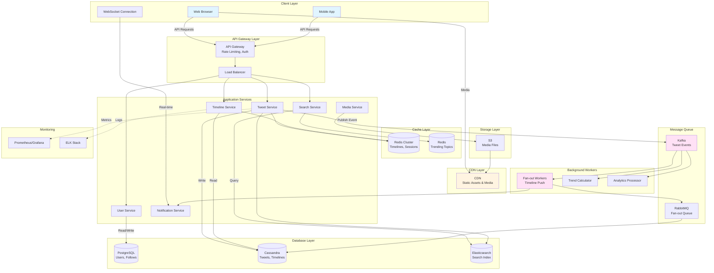

# Twitter System Design

## 1. Requirements (~5 minutes)

### Functional Requirements

- ✅ Users should be able to **post tweets** (text, images, videos - max 280 characters)
- ✅ Users should be able to **follow/unfollow** other users
- ✅ Users should be able to **view timeline** (home feed with tweets from followed users)
- ✅ Users should be able to **like, retweet, and reply** to tweets
- ✅ Users should be able to **search tweets** and trending topics
- ✅ Users should be able to **receive real-time notifications**

### Non-functional Requirements

- ✅ The system should prioritize **availability** over consistency (eventual consistency is acceptable)
- ✅ The system should scale to support **500M+ users**, **200M DAU**
- ✅ Timeline should load in **< 500ms** (P95)
- ✅ Tweet posting should be **fast** (< 200ms acknowledgment)
- ✅ The system should be **highly available** (99.99% uptime)
- ✅ The system should handle **viral tweets** (millions of likes/retweets)
- ✅ The system should support **real-time notifications** (push/pull)
- ✅ The system should handle **read-heavy workload** (read:write ratio = 100:1)

### Capacity Estimation

**Assumptions:**
- Total Users: 500M
- Daily Active Users (DAU): 200M
- Average tweets per user per day: 2
- Average timeline views per user: 20
- Average tweet size: 300 bytes (text + metadata)
- Average followers per user: 200
- Media tweets: 20% (images/videos)

**Daily Metrics:**
```
Tweets per day = 200M × 2 = 400M tweets/day
Tweets per second = 400M / 86400 = ~4600 TPS

Timeline reads per day = 200M × 20 = 4B reads/day
Timeline QPS = 4B / 86400 = ~46K QPS

Read:Write Ratio = 4B / 400M = 10:1 (actually higher during viral events)
```

**Storage:**
```
Text tweets = 400M × 300 bytes = 120 GB/day
With metadata & index = 120 GB × 2 = 240 GB/day
Annual storage = 240 GB × 365 = ~88 TB/year

Media storage (20% of tweets):
80M media tweets/day × 2 MB avg = 160 TB/day
```

**Bandwidth:**
```
Upload: 4600 TPS × 300 bytes = 1.4 MB/s (text)
Upload: 920 media/sec × 2 MB = 1.8 GB/s (media)

Download: 46K QPS × 10 tweets × 300 bytes = 138 MB/s
```

---

## 2. Core Entities (~2 minutes)

### User
- `userId`, `username`, `email`, `displayName`, `bio`, `profilePicUrl`, `createdAt`, `verified`

### Tweet
- `tweetId`, `userId`, `content`, `mediaUrls[]`, `createdAt`, `likeCount`, `retweetCount`, `replyCount`

### Follow
- `followerId`, `followeeId`, `createdAt`

### Timeline
- `userId`, `tweetId`, `timestamp`, `score` (for ranking)

### Like
- `userId`, `tweetId`, `createdAt`

### Retweet
- `userId`, `originalTweetId`, `createdAt`, `comment` (quote tweet)

### Notification
- `notificationId`, `userId`, `type`, `actorId`, `tweetId`, `createdAt`, `read`

---

## 3. API Interface (~5 minutes)

### Protocol Choice
- **REST** for CRUD operations
- **WebSocket** for real-time notifications
- **GraphQL** (optional) for flexible data fetching

### API Endpoints

#### Authentication

```http
POST /v1/auth/login
Content-Type: application/json

{
  "username": "john_doe",
  "password": "securepass"
}

Response: {
  "authToken": "jwt_token_here",
  "userId": "user-123"
}
```

```http
POST /v1/auth/register
Content-Type: application/json

{
  "username": "john_doe",
  "email": "john@example.com",
  "password": "securepass"
}

Response: { "userId": "user-123" }
```

#### Tweet Operations

```http
POST /v1/tweets
Authorization: Bearer <token>
Content-Type: application/json

{
  "content": "Hello World!",
  "mediaUrls": ["https://cdn.twitter.com/img123.jpg"]
}

Response: {
  "tweetId": "tweet-123",
  "createdAt": "2025-10-05T10:00:00Z"
}
```

```http
GET /v1/tweets/{tweetId}

Response: {
  "tweet": {
    "tweetId": "tweet-123",
    "userId": "user-456",
    "username": "john_doe",
    "content": "Hello World!",
    "likeCount": 42,
    "retweetCount": 10,
    "createdAt": "2025-10-05T10:00:00Z"
  }
}
```

```http
DELETE /v1/tweets/{tweetId}
Authorization: Bearer <token>

Response: { "success": true }
```

#### Timeline (Home Feed)

```http
GET /v1/timeline/home?cursor=tweet-100&limit=20
Authorization: Bearer <token>

Response: {
  "tweets": [Tweet],
  "nextCursor": "tweet-80"
}
```

```http
GET /v1/timeline/user/{userId}?cursor=tweet-100&limit=20

Response: {
  "tweets": [Tweet],
  "nextCursor": "tweet-80"
}
```

#### Social Interactions

```http
POST /v1/tweets/{tweetId}/like
Authorization: Bearer <token>

Response: { "success": true, "newLikeCount": 43 }
```

```http
DELETE /v1/tweets/{tweetId}/like
Authorization: Bearer <token>

Response: { "success": true, "newLikeCount": 42 }
```

```http
POST /v1/tweets/{tweetId}/retweet
Authorization: Bearer <token>
Content-Type: application/json

{
  "comment": "Great insight!" // optional for quote tweet
}

Response: {
  "retweetId": "retweet-789",
  "success": true
}
```

```http
POST /v1/tweets/{tweetId}/reply
Authorization: Bearer <token>
Content-Type: application/json

{
  "content": "I agree!"
}

Response: {
  "replyTweetId": "tweet-456"
}
```

#### Follow Operations

```http
POST /v1/users/{userId}/follow
Authorization: Bearer <token>

Response: { "success": true }
```

```http
DELETE /v1/users/{userId}/follow
Authorization: Bearer <token>

Response: { "success": true }
```

```http
GET /v1/users/{userId}/followers?cursor=user-100&limit=50

Response: {
  "users": [User],
  "nextCursor": "user-50"
}
```

```http
GET /v1/users/{userId}/following?cursor=user-100&limit=50

Response: {
  "users": [User],
  "nextCursor": "user-50"
}
```

#### Search & Trends

```http
GET /v1/search/tweets?query=system+design&limit=20

Response: {
  "tweets": [Tweet],
  "count": 1523
}
```

```http
GET /v1/trends?location=US

Response: {
  "trends": [
    { "topic": "#WorldCup", "tweetCount": 2500000 },
    { "topic": "AI", "tweetCount": 1200000 }
  ]
}
```

#### Notifications

```http
GET /v1/notifications?cursor=notif-100&limit=20
Authorization: Bearer <token>

Response: {
  "notifications": [Notification],
  "nextCursor": "notif-80",
  "unreadCount": 5
}
```

```http
PUT /v1/notifications/{notificationId}/read
Authorization: Bearer <token>

Response: { "success": true }
```

---

## 4. Data Flow (~5 minutes)

### Tweet Post Flow

1. **User Posts Tweet**: Client sends POST request with content
2. **Validate & Store**: App server validates (length, content policy) and stores in database
3. **Generate Tweet ID**: Snowflake ID generator creates unique ID
4. **Fan-out Process**: Background worker pushes tweet to followers' timelines
5. **Cache Update**: Update Redis cache for user's profile timeline
6. **Index for Search**: Push to Elasticsearch for searchability
7. **Notify Mentions**: If tweet mentions users, create notifications

### Timeline Generation Flow

1. **User Requests Timeline**: Client sends GET request
2. **Check Cache**: Look up pre-computed timeline in Redis
3. **If Cache Hit**: Return cached tweets
4. **If Cache Miss**:
   - Fetch following list
   - Fetch recent tweets from each followed user
   - Merge and rank tweets
   - Cache result
5. **Fetch Metadata**: Hydrate tweets with like/retweet counts
6. **Return to Client**: Send paginated response

---

## 5. High Level Design (~10-15 minutes)

### Architecture Components

**Client Layer:**
- Web App (React)
- Mobile Apps (iOS/Android)
- Real-time WebSocket connection

**API Layer:**
- API Gateway - routing, rate limiting, authentication
- Load Balancer - distributes traffic across app servers
- Application Servers - business logic (Spring Boot microservices)

**Service Layer (Microservices):**
- **Tweet Service** - CRUD operations for tweets
- **Timeline Service** - generates and serves timelines
- **User Service** - user profiles, follow/unfollow
- **Notification Service** - push notifications
- **Search Service** - full-text search
- **Media Service** - handles image/video uploads

**Data Layer:**
- **PostgreSQL** - users, follows (relational data)
- **Cassandra** - tweets, timelines (high write throughput)
- **Redis** - cache (timelines, user sessions, trending topics)
- **Elasticsearch** - search index
- **S3/CDN** - media storage

**Messaging & Streaming:**
- **Kafka** - event streaming (tweet events, notifications)
- **RabbitMQ/SQS** - task queues (fan-out workers)

**Background Workers:**
- **Fan-out Service** - pushes tweets to followers' timelines
- **Trend Service** - computes trending topics
- **Analytics Service** - processes engagement metrics

---

## 6. Architecture Diagram



---

## 7. Data Models

### PostgreSQL - User & Follow Graph

```sql
users:
  id (PK),
  username (UNIQUE),
  email (UNIQUE),
  password_hash,
  display_name,
  bio,
  profile_pic_url,
  verified BOOLEAN,
  follower_count,
  following_count,
  created_at,
  updated_at

follows:
  follower_id (PK, FK -> users.id),
  followee_id (PK, FK -> users.id),
  created_at,
  PRIMARY KEY (follower_id, followee_id)
  INDEX idx_followee (followee_id)
  INDEX idx_follower (follower_id)
```

### Cassandra - Tweets & Timelines

```sql
tweets:
  tweet_id (PK) UUID,
  user_id UUID,
  content TEXT,
  media_urls LIST<TEXT>,
  like_count COUNTER,
  retweet_count COUNTER,
  reply_count COUNTER,
  created_at TIMESTAMP,
  PRIMARY KEY (tweet_id)

user_timeline:
  user_id UUID (Partition Key),
  tweet_id UUID (Clustering Key),
  created_at TIMESTAMP (Clustering Key),
  PRIMARY KEY ((user_id), created_at, tweet_id)
  WITH CLUSTERING ORDER BY (created_at DESC, tweet_id DESC)

home_timeline:
  user_id UUID (Partition Key),
  tweet_id UUID (Clustering Key),
  tweet_author_id UUID,
  created_at TIMESTAMP (Clustering Key),
  score DOUBLE, // for ranking
  PRIMARY KEY ((user_id), created_at, tweet_id)
  WITH CLUSTERING ORDER BY (created_at DESC)

likes:
  user_id UUID (Partition Key),
  tweet_id UUID (Clustering Key),
  created_at TIMESTAMP,
  PRIMARY KEY ((user_id), tweet_id)

retweets:
  user_id UUID (Partition Key),
  original_tweet_id UUID (Clustering Key),
  retweet_id UUID,
  comment TEXT,
  created_at TIMESTAMP,
  PRIMARY KEY ((user_id), original_tweet_id)
```

### Redis Cache Structures

```
# User timeline cache (List)
user:timeline:{userId} -> [tweetId1, tweetId2, ...]
TTL: 15 minutes

# Home timeline cache (Sorted Set)
home:timeline:{userId} -> {tweetId: score}
TTL: 5 minutes

# Tweet metadata cache (Hash)
tweet:{tweetId} -> { content, likeCount, retweetCount, ... }
TTL: 1 hour

# Trending topics (Sorted Set)
trending:global -> {topic: score}
TTL: 5 minutes

# User session
session:{token} -> { userId, username, ... }
TTL: 24 hours

# Following list cache
following:{userId} -> [userId1, userId2, ...]
TTL: 1 hour
```

### Elasticsearch - Search Index

```json
{
  "mappings": {
    "properties": {
      "tweet_id": { "type": "keyword" },
      "user_id": { "type": "keyword" },
      "username": { "type": "keyword" },
      "content": {
        "type": "text",
        "analyzer": "standard",
        "fields": {
          "keyword": { "type": "keyword" }
        }
      },
      "hashtags": { "type": "keyword" },
      "mentions": { "type": "keyword" },
      "created_at": { "type": "date" },
      "like_count": { "type": "integer" },
      "retweet_count": { "type": "integer" },
      "language": { "type": "keyword" }
    }
  }
}
```

---

## 8. Deep Dives (~10 minutes)

### 8.1 Timeline Generation (Fan-out Strategies)

**Problem**: When a user posts a tweet, how do we update followers' timelines efficiently?

#### Fan-out on Write (Push Model)

**How it works:**
- When user posts tweet, immediately push to all followers' timelines
- Pre-compute timelines and store in Redis/Cassandra
- Timeline reads are fast (just fetch from cache)

**Pros:**
- Fast timeline reads (pre-computed)
- Simple timeline service

**Cons:**
- Slow writes for users with many followers (celebrities)
- Wasted work if followers don't view timeline
- High write amplification

**Implementation:**

```java
@Service
public class FanoutService {

    @Async
    public void fanoutTweet(Tweet tweet) {
        String userId = tweet.getUserId();

        // Get all followers
        List<String> followers = followRepository.getFollowers(userId);

        // Push to message queue in batches
        Lists.partition(followers, 1000).forEach(batch -> {
            FanoutTask task = FanoutTask.builder()
                .tweetId(tweet.getTweetId())
                .followerIds(batch)
                .build();

            kafkaTemplate.send("fanout-tasks", task);
        });
    }
}

@KafkaListener(topics = "fanout-tasks")
public void processFanout(FanoutTask task) {
    // Write to each follower's home timeline
    task.getFollowerIds().forEach(followerId -> {
        timelineRepository.addToHomeTimeline(
            followerId,
            task.getTweetId()
        );

        // Update Redis cache
        redisTemplate.opsForZSet().add(
            "home:timeline:" + followerId,
            task.getTweetId(),
            System.currentTimeMillis()
        );
    });
}
```

#### Fan-out on Read (Pull Model)

**How it works:**
- Don't pre-compute timelines
- When user requests timeline, fetch tweets from all followed users
- Merge and sort on-the-fly

**Pros:**
- Fast writes
- No wasted work
- Always fresh data

**Cons:**
- Slow reads (must query many users)
- Complex merge logic
- High read load

**Implementation:**

```java
@Service
public class TimelineService {

    public List<Tweet> getHomeTimeline(String userId, int limit) {
        // Get users this user follows
        List<String> following = followRepository.getFollowing(userId);

        // Fetch recent tweets from each followed user (parallel)
        List<CompletableFuture<List<Tweet>>> futures = following.stream()
            .map(followeeId -> CompletableFuture.supplyAsync(() ->
                tweetRepository.getUserRecentTweets(followeeId, 10)
            ))
            .collect(Collectors.toList());

        // Wait for all and merge
        List<Tweet> allTweets = futures.stream()
            .map(CompletableFuture::join)
            .flatMap(List::stream)
            .sorted(Comparator.comparing(Tweet::getCreatedAt).reversed())
            .limit(limit)
            .collect(Collectors.toList());

        return allTweets;
    }
}
```

#### Hybrid Approach (Twitter's Solution)

**Strategy:**
- **Regular users** (< 10K followers): Fan-out on write
- **Celebrities** (> 10K followers): Fan-out on read
- Mix both results when serving timeline

**Implementation:**

```java
@Service
public class HybridTimelineService {

    public List<Tweet> getHomeTimeline(String userId, int limit) {
        // Part 1: Get pre-computed timeline (from regular users)
        List<Tweet> preComputedTweets = cassandraTemplate
            .select("SELECT * FROM home_timeline WHERE user_id = ? LIMIT ?",
                userId, limit);

        // Part 2: Get celebrity tweets (fetch on-demand)
        List<String> celebritiesFollowed = followRepository
            .getCelebritiesFollowed(userId);

        List<Tweet> celebrityTweets = celebritiesFollowed.stream()
            .flatMap(celeb ->
                tweetRepository.getUserRecentTweets(celeb, 10).stream()
            )
            .collect(Collectors.toList());

        // Merge and sort
        List<Tweet> merged = Stream.concat(
            preComputedTweets.stream(),
            celebrityTweets.stream()
        )
        .sorted(Comparator.comparing(Tweet::getCreatedAt).reversed())
        .distinct()
        .limit(limit)
        .collect(Collectors.toList());

        return merged;
    }
}
```

---

### 8.2 Caching Strategy

#### Multi-Level Cache

**L1 - Application Cache (In-Memory):**
```java
@Service
public class TweetService {
    private final LoadingCache<String, Tweet> tweetCache = Caffeine.newBuilder()
        .maximumSize(10_000)
        .expireAfterWrite(5, TimeUnit.MINUTES)
        .build(tweetId -> tweetRepository.findById(tweetId));

    public Tweet getTweet(String tweetId) {
        return tweetCache.get(tweetId);
    }
}
```

**L2 - Redis Cache (Distributed):**
```java
@Cacheable(value = "tweets", key = "#tweetId")
public Tweet getTweetById(String tweetId) {
    return cassandraTemplate.selectOne(
        "SELECT * FROM tweets WHERE tweet_id = ?",
        tweetId
    );
}

@Cacheable(value = "home-timeline", key = "#userId")
public List<Tweet> getHomeTimeline(String userId) {
    return timelineService.generateTimeline(userId);
}
```

**Cache Warming for Trending Tweets:**
```java
@Scheduled(fixedRate = 60000) // Every minute
public void warmTrendingCache() {
    List<String> trendingTweetIds = trendService.getTrendingTweetIds();

    trendingTweetIds.forEach(tweetId -> {
        Tweet tweet = tweetRepository.findById(tweetId);
        redisTemplate.opsForValue().set(
            "tweet:" + tweetId,
            tweet,
            1,
            TimeUnit.HOURS
        );
    });
}
```

#### Cache Invalidation

```java
@Service
public class TweetService {

    @CacheEvict(value = "tweets", key = "#tweetId")
    public void deleteTweet(String tweetId) {
        tweetRepository.delete(tweetId);
    }

    // When tweet is liked, update counter cache
    public void likeTweet(String userId, String tweetId) {
        // Increment in database
        cassandraTemplate.execute(
            "UPDATE tweets SET like_count = like_count + 1 WHERE tweet_id = ?",
            tweetId
        );

        // Invalidate cache to fetch fresh data
        cacheManager.getCache("tweets").evict(tweetId);

        // Or update cache directly
        redisTemplate.opsForHash().increment(
            "tweet:" + tweetId,
            "likeCount",
            1
        );
    }
}
```

---

### 8.3 Database Scaling

#### PostgreSQL (User Service)

**Read Replicas:**
```java
@Configuration
public class DataSourceConfig {

    @Bean
    public DataSource routingDataSource() {
        Map<Object, Object> targetDataSources = new HashMap<>();
        targetDataSources.put("master", masterDataSource());
        targetDataSources.put("replica1", replicaDataSource1());
        targetDataSources.put("replica2", replicaDataSource2());

        ReplicationRoutingDataSource routingDataSource =
            new ReplicationRoutingDataSource();
        routingDataSource.setTargetDataSources(targetDataSources);
        routingDataSource.setDefaultTargetDataSource(masterDataSource());

        return routingDataSource;
    }
}

@Transactional(readOnly = true)
public User getUserById(String userId) {
    // Automatically routes to read replica
    return userRepository.findById(userId);
}

@Transactional
public void createUser(User user) {
    // Routes to master
    userRepository.save(user);
}
```

**Indexing:**
```sql
-- Improve follow queries
CREATE INDEX idx_follows_follower ON follows(follower_id);
CREATE INDEX idx_follows_followee ON follows(followee_id);

-- Username search
CREATE INDEX idx_users_username ON users(username);
CREATE INDEX idx_users_email ON users(email);
```

#### Cassandra (Tweet Service)

**Partition Strategy:**
```sql
-- User timeline: Fast queries for all tweets by a user
CREATE TABLE user_timeline (
    user_id UUID,
    created_at TIMESTAMP,
    tweet_id UUID,
    PRIMARY KEY ((user_id), created_at, tweet_id)
) WITH CLUSTERING ORDER BY (created_at DESC);

-- Home timeline: Fast queries for user's feed
CREATE TABLE home_timeline (
    user_id UUID,
    created_at TIMESTAMP,
    tweet_id UUID,
    PRIMARY KEY ((user_id), created_at)
) WITH CLUSTERING ORDER BY (created_at DESC);
```

**Write Optimization:**
```java
@Service
public class TweetRepository {

    public void saveTweet(Tweet tweet) {
        // Batch writes for better performance
        BatchStatement batch = new BatchStatement();

        // Insert into tweets table
        batch.add(insertTweetStatement(tweet));

        // Insert into user_timeline table
        batch.add(insertUserTimelineStatement(tweet));

        // Execute batch
        cassandraTemplate.execute(batch);
    }
}
```

---

### 8.4 Handling Viral Tweets

**Problem**: A celebrity posts a tweet and gets 1M likes in 10 minutes

#### Counter Aggregation

**Challenge**: Cassandra counters become hotspot

**Solution**: Counter Sharding

```java
@Service
public class CounterService {
    private static final int NUM_SHARDS = 10;

    public void incrementLikeCount(String tweetId) {
        int shard = ThreadLocalRandom.current().nextInt(NUM_SHARDS);
        String key = String.format("likes:%s:shard:%d", tweetId, shard);

        redisTemplate.opsForValue().increment(key);

        // Async aggregate every 10 seconds
        asyncAggregateShards(tweetId);
    }

    public long getLikeCount(String tweetId) {
        long total = 0;
        for (int i = 0; i < NUM_SHARDS; i++) {
            String key = String.format("likes:%s:shard:%d", tweetId, i);
            Long count = redisTemplate.opsForValue().get(key);
            total += (count != null) ? count : 0;
        }
        return total;
    }

    @Async
    private void asyncAggregateShards(String tweetId) {
        long totalLikes = getLikeCount(tweetId);

        // Update Cassandra periodically (not on every like)
        cassandraTemplate.execute(
            "UPDATE tweets SET like_count = ? WHERE tweet_id = ?",
            totalLikes, tweetId
        );
    }
}
```

#### Rate Limiting

```java
@Service
public class RateLimiterService {

    @RateLimiter(
        name = "tweet-post",
        fallbackMethod = "rateLimitExceeded"
    )
    public Tweet postTweet(String userId, String content) {
        return tweetService.createTweet(userId, content);
    }

    public Tweet rateLimitExceeded(String userId, String content,
                                     RequestNotPermitted e) {
        throw new RateLimitException(
            "You can only post 100 tweets per hour"
        );
    }
}

// Configuration
// resilience4j.ratelimiter.instances.tweet-post.limit-for-period=100
// resilience4j.ratelimiter.instances.tweet-post.limit-refresh-period=1h
```

---

### 8.5 Search & Trending

#### Elasticsearch Integration

**Indexing Pipeline:**

```java
@Service
public class SearchIndexService {

    @KafkaListener(topics = "tweet-events")
    public void indexTweet(TweetEvent event) {
        Tweet tweet = event.getTweet();

        TweetDocument doc = TweetDocument.builder()
            .tweetId(tweet.getTweetId())
            .userId(tweet.getUserId())
            .content(tweet.getContent())
            .hashtags(extractHashtags(tweet.getContent()))
            .mentions(extractMentions(tweet.getContent()))
            .createdAt(tweet.getCreatedAt())
            .build();

        elasticsearchTemplate.save(doc);
    }

    private List<String> extractHashtags(String content) {
        return Pattern.compile("#(\\w+)")
            .matcher(content)
            .results()
            .map(mr -> mr.group(1))
            .collect(Collectors.toList());
    }
}
```

**Search Query:**

```java
@Service
public class SearchService {

    public SearchResults searchTweets(String query, SearchFilters filters) {
        BoolQueryBuilder boolQuery = QueryBuilders.boolQuery();

        // Text search
        if (query != null && !query.isEmpty()) {
            boolQuery.must(QueryBuilders
                .multiMatchQuery(query, "content", "hashtags"));
        }

        // Filters
        if (filters.getFromUserId() != null) {
            boolQuery.filter(QueryBuilders
                .termQuery("user_id", filters.getFromUserId()));
        }

        if (filters.getStartDate() != null) {
            boolQuery.filter(QueryBuilders
                .rangeQuery("created_at")
                .gte(filters.getStartDate()));
        }

        // Sort by relevance or recency
        SearchQuery searchQuery = new NativeSearchQueryBuilder()
            .withQuery(boolQuery)
            .withSort(SortBuilders.fieldSort("created_at").order(SortOrder.DESC))
            .withPageable(PageRequest.of(0, 20))
            .build();

        return elasticsearchTemplate.search(searchQuery, TweetDocument.class);
    }
}
```

#### Trending Topics Calculation

**Real-time Trending:**

```java
@Service
public class TrendingService {

    @Scheduled(fixedRate = 60000) // Every minute
    public void calculateTrending() {
        Instant now = Instant.now();
        Instant oneHourAgo = now.minus(1, ChronoUnit.HOURS);

        // Aggregate hashtag counts from Elasticsearch
        SearchQuery query = new NativeSearchQueryBuilder()
            .withQuery(QueryBuilders.rangeQuery("created_at")
                .gte(oneHourAgo)
                .lte(now))
            .addAggregation(AggregationBuilders
                .terms("trending_hashtags")
                .field("hashtags")
                .size(50)
                .order(BucketOrder.count(false)))
            .build();

        SearchHits<TweetDocument> hits = elasticsearchTemplate
            .search(query, TweetDocument.class);

        Aggregations aggregations = hits.getAggregations();
        Terms terms = aggregations.get("trending_hashtags");

        // Store in Redis sorted set
        terms.getBuckets().forEach(bucket -> {
            String hashtag = bucket.getKeyAsString();
            long count = bucket.getDocCount();

            redisTemplate.opsForZSet().add(
                "trending:global",
                hashtag,
                count
            );
        });

        // Set expiry
        redisTemplate.expire("trending:global", 5, TimeUnit.MINUTES);
    }

    public List<TrendingTopic> getTrending(int limit) {
        Set<ZSetOperations.TypedTuple<String>> trending =
            redisTemplate.opsForZSet()
                .reverseRangeWithScores("trending:global", 0, limit - 1);

        return trending.stream()
            .map(tuple -> TrendingTopic.builder()
                .topic(tuple.getValue())
                .tweetCount(tuple.getScore().longValue())
                .build())
            .collect(Collectors.toList());
    }
}
```

---

### 8.6 Real-time Notifications

#### WebSocket Connection

```java
@Configuration
@EnableWebSocketMessageBroker
public class WebSocketConfig implements WebSocketMessageBrokerConfigurer {

    @Override
    public void registerStompEndpoints(StompEndpointRegistry registry) {
        registry.addEndpoint("/ws")
            .setAllowedOrigins("*")
            .withSockJS();
    }

    @Override
    public void configureMessageBroker(MessageBrokerRegistry config) {
        config.enableSimpleBroker("/topic", "/queue");
        config.setApplicationDestinationPrefixes("/app");
    }
}

@Service
public class NotificationService {

    @Autowired
    private SimpMessagingTemplate messagingTemplate;

    public void sendNotification(String userId, Notification notification) {
        // Send via WebSocket to connected clients
        messagingTemplate.convertAndSendToUser(
            userId,
            "/queue/notifications",
            notification
        );

        // Also store in database for offline users
        notificationRepository.save(notification);
    }

    @KafkaListener(topics = "notification-events")
    public void processNotificationEvent(NotificationEvent event) {
        Notification notification = createNotification(event);

        // Check if user is online (WebSocket connection active)
        if (isUserOnline(event.getUserId())) {
            sendNotification(event.getUserId(), notification);
        } else {
            // Store for later retrieval
            notificationRepository.save(notification);

            // Optionally send push notification to mobile
            pushNotificationService.send(event.getUserId(), notification);
        }
    }
}
```

#### Notification Types

```java
@Service
public class NotificationFactory {

    public void createLikeNotification(String tweetId, String likerId) {
        Tweet tweet = tweetRepository.findById(tweetId);

        NotificationEvent event = NotificationEvent.builder()
            .userId(tweet.getUserId()) // Tweet author
            .type(NotificationType.LIKE)
            .actorId(likerId)
            .tweetId(tweetId)
            .message(String.format("@%s liked your tweet", likerId))
            .build();

        kafkaTemplate.send("notification-events", event);
    }

    public void createRetweetNotification(String tweetId, String retweeterId) {
        Tweet tweet = tweetRepository.findById(tweetId);

        NotificationEvent event = NotificationEvent.builder()
            .userId(tweet.getUserId())
            .type(NotificationType.RETWEET)
            .actorId(retweeterId)
            .tweetId(tweetId)
            .message(String.format("@%s retweeted your tweet", retweeterId))
            .build();

        kafkaTemplate.send("notification-events", event);
    }

    public void createMentionNotification(Tweet tweet, String mentionedUserId) {
        NotificationEvent event = NotificationEvent.builder()
            .userId(mentionedUserId)
            .type(NotificationType.MENTION)
            .actorId(tweet.getUserId())
            .tweetId(tweet.getTweetId())
            .message(String.format("@%s mentioned you", tweet.getUserId()))
            .build();

        kafkaTemplate.send("notification-events", event);
    }
}
```

---

### 8.7 Media Handling

#### Upload Flow

```java
@RestController
@RequestMapping("/v1/media")
public class MediaController {

    @PostMapping("/upload")
    public ResponseEntity<MediaUploadResponse> uploadMedia(
        @RequestParam("file") MultipartFile file,
        @RequestHeader("Authorization") String token
    ) {
        // Validate file
        validateMediaFile(file);

        String userId = authService.getUserIdFromToken(token);
        String mediaId = UUID.randomUUID().toString();
        String fileName = mediaId + getFileExtension(file);

        // Upload to S3
        s3Client.putObject(
            PutObjectRequest.builder()
                .bucket("twitter-media")
                .key(fileName)
                .acl(ObjectCannedACL.PUBLIC_READ)
                .build(),
            RequestBody.fromBytes(file.getBytes())
        );

        String mediaUrl = String.format(
            "https://cdn.twitter.com/media/%s",
            fileName
        );

        // Store metadata in database
        Media media = Media.builder()
            .mediaId(mediaId)
            .userId(userId)
            .url(mediaUrl)
            .type(file.getContentType())
            .size(file.getSize())
            .build();

        mediaRepository.save(media);

        return ResponseEntity.ok(
            MediaUploadResponse.builder()
                .mediaId(mediaId)
                .url(mediaUrl)
                .build()
        );
    }

    private void validateMediaFile(MultipartFile file) {
        // Max 5MB for images, 512MB for videos
        long maxSize = file.getContentType().startsWith("video")
            ? 512 * 1024 * 1024
            : 5 * 1024 * 1024;

        if (file.getSize() > maxSize) {
            throw new MediaTooLargeException("File exceeds size limit");
        }

        // Validate content type
        List<String> allowedTypes = Arrays.asList(
            "image/jpeg", "image/png", "image/gif",
            "video/mp4", "video/quicktime"
        );

        if (!allowedTypes.contains(file.getContentType())) {
            throw new InvalidMediaTypeException("Unsupported media type");
        }
    }
}
```

#### Video Processing

```java
@Service
public class VideoProcessingService {

    @KafkaListener(topics = "video-upload-events")
    public void processVideo(VideoUploadEvent event) {
        String videoUrl = event.getVideoUrl();

        // Download from S3
        byte[] videoData = s3Client.getObjectAsBytes(
            GetObjectRequest.builder()
                .bucket("twitter-media")
                .key(extractKey(videoUrl))
                .build()
        );

        // Transcode to multiple formats
        List<VideoFormat> formats = Arrays.asList(
            new VideoFormat("720p", 2_000_000),
            new VideoFormat("480p", 1_000_000),
            new VideoFormat("360p", 500_000)
        );

        formats.forEach(format -> {
            byte[] transcoded = ffmpegService.transcode(
                videoData,
                format
            );

            String transcodedKey = String.format(
                "%s_%s.mp4",
                event.getMediaId(),
                format.getResolution()
            );

            s3Client.putObject(
                PutObjectRequest.builder()
                    .bucket("twitter-media")
                    .key(transcodedKey)
                    .build(),
                RequestBody.fromBytes(transcoded)
            );
        });

        // Update media metadata
        mediaRepository.markAsProcessed(event.getMediaId());
    }
}
```

---

### 8.8 Security & Privacy

#### Authentication

```java
@Service
public class AuthService {

    public AuthResponse login(String username, String password) {
        User user = userRepository.findByUsername(username)
            .orElseThrow(() -> new InvalidCredentialsException());

        if (!passwordEncoder.matches(password, user.getPasswordHash())) {
            throw new InvalidCredentialsException();
        }

        // Generate JWT token
        String token = jwtService.generateToken(user);

        // Store session in Redis
        redisTemplate.opsForValue().set(
            "session:" + token,
            user.getUserId(),
            24,
            TimeUnit.HOURS
        );

        return AuthResponse.builder()
            .token(token)
            .userId(user.getUserId())
            .expiresIn(86400)
            .build();
    }

    public void logout(String token) {
        redisTemplate.delete("session:" + token);
        jwtService.invalidateToken(token);
    }
}

@Component
public class JwtAuthFilter extends OncePerRequestFilter {

    @Override
    protected void doFilterInternal(
        HttpServletRequest request,
        HttpServletResponse response,
        FilterChain filterChain
    ) throws ServletException, IOException {

        String token = extractToken(request);

        if (token != null && jwtService.validateToken(token)) {
            String userId = redisTemplate.opsForValue()
                .get("session:" + token);

            if (userId != null) {
                UsernamePasswordAuthenticationToken auth =
                    new UsernamePasswordAuthenticationToken(
                        userId, null, Collections.emptyList()
                    );

                SecurityContextHolder.getContext()
                    .setAuthentication(auth);
            }
        }

        filterChain.doFilter(request, response);
    }
}
```

#### Content Moderation

```java
@Service
public class ContentModerationService {

    public void moderateTweet(Tweet tweet) {
        // Check for banned words
        if (containsBannedWords(tweet.getContent())) {
            tweet.setStatus(TweetStatus.FLAGGED);
            humanReviewQueue.add(tweet);
            return;
        }

        // Use ML model for toxic content detection
        double toxicityScore = mlService.getToxicityScore(
            tweet.getContent()
        );

        if (toxicityScore > 0.8) {
            tweet.setStatus(TweetStatus.FLAGGED);
            humanReviewQueue.add(tweet);
        } else if (toxicityScore > 0.5) {
            tweet.setStatus(TweetStatus.WARNING);
        }

        tweetRepository.save(tweet);
    }

    private boolean containsBannedWords(String content) {
        Set<String> bannedWords = getBannedWordsFromCache();

        return bannedWords.stream()
            .anyMatch(word ->
                content.toLowerCase().contains(word.toLowerCase())
            );
    }
}
```

#### Rate Limiting by Tier

```java
@Component
public class TierBasedRateLimiter {

    public boolean allowRequest(String userId, String operation) {
        User user = userRepository.findById(userId);
        RateLimitConfig config = getRateLimitConfig(
            user.getTier(),
            operation
        );

        String key = String.format("ratelimit:%s:%s", userId, operation);

        Long currentCount = redisTemplate.opsForValue()
            .increment(key, 1);

        if (currentCount == 1) {
            redisTemplate.expire(key, config.getWindow(), TimeUnit.SECONDS);
        }

        return currentCount <= config.getLimit();
    }

    private RateLimitConfig getRateLimitConfig(UserTier tier, String op) {
        // Free tier: 100 tweets/day, 500 API calls/hour
        // Premium tier: 1000 tweets/day, 5000 API calls/hour
        // Enterprise: Unlimited

        if (tier == UserTier.FREE) {
            return op.equals("post_tweet")
                ? new RateLimitConfig(100, 86400)  // 100 per day
                : new RateLimitConfig(500, 3600);   // 500 per hour
        } else if (tier == UserTier.PREMIUM) {
            return op.equals("post_tweet")
                ? new RateLimitConfig(1000, 86400)
                : new RateLimitConfig(5000, 3600);
        } else {
            return new RateLimitConfig(Integer.MAX_VALUE, 3600);
        }
    }
}
```

---

### 8.9 Analytics & Monitoring

#### Metrics Collection

```java
@Service
public class MetricsService {

    @Autowired
    private MeterRegistry meterRegistry;

    public void recordTweetPost() {
        Counter.builder("tweets.posted")
            .tag("type", "organic")
            .register(meterRegistry)
            .increment();
    }

    public void recordTimelineLoad(long latencyMs) {
        Timer.builder("timeline.load.latency")
            .register(meterRegistry)
            .record(latencyMs, TimeUnit.MILLISECONDS);
    }

    public void recordCacheHit(String cacheType) {
        Counter.builder("cache.hits")
            .tag("cache", cacheType)
            .register(meterRegistry)
            .increment();
    }
}

@Aspect
@Component
public class PerformanceMonitoringAspect {

    @Around("@annotation(Monitored)")
    public Object monitorPerformance(ProceedingJoinPoint joinPoint)
        throws Throwable {

        long startTime = System.currentTimeMillis();
        String methodName = joinPoint.getSignature().getName();

        try {
            Object result = joinPoint.proceed();
            long duration = System.currentTimeMillis() - startTime;

            metricsService.recordMethodExecution(methodName, duration, true);

            return result;
        } catch (Exception e) {
            long duration = System.currentTimeMillis() - startTime;
            metricsService.recordMethodExecution(methodName, duration, false);
            throw e;
        }
    }
}
```

#### Health Checks

```java
@RestController
@RequestMapping("/health")
public class HealthCheckController {

    @GetMapping
    public ResponseEntity<HealthStatus> healthCheck() {
        HealthStatus status = HealthStatus.builder()
            .status("UP")
            .timestamp(Instant.now())
            .checks(performHealthChecks())
            .build();

        return ResponseEntity.ok(status);
    }

    private Map<String, ComponentHealth> performHealthChecks() {
        Map<String, ComponentHealth> checks = new HashMap<>();

        // Database health
        checks.put("postgres", checkPostgres());
        checks.put("cassandra", checkCassandra());
        checks.put("redis", checkRedis());

        // External services
        checks.put("s3", checkS3());
        checks.put("elasticsearch", checkElasticsearch());

        return checks;
    }

    private ComponentHealth checkRedis() {
        try {
            redisTemplate.opsForValue().get("health-check");
            return ComponentHealth.up();
        } catch (Exception e) {
            return ComponentHealth.down(e.getMessage());
        }
    }
}
```

#### Distributed Tracing

```java
@Configuration
public class TracingConfig {

    @Bean
    public Tracer jaegerTracer() {
        return Configuration.fromEnv("twitter-service")
            .getTracer();
    }
}

@Service
public class TweetService {

    @Autowired
    private Tracer tracer;

    public Tweet createTweet(String userId, String content) {
        Span span = tracer.buildSpan("create-tweet").start();

        try (Scope scope = tracer.activateSpan(span)) {
            span.setTag("user_id", userId);
            span.log("Validating tweet content");

            validateTweet(content);

            span.log("Saving tweet to database");
            Tweet tweet = saveTweet(userId, content);

            span.log("Initiating fan-out");
            fanoutService.fanoutTweet(tweet);

            span.setTag("tweet_id", tweet.getTweetId());
            return tweet;

        } catch (Exception e) {
            span.setTag("error", true);
            span.log(ImmutableMap.of("event", "error", "message", e.getMessage()));
            throw e;
        } finally {
            span.finish();
        }
    }
}
```

---

### 8.10 Disaster Recovery & High Availability

#### Multi-Region Deployment

```yaml
# Region Configuration
regions:
  - name: us-east-1
    primary: true
    services:
      - tweet-service
      - timeline-service
      - user-service
    databases:
      - postgres-master
      - cassandra-datacenter-1

  - name: us-west-2
    primary: false
    services:
      - tweet-service
      - timeline-service
      - user-service
    databases:
      - postgres-replica
      - cassandra-datacenter-2

  - name: eu-west-1
    primary: false
    services:
      - tweet-service
      - timeline-service
    databases:
      - postgres-replica
      - cassandra-datacenter-3
```

#### Database Backup Strategy

```java
@Service
public class BackupService {

    @Scheduled(cron = "0 0 2 * * *") // Daily at 2 AM
    public void performDatabaseBackup() {
        // PostgreSQL backup
        String timestamp = LocalDateTime.now()
            .format(DateTimeFormatter.ofPattern("yyyyMMdd_HHmmss"));

        String backupCommand = String.format(
            "pg_dump -h %s -U %s %s > backup_%s.sql",
            dbHost, dbUser, dbName, timestamp
        );

        executeCommand(backupCommand);

        // Upload to S3
        s3Client.putObject(
            PutObjectRequest.builder()
                .bucket("twitter-backups")
                .key("postgres/backup_" + timestamp + ".sql")
                .build(),
            Paths.get("backup_" + timestamp + ".sql")
        );

        // Cassandra snapshot
        cassandraBackupService.createSnapshot(timestamp);
    }

    @Scheduled(cron = "0 0 3 * * SUN") // Weekly on Sunday at 3 AM
    public void cleanOldBackups() {
        Instant thirtyDaysAgo = Instant.now().minus(30, ChronoUnit.DAYS);

        // Delete backups older than 30 days
        ListObjectsV2Response response = s3Client.listObjectsV2(
            ListObjectsV2Request.builder()
                .bucket("twitter-backups")
                .build()
        );

        response.contents().stream()
            .filter(obj -> obj.lastModified().isBefore(thirtyDaysAgo))
            .forEach(obj -> s3Client.deleteObject(
                DeleteObjectRequest.builder()
                    .bucket("twitter-backups")
                    .key(obj.key())
                    .build()
            ));
    }
}
```

#### Circuit Breaker for External Services

```java
@Service
public class ExternalServiceClient {

    @CircuitBreaker(
        name = "media-service",
        fallbackMethod = "fallbackUploadMedia"
    )
    @Retry(name = "media-service", fallbackMethod = "fallbackUploadMedia")
    public String uploadMedia(MultipartFile file) {
        return mediaServiceClient.upload(file);
    }

    public String fallbackUploadMedia(MultipartFile file, Exception e) {
        log.error("Media upload failed, storing locally", e);

        // Store locally and queue for retry
        String localPath = storageService.saveLocally(file);
        retryQueue.add(new MediaUploadTask(localPath));

        return localPath;
    }

    @CircuitBreaker(
        name = "notification-service",
        fallbackMethod = "fallbackNotification"
    )
    public void sendNotification(Notification notification) {
        notificationServiceClient.send(notification);
    }

    public void fallbackNotification(Notification notification, Exception e) {
        // Store in database for later delivery
        notificationRepository.saveForRetry(notification);
    }
}

// Configuration
// resilience4j.circuitbreaker.instances.media-service.failure-rate-threshold=50
// resilience4j.circuitbreaker.instances.media-service.wait-duration-in-open-state=60s
// resilience4j.circuitbreaker.instances.media-service.sliding-window-size=10
```

---

## Summary

### Key Design Decisions

1. **Hybrid Fan-out Strategy**: Regular users get fan-out on write, celebrities use fan-out on read
2. **Polyglot Persistence**: PostgreSQL (users/follows), Cassandra (tweets/timelines), Redis (cache), Elasticsearch (search)
3. **Event-Driven Architecture**: Kafka for async processing (notifications, analytics, fan-out)
4. **Multi-Level Caching**: Application cache → Redis → Database
5. **Read Replicas**: Separate read/write traffic for PostgreSQL
6. **Counter Sharding**: Handle viral tweets with distributed counters
7. **WebSocket**: Real-time notifications for online users
8. **CDN**: Media delivery with global edge locations

### Scalability Achieved

- ✅ 500M users, 200M DAU
- ✅ 4600 tweets per second
- ✅ 46K timeline reads per second
- ✅ Timeline load < 500ms (P95)
- ✅ 99.99% availability
- ✅ Handles viral tweets (millions of interactions)

---

## Trade-offs & Considerations

| Decision | Pro | Con |
|----------|-----|-----|
| Fan-out on Write | Fast reads, simple timeline service | Slow writes for celebrities, wasted work |
| Fan-out on Read | Fast writes, always fresh | Slow reads, complex merge logic |
| Hybrid Approach | Balance of both | Increased complexity |
| Cassandra for Tweets | Linear scalability, high write throughput | Eventual consistency, limited queries |
| Elasticsearch for Search | Fast full-text search, faceted search | Additional maintenance, sync lag |
| Async Notifications | Non-blocking, scalable | Possible delay, delivery not guaranteed |
| Counter Sharding | Handles hotspots | Eventually consistent counts |

---

## Future Enhancements

1. **Spaces (Audio Rooms)**: Live audio conversations
2. **Communities**: Topic-based groups and forums
3. **Newsletter Integration**: Long-form content via Revue
4. **E-commerce**: In-app shopping and product pages
5. **Super Follows**: Paid subscriptions for exclusive content
6. **Twitter Blue**: Premium features (edit tweets, longer videos)
7. **AI Moderation**: Better automated content filtering
8. **Decentralized Architecture**: Explore blockchain/ActivityPub
9. **Edge Timeline Generation**: Compute timelines at CDN edge
10. **Video Live Streaming**: Native live broadcasting

---

## Additional Considerations

### Data Privacy & GDPR Compliance

```java
@Service
public class DataPrivacyService {

    public void deleteUserData(String userId) {
        // Delete user account
        userRepository.delete(userId);

        // Delete or anonymize tweets
        tweetRepository.anonymizeTweetsByUser(userId);

        // Remove from followers/following
        followRepository.deleteAllByUser(userId);

        // Clear cache
        cacheService.evictUser(userId);

        // Export user data (GDPR right to data portability)
        dataExportService.queueExport(userId);
    }

    public UserDataExport exportUserData(String userId) {
        return UserDataExport.builder()
            .user(userRepository.findById(userId))
            .tweets(tweetRepository.findAllByUser(userId))
            .likes(likeRepository.findAllByUser(userId))
            .followers(followRepository.getFollowers(userId))
            .following(followRepository.getFollowing(userId))
            .build();
    }
}
```

### API Versioning

```java
@RestController
@RequestMapping("/v2/tweets")
public class TweetControllerV2 {

    // V2 API with enhanced features
    @PostMapping
    public ResponseEntity<TweetResponse> createTweet(
        @RequestBody TweetRequest request
    ) {
        // New features: polls, edit history, etc.
        return ResponseEntity.ok(tweetService.createTweetV2(request));
    }
}

// Keep V1 for backward compatibility
@RestController
@RequestMapping("/v1/tweets")
@Deprecated
public class TweetControllerV1 {
    // Legacy API
}
```
