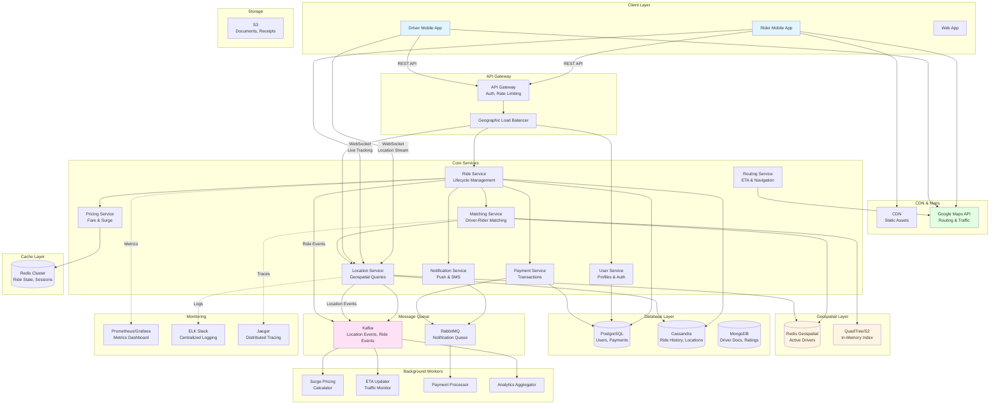

# Uber System Design

## 1. Requirements (~5 minutes)

### Functional Requirements

- ✅ Riders should be able to **request a ride** with pickup and drop-off locations
- ✅ Drivers should be able to **accept/reject ride requests**
- ✅ System should **match riders with nearby available drivers**
- ✅ Riders and drivers should see **real-time location updates** during the trip
- ✅ System should calculate **estimated time of arrival (ETA)** and **fare estimation**
- ✅ Users should be able to **view ride history** and **rate drivers**
- ✅ Drivers should be able to **update availability status** (online/offline)
- ✅ System should support **multiple ride types** (UberX, UberXL, UberPool, etc.)

### Non-functional Requirements

- ✅ The system should prioritize **availability** (riders should always get matched)
- ✅ The system should scale to support **100M+ users globally**, **10M rides/day**
- ✅ Driver matching should happen in **< 3 seconds**
- ✅ Location updates should be **near real-time** (< 5 seconds latency)
- ✅ The system should be **highly available** (99.99% uptime for core services)
- ✅ ETA calculation should be **accurate** within 10% margin
- ✅ The system should handle **peak hours** (morning/evening rush)
- ✅ Data should be **geographically distributed** for low latency
- ✅ Payment processing should be **secure and reliable**
- ✅ The system should support **surge pricing** during high demand

### Capacity Estimation

**Assumptions:**

- Total Users: 100M (riders + drivers)
- Daily Active Riders: 10M
- Daily Active Drivers: 2M
- Average rides per day: 10M
- Average ride duration: 20 minutes
- Driver location updates: Every 4 seconds
- Rider tracking during ride: Every 5 seconds

**Daily Metrics:**

```
Rides per day = 10M
Rides per second = 10M / 86400 = ~115 rides/sec

Concurrent rides (peak) = 10M × 20 min / (24 hrs × 60 min) = ~140K concurrent rides

Driver location updates = 2M drivers × (86400 / 4 sec) = 43.2B updates/day
Location update rate = 43.2B / 86400 = ~500K updates/sec

Ride tracking updates = 140K rides × 2 users × (1 update / 5 sec) = 56K updates/sec
```

**Storage:**

```
Trip data per ride = 2 KB (pickup, dropoff, fare, time, etc.)
Daily trip storage = 10M × 2 KB = 20 GB/day
Annual storage = 20 GB × 365 = 7.3 TB/year

Location history per ride = 20 min × (1 update / 4 sec) × 100 bytes = 30 KB
Daily location storage = 10M × 30 KB = 300 GB/day
Annual location storage = 300 GB × 365 = ~110 TB/year
```

**Bandwidth:**

```
Driver location upload = 500K updates/sec × 100 bytes = 50 MB/s
Rider tracking = 56K updates/sec × 100 bytes = 5.6 MB/s
Total upload = ~55 MB/s

Map data download = 140K rides × 500 KB = 70 GB concurrent
ETA queries = 115 rides/sec × 5 KB = 575 KB/s
```

---

## 2. Core Entities (~2 minutes)

### User

- `userId`, `name`, `email`, `phone`, `userType` (RIDER/DRIVER), `rating`, `createdAt`

### Driver

- `driverId`, `userId`, `vehicleId`, `currentLocation` (lat, lng), `status` (AVAILABLE/BUSY/OFFLINE), `rating`, `totalTrips`

### Vehicle

- `vehicleId`, `driverId`, `type` (ECONOMY/PREMIUM/SUV), `make`, `model`, `year`, `licensePlate`, `capacity`

### Ride

- `rideId`, `riderId`, `driverId`, `pickupLocation`, `dropoffLocation`, `status`, `requestedAt`, `acceptedAt`, `startedAt`, `completedAt`, `fare`, `distance`

### Location

- `entityId`, `entityType`, `latitude`, `longitude`, `timestamp`, `heading`, `speed`

### Payment

- `paymentId`, `rideId`, `amount`, `method`, `status`, `timestamp`

### Rating

- `ratingId`, `rideId`, `raterId`, `rateeId`, `score` (1-5), `feedback`, `timestamp`

### Pricing

- `rideType`, `baseFare`, `perKmRate`, `perMinuteRate`, `surgeFactor`, `region`

---

## 3. API Interface (~5 minutes)

### Protocol Choice

- **REST** for CRUD operations
- **WebSocket** for real-time location updates
- **gRPC** for internal microservice communication

### API Endpoints

#### Rider APIs

```http
POST /v1/rides/request
Authorization: Bearer <rider_token>
Content-Type: application/json

{
  "pickupLocation": {
    "latitude": 37.7749,
    "longitude": -122.4194,
    "address": "123 Market St, SF"
  },
  "dropoffLocation": {
    "latitude": 37.7849,
    "longitude": -122.4094,
    "address": "456 Mission St, SF"
  },
  "rideType": "UBERX",
  "paymentMethod": "CARD_1234"
}

Response: {
  "rideId": "ride-123",
  "estimatedFare": 12.50,
  "estimatedETA": 5,
  "status": "SEARCHING"
}
```

```http
GET /v1/rides/{rideId}
Authorization: Bearer <rider_token>

Response: {
  "rideId": "ride-123",
  "status": "IN_PROGRESS",
  "driver": {
    "driverId": "driver-456",
    "name": "John Doe",
    "rating": 4.8,
    "vehicle": {
      "make": "Toyota",
      "model": "Camry",
      "licensePlate": "ABC 1234"
    },
    "currentLocation": {
      "latitude": 37.7750,
      "longitude": -122.4195
    }
  },
  "estimatedArrival": "2025-10-05T10:15:00Z"
}
```

```http
PUT /v1/rides/{rideId}/cancel
Authorization: Bearer <rider_token>

{
  "reason": "Changed plans"
}

Response: {
  "success": true,
  "cancellationFee": 5.00
}
```

```http
POST /v1/rides/{rideId}/rating
Authorization: Bearer <rider_token>

{
  "score": 5,
  "feedback": "Great driver!"
}

Response: { "success": true }
```

```http
GET /v1/rides/history?page=1&limit=20
Authorization: Bearer <rider_token>

Response: {
  "rides": [Ride],
  "nextPage": 2,
  "total": 156
}
```

```http
GET /v1/fare/estimate
Authorization: Bearer <rider_token>

{
  "pickupLocation": { "latitude": 37.7749, "longitude": -122.4194 },
  "dropoffLocation": { "latitude": 37.7849, "longitude": -122.4094 },
  "rideType": "UBERX"
}

Response: {
  "estimatedFare": 12.50,
  "distance": 3.2,
  "duration": 8,
  "surgeFactor": 1.0
}
```

#### Driver APIs

```http
POST /v1/drivers/status
Authorization: Bearer <driver_token>

{
  "status": "AVAILABLE",
  "currentLocation": {
    "latitude": 37.7749,
    "longitude": -122.4194
  }
}

Response: { "success": true }
```

```http
POST /v1/drivers/location
Authorization: Bearer <driver_token>

{
  "latitude": 37.7750,
  "longitude": -122.4195,
  "heading": 90,
  "speed": 35
}

Response: { "success": true }
```

```http
GET /v1/drivers/rides/available
Authorization: Bearer <driver_token>

Response: {
  "rides": [{
    "rideId": "ride-123",
    "pickupLocation": {...},
    "dropoffLocation": {...},
    "estimatedFare": 12.50,
    "distance": 0.5,
    "estimatedPickupTime": 2
  }]
}
```

```http
POST /v1/rides/{rideId}/accept
Authorization: Bearer <driver_token>

Response: {
  "success": true,
  "rider": {
    "name": "Jane Smith",
    "phone": "+1234567890",
    "rating": 4.9
  }
}
```

```http
POST /v1/rides/{rideId}/start
Authorization: Bearer <driver_token>

Response: { "success": true, "startTime": "2025-10-05T10:10:00Z" }
```

```http
POST /v1/rides/{rideId}/complete
Authorization: Bearer <driver_token>

{
  "endLocation": {
    "latitude": 37.7849,
    "longitude": -122.4094
  }
}

Response: {
  "success": true,
  "fare": 12.50,
  "distance": 3.2
}
```

#### Admin/Analytics APIs

```http
GET /v1/analytics/supply-demand?region=SF&timestamp=now

Response: {
  "availableDrivers": 1234,
  "activeRides": 5678,
  "waitingRiders": 234,
  "surgeFactor": 1.5
}
```

```http
GET /v1/heatmap?region=SF&metric=demand

Response: {
  "cells": [{
    "geohash": "9q8yy",
    "value": 45,
    "surgeFactor": 1.8
  }]
}
```

---

## 4. Data Flow (~5 minutes)

### Ride Request Flow

1. **Rider Requests Ride**: App sends pickup/dropoff to Ride Service
2. **Fare Estimation**: Pricing Service calculates fare based on distance, time, surge
3. **Find Available Drivers**: Location Service queries drivers within radius (QuadTree/Geohash)
4. **Match Drivers**: Matching Service ranks drivers by distance, rating, acceptance rate
5. **Notify Drivers**: Push notifications sent to top 5 nearby drivers
6. **Driver Accepts**: First accepting driver gets the ride
7. **Start Navigation**: Routing Service provides turn-by-turn directions
8. **Track Location**: WebSocket streams real-time locations to rider
9. **Complete Ride**: Driver marks complete, Payment Service processes payment
10. **Rating**: Both parties rate each other

### Real-time Location Update Flow

1. **Driver App**: Sends location every 4 seconds via WebSocket
2. **Location Service**: Updates driver location in Redis and Kafka
3. **QuadTree Update**: Moves driver to new geo-cell if boundary crossed
4. **Active Ride Check**: If driver on ride, broadcast location to rider
5. **ETA Recalculation**: Update ETA based on current location and traffic
6. **Analytics**: Stream location data to analytics pipeline

---

## 5. High Level Design (~10-15 minutes)

### Architecture Components

**Client Layer:**

- Rider App (iOS/Android/Web)
- Driver App (iOS/Android)
- Real-time WebSocket connections

**API Gateway Layer:**

- API Gateway - routing, authentication, rate limiting
- Load Balancer - geographic load distribution
- CDN - static assets, maps tiles

**Service Layer (Microservices):**

- **Ride Service** - ride lifecycle management
- **Matching Service** - driver-rider matching algorithm
- **Location Service** - tracks and queries driver locations
- **Pricing Service** - fare calculation, surge pricing
- **Payment Service** - payment processing, wallet management
- **Notification Service** - push notifications, SMS
- **Routing Service** - ETA calculation, navigation
- **User Service** - user profiles, authentication
- **Analytics Service** - real-time metrics, surge detection

**Data Layer:**

- **PostgreSQL** - users, vehicles, payment methods (ACID required)
- **Cassandra** - ride history, location history (high write throughput)
- **Redis** - active driver locations, ride state, cache
- **MongoDB** - driver documents, ratings, flexible schema
- **S3** - receipts, documents, driver photos

**Geospatial Layer:**

- **Redis Geospatial** - nearby driver queries
- **Elasticsearch Geo** - historical location analysis
- **Google Maps API** - routing, traffic, ETA

**Messaging & Streaming:**

- **Kafka** - location events, ride events, analytics
- **RabbitMQ** - task queues, notifications
- **Redis Pub/Sub** - real-time location broadcasting

**Background Workers:**

- **Surge Pricing Calculator** - monitors supply/demand
- **ETA Updater** - recalculates ETAs with traffic
- **Payment Processor** - processes payments asynchronously
- **Analytics Aggregator** - computes metrics

---

## 6. Architecture Diagram



---

## 7. Data Models

### PostgreSQL - Users & Payments

```sql
users:
  id (PK) UUID,
  name VARCHAR(100),
  email VARCHAR(255) UNIQUE,
  phone VARCHAR(20) UNIQUE,
  user_type ENUM('RIDER', 'DRIVER'),
  rating DECIMAL(3,2),
  total_rides INT,
  created_at TIMESTAMP,
  updated_at TIMESTAMP

  INDEX idx_email (email)
  INDEX idx_phone (phone)

drivers:
  id (PK) UUID,
  user_id (FK -> users.id),
  vehicle_id (FK -> vehicles.id),
  status ENUM('AVAILABLE', 'BUSY', 'OFFLINE'),
  current_location GEOGRAPHY(POINT),
  rating DECIMAL(3,2),
  acceptance_rate DECIMAL(5,2),
  total_earnings DECIMAL(10,2),

  INDEX idx_status (status)
  INDEX idx_location GIST(current_location)

vehicles:
  id (PK) UUID,
  driver_id (FK -> drivers.id),
  type ENUM('ECONOMY', 'PREMIUM', 'SUV', 'LUXURY'),
  make VARCHAR(50),
  model VARCHAR(50),
  year INT,
  license_plate VARCHAR(20),
  capacity INT,
  color VARCHAR(20)

payment_methods:
  id (PK) UUID,
  user_id (FK -> users.id),
  type ENUM('CREDIT_CARD', 'DEBIT_CARD', 'WALLET', 'CASH'),
  last_four VARCHAR(4),
  is_default BOOLEAN,
  created_at TIMESTAMP

payments:
  id (PK) UUID,
  ride_id (FK -> rides.id),
  amount DECIMAL(10,2),
  method_id (FK -> payment_methods.id),
  status ENUM('PENDING', 'COMPLETED', 'FAILED', 'REFUNDED'),
  transaction_id VARCHAR(100),
  processed_at TIMESTAMP,

  INDEX idx_ride (ride_id)
  INDEX idx_status (status)
```

### Cassandra - Rides & Location History

```sql
rides:
  ride_id UUID (PK),
  rider_id UUID,
  driver_id UUID,
  pickup_lat DOUBLE,
  pickup_lng DOUBLE,
  pickup_address TEXT,
  dropoff_lat DOUBLE,
  dropoff_lng DOUBLE,
  dropoff_address TEXT,
  status TEXT,
  ride_type TEXT,
  requested_at TIMESTAMP,
  accepted_at TIMESTAMP,
  started_at TIMESTAMP,
  completed_at TIMESTAMP,
  fare DECIMAL,
  distance DOUBLE,
  duration INT,

  PRIMARY KEY (ride_id)

ride_history_by_rider:
  rider_id UUID (Partition Key),
  ride_id UUID (Clustering Key),
  completed_at TIMESTAMP (Clustering Key),
  driver_id UUID,
  fare DECIMAL,
  rating INT,

  PRIMARY KEY ((rider_id), completed_at, ride_id)
  WITH CLUSTERING ORDER BY (completed_at DESC)

ride_history_by_driver:
  driver_id UUID (Partition Key),
  ride_id UUID (Clustering Key),
  completed_at TIMESTAMP (Clustering Key),
  rider_id UUID,
  fare DECIMAL,
  earnings DECIMAL,
  rating INT,

  PRIMARY KEY ((driver_id), completed_at, ride_id)
  WITH CLUSTERING ORDER BY (completed_at DESC)

driver_locations:
  driver_id UUID (Partition Key),
  timestamp TIMESTAMP (Clustering Key),
  latitude DOUBLE,
  longitude DOUBLE,
  heading INT,
  speed DOUBLE,

  PRIMARY KEY ((driver_id), timestamp)
  WITH CLUSTERING ORDER BY (timestamp DESC)

ride_locations:
  ride_id UUID (Partition Key),
  timestamp TIMESTAMP (Clustering Key),
  driver_lat DOUBLE,
  driver_lng DOUBLE,

  PRIMARY KEY ((ride_id), timestamp)
  WITH CLUSTERING ORDER BY (timestamp DESC)
```

### Redis Data Structures

```
# Active driver locations (Geospatial)
drivers:location -> GEOADD {longitude, latitude, driverId}

# Driver status
driver:{driverId}:status -> {AVAILABLE|BUSY|OFFLINE}

# Active ride state (Hash)
ride:{rideId} -> {
  riderId, driverId, status,
  pickupLat, pickupLng, dropoffLat, dropoffLng,
  fare, startTime
}

# Ride queue for driver (List)
driver:{driverId}:ride_requests -> [rideId1, rideId2, ...]
TTL: 30 seconds

# Driver session (Hash)
session:{driverId} -> {
  websocketId, lastSeen, currentRideId
}
TTL: 1 hour

# Surge pricing by region (Hash)
surge:{regionId} -> {
  factor: 1.5,
  activeRides: 1234,
  availableDrivers: 456,
  updatedAt: timestamp
}
TTL: 5 minutes

# ETA cache (String)
eta:{pickupGeohash}:{dropoffGeohash} -> estimatedSeconds
TTL: 10 minutes
```

### MongoDB - Ratings & Documents

```javascript
// Ratings collection
{
  _id: ObjectId,
  rideId: "ride-123",
  raterId: "user-456",
  rateeId: "driver-789",
  raterType: "RIDER",
  score: 5,
  feedback: "Excellent driver!",
  tags: ["friendly", "safe_driving"],
  timestamp: ISODate("2025-10-05T10:00:00Z")
}

// Driver documents
{
  _id: ObjectId,
  driverId: "driver-789",
  documents: {
    license: {
      number: "DL123456",
      expiryDate: ISODate("2026-12-31"),
      verified: true,
      imageUrl: "s3://..."
    },
    insurance: {
      policyNumber: "INS789012",
      expiryDate: ISODate("2026-06-30"),
      verified: true
    },
    backgroundCheck: {
      status: "CLEARED",
      completedDate: ISODate("2025-01-01")
    }
  },
  earnings: {
    today: 145.50,
    thisWeek: 892.75,
    thisMonth: 3456.20
  },
  stats: {
    totalRides: 1234,
    acceptanceRate: 0.92,
    cancellationRate: 0.03,
    averageRating: 4.85
  }
}
```

---

## 8. Deep Dives (~10 minutes)

### 8.1 Geospatial Indexing & Driver Matching

**Problem**: How to efficiently find nearby drivers from millions of active drivers?

#### Approach 1: Geohashing

**Concept**: Divide world into grid cells, each with unique string identifier

```
Geohash Precision:
1 char = ±2500 km
4 chars = ±20 km
6 chars = ±0.61 km
8 chars = ±19 m

Example: San Francisco = "9q8yy"
```

**Implementation Strategy:**

```java
// When driver updates location
public void updateDriverLocation(String driverId, double lat, double lng) {
    String geohash = GeohashUtils.encode(lat, lng, 6); // 6-char precision

    // Store in Redis Geospatial
    redisTemplate.opsForGeo().add(
        "drivers:location",
        new Point(lng, lat),
        driverId
    );

    // Store geohash for quick filtering
    redisTemplate.opsForSet().add("drivers:geohash:" + geohash, driverId);
}

// Find nearby drivers
public List<Driver> findNearbyDrivers(double lat, double lng, double radiusKm) {
    // Search current cell and neighbors
    String centerGeohash = GeohashUtils.encode(lat, lng, 6);
    List<String> neighbors = GeohashUtils.getNeighbors(centerGeohash);

    Set<String> candidateDriverIds = new HashSet<>();
    for (String geohash : neighbors) {
        candidateDriverIds.addAll(
            redisTemplate.opsForSet().members("drivers:geohash:" + geohash)
        );
    }

    // Use Redis GEORADIUS for precise distance filtering
    GeoResults<RedisGeoCommands.GeoLocation<String>> results =
        redisTemplate.opsForGeo().radius(
            "drivers:location",
            new Circle(new Point(lng, lat),
                      new Distance(radiusKm, Metrics.KILOMETERS)),
            GeoRadiusCommandArgs.newGeoRadiusArgs()
                .includeDistance()
                .sortAscending()
                .limit(20)
        );

    return results.getContent().stream()
        .map(result -> getDriverDetails(result.getContent().getName()))
        .collect(Collectors.toList());
}
```

#### Approach 2: QuadTree (In-Memory)

**Concept**: Hierarchical spatial index that divides space into quadrants

**Advantages:**

- Fast in-memory queries (< 10ms)
- Efficient for dynamic updates
- Better for dense urban areas

**Structure:**

```
Each QuadTree node contains:
- Boundary (lat/lng bounds)
- Drivers in this region (up to capacity, e.g., 100)
- 4 child quadrants (NW, NE, SW, SE)

When node exceeds capacity, split into 4 children
```

**Pseudo Implementation:**

```java
class QuadTree {
    private Boundary boundary;
    private int capacity = 100;
    private List<Driver> drivers;
    private QuadTree[] children; // NW, NE, SW, SE

    public boolean insert(Driver driver) {
        if (!boundary.contains(driver.location)) return false;

        if (drivers.size() < capacity) {
            drivers.add(driver);
            return true;
        }

        if (children == null) subdivide();

        for (QuadTree child : children) {
            if (child.insert(driver)) return true;
        }
        return false;
    }

    public List<Driver> queryRange(Circle range) {
        List<Driver> found = new ArrayList<>();

        if (!boundary.intersects(range)) return found;

        for (Driver driver : drivers) {
            if (range.contains(driver.location)) {
                found.add(driver);
            }
        }

        if (children != null) {
            for (QuadTree child : children) {
                found.addAll(child.queryRange(range));
            }
        }

        return found;
    }
}
```

#### Approach 3: Google S2 (Uber's Choice)

**Why S2?**

- Handles edge cases near poles and date line
- Hierarchical cell decomposition
- Better for global coverage
- Region covering algorithms

**Key Concepts:**

```
- World divided into 6 cube faces
- Each face recursively divided into cells
- Cell IDs are 64-bit integers
- Enables efficient range queries

Cell Levels:
Level 10: ~100km²
Level 13: ~1km²
Level 15: ~100m²
```

---

### 8.2 Driver-Rider Matching Algorithm

**Goals:**

1. Minimize pickup time (rider experience)
2. Maximize driver utilization (business)
3. Fair distribution of rides (driver satisfaction)

#### Matching Strategy

**Step 1: Find Candidate Drivers**

- Query drivers within 5km radius
- Filter by availability, vehicle type, rating > 4.0

**Step 2: Rank Drivers**

```
Score = W1 × Distance + W2 × (1 - AcceptanceRate) + W3 × (1 - Rating/5)

Weights:
W1 = 0.7 (distance most important)
W2 = 0.2 (prefer reliable drivers)
W3 = 0.1 (prefer highly rated drivers)

Lower score = better match
```

**Step 3: Dispatch**

- Send ride request to top 5 drivers simultaneously
- First to accept gets the ride
- Timeout after 15 seconds, move to next batch

**Step 4: Fallback**

- If no acceptance, expand radius to 10km
- Adjust fare estimation with surge pricing
- Notify rider of longer wait time

#### Handling Edge Cases

**No Drivers Available:**

- Add rider to waiting queue
- Monitor for newly available drivers
- Send ETA updates every 30 seconds
- Option to increase offered fare

**Driver Cancellation:**

- Automatically re-match with next best driver
- Track cancellation rate, penalize habitual cancelers
- Offer compensation to rider (credit/discount)

**Rider Cancellation:**

- Free cancellation within 2 minutes
- Cancellation fee after 2 minutes
- Full fee if driver already arrived

---

### 8.3 Real-time Location Tracking

**Challenge**: Track 2M drivers sending location updates every 4 seconds = 500K updates/sec

#### WebSocket Architecture

**Connection Management:**

```java
@Component
public class LocationWebSocketHandler extends TextWebSocketHandler {

    private Map<String, WebSocketSession> driverSessions = new ConcurrentHashMap<>();

    @Override
    public void afterConnectionEstablished(WebSocketSession session) {
        String driverId = extractDriverId(session);
        driverSessions.put(driverId, session);

        // Store session info in Redis
        redisTemplate.opsForHash().put(
            "driver:sessions",
            driverId,
            session.getId()
        );
    }

    @Override
    protected void handleTextMessage(WebSocketSession session, TextMessage message) {
        LocationUpdate update = parseLocationUpdate(message);

        // Async processing - don't block WebSocket thread
        locationService.processLocationUpdate(update);
    }

    @Override
    public void afterConnectionClosed(WebSocketSession session, CloseStatus status) {
        String driverId = extractDriverId(session);
        driverSessions.remove(driverId);

        // Mark driver as offline if unexpected disconnect
        if (status.getCode() != 1000) { // Not normal closure
            driverService.markOffline(driverId);
        }
    }
}
```

**Location Processing Pipeline:**

```
1. WebSocket receives location
2. Validate & sanitize data
3. Update Redis Geospatial index (< 1ms)
4. Publish to Kafka topic (async)
5. If driver on active ride:
   - Send to rider via WebSocket
   - Update ETA calculation
6. Background: Persist to Cassandra (batch every 30s)
```

**Optimization Techniques:**

**1. Batching:**

```java
@Service
public class LocationBatchProcessor {

    private List<LocationUpdate> batch = new ArrayList<>();

    @Scheduled(fixedRate = 30000) // Every 30 seconds
    public void flushBatch() {
        if (batch.isEmpty()) return;

        // Batch write to Cassandra
        BatchStatement batchStatement = new BatchStatement();
        for (LocationUpdate update : batch) {
            batchStatement.add(createInsertStatement(update));
        }

        cassandraTemplate.execute(batchStatement);
        batch.clear();
    }
}
```

**2. Data Compression:**

- Use Protocol Buffers instead of JSON (50% size reduction)
- Delta encoding (send only changes from last position)

**3. Connection Pooling:**

- Maintain persistent WebSocket connections
- Reuse connections to reduce handshake overhead

**4. Geographic Sharding:**

- Route drivers to nearest data center
- San Francisco drivers → US-West servers
- New York drivers → US-East servers

---

### 8.4 ETA Calculation & Routing

**Components:**

#### 1. Static Route Calculation

```
Input: Pickup location, Dropoff location
Output: Distance, Estimated time, Route polyline

Uses: Google Maps Directions API / OSRM (Open Source Routing Machine)
```

#### 2. Real-time Traffic Integration

**Approach:**

- Query current traffic conditions from Maps API
- Apply traffic multiplier to base ETA
- Cache frequent routes (15-minute TTL)

**Formula:**

```
ETA = (Distance / AverageSpeed) × TrafficMultiplier

Where:
AverageSpeed = Historical average for this route at this time
TrafficMultiplier = Current traffic / Normal traffic (1.0 - 3.0)
```

#### 3. Historical Data Learning

**Strategy:**

- Store actual vs. estimated times for completed rides
- Train ML model to predict corrections
- Apply learned adjustments to future ETAs

**Features for ML Model:**

- Route distance and duration
- Time of day, day of week
- Weather conditions
- Local events (concerts, sports games)
- Historical traffic patterns

#### 4. Continuous ETA Updates

**During Ride:**

```java
@Scheduled(fixedRate = 30000) // Every 30 seconds
public void updateActiveRideETAs() {
    List<ActiveRide> rides = getActiveRides();

    rides.parallelStream().forEach(ride -> {
        Location currentLocation = ride.getDriver().getCurrentLocation();
        Location destination = ride.getDropoffLocation();

        // Recalculate with current position
        ETA newETA = routingService.calculateETA(
            currentLocation,
            destination,
            true // includeTraffic
        );

        // Update rider if significant change (> 2 minutes)
        if (Math.abs(newETA.getMinutes() - ride.getCurrentETA()) > 2) {
            notificationService.sendETAUpdate(ride.getRiderId(), newETA);
            ride.setCurrentETA(newETA.getMinutes());
        }
    });
}
```

---

### 8.5 Surge Pricing Algorithm

**Goal**: Balance supply and demand by adjusting prices dynamically

#### Supply-Demand Calculation

**Per Geographic Cell (every 1-2 minutes):**

```java
@Scheduled(fixedRate = 120000) // Every 2 minutes
public void calculateSurgePricing() {
    List<String> regions = getAllRegions(); // Major cities divided into grids

    regions.parallelStream().forEach(regionId -> {
        // Count available drivers in region
        long availableDrivers = locationService.countDriversInRegion(
            regionId,
            DriverStatus.AVAILABLE
        );

        // Count active rides
        long activeRides = rideService.countActiveRidesInRegion(regionId);

        // Count waiting ride requests
        long waitingRequests = rideService.countWaitingRequestsInRegion(regionId);

        // Calculate demand
        long demand = activeRides + waitingRequests;

        // Calculate surge factor
        double surgeFactor = calculateSurgeFactor(availableDrivers, demand);

        // Store in Redis
        redisTemplate.opsForHash().put(
            "surge:factors",
            regionId,
            surgeFactor
        );

        // Notify riders in region about surge
        if (surgeFactor > 1.5) {
            notificationService.notifySurgeInRegion(regionId, surgeFactor);
        }
    });
}

private double calculateSurgeFactor(long supply, long demand) {
    if (supply == 0) return 3.0; // Max surge

    double ratio = (double) demand / supply;

    if (ratio < 1.0) return 1.0;      // No surge
    else if (ratio < 1.5) return 1.2;
    else if (ratio < 2.0) return 1.5;
    else if (ratio < 3.0) return 2.0;
    else if (ratio < 4.0) return 2.5;
    else return 3.0;                   // Max surge
}
```

#### Surge Notification Strategy

**Transparent Communication:**

- Show surge multiplier before requesting
- Explain why surge is active ("High demand in your area")
- Offer alternatives (wait for lower price, try different pickup location)

**Gradual Rollout:**

- Don't apply full surge immediately
- Ramp up over 5-10 minutes to avoid shock
- Helps regulate demand naturally

**Geographic Boundaries:**

- Avoid sharp surge boundaries
- Smooth transitions between regions
- Suggest nearby lower-surge pickup locations

---

### 8.6 Payment Processing

**Flow:**

#### 1. Pre-authorization

```
When ride starts:
- Put hold on rider's payment method
- Amount = Estimated fare × 1.5 (buffer for longer routes)
- Hold released after final charge
```

#### 2. Fare Calculation

```
Final Fare = BaseFare + (Distance × PerKmRate) + (Duration × PerMinuteRate) × SurgeFactor

Additional charges:
- Toll fees (auto-detected via GPS)
- Airport fees
- Cancellation fee
- Tips (optional)
```

#### 3. Payment Execution (Async)

```java
@Service
public class PaymentService {

    public void processRidePayment(String rideId) {
        Ride ride = rideRepository.findById(rideId);

        PaymentRequest request = PaymentRequest.builder()
            .rideId(rideId)
            .amount(ride.getFare())
            .riderId(ride.getRiderId())
            .paymentMethodId(ride.getPaymentMethodId())
            .build();

        // Send to payment queue (non-blocking)
        kafkaTemplate.send("payment-requests", request);
    }
}

@KafkaListener(topics = "payment-requests")
public void processPaymentAsync(PaymentRequest request) {
    try {
        // Call payment gateway (Stripe/Braintree)
        PaymentResponse response = paymentGateway.charge(
            request.getPaymentMethodId(),
            request.getAmount(),
            request.getRideId()
        );

        if (response.isSuccess()) {
            // Update payment status
            paymentRepository.markCompleted(
                request.getRideId(),
                response.getTransactionId()
            );

            // Calculate driver earnings (deduct commission)
            double commission = request.getAmount() * 0.25; // 25% commission
            double driverEarnings = request.getAmount() - commission;

            // Update driver balance
            driverWalletService.credit(
                request.getDriverId(),
                driverEarnings
            );

            // Send receipt
            receiptService.sendReceipt(request.getRideId());

        } else {
            // Retry logic
            handlePaymentFailure(request);
        }

    } catch (Exception e) {
        // Dead letter queue for manual review
        kafkaTemplate.send("payment-failures", request);
    }
}
```

#### 4. Retry & Failure Handling

```
Retry Strategy:
- Attempt 1: Immediate
- Attempt 2: After 5 minutes
- Attempt 3: After 1 hour
- Attempt 4: After 24 hours

If all fail:
- Mark account with outstanding balance
- Block future rides until payment resolved
- Send notifications to update payment method
```

#### 5. Driver Payouts

```
Options:
- Instant payout (within 30 minutes, 1% fee)
- Daily automatic transfer (free)
- Weekly transfer (default)

Security:
- Bank account verification required
- Anti-fraud checks
- Minimum payout threshold ($10)
```

---

### 8.7 Notification System

**Types of Notifications:**

#### 1. Push Notifications (Mobile)

**High Priority (Immediate):**

- Ride request for drivers
- Driver accepted ride (for riders)
- Driver arrived at pickup
- Ride started/completed

**Medium Priority (Can be delayed 10-30s):**

- ETA updates
- Surge pricing alerts
- Payment confirmations

**Low Priority (Batch):**

- Promotional offers
- Weekly summaries
- Rating reminders

#### 2. SMS Notifications

**When to use:**

- Critical updates if app not active
- Verification codes
- Emergency situations
- Payment failures

#### 3. In-App Notifications

**Real-time updates:**

- Driver location on map
- Chat messages
- Route changes

**Implementation:**

```java
@Service
public class NotificationService {

    public void notifyDriverOfRideRequest(String driverId, Ride ride) {
        // Multi-channel approach

        // 1. Push notification (primary)
        PushNotification push = PushNotification.builder()
            .title("New Ride Request")
            .body(String.format("Pickup in %d min", ride.getPickupETA()))
            .data(Map.of("rideId", ride.getRideId(), "type", "RIDE_REQUEST"))
            .priority("high")
            .ttl(15) // 15 seconds to accept
            .build();

        fcmService.send(driverId, push);

        // 2. WebSocket (if connected)
        if (websocketService.isConnected(driverId)) {
            websocketService.send(driverId, ride);
        }

        // 3. SMS fallback (if no response in 10 seconds)
        scheduler.schedule(() -> {
            if (!rideService.isAccepted(ride.getRideId())) {
                smsService.send(
                    getDriverPhone(driverId),
                    "You have a new ride request. Open app to accept."
                );
            }
        }, 10, TimeUnit.SECONDS);
    }
}
```

**Notification Preferences:**

```
Allow users to configure:
- Notification types to receive
- Quiet hours (no promotional messages)
- Channel preferences (push vs. SMS vs. email)
```

---

### 8.8 Fraud Detection & Safety

#### 1. Fraud Detection

**Common Fraud Patterns:**

- GPS spoofing (fake location)
- Account sharing
- Fake rides (driver and rider collude)
- Payment fraud (stolen cards)
- Promotional code abuse

**Detection Mechanisms:**

```java
@Service
public class FraudDetectionService {

    public FraudScore evaluateRide(Ride ride) {
        double score = 0.0;
        List<String> flags = new ArrayList<>();

        // Check 1: Impossible speed
        if (ride.getAverageSpeed() > 150) { // km/h
            score += 0.3;
            flags.add("IMPOSSIBLE_SPEED");
        }

        // Check 2: GPS jumps
        List<Location> path = getLocationHistory(ride);
        if (hasGPSJumps(path)) {
            score += 0.4;
            flags.add("GPS_ANOMALY");
        }

        // Check 3: Route deviation
        double deviation = calculateRouteDeviation(ride);
        if (deviation > 0.5) { // 50% longer than optimal
            score += 0.2;
            flags.add("ROUTE_DEVIATION");
        }

        // Check 4: Unusual timing
        if (ride.getDuration() < 2 && ride.getDistance() > 10) {
            score += 0.5;
            flags.add("TIMING_MISMATCH");
        }

        // Check 5: Account behavior
        if (isNewAccount(ride.getRiderId()) && ride.getFare() > 100) {
            score += 0.2;
            flags.add("NEW_ACCOUNT_HIGH_FARE");
        }

        return FraudScore.builder()
            .score(score)
            .flags(flags)
            .action(score > 0.7 ? "BLOCK" : score > 0.4 ? "REVIEW" : "ALLOW")
            .build();
    }
}
```

**Actions:**

- Score < 0.4: Allow
- Score 0.4-0.7: Flag for manual review
- Score > 0.7: Block payment, investigate account

#### 2. Safety Features

**Real-time Safety:**

- Share trip with friends/family
- Emergency button (contacts police/emergency services)
- In-app safety toolkit
- Two-way ratings
- Background checks for drivers

**Trip Monitoring:**

```java
@Service
public class SafetyMonitoringService {

    @Scheduled(fixedRate = 60000) // Every minute
    public void monitorActiveTripsSafety() {
        List<Ride> activeRides = rideService.getActiveRides();

        activeRides.forEach(ride -> {
            // Check for unusual stops
            if (hasUnexpectedStop(ride)) {
                alertSafetyTeam(ride, "UNEXPECTED_STOP");
            }

            // Check for route deviation
            if (isOffRoute(ride)) {
                notifyRider(ride.getRiderId(), "Your driver took a different route");
            }

            // Check for extended duration
            if (isOvertime(ride)) {
                alertSafetyTeam(ride, "EXTENDED_DURATION");
            }
        });
    }
}
```

**Driver Verification:**

- Government-issued ID
- Background check (criminal record)
- Driving record check
- Vehicle inspection
- Insurance verification
- Annual re-verification

---

### 8.9 Analytics & Business Intelligence

#### Real-time Dashboards

**Operations Dashboard:**

```
Metrics displayed:
- Active rides (current moment)
- Available drivers by region
- Average wait time
- Surge pricing heatmap
- System health (API latency, error rates)
```

**Business Metrics:**

```
- Gross booking value (GBV)
- Take rate (commission %)
- Customer acquisition cost (CAC)
- Lifetime value (LTV)
- Driver churn rate
- Rider retention rate
```

#### Data Pipeline

```
Real-time Stream:
Location events → Kafka → Spark Streaming → Redis/Dashboard

Batch Processing:
Ride events → Kafka → S3 (data lake) → Spark → Data Warehouse
                                       ↓
                                    ML Training
```

**Analytics Queries:**

```sql
-- Most profitable routes
SELECT
  pickup_location,
  dropoff_location,
  AVG(fare) as avg_fare,
  COUNT(*) as ride_count,
  SUM(fare) as total_revenue
FROM rides
WHERE completed_at > NOW() - INTERVAL '30 days'
GROUP BY pickup_location, dropoff_location
ORDER BY total_revenue DESC
LIMIT 100;

-- Driver performance
SELECT
  driver_id,
  COUNT(*) as total_rides,
  AVG(rating) as avg_rating,
  AVG(acceptance_rate) as acceptance_rate,
  SUM(earnings) as total_earnings
FROM driver_stats
WHERE date >= CURRENT_DATE - 7
GROUP BY driver_id
HAVING total_rides > 20
ORDER BY avg_rating DESC;
```

#### Machine Learning Applications

**1. Demand Prediction:**

- Predict ride requests for next hour by region
- Proactively position drivers
- Optimize driver supply

**2. Dynamic Pricing:**

- ML model predicts optimal surge factor
- Considers: weather, events, historical patterns
- Maximizes revenue while maintaining service quality

**3. ETA Prediction:**

- Improve accuracy over time
- Learn from actual vs. estimated times
- Factor in local patterns

**4. Fraud Detection:**

- Anomaly detection models
- Pattern recognition
- Risk scoring

**5. Driver-Rider Matching:**

- Predict best matches
- Optimize for completion rate
- Minimize cancellations

---

### 8.10 Scalability & Performance Optimizations

#### Database Sharding

**PostgreSQL (Users & Payments):**

```
Shard Key: user_id (hash-based)

Shard 1: user_id % 10 = 0
Shard 2: user_id % 10 = 1
...
Shard 10: user_id % 10 = 9

Benefits:
- Distribute write load
- Parallel query execution
- Isolate failures
```

**Cassandra (Rides & Locations):**

```
Partition Key: rider_id or driver_id
Clustering Key: timestamp

Natural sharding by design
- Each user's data on separate partition
- Time-based ordering within partition
- Efficient range queries
```

#### Caching Strategy

**Multi-Level Cache:**

```
L1: Application Cache (Caffeine)
    - Driver details
    - Vehicle info
    - User profiles
    TTL: 5 minutes, Size: 10K entries

L2: Distributed Cache (Redis)
    - Active ride states
    - Driver locations
    - Surge pricing
    TTL: Varies by data type

L3: CDN (CloudFront)
    - Map tiles
    - Static assets
    - Profile images
    TTL: 24 hours
```

**Cache Warming:**

```java
@Scheduled(cron = "0 0 * * * *") // Every hour
public void warmCache() {
    // Pre-load top active drivers
    List<String> activeDriverIds = driverService.getTopActiveDrivers(1000);

    activeDriverIds.forEach(driverId -> {
        Driver driver = driverRepository.findById(driverId);
        redisTemplate.opsForValue().set(
            "driver:" + driverId,
            driver,
            1,
            TimeUnit.HOURS
        );
    });
}
```

#### Read Replicas

**PostgreSQL:**

- 1 Primary (writes)
- 5 Read Replicas (reads)
- Route reads to nearest replica

**Geographic Distribution:**

- US-East: 2 replicas
- US-West: 2 replicas
- EU-West: 1 replica

#### Connection Pooling

```java
// HikariCP configuration
spring.datasource.hikari.maximum-pool-size=100
spring.datasource.hikari.minimum-idle=20
spring.datasource.hikari.connection-timeout=30000
spring.datasource.hikari.idle-timeout=600000
spring.datasource.hikari.max-lifetime=1800000
```

#### API Rate Limiting

```
Per User Tier:
- Free tier: 100 requests/minute
- Driver: 500 requests/minute
- Internal services: No limit

Per Endpoint:
- POST /rides/request: 10/minute per user
- GET /rides/{id}: 100/minute per user
- POST /drivers/location: Unlimited (critical path)
```

#### Load Balancing

**Geographic Routing:**

```
DNS-based routing:
- us-west.uber.com → US-West data center
- us-east.uber.com → US-East data center
- eu.uber.com → EU data center

Latency-based routing:
- Route to nearest healthy endpoint
- Automatic failover on outage
```

**Service Mesh (Istio):**

- Automatic load balancing
- Circuit breaking
- Retry logic
- Canary deployments

---

### 8.11 Disaster Recovery & High Availability

#### Multi-Region Architecture

**Active-Active Setup:**

```
Region 1 (US-West):
- Primary for West Coast users
- Handles 40% of traffic
- Full replica of databases

Region 2 (US-East):
- Primary for East Coast users
- Handles 40% of traffic
- Full replica of databases

Region 3 (EU-West):
- Primary for European users
- Handles 20% of traffic
- Full replica of databases
```

**Cross-Region Replication:**

```
PostgreSQL:
- Streaming replication (async)
- RPO: 5 seconds
- RTO: 2 minutes (automatic failover)

Cassandra:
- Multi-datacenter setup
- Consistency: LOCAL_QUORUM
- Automatic data distribution

Redis:
- Redis Cluster with replicas
- Sentinel for automatic failover
```

#### Backup Strategy

**Database Backups:**

```
- Full backup: Daily at 2 AM
- Incremental: Every 4 hours
- Point-in-time recovery: 30 days
- Geographic replication: 3 regions
- Retention: 90 days
```

**Critical Data:**

```
- User accounts: 3 copies across regions
- Payment methods: Encrypted, 5 copies
- Ride history: 2 copies + cold storage (S3 Glacier)
- Location history: 1 copy + cold storage after 90 days
```

#### Failover Procedures

**Database Failover:**

```
1. Health check detects failure
2. Promote read replica to primary (automatic)
3. Update DNS/load balancer
4. Redirect writes to new primary
5. Alert operations team

Total time: < 2 minutes
```

**Service Failover:**

```
1. Circuit breaker detects service failure
2. Route traffic to healthy instances
3. Auto-scale replacement instances
4. Monitor recovery

Total time: < 30 seconds
```

---

## Summary

### Key Design Decisions

1. **Geospatial Indexing**: Redis Geospatial + S2 cells for efficient driver queries
2. **Real-time Communication**: WebSocket for location updates, push notifications
3. **Event-Driven Architecture**: Kafka for location events, ride events, payments
4. **Polyglot Persistence**: PostgreSQL (transactional), Cassandra (time-series), Redis (real-time)
5. **Geographic Sharding**: Route users to nearest data center for low latency
6. **Async Payment Processing**: Non-blocking payment flow with retry logic
7. **Dynamic Pricing**: Real-time surge calculation based on supply-demand
8. **Hybrid Matching**: Combine distance, ratings, acceptance rate for optimal matching

### Scalability Achieved

- ✅ 100M users, 10M rides/day
- ✅ Driver matching in < 3 seconds
- ✅ 500K location updates/second
- ✅ Real-time tracking with < 5s latency
- ✅ 99.99% uptime for core services
- ✅ Global presence with multi-region deployment

---

## Trade-offs & Considerations

| Decision                   | Pro                            | Con                                         |
| -------------------------- | ------------------------------ | ------------------------------------------- |
| WebSocket for locations    | Real-time updates, low latency | Stateful connections, scaling complexity    |
| Redis Geospatial           | Fast queries (< 10ms)          | Limited to 2D coordinates, memory intensive |
| Async payment processing   | Non-blocking, better UX        | Eventual consistency, retry complexity      |
| Multi-region active-active | Low latency globally, HA       | Data consistency challenges, higher cost    |
| Cassandra for locations    | High write throughput          | Eventually consistent, limited queries      |
| Surge pricing              | Balances supply-demand         | Potential rider dissatisfaction             |
| GPS tracking               | Accurate routing, safety       | Privacy concerns, battery drain             |

---

## Future Enhancements

1. **Autonomous Vehicles**: Integration with self-driving car fleets
2. **Uber Air**: Flying taxi services (VTOL aircraft)
3. **Multi-modal Transport**: Combine ride-hailing with public transit, bikes, scooters
4. **Subscription Plans**: Unlimited rides for flat monthly fee
5. **Carbon Neutral Rides**: EV prioritization, carbon offset programs
6. **Advanced Safety**: AI-powered incident detection, dashcam integration
7. **Blockchain Payments**: Cryptocurrency support, smart contracts
8. **Predictive Pickup**: AI suggests optimal pickup time and location
9. **Shared Autonomous Shuttles**: Fixed routes with dynamic stops
10. **Healthcare Rides**: Non-emergency medical transport integration

---

## Additional Considerations

### Data Privacy & Compliance

**GDPR Compliance:**

- Right to data portability (export user data)
- Right to be forgotten (delete user data)
- Consent for location tracking
- Encrypted data storage

**Location Privacy:**

- Anonymize historical location data after 7 days
- Truncate precise coordinates for analytics
- Allow users to delete location history
- Transparent privacy policy

### Accessibility Features

- Voice-guided navigation for visually impaired drivers
- Wheelchair-accessible vehicle options
- Deaf/hard-of-hearing communication tools
- Multiple language support (100+ languages)
- Text-to-speech for notifications

### Environmental Impact

**Sustainability Initiatives:**

- Electric vehicle incentives for drivers
- Carbon footprint tracking
- Green ride options (EVs only)
- Ride-sharing to reduce emissions (UberPool)
- Offset programs for carbon-neutral rides
